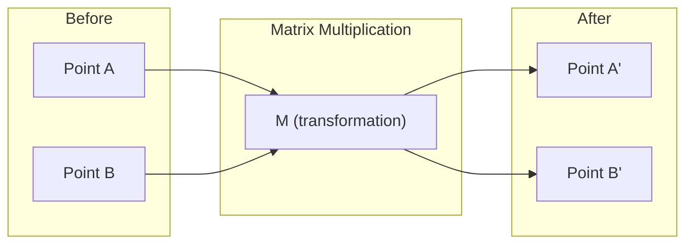
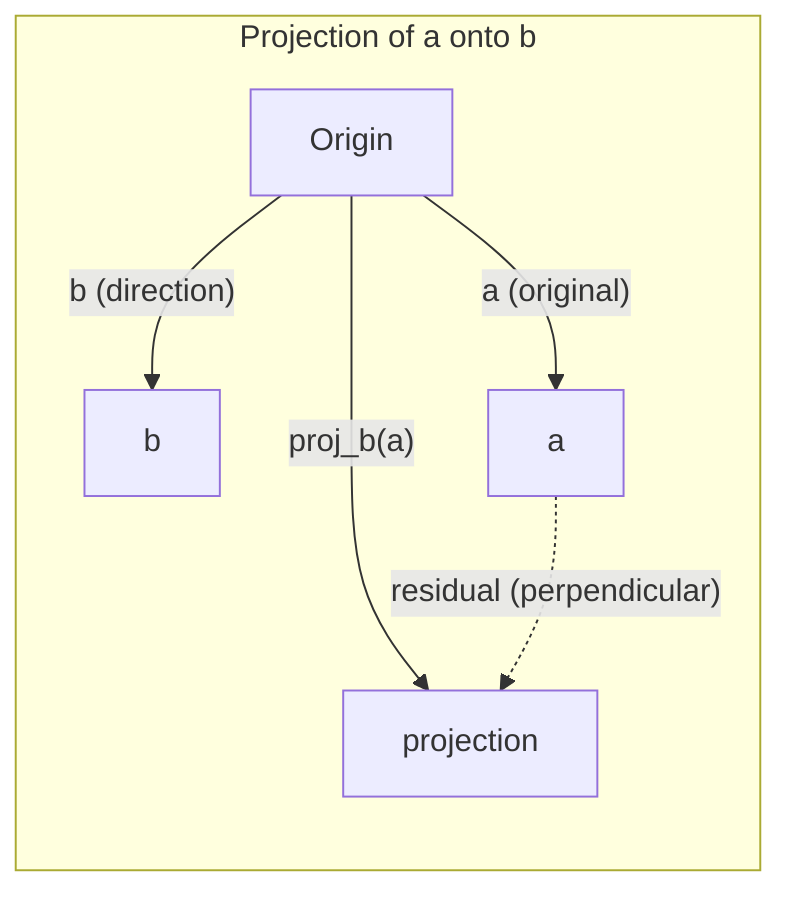

<!-- i18n:manual -->

# Интуиция линейной алгебры

> Любая AI-модель — это матричная арифметика в модной шляпе.

**Type:** Learn
**Languages:** Python, Julia
**Prerequisites:** Phase 0
**Time:** ~60 minutes

## Learning Objectives

- Реализовать операции над векторами и матрицами (сложение, скалярное произведение, умножение матриц) с нуля на Python
- Объяснить геометрический смысл скалярного произведения, проекции и процесса Gram-Schmidt
- Определить линейную независимость, ранг и базис набора векторов через приведение строк
- Связать понятия линейной алгебры с их применением в AI: embeddings, attention scores и LoRA

> 🎒 **На пальцах.** Весь урок про одну вещь: точки в пространстве и правила, которые эти точки двигают. Точка — это вектор. Правило — это матрица. Всё остальное — детали.

## The Problem

Откройте любую ML-статью. Уже на первой странице вы увидите векторы, матрицы, скалярные произведения и преобразования. Без интуиции линейной алгебры это просто символы. С ней — вы видите, что нейросеть на самом деле делает: двигает точки в пространстве.

Не нужно быть математиком. Нужно увидеть геометрический смысл этих операций, а потом запрограммировать их самому.

> 🎒 **На пальцах.** Представьте карту сокровищ в клеточку. Каждый предмет на карте — пара чисел «сколько вправо, сколько вверх». Формулы в статьях — это инструкции вида «сдвинь все предметы на карте вот так». Страшные значки, простое действие.

## The Concept

### Vectors Are Points (and Directions)

Вектор — это просто список чисел. Но эти числа что-то значат: они координаты в пространстве.

**2D vector [3, 2]:**


| x   | y   | Point                                                                  |
| --- | --- | ---------------------------------------------------------------------- |
| 3   | 2   | Вектор указывает из начала координат (0,0) в точку (3, 2) на плоскости |


Длина вектора равна sqrt(3^2 + 2^2) = sqrt(13), и он направлен вправо и вверх.

В AI векторы представляют всё:

- Слово → вектор из 768 чисел (его «смысл» в embedding-пространстве)
- Изображение → вектор из миллионов значений пикселей
- Пользователь → вектор предпочтений

> 🎒 **На пальцах.** Вектор [3, 2] — это «3 шага вправо, 2 шага вверх» от входа в парк. Длина — это расстояние по прямой от входа до вас, если бы вы шли не по дорожкам, а напрямик через газон: sqrt(3² + 2²) = sqrt(13) ≈ 3.6 шага. Направление — куда именно вы ушли.

### Matrices Are Transformations

Матрица преобразует один вектор в другой. Она может поворачивать, масштабировать, растягивать или проецировать.



В AI матрицы — это и ЕСТЬ модель:

- Веса нейросети → матрицы, преобразующие вход в выход
- Attention scores → матрицы, решающие, на что смотреть
- Embeddings → матрицы, сопоставляющие словам векторы

> 🎒 **На пальцах.** Матрица — это правило игры, одинаковое для всех точек сразу. Правило «удвоить каждый шаг»: было [3, 2] — стало [6, 4]. Правило «повернуть на 90° влево»: было [3, 1] — стало [-1, 3]. Вы не двигаете каждую точку руками, вы один раз объявляете правило, и оно применяется ко всем.

### The Dot Product Measures Similarity

Скалярное произведение двух векторов говорит, насколько они похожи.

```
a · b = a₁×b₁ + a₂×b₂ + ... + aₙ×bₙ

Same direction:      a · b > 0  (similar)
Perpendicular:       a · b = 0  (unrelated)
Opposite direction:  a · b < 0  (dissimilar)
```

Именно так буквально и работают поисковые системы, рекомендательные системы и RAG — они ищут векторы с высоким скалярным произведением.

> 🎒 **На пальцах.** Два человека идут по полю. Скалярное произведение — ответ на вопрос «они идут в одну сторону?». Считаем на пальцах: a = [2, 0] (иду вправо), b = [3, 0] (тоже вправо) → 2×3 + 0×0 = 6, больше нуля, значит по пути. Теперь b = [0, 5] (иду вверх) → 2×0 + 0×5 = 0, дороги перпендикулярны, ничего общего. А b = [-3, 0] (иду влево) → 2×(-3) = -6, минус, значит навстречу. Так же YouTube решает, похоже ли новое видео на те, что вы уже смотрели.

### Linear Independence

Векторы линейно независимы, если ни один вектор набора нельзя записать как комбинацию остальных. Если v1, v2, v3 независимы, они натягивают трёхмерное пространство. Если один из них — комбинация других, они натягивают только плоскость.

Почему это важно для AI: у матрицы признаков столбцы должны быть линейно независимы. Если два признака идеально скоррелированы (линейно зависимы), модель не может различить их вклад. Это вызывает мультиколлинеарность в регрессии — матрица весов становится неустойчивой, и малые изменения на входе дают дикие скачки на выходе.

**Concrete example:**

```
v1 = [1, 0, 0]
v2 = [0, 1, 0]
v3 = [2, 1, 0]   # v3 = 2*v1 + v2
```

v1 и v2 независимы — ни один не является скалярным кратным или комбинацией другого. Но v3 = 2*v1 + v2, поэтому набор {v1, v2, v3} зависим. Все три вектора лежат в плоскости xy. Как их ни комбинируй, до [0, 0, 1] не добраться. У вас три вектора, но всего две степени свободы.

В наборе данных: если feature_3 = 2*feature_1 + feature_2, то добавление feature_3 не даёт модели ни грамма новой информации. Хуже того, это делает нормальные уравнения вырожденными — единственного решения для весов не существует.

> 🎒 **На пальцах.** Вам дали три «новых» указания, как дойти до дома: «2 шага на восток», «1 шаг на север» и «2 шага на восток и 1 на север». Третье — не новое, это просто первые два вместе. Оно линейно зависимо. И заметьте: сколько ни ходи по этим трём указаниям, вы никогда не подниметесь на второй этаж — все они держат вас на земле. Ровно поэтому лишний признак в таблице данных («рост в сантиметрах» и «рост в метрах») модели ничего не добавляет, а только ломает её.

### Basis and Rank

Базис — это минимальный набор линейно независимых векторов, натягивающий всё пространство. Число векторов базиса равно размерности пространства.

Стандартный базис трёхмерного пространства — {[1,0,0], [0,1,0], [0,0,1]}. Но любые три независимых вектора в 3D образуют корректный базис. Выбор базиса — это выбор системы координат.

Ранг матрицы = число линейно независимых столбцов = число линейно независимых строк. Если ранг &lt; min(строки, столбцы), матрица неполноранговая. Это значит:

- У системы бесконечно много решений (или ни одного)
- В преобразовании теряется информация
- Матрицу нельзя обратить


| Situation                                     | Rank                  | What it means for ML                                                                                                               |
| --------------------------------------------- | --------------------- | ---------------------------------------------------------------------------------------------------------------------------------- |
| Полный ранг (rank = min(m, n))                | Максимально возможный | Существует единственное решение методом наименьших квадратов. Модель хорошо обусловлена.                                           |
| Неполный ранг (rank &lt; min(m, n))           | Ниже максимума        | Признаки избыточны. Бесконечно много решений для весов. Нужна регуляризация.                                                       |
| Ранг 1                                        | 1                     | Каждый столбец — масштабированная копия одного вектора. Все данные лежат на прямой.                                                |
| Почти неполный ранг (малые сингулярные числа) | Численно низкий       | Матрица плохо обусловлена. Крошечный шум на входе даёт большие изменения на выходе. Используйте усечение SVD или ridge regression. |


> 🎒 **На пальцах.** Базис — минимальный набор кнопок на пульте, которым всё равно можно управлять всем. Для комнаты хватает трёх: «вправо», «вперёд», «вверх». Четвёртая кнопка «вправо-вперёд» — лишняя, она делается первыми двумя. Ранг — сколько по-настоящему разных кнопок у вас на пульте. Если у пульта 5 кнопок, но три из них дублируют друг друга, ранг = 3, и до потолка вы всё ещё не дотянетесь.

### Projection

Проекция вектора **a** на вектор **b** даёт составляющую **a** в направлении **b**:

```
proj_b(a) = (a dot b / b dot b) * b
```

Остаток (a - proj_b(a)) перпендикулярен b. Это ортогональное разложение — фундамент метода наименьших квадратов.

Проекции в ML повсюду:

- Линейная регрессия минимизирует расстояние от наблюдений до пространства столбцов — само решение ЕСТЬ проекция
- PCA проецирует данные на направления максимальной дисперсии
- Attention в трансформерах вычисляет проекции queries на keys



**Example:** a = [3, 4], b = [1, 0]

proj_b(a) = (3*1 + 4*0) / (1*1 + 0*0) * [1, 0] = 3 * [1, 0] = [3, 0]

Проекция отбрасывает y-составляющую. Это снижение размерности в простейшем виде — выбросить те направления, которые вам не важны.

> 🎒 **На пальцах.** Проекция — это тень. Солнце ровно сверху, вы стоите с воздушным змеем на палке: палка [3, 4] (3 вправо, 4 вверх), земля — направление [1, 0]. Тень палки на земле — [3, 0]: длина 3, высота потерялась. Проекция всегда что-то теряет — и в этом её смысл: оставить только то измерение, которое вам сейчас нужно.

### Gram-Schmidt Process

Превращение любого набора независимых векторов в ортонормированный базис. Ортонормированный означает: длина каждого вектора равна 1, и каждая пара перпендикулярна.

Алгоритм:

1. Взять первый вектор, нормировать его
2. Взять второй вектор, вычесть его проекцию на первый, нормировать
3. Взять третий вектор, вычесть его проекции на все предыдущие, нормировать
4. Повторить для оставшихся векторов

```
Input:  v1, v2, v3, ... (linearly independent)

u1 = v1 / |v1|

w2 = v2 - (v2 dot u1) * u1
u2 = w2 / |w2|

w3 = v3 - (v3 dot u1) * u1 - (v3 dot u2) * u2
u3 = w3 / |w3|

Output: u1, u2, u3, ... (orthonormal basis)
```

Именно так внутри работает QR-разложение. Q — это ортонормированный базис, R хранит коэффициенты проекций. QR-разложение применяется в:

- Решении линейных систем (устойчивее гауссова исключения)
- Вычислении собственных значений (QR-алгоритм)
- Регрессии наименьших квадратов (стандартный численный метод)

> 🎒 **На пальцах.** Вам дали три кривые палки и просят сделать из них аккуратный угол комнаты — три перпендикулярные линейки длиной ровно 1. Первую палку просто обрезаете до длины 1. У второй отпиливаете ту часть, что «повторяет» первую (это её тень на первой), остаток обрезаете до 1. У третьей отпиливаете всё, что повторяет первые две. Итог — идеальный уголок. Компьютеру такой уголок нужен потому, что в нём арифметика не накапливает ошибку.

```figure
eigen-directions
```

## Build It

### Step 1: Vectors from scratch (Python)

```python
class Vector:
    def __init__(self, components):
        self.components = list(components)
        self.dim = len(self.components)

    def __add__(self, other):
        return Vector([a + b for a, b in zip(self.components, other.components)])

    def __sub__(self, other):
        return Vector([a - b for a, b in zip(self.components, other.components)])

    def dot(self, other):
        return sum(a * b for a, b in zip(self.components, other.components))

    def magnitude(self):
        return sum(x**2 for x in self.components) ** 0.5

    def normalize(self):
        mag = self.magnitude()
        return Vector([x / mag for x in self.components])

    def cosine_similarity(self, other):
        return self.dot(other) / (self.magnitude() * other.magnitude())

    def __repr__(self):
        return f"Vector({self.components})"


a = Vector([1, 2, 3])
b = Vector([4, 5, 6])

print(f"a + b = {a + b}")
print(f"a · b = {a.dot(b)}")
print(f"|a| = {a.magnitude():.4f}")
print(f"cosine similarity = {a.cosine_similarity(b):.4f}")
```

### Step 2: Matrices from scratch (Python)

```python
class Matrix:
    def __init__(self, rows):
        self.rows = [list(row) for row in rows]
        self.shape = (len(self.rows), len(self.rows[0]))

    def __matmul__(self, other):
        if isinstance(other, Vector):
            return Vector([
                sum(self.rows[i][j] * other.components[j] for j in range(self.shape[1]))
                for i in range(self.shape[0])
            ])
        rows = []
        for i in range(self.shape[0]):
            row = []
            for j in range(other.shape[1]):
                row.append(sum(
                    self.rows[i][k] * other.rows[k][j]
                    for k in range(self.shape[1])
                ))
            rows.append(row)
        return Matrix(rows)

    def transpose(self):
        return Matrix([
            [self.rows[j][i] for j in range(self.shape[0])]
            for i in range(self.shape[1])
        ])

    def __repr__(self):
        return f"Matrix({self.rows})"


rotation_90 = Matrix([[0, -1], [1, 0]])
point = Vector([3, 1])

rotated = rotation_90 @ point
print(f"Original: {point}")
print(f"Rotated 90°: {rotated}")
```

### Step 3: Why this matters for AI

```python
import random

random.seed(42)
weights = Matrix([[random.gauss(0, 0.1) for _ in range(3)] for _ in range(2)])
input_vector = Vector([1.0, 0.5, -0.3])

output = weights @ input_vector
print(f"Input (3D): {input_vector}")
print(f"Output (2D): {output}")
print("This is what a neural network layer does -- matrix multiplication.")
```

### Step 4: Julia version

```julia
a = [1.0, 2.0, 3.0]
b = [4.0, 5.0, 6.0]

println("a + b = ", a + b)
println("a · b = ", a ⋅ b)       # Julia supports unicode operators
println("|a| = ", √(a ⋅ a))
println("cosine = ", (a ⋅ b) / (√(a ⋅ a) * √(b ⋅ b)))

# Matrix-vector multiplication
W = [0.1 -0.2 0.3; 0.4 0.5 -0.1]
x = [1.0, 0.5, -0.3]
println("Wx = ", W * x)
println("This is a neural network layer.")
```

### Step 5: Linear independence and projection from scratch (Python)

```python
def is_linearly_independent(vectors):
    n = len(vectors)
    dim = len(vectors[0].components)
    mat = Matrix([v.components[:] for v in vectors])
    rows = [row[:] for row in mat.rows]
    rank = 0
    for col in range(dim):
        pivot = None
        for row in range(rank, len(rows)):
            if abs(rows[row][col]) > 1e-10:
                pivot = row
                break
        if pivot is None:
            continue
        rows[rank], rows[pivot] = rows[pivot], rows[rank]
        scale = rows[rank][col]
        rows[rank] = [x / scale for x in rows[rank]]
        for row in range(len(rows)):
            if row != rank and abs(rows[row][col]) > 1e-10:
                factor = rows[row][col]
                rows[row] = [rows[row][j] - factor * rows[rank][j] for j in range(dim)]
        rank += 1
    return rank == n


def project(a, b):
    scalar = a.dot(b) / b.dot(b)
    return Vector([scalar * x for x in b.components])


def gram_schmidt(vectors):
    orthonormal = []
    for v in vectors:
        w = v
        for u in orthonormal:
            proj = project(w, u)
            w = w - proj
        if w.magnitude() < 1e-10:
            continue
        orthonormal.append(w.normalize())
    return orthonormal


v1 = Vector([1, 0, 0])
v2 = Vector([1, 1, 0])
v3 = Vector([1, 1, 1])
basis = gram_schmidt([v1, v2, v3])
for i, u in enumerate(basis):
    print(f"u{i+1} = {u}")
    print(f"  |u{i+1}| = {u.magnitude():.6f}")

print(f"u1 · u2 = {basis[0].dot(basis[1]):.6f}")
print(f"u1 · u3 = {basis[0].dot(basis[2]):.6f}")
print(f"u2 · u3 = {basis[1].dot(basis[2]):.6f}")
```

> 🎒 **На пальцах.** Что вы сейчас написали своими руками: класс `Vector` — «список шагов», который умеет складываться и мерить похожесть; класс `Matrix` — «правило игры», применяемое к шагам. Проверьте себя на бумаге: матрица поворота `[[0, -1], [1, 0]]`, точка `[3, 1]`. Первая строка даёт 0×3 + (-1)×1 = -1, вторая даёт 1×3 + 0×1 = 3. Результат `[-1, 3]` — точка действительно повернулась на 90° против часовой стрелки. Компьютер сделал ровно то, что вы посчитали в столбик.

## Use It

Теперь то же самое на NumPy — то, чем вы будете пользоваться на практике:

```python
import numpy as np

a = np.array([1, 2, 3], dtype=float)
b = np.array([4, 5, 6], dtype=float)

print(f"a + b = {a + b}")
print(f"a · b = {np.dot(a, b)}")
print(f"|a| = {np.linalg.norm(a):.4f}")
print(f"cosine = {np.dot(a, b) / (np.linalg.norm(a) * np.linalg.norm(b)):.4f}")

W = np.random.randn(2, 3) * 0.1
x = np.array([1.0, 0.5, -0.3])
print(f"Wx = {W @ x}")
```

### Rank, Projection, and QR with NumPy

```python
import numpy as np

A = np.array([[1, 2], [2, 4]])
print(f"Rank: {np.linalg.matrix_rank(A)}")

a = np.array([3, 4])
b = np.array([1, 0])
proj = (np.dot(a, b) / np.dot(b, b)) * b
print(f"Projection of {a} onto {b}: {proj}")

Q, R = np.linalg.qr(np.random.randn(3, 3))
print(f"Q is orthogonal: {np.allclose(Q @ Q.T, np.eye(3))}")
print(f"R is upper triangular: {np.allclose(R, np.triu(R))}")
```

### PyTorch -- Tensors Are Vectors with Autodiff

```python
import torch

x = torch.randn(3, requires_grad=True)
y = torch.tensor([1.0, 0.0, 0.0])

similarity = torch.dot(x, y)
similarity.backward()

print(f"x = {x.data}")
print(f"y = {y.data}")
print(f"dot product = {similarity.item():.4f}")
print(f"d(dot)/dx = {x.grad}")
```

Градиент скалярного произведения по x — это просто y. PyTorch посчитал это автоматически. Каждая операция в нейросети собрана из таких вот операций — умножений матриц, скалярных произведений, проекций, — и autodiff протаскивает градиенты через них все.

Вы только что собрали с нуля то, что NumPy делает одной строкой. Теперь вы знаете, что происходит под капотом.

> 🎒 **На пальцах.** Обратите внимание на матрицу `A = [[1, 2], [2, 4]]`: её ранг равен 1, а не 2. Почему — видно глазами: вторая строка это первая, умноженная на 2. Никакой новой информации во второй строке нет. Это и есть та самая линейная зависимость из начала урока, только теперь `numpy` говорит вам о ней одним числом.

## Ship It

Этот урок производит:

- `outputs/prompt-linear-algebra-tutor.md` -- промпт для AI-ассистентов: учить линейной алгебре через геометрическую интуицию

## Connections

Всё в этом уроке связано с конкретными частями современного AI:


| Concept                 | Where it shows up                                            |
| ----------------------- | ------------------------------------------------------------ |
| Скалярное произведение  | Attention scores в трансформерах, косинусная близость в RAG  |
| Умножение матриц        | Каждый слой нейросети, каждое линейное преобразование        |
| Линейная независимость  | Отбор признаков, борьба с мультиколлинеарностью              |
| Ранг                    | Определение разрешимости системы, LoRA (low-rank adaptation) |
| Проекция                | Линейная регрессия (проекция на пространство столбцов), PCA  |
| Gram-Schmidt / QR       | Численные решатели, вычисление собственных значений          |
| Ортонормированный базис | Устойчивые численные вычисления, whitening-преобразования    |


LoRA заслуживает отдельного упоминания. Этот метод дообучает большие языковые модели, раскладывая обновление весов на матрицы низкого ранга. Вместо обновления матрицы весов 4096x4096 (16M параметров) LoRA обновляет две матрицы размера 4096x16 и 16x4096 (131K параметров). Ограничение рангом 16 означает: LoRA предполагает, что обновление весов живёт в 16-мерном подпространстве полного 4096-мерного пространства. Вот это и есть линейная алгебра за настоящей работой.

> 🎒 **На пальцах.** LoRA на школьном языке: чтобы описать оценки всего класса, не нужна таблица «каждый ученик × каждый предмет». Часто хватает двух коротких списков: «насколько силён ученик» и «насколько сложен предмет». Перемножили — получили почти всю таблицу. Числа: 4096×4096 = 16 миллионов клеток против 4096×16 + 16×4096 = 131 тысячи. В 128 раз меньше работы за счёт одной догадки — что настоящих «причин» мало.

## Exercises

1. Реализуйте `Vector.angle_between(other)`, возвращающий угол между двумя векторами в градусах
2. Создайте 2D-матрицу масштабирования, которая удваивает x-координату и утраивает y-координату, затем примените её к вектору [1, 1]
3. Возьмите 5 случайных «словоподобных» векторов (размерность 50) и найдите два самых похожих по косинусной близости
4. Проверьте, что результат Gram-Schmidt действительно ортонормирован: у каждой пары скалярное произведение 0, у каждого вектора длина 1
5. Создайте матрицу 3x3 ранга 2. Проверьте методом `rank()`. Затем объясните, какой геометрический объект натягивают её столбцы.
6. Спроецируйте вектор [1, 2, 3] на [1, 1, 1]. Что результат означает геометрически?

> 🎒 **На пальцах.** Подсказка ко второму заданию, чтобы начать: матрица масштабирования — это `[[2, 0], [0, 3]]`. Применяем к [1, 1]: первая строка даёт 2×1 + 0×1 = 2, вторая даёт 0×1 + 3×1 = 3. Ответ [2, 3]. Нули вне диагонали значат «оси не смешиваются»: x влияет только на x, y только на y. Остальные задания решайте так же — сначала в столбик на бумаге, потом кодом, потом сверяйте.

## Key Terms


| Term                | What people say                      | What it actually means                                                 |
| ------------------- | ------------------------------------ | ---------------------------------------------------------------------- |
| Vector              | «Стрелочка»                          | Список чисел, задающий точку или направление в n-мерном пространстве   |
| Matrix              | «Таблица чисел»                      | Преобразование, переводящее векторы из одного пространства в другое    |
| Dot product         | «Перемножить и сложить»              | Мера сонаправленности двух векторов — основа поиска по похожести       |
| Embedding           | «Какая-то AI-магия»                  | Вектор, представляющий смысл чего-либо (слова, картинки, пользователя) |
| Linear independence | «Они не пересекаются»                | Ни один вектор набора нельзя записать как комбинацию остальных         |
| Rank                | «Сколько измерений»                  | Число линейно независимых столбцов (или строк) матрицы                 |
| Projection          | «Тень»                               | Составляющая одного вектора в направлении другого                      |
| Basis               | «Оси координат»                      | Минимальный набор независимых векторов, натягивающий пространство      |
| Orthonormal         | «Перпендикулярные единичные векторы» | Векторы, взаимно перпендикулярные и каждый длиной 1                    |


