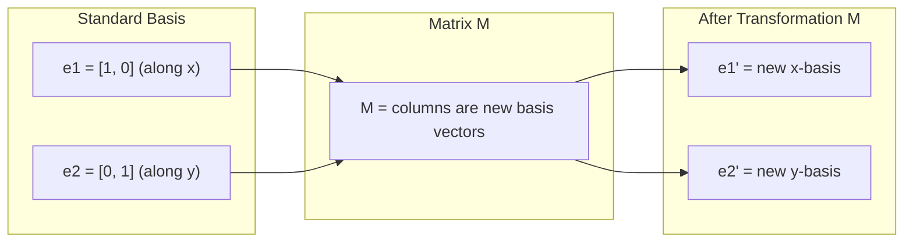
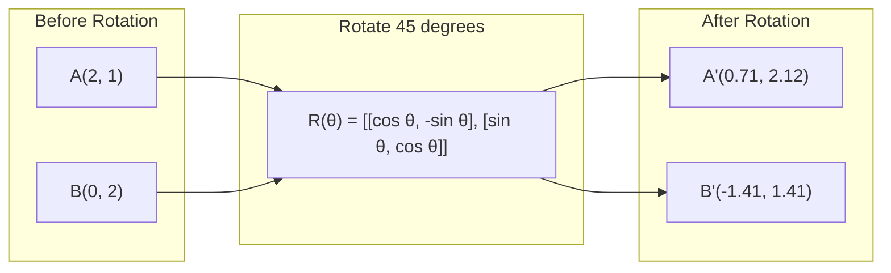
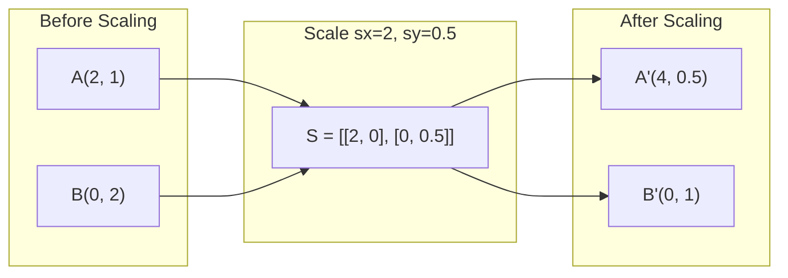
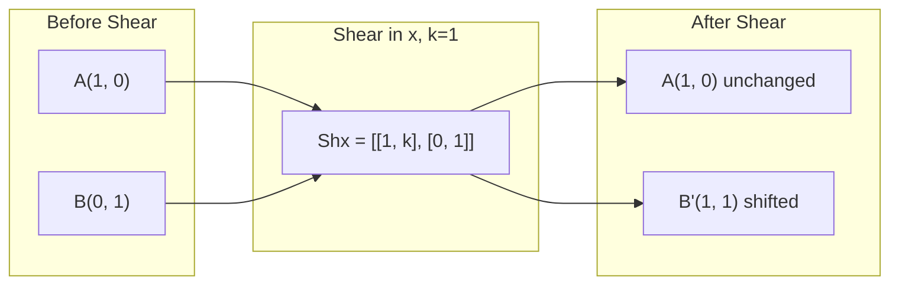
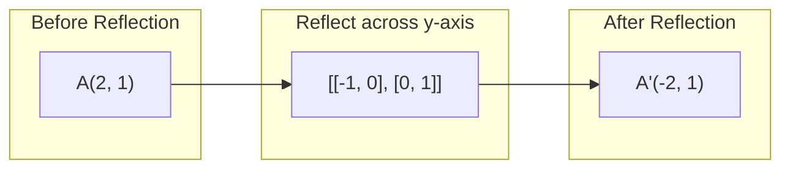
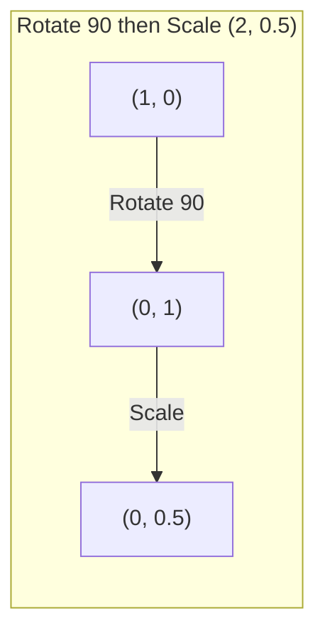
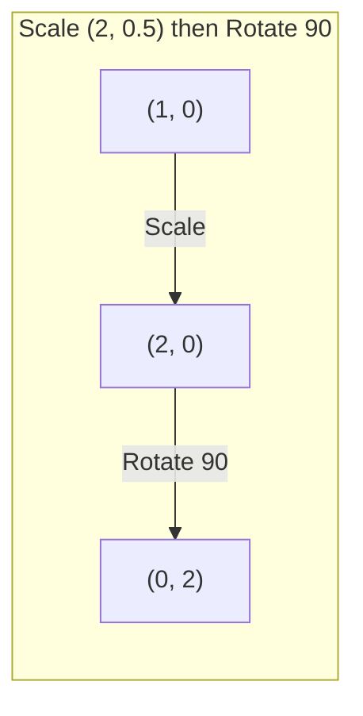

<!-- i18n:manual -->
# Матричные преобразования

> Матрица — машина, которая перекраивает пространство. Поймите, что она делает с каждой точкой, и вы поймёте всё преобразование целиком.

**Type:** Build
**Languages:** Python, Julia
**Prerequisites:** Phase 1, Lessons 01-02 (Linear Algebra Intuition, Vectors & Matrices Operations)
**Time:** ~75 minutes

## Learning Objectives

- Построить матрицы поворота, масштабирования, сдвига и отражения и применить их к 2D- и 3D-точкам
- Комбинировать несколько преобразований умножением матриц и убедиться, что порядок важен
- Вычислить собственные значения и собственные векторы матриц 2x2 из характеристического уравнения
- Объяснить, почему собственные значения определяют направления PCA, устойчивость RNN и поведение спектральной кластеризации

> 🎒 **На пальцах.** Весь урок — про четыре действия, знакомые каждому, кто играл в графическом редакторе: повернуть, растянуть, наклонить, отзеркалить. Разница только в том, что вы запишете их числами.

## The Problem

Вы читаете про PCA и видите: «найдите собственные векторы ковариационной матрицы». Читаете про устойчивость модели: «проверьте, что все собственные значения по модулю меньше 1». Читаете про аугментацию данных: «примените случайный поворот». Ничего из этого не имеет смысла, пока вы не понимаете, что матрицы делают с пространством геометрически.

Матрицы — не просто таблицы чисел. Это пространственные машины. Матрица поворота крутит точки. Матрица масштабирования растягивает их. Матрица сдвига наклоняет. Каждое преобразование, которое нейросеть применяет к данным, — одна из этих операций или их комбинация. Этот урок делает такие операции осязаемыми.

> 🎒 **На пальцах.** Представьте фотографию в редакторе. Кнопки «повернуть», «увеличить», «отразить» — это и есть матрицы. Редактор не спрашивает вас про каждый пиксель: он применяет одно правило ко всем сразу.

## The Concept

### Transformations as matrices

Любое линейное преобразование на плоскости записывается матрицей 2x2. Матрица говорит ровно одно: куда попадают базисные векторы [1, 0] и [0, 1]. Всё остальное следует автоматически.



> 🎒 **На пальцах.** Хитрость, которая экономит часы: чтобы понять любую матрицу 2x2, посмотрите на её столбцы. Первый столбец — куда уехала точка (1, 0). Второй — куда уехала точка (0, 1). Матрица `[[0, -1], [1, 0]]`: первый столбец (0, 1) — точка справа уехала вверх; второй столбец (-1, 0) — точка сверху уехала влево. Это поворот на 90°, и вы прочитали это глазами, без формул.

### Rotation

Поворот на плоскости на угол theta сохраняет расстояния и углы. Он двигает каждую точку по дуге окружности.



В трёхмерном пространстве вращают вокруг оси. У каждой оси своя матрица поворота:

```
Rz(theta) = | cos  -sin  0 |     Rotate around z-axis
            | sin   cos  0 |     (x-y plane spins, z stays)
            |  0     0   1 |

Rx(theta) = | 1   0     0    |   Rotate around x-axis
            | 0  cos  -sin   |   (y-z plane spins, x stays)
            | 0  sin   cos   |

Ry(theta) = |  cos  0  sin |     Rotate around y-axis
            |   0   1   0  |     (x-z plane spins, y stays)
            | -sin  0  cos |
```

> 🎒 **На пальцах.** Поворот — как крутить руль: расстояние между вами и пассажиром не меняется, меняется только направление машины. Заметьте единицу в углу трёхмерных матриц: у Rz единица стоит на позиции z, потому что высота при вращении вокруг вертикальной оси не меняется — карусель крутится, но никто не поднимается выше.

### Scaling

Масштабирование растягивает или сжимает вдоль каждой оси независимо.



> 🎒 **На пальцах.** Это ручки на краю картинки в редакторе: тянете вбок — растёт только ширина (sx), тянете вверх — только высота (sy). Числа на диагонали и есть «во сколько раз». sx = 2 — вдвое шире, sy = 0.5 — вдвое ниже.

### Shearing

Сдвиг наклоняет одну ось, оставляя другую на месте. Он превращает прямоугольники в параллелограммы.



Матрицы сдвига:
- `Shx = [[1, k], [0, 1]]` сдвигает x на k * y
- `Shy = [[1, 0], [k, 1]]` сдвигает y на k * x

> 🎒 **На пальцах.** Стопка книг на столе: нижняя не сдвинулась, каждая следующая чуть съехала вбок. Чем выше книга (больше y), тем сильнее съехала (больше сдвиг по x). Это и есть курсив в текстовом редакторе — буквы наклонены, но высота строки та же.

### Reflection

Отражение зеркалит точки относительно оси или прямой.



Матрицы отражения:
- Отражение относительно оси y: `[[-1, 0], [0, 1]]`
- Отражение относительно оси x: `[[1, 0], [0, -1]]`

> 🎒 **На пальцах.** Зеркало в ванной: вы подняли правую руку — отражение подняло левую. Минус в матрице и есть «поменять сторону». Именно так делают аугментацию данных: отзеркалили фото кошки — получили ещё одно фото кошки бесплатно, модель учится на обоих.

### Composition: chaining transformations

Применить преобразование A, затем B — это то же самое, что перемножить их матрицы: `result = B @ A @ point`. Порядок важен. «Повернуть, потом растянуть» даёт не то же самое, что «растянуть, потом повернуть».



Композиция: `S @ R = [[0, -2], [0.5, 0]]`



Композиция: `R @ S = [[0, -0.5], [2, 0]]`

Результаты разные. Умножение матриц некоммутативно.

> 🎒 **На пальцах.** Порядок решает и в жизни: «надеть носки, потом ботинки» и «надеть ботинки, потом носки» — разный результат. В формуле `B @ A` первым применяется правое, то есть A. Читается справа налево, как арабское письмо.

### Eigenvalues and eigenvectors

Большинство векторов меняют направление, когда на них действует матрица. Собственные векторы — особые: матрица их только масштабирует, но никогда не поворачивает. Коэффициент масштабирования и есть собственное значение.

```
A @ v = lambda * v

v is the eigenvector (direction that survives)
lambda is the eigenvalue (how much it stretches)

Example: A = | 2  1 |
             | 1  2 |

Eigenvector [1, 1] with eigenvalue 3:
  A @ [1,1] = [3, 3] = 3 * [1, 1]     (same direction, scaled by 3)

Eigenvector [1, -1] with eigenvalue 1:
  A @ [1,-1] = [1, -1] = 1 * [1, -1]  (same direction, unchanged)
```

Матрица растягивает пространство втрое вдоль [1, 1] и оставляет [1, -1] нетронутым. Любое другое направление — смесь этих двух.

> 🎒 **На пальцах.** Крутится карусель. Почти все лошадки едут по кругу и меняют направление. Но ось карусели стоит на месте — она указывает туда же, куда указывала. Собственный вектор — это ось. Собственное значение — насколько по этой оси всё растянулось. Проверьте руками: A = [[2, 1], [1, 2]], v = [1, 1]. Первая строка: 2×1 + 1×1 = 3. Вторая: 1×1 + 2×1 = 3. Получили [3, 3] — то же направление, длина втрое больше. Значит lambda = 3.

### Eigendecomposition

Если у матрицы есть n линейно независимых собственных векторов, её можно разложить:

```
A = V @ D @ V^(-1)

V = matrix whose columns are eigenvectors
D = diagonal matrix of eigenvalues
V^(-1) = inverse of V

This says: rotate into eigenvector coordinates, scale along each axis, rotate back.
```

> 🎒 **На пальцах.** Формула читается как инструкция из трёх шагов: повернуть картинку так, чтобы растяжение шло ровно вдоль осей → растянуть по осям → повернуть обратно. Так же вы поступаете с диваном в дверном проёме: развернули удобно, протащили, развернули обратно.

### Why eigenvalues matter

**PCA.** Собственные векторы ковариационной матрицы — это главные компоненты. Собственные значения говорят, сколько дисперсии захватывает каждая компонента. Отсортируйте по собственному значению, оставьте top-k — вот вам снижение размерности.

**Stability.** В рекуррентных сетях и динамических системах собственные значения с модулем > 1 заставляют выходы взрываться. С модулем < 1 — затухать. Это проблема исчезающих/взрывающихся градиентов, сформулированная одним предложением.

**Spectral methods.** Графовые нейросети используют собственные значения матрицы смежности. Спектральная кластеризация использует собственные значения лапласиана. Собственные векторы вскрывают структуру графа.

> 🎒 **На пальцах.** Про устойчивость на цифрах. Возьмите число 1.1 и умножьте само на себя 100 раз — получите почти 14 тысяч. Возьмите 0.9 — получите 0.00003, практически ноль. Ровно это происходит с сигналом внутри рекуррентной сети на длинном тексте: чуть больше единицы — взрыв, чуть меньше — сигнал умирает и сеть «забывает» начало предложения.

### Determinant as volume scaling factor

Определитель матрицы преобразования говорит, во сколько раз она масштабирует площадь (2D) или объём (3D).

```
det = 1:   area preserved (rotation)
det = 2:   area doubled
det = 0:   space crushed to lower dimension (singular)
det = -1:  area preserved but orientation flipped (reflection)

| det(Rotation) | = 1        (always)
| det(Scale sx, sy) | = sx * sy
| det(Shear) | = 1           (area preserved)
| det(Reflection) | = -1     (orientation flipped)
```

> 🎒 **На пальцах.** Определитель — «во сколько раз выросла клякса». Повернули лист бумаги — площадь та же, det = 1. Растянули вдвое по ширине и втрое по высоте — площадь выросла в 6 раз, det = 6. А det = 0 значит, что фигуру сплющили в линию: площадь стала нулём, и обратно её уже не развернуть — информация потеряна навсегда.

```figure
matrix-transform
```

## Build It

### Step 1: Transformation matrices from scratch (Python)

```python
import math

def rotation_2d(theta):
    c, s = math.cos(theta), math.sin(theta)
    return [[c, -s], [s, c]]

def scaling_2d(sx, sy):
    return [[sx, 0], [0, sy]]

def shearing_2d(kx, ky):
    return [[1, kx], [ky, 1]]

def reflection_x():
    return [[1, 0], [0, -1]]

def reflection_y():
    return [[-1, 0], [0, 1]]

def mat_vec_mul(matrix, vector):
    return [
        sum(matrix[i][j] * vector[j] for j in range(len(vector)))
        for i in range(len(matrix))
    ]

def mat_mul(a, b):
    rows_a, cols_b = len(a), len(b[0])
    cols_a = len(a[0])
    return [
        [sum(a[i][k] * b[k][j] for k in range(cols_a)) for j in range(cols_b)]
        for i in range(rows_a)
    ]

point = [1.0, 0.0]
angle = math.pi / 4

rotated = mat_vec_mul(rotation_2d(angle), point)
print(f"Rotate (1,0) by 45 deg: ({rotated[0]:.4f}, {rotated[1]:.4f})")

scaled = mat_vec_mul(scaling_2d(2, 3), [1.0, 1.0])
print(f"Scale (1,1) by (2,3): ({scaled[0]:.1f}, {scaled[1]:.1f})")

sheared = mat_vec_mul(shearing_2d(1, 0), [1.0, 1.0])
print(f"Shear (1,1) kx=1: ({sheared[0]:.1f}, {sheared[1]:.1f})")

reflected = mat_vec_mul(reflection_y(), [2.0, 1.0])
print(f"Reflect (2,1) across y: ({reflected[0]:.1f}, {reflected[1]:.1f})")
```

### Step 2: Composition of transformations

```python
R = rotation_2d(math.pi / 2)
S = scaling_2d(2, 0.5)

rotate_then_scale = mat_mul(S, R)
scale_then_rotate = mat_mul(R, S)

point = [1.0, 0.0]
result1 = mat_vec_mul(rotate_then_scale, point)
result2 = mat_vec_mul(scale_then_rotate, point)

print(f"Rotate 90 then scale: ({result1[0]:.2f}, {result1[1]:.2f})")
print(f"Scale then rotate 90: ({result2[0]:.2f}, {result2[1]:.2f})")
print(f"Same? {result1 == result2}")
```

### Step 3: Eigenvalues from scratch (2x2)

Для матрицы 2x2 `[[a, b], [c, d]]` собственные значения — корни характеристического уравнения: `lambda^2 - (a+d)*lambda + (ad - bc) = 0`.

```python
def eigenvalues_2x2(matrix):
    a, b = matrix[0]
    c, d = matrix[1]
    trace = a + d
    det = a * d - b * c
    discriminant = trace ** 2 - 4 * det
    if discriminant < 0:
        real = trace / 2
        imag = (-discriminant) ** 0.5 / 2
        return (complex(real, imag), complex(real, -imag))
    sqrt_disc = discriminant ** 0.5
    return ((trace + sqrt_disc) / 2, (trace - sqrt_disc) / 2)

def eigenvector_2x2(matrix, eigenvalue):
    a, b = matrix[0]
    c, d = matrix[1]
    if abs(b) > 1e-10:
        v = [b, eigenvalue - a]
    elif abs(c) > 1e-10:
        v = [eigenvalue - d, c]
    else:
        if abs(a - eigenvalue) < 1e-10:
            v = [1, 0]
        else:
            v = [0, 1]
    mag = (v[0] ** 2 + v[1] ** 2) ** 0.5
    return [v[0] / mag, v[1] / mag]

A = [[2, 1], [1, 2]]
vals = eigenvalues_2x2(A)
print(f"Matrix: {A}")
print(f"Eigenvalues: {vals[0]:.4f}, {vals[1]:.4f}")

for val in vals:
    vec = eigenvector_2x2(A, val)
    result = mat_vec_mul(A, vec)
    scaled = [val * vec[0], val * vec[1]]
    print(f"  lambda={val:.1f}, v={[round(x,4) for x in vec]}")
    print(f"    A@v = {[round(x,4) for x in result]}")
    print(f"    l*v = {[round(x,4) for x in scaled]}")
```

> 🎒 **На пальцах.** Характеристическое уравнение — обычный школьный квадратный трёхчлен, просто буквы другие. Для A = [[2, 1], [1, 2]]: сумма диагонали (trace) = 2 + 2 = 4, определитель = 2×2 − 1×1 = 3. Уравнение: λ² − 4λ + 3 = 0. Дискриминант 16 − 12 = 4, корень 2, значит λ = (4 ± 2) / 2, то есть 3 и 1. Ровно те числа, что вы видели выше — и посчитали вы их школьной формулой за минуту.

### Step 4: Determinant as volume scaling factor

```python
def det_2x2(matrix):
    return matrix[0][0] * matrix[1][1] - matrix[0][1] * matrix[1][0]

print(f"det(rotation 45) = {det_2x2(rotation_2d(math.pi/4)):.4f}")
print(f"det(scale 2,3)   = {det_2x2(scaling_2d(2, 3)):.1f}")
print(f"det(shear kx=1)  = {det_2x2(shearing_2d(1, 0)):.1f}")
print(f"det(reflect y)   = {det_2x2(reflection_y()):.1f}")

singular = [[1, 2], [2, 4]]
print(f"det(singular)     = {det_2x2(singular):.1f}")
print("Singular: columns are proportional, space collapses to a line.")
```

## Use It

NumPy делает всё это оптимизированными процедурами.

```python
import numpy as np

theta = np.pi / 4
R = np.array([[np.cos(theta), -np.sin(theta)],
              [np.sin(theta),  np.cos(theta)]])

point = np.array([1.0, 0.0])
print(f"Rotate (1,0) by 45 deg: {R @ point}")

S = np.diag([2.0, 3.0])
composed = S @ R
print(f"Scale(2,3) after Rotate(45): {composed @ point}")

A = np.array([[2, 1], [1, 2]], dtype=float)
eigenvalues, eigenvectors = np.linalg.eig(A)
print(f"\nEigenvalues: {eigenvalues}")
print(f"Eigenvectors (columns):\n{eigenvectors}")

for i in range(len(eigenvalues)):
    v = eigenvectors[:, i]
    lam = eigenvalues[i]
    print(f"  A @ v{i} = {A @ v}, lambda * v{i} = {lam * v}")

print(f"\ndet(R) = {np.linalg.det(R):.4f}")
print(f"det(S) = {np.linalg.det(S):.1f}")

B = np.array([[3, 1], [0, 2]], dtype=float)
vals, vecs = np.linalg.eig(B)
D = np.diag(vals)
V = vecs
reconstructed = V @ D @ np.linalg.inv(V)
print(f"\nEigendecomposition A = V @ D @ V^-1:")
print(f"Original:\n{B}")
print(f"Reconstructed:\n{reconstructed}")
```

### 3D rotations with NumPy

```python
def rotation_3d_z(theta):
    c, s = np.cos(theta), np.sin(theta)
    return np.array([[c, -s, 0], [s, c, 0], [0, 0, 1]])

def rotation_3d_x(theta):
    c, s = np.cos(theta), np.sin(theta)
    return np.array([[1, 0, 0], [0, c, -s], [0, s, c]])

point_3d = np.array([1.0, 0.0, 0.0])
rotated_z = rotation_3d_z(np.pi / 2) @ point_3d
rotated_x = rotation_3d_x(np.pi / 2) @ point_3d

print(f"\n3D point: {point_3d}")
print(f"Rotate 90 around z: {np.round(rotated_z, 4)}")
print(f"Rotate 90 around x: {np.round(rotated_x, 4)}")
```

> 🎒 **На пальцах.** Заметьте, что даёт поворот точки (1, 0, 0) вокруг оси x: ничего. Точка лежит прямо на оси вращения — как гвоздь, вокруг которого всё крутится. А поворот той же точки вокруг оси z уводит её в (0, 1, 0). Тот же поворот, другая ось — совсем другой результат.

## Ship It

Этот урок закладывает геометрический фундамент для PCA (Phase 2) и анализа весов нейросетей. Код собственных значений и векторов, написанный здесь, — тот же алгоритм, что питает снижение размерности, спектральную кластеризацию и анализ устойчивости в продакшн-системах ML.

## Exercises

1. Примените поворот, масштабирование и сдвиг к единичному квадрату (углы в [0,0], [1,0], [1,1], [0,1]). Напечатайте преобразованные углы для каждого случая. Убедитесь, что поворот сохраняет расстояния между углами.

2. Найдите собственные значения матрицы [[4, 2], [1, 3]] вручную через характеристическое уравнение. Затем сверьте со своей функцией и с NumPy.

3. Составьте композицию трёх преобразований (поворот на 30 градусов, масштабирование на [1.5, 0.8], сдвиг с kx=0.3) и примените её к 8 точкам, расставленным по окружности. Напечатайте координаты до и после. Вычислите определитель составной матрицы и проверьте, что он равен произведению отдельных определителей.

> 🎒 **На пальцах.** Ко второму заданию по шагам: trace = 4 + 3 = 7, det = 4×3 − 2×1 = 10. Уравнение λ² − 7λ + 10 = 0. Дискриминант 49 − 40 = 9, корень 3. Ответ: λ = (7 ± 3) / 2 = 5 и 2. Теперь запустите код и сверьтесь — числа должны совпасть точно.

## Key Terms

| Term | What people say | What it actually means |
|------|----------------|----------------------|
| Rotation matrix | «Крутит вещи» | Ортогональная матрица, двигающая точки по дугам окружности с сохранением расстояний и углов. Определитель всегда 1. |
| Scaling matrix | «Делает больше» | Диагональная матрица, растягивающая или сжимающая независимо вдоль каждой оси. Определитель — произведение коэффициентов. |
| Shearing matrix | «Наклоняет вещи» | Матрица, сдвигающая одну координату пропорционально другой; превращает прямоугольники в параллелограммы. Определитель равен 1. |
| Reflection | «Зеркалит вещи» | Матрица, отражающая пространство относительно оси или плоскости. Определитель равен -1. |
| Composition | «Сделать две вещи» | Перемножение матриц преобразований для сцепления операций. Порядок важен: B @ A означает «сначала A, потом B». |
| Eigenvector | «Особое направление» | Направление, которое матрица только масштабирует, но не поворачивает. Отпечаток пальца преобразования. |
| Eigenvalue | «Насколько растягивает» | Скалярный множитель, на который матрица масштабирует свой собственный вектор. Может быть отрицательным (переворот) или комплексным (вращение). |
| Eigendecomposition | «Разобрать матрицу на части» | Запись матрицы как V @ D @ V^(-1) — разделение на фундаментальные направления растяжения и их величины. |
| Determinant | «Одно число из матрицы» | Множитель, на который преобразование масштабирует площадь (2D) или объём (3D). Ноль означает необратимость преобразования. |
| Characteristic equation | «Откуда берутся собственные значения» | det(A - lambda * I) = 0. Многочлен, корни которого и есть собственные значения. |

## Further Reading

- [3Blue1Brown: Linear Transformations](https://www.3blue1brown.com/lessons/linear-transformations) -- визуальная интуиция того, как матрицы перекраивают пространство
- [3Blue1Brown: Eigenvectors and Eigenvalues](https://www.3blue1brown.com/lessons/eigenvalues) -- лучшее визуальное объяснение геометрического смысла собственных векторов
- [MIT 18.06 Lecture 21: Eigenvalues and Eigenvectors](https://ocw.mit.edu/courses/18-06-linear-algebra-spring-2010/) -- классический разбор от Гилберта Стрэнга
