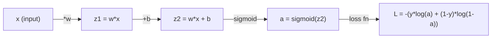
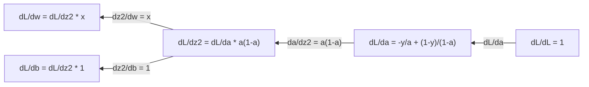
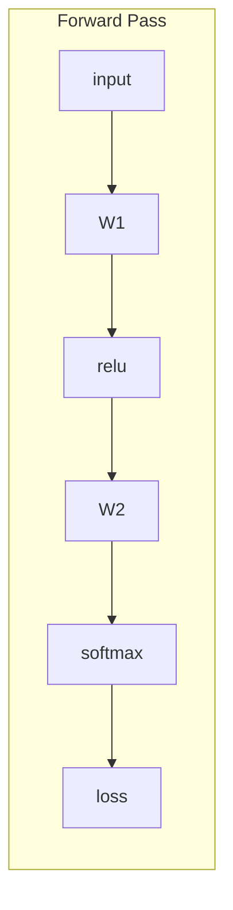
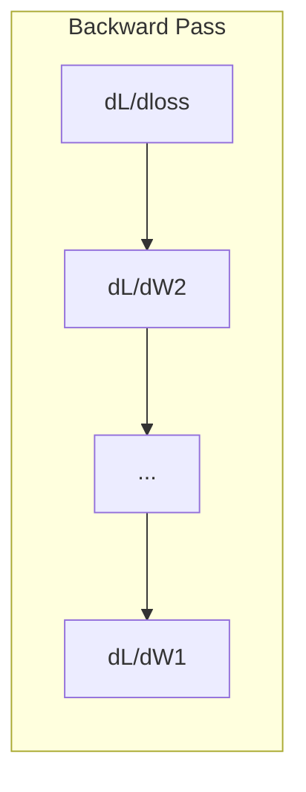

<!-- i18n:manual -->
# Математический анализ для машинного обучения

> Производная говорит, куда вниз. Больше нейросети для обучения ничего не нужно.

**Type:** Learn
**Language:** Python
**Prerequisites:** Phase 1, Lessons 01-03
**Time:** ~60 minutes

## Learning Objectives

- Вычислять численные и аналитические производные типичных ML-функций (x^2, sigmoid, cross-entropy)
- Реализовать градиентный спуск с нуля для минимизации функции потерь в 1D и 2D
- Вывести градиент модели линейной регрессии и обучить её ручными обновлениями весов
- Объяснить матрицу Гессе, приближения рядом Тейлора и их связь с методами оптимизации

> 🎒 **На пальцах.** Вы стоите на склоне холма с завязанными глазами. Ощупываете землю ногой: где ниже? Делаете шаг туда. Повторяете. Так спускаются в туман — и точно так же учится любая нейросеть. Весь урок про это.

## The Problem

У вас нейросеть с миллионами весов. Каждый вес — ручка настройки. Нужно понять, в какую сторону крутить каждую отдельную ручку, чтобы модель ошибалась чуть меньше. Математический анализ даёт это направление.

Без него обучение нейросети означало бы случайные изменения и надежду на удачу. С производными вы точно знаете, как каждый вес влияет на ошибку. Вы крутите каждую ручку в правильную сторону, каждый раз.

## The Concept

### What is a derivative?

Производная измеряет скорость изменения. Для функции y = f(x) производная f'(x) отвечает: если сдвинуть x на крошечную величину, насколько изменится y?

Геометрически производная — это наклон касательной в точке.

**f(x) = x^2:**

| x | f(x) | f'(x) (slope) |
|---|------|---------------|
| 0 | 0    | 0 (плоско, на самом дне) |
| 1 | 1    | 2 |
| 2 | 4    | 4 (наклон касательной в этой точке) |
| 3 | 9    | 6 |

При x=2 наклон равен 4. Сдвиньте x чуть-чуть вправо — y вырастет примерно вчетверо сильнее. При x=0 наклон равен 0. Вы на дне чаши.

Формальное определение:

```
f'(x) = lim   f(x + h) - f(x)
        h->0  -----------------
                     h
```

В коде предел пропускают и просто берут очень маленькое h. Это численная производная.

> 🎒 **На пальцах.** Дорожный знак «уклон 10%» — это производная. Он говорит: проехал 100 метров вперёд — опустился на 10 метров вниз. Знак не описывает всю гору целиком, он описывает крутизну прямо здесь. Производная делает ровно то же для функции.

### Partial derivatives: one variable at a time

У настоящих функций много входов. Потери нейросети зависят от тысяч весов. Частная производная держит все переменные постоянными, кроме одной, и дифференцирует по этой одной.

```
f(x, y) = x^2 + 3xy + y^2

df/dx = 2x + 3y     (treat y as a constant)
df/dy = 3x + 2y     (treat x as a constant)
```

Каждая частная производная отвечает на вопрос: если я подкручу только этот один вес, как изменятся потери?

> 🎒 **На пальцах.** Душ с двумя кранами: горячий повышает температуру, холодный понижает. «Держим холодный неподвижно, крутим только горячий — что с температурой?» — это частная производная по горячему крану. Мир сложный, но вы разбираете его по одной ручке за раз — даже если этих ручек миллион.

### The gradient: vector of all partial derivatives

Градиент собирает все частные производные в один вектор. Для функции f(x, y, z) градиент — это:

```
grad f = [ df/dx, df/dy, df/dz ]
```

Градиент указывает в сторону наискорейшего роста. Чтобы минимизировать функцию, идите в противоположную сторону.

**Contour plot of f(x,y) = x^2 + y^2:**

Функция образует форму чаши с концентрическими окружностями в качестве линий уровня. Минимум находится в (0, 0).

| Point | grad f | -grad f (descent direction) |
|-------|--------|----------------------------|
| (1, 1) | [2, 2] (указывает в гору, прочь от минимума) | [-2, -2] (указывает под гору, к минимуму) |
| (0, 0) | [0, 0] (плоско, в минимуме) | [0, 0] |

Это градиентный спуск одной картинкой. Вычислить градиент, сменить знак, сделать шаг.

> 🎒 **На пальцах.** Линии уровня — это горизонтали на школьной карте: чем гуще линии, тем круче склон. Градиент всегда смотрит строго вверх по склону, перпендикулярно горизонталям. А чтобы скатиться к минимуму, надо просто идти ровно наоборот — поставить минус.

### The connection to optimization

Обучение нейросети — это оптимизация. У вас есть функция потерь L(w1, w2, ..., wn), измеряющая, насколько модель неправа. Вы хотите её минимизировать.

```
Gradient descent update rule:

  w_new = w_old - learning_rate * dL/dw

For every weight:
  1. Compute the partial derivative of loss with respect to that weight
  2. Subtract a small multiple of it from the weight
  3. Repeat
```

Learning rate контролирует размер шага. Слишком большой — вы перелетаете. Слишком маленький — ползёте.

**Loss landscape (1D slice):**

Функция потерь L(w) образует кривую с пиками и впадинами по мере изменения веса w.

| Feature | Description |
|---------|-------------|
| Global minimum | Самая низкая точка всей кривой — лучшее решение |
| Local minimum | Впадина ниже соседей, но не самая низкая в целом |
| Slope | Градиентный спуск следует по склону вниз из любой стартовой точки |

Градиентный спуск идёт по склону вниз. Он может застрять в локальном минимуме, но в пространствах высокой размерности (миллионы весов) это редко становится практической проблемой.

> 🎒 **На пальцах.** Learning rate — длина вашего шага при спуске с горы. Шагаете по километру — перепрыгиваете долину и оказываетесь на соседнем склоне, ещё выше. Шагаете по сантиметру — спуск займёт вечность. Типичное значение 0.01 подобрано именно как «достаточно быстро, но не перелетая».

### Numerical vs analytical derivatives

Производную можно вычислить двумя способами.

Аналитически: применить правила анализа вручную. Для f(x) = x^2 производная равна f'(x) = 2x. Точно. Быстро.

Численно: приблизить по определению. Вычислить f(x+h) и f(x-h) для крошечного h, затем взять разность.

```
Numerical (central difference):

f'(x) ~= f(x + h) - f(x - h)
          -----------------------
                  2h

h = 0.0001 works well in practice
```

Численные производные медленнее, но работают для любой функции. Аналитические быстры, но требуют вывести формулу. Фреймворки нейросетей используют третий подход — автоматическое дифференцирование, которое вычисляет точные производные механически. Это будет в Phase 3.

> 🎒 **На пальцах.** Аналитически — знать формулу пути и мгновенно назвать скорость. Численно — засечь два положения машины с разницей в секунду и поделить расстояние на время. Второй способ работает всегда, даже когда формулы нет вовсе, — просто чуть менее точен.

### Derivatives by hand for simple functions

Вот производные, которые вы будете видеть в ML снова и снова.

```
Function        Derivative       Used in
--------        ----------       -------
f(x) = x^2     f'(x) = 2x      Loss functions (MSE)
f(x) = wx + b  f'(w) = x        Linear layer (gradient w.r.t. weight)
                f'(b) = 1        Linear layer (gradient w.r.t. bias)
                f'(x) = w        Linear layer (gradient w.r.t. input)
f(x) = e^x     f'(x) = e^x     Softmax, attention
f(x) = ln(x)   f'(x) = 1/x     Cross-entropy loss
f(x) = 1/(1+e^-x)  f'(x) = f(x)(1-f(x))   Sigmoid activation
```

Для f(x) = x^2:

```
f(x) = x^2    f'(x) = 2x

  x    f(x)   f'(x)   meaning
  -2    4      -4      slope tilts left (decreasing)
  -1    1      -2      slope tilts left (decreasing)
   0    0       0      flat (minimum!)
   1    1       2      slope tilts right (increasing)
   2    4       4      slope tilts right (increasing)
```

Для f(w) = wx + b при x=3, b=1:

```
f(w) = 3w + 1    f'(w) = 3

The derivative with respect to w is just x.
If x is big, a small change in w causes a big change in output.
```

> 🎒 **На пальцах.** Эту таблицу не надо зубрить — надо один раз понять знак. Отрицательная производная = «идём вниз по горке», положительная = «идём вверх», ноль = «стоим на ровном». Именно ноль и ищет обучение: там дно.

### The chain rule

Когда функции вложены друг в друга, цепное правило говорит, как их дифференцировать.

```
If y = f(g(x)), then dy/dx = f'(g(x)) * g'(x)

Example: y = (3x + 1)^2
  outer: f(u) = u^2       f'(u) = 2u
  inner: g(x) = 3x + 1    g'(x) = 3
  dy/dx = 2(3x + 1) * 3 = 6(3x + 1)
```

Нейросети — это цепочки функций: вход -> линейный слой -> активация -> линейный слой -> активация -> потери. Обратное распространение — цепное правило, применённое многократно от выхода ко входу. Это и есть весь алгоритм.

> 🎒 **На пальцах.** Шестерёнки. Большая крутится вдвое быстрее средней, средняя — втрое быстрее маленькой. Насколько быстрее большая крутится относительно маленькой? 2 × 3 = 6. Цепное правило и есть «перемножить передаточные числа по всей цепи». Нейросеть — просто очень длинная цепь шестерёнок.

### The Hessian Matrix

Градиент говорит про наклон. Гессиан говорит про кривизну.

Гессиан — матрица вторых частных производных. Для функции f(x1, x2, ..., xn) элемент (i, j) гессиана равен:

```
H[i][j] = d^2f / (dx_i * dx_j)
```

Для функции двух переменных f(x, y):

```
H = | d^2f/dx^2    d^2f/dxdy |
    | d^2f/dydx    d^2f/dy^2 |
```

**What the Hessian tells you at a critical point (where gradient = 0):**

| Hessian property | Meaning | Example surface |
|-----------------|---------|-----------------|
| Положительно определён (все собственные значения > 0) | Локальный минимум | Чаша, открытая вверх |
| Отрицательно определён (все собственные значения < 0) | Локальный максимум | Чаша, открытая вниз |
| Неопределён (смешанные собственные значения) | Седловая точка | Форма конского седла |

**Example:** f(x, y) = x^2 - y^2 (седловая функция)

```
df/dx = 2x       df/dy = -2y
d^2f/dx^2 = 2    d^2f/dy^2 = -2    d^2f/dxdy = 0

H = | 2   0 |
    | 0  -2 |

Eigenvalues: 2 and -2 (one positive, one negative)
--> Saddle point at (0, 0)
```

Сравните с f(x, y) = x^2 + y^2 (чаша):

```
H = | 2  0 |
    | 0  2 |

Eigenvalues: 2 and 2 (both positive)
--> Local minimum at (0, 0)
```

**Why the Hessian matters in ML:**

Метод Ньютона использует гессиан, чтобы делать более удачные шаги, чем градиентный спуск. Вместо простого следования наклону он учитывает кривизну:

```
Newton's update:    w_new = w_old - H^(-1) * gradient
Gradient descent:   w_new = w_old - lr * gradient
```

Метод Ньютона сходится быстрее, потому что гессиан «перемасштабирует» градиент: в крутых направлениях шаги становятся меньше, в пологих — больше.

Загвоздка: для нейросети с N параметрами гессиан имеет размер N x N. Модели с миллионом параметров понадобилась бы матрица на триллион элементов. Поэтому используют приближения.

| Method | What it uses | Cost | Convergence |
|--------|-------------|------|-------------|
| Gradient descent | Только первые производные | O(N) за шаг | Медленная (линейная) |
| Newton's method | Полный гессиан | O(N^3) за шаг | Быстрая (квадратичная) |
| L-BFGS | Приближение гессиана по истории градиентов | O(N) за шаг | Средняя (суперлинейная) |
| Adam | Адаптивные скорости на параметр (приближение диагонали гессиана) | O(N) за шаг | Средняя |
| Natural gradient | Матрица информации Фишера (статистический гессиан) | O(N^2) за шаг | Быстрая |

На практике Adam — оптимизатор по умолчанию в глубоком обучении. Он дёшево приближает информацию второго порядка, отслеживая скользящее среднее и дисперсию градиентов по каждому параметру.

> 🎒 **На пальцах.** Разница между градиентом и гессианом — как между «дорога идёт вниз» и «дорога идёт вниз и вдобавок закругляется». Седловая точка — это горный перевал: вдоль дороги вы на самой низкой точке, а поперёк дороги — на самой высокой. Гессиан ловит именно такие места, где по одной оси дно, а по другой вершина.

### Taylor Series Approximation

Любую гладкую функцию можно локально приблизить многочленом:

```
f(x + h) = f(x) + f'(x)*h + (1/2)*f''(x)*h^2 + (1/6)*f'''(x)*h^3 + ...
```

Чем больше слагаемых, тем лучше приближение — но только вблизи точки x.

**Why Taylor series matter for ML:**

- **First-order Taylor = gradient descent.** Когда вы пишете f(x + h) ~ f(x) + f'(x)*h, вы делаете линейное приближение. Градиентный спуск минимизирует эту линейную модель, выбирая h = -lr * f'(x).

- **Second-order Taylor = Newton's method.** Используя f(x + h) ~ f(x) + f'(x)*h + (1/2)*f''(x)*h^2, вы получаете квадратичную модель. Её минимизация даёт h = -f'(x)/f''(x) — шаг Ньютона.

- **Loss function design.** MSE и cross-entropy гладкие, а значит их разложения Тейлора ведут себя хорошо. Это не случайность. Гладкие функции потерь делают оптимизацию предсказуемой.

```
Approximation order    What it captures    Optimization method
-------------------    -----------------   -------------------
0th order (constant)   Just the value      Random search
1st order (linear)     Slope               Gradient descent
2nd order (quadratic)  Curvature           Newton's method
Higher orders          Finer structure     Rarely used in ML
```

Ключевая мысль: вся градиентная оптимизация на самом деле сводится к локальному приближению функции потерь и шагу в минимум этого приближения.

> 🎒 **На пальцах.** Ряд Тейлора — это «Земля плоская». На расстоянии двора приближение идеально: считайте землю плоской, и ничего не сломается. На расстоянии страны оно уже врёт. Каждое следующее слагаемое ряда — как учесть кривизну Земли, потом её сплюснутость, потом горы. Чем дальше идёте, тем больше слагаемых нужно.

### Integrals in ML

Производные говорят о скоростях изменения. Интегралы считают накопления — площадь под кривой.

В ML интегралы редко берут руками, но понятие встречается повсюду:

**Probability.** Для непрерывной случайной величины с плотностью p(x):

```
P(a < X < b) = integral from a to b of p(x) dx
```

Площадь под кривой плотности между a и b — вероятность попасть в этот диапазон.

**Expected value.** Средний исход, взвешенный по вероятности:

```
E[f(X)] = integral of f(x) * p(x) dx
```

Ожидаемые потери на распределении данных — интеграл. Обучение минимизирует его эмпирическое приближение.

**KL divergence.** Мера того, насколько два распределения различны:

```
KL(p || q) = integral of p(x) * log(p(x) / q(x)) dx
```

Используется в VAE, дистилляции знаний и байесовском выводе.

**Normalization constants.** В байесовском выводе:

```
p(w | data) = p(data | w) * p(w) / integral of p(data | w) * p(w) dw
```

Знаменатель — интеграл по всем возможным значениям параметров. Он часто невычислим, поэтому применяют приближения вроде MCMC и вариационного вывода.

| Integral concept | Where it appears in ML |
|-----------------|----------------------|
| Площадь под кривой | Вероятность из функций плотности |
| Математическое ожидание | Функции потерь, минимизация риска |
| KL divergence | VAE, оптимизация политики, дистилляция |
| Нормировка | Байесовские апостериорные распределения, знаменатель softmax |
| Маргинальное правдоподобие | Сравнение моделей, ELBO |

> 🎒 **На пальцах.** Производная — спидометр, интеграл — одометр. Спидометр говорит, как быстро вы едете прямо сейчас; одометр складывает всё пройденное. Площадь под графиком скорости и есть пройденный путь. Одно действие — обратное другому.

### Multivariable Chain Rule in a Computation Graph

Цепное правило применимо не только к цепочке скалярных функций. В нейросети переменные ветвятся и сливаются. Вот как производные текут через простой прямой проход:



Обратный проход вычисляет градиенты справа налево:



Каждая стрелка умножает на локальную производную. Градиент любого параметра — произведение всех локальных производных вдоль пути от потерь до этого параметра. Когда пути ветвятся и сливаются, вклады складываются (многомерное цепное правило).

Обратное распространение — это ровно оно: цепное правило, систематически применённое по вычислительному графу от выхода ко входам.

> 🎒 **На пальцах.** Умножаем вдоль пути, складываем на развилках. Если в школу можно дойти двумя дорогами и обе занимают время, общее влияние — сумма по дорогам, а внутри одной дороги участки перемножаются. Всё обратное распространение — эти два правила, повторённые миллион раз.

### The Jacobian matrix

Когда функция отображает вектор в вектор (как слой нейросети), её производная — матрица. Якобиан содержит все частные производные каждого выхода по каждому входу.

Для f: R^n -> R^m якобиан J — матрица m x n:

| | x1 | x2 | ... | xn |
|---|---|---|---|---|
| f1 | df1/dx1 | df1/dx2 | ... | df1/dxn |
| f2 | df2/dx1 | df2/dx2 | ... | df2/dxn |
| ... | ... | ... | ... | ... |
| fm | dfm/dx1 | dfm/dx2 | ... | dfm/dxn |

Якобианы нейросетей вы руками считать не будете — этим займётся PyTorch. Но знание, что он существует, помогает понимать формы при обратном распространении: если слой отображает R^n в R^m, его якобиан имеет размер m x n. Градиент течёт назад через транспонированную версию этой матрицы.

### Why this matters for neural networks

Каждый вес нейросети получает градиент. Градиент говорит, как подкрутить этот вес, чтобы уменьшить потери.





Обновление каждого веса:
- `W1 = W1 - lr * dL/dW1`
- `W2 = W2 - lr * dL/dW2`

Прямой проход вычисляет предсказание и потери. Обратный проход вычисляет градиент потерь по каждому весу. Затем каждый вес делает маленький шаг вниз по склону. Повторить миллионы раз. Это и есть глубокое обучение.

```figure
derivative-tangent
```

## Build It

### Step 1: Numerical derivative from scratch

```python
def numerical_derivative(f, x, h=1e-7):
    return (f(x + h) - f(x - h)) / (2 * h)

def f(x):
    return x ** 2

for x in [-2, -1, 0, 1, 2]:
    numerical = numerical_derivative(f, x)
    analytical = 2 * x
    print(f"x={x:2d}  f'(x) numerical={numerical:.6f}  analytical={analytical:.1f}")
```

Численная производная совпадает с аналитической до многих знаков после запятой.

### Step 2: Partial derivatives and gradients

```python
def numerical_gradient(f, point, h=1e-7):
    gradient = []
    for i in range(len(point)):
        point_plus = list(point)
        point_minus = list(point)
        point_plus[i] += h
        point_minus[i] -= h
        partial = (f(point_plus) - f(point_minus)) / (2 * h)
        gradient.append(partial)
    return gradient

def f_multi(point):
    x, y = point
    return x**2 + 3*x*y + y**2

grad = numerical_gradient(f_multi, [1.0, 2.0])
print(f"Numerical gradient at (1,2): {[f'{g:.4f}' for g in grad]}")
print(f"Analytical gradient at (1,2): [2*1+3*2, 3*1+2*2] = [{2*1+3*2}, {3*1+2*2}]")
```

### Step 3: Gradient descent to find the minimum of f(x) = x^2

```python
x = 5.0
lr = 0.1
for step in range(20):
    grad = 2 * x
    x = x - lr * grad
    print(f"step {step:2d}  x={x:8.4f}  f(x)={x**2:10.6f}")
```

Начав с x=5, каждый шаг подходит ближе к x=0 (минимуму).

> 🎒 **На пальцах.** Посчитайте первый шаг руками. x = 5, градиент = 2×5 = 10, шаг = 0.1 × 10 = 1, новый x = 4. Следующий: градиент 8, шаг 0.8, x = 3.2. Заметьте: чем ближе ко дну, тем меньше шаги — само собой, без всяких хитростей. Так и тормозит машина перед светофором.

### Step 4: Gradient descent on a 2D function

```python
def f_2d(point):
    x, y = point
    return x**2 + y**2

point = [4.0, 3.0]
lr = 0.1
for step in range(30):
    grad = numerical_gradient(f_2d, point)
    point = [p - lr * g for p, g in zip(point, grad)]
    loss = f_2d(point)
    if step % 5 == 0 or step == 29:
        print(f"step {step:2d}  point=({point[0]:7.4f}, {point[1]:7.4f})  f={loss:.6f}")
```

### Step 5: Comparing numerical and analytical derivatives

```python
import math

test_functions = [
    ("x^2",      lambda x: x**2,          lambda x: 2*x),
    ("x^3",      lambda x: x**3,          lambda x: 3*x**2),
    ("sin(x)",   lambda x: math.sin(x),   lambda x: math.cos(x)),
    ("e^x",      lambda x: math.exp(x),   lambda x: math.exp(x)),
    ("1/x",      lambda x: 1/x,           lambda x: -1/x**2),
]

x = 2.0
print(f"{'Function':<12} {'Numerical':>12} {'Analytical':>12} {'Error':>12}")
print("-" * 50)
for name, f, df in test_functions:
    num = numerical_derivative(f, x)
    ana = df(x)
    err = abs(num - ana)
    print(f"{name:<12} {num:12.6f} {ana:12.6f} {err:12.2e}")
```

### Step 6: Computing the Hessian numerically

```python
def hessian_2d(f, x, y, h=1e-5):
    fxx = (f(x + h, y) - 2 * f(x, y) + f(x - h, y)) / (h ** 2)
    fyy = (f(x, y + h) - 2 * f(x, y) + f(x, y - h)) / (h ** 2)
    fxy = (f(x + h, y + h) - f(x + h, y - h) - f(x - h, y + h) + f(x - h, y - h)) / (4 * h ** 2)
    return [[fxx, fxy], [fxy, fyy]]

def saddle(x, y):
    return x ** 2 - y ** 2

def bowl(x, y):
    return x ** 2 + y ** 2

H_saddle = hessian_2d(saddle, 0.0, 0.0)
H_bowl = hessian_2d(bowl, 0.0, 0.0)
print(f"Saddle Hessian: {H_saddle}")  # [[2, 0], [0, -2]] -- mixed signs
print(f"Bowl Hessian:   {H_bowl}")    # [[2, 0], [0, 2]]  -- both positive
```

У гессиана седловой функции собственные значения 2 и -2 (разные знаки — подтверждают седловую точку). У чаши собственные значения 2 и 2 (оба положительные — подтверждают минимум).

### Step 7: Taylor approximation in action

```python
import math

def taylor_approx(f, f_prime, f_double_prime, x0, h, order=2):
    result = f(x0)
    if order >= 1:
        result += f_prime(x0) * h
    if order >= 2:
        result += 0.5 * f_double_prime(x0) * h ** 2
    return result

x0 = 0.0
for h in [0.1, 0.5, 1.0, 2.0]:
    true_val = math.sin(h)
    t1 = taylor_approx(math.sin, math.cos, lambda x: -math.sin(x), x0, h, order=1)
    t2 = taylor_approx(math.sin, math.cos, lambda x: -math.sin(x), x0, h, order=2)
    print(f"h={h:.1f}  sin(h)={true_val:.4f}  order1={t1:.4f}  order2={t2:.4f}")
```

Вблизи x0=0 sin(x) ~ x (первый порядок Тейлора). Приближение великолепно для малых h и разваливается для больших. Вот почему градиентный спуск лучше всего работает с маленькими learning rate — каждый шаг предполагает, что линейное приближение верно.

> 🎒 **На пальцах.** Проверьте сами на калькуляторе: sin(0.1) = 0.0998, а приближение просто «0.1». Ошибка в третьем знаке. Теперь sin(2.0) = 0.909, а приближение говорит «2.0» — мимо в два раза. Приближение честное только рядом с точкой. Ровно поэтому learning rate маленький.

### Step 8: Why this matters for a neural network

```python
import random

random.seed(42)

w = random.gauss(0, 1)
b = random.gauss(0, 1)
lr = 0.01

xs = [1.0, 2.0, 3.0, 4.0, 5.0]
ys = [3.0, 5.0, 7.0, 9.0, 11.0]

for epoch in range(200):
    total_loss = 0
    dw = 0
    db = 0
    for x, y in zip(xs, ys):
        pred = w * x + b
        error = pred - y
        total_loss += error ** 2
        dw += 2 * error * x
        db += 2 * error
    dw /= len(xs)
    db /= len(xs)
    total_loss /= len(xs)
    w -= lr * dw
    b -= lr * db
    if epoch % 40 == 0 or epoch == 199:
        print(f"epoch {epoch:3d}  w={w:.4f}  b={b:.4f}  loss={total_loss:.6f}")

print(f"\nLearned: y = {w:.2f}x + {b:.2f}")
print(f"Actual:  y = 2x + 1")
```

Каждый цикл обучения на градиентах следует этой схеме: предсказать, посчитать потери, посчитать градиенты, обновить веса.

> 🎒 **На пальцах.** Посмотрите на данные: x = 1, 2, 3, 4, 5 и y = 3, 5, 7, 9, 11. Закономерность видна глазами: каждый раз y растёт на 2, а начинается с 3. Значит y = 2x + 1. Программа этого не знает — она начинает со случайных чисел и за 200 шагов приходит к тому же ответу, ощупывая склон. Вы решили задачу за 5 секунд, а машина — 200 шагами, но она справится и там, где чисел миллион и глазами не видно ничего.

## Use It

С NumPy те же операции быстрее и короче:

```python
import numpy as np

x = np.array([1, 2, 3, 4, 5], dtype=float)
y = np.array([3, 5, 7, 9, 11], dtype=float)

w, b = np.random.randn(), np.random.randn()
lr = 0.01

for epoch in range(200):
    pred = w * x + b
    error = pred - y
    loss = np.mean(error ** 2)
    dw = np.mean(2 * error * x)
    db = np.mean(2 * error)
    w -= lr * dw
    b -= lr * db

print(f"Learned: y = {w:.2f}x + {b:.2f}")
```

Вы только что построили градиентный спуск с нуля. PyTorch автоматизирует вычисление градиентов, но цикл обновления точно такой же.

## Exercises

1. Реализуйте `numerical_second_derivative(f, x)`, дважды вызвав `numerical_derivative`. Убедитесь, что вторая производная x^3 в точке x=2 равна 12.
2. Найдите градиентным спуском минимум f(x, y) = (x - 3)^2 + (y + 1)^2. Стартуйте из (0, 0). Ответ должен сойтись к (3, -1).
3. Добавьте в цикл градиентного спуска момент: заведите вектор скорости, накапливающий прошлые градиенты. Сравните скорость сходимости с моментом и без него на f(x) = x^4 - 3x^2.

> 🎒 **На пальцах.** Момент из третьего задания — это санки. Обычный спуск на каждом шаге останавливается и заново нащупывает склон. Санки же уже разогнались и проскакивают мелкие ямки, не застревая в них. Отсюда и название: инерция помогает не залипнуть в первой попавшейся ложбинке.

## Key Terms

| Term | What people say | What it actually means |
|------|----------------|----------------------|
| Derivative | «Наклон» | Скорость изменения функции в точке. Говорит, насколько меняется выход на единицу изменения входа. |
| Partial derivative | «Производная по одной переменной» | Производная по одной переменной при всех остальных, зафиксированных как константы. |
| Gradient | «Направление наискорейшего роста» | Вектор всех частных производных. Указывает в сторону самого быстрого роста функции. |
| Gradient descent | «Идти вниз» | Вычесть градиент (умноженный на learning rate) из параметров, чтобы уменьшить потери. Ядро обучения нейросетей. |
| Learning rate | «Размер шага» | Скаляр, задающий величину каждого шага градиентного спуска. Слишком большой — расходимость. Слишком маленький — медленная сходимость. |
| Chain rule | «Перемножить производные» | Правило дифференцирования вложенных функций: df/dx = df/dg * dg/dx. Математическая основа обратного распространения. |
| Jacobian | «Матрица производных» | Когда функция отображает векторы в векторы, якобиан — матрица всех частных производных выходов по входам. |
| Numerical derivative | «Конечные разности» | Приближение производной вычислением функции в двух близких точках и делением разности на расстояние. |
| Backpropagation | «Autodiff в обратном режиме» | Вычисление градиентов слой за слоем от выхода ко входу по цепному правилу. Так учатся нейросети. |
| Hessian | «Матрица вторых производных» | Матрица всех вторых частных производных. Описывает кривизну функции. Положительно определённый гессиан в критической точке означает локальный минимум. |
| Taylor series | «Приближение многочленом» | Приближение функции вблизи точки через её производные: f(x+h) ~ f(x) + f'(x)h + (1/2)f''(x)h^2 + ... Основа понимания того, почему работают градиентный спуск и метод Ньютона. |
| Integral | «Площадь под кривой» | Накопление величины на промежутке. В ML интегралы задают вероятности, математические ожидания и KL divergence. |

## Further Reading

- [3Blue1Brown: Essence of Calculus](https://www.3blue1brown.com/topics/calculus) - визуальная интуиция для производных, интегралов и цепного правила
- [Stanford CS231n: Backpropagation](https://cs231n.github.io/optimization-2/) - как градиенты текут через слои нейросети
