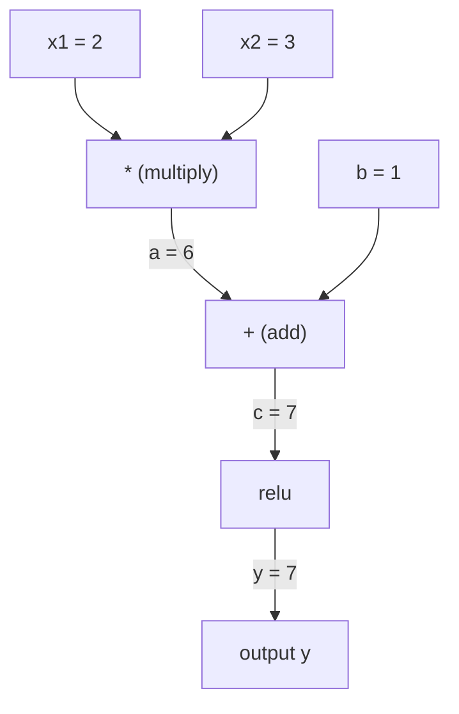
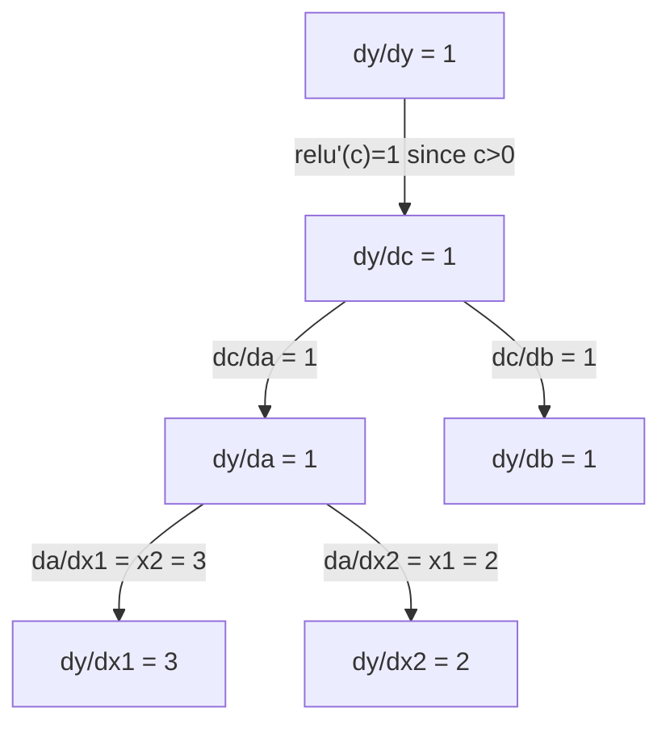

<!-- i18n:manual -->
# Цепное правило и автоматическое дифференцирование

> Цепное правило — двигатель любой обучающейся нейросети.

**Type:** Build
**Language:** Python
**Prerequisites:** Phase 1, Lesson 04 (Derivatives & Gradients)
**Time:** ~90 minutes

## Learning Objectives

- Построить минимальный движок autograd (класс Value), записывающий операции и считающий градиенты обратным autodiff
- Реализовать прямой и обратный проход по вычислительному графу с топологической сортировкой
- Собрать и обучить многослойный перцептрон на задаче XOR, используя только свой движок autograd
- Проверить корректность autodiff сравнением с численными конечными разностями

> 🎒 **На пальцах.** В прошлом уроке вы считали производные руками. Сейчас вы напишете программу, которая делает это за вас — маленькую копию PyTorch, штук на сто строк. И она будет работать по-настоящему.

## The Problem

Вы умеете считать производные простых функций. Но нейросеть — не простая функция. Это сотни функций, вложенных друг в друга: умножить матрицы, прибавить смещение, применить активацию, снова умножить матрицы, softmax, cross-entropy. Выход — функция от функции от функции.

Чтобы обучить сеть, нужен градиент потерь по каждому отдельному весу. Вручную для миллионов параметров это невозможно. Численно (конечными разностями) — слишком медленно.

Цепное правило даёт математику. Автоматическое дифференцирование даёт алгоритм. Вместе они позволяют вычислять точные градиенты через произвольные композиции функций за время, сравнимое с одним прямым проходом.

Так работают PyTorch, TensorFlow и JAX. Вы построите миниатюрную версию с нуля.

> 🎒 **На пальцах.** Считать миллион производных руками — как переписывать телефонный справочник от руки. Возможно теоретически, бессмысленно практически. Autograd — это ксерокс.

## The Concept

### The Chain Rule

Если `y = f(g(x))`, производная `y` по `x` равна:

```
dy/dx = dy/dg * dg/dx = f'(g(x)) * g'(x)
```

Перемножьте производные вдоль цепи. Каждое звено вносит свою локальную производную.

Пример: `y = sin(x^2)`

```
g(x) = x^2       g'(x) = 2x
f(g) = sin(g)     f'(g) = cos(g)

dy/dx = cos(x^2) * 2x
```

Для более глубоких композиций цепь удлиняется:

```
y = f(g(h(x)))

dy/dx = f'(g(h(x))) * g'(h(x)) * h'(x)
```

Каждый слой нейросети — одно звено этой цепи.

> 🎒 **На пальцах.** Пересчёт валют. 1 евро = 100 рублей, 1 рубль = 3 тенге. Сколько тенге в евро? 100 × 3 = 300. Вы только что применили цепное правило. Три обмена подряд — три множителя. Нейросеть из 50 слоёв — 50 множителей.

### Computational Graphs

Вычислительный граф делает цепное правило наглядным. Каждая операция — узел. Данные текут вперёд по графу. Градиенты текут назад.

**Forward pass (compute values):**



**Backward pass (compute gradients):**



Обратный проход применяет цепное правило в каждом узле, протаскивая градиенты от выхода ко входам.

> 🎒 **На пальцах.** Разберите этот граф руками, он крошечный. Вперёд: 2 × 3 = 6, плюс 1 = 7, relu(7) = 7. Назад спрашиваем: «если подтолкнуть x1 на чуть-чуть, насколько вырастет y?» x1 умножается на 3, значит на 3 чуть-чуть. Поэтому dy/dx1 = 3 — это просто значение соседа x2. Симметрично dy/dx2 = 2. Никакой магии, только счёт.

### Forward Mode vs Reverse Mode

Есть два способа применить цепное правило по графу.

**Forward mode** стартует со входов и толкает производные вперёд. Он берёт `dx/dx = 1` и продвигает через каждую операцию. Хорош, когда входов мало, а выходов много.

```
Forward mode: seed dx/dx = 1, propagate forward

  x = 2       (dx/dx = 1)
  a = x^2     (da/dx = 2x = 4)
  y = sin(a)  (dy/dx = cos(a) * da/dx = cos(4) * 4 = -2.615)
```

**Reverse mode** стартует с выхода и тянет градиенты назад. Он берёт `dy/dy = 1` и продвигает через каждую операцию в обратном порядке. Хорош, когда входов много, а выходов мало.

```
Reverse mode: seed dy/dy = 1, propagate backward

  y = sin(a)  (dy/dy = 1)
  a = x^2     (dy/da = cos(a) = cos(4) = -0.654)
  x = 2       (dy/dx = dy/da * da/dx = -0.654 * 4 = -2.615)
```

У нейросетей миллионы входов (весов) и один выход (потери). Обратный режим вычисляет все градиенты за один обратный проход. Поэтому обратное распространение использует именно его.

| Mode | Seed | Direction | Best when |
|------|------|-----------|-----------|
| Forward | `dx_i/dx_i = 1` | От входа к выходу | Мало входов, много выходов |
| Reverse | `dy/dy = 1` | От выхода ко входу | Много входов, мало выходов (нейросети) |

> 🎒 **На пальцах.** Почему обратный режим побеждает: у вас 1 миллион ручек и 1 лампочка яркости. Прямой режим спрашивает «что будет с лампочкой, если тронуть ручку №1?» — и так миллион раз, миллион проходов. Обратный режим спрашивает один раз «а кто вообще виноват в яркости?» — и за один проход раздаёт вину всем миллиону ручек. Миллион проходов против одного.

### Dual Numbers for Forward Mode

Прямой режим элегантно реализуется дуальными числами. Дуальное число имеет вид `a + b*epsilon`, где `epsilon^2 = 0`.

```
Dual number: (value, derivative)

(2, 1) means: value is 2, derivative w.r.t. x is 1

Arithmetic rules:
  (a, a') + (b, b') = (a+b, a'+b')
  (a, a') * (b, b') = (a*b, a'*b + a*b')
  sin(a, a')         = (sin(a), cos(a)*a')
```

Задайте входной переменной производную 1. Дальше производная распространяется автоматически через каждую операцию.

> 🎒 **На пальцах.** Дуальное число — как пара «сумма и чек». Вы носите с собой не одно число, а два: сколько сейчас и как быстро меняется. Все правила арифметики просто расширены на такие пары.

### Building an Autograd Engine

Движку autograd нужны три вещи:

1. **Value wrapping.** Обернуть каждое число в объект, хранящий значение и градиент.
2. **Graph recording.** Каждая операция записывает свои входы и функцию локального градиента.
3. **Backward pass.** Топологически отсортировать граф, затем пройти его в обратном порядке, применяя цепное правило в каждом узле.

Ровно это делает `autograd` в PyTorch. Класс `torch.Tensor` оборачивает значения, записывает операции при `requires_grad=True` и считает градиенты по вызову `.backward()`.

### How PyTorch Autograd Works Under the Hood

Когда вы пишете код на PyTorch:

```python
x = torch.tensor(2.0, requires_grad=True)
y = x ** 2 + 3 * x + 1
y.backward()
print(x.grad)  # 7.0 = 2*x + 3 = 2*2 + 3
```

PyTorch внутри:

1. Создаёт узел `Tensor` для `x` с `requires_grad=True`
2. Каждая операция (`**`, `*`, `+`) создаёт новый узел и записывает функцию обратного прохода
3. `y.backward()` запускает обратный autodiff по записанному графу
4. `grad_fn` каждого узла считает локальные градиенты и передаёт их родительским узлам
5. Градиенты накапливаются в атрибутах `.grad` сложением (а не заменой)

Граф динамический (define-by-run). Новый граф строится на каждом прямом проходе. Поэтому PyTorch поддерживает управляющие конструкции (if/else, циклы) внутри моделей.

> 🎒 **На пальцах.** Проверьте пример руками: y = x² + 3x + 1, производная 2x + 3, при x = 2 получаем 4 + 3 = 7. PyTorch напечатает ровно 7.0. Всё, что делает библиотека, вы можете проверить на бумаге за десять секунд.

```figure
chain-rule
```

## Build It

### Step 1: The Value class

```python
class Value:
    def __init__(self, data, children=(), op=''):
        self.data = data
        self.grad = 0.0
        self._backward = lambda: None
        self._prev = set(children)
        self._op = op

    def __repr__(self):
        return f"Value(data={self.data:.4f}, grad={self.grad:.4f})"
```

Каждый `Value` хранит своё число, свой градиент (изначально ноль), функцию обратного прохода и ссылки на дочерние узлы, из которых он получен.

### Step 2: Arithmetic operations with gradient tracking

```python
    def __add__(self, other):
        other = other if isinstance(other, Value) else Value(other)
        out = Value(self.data + other.data, (self, other), '+')
        def _backward():
            self.grad += out.grad
            other.grad += out.grad
        out._backward = _backward
        return out

    def __mul__(self, other):
        other = other if isinstance(other, Value) else Value(other)
        out = Value(self.data * other.data, (self, other), '*')
        def _backward():
            self.grad += other.data * out.grad
            other.grad += self.data * out.grad
        out._backward = _backward
        return out

    def relu(self):
        out = Value(max(0, self.data), (self,), 'relu')
        def _backward():
            self.grad += (1.0 if out.data > 0 else 0.0) * out.grad
        out._backward = _backward
        return out
```

Каждая операция создаёт замыкание, которое умеет вычислить локальные градиенты и умножить их на градиент сверху (`out.grad`). `+=` обрабатывает случай, когда значение участвует в нескольких операциях.

> 🎒 **На пальцах.** Обратите внимание на правило сложения: градиент проходит насквозь без изменений. Логично — если прибавить к сумме единицу, сумма вырастет ровно на единицу. А в умножении градиент каждого сомножителя равен значению соседа: «мой вклад тем важнее, чем больше тот, на кого меня умножают».

### Step 3: The backward pass

```python
    def backward(self):
        topo = []
        visited = set()
        def build_topo(v):
            if v not in visited:
                visited.add(v)
                for child in v._prev:
                    build_topo(child)
                topo.append(v)
        build_topo(self)

        self.grad = 1.0
        for v in reversed(topo):
            v._backward()
```

Топологическая сортировка гарантирует, что градиент узла полностью вычислен до того, как передастся его детям. Начальный градиент равен 1.0 (dy/dy = 1).

> 🎒 **На пальцах.** Топологическая сортировка — это «сначала носки, потом ботинки». Нельзя раздать вину узлу, пока не собрана вся вина с тех, кто идёт после него. Порядок в списке дел, где часть дел зависит от других.

### Step 4: More operations for a complete engine

Базовый класс Value умеет сложение, умножение и relu. Настоящему движку autograd нужно больше. Вот операции, необходимые для построения нейросетей:

```python
    def __neg__(self):
        return self * -1

    def __sub__(self, other):
        return self + (-other)

    def __radd__(self, other):
        return self + other

    def __rmul__(self, other):
        return self * other

    def __rsub__(self, other):
        return other + (-self)

    def __pow__(self, n):
        out = Value(self.data ** n, (self,), f'**{n}')
        def _backward():
            self.grad += n * (self.data ** (n - 1)) * out.grad
        out._backward = _backward
        return out

    def __truediv__(self, other):
        return self * (other ** -1) if isinstance(other, Value) else self * (Value(other) ** -1)

    def exp(self):
        import math
        e = math.exp(self.data)
        out = Value(e, (self,), 'exp')
        def _backward():
            self.grad += e * out.grad
        out._backward = _backward
        return out

    def log(self):
        import math
        out = Value(math.log(self.data), (self,), 'log')
        def _backward():
            self.grad += (1.0 / self.data) * out.grad
        out._backward = _backward
        return out

    def tanh(self):
        import math
        t = math.tanh(self.data)
        out = Value(t, (self,), 'tanh')
        def _backward():
            self.grad += (1 - t ** 2) * out.grad
        out._backward = _backward
        return out
```

**Why each operation matters:**

| Operation | Backward rule | Used in |
|-----------|--------------|---------|
| `__sub__` | Через add + neg | Вычисление потерь (pred - target) |
| `__pow__` | n * x^(n-1) | Полиномиальные активации, MSE (error^2) |
| `__truediv__` | Через mul + pow(-1) | Нормализация, масштабирование learning rate |
| `exp` | exp(x) * градиент сверху | Softmax, логарифм правдоподобия |
| `log` | (1/x) * градиент сверху | Cross-entropy loss, логарифмы вероятностей |
| `tanh` | (1 - tanh^2) * градиент сверху | Классическая функция активации |

Хитрая часть: `__sub__` и `__truediv__` определены через уже существующие операции. Правильные градиенты получаются бесплатно, потому что цепное правило собирается через нижележащие add/mul/pow.

> 🎒 **На пальцах.** Вычитание не пишут отдельно: «отнять 5» — то же самое, что «прибавить −5». Деление — то же самое, что умножить на перевёрнутую дробь. Школьный трюк, но здесь он экономит половину кода и половину возможных ошибок.

### Step 5: Mini MLP from scratch

С полноценным классом Value можно собрать нейросеть. Без PyTorch. Без NumPy. Только Value и цепное правило.

```python
import random

class Neuron:
    def __init__(self, n_inputs):
        self.w = [Value(random.uniform(-1, 1)) for _ in range(n_inputs)]
        self.b = Value(0.0)

    def __call__(self, x):
        act = sum((wi * xi for wi, xi in zip(self.w, x)), self.b)
        return act.tanh()

    def parameters(self):
        return self.w + [self.b]

class Layer:
    def __init__(self, n_inputs, n_outputs):
        self.neurons = [Neuron(n_inputs) for _ in range(n_outputs)]

    def __call__(self, x):
        return [n(x) for n in self.neurons]

    def parameters(self):
        return [p for n in self.neurons for p in n.parameters()]

class MLP:
    def __init__(self, sizes):
        self.layers = [Layer(sizes[i], sizes[i+1]) for i in range(len(sizes)-1)]

    def __call__(self, x):
        for layer in self.layers:
            x = layer(x)
        return x[0] if len(x) == 1 else x

    def parameters(self):
        return [p for layer in self.layers for p in layer.parameters()]
```

`Neuron` вычисляет `tanh(w1*x1 + w2*x2 + ... + b)`. `Layer` — список нейронов. `MLP` складывает слои стопкой. Каждый вес — это `Value`, поэтому вызов `loss.backward()` протаскивает градиенты до каждого параметра.

**Training on XOR:**

```python
random.seed(42)
model = MLP([2, 4, 1])  # 2 inputs, 4 hidden neurons, 1 output

xs = [[0, 0], [0, 1], [1, 0], [1, 1]]
ys = [-1, 1, 1, -1]  # XOR pattern (using -1/1 for tanh)

for step in range(100):
    preds = [model(x) for x in xs]
    loss = sum((p - y) ** 2 for p, y in zip(preds, ys))

    for p in model.parameters():
        p.grad = 0.0
    loss.backward()

    lr = 0.05
    for p in model.parameters():
        p.data -= lr * p.grad

    if step % 20 == 0:
        print(f"step {step:3d}  loss = {loss.data:.4f}")

print("\nPredictions after training:")
for x, y in zip(xs, ys):
    print(f"  input={x}  target={y:2d}  pred={model(x).data:6.3f}")
```

Это micrograd. Полный цикл обучения нейросети на чистом Python с автоматическим дифференцированием. Любой коммерческий фреймворк глубокого обучения делает то же самое, только в огромном масштабе.

> 🎒 **На пальцах.** XOR — это «или то, или другое, но не оба сразу». Как выключатель в коридоре с двумя кнопками: щёлкнули одну — свет горит, щёлкнули обе — погас. Задача знаменита тем, что одним слоем её решить невозможно в принципе — нельзя разделить эти четыре точки одной прямой линией. Отсюда и скрытый слой из 4 нейронов. Именно на этой задаче в 1969 году едва не похоронили нейросети.

### Step 6: Gradient checking

Как убедиться, что ваш autodiff корректен? Сравнить его с численными производными. Это gradient checking.

```python
def gradient_check(build_expr, x_val, h=1e-7):
    x = Value(x_val)
    y = build_expr(x)
    y.backward()
    autodiff_grad = x.grad

    y_plus = build_expr(Value(x_val + h)).data
    y_minus = build_expr(Value(x_val - h)).data
    numerical_grad = (y_plus - y_minus) / (2 * h)

    diff = abs(autodiff_grad - numerical_grad)
    return autodiff_grad, numerical_grad, diff
```

Проверьте на сложном выражении:

```python
def expr(x):
    return (x ** 3 + x * 2 + 1).tanh()

ad, num, diff = gradient_check(expr, 0.5)
print(f"Autodiff:  {ad:.8f}")
print(f"Numerical: {num:.8f}")
print(f"Difference: {diff:.2e}")
# Difference should be < 1e-5
```

Gradient checking незаменим при реализации новых операций. Если в обратном проходе баг, численная проверка его поймает. Любая серьёзная реализация глубокого обучения гоняет такие проверки во время разработки.

**When to use gradient checking:**

| Situation | Do gradient check? |
|-----------|-------------------|
| Добавляете новую операцию в свой autograd | Да, всегда |
| Отлаживаете цикл обучения, который не сходится | Да, сначала проверьте градиенты |
| Продакшн-обучение | Нет, слишком медленно (2 прямых прохода на параметр) |
| Юнит-тесты кода autograd | Да, автоматизируйте |

> 🎒 **На пальцах.** Это как проверить деление умножением. Разделили 91 на 7, получили 13, умножили обратно 13 × 7 = 91 — сошлось. Здесь так же: посчитали производную умным быстрым способом, перепроверили тупым медленным. Совпало — значит умный способ написан правильно.

### Step 7: Verify against manual calculation

```python
x1 = Value(2.0)
x2 = Value(3.0)
a = x1 * x2          # a = 6.0
b = a + Value(1.0)    # b = 7.0
y = b.relu()          # y = 7.0

y.backward()

print(f"y = {y.data}")          # 7.0
print(f"dy/dx1 = {x1.grad}")   # 3.0 (= x2)
print(f"dy/dx2 = {x2.grad}")   # 2.0 (= x1)
```

Проверка руками: `y = relu(x1*x2 + 1)`. Так как `x1*x2 + 1 = 7 > 0`, relu работает как тождественная функция.
`dy/dx1 = x2 = 3`. `dy/dx2 = x1 = 2`. Движок совпадает.

## Use It

### Verify against PyTorch

```python
import torch

x1 = torch.tensor(2.0, requires_grad=True)
x2 = torch.tensor(3.0, requires_grad=True)
a = x1 * x2
b = a + 1.0
y = torch.relu(b)
y.backward()

print(f"PyTorch dy/dx1 = {x1.grad.item()}")  # 3.0
print(f"PyTorch dy/dx2 = {x2.grad.item()}")  # 2.0
```

Те же градиенты. Ваш движок выдаёт тот же результат, что и PyTorch, потому что математика одна: обратный autodiff по цепному правилу.

### A more complex expression

```python
a = Value(2.0)
b = Value(-3.0)
c = Value(10.0)
f = (a * b + c).relu()  # relu(2*(-3) + 10) = relu(4) = 4

f.backward()
print(f"df/da = {a.grad}")  # -3.0 (= b)
print(f"df/db = {b.grad}")  #  2.0 (= a)
print(f"df/dc = {c.grad}")  #  1.0
```

> 🎒 **На пальцах.** Сверьте в уме: 2 × (−3) = −6, плюс 10 = 4, relu(4) = 4. Градиенты: у a сосед b = −3, у b сосед a = 2, а c просто прибавляется, поэтому 1. Совпало с комментариями в коде — значит вы уже читаете вычислительный граф без подсказок.

## Ship It

Этот урок производит:
- `outputs/skill-autodiff.md` -- навык построения и отладки систем autograd
- `code/autodiff.py` -- минимальный движок autograd, который можно расширять

Класс Value, построенный здесь, — фундамент цикла обучения нейросетей в Phase 3.

## Exercises

1. Добавьте `__pow__` в класс Value, чтобы можно было вычислять `x ** n`. Убедитесь, что `d/dx(x^3)` при `x=2` равно `12.0`.

2. Добавьте `tanh` как функцию активации. Убедитесь, что `tanh'(0) = 1` и `tanh'(2) = 0.0707` (приблизительно).

3. Постройте вычислительный граф для одного нейрона: `y = relu(w1*x1 + w2*x2 + b)`. Вычислите все пять градиентов и сверьтесь с PyTorch.

4. Реализуйте прямой режим autodiff на дуальных числах. Создайте класс `Dual` и убедитесь, что он даёт те же производные, что и ваш движок обратного режима.

> 🎒 **На пальцах.** К первому заданию: производная x³ равна 3x², при x = 2 это 3 × 4 = 12. Проверить можно за секунду в уме — и именно это число должна напечатать программа. Всегда так делайте: сначала ответ на бумаге, потом запуск. Иначе непонятно, что считать успехом.

## Key Terms

| Term | What people say | What it actually means |
|------|----------------|----------------------|
| Chain rule | «Перемножить производные» | Производная вложенных функций равна произведению локальных производных каждой функции, вычисленных в нужных точках |
| Computational graph | «Схема сети» | Направленный ациклический граф, где узлы — операции, а рёбра несут значения (вперёд) или градиенты (назад) |
| Forward mode | «Толкать производные вперёд» | Autodiff, продвигающий производные от входов к выходам. Один проход на каждую входную переменную. |
| Reverse mode | «Обратное распространение» | Autodiff, продвигающий градиенты от выходов ко входам. Один проход на каждую выходную переменную. |
| Autograd | «Автоматические градиенты» | Система, записывающая операции над значениями, строящая граф и вычисляющая точные градиенты по цепному правилу |
| Dual numbers | «Значение плюс производная» | Числа вида a + b*epsilon (epsilon^2 = 0), переносящие информацию о производной через арифметику |
| Topological sort | «Порядок зависимостей» | Упорядочивание узлов графа так, чтобы каждый шёл после всех своих зависимостей. Необходимо для корректного распространения градиентов. |
| Gradient accumulation | «Складывать, а не заменять» | Когда значение участвует в нескольких операциях, его градиент — сумма всех входящих вкладов |
| Dynamic graph | «Define by run» | Вычислительный граф, перестраиваемый на каждом прямом проходе; позволяет использовать управляющие конструкции Python внутри моделей (стиль PyTorch) |
| Gradient checking | «Численная проверка» | Сравнение градиентов autodiff с численными конечными разностями для проверки корректности. Незаменимо при отладке. |
| MLP | «Многослойный перцептрон» | Нейросеть с одним или несколькими скрытыми слоями нейронов. Каждый нейрон считает взвешенную сумму плюс смещение, затем применяет функцию активации. |
| Neuron | «Взвешенная сумма + активация» | Базовая единица: output = activation(w1*x1 + w2*x2 + ... + b). Веса и смещение — обучаемые параметры. |

## Further Reading

- [3Blue1Brown: Backpropagation calculus](https://www.youtube.com/watch?v=tIeHLnjs5U8) -- визуальное объяснение цепного правила в нейросетях
- [PyTorch Autograd mechanics](https://pytorch.org/docs/stable/notes/autograd.html) -- как устроена настоящая система
- [Baydin et al., Automatic Differentiation in Machine Learning: a Survey](https://arxiv.org/abs/1502.05767) -- исчерпывающий справочник
