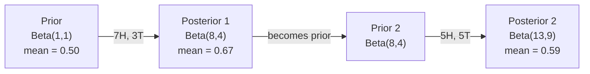

<!-- i18n:manual -->
# Теорема Байеса

> Вероятность — про то, чего вы ожидаете. Теорема Байеса — про то, чему вы научились.

**Type:** Build
**Language:** Python
**Prerequisites:** Phase 1, Lesson 06 (Probability Fundamentals)
**Time:** ~75 minutes

## Learning Objectives

- Применять теорему Байеса для вычисления апостериорных вероятностей из априорных, правдоподобия и полной вероятности
- Построить с нуля наивный байесовский классификатор текста со сглаживанием Лапласа и вычислениями в логарифмах
- Сравнить оценки MLE и MAP и объяснить, как MAP соответствует L2-регуляризации
- Реализовать последовательное байесовское обновление на сопряжённых Beta-Binomial априорных для A/B-тестов

> 🎒 **На пальцах.** Вы что-то думали. Появился новый факт. Насколько сильно менять мнение? Теорема Байеса даёт точный ответ числом. Это единственная формула в курсе, которая пригодится вам вне программирования.

## The Problem

Медицинский тест точен на 99%. У вас положительный результат. Каковы шансы, что вы действительно больны?

Большинство скажет: 99%. Настоящий ответ зависит от того, насколько редка болезнь. Если ею болеет 1 человек из 10 000, положительный результат даёт всего около 1% шанса быть больным. Остальные 99% положительных результатов — ложные тревоги у здоровых людей.

Это не задача с подвохом. Это теорема Байеса. Каждый спам-фильтр, каждая медицинская диагностика, каждая ML-модель, оценивающая неопределённость, рассуждают ровно так. Вы начинаете с убеждения. Видите свидетельство. Обновляетесь.

Если вы строите ML-системы без понимания этого, вы будете неверно толковать выходы модели, ставить плохие пороги и выкатывать самоуверенные предсказания.

> 🎒 **На пальцах.** Считаем на 10 000 человек. Болен — 1. Тест его найдёт (99%). Здоровых — 9 999, и тест ошибётся на 1% из них, то есть примерно на 100 людях. Итого положительных результатов около 101, а больной среди них один. Один из 101 — это меньше 1%. Вся «магия» — обычный подсчёт людей.

## The Concept

### From joint probability to Bayes

Из урока 06 вы уже знаете, что условная вероятность равна:

```
P(A|B) = P(A and B) / P(B)
```

И симметрично:

```
P(B|A) = P(A and B) / P(A)
```

У обоих выражений одинаковый числитель: P(A и B). Приравняйте их и переставьте:

```
P(A and B) = P(A|B) * P(B) = P(B|A) * P(A)

Therefore:

P(A|B) = P(B|A) * P(A) / P(B)
```

Это и есть теорема Байеса. Четыре величины, одно уравнение.

### The four parts

| Part | Name | What it means |
|------|------|---------------|
| P(A\|B) | Апостериорная | Ваше обновлённое убеждение об A после свидетельства B |
| P(B\|A) | Правдоподобие | Насколько вероятно свидетельство B, если A истинно |
| P(A) | Априорная | Ваше убеждение об A до всяких свидетельств |
| P(B) | Полная вероятность | Полная вероятность увидеть B при всех вариантах |

Слагаемое P(B) работает нормировщиком. Его можно расписать по формуле полной вероятности:

```
P(B) = P(B|A) * P(A) + P(B|not A) * P(not A)
```

> 🎒 **На пальцах.** По-человечески формула читается так: «новое мнение = старое мнение × насколько факт его подтверждает, поделить на то, насколько факт вообще ожидаем». Редкое событие + слабое свидетельство = мнение почти не меняется. Именно поэтому рассказ «у меня сработал детектор» мало что доказывает, если детектор часто врёт.

### Medical test example

Болезнь поражает 1 человека из 10 000. Тест точен на 99% (находит 99% больных, ложно срабатывает в 1% случаев).

```
P(sick)          = 0.0001     (prior: disease is rare)
P(positive|sick) = 0.99       (likelihood: test catches it)
P(positive|healthy) = 0.01    (false positive rate)

P(positive) = P(positive|sick) * P(sick) + P(positive|healthy) * P(healthy)
            = 0.99 * 0.0001 + 0.01 * 0.9999
            = 0.000099 + 0.009999
            = 0.010098

P(sick|positive) = P(positive|sick) * P(sick) / P(positive)
                 = 0.99 * 0.0001 / 0.010098
                 = 0.0098
                 = 0.98%
```

Меньше 1%. Априорная вероятность доминирует. Когда состояние редкое, даже точные тесты дают в основном ложные срабатывания. Поэтому врачи назначают подтверждающие анализы.

### Spam filter example

Вам пришло письмо со словом «lottery». Это спам?

```
P(spam)                = 0.3      (30% of email is spam)
P("lottery"|spam)      = 0.05     (5% of spam emails contain "lottery")
P("lottery"|not spam)  = 0.001    (0.1% of legitimate emails contain "lottery")

P("lottery") = 0.05 * 0.3 + 0.001 * 0.7
             = 0.015 + 0.0007
             = 0.0157

P(spam|"lottery") = 0.05 * 0.3 / 0.0157
                  = 0.955
                  = 95.5%
```

Одно слово сдвигает вероятность с 30% до 95.5%. Настоящий спам-фильтр применяет Байеса к сотням слов одновременно.

> 🎒 **На пальцах.** Почему здесь одно слово решает, а в медицинском примере тест почти ничего не изменил? Смотрите на разрыв: «lottery» встречается в спаме в 50 раз чаще, чем в нормальных письмах (0.05 против 0.001). А ложные срабатывания теста были всего в 100 раз реже болезни, зато сама болезнь — в 10 000 раз реже здоровья. Побеждает тот, у кого разрыв больше.

### Naive Bayes: independence assumption

Наивный Байес расширяет это на много признаков, предполагая, что все признаки условно независимы при заданном классе:

```
P(class | feature_1, feature_2, ..., feature_n)
  = P(class) * P(feature_1|class) * P(feature_2|class) * ... * P(feature_n|class)
    / P(feature_1, feature_2, ..., feature_n)
```

«Наивная» часть — как раз предположение о независимости. В тексте появления слов независимыми не являются («New» и «York» скоррелированы). Но предположение работает на удивление хорошо, потому что классификатору нужно лишь ранжировать классы, а не выдавать откалиброванные вероятности.

Поскольку знаменатель одинаков для всех классов, его можно пропустить и сравнивать только числители:

```
score(class) = P(class) * product of P(feature_i | class)
```

Выбирайте класс с наибольшей оценкой.

> 🎒 **На пальцах.** «Наивность» тут — как считать, что оценки по математике и физике никак не связаны. Это неправда: кто силён в одном, обычно силён и в другом. Но если задача — просто угадать, отличник перед вами или двоечник, ошибка не мешает: ответ всё равно получается верный.

### Maximum likelihood estimation (MLE)

Откуда взять P(признак|класс) из обучающих данных? Посчитать.

```
P("free"|spam) = (number of spam emails containing "free") / (total spam emails)
```

Это MLE: выбрать значения параметров, при которых наблюдаемые данные наиболее вероятны. Вы максимизируете функцию правдоподобия, которая для дискретных счётчиков сводится к относительной частоте.

Проблема: если слово ни разу не встретилось в спаме при обучении, MLE даёт ему вероятность ноль. Одно невиданное слово убивает всё произведение. Лечится сглаживанием Лапласа:

```
P(word|class) = (count(word, class) + 1) / (total_words_in_class + vocabulary_size)
```

Добавление 1 к каждому счётчику гарантирует, что вероятность никогда не будет нулевой.

> 🎒 **На пальцах.** Ноль в произведении — как ноль в оценках за четверть: один прогул обнуляет всё остальное. Сглаживание Лапласа говорит: «считаем, что каждое слово встретилось хотя бы разочек». Маленькая ложь, зато система перестаёт ломаться от каждого незнакомого слова.

### Maximum a posteriori (MAP)

MLE спрашивает: какие параметры максимизируют P(данные|параметры)?

MAP спрашивает: какие параметры максимизируют P(параметры|данные)?

По теореме Байеса:

```
P(parameters|data) proportional to P(data|parameters) * P(parameters)
```

MAP добавляет априорное распределение на сами параметры. Если вы считаете, что параметры должны быть маленькими, вы кодируете это как априорное распределение, штрафующее большие значения. Это в точности L2-регуляризация в ML. «Ridge»-штраф в ridge regression — буквально гауссовское априорное распределение на весах.

| Estimation | Optimizes | ML equivalent |
|------------|-----------|---------------|
| MLE | P(data\|params) | Обучение без регуляризации |
| MAP | P(data\|params) * P(params) | L2 / L1 регуляризация |

> 🎒 **На пальцах.** Один раз бросили монету, выпал орёл. MLE честно заявляет: «вероятность орла 100%». Абсурд, но данные говорят именно это. MAP добавляет здравый смысл: «монеты обычно честные, одного броска мало» — и выдаёт что-то около 0.6. Регуляризация в нейросетях делает ровно то же самое: не даёт модели сделать безумный вывод из трёх примеров.

### Bayesian vs frequentist: the practical difference

Частотники считают параметры фиксированными неизвестными. Они спрашивают: «Если повторить эксперимент много раз, что получится?»

Байесианцы считают параметры распределениями. Они спрашивают: «Учитывая увиденное, что я думаю о параметрах?»

Для построения ML-систем практическая разница такая:

| Aspect | Frequentist | Bayesian |
|--------|-------------|----------|
| Выход | Точечная оценка | Распределение значений |
| Неопределённость | Доверительные интервалы (о процедуре) | Байесовские интервалы (о параметре) |
| Мало данных | Может переобучиться | Априорное работает как регуляризация |
| Вычисления | Обычно быстрее | Часто требуют сэмплирования (MCMC) |

Большинство продакшн-ML — частотное (SGD, точечные оценки). Байесовские методы блистают там, где нужна откалиброванная неопределённость (медицинские решения, системы с высокой ценой ошибки) или где данных мало (few-shot learning, холодный старт).

### Why Bayesian thinking matters for ML

Связь глубже, чем аналогия:

**Priors are regularization.** Гауссовское априорное на весах — это L2-регуляризация. Лапласовское — L1. Каждый раз, добавляя регуляризацию, вы делаете байесовское утверждение о том, каких значений параметров ожидаете.

**Posteriors are uncertainty.** Одно предсказанное число ничего не говорит о том, насколько модель уверена в этой оценке. Байесовские методы дают распределение: «думаю, P(spam) лежит между 0.8 и 0.95».

**Bayes updates are online learning.** Сегодняшнее апостериорное становится завтрашним априорным. Когда модель видит новые данные, она обновляет убеждения постепенно, а не переобучается с нуля.

**Model comparison is Bayesian.** Байесовский информационный критерий (BIC), маргинальное правдоподобие и байесовские факторы — все используют байесовские рассуждения для выбора между моделями без переобучения.

```figure
bayes-update
```

## Build It

### Step 1: Bayes theorem function

```python
def bayes(prior, likelihood, false_positive_rate):
    evidence = likelihood * prior + false_positive_rate * (1 - prior)
    posterior = likelihood * prior / evidence
    return posterior

result = bayes(prior=0.0001, likelihood=0.99, false_positive_rate=0.01)
print(f"P(sick|positive) = {result:.4f}")
```

### Step 2: Naive Bayes classifier

```python
import math
from collections import defaultdict

class NaiveBayes:
    def __init__(self, smoothing=1.0):
        self.smoothing = smoothing
        self.class_counts = defaultdict(int)
        self.word_counts = defaultdict(lambda: defaultdict(int))
        self.class_word_totals = defaultdict(int)
        self.vocab = set()

    def train(self, documents, labels):
        for doc, label in zip(documents, labels):
            self.class_counts[label] += 1
            words = doc.lower().split()
            for word in words:
                self.word_counts[label][word] += 1
                self.class_word_totals[label] += 1
                self.vocab.add(word)

    def predict(self, document):
        words = document.lower().split()
        total_docs = sum(self.class_counts.values())
        vocab_size = len(self.vocab)
        best_class = None
        best_score = float("-inf")
        for cls in self.class_counts:
            score = math.log(self.class_counts[cls] / total_docs)
            for word in words:
                count = self.word_counts[cls].get(word, 0)
                total = self.class_word_totals[cls]
                score += math.log((count + self.smoothing) / (total + self.smoothing * vocab_size))
            if score > best_score:
                best_score = score
                best_class = cls
        return best_class
```

Логарифмы вероятностей предотвращают исчезновение порядка. Перемножение множества маленьких вероятностей даёт числа, слишком крошечные для чисел с плавающей точкой. Сложение логарифмов численно устойчиво и математически эквивалентно.

### Step 3: Train on spam data

```python
train_docs = [
    "win free money now",
    "free lottery ticket winner",
    "claim your prize today free",
    "urgent offer free cash",
    "congratulations you won free",
    "meeting tomorrow at noon",
    "project update attached",
    "can we schedule a call",
    "quarterly report review",
    "lunch on thursday sounds good",
    "team standup notes attached",
    "please review the pull request",
]

train_labels = [
    "spam", "spam", "spam", "spam", "spam",
    "ham", "ham", "ham", "ham", "ham", "ham", "ham",
]

classifier = NaiveBayes()
classifier.train(train_docs, train_labels)

test_messages = [
    "free money waiting for you",
    "meeting rescheduled to friday",
    "you won a free prize",
    "please review the attached report",
]

for msg in test_messages:
    print(f"  '{msg}' -> {classifier.predict(msg)}")
```

> 🎒 **На пальцах.** Обучающих писем всего 12, и вы можете глазами увидеть, что выучит программа: слово «free» стоит в 4 письмах из 5 спамных и ни в одном нормальном. Значит любое новое письмо со словом «free» получит ярлык spam. Никакого интеллекта — только подсчёт частот.

### Step 4: Inspect the learned probabilities

```python
def show_top_words(classifier, cls, n=5):
    vocab_size = len(classifier.vocab)
    total = classifier.class_word_totals[cls]
    probs = {}
    for word in classifier.vocab:
        count = classifier.word_counts[cls].get(word, 0)
        probs[word] = (count + classifier.smoothing) / (total + classifier.smoothing * vocab_size)
    sorted_words = sorted(probs.items(), key=lambda x: x[1], reverse=True)
    for word, prob in sorted_words[:n]:
        print(f"    {word}: {prob:.4f}")

print("\nTop spam words:")
show_top_words(classifier, "spam")
print("\nTop ham words:")
show_top_words(classifier, "ham")
```

## Use It

Scikit-learn поставляет готовые к продакшену реализации наивного Байеса:

```python
from sklearn.feature_extraction.text import CountVectorizer
from sklearn.naive_bayes import MultinomialNB
from sklearn.metrics import classification_report

vectorizer = CountVectorizer()
X_train = vectorizer.fit_transform(train_docs)
clf = MultinomialNB()
clf.fit(X_train, train_labels)

X_test = vectorizer.transform(test_messages)
predictions = clf.predict(X_test)
for msg, pred in zip(test_messages, predictions):
    print(f"  '{msg}' -> {pred}")
```

Тот же алгоритм. CountVectorizer занимается токенизацией и построением словаря. MultinomialNB внутри делает сглаживание и логарифмы. Ваша версия с нуля делает то же самое в 40 строках.

## Ship It

Класс NaiveBayes, построенный здесь, показывает весь конвейер: токенизация, оценка вероятностей со сглаживанием Лапласа, предсказание в логарифмическом пространстве. Код в `code/bayes.py` работает от начала до конца без зависимостей за пределами стандартной библиотеки Python.

### Conjugate Priors

Когда априорное и апостериорное распределения принадлежат одному семейству, априорное называют «сопряжённым». Это делает байесовское обновление алгебраически чистым — вы получаете апостериорное в замкнутой форме, без численного интегрирования.

| Likelihood | Conjugate Prior | Posterior | Example |
|-----------|----------------|-----------|---------|
| Bernoulli | Beta(a, b) | Beta(a + успехи, b + неудачи) | Оценка перекоса монеты |
| Normal (известная дисперсия) | Normal(mu_0, sigma_0) | Normal(взвешенное среднее, меньшая дисперсия) | Калибровка датчика |
| Poisson | Gamma(a, b) | Gamma(a + сумма счётчиков, b + n) | Моделирование интенсивности событий |
| Multinomial | Dirichlet(alpha) | Dirichlet(alpha + счётчики) | Тематическое моделирование, языковые модели |

Почему это важно: без сопряжённых априорных вам нужны Монте-Карло или вариационный вывод, чтобы приблизить апостериорное. С сопряжёнными вы просто обновляете два числа.

Бета-распределение — самое частое сопряжённое априорное на практике. Beta(a, b) выражает ваше мнение о вероятностном параметре. Среднее равно a/(a+b). Чем больше a+b, тем концентрированнее (увереннее) распределение.

Частные случаи бета-априорного:
- Beta(1, 1) = равномерное. У вас нет мнения о параметре.
- Beta(10, 10) = пик на 0.5. Вы твёрдо считаете, что параметр близок к 0.5.
- Beta(1, 10) = скошено к нулю. Вы считаете, что параметр маленький.

Правило обновления предельно простое:

```
Prior:     Beta(a, b)
Data:      s successes, f failures
Posterior: Beta(a + s, b + f)
```

Никаких интегралов. Никакого сэмплирования. Просто сложение.

> 🎒 **На пальцах.** Beta(a, b) удобно читать так: a — «сколько раз получилось», b — «сколько раз не получилось». Beta(1, 1) — по разу того и другого, то есть «ничего не знаю». Увидели 7 орлов и 3 решки — прибавили: Beta(8, 4), среднее 8/12 = 0.67. Всё обновление знаний — два сложения.

### Sequential Bayesian Updating

Байесовский вывод естественно последователен. Сегодняшнее апостериорное становится завтрашним априорным. Так настоящие системы учатся постепенно, не перелопачивая всю историю данных.

Конкретный пример: оценить, честная ли монета.

**Day 1: No data yet.**
Начинаем с Beta(1, 1) — равномерное априорное. Мнения нет.
- Среднее априорного: 0.5
- Априорное равномерно на [0, 1]

**Day 2: Observe 7 heads, 3 tails.**
Апостериорное = Beta(1 + 7, 1 + 3) = Beta(8, 4)
- Среднее апостериорного: 8/12 = 0.667
- Данные намекают, что монета перекошена к орлу

**Day 3: Observe 5 more heads, 5 more tails.**
Используем вчерашнее апостериорное как сегодняшнее априорное.
Апостериорное = Beta(8 + 5, 4 + 5) = Beta(13, 9)
- Среднее апостериорного: 13/22 = 0.591
- Сбалансированные новые данные оттянули оценку назад к 0.5



Порядок наблюдений не важен. Beta(1,1), обновлённое сразу всеми 12 орлами и 8 решками, даёт Beta(13, 9) — тот же результат. Последовательное и пакетное обновления математически эквивалентны. Но последовательное позволяет принимать решения на каждом шаге, не храня сырые данные.

Это фундамент онлайн-обучения в продакшн-ML. Thompson sampling для многоруких бандитов, инкрементальные рекомендательные системы и потоковые детекторы аномалий — все используют этот приём.

> 🎒 **На пальцах.** Так вы и оцениваете нового одноклассника. Первое впечатление — априорное. Один поступок мнение сдвигает, но не переворачивает. Десять поступков подряд — переворачивают. И вам не нужно помнить каждый день по отдельности: достаточно текущего мнения и нового факта.

### Connection to A/B Testing

A/B-тест — это байесовский вывод в маскировке.

Постановка: вы тестируете два цвета кнопки. Вариант A (синий) и вариант B (зелёный). Хотите знать, какой собирает больше кликов.

Байесовский A/B-тест:

1. **Prior.** Начинаем с Beta(1, 1) для обоих вариантов. Предпочтений нет.
2. **Data.** Вариант A: 50 кликов из 1000 показов. Вариант B: 65 кликов из 1000 показов.
3. **Posteriors.**
   - A: Beta(1 + 50, 1 + 950) = Beta(51, 951). Среднее = 0.051
   - B: Beta(1 + 65, 1 + 935) = Beta(66, 936). Среднее = 0.066
4. **Decision.** Вычислить P(B > A) — вероятность того, что истинная конверсия B выше, чем у A.

Вычислить P(B > A) аналитически трудно. Но Монте-Карло делает это тривиальным:

```
1. Draw 100,000 samples from Beta(51, 951)  -> samples_A
2. Draw 100,000 samples from Beta(66, 936)  -> samples_B
3. P(B > A) = fraction of samples where B > A
```

Если P(B > A) > 0.95, выкатывайте вариант B. Если между 0.05 и 0.95 — собирайте данные дальше. Если P(B > A) < 0.05 — выкатывайте вариант A.

Преимущества перед частотным A/B-тестом:
- Вы получаете прямое вероятностное утверждение: «шанс 97%, что B лучше»
- Никакой путаницы с p-значениями. Никаких уклончивых «не отвергаем нулевую гипотезу».
- Можно смотреть результаты в любой момент, не раздувая долю ложных срабатываний (нет «проблемы подглядывания»)
- Можно закладывать прошлые знания (например, что конверсия обычно 3-8%)

| Aspect | Frequentist A/B | Bayesian A/B |
|--------|----------------|--------------|
| Выход | p-значение | P(B > A) |
| Толкование | «Насколько удивительны данные, если A=B?» | «Насколько вероятно, что B лучше A?» |
| Ранняя остановка | Раздувает ложные срабатывания | Безопасна в любой момент (при разумном априорном и корректно заданной модели) |
| Прошлые знания | Не используются | Кодируются бета-априорным |
| Правило решения | p < 0.05 | P(B > A) > порог |

> 🎒 **На пальцах.** Разница по-простому. Частотный подход отвечает на вопрос, который вы не задавали: «насколько странны эти данные, если кнопки одинаковые?» Байесовский отвечает на ваш настоящий вопрос: «какова вероятность, что зелёная лучше?» Второе можно сказать начальнику вслух, и вас поймут.

## Exercises

1. **Multiple tests.** Пациент дважды получил положительный результат на независимых тестах (оба точны на 99%, распространённость болезни 1 на 10 000). Чему равна P(болен) после обоих тестов? Используйте апостериорное с первого теста как априорное для второго.

2. **Smoothing impact.** Запустите спам-классификатор со сглаживанием 0.01, 0.1, 1.0 и 10.0. Как меняются вероятности топовых слов? Что произойдёт при smoothing=0 со словом, которое встречается только в ham?

3. **Add features.** Расширьте класс NaiveBayes, добавив длину сообщения (короткое/длинное) как признак наряду со счётчиками слов. Оцените P(короткое|spam) и P(короткое|ham) из обучающих данных и вставьте это в итоговую оценку.

4. **MAP by hand.** По наблюдению (7 орлов из 10 бросков) вычислите MAP-оценку перекоса с априорным Beta(2,2). Сравните с MLE-оценкой (7/10).

> 🎒 **На пальцах.** К первому заданию — самое интересное. После первого теста шанс болезни вырос с 0.01% примерно до 1%. Берём этот 1% как новое априорное и повторяем расчёт: получится уже около 50%. Два теста подряд превращают «почти наверняка ложная тревога» в «монетка». Ровно поэтому врачи и назначают повторный анализ.

## Key Terms

| Term | What people say | What it actually means |
|------|----------------|----------------------|
| Prior | «Моё первоначальное предположение» | P(гипотеза) до наблюдения свидетельств. В ML: слагаемое регуляризации. |
| Likelihood | «Насколько данные подходят» | P(свидетельство\|гипотеза). Насколько вероятны наблюдаемые данные при конкретной гипотезе. |
| Posterior | «Моё обновлённое убеждение» | P(гипотеза\|свидетельство). Априорное, умноженное на правдоподобие и нормированное. |
| Evidence | «Нормировочная константа» | P(данные) по всем гипотезам. Гарантирует, что апостериорное в сумме даёт 1. |
| Naive Bayes | «Тот простой классификатор текста» | Классификатор, считающий признаки независимыми при заданном классе. Работает хорошо вопреки ложному предположению. |
| Laplace smoothing | «Сглаживание добавлением единицы» | Прибавление маленького счётчика к каждому признаку, чтобы невиданные данные не давали нулевых вероятностей. |
| MLE | «Просто взять частоты» | Выбрать параметры, максимизирующие P(данные\|параметры). Без априорного. На малых данных переобучается. |
| MAP | «MLE с априорным» | Выбрать параметры, максимизирующие P(данные\|параметры) * P(параметры). Эквивалентно регуляризованному MLE. |
| Log-probability | «Работать в логарифмах» | Использование log(P) вместо P, чтобы избежать исчезновения порядка при перемножении множества малых чисел. |
| False positive | «Ложная тревога» | Тест говорит «положительно», а истинное состояние отрицательное. Основа ошибки базовой доли. |

## Further Reading

- [3Blue1Brown: Bayes' theorem](https://www.youtube.com/watch?v=HZGCoVF3YvM) - визуальное объяснение на примере медицинского теста
- [Stanford CS229: Generative Learning Algorithms](https://cs229.stanford.edu/notes2022fall/cs229-notes2.pdf) - наивный Байес и его связь с дискриминативными моделями
- [Think Bayes](https://greenteapress.com/wp/think-bayes/) - бесплатная книга, байесовская статистика с кодом на Python
- [scikit-learn Naive Bayes](https://scikit-learn.org/stable/modules/naive_bayes.html) - продакшн-реализации и когда какую использовать
