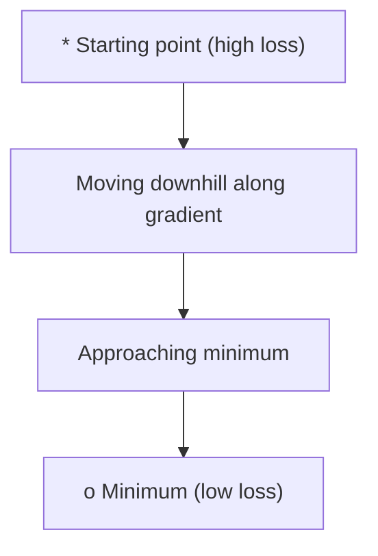
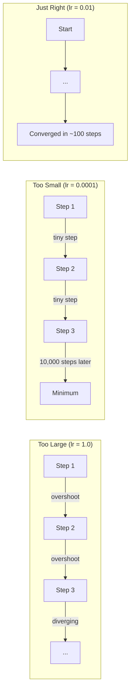
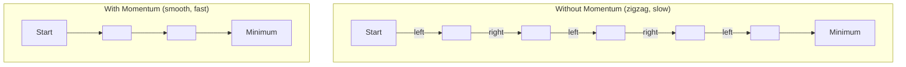
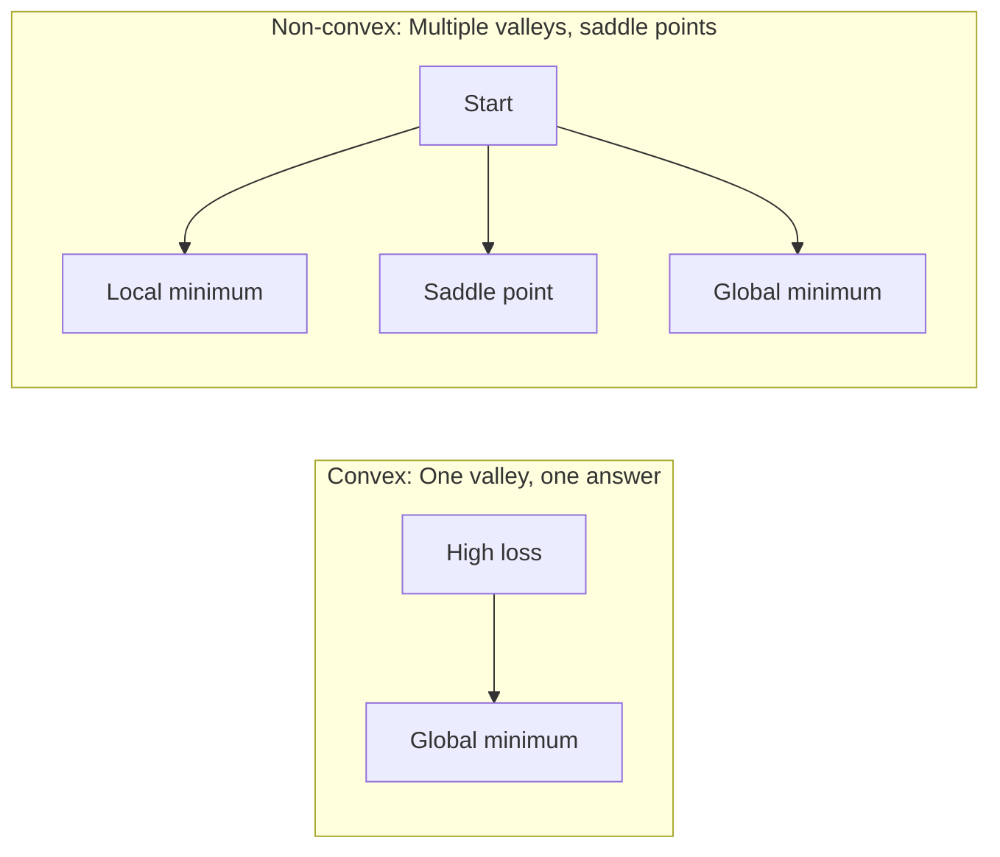
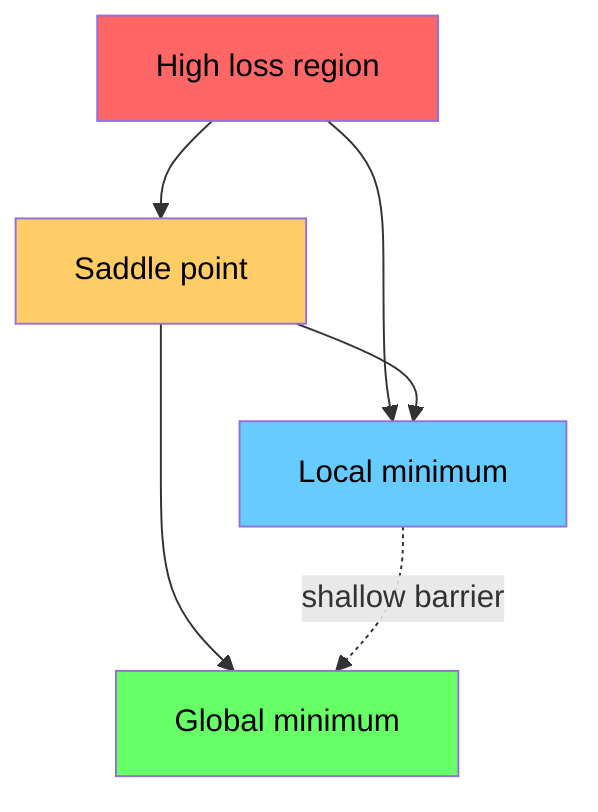

<!-- i18n:manual -->
# Оптимизация

> Обучение нейросети — не более чем поиск дна долины.

**Type:** Build
**Language:** Python
**Prerequisites:** Phase 1, Lessons 04-05 (Derivatives, Gradients)
**Time:** ~75 minutes

## Learning Objectives

- Реализовать с нуля обычный градиентный спуск, SGD с моментом и Adam
- Сравнить сходимость оптимизаторов на функции Розенброка и объяснить, почему Adam подбирает learning rate для каждого веса отдельно
- Отличать выпуклые ландшафты потерь от невыпуклых и объяснять роль седловых точек в высоких размерностях
- Настраивать расписания learning rate (ступенчатое затухание, косинусный отжиг, разогрев) для устойчивого обучения

> 🎒 **На пальцах.** Спускаться с горы можно по-разному: осторожно ощупывая каждый шаг, разогнавшись на санках или подбирая длину шага под каждую ногу отдельно. Три способа — три оптимизатора этого урока.

## The Problem

У вас есть функция потерь. Она говорит, насколько модель неправа. У вас есть градиенты. Они говорят, в какую сторону становится хуже. Теперь нужна стратегия спуска.

Наивный подход прост: двигаться против градиента. Масштабировать шаг числом под названием learning rate. Повторять. Это градиентный спуск, и он работает. Но у слова «работает» есть оговорки. Слишком большой learning rate — вы перелетаете долину целиком и скачете между стенками. Слишком маленький — ползёте к ответу тысячи лишних шагов. Попали в седловую точку — застыли, хотя минимума не нашли.

Каждый оптимизатор в глубоком обучении — ответ на один и тот же вопрос: как добраться до дна быстрее и надёжнее?

## The Concept

### What optimization means

Оптимизация — поиск входных значений, минимизирующих (или максимизирующих) функцию. В машинном обучении функция — это потери. Входы — веса модели. Обучение и есть оптимизация.

```
minimize L(w) where:
  L = loss function
  w = model weights (could be millions of parameters)
```

### Gradient descent (vanilla)

Простейший оптимизатор. Вычислить градиент потерь по каждому весу. Сдвинуть каждый вес против его градиента. Масштабировать шаг на learning rate.

```
w = w - lr * gradient
```

Это весь алгоритм. Одна строка.



> 🎒 **На пальцах.** Игра «горячо-холодно». Вы делаете шаг, вам говорят «холоднее» — идёте в другую сторону. Градиент — это подсказка, learning rate — размер шага. Отличие только в том, что подсказка точная, с числом.

### Learning rate: the most important hyperparameter

Learning rate управляет размером шага. Он определяет всё, что связано со сходимостью.



Формулы для правильного learning rate не существует. Его находят экспериментом. Типичные стартовые значения: 0.001 для Adam, 0.01 для SGD с моментом.

> 🎒 **На пальцах.** Как искать монету в комнате с закрытыми глазами. Шагаете по два метра — перескакиваете её каждый раз. Шагаете по миллиметру — будете искать до вечера. Правильный шаг подбирают руками, и это единственная настройка, которую точно придётся крутить самому.

### SGD vs batch vs mini-batch

Обычный градиентный спуск считает градиент по всему набору данных перед одним шагом. Это batch gradient descent. Устойчиво, но медленно.

Стохастический градиентный спуск (SGD) считает градиент по одному случайному примеру и сразу шагает. Шумно, но быстро.

Mini-batch делит разницу пополам. Считаем градиент по маленькой пачке (32, 64, 128, 256 примеров), затем шагаем. Именно это все и используют на практике.

| Variant | Batch size | Gradient quality | Speed per step | Noise |
|---------|-----------|-----------------|---------------|-------|
| Batch GD | Весь набор данных | Точный | Медленно | Нет |
| SGD | 1 пример | Очень шумный | Быстро | Высокий |
| Mini-batch | 32-256 | Хорошая оценка | Сбалансированно | Умеренный |

Шум в SGD и mini-batch — не баг. Он помогает выбираться из мелких локальных минимумов и седловых точек.

> 🎒 **На пальцах.** Опрос перед выборами. Спросить всю страну — точно, но дорого и долго. Спросить одного человека — мгновенно и бесполезно. Спросить сто случайных — почти так же точно, как всю страну, и в миллион раз дешевле. Mini-batch это и есть.

### Momentum: the ball rolling downhill

Обычный градиентный спуск смотрит только на текущий градиент. Если градиент зигзагует (обычное дело в узких долинах), продвижение медленное. Момент это чинит, накапливая прошлые градиенты в слагаемое скорости.

```
v = beta * v + gradient
w = w - lr * v
```

Аналогия: мяч катится с горы. Он не останавливается и не начинает заново на каждой кочке. Он набирает скорость в постоянных направлениях и гасит колебания.



`beta` (обычно 0.9) задаёт, сколько истории хранить. Больше beta — больше инерции, глаже путь, но медленнее реакция на смену направления.

> 🎒 **На пальцах.** beta = 0.9 значит «на 90% помню, куда ехал, на 10% слушаю новую подсказку». Как санки: мелкие кочки они игнорируют и едут дальше, а вот резко свернуть на них тяжело. Ровно этот компромисс вы и настраиваете.

### Adam: adaptive learning rates

Разным весам нужны разные learning rate. Вес, который редко получает большие градиенты, должен делать шаг побольше, когда наконец получает. Вес, которому постоянно прилетают огромные градиенты, должен шагать поменьше.

Adam (Adaptive Moment Estimation) отслеживает две вещи для каждого веса:

1. Первый момент (m): скользящее среднее градиентов (как момент)
2. Второй момент (v): скользящее среднее квадратов градиентов (величина градиента)

```
m = beta1 * m + (1 - beta1) * gradient
v = beta2 * v + (1 - beta2) * gradient^2

m_hat = m / (1 - beta1^t)    bias correction
v_hat = v / (1 - beta2^t)    bias correction

w = w - lr * m_hat / (sqrt(v_hat) + epsilon)
```

Деление на `sqrt(v_hat)` — ключевая идея. Веса с большими градиентами делятся на большое число (маленький фактический шаг). Веса с маленькими градиентами делятся на маленькое (большой шаг). Каждый вес получает собственный адаптивный learning rate.

Значения по умолчанию: `lr=0.001, beta1=0.9, beta2=0.999, epsilon=1e-8`. Они хорошо работают для большинства задач.

> 🎒 **На пальцах.** Учитель, который даёт разные задания разным ученикам. Кто быстро схватывает — тому потруднее, кто буксует — тому попроще. Adam делает это для каждого веса: смотрит, насколько бурно вес реагировал раньше, и подбирает ему персональный размер шага. Отсюда и популярность — не надо руками настраивать миллион ручек.

### Learning rate schedules

Фиксированный learning rate — компромисс. В начале обучения нужны большие шаги для быстрого продвижения. В конце — маленькие для тонкой доводки у минимума.

Частые расписания:

| Schedule | Formula | Use case |
|----------|---------|----------|
| Ступенчатое затухание | lr = lr * коэффициент каждые N эпох | Просто, ручной контроль |
| Экспоненциальное затухание | lr = lr_0 * decay^t | Плавное снижение |
| Косинусный отжиг | lr = lr_min + 0.5 * (lr_max - lr_min) * (1 + cos(pi * t / T)) | Трансформеры, современное обучение |
| Разогрев + затухание | Линейный рост, затем спад | Большие модели, защита от ранней нестабильности |

> 🎒 **На пальцах.** Как забиваете гвоздь: сначала пара сильных ударов, чтобы вошёл, потом лёгкие постукивания, чтобы не погнуть. Расписание learning rate — это то же самое, только записанное формулой.

### Convex vs non-convex

У выпуклой функции один минимум. Градиентный спуск всегда его находит. Квадратичная функция вроде `f(x) = x^2` выпукла.

Функции потерь нейросетей невыпуклы. У них много локальных минимумов, седловых точек и плоских участков.



На практике локальные минимумы в многомерных нейросетях редко становятся проблемой. У большинства локальных минимумов потери близки к глобальному минимуму. Настоящее препятствие — седловые точки (плоские в одних направлениях, изогнутые в других). Момент и шум mini-batch помогают из них выбираться.

> 🎒 **На пальцах.** Выпуклая функция — миска: куда шарик ни положи, скатится в одну точку. Невыпуклая — горный хребет с кучей ям и перевалов. Хорошая новость: в пространстве из миллиона измерений почти любая яма примерно одинаково глубока, так что застрять «не в той» яме не страшно.

### Loss landscape visualization

Потери — функция всех весов. Для модели с миллионом весов ландшафт потерь живёт в пространстве размерности 1 000 001. Мы визуализируем его, выбирая два случайных направления в пространстве весов и рисуя потери вдоль них — получается двумерная поверхность.



Острые минимумы плохо обобщаются. Плоские — хорошо. Это одна из причин, почему SGD с моментом часто выигрывает у Adam по итоговой точности на тесте: его шум мешает засесть в остром минимуме.

> 🎒 **На пальцах.** Острый минимум — узкая щель между камнями: чуть сдвинулся, и уже наверху. Плоский — широкая пологая ложбина: сдвинулся на метр, всё равно внизу. Новые данные всегда чуть-чуть сдвигают модель, поэтому широкая ложбина надёжнее.

```figure
gradient-descent
```

## Build It

### Step 1: Define a test function

Функция Розенброка — классический бенчмарк оптимизации. Её минимум в точке (1, 1) внутри узкой изогнутой долины, которую легко найти, но трудно пройти.

```
f(x, y) = (1 - x)^2 + 100 * (y - x^2)^2
```

```python
def rosenbrock(params):
    x, y = params
    return (1 - x) ** 2 + 100 * (y - x ** 2) ** 2

def rosenbrock_gradient(params):
    x, y = params
    df_dx = -2 * (1 - x) + 200 * (y - x ** 2) * (-2 * x)
    df_dy = 200 * (y - x ** 2)
    return [df_dx, df_dy]
```

> 🎒 **На пальцах.** Эту функцию называют «банан» — её долина изогнута дугой. Найти саму долину легко: скатились со стенки и вы в ней. А вот идти вдоль неё до дна тяжело, потому что она узкая и кривая. Именно поэтому на ней и проверяют оптимизаторы: она честно показывает разницу.

### Step 2: Vanilla gradient descent

```python
class GradientDescent:
    def __init__(self, lr=0.001):
        self.lr = lr

    def step(self, params, grads):
        return [p - self.lr * g for p, g in zip(params, grads)]
```

### Step 3: SGD with momentum

```python
class SGDMomentum:
    def __init__(self, lr=0.001, momentum=0.9):
        self.lr = lr
        self.momentum = momentum
        self.velocity = None

    def step(self, params, grads):
        if self.velocity is None:
            self.velocity = [0.0] * len(params)
        self.velocity = [
            self.momentum * v + g
            for v, g in zip(self.velocity, grads)
        ]
        return [p - self.lr * v for p, v in zip(params, self.velocity)]
```

### Step 4: Adam

```python
class Adam:
    def __init__(self, lr=0.001, beta1=0.9, beta2=0.999, epsilon=1e-8):
        self.lr = lr
        self.beta1 = beta1
        self.beta2 = beta2
        self.epsilon = epsilon
        self.m = None
        self.v = None
        self.t = 0

    def step(self, params, grads):
        if self.m is None:
            self.m = [0.0] * len(params)
            self.v = [0.0] * len(params)

        self.t += 1

        self.m = [
            self.beta1 * m + (1 - self.beta1) * g
            for m, g in zip(self.m, grads)
        ]
        self.v = [
            self.beta2 * v + (1 - self.beta2) * g ** 2
            for v, g in zip(self.v, grads)
        ]

        m_hat = [m / (1 - self.beta1 ** self.t) for m in self.m]
        v_hat = [v / (1 - self.beta2 ** self.t) for v in self.v]

        return [
            p - self.lr * mh / (vh ** 0.5 + self.epsilon)
            for p, mh, vh in zip(params, m_hat, v_hat)
        ]
```

> 🎒 **На пальцах.** Зачем `epsilon = 1e-8`: чтобы не поделить на ноль. В самом начале обучения `v` равно нулю, и без этой добавки программа рухнула бы на первом же шаге. Одна из тех строчек, которые выглядят мусором, а на деле держат всё вместе.

### Step 5: Run and compare

```python
def optimize(optimizer, func, grad_func, start, steps=5000):
    params = list(start)
    history = [params[:]]
    for _ in range(steps):
        grads = grad_func(params)
        params = optimizer.step(params, grads)
        history.append(params[:])
    return history

start = [-1.0, 1.0]

gd_history = optimize(GradientDescent(lr=0.0005), rosenbrock, rosenbrock_gradient, start)
sgd_history = optimize(SGDMomentum(lr=0.0001, momentum=0.9), rosenbrock, rosenbrock_gradient, start)
adam_history = optimize(Adam(lr=0.01), rosenbrock, rosenbrock_gradient, start)

for name, history in [("GD", gd_history), ("SGD+M", sgd_history), ("Adam", adam_history)]:
    final = history[-1]
    loss = rosenbrock(final)
    print(f"{name:6s} -> x={final[0]:.6f}, y={final[1]:.6f}, loss={loss:.8f}")
```

Ожидаемый результат: Adam сходится быстрее всех. SGD с моментом идёт более гладким путём. Обычный GD медленно продвигается вдоль узкой долины.

## Use It

На практике используйте оптимизаторы PyTorch или JAX. Они умеют группы параметров, weight decay, обрезку градиентов и ускорение на GPU.

```python
import torch

model = torch.nn.Linear(784, 10)

sgd = torch.optim.SGD(model.parameters(), lr=0.01, momentum=0.9)
adam = torch.optim.Adam(model.parameters(), lr=0.001)
adamw = torch.optim.AdamW(model.parameters(), lr=0.001, weight_decay=0.01)

scheduler = torch.optim.lr_scheduler.CosineAnnealingLR(adam, T_max=100)
```

Практические правила:

- Начинайте с Adam (lr=0.001). Он работает на большинстве задач без настройки.
- Переходите на SGD с моментом (lr=0.01, momentum=0.9), когда нужна лучшая итоговая точность и есть время на настройку.
- Используйте AdamW (Adam с отвязанным weight decay) для трансформеров.
- Всегда включайте расписание learning rate для прогонов длиннее нескольких эпох.
- Обучение нестабильно — уменьшите learning rate. Обучение слишком медленное — увеличьте.

> 🎒 **На пальцах.** Если запомнить из урока одну строчку, пусть это будет `lr=0.001` с Adam. Девять задач из десяти обучатся на этих настройках без единого изменения. Остальное — доводка последних процентов.

## Ship It

Этот урок производит промпт для выбора подходящего оптимизатора. Смотрите `outputs/prompt-optimizer-guide.md`.

Классы оптимизаторов, построенные здесь, снова появятся в Phase 3, когда мы будем обучать нейросеть с нуля.

## Exercises

1. **Learning rate sweep.** Запустите обычный градиентный спуск на функции Розенброка с learning rate [0.0001, 0.0005, 0.001, 0.005, 0.01]. Нарисуйте или напечатайте итоговые потери после 5000 шагов для каждого. Найдите наибольший learning rate, при котором ещё есть сходимость.

2. **Momentum comparison.** Запустите SGD со значениями момента [0.0, 0.5, 0.9, 0.99] на функции Розенброка. Отслеживайте потери на каждом шаге. Какое значение сходится быстрее всех? Какое перелетает?

3. **Saddle point escape.** Определите функцию `f(x, y) = x^2 - y^2` (седловая точка в начале координат). Стартуйте из (0.01, 0.01). Сравните поведение обычного GD, SGD с моментом и Adam. Кто выбирается из седловой точки?

4. **Implement learning rate decay.** Добавьте экспоненциальное затухание в класс GradientDescent: `lr = lr_0 * 0.999^step`. Сравните сходимость с затуханием и без него на функции Розенброка.

> 🎒 **На пальцах.** Первое задание — самое полезное в уроке. Вы своими глазами увидите обрыв: до какого-то значения всё сходится, а на следующем числа улетают в бесконечность и появляется `nan`. Именно этот обрыв ищут вручную при обучении любой настоящей модели.

## Key Terms

| Term | What people say | What it actually means |
|------|----------------|----------------------|
| Gradient descent | «Идти вниз» | Обновлять веса вычитанием градиента, умноженного на learning rate. Базовый оптимизатор. |
| Learning rate | «Размер шага» | Скаляр, задающий, насколько далеко каждое обновление сдвигает веса. Слишком большой — расходимость. Слишком маленький — трата вычислений. |
| Momentum | «Катиться дальше» | Накопление прошлых градиентов в вектор скорости. Гасит колебания и ускоряет движение в устойчивых направлениях. |
| SGD | «Случайная выборка» | Стохастический градиентный спуск. Градиент считается по случайному подмножеству, а не по всему набору. На практике почти всегда означает mini-batch SGD. |
| Mini-batch | «Кусок данных» | Небольшое подмножество обучающих данных (32-256 примеров) для оценки градиента. Баланс скорости и точности градиента. |
| Adam | «Оптимизатор по умолчанию» | Adaptive Moment Estimation. Хранит по каждому весу скользящие средние градиентов и их квадратов, давая каждому весу собственный learning rate. |
| Bias correction | «Починить холодный старт» | Первый и второй моменты Adam стартуют с нуля. Коррекция делит на (1 - beta^t), компенсируя это на ранних шагах. |
| Learning rate schedule | «Менять lr со временем» | Функция, подстраивающая learning rate во время обучения. Большие шаги в начале, маленькие в конце. |
| Convex function | «Одна долина» | Функция, у которой любой локальный минимум является глобальным. Градиентный спуск всегда его находит. Потери нейросетей невыпуклы. |
| Saddle point | «Плоско, но не минимум» | Точка с нулевым градиентом, которая в одних направлениях минимум, а в других максимум. Обычное дело в высоких размерностях. |
| Loss landscape | «Рельеф местности» | Функция потерь, нарисованная над пространством весов. Визуализируется срезом вдоль двух случайных направлений. |
| Convergence | «Дошли» | Оптимизатор достиг точки, где дальнейшие шаги уже заметно не уменьшают потери. |

## Further Reading

- [Sebastian Ruder: An overview of gradient descent optimization algorithms](https://ruder.io/optimizing-gradient-descent/) - исчерпывающий обзор всех основных оптимизаторов
- [Why Momentum Really Works (Distill)](https://distill.pub/2017/momentum/) - интерактивная визуализация динамики момента
- [Adam: A Method for Stochastic Optimization (Kingma & Ba, 2014)](https://arxiv.org/abs/1412.6980) - оригинальная статья про Adam, читаемая и короткая
- [Visualizing the Loss Landscape of Neural Nets (Li et al., 2018)](https://arxiv.org/abs/1712.09913) - статья, показавшая разницу между острыми и плоскими минимумами
