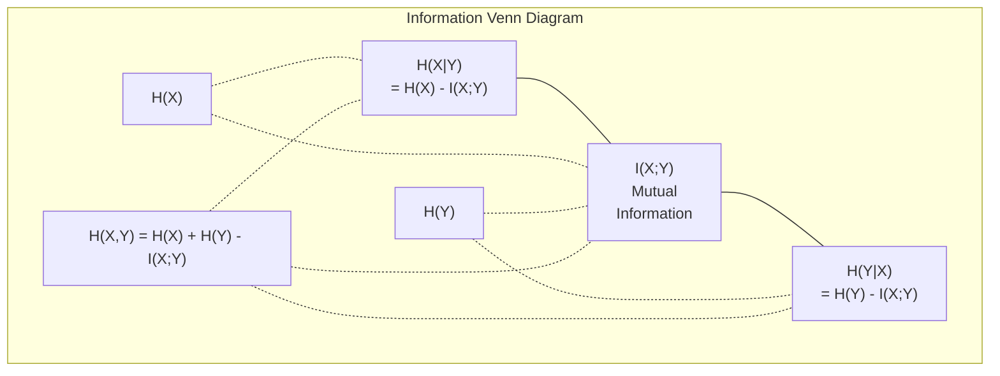

<!-- i18n:manual -->
# Теория информации

> Теория информации измеряет удивление. На нём построены функции потерь.

**Type:** Learn
**Language:** Python
**Prerequisites:** Phase 1, Lesson 06 (Probability)
**Time:** ~60 minutes

## Learning Objectives

- Вычислять с нуля энтропию, cross-entropy и KL divergence и объяснять их связь
- Вывести, почему минимизация cross-entropy эквивалентна максимизации логарифма правдоподобия
- Считать взаимную информацию между признаками и целевой переменной для ранжирования признаков
- Объяснять perplexity как эффективный размер словаря, из которого выбирает языковая модель

> 🎒 **На пальцах.** Чем неожиданнее новость, тем больше в ней информации. «Завтра будет утро» — ноль информации. «Завтра снег в июле» — очень много. Всю эту главу можно свести к измерению удивления числом.

## The Problem

Вы вызываете `CrossEntropyLoss()` в каждой обучаемой модели классификации. Вы видите «perplexity» в каждой статье про языковые модели. Вы читаете про KL divergence в VAE, дистилляции и RLHF. Это не разрозненные понятия. Это одна и та же идея в разных шляпах.

Теория информации даёт язык для рассуждений о неопределённости, сжатии и предсказании. Клод Шеннон придумал её в 1948 году для задач связи. Оказалось, что обучение нейросети — тоже задача связи: модель пытается передать правильную метку через зашумлённый канал из выученных весов.

Этот урок строит каждую формулу с нуля, чтобы вы увидели, откуда они берутся и почему работают.

## The Concept

### Information Content (Surprise)

Когда происходит маловероятное, оно несёт больше информации. Монета упала орлом? Не удивительно. Выигрыш в лотерею? Очень удивительно.

Информационное содержание события с вероятностью p равно:

```
I(x) = -log(p(x))
```

Логарифм по основанию 2 даёт биты. Натуральный логарифм даёт наты. Идея одна, единицы разные.

```
Event              Probability    Surprise (bits)
Fair coin heads    0.5            1.0
Rolling a 6        0.167          2.58
1-in-1000 event    0.001          9.97
Certain event      1.0            0.0
```

Достоверные события несут ноль информации. Вы и так знали, что они произойдут.

> 🎒 **На пальцах.** Игра «угадай число от 1 до 8». Каждый вопрос «больше четырёх?» отсекает половину вариантов. Три вопроса — и число найдено. Значит в этом числе ровно 3 бита информации. Бит — это буквально «один вопрос с ответом да/нет».

### Entropy (Average Surprise)

Энтропия — ожидаемое удивление по всем возможным исходам распределения.

```
H(P) = -sum( p(x) * log(p(x)) )  for all x
```

У честной монеты максимальная энтропия для двоичной величины: 1 бит. У перекошенной монеты (99% орлов) энтропия низкая: 0.08 бита. Вы и так знаете, что случится, поэтому каждый бросок почти ничего не сообщает.

```
Fair coin:    H = -(0.5 * log2(0.5) + 0.5 * log2(0.5)) = 1.0 bit
Biased coin:  H = -(0.99 * log2(0.99) + 0.01 * log2(0.01)) = 0.08 bits
```

Энтропия измеряет неустранимую неопределённость распределения. Сжать ниже неё нельзя.

> 🎒 **На пальцах.** Зачем спрашивать «пойдёт ли завтра снег» в июле? Ответ и так известен, вопрос бесполезен — низкая энтропия. А «орёл или решка» спросить стоит: ответ реально неизвестен — высокая энтропия. Так же работают архиваторы: предсказуемый текст жмётся сильно, случайный шум не жмётся вообще.

### Cross-Entropy (The Loss Function You Use Every Day)

Cross-entropy измеряет среднее удивление, когда вы используете распределение Q для кодирования событий, на самом деле приходящих из распределения P.

```
H(P, Q) = -sum( p(x) * log(q(x)) )  for all x
```

P — истинное распределение (метки). Q — предсказания вашей модели. Если Q идеально совпадает с P, cross-entropy равна энтропии. Любое расхождение её увеличивает.

В классификации P — one-hot вектор (у истинного класса вероятность 1, у остальных 0). Это упрощает cross-entropy до:

```
H(P, Q) = -log(q(true_class))
```

Вот и вся формула cross-entropy loss для классификации. Максимизируйте предсказанную вероятность правильного класса.

> 🎒 **На пальцах.** Модель сказала «кошка на 90%», и это была кошка: потери = −log(0.9) = 0.105, почти ноль. Модель сказала «кошка на 10%», а это кошка: потери = −log(0.1) = 2.3, в двадцать раз больше. Формула просто наказывает тем сильнее, чем увереннее модель ошиблась.

### KL Divergence (Distance Between Distributions)

KL divergence измеряет, сколько лишнего удивления вы получаете, используя Q вместо P.

```
D_KL(P || Q) = sum( p(x) * log(p(x) / q(x)) )  for all x
             = H(P, Q) - H(P)
```

Cross-entropy — это энтропия плюс KL divergence. Поскольку энтропия истинного распределения при обучении постоянна, минимизация cross-entropy — то же самое, что минимизация KL divergence. Вы толкаете распределение модели к истинному.

KL divergence несимметрична: D_KL(P || Q) != D_KL(Q || P). Это не настоящая метрика расстояния.

> 🎒 **На пальцах.** Несимметричность звучит странно, но она бытовая. «Насколько москвич удивится в деревне» и «насколько деревенский житель удивится в Москве» — разные величины, хотя города те же. KL меряет удивление конкретной стороны, а не расстояние между городами.

### Mutual Information

Взаимная информация измеряет, насколько знание одной переменной сообщает о другой.

```
I(X; Y) = H(X) - H(X|Y)
        = H(X) + H(Y) - H(X, Y)
```

Если X и Y независимы, взаимная информация равна нулю. Знание одного не говорит ничего о другом. Если они идеально связаны, взаимная информация равна энтропии любой из них.

При отборе признаков высокая взаимная информация между признаком и целью означает, что признак полезен. Низкая — что это шум.

### Conditional Entropy

H(Y|X) измеряет, сколько неопределённости о Y остаётся после наблюдения X.

```
H(Y|X) = H(X,Y) - H(X)
```

Две крайности:
- Если X полностью определяет Y, то H(Y|X) = 0. Знание X убирает всю неопределённость о Y. Пример: X = температура в Цельсиях, Y = температура в Фаренгейтах.
- Если X ничего не говорит о Y, то H(Y|X) = H(Y). Знание X не уменьшает неопределённость вовсе. Пример: X = бросок монеты, Y = завтрашняя погода.

Условная энтропия всегда неотрицательна и никогда не превышает H(Y):

```
0 <= H(Y|X) <= H(Y)
```

В машинном обучении условная энтропия появляется в деревьях решений. На каждом разбиении алгоритм выбирает признак X, минимизирующий H(Y|X) — тот, что убирает больше всего неопределённости о метке Y.

> 🎒 **На пальцах.** Угадываете задуманное животное. Вопрос «оно летает?» сильно сужает круг — низкая условная энтропия после ответа, хороший вопрос. Вопрос «у него чётное количество усов?» не сужает ничего — плохой. Дерево решений на каждом шаге выбирает лучший вопрос ровно по этому правилу.

### Joint Entropy

H(X,Y) — энтропия совместного распределения X и Y вместе.

```
H(X,Y) = -sum sum p(x,y) * log(p(x,y))   for all x, y
```

Ключевое свойство:

```
H(X,Y) <= H(X) + H(Y)
```

Равенство выполняется, когда X и Y независимы. Если они делят информацию, совместная энтропия меньше суммы отдельных. «Недостающая» энтропия — ровно взаимная информация.



Соотношения:
- H(X,Y) = H(X) + H(Y|X) = H(Y) + H(X|Y)
- I(X;Y) = H(X) - H(X|Y) = H(Y) - H(Y|X)
- H(X,Y) = H(X) + H(Y) - I(X;Y)

> 🎒 **На пальцах.** Это круги Эйлера со школьной математики. Два круга — H(X) и H(Y). Пересечение — общая информация I(X;Y). Если сложить площади кругов, пересечение посчитается дважды, поэтому его вычитают. Формула H(X,Y) = H(X) + H(Y) − I(X;Y) — та самая формула площади объединения.

### Mutual Information (Deep Dive)

Взаимная информация I(X;Y) количественно выражает, насколько знание одной переменной снижает неопределённость о другой.

```
I(X;Y) = H(X) - H(X|Y)
       = H(Y) - H(Y|X)
       = H(X) + H(Y) - H(X,Y)
       = sum sum p(x,y) * log(p(x,y) / (p(x) * p(y)))
```

Свойства:
- I(X;Y) >= 0 всегда. Наблюдение никогда не отнимает информацию.
- I(X;Y) = 0 тогда и только тогда, когда X и Y независимы.
- I(X;Y) = I(Y;X). Симметрична, в отличие от KL divergence.
- I(X;X) = H(X). Переменная делит всю свою информацию сама с собой.

**Mutual information for feature selection.** В ML вам нужны признаки, информативные о цели. Взаимная информация даёт обоснованный способ их ранжировать:

1. Для каждого признака X_i вычислите I(X_i; Y), где Y — целевая переменная.
2. Отсортируйте признаки по величине MI.
3. Оставьте top-k признаков.

Это работает для любой зависимости между признаком и целью — линейной, нелинейной, монотонной или нет. Корреляция ловит только линейные связи. MI ловит всё.

| Method | Detects | Computational cost | Handles categorical? |
|--------|---------|-------------------|---------------------|
| Корреляция Пирсона | Линейные связи | O(n) | Нет |
| Корреляция Спирмена | Монотонные связи | O(n log n) | Нет |
| Взаимная информация | Любую статистическую зависимость | O(n log n) с разбиением на корзины | Да |

> 🎒 **На пальцах.** Корреляция — линейка: меряет только прямые зависимости. Возьмите зависимость «чем ближе к полудню, тем жарче, а потом холоднее» — это дуга, и корреляция покажет почти ноль, хотя связь очевидна. Взаимная информация увидит её сразу.

### Label Smoothing and Cross-Entropy

Стандартная классификация использует жёсткие цели: [0, 0, 1, 0]. Истинный класс получает вероятность 1, остальные — 0. Label smoothing заменяет их мягкими целями:

```
soft_target = (1 - epsilon) * hard_target + epsilon / num_classes
```

При epsilon = 0.1 и 4 классах:
- Жёсткая цель:  [0, 0, 1, 0]
- Мягкая цель:  [0.025, 0.025, 0.925, 0.025]

С точки зрения теории информации label smoothing повышает энтропию целевого распределения. У жёстких one-hot целей энтропия ноль — неопределённости нет. У мягких целей энтропия положительна.

Почему это помогает:
- Не даёт модели загонять логиты в крайние значения (для идеального совпадения с one-hot целью под cross-entropy понадобились бы бесконечные логиты)
- Работает как регуляризация: модель не может быть уверена на 100%
- Улучшает калибровку: предсказанные вероятности лучше отражают истинную неопределённость
- Уменьшает разрыв между поведением при обучении и при выводе

Cross-entropy loss с label smoothing становится:

```
L = (1 - epsilon) * CE(hard_target, prediction) + epsilon * H_uniform(prediction)
```

Второе слагаемое штрафует предсказания, далёкие от равномерных, — прямая регуляризация уверенности.

> 🎒 **На пальцах.** Это как учить не зазнаваться. Ученик, который отвечает «я уверен на 100%», рано или поздно опозорится. Label smoothing говорит модели: «оставляй 2-3% сомнения даже в очевидном». На практике это заметно улучшает результат.

### Why Cross-Entropy Is THE Classification Loss

Три взгляда, один вывод.

**Information theory view.** Cross-entropy измеряет, сколько бит вы тратите зря, используя распределение модели вместо истинного. Её минимизация делает вашу модель самым эффективным кодировщиком реальности.

**Maximum likelihood view.** Для N обучающих примеров с истинными классами y_i:

```
Likelihood     = product( q(y_i) )
Log-likelihood = sum( log(q(y_i)) )
Negative log-likelihood = -sum( log(q(y_i)) )
```

Последняя строка — это и есть cross-entropy loss. Минимизировать cross-entropy = максимизировать правдоподобие обучающих данных под вашей моделью.

**Gradient view.** Градиент cross-entropy по логитам равен просто (предсказание − истина). Чисто, устойчиво и быстро считается. Поэтому она идеально сочетается с softmax.

### Bits vs Nats

Единственная разница — основание логарифма.

```
log base 2   -> bits      (information theory tradition)
log base e   -> nats      (machine learning convention)
log base 10  -> hartleys  (rarely used)
```

1 нат = 1/ln(2) бит = 1.4427 бита. PyTorch и TensorFlow по умолчанию используют натуральный логарифм (наты).

### Perplexity

Perplexity — экспонента от cross-entropy. Она говорит, между сколькими равновероятными вариантами модель фактически колеблется.

```
Perplexity = 2^H(P,Q)   (if using bits)
Perplexity = e^H(P,Q)   (if using nats)
```

Языковая модель с perplexity 50 в среднем растеряна так, будто ей приходится равновероятно выбирать из 50 возможных следующих токенов. Меньше — лучше.

GPT-2 достигала perplexity около 30 на распространённых бенчмарках. Современные модели дают однозначные числа на хорошо представленных доменах.

> 🎒 **На пальцах.** Perplexity удобна тем, что её можно представить. Perplexity 50 = «модель как будто тычет пальцем в один из 50 вариантов». Perplexity 5 = «выбирает из пяти». Perplexity 1 = «точно знает следующее слово». Это тот же loss, просто переведённый в понятные единицы.

```figure
entropy-kl
```

## Build It

### Step 1: Information content and entropy

```python
import math

def information_content(p, base=2):
    if p <= 0 or p > 1:
        return float('inf') if p <= 0 else 0.0
    return -math.log(p) / math.log(base)

def entropy(probs, base=2):
    return sum(
        p * information_content(p, base)
        for p in probs if p > 0
    )

fair_coin = [0.5, 0.5]
biased_coin = [0.99, 0.01]
fair_die = [1/6] * 6

print(f"Fair coin entropy:   {entropy(fair_coin):.4f} bits")
print(f"Biased coin entropy: {entropy(biased_coin):.4f} bits")
print(f"Fair die entropy:    {entropy(fair_die):.4f} bits")
```

> 🎒 **На пальцах.** Энтропия честного кубика выйдет 2.585 бита. Проверьте смысл: два вопроса да/нет дают 4 варианта, три вопроса — 8. Шесть граней где-то между, отсюда и 2.58. Число битов — это «сколько вопросов в среднем нужно, чтобы угадать».

### Step 2: Cross-entropy and KL divergence

```python
def cross_entropy(p, q, base=2):
    total = 0.0
    for pi, qi in zip(p, q):
        if pi > 0:
            if qi <= 0:
                return float('inf')
            total += pi * (-math.log(qi) / math.log(base))
    return total

def kl_divergence(p, q, base=2):
    return cross_entropy(p, q, base) - entropy(p, base)

true_dist = [0.7, 0.2, 0.1]
good_model = [0.6, 0.25, 0.15]
bad_model = [0.1, 0.1, 0.8]

print(f"Entropy of true dist:     {entropy(true_dist):.4f} bits")
print(f"CE (good model):          {cross_entropy(true_dist, good_model):.4f} bits")
print(f"CE (bad model):           {cross_entropy(true_dist, bad_model):.4f} bits")
print(f"KL divergence (good):     {kl_divergence(true_dist, good_model):.4f} bits")
print(f"KL divergence (bad):      {kl_divergence(true_dist, bad_model):.4f} bits")
```

### Step 3: Cross-entropy as classification loss

```python
def softmax(logits):
    max_logit = max(logits)
    exps = [math.exp(z - max_logit) for z in logits]
    total = sum(exps)
    return [e / total for e in exps]

def cross_entropy_loss(true_class, logits):
    probs = softmax(logits)
    return -math.log(probs[true_class])

logits = [2.0, 1.0, 0.1]
true_class = 0

probs = softmax(logits)
loss = cross_entropy_loss(true_class, logits)

print(f"Logits:      {logits}")
print(f"Softmax:     {[f'{p:.4f}' for p in probs]}")
print(f"True class:  {true_class}")
print(f"Loss:        {loss:.4f} nats")
print(f"Perplexity:  {math.exp(loss):.2f}")
```

### Step 4: Cross-entropy equals negative log-likelihood

```python
import random

random.seed(42)

n_samples = 1000
n_classes = 3
true_labels = [random.randint(0, n_classes - 1) for _ in range(n_samples)]
model_logits = [[random.gauss(0, 1) for _ in range(n_classes)] for _ in range(n_samples)]

ce_loss = sum(
    cross_entropy_loss(label, logits)
    for label, logits in zip(true_labels, model_logits)
) / n_samples

nll = -sum(
    math.log(softmax(logits)[label])
    for label, logits in zip(true_labels, model_logits)
) / n_samples

print(f"Cross-entropy loss:      {ce_loss:.6f}")
print(f"Negative log-likelihood: {nll:.6f}")
print(f"Difference:              {abs(ce_loss - nll):.2e}")
```

> 🎒 **На пальцах.** Разница напечатается порядка 1e-16 — то есть ноль с точностью компьютера. Это не совпадение: cross-entropy и отрицательный логарифм правдоподобия — буквально одна и та же формула, просто пришедшая из двух разных наук. Одну придумали связисты, другую — статистики.

### Step 5: Mutual information

```python
def mutual_information(joint_probs, base=2):
    rows = len(joint_probs)
    cols = len(joint_probs[0])

    margin_x = [sum(joint_probs[i][j] for j in range(cols)) for i in range(rows)]
    margin_y = [sum(joint_probs[i][j] for i in range(rows)) for j in range(cols)]

    mi = 0.0
    for i in range(rows):
        for j in range(cols):
            pxy = joint_probs[i][j]
            if pxy > 0:
                mi += pxy * math.log(pxy / (margin_x[i] * margin_y[j])) / math.log(base)
    return mi

independent = [[0.25, 0.25], [0.25, 0.25]]
dependent = [[0.45, 0.05], [0.05, 0.45]]

print(f"MI (independent): {mutual_information(independent):.4f} bits")
print(f"MI (dependent):   {mutual_information(dependent):.4f} bits")
```

## Use It

Те же понятия на NumPy — так вы будете применять их на практике:

```python
import numpy as np

def np_entropy(p):
    p = np.asarray(p, dtype=float)
    mask = p > 0
    result = np.zeros_like(p)
    result[mask] = p[mask] * np.log(p[mask])
    return -result.sum()

def np_cross_entropy(p, q):
    p, q = np.asarray(p, dtype=float), np.asarray(q, dtype=float)
    mask = p > 0
    return -(p[mask] * np.log(q[mask])).sum()

def np_kl_divergence(p, q):
    return np_cross_entropy(p, q) - np_entropy(p)

true = np.array([0.7, 0.2, 0.1])
pred = np.array([0.6, 0.25, 0.15])
print(f"Entropy:    {np_entropy(true):.4f} nats")
print(f"Cross-ent:  {np_cross_entropy(true, pred):.4f} nats")
print(f"KL div:     {np_kl_divergence(true, pred):.4f} nats")
```

Вы с нуля построили то, что внутри делает `torch.nn.CrossEntropyLoss()`. Теперь вы знаете, почему loss падает во время обучения: распределение вашей модели приближается к истинному, а измеряется это в натах потраченной впустую информации.

## Exercises

1. Вычислите энтропию английского алфавита в предположении равномерного распределения (26 букв). Затем оцените её по реальным частотам букв. Какая выше и почему?

2. Модель выдаёт логиты [5.0, 2.0, 0.5] для примера с истинным классом 1. Вычислите cross-entropy loss руками, затем сверьтесь со своей функцией `cross_entropy_loss`. Какие логиты дали бы нулевые потери?

3. Покажите, что KL divergence несимметрична. Возьмите два распределения P и Q и вычислите D_KL(P || Q) и D_KL(Q || P). Объясните, почему они различаются.

4. Напишите функцию, вычисляющую perplexity для последовательности предсказаний токенов. По списку пар (индекс истинного токена, предсказанные логиты) она должна вернуть perplexity последовательности.

> 🎒 **На пальцах.** Ко второму заданию, ответ на вторую половину вопроса: нулевые потери невозможны. Чтобы softmax выдал ровно 1.0, логит правильного класса должен быть бесконечным. Поэтому loss всегда чуть больше нуля — и поэтому же придумали label smoothing.

## Key Terms

| Term | What people say | What it actually means |
|------|----------------|----------------------|
| Information content | «Удивление» | Число бит (или нат), нужное для кодирования события: -log(p) |
| Entropy | «Случайность» | Среднее удивление по всем исходам распределения. Мера неустранимой неопределённости. |
| Cross-entropy | «Функция потерь» | Среднее удивление при использовании распределения модели Q для кодирования событий из истинного распределения P. |
| KL divergence | «Расстояние между распределениями» | Лишние биты, потраченные из-за использования Q вместо P. Равна cross-entropy минус энтропия. Несимметрична. |
| Mutual information | «Насколько связаны X и Y» | Снижение неопределённости об X от знания Y. Ноль означает независимость. |
| Softmax | «Превратить логиты в вероятности» | Проэкспоненцировать и нормировать. Отображает любой вещественный вектор в корректное распределение вероятностей. |
| Perplexity | «Насколько модель растеряна» | Экспонента от cross-entropy. Эффективный размер словаря, из которого модель выбирает на каждом шаге. |
| Bits | «Единица Шеннона» | Информация, измеренная логарифмом по основанию 2. Один бит разрешает один честный бросок монеты. |
| Nats | «Единица ML» | Информация, измеренная натуральным логарифмом. Используется в PyTorch и TensorFlow по умолчанию. |
| Negative log-likelihood | «NLL loss» | Идентична cross-entropy loss для one-hot меток. Её минимизация максимизирует вероятность правильных предсказаний. |

## Further Reading

- [Shannon 1948: A Mathematical Theory of Communication](https://people.math.harvard.edu/~ctm/home/text/others/shannon/entropy/entropy.pdf) - оригинальная статья, до сих пор читаемая
- [Visual Information Theory (Chris Olah)](https://colah.github.io/posts/2015-09-Visual-Information/) - лучшее визуальное объяснение энтропии и KL divergence
- [PyTorch CrossEntropyLoss docs](https://pytorch.org/docs/stable/generated/torch.nn.CrossEntropyLoss.html) - как фреймворк реализует то, что вы только что построили
