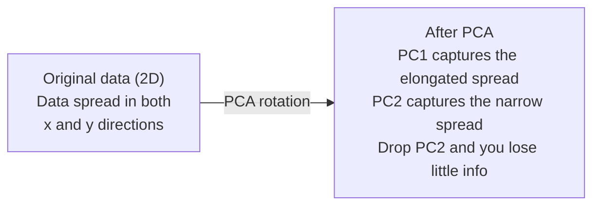

<!-- i18n:manual -->
# Снижение размерности

> У многомерных данных есть структура. Её находят, посмотрев под правильным углом.

**Type:** Build
**Language:** Python
**Prerequisites:** Phase 1, Lessons 01 (Linear Algebra Intuition), 02 (Vectors, Matrices & Operations), 03 (Eigenvalues & Eigenvectors), 06 (Probability & Distributions)
**Time:** ~90 minutes

## Learning Objectives

- Реализовать PCA с нуля: центрировать данные, посчитать ковариационную матрицу, разложить по собственным векторам и спроецировать
- Использовать долю объяснённой дисперсии и метод локтя для выбора числа главных компонент
- Сравнить PCA, t-SNE и UMAP на визуализации цифр MNIST в 2D и объяснить их компромиссы
- Применить kernel PCA с RBF-ядром для разделения нелинейных структур, с которыми обычный PCA не справляется

> 🎒 **На пальцах.** Тень человека на стене — это трёхмерный человек, сжатый до двух измерений. Часть информации потерялась, но узнать друга по тени всё ещё можно. Весь урок — про то, как отбрасывать лишние измерения, не теряя главного.

## The Problem

У вас набор данных с 784 признаками на пример. Может, это значения пикселей рукописных цифр. Может, уровни экспрессии генов. Может, сигналы поведения пользователей. Вы не можете визуализировать 784 измерения. Не можете их нарисовать. Не можете даже о них думать.

Но большинство из этих 784 признаков избыточны. Настоящая информация живёт на куда меньшей поверхности. Рукописной «семёрке» не нужны 784 независимых числа для описания. Ей нужно несколько: угол штриха, длина перекладины, насколько она наклонена. Остальное — шум.

Снижение размерности находит эту меньшую поверхность. Оно берёт ваши 784-мерные данные и сжимает их до 2, 10 или 50 измерений, сохраняя структуру, которая важна.

> 🎒 **На пальцах.** Чтобы описать друга, вы не перечисляете цвет каждого волоса. Вы говорите «высокий, рыжий, в очках» — три признака вместо миллиона. Этого хватает, чтобы его узнали в толпе. Ровно этим и занимается снижение размерности.

## The Concept

### The curse of dimensionality

Многомерные пространства неинтуитивны. С ростом размерности ломаются три вещи.

**Distance becomes meaningless.** В высоких размерностях расстояние между любыми двумя случайными точками сходится к одному значению. Если каждая точка примерно одинаково далека от всех остальных, поиск ближайшего соседа перестаёт работать.

```
Dimension    Avg distance ratio (max/min between random points)
2            ~5.0
10           ~1.8
100          ~1.2
1000         ~1.02
```

**Volume concentrates in corners.** У единичного гиперкуба в d измерениях 2^d углов. В 100 измерениях почти весь объём сидит в углах, далеко от центра. Точки данных расползаются к краям, и моделям не хватает данных внутри.

**You need exponentially more data.** Чтобы сохранить ту же плотность примеров, переход из 2D в 20D требует в 10^18 раз больше данных. Столько у вас никогда не будет. Снижение размерности возвращает плотность данных к работоспособной.

> 🎒 **На пальцах.** Поиск друга в школе: один коридор — обойдёте за минуту. Три этажа по коридору — уже дольше. А теперь представьте здание из ста этажей с сотней коридоров на каждом. Пространство растёт бешено, а друг всё тот же один. В многомерии все всегда «далеко», потому что места слишком много.

### PCA: find the directions that matter

Метод главных компонент (PCA) находит оси, вдоль которых данные меняются сильнее всего. Он поворачивает вашу систему координат так, чтобы первая ось захватывала больше всего дисперсии, вторая — следующую по величине, и так далее.

Алгоритм:

```
1. Center the data        (subtract the mean from each feature)
2. Compute covariance     (how features move together)
3. Eigendecomposition     (find the principal directions)
4. Sort by eigenvalue     (biggest variance first)
5. Project               (keep top k eigenvectors, drop the rest)
```

Почему разложение по собственным векторам? Ковариационная матрица симметрична и положительно полуопределена. Её собственные векторы — ортогональные направления в пространстве признаков. Собственные значения говорят, сколько дисперсии захватывает каждое направление. Собственный вектор с наибольшим собственным значением указывает вдоль направления максимальной дисперсии.



- **Before PCA:** Облако данных вытянуто по диагонали относительно осей x и y
- **After PCA:** Система координат повёрнута так, что PC1 совпадает с направлением максимальной дисперсии (длинная сторона), а PC2 — с направлением минимальной (короткая)
- **Dimensionality reduction:** Выбрасывание PC2 проецирует данные на PC1, теряя очень мало информации

> 🎒 **На пальцах.** Как правильно сфотографировать длинную линейку, чтобы уместить в кадр? Повернуть её вдоль кадра, а не поперёк. PCA делает то же: поворачивает данные так, чтобы самое длинное направление легло вдоль первой оси. После этого короткие направления можно смело отрезать.

### Explained variance ratio

Каждая главная компонента захватывает часть общей дисперсии. Доля объяснённой дисперсии говорит, какую именно.

```
Component    Eigenvalue    Explained ratio    Cumulative
PC1          4.73          0.473              0.473
PC2          2.51          0.251              0.724
PC3          1.12          0.112              0.836
PC4          0.89          0.089              0.925
...
```

Когда накопленная объяснённая дисперсия достигает 0.95, вы знаете: столько-то компонент захватывают 95% информации. Всё после — в основном шум.

> 🎒 **На пальцах.** Читается как «сколько процентов картины передаёт этот мазок». Первая компонента — 47%, вторая — 25%, вместе уже 72%. К четвёртой набирается 92%. Дальше добавлять компоненты — как дорисовывать пылинки на фоне: работы много, разницы не видно.

### Choosing the number of components

Три стратегии:

1. **Threshold.** Оставить столько компонент, чтобы объяснить 90-95% дисперсии.
2. **Elbow method.** Нарисовать объяснённую дисперсию по компонентам. Искать резкий обрыв.
3. **Downstream performance.** Использовать PCA как предобработку. Перебрать k и мерить точность модели. Лучшее k — там, где точность выходит на плато.

### t-SNE: preserve neighborhoods

t-Distributed Stochastic Neighbor Embedding (t-SNE) создан для визуализации. Он отображает многомерные данные в 2D (или 3D), сохраняя, какие точки рядом друг с другом.

Интуиция: в исходном пространстве строим распределение вероятностей по парам точек на основе расстояний. Близкие точки получают высокую вероятность, далёкие — низкую. Затем ищем такое двумерное расположение, где выполняется то же распределение. Соседи в 784 измерениях остаются соседями в 2D.

Ключевые свойства t-SNE:
- Нелинеен. Умеет разворачивать сложные многообразия, недоступные PCA.
- Стохастичен. Разные запуски дают разные картинки.
- Параметр perplexity управляет тем, сколько соседей учитывать (обычный диапазон: 5-50).
- Расстояния между кластерами на выходе смысла не имеют. Значимы только сами кластеры.
- Медленный на больших наборах. По умолчанию O(n^2).

> 🎒 **На пальцах.** Рассадка класса на фотографии. t-SNE следит только за тем, чтобы друзья оказались рядом. А вот насколько далеко одна компания сидит от другой — вышло случайно, смысла в этом расстоянии нет. Частая ошибка: делать выводы из того, что два кластера на картинке t-SNE далеко друг от друга.

### UMAP: faster, better global structure

Uniform Manifold Approximation and Projection (UMAP) работает похоже на t-SNE, но с двумя преимуществами:
- Быстрее. Использует приближённые графы ближайших соседей вместо всех попарных расстояний.
- Лучше глобальная структура. Взаимное расположение кластеров на выходе обычно осмысленнее, чем у t-SNE.

UMAP строит взвешенный граф в многомерном пространстве («нечёткое топологическое представление»), а затем ищет низкоразмерную укладку, максимально сохраняющую этот граф.

Ключевые параметры:
- `n_neighbors`: сколько соседей задают локальную структуру (аналог perplexity). Большие значения сохраняют больше глобальной структуры.
- `min_dist`: насколько плотно точки прижимаются друг к другу на выходе. Меньшие значения дают более плотные кластеры.

### When to use which

| Method | Use case | Preserves | Speed |
|--------|----------|-----------|-------|
| PCA | Предобработка перед обучением | Глобальную дисперсию | Быстро (точно), работает на миллионах примеров |
| PCA | Быстрая разведочная визуализация | Линейную структуру | Быстро |
| t-SNE | Картинки для публикации | Локальные окрестности | Медленно (идеально < 10k примеров) |
| UMAP | Визуализация 2D на масштабе | Локальную + частично глобальную структуру | Средне (тянет миллионы) |
| PCA | Сокращение признаков для моделей | Признаки, отсортированные по дисперсии | Быстро |
| t-SNE / UMAP | Понимание структуры кластеров | Разделение кластеров | От среднего до медленного |

Правило: PCA — для предобработки и сжатия данных. t-SNE или UMAP — когда нужно увидеть структуру в 2D.

### Kernel PCA

Обычный PCA находит линейные подпространства. Он поворачивает систему координат и отбрасывает оси. Но что если данные лежат на нелинейном многообразии? Окружность в 2D нельзя разделить никакой прямой. Обычный PCA не поможет.

Kernel PCA применяет PCA в многомерном пространстве признаков, порождённом ядровой функцией, не вычисляя явно координаты в этом пространстве. Это kernel trick — та же идея, что и в SVM.

Алгоритм:
1. Вычислить матрицу ядра K, где K_ij = k(x_i, x_j)
2. Отцентрировать матрицу ядра в пространстве признаков
3. Разложить отцентрированную матрицу ядра по собственным векторам
4. Верхние собственные векторы (масштабированные на 1/sqrt(собственное значение)) и есть проекции

Частые ядровые функции:

| Kernel | Formula | Good for |
|--------|---------|----------|
| RBF (гауссово) | exp(-gamma * \|\|x - y\|\|^2) | Большинство нелинейных данных, гладкие многообразия |
| Полиномиальное | (x . y + c)^d | Полиномиальные зависимости |
| Сигмоидное | tanh(alpha * x . y + c) | Отображения в духе нейросетей |

Когда kernel PCA, а когда обычный PCA:

| Criterion | Standard PCA | Kernel PCA |
|-----------|-------------|------------|
| Структура данных | Линейное подпространство | Нелинейное многообразие |
| Скорость | O(min(n^2 d, d^2 n)) | O(n^2 d + n^3) |
| Интерпретируемость | Компоненты — линейные комбинации признаков | У компонент нет прямой интерпретации через признаки |
| Масштабируемость | Работает на миллионах примеров | Матрица ядра n x n, упирается в память |
| Восстановление | Прямое обратное преобразование | Требует приближения прообраза |

Классический пример: концентрические окружности в 2D. Два кольца точек, одно внутри другого. Обычный PCA проецирует оба на одну прямую — для классификации бесполезно. Kernel PCA с RBF-ядром отправляет внутреннее и внешнее кольцо в разные области, делая их линейно разделимыми.

> 🎒 **На пальцах.** Представьте мишень: красный центр и синее кольцо вокруг. Никакой прямой их не разделить — линия обязательно перережет и то и другое. Но если приподнять центр над столом, как холмик, то плоскость легко пройдёт между холмиком и кольцом. Kernel trick — это и есть «приподнять в третье измерение», только без реального построения этого измерения.

### Reconstruction Error

Насколько хорошо ваше снижение размерности? Вы сжали 784 измерения до 50. Что потеряли?

Измерьте ошибку восстановления:
1. Спроецируйте данные в k измерений: X_reduced = X @ W_k
2. Восстановите: X_hat = X_reduced @ W_k^T
3. Посчитайте MSE: mean((X - X_hat)^2)

Для PCA ошибка восстановления чисто связана с объяснённой дисперсией:

```
Reconstruction error = sum of eigenvalues NOT included
Total variance = sum of ALL eigenvalues
Fraction lost = (sum of dropped eigenvalues) / (sum of all eigenvalues)
```

Доля объяснённой дисперсии для каждой компоненты равна:

```
explained_ratio_k = eigenvalue_k / sum(all eigenvalues)
```

График накопленной объяснённой дисперсии по числу компонент даёт кривую «локтя». Правильное число компонент там, где:
- Кривая выполаживается (убывающая отдача)
- Накопленная дисперсия переходит ваш порог (обычно 0.90 или 0.95)
- Качество на итоговой задаче выходит на плато

Ошибка восстановления полезна не только для выбора k. Её используют для поиска аномалий: примеры с высокой ошибкой восстановления — выбросы, не укладывающиеся в выученное подпространство. На этом основано обнаружение аномалий через PCA в продакшн-системах.

> 🎒 **На пальцах.** Как JPEG: сжали фото — часть деталей ушла. Ошибка восстановления меряет, насколько распакованная картинка отличается от оригинала. А хитрость с аномалиями такая: если ваш «архиватор» настроен на кошек, то фотография трактора распакуется отвратительно. Большая ошибка = «это что-то не из нашей коллекции».

```figure
pca-axes
```

## Build It

### Step 1: PCA from scratch

```python
import numpy as np

class PCA:
    def __init__(self, n_components):
        self.n_components = n_components
        self.components = None
        self.mean = None
        self.eigenvalues = None
        self.explained_variance_ratio_ = None

    def fit(self, X):
        self.mean = np.mean(X, axis=0)
        X_centered = X - self.mean

        cov_matrix = np.cov(X_centered, rowvar=False)

        eigenvalues, eigenvectors = np.linalg.eigh(cov_matrix)

        sorted_idx = np.argsort(eigenvalues)[::-1]
        eigenvalues = eigenvalues[sorted_idx]
        eigenvectors = eigenvectors[:, sorted_idx]

        self.components = eigenvectors[:, :self.n_components].T
        self.eigenvalues = eigenvalues[:self.n_components]
        total_var = np.sum(eigenvalues)
        self.explained_variance_ratio_ = self.eigenvalues / total_var

        return self

    def transform(self, X):
        X_centered = X - self.mean
        return X_centered @ self.components.T

    def fit_transform(self, X):
        self.fit(X)
        return self.transform(X)
```

> 🎒 **На пальцах.** Зачем первая строка `X - mean`: перенести облако точек в начало координат. Без этого первая «главная компонента» просто укажет туда, где находится центр данных, и ничего не расскажет об их форме. Всё как с ростом класса: интересно не то, что все ростом около 160 см, а насколько они отличаются от этих 160.

### Step 2: Test on synthetic data

```python
np.random.seed(42)
n_samples = 500

t = np.random.uniform(0, 2 * np.pi, n_samples)
x1 = 3 * np.cos(t) + np.random.normal(0, 0.2, n_samples)
x2 = 3 * np.sin(t) + np.random.normal(0, 0.2, n_samples)
x3 = 0.5 * x1 + 0.3 * x2 + np.random.normal(0, 0.1, n_samples)

X_synthetic = np.column_stack([x1, x2, x3])

pca = PCA(n_components=2)
X_reduced = pca.fit_transform(X_synthetic)

print(f"Original shape: {X_synthetic.shape}")
print(f"Reduced shape:  {X_reduced.shape}")
print(f"Explained variance ratios: {pca.explained_variance_ratio_}")
print(f"Total variance captured: {sum(pca.explained_variance_ratio_):.4f}")
```

> 🎒 **На пальцах.** Посмотрите, как сделаны данные: x1 и x2 — окружность, а x3 придуман по формуле из первых двух. То есть третий признак не несёт ничего нового — он «рост в метрах» рядом с «ростом в сантиметрах». Поэтому две компоненты и захватывают почти 100%: настоящих измерений тут два, третье — фикция.

### Step 3: MNIST digits in 2D

```python
from sklearn.datasets import fetch_openml

mnist = fetch_openml("mnist_784", version=1, as_frame=False, parser="auto")
X_mnist = mnist.data[:5000].astype(float)
y_mnist = mnist.target[:5000].astype(int)

pca_mnist = PCA(n_components=50)
X_pca50 = pca_mnist.fit_transform(X_mnist)
print(f"50 components capture {sum(pca_mnist.explained_variance_ratio_):.2%} of variance")

pca_2d = PCA(n_components=2)
X_pca2d = pca_2d.fit_transform(X_mnist)
print(f"2 components capture {sum(pca_2d.explained_variance_ratio_):.2%} of variance")
```

### Step 4: Compare with sklearn

```python
from sklearn.decomposition import PCA as SklearnPCA
from sklearn.manifold import TSNE

sklearn_pca = SklearnPCA(n_components=2)
X_sklearn_pca = sklearn_pca.fit_transform(X_mnist)

print(f"\nOur PCA explained variance:     {pca_2d.explained_variance_ratio_}")
print(f"Sklearn PCA explained variance: {sklearn_pca.explained_variance_ratio_}")

diff = np.abs(np.abs(X_pca2d) - np.abs(X_sklearn_pca))
print(f"Max absolute difference: {diff.max():.10f}")

tsne = TSNE(n_components=2, perplexity=30, random_state=42)
X_tsne = tsne.fit_transform(X_mnist)
print(f"\nt-SNE output shape: {X_tsne.shape}")
```

> 🎒 **На пальцах.** Обратите внимание на `np.abs` вокруг обеих матриц перед сравнением. Собственный вектор можно развернуть на 180° — он останется тем же направлением, но со всеми знаками наоборот. Ваш PCA и sklearn могут выбрать разные знаки, и это не ошибка. Поэтому сравнивают модули.

### Step 5: UMAP comparison

```python
try:
    from umap import UMAP

    reducer = UMAP(n_components=2, n_neighbors=15, min_dist=0.1, random_state=42)
    X_umap = reducer.fit_transform(X_mnist)
    print(f"UMAP output shape: {X_umap.shape}")
except ImportError:
    print("Install umap-learn: pip install umap-learn")
```

## Use It

PCA как предобработка перед классификатором:

```python
from sklearn.decomposition import PCA as SklearnPCA
from sklearn.linear_model import LogisticRegression
from sklearn.model_selection import train_test_split
from sklearn.metrics import accuracy_score

X_train, X_test, y_train, y_test = train_test_split(
    X_mnist, y_mnist, test_size=0.2, random_state=42
)

results = {}
for k in [10, 30, 50, 100, 200]:
    pca_k = SklearnPCA(n_components=k)
    X_tr = pca_k.fit_transform(X_train)
    X_te = pca_k.transform(X_test)

    clf = LogisticRegression(max_iter=1000, random_state=42)
    clf.fit(X_tr, y_train)
    acc = accuracy_score(y_test, clf.predict(X_te))
    var_captured = sum(pca_k.explained_variance_ratio_)
    results[k] = (acc, var_captured)
    print(f"k={k:>3d}  accuracy={acc:.4f}  variance={var_captured:.4f}")
```

Качество выходит на плато задолго до 784 измерений. Это плато и есть ваша рабочая точка.

## Ship It

Этот урок производит:
- `outputs/skill-dimensionality-reduction.md` - навык выбора подходящей техники снижения размерности под конкретную задачу

## Exercises

1. Доработайте класс PCA, добавив `inverse_transform`. Восстановите цифры MNIST из 10, 50 и 200 компонент. Напечатайте ошибку восстановления (среднеквадратичное отличие от оригинала) для каждого случая.

2. Запустите t-SNE на том же подмножестве MNIST со значениями perplexity 5, 30 и 100. Опишите, как меняется результат. Почему perplexity влияет на плотность кластеров?

3. Возьмите набор данных с 50 признаками, из которых информативны только 5 (сгенерируйте через `sklearn.datasets.make_classification`). Примените PCA и проверьте, правильно ли кривая объяснённой дисперсии показывает, что данные фактически пятимерные.

> 🎒 **На пальцах.** Первое задание даёт самый наглядный результат в уроке: цифра, восстановленная из 10 компонент, — размытое пятно; из 50 — узнаваемая цифра; из 200 — почти оригинал. Вы буквально увидите, сколько информации живёт в каждой порции компонент.

## Key Terms

| Term | What people say | What it actually means |
|------|----------------|----------------------|
| Curse of dimensionality | «Слишком много признаков» | Расстояния, объёмы и плотность данных ведут себя контринтуитивно с ростом размерности. Моделям нужно экспоненциально больше данных для компенсации. |
| PCA | «Снизить размерность» | Повернуть систему координат так, чтобы оси совпали с направлениями максимальной дисперсии, затем отбросить оси с малой дисперсией. |
| Principal component | «Важное направление» | Собственный вектор ковариационной матрицы. Направление в пространстве признаков, вдоль которого данные меняются сильнее всего. |
| Explained variance ratio | «Сколько информации в этой компоненте» | Доля общей дисперсии, захваченная одной главной компонентой. Сумма top-k долей показывает, сколько сохраняют k компонент. |
| Covariance matrix | «Как признаки коррелируют» | Симметричная матрица, где элемент (i,j) измеряет, насколько согласованно меняются признаки i и j. На диагонали — обычные дисперсии. |
| t-SNE | «Та самая картинка с кластерами» | Нелинейный метод, отображающий многомерные данные в 2D сохранением попарных вероятностей соседства. Хорош для визуализации, не для предобработки. |
| UMAP | «Быстрый t-SNE» | Нелинейный метод на основе топологического анализа данных. Сохраняет и локальную, и частично глобальную структуру. Масштабируется лучше t-SNE. |
| Perplexity | «Ручка t-SNE» | Управляет эффективным числом соседей, которые учитывает каждая точка. Низкая perplexity смотрит на очень локальную структуру, высокая ловит широкие узоры. |
| Manifold | «Поверхность, на которой живут данные» | Поверхность меньшей размерности, вложенная в пространство большей. Скомканный в 3D лист бумаги — двумерное многообразие. |

## Further Reading

- [A Tutorial on Principal Component Analysis](https://arxiv.org/abs/1404.1100) (Shlens) - понятный вывод PCA с самых основ
- [How to Use t-SNE Effectively](https://distill.pub/2016/misread-tsne/) (Wattenberg et al.) - интерактивный разбор ловушек t-SNE и выбора параметров
- [UMAP documentation](https://umap-learn.readthedocs.io/) - теория и практические советы от авторов UMAP
