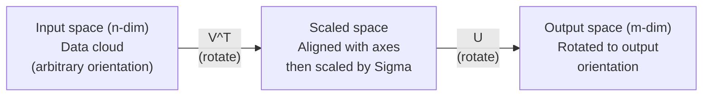
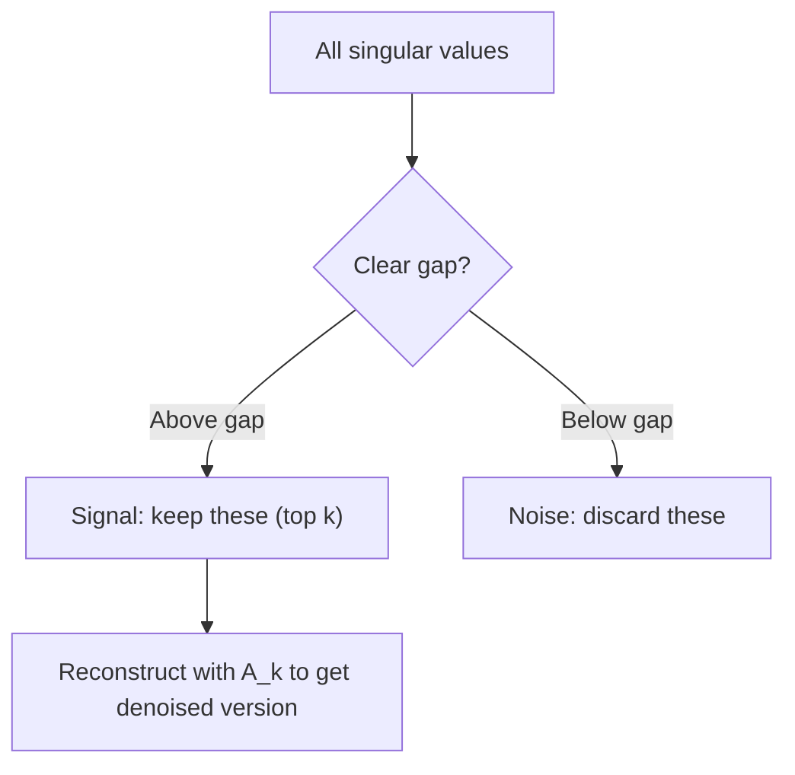

<!-- i18n:manual -->
# Сингулярное разложение

> SVD — швейцарский нож линейной алгебры. Оно есть у любой матрицы. Оно нужно любому специалисту по данным.

**Type:** Build
**Languages:** Python, Julia
**Prerequisites:** Phase 1, Lessons 01 (Linear Algebra Intuition), 02 (Vectors & Matrices Operations), 03 (Matrix Transformations)
**Time:** ~120 minutes

## Learning Objectives

- Реализовать SVD степенным методом и объяснить геометрический смысл U, Sigma и V^T
- Применить усечённое SVD для сжатия изображений и измерить степень сжатия против ошибки восстановления
- Вычислить псевдообратную матрицу Мура-Пенроуза через SVD для решения переопределённых задач наименьших квадратов
- Связать SVD с PCA, рекомендательными системами (латентные факторы) и латентно-семантическим анализом в NLP

> 🎒 **На пальцах.** Любая матрица, какой бы страшной ни была, делает всего три вещи подряд: повернуть, растянуть, снова повернуть. SVD раскладывает её на эти три шага. Дальше урок показывает, что из этого можно выжать: сжатие картинок, рекомендации фильмов, чистку шума.

## The Problem

У вас матрица 1000x2000. Может, это оценки пользователей фильмам. Может, таблица частот слов в документах. Может, значения пикселей изображения. Вам нужно её сжать, очистить от шума, найти скрытую структуру или решить с ней задачу наименьших квадратов. Разложение по собственным векторам работает только на квадратных матрицах. Да и то требует полного набора линейно независимых собственных векторов.

SVD работает на любой матрице. Любой формы. Любого ранга. Без условий. Оно раскладывает матрицу на три множителя, вскрывающих геометрию того, что матрица делает с пространством. Это самое общее и самое полезное разложение во всей линейной алгебре.

## The Concept

### What SVD does geometrically

Каждая матрица, независимо от формы, выполняет три операции подряд: поворот, растяжение, поворот. SVD делает это разложение явным.

```
A = U * Sigma * V^T

      m x n     m x m    m x n    n x n
     (any)    (rotate)  (scale)  (rotate)
```

Для любой матрицы A разложение SVD даёт:
- V^T поворачивает векторы во входном пространстве (n-мерном)
- Sigma масштабирует вдоль каждой оси (растягивает или сжимает)
- U поворачивает результат в выходное пространство (m-мерное)



Думайте так. Вы даёте SVD матрицу. Оно отвечает: «эта матрица берёт шар входов, сначала поворачивает его на V^T, потом растягивает в эллипсоид с помощью Sigma, потом поворачивает эллипсоид на U». Сингулярные числа — это длины осей эллипсоида.

> 🎒 **На пальцах.** Возьмите круглый воздушный шарик и сожмите его руками. Получится эллипсоид: по одной оси длиннее, по другой короче. Сингулярные числа — длины этих осей. Первое число самое большое, оно и говорит, в какую сторону шарик вытянулся сильнее всего.

### The full decomposition

Для матрицы A формы m x n:

```
A = U * Sigma * V^T

where:
  U     is m x m, orthogonal (U^T U = I)
  Sigma is m x n, diagonal (singular values on the diagonal)
  V     is n x n, orthogonal (V^T V = I)

The singular values sigma_1 >= sigma_2 >= ... >= sigma_r > 0
where r = rank(A)
```

Столбцы U называют левыми сингулярными векторами. Столбцы V — правыми сингулярными векторами. Диагональные элементы Sigma — сингулярными числами. Они всегда неотрицательны и по традиции отсортированы по убыванию.

### Left singular vectors, singular values, right singular vectors

У каждой части SVD свой геометрический смысл.

**Right singular vectors (columns of V):** Образуют ортонормированный базис входного пространства (R^n). Это направления во входном пространстве, которые матрица отображает в ортогональные направления выходного. Считайте их естественной системой координат для области определения.

**Singular values (diagonal of Sigma):** Коэффициенты масштабирования. i-е сингулярное число говорит, насколько матрица растягивает векторы вдоль i-го правого сингулярного вектора. Нулевое сингулярное число означает, что матрица схлопывает это направление полностью.

**Left singular vectors (columns of U):** Образуют ортонормированный базис выходного пространства (R^m). i-й левый сингулярный вектор — направление в выходном пространстве, куда попадает i-й правый сингулярный вектор (после масштабирования).

Связь между ними:

```
A * v_i = sigma_i * u_i

The matrix A takes the i-th right singular vector v_i,
scales it by sigma_i, and maps it to the i-th left singular vector u_i.
```

Это даёт покоординатную картину того, что делает любая матрица.

### Outer product form

SVD можно записать как сумму матриц ранга 1:

```
A = sigma_1 * u_1 * v_1^T + sigma_2 * u_2 * v_2^T + ... + sigma_r * u_r * v_r^T

Each term sigma_i * u_i * v_i^T is a rank-1 matrix (an outer product).
The full matrix is the sum of r such matrices, where r is the rank.
```

Эта форма — основа приближения матрицей низкого ранга. Каждое слагаемое добавляет один слой структуры. Первое захватывает самый важный узор. Второе — следующий по важности. И так далее. Обрезание этой суммы даёт наилучшее возможное приближение для любого заданного ранга.

```
Rank-1 approx:    A_1 = sigma_1 * u_1 * v_1^T
                  (captures the dominant pattern)

Rank-2 approx:    A_2 = sigma_1 * u_1 * v_1^T + sigma_2 * u_2 * v_2^T
                  (captures the two most important patterns)

Rank-k approx:    A_k = sum of top k terms
                  (optimal by the Eckart-Young theorem)
```

> 🎒 **На пальцах.** Как рисуют портрет: сначала общий овал лица, потом крупные черты, потом мелкие детали, потом ресницы. Каждое слагаемое SVD — один такой этап. Остановились после трёх — портрет узнаваем, хоть и без ресниц. Именно так и работает сжатие.

### Relationship to eigendecomposition

SVD и разложение по собственным векторам глубоко связаны. Сингулярные числа и векторы A берутся напрямую из собственных значений и векторов A^T A и A A^T.

```
A^T A = V * Sigma^T * U^T * U * Sigma * V^T
      = V * Sigma^T * Sigma * V^T
      = V * D * V^T

where D = Sigma^T * Sigma is a diagonal matrix with sigma_i^2 on the diagonal.

So:
- The right singular vectors (V) are eigenvectors of A^T A
- The singular values squared (sigma_i^2) are eigenvalues of A^T A

Similarly:
A A^T = U * Sigma * V^T * V * Sigma^T * U^T
      = U * Sigma * Sigma^T * U^T

So:
- The left singular vectors (U) are eigenvectors of A A^T
- The eigenvalues of A A^T are also sigma_i^2
```

Эта связь говорит три вещи:
1. Сингулярные числа всегда вещественны и неотрицательны (они корни из собственных значений положительно полуопределённой матрицы).
2. SVD можно было бы считать через разложение A^T A, но это возводит число обусловленности в квадрат и теряет точность. Специальные алгоритмы SVD этого избегают.
3. Когда A квадратная, симметричная и положительно полуопределённая, SVD и разложение по собственным векторам — одно и то же.

### Truncated SVD: low-rank approximation

Теорема Эккарта-Янга-Мирского утверждает: наилучшее приближение A матрицей ранга k (и в норме Фробениуса, и в спектральной) получается, если оставить только top-k сингулярных чисел и соответствующие векторы:

```
A_k = U_k * Sigma_k * V_k^T

where:
  U_k     is m x k  (first k columns of U)
  Sigma_k is k x k  (top-left k x k block of Sigma)
  V_k     is n x k  (first k columns of V)

Approximation error = sigma_{k+1}  (in spectral norm)
                    = sqrt(sigma_{k+1}^2 + ... + sigma_r^2)  (in Frobenius norm)
```

Это не просто «хорошее» приближение. Это доказанно наилучшее возможное приближение ранга k. Никакая другая матрица ранга k не ближе к A.

| Component | Relative magnitude | Kept in rank-3 approx? |
|-----------|-------------------|------------------------|
| sigma_1 | Наибольшее | Да |
| sigma_2 | Большое | Да |
| sigma_3 | Средне-большое | Да |
| sigma_4 | Среднее | Нет (ошибка) |
| sigma_5 | Средне-малое | Нет (ошибка) |
| sigma_6 | Малое | Нет (ошибка) |
| sigma_7 | Очень малое | Нет (ошибка) |
| sigma_8 | Крошечное | Нет (ошибка) |

Оставляем top-3: A_3 захватывает три наибольших сингулярных числа. Ошибка — это оставшиеся значения (с sigma_4 по sigma_8).

Если сингулярные числа падают быстро, малое k захватывает почти всю матрицу. Если падают медленно, у матрицы нет низкоранговой структуры.

### Image compression with SVD

Чёрно-белое изображение — матрица яркостей пикселей. В картинке 800x600 сидит 480 000 значений. SVD позволяет приблизить её куда меньшим числом.

```
Original image: 800 x 600 = 480,000 values

SVD with rank k:
  U_k:      800 x k values
  Sigma_k:  k values
  V_k:      600 x k values
  Total:    k * (800 + 600 + 1) = k * 1401 values

  k=10:   14,010 values   (2.9% of original)
  k=50:   70,050 values  (14.6% of original)
  k=100: 140,100 values  (29.2% of original)

  The compression ratio improves as k gets smaller,
  but visual quality degrades.
```

Ключевая мысль: у естественных изображений сингулярные числа убывают быстро. Первые несколько захватывают общую структуру (формы, градиенты). Последующие — мелкие детали и шум. Обрезание на ранге 50 часто даёт картинку, почти неотличимую от оригинала, при экономии 85% места.

> 🎒 **На пальцах.** Считайте сами: без сжатия 480 000 чисел, с рангом 10 — всего 14 010. Это в 34 раза меньше, а лицо на фотографии всё ещё узнаётся. Ровно этим и занимается JPEG, только другим математическим аппаратом.

### SVD for recommendation systems

Netflix Prize сделал это знаменитым. У вас матрица «пользователь-фильм» с оценками, где большинство клеток пустые.

```
             Movie1  Movie2  Movie3  Movie4  Movie5
  User1      [  5      ?       3       ?       1  ]
  User2      [  ?      4       ?       2       ?  ]
  User3      [  3      ?       5       ?       ?  ]
  User4      [  ?      ?       ?       4       3  ]

  ? = unknown rating
```

Идея: у этой матрицы низкий ранг. Вкусы пользователей не бывают полностью независимыми. Есть горстка латентных факторов (боевик против драмы, старое против нового, умное против зрелищного), которые объясняют большинство предпочтений.

SVD на (заполненной) матрице оценок раскладывает её на:
- U: профили пользователей в пространстве латентных факторов
- Sigma: важность каждого латентного фактора
- V^T: профили фильмов в пространстве латентных факторов

Предсказанная оценка пользователя фильму — скалярное произведение профиля пользователя на профиль фильма (взвешенное сингулярными числами). Низкоранговое приближение заполняет пустые клетки.

На практике используют варианты вроде инкрементного SVD Саймона Фанка или ALS (чередующиеся наименьшие квадраты), умеющие работать с пропусками напрямую. Но суть та же: разложение на латентные факторы через SVD.

> 🎒 **На пальцах.** Вы никогда не смотрели «Матрицу», но вам её советуют. Почему? Потому что вы любите три фильма, которые любят те же люди, что любят «Матрицу». Никто не знает про вас ничего личного — просто нашлась группа со схожими вкусами. Латентный фактор и есть эта невидимая «группа вкуса».

### SVD in NLP: Latent Semantic Analysis

Латентно-семантический анализ (LSA), он же латентно-семантическое индексирование (LSI), применяет SVD к матрице «термин-документ».

```
             Doc1   Doc2   Doc3   Doc4
  "cat"      [  3      0      1      0  ]
  "dog"      [  2      0      0      1  ]
  "fish"     [  0      4      1      0  ]
  "pet"      [  1      1      1      1  ]
  "ocean"    [  0      3      0      0  ]

After SVD with rank k=2:

  Each document becomes a point in 2D "concept space."
  Each term becomes a point in the same 2D space.
  Documents about similar topics cluster together.
  Terms with similar meanings cluster together.

  "cat" and "dog" end up near each other (land pets).
  "fish" and "ocean" end up near each other (water concepts).
  Doc1 and Doc3 cluster if they share similar topics.
```

LSA был одним из первых успешных методов извлечения смысловой близости из сырого текста. Он работает, потому что синонимы обычно встречаются в похожих документах, и SVD собирает их в одни и те же латентные измерения. Современные векторные представления слов (Word2Vec, GloVe) можно считать потомками этой идеи.

> 🎒 **На пальцах.** Программа не знает, что кошка и собака — домашние животные. Она замечает другое: слова «кошка» и «собака» встречаются в одних и тех же текстах, а «рыба» и «океан» — в других. Из одной только совместной встречаемости получается карта смыслов. Никто не объяснял машине, что такое смысл.

### SVD for noise reduction

У зашумлённых данных сигнал сосредоточен в верхних сингулярных числах, а шум размазан по всем. Обрезание убирает шумовую подложку.

**Clean signal singular values:**

| Component | Magnitude | Type |
|-----------|-----------|------|
| sigma_1 | Очень большое | Сигнал |
| sigma_2 | Большое | Сигнал |
| sigma_3 | Среднее | Сигнал |
| sigma_4 | Около нуля | Пренебрежимо |
| sigma_5 | Около нуля | Пренебрежимо |

**Noisy signal singular values (noise adds to all):**

| Component | Magnitude | Type |
|-----------|-----------|------|
| sigma_1 | Очень большое | Сигнал |
| sigma_2 | Большое | Сигнал |
| sigma_3 | Среднее | Сигнал |
| sigma_4 | Малое | Шум |
| sigma_5 | Малое | Шум |
| sigma_6 | Малое | Шум |
| sigma_7 | Малое | Шум |



Это применяют в обработке сигналов, научных измерениях и чистке данных. Всегда, когда матрица испорчена аддитивным шумом, усечённое SVD — обоснованный способ отделить сигнал от шума.

> 🎒 **На пальцах.** Как выкрутить басы и убрать шипение на старой записи. Сигнал — то, что громко и структурно. Шум — то, что тихо и размазано по всему. Смотрите, где в списке сингулярных чисел резкий обрыв: всё до обрыва — музыка, всё после — шипение.

### Pseudoinverse via SVD

Псевдообратная матрица Мура-Пенроуза A+ обобщает обращение матриц на неквадратные и вырожденные случаи. SVD делает её вычисление тривиальным.

```
If A = U * Sigma * V^T, then:

A+ = V * Sigma+ * U^T

where Sigma+ is formed by:
  1. Transpose Sigma (swap rows and columns)
  2. Replace each non-zero diagonal entry sigma_i with 1/sigma_i
  3. Leave zeros as zeros

For A (m x n):      A+ is (n x m)
For Sigma (m x n):  Sigma+ is (n x m)
```

Псевдообратная решает задачи наименьших квадратов. Если у Ax = b нет точного решения (переопределённая система), то x = A+ b — решение по методу наименьших квадратов (минимизирует ||Ax - b||).

```
Overdetermined system (more equations than unknowns):

  [1  1]         [3]
  [2  1] x   =   [5]       No exact solution exists.
  [3  1]         [6]

  x_ls = A+ b = V * Sigma+ * U^T * b

  This gives the x that minimizes the sum of squared residuals.
  Same result as the normal equations (A^T A)^(-1) A^T b,
  but numerically more stable.
```

> 🎒 **На пальцах.** Три уравнения, две неизвестные — как три человека, которые описывают одно событие немного по-разному. Точного ответа, устраивающего всех троих, нет. Псевдообратная находит компромисс: версию, которая меньше всего расходится со всеми показаниями сразу. Это и есть метод наименьших квадратов — тот же, которым проводят прямую через облако точек на графике.

### Numerical stability advantages

Вычисление собственных значений A^T A возводит сингулярные числа в квадрат (собственные значения A^T A равны sigma_i^2). Это возводит в квадрат и число обусловленности, усиливая численные ошибки.

```
Example:
  A has singular values [1000, 1, 0.001]
  Condition number of A: 1000 / 0.001 = 10^6

  A^T A has eigenvalues [10^6, 1, 10^{-6}]
  Condition number of A^T A: 10^6 / 10^{-6} = 10^{12}

  Computing SVD directly: works with condition number 10^6
  Computing via A^T A:     works with condition number 10^{12}
                           (6 extra digits of precision lost)
```

Современные алгоритмы SVD (бидиагонализация Голуба-Кахана) работают напрямую с A и никогда не формируют A^T A. Поэтому всегда предпочитайте `np.linalg.svd(A)` вместо `np.linalg.eig(A.T @ A)`.

> 🎒 **На пальцах.** Компьютер хранит около 16 значащих цифр. Возведение в квадрат съедает половину запаса разом. Это как копировать копию копии: каждый шаг теряет качество, поэтому лишних шагов делать не стоит.

### Connection to PCA

PCA — ЭТО SVD на центрированных данных. Не аналогия. Буквально то же самое вычисление.

```
Given data matrix X (n_samples x n_features), centered (mean subtracted):

Covariance matrix: C = (1/(n-1)) * X^T X

PCA finds eigenvectors of C. But:

  X = U * Sigma * V^T    (SVD of X)

  X^T X = V * Sigma^2 * V^T

  C = (1/(n-1)) * V * Sigma^2 * V^T

So the principal components are exactly the right singular vectors V.
The explained variance for each component is sigma_i^2 / (n-1).

In sklearn, PCA is implemented using SVD, not eigendecomposition.
It is faster and more numerically stable.
```

Это значит, что всё, что вы узнали про снижение размерности в уроке 10, под капотом было SVD. PCA — самое частое применение SVD в машинном обучении.

```figure
svd-rank-reconstruction
```

## Build It

### Step 1: SVD from scratch using power iteration

Идея: чтобы найти наибольшее сингулярное число и его векторы, применяем степенной метод к A^T A (или A A^T). Затем «вычитаем» найденное из матрицы и повторяем для следующего сингулярного числа.

```python
import numpy as np

def power_iteration(M, num_iters=100):
    n = M.shape[1]
    v = np.random.randn(n)
    v = v / np.linalg.norm(v)

    for _ in range(num_iters):
        Mv = M @ v
        v = Mv / np.linalg.norm(Mv)

    eigenvalue = v @ M @ v
    return eigenvalue, v

def svd_from_scratch(A, k=None):
    m, n = A.shape
    if k is None:
        k = min(m, n)

    sigmas = []
    us = []
    vs = []

    A_residual = A.copy().astype(float)

    for _ in range(k):
        AtA = A_residual.T @ A_residual
        eigenvalue, v = power_iteration(AtA, num_iters=200)

        if eigenvalue < 1e-10:
            break

        sigma = np.sqrt(eigenvalue)
        u = A_residual @ v / sigma

        sigmas.append(sigma)
        us.append(u)
        vs.append(v)

        A_residual = A_residual - sigma * np.outer(u, v)

    U = np.column_stack(us) if us else np.empty((m, 0))
    S = np.array(sigmas)
    V = np.column_stack(vs) if vs else np.empty((n, 0))

    return U, S, V
```

> 🎒 **На пальцах.** Степенной метод — удивительно тупой и удивительно рабочий приём. Берём случайный вектор, умножаем на матрицу, нормируем. Повторяем сто раз. Вектор сам собой разворачивается в сторону главного направления — как компас, который покрутили и отпустили. Всё, что «слабо», за сто умножений затухает, «сильное» остаётся.

### Step 2: Test and compare with NumPy

```python
np.random.seed(42)
A = np.random.randn(5, 4)

U_ours, S_ours, V_ours = svd_from_scratch(A)
U_np, S_np, Vt_np = np.linalg.svd(A, full_matrices=False)

print("Our singular values:", np.round(S_ours, 4))
print("NumPy singular values:", np.round(S_np, 4))

A_reconstructed = U_ours @ np.diag(S_ours) @ V_ours.T
print(f"Reconstruction error: {np.linalg.norm(A - A_reconstructed):.8f}")
```

### Step 3: Image compression demo

```python
def compress_image_svd(image_matrix, k):
    U, S, Vt = np.linalg.svd(image_matrix, full_matrices=False)
    compressed = U[:, :k] @ np.diag(S[:k]) @ Vt[:k, :]
    return compressed

image = np.random.seed(42)
rows, cols = 200, 300
image = np.random.randn(rows, cols)

for k in [1, 5, 10, 20, 50]:
    compressed = compress_image_svd(image, k)
    error = np.linalg.norm(image - compressed) / np.linalg.norm(image)
    original_size = rows * cols
    compressed_size = k * (rows + cols + 1)
    ratio = compressed_size / original_size
    print(f"k={k:>3d}  error={error:.4f}  storage={ratio:.1%}")
```

> 🎒 **На пальцах.** Учтите подвох: здесь «изображение» — случайный шум. У шума нет структуры, поэтому сжимается он отвратительно, и ошибка останется большой при любом k. Это полезно увидеть своими глазами: SVD сжимает не всё подряд, а только то, в чём есть повторяющийся узор. Настоящая фотография сожмётся в разы лучше.

### Step 4: Noise reduction

```python
np.random.seed(42)
clean = np.outer(np.sin(np.linspace(0, 4*np.pi, 100)),
                 np.cos(np.linspace(0, 2*np.pi, 80)))
noise = 0.3 * np.random.randn(100, 80)
noisy = clean + noise

U, S, Vt = np.linalg.svd(noisy, full_matrices=False)
denoised = U[:, :5] @ np.diag(S[:5]) @ Vt[:5, :]

print(f"Noisy error:    {np.linalg.norm(noisy - clean):.4f}")
print(f"Denoised error: {np.linalg.norm(denoised - clean):.4f}")
print(f"Improvement:    {(1 - np.linalg.norm(denoised - clean) / np.linalg.norm(noisy - clean)):.1%}")
```

### Step 5: Pseudoinverse

```python
A = np.array([[1, 1], [2, 1], [3, 1]], dtype=float)
b = np.array([3, 5, 6], dtype=float)

U, S, Vt = np.linalg.svd(A, full_matrices=False)
S_inv = np.diag(1.0 / S)
A_pinv = Vt.T @ S_inv @ U.T

x_svd = A_pinv @ b
x_lstsq = np.linalg.lstsq(A, b, rcond=None)[0]
x_pinv = np.linalg.pinv(A) @ b

print(f"SVD pseudoinverse solution:  {x_svd}")
print(f"np.linalg.lstsq solution:   {x_lstsq}")
print(f"np.linalg.pinv solution:    {x_pinv}")
```

> 🎒 **На пальцах.** Все три способа напечатают одинаковые числа. Это и есть смысл упражнения: `np.linalg.pinv` — не чёрный ящик, внутри он делает ровно те три строки, что вы написали руками выше.

## Use It

Полные рабочие демонстрации лежат в `code/svd.py`. Запустите, чтобы увидеть SVD в сжатии изображений, рекомендательных системах, латентно-семантическом анализе и подавлении шума.

```bash
python svd.py
```

Версия на Julia в `code/svd.jl` показывает те же понятия через встроенную функцию `svd()` и пакет `LinearAlgebra`.

```bash
julia svd.jl
```

## Ship It

Этот урок производит:
- `outputs/skill-svd.md` - навык понимания, когда и как применять SVD в реальных проектах

## Exercises

1. Реализуйте полное SVD с нуля без степенного метода. Вместо этого вычислите разложение A^T A по собственным векторам, чтобы получить V и сингулярные числа, затем посчитайте U = A V Sigma^{-1}. Сравните численную точность с вашей версией на степенном методе и с NumPy.

2. Загрузите настоящее чёрно-белое изображение (или переведите цветное в оттенки серого). Сожмите его с рангами 1, 5, 10, 25, 50, 100. Для каждого ранга посчитайте степень сжатия и относительную ошибку. Найдите ранг, на котором картинка становится визуально приемлемой.

3. Постройте крошечную рекомендательную систему. Создайте матрицу оценок 10x8 «пользователь-фильм» с несколькими известными клетками. Заполните пропуски средними по строкам. Вычислите SVD и восстановите приближение ранга 3. По восстановленной матрице предскажите недостающие оценки. Проверьте, что предсказания разумны.

4. Создайте матрицу «документ-термин» 100x50 с 3 синтетическими темами. У каждой темы 5 связанных терминов. Добавьте шум. Примените SVD и убедитесь, что три верхних сингулярных числа заметно больше остальных. Спроецируйте документы в трёхмерное латентное пространство и проверьте, что документы одной темы собираются вместе.

5. Сгенерируйте чистую матрицу низкого ранга (ранг 3, размер 50x40) и добавьте гауссов шум разного уровня (sigma = 0.1, 0.5, 1.0, 2.0). Для каждого уровня найдите оптимальный ранг обрезания, перебрав k от 1 до 40 и измеряя ошибку восстановления относительно чистой матрицы. Нарисуйте, как меняется оптимальное k с ростом шума.

> 🎒 **На пальцах.** Второе задание — самое эффектное. Ранг 1 даёт размытые полосы, ранг 10 — узнаваемые очертания, ранг 50 — почти оригинал. Вы увидите своими глазами, что «важность» сингулярного числа — не абстракция, а конкретные детали на картинке.

## Key Terms

| Term | What people say | What it actually means |
|------|----------------|----------------------|
| SVD | «Разложить любую матрицу» | Разложение A на U Sigma V^T, где U и V ортогональны, а Sigma диагональна с неотрицательными элементами. Работает для матрицы любой формы. |
| Singular value | «Насколько важна эта компонента» | i-й диагональный элемент Sigma. Показывает, насколько матрица растягивает вдоль i-го главного направления. Всегда неотрицателен, отсортирован по убыванию. |
| Left singular vector | «Направление на выходе» | Столбец U. Направление в выходном пространстве, куда попадает i-й правый сингулярный вектор (после масштабирования на sigma_i). |
| Right singular vector | «Направление на входе» | Столбец V. Направление во входном пространстве, которое матрица отображает в i-й левый сингулярный вектор (после масштабирования на sigma_i). |
| Truncated SVD | «Приближение низкого ранга» | Оставить только top-k сингулярных чисел и их векторы. Даёт доказанно наилучшее приближение ранга k (теорема Эккарта-Янга). |
| Rank | «Истинная размерность» | Количество ненулевых сингулярных чисел. Говорит, сколько независимых направлений матрица реально использует. |
| Pseudoinverse | «Обобщённая обратная» | V Sigma+ U^T. Обращает ненулевые сингулярные числа, нули оставляет нулями. Решает задачи наименьших квадратов для неквадратных и вырожденных матриц. |
| Condition number | «Насколько чувствительна к ошибкам» | sigma_max / sigma_min. Большое число обусловленности означает, что малые изменения входа дают большие изменения выхода. SVD показывает это напрямую. |
| Latent factor | «Скрытая переменная» | Измерение в низкоранговом пространстве, найденное SVD. В рекомендациях латентный фактор может отвечать за предпочтение жанра. В NLP — за тему. |
| Frobenius norm | «Общий размер матрицы» | Корень из суммы квадратов элементов. Равен корню из суммы квадратов сингулярных чисел. Используется для измерения ошибки приближения. |
| Eckart-Young theorem | «SVD даёт наилучшее сжатие» | Для любого целевого ранга k усечённое SVD минимизирует ошибку приближения среди всех возможных матриц ранга k. |
| Power iteration | «Найти главный собственный вектор» | Многократно умножать случайный вектор на матрицу и нормировать. Сходится к собственному вектору с наибольшим собственным значением. Кирпичик многих алгоритмов SVD. |

## Further Reading

- [Gilbert Strang: Linear Algebra and Its Applications, Chapter 7](https://math.mit.edu/~gs/linearalgebra/) - обстоятельный разбор SVD с приложениями
- [3Blue1Brown: But what is the SVD?](https://www.youtube.com/watch?v=vSczTbgc8Rc) - геометрическая интуиция для SVD
- [We Recommend a Singular Value Decomposition](https://www.ams.org/publicoutreach/feature-column/fcarc-svd) - доступный обзор от Американского математического общества
- [Netflix Prize and Matrix Factorization](https://sifter.org/~simon/journal/20061211.html) - оригинальный пост Саймона Фанка про SVD для рекомендаций
- [Latent Semantic Analysis](https://en.wikipedia.org/wiki/Latent_semantic_analysis) - первое применение SVD в NLP
- [Numerical Linear Algebra by Trefethen and Bau](https://people.maths.ox.ac.uk/trefethen/text.html) - золотой стандарт для понимания алгоритмов SVD и их численных свойств
