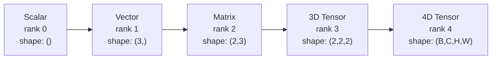
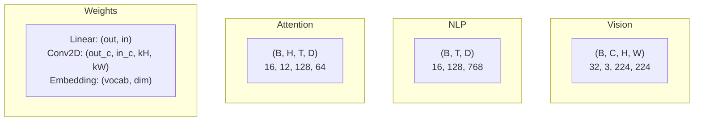
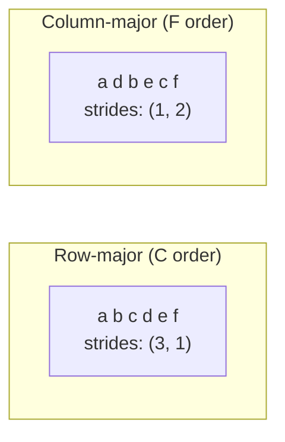
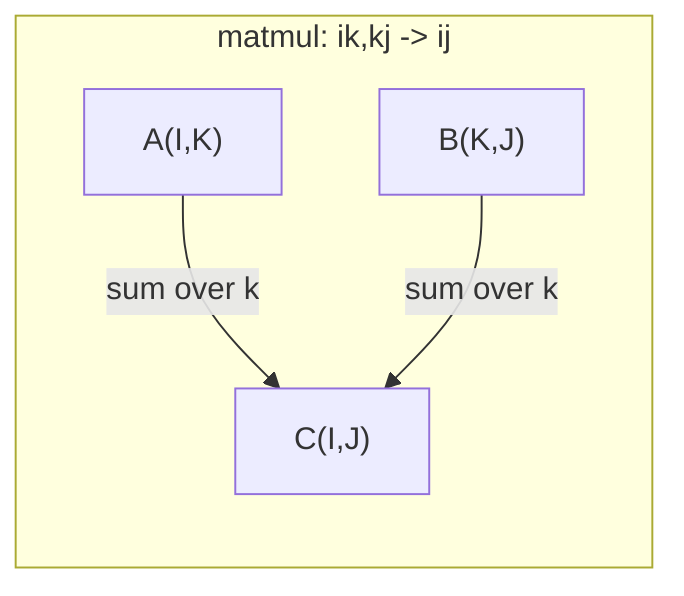

<!-- i18n:manual -->
# Операции над тензорами

> Тензоры — общий язык данных и глубокого обучения. Через них течёт каждое изображение, каждое предложение, каждый градиент.

**Type:** Build
**Language:** Python
**Prerequisites:** Phase 1, Lessons 01 (Linear Algebra Intuition), 02 (Vectors, Matrices & Operations)
**Time:** ~90 minutes

## Learning Objectives

- Реализовать с нуля класс тензора с формой, шагами (strides), reshape, transpose и поэлементными операциями
- Применять правила broadcasting для работы с тензорами разной формы без копирования данных
- Писать einsum-выражения для скалярных произведений, умножения матриц, внешних произведений и пакетных операций
- Проследить точные формы тензоров на каждом шаге multi-head attention

> 🎒 **На пальцах.** Число — точка. Список чисел — строка. Таблица — лист. Стопка листов — коробка. Тензор — просто продолжение этого ряда на сколько угодно уровней. И 90% ошибок в коде нейросетей — это перепутанные размеры такой коробки.

## The Problem

Вы собираете трансформер. Прямой проход выглядит чисто. Запускаете и получаете: `RuntimeError: mat1 and mat2 shapes cannot be multiplied (32x768 and 512x768)`. Вы смотрите на формы. Пробуете транспонировать. Теперь пишет `Expected 4D input (got 3D input)`. Добавляете unsqueeze. Ломается что-то ещё.

Ошибки форм — самый частый баг в коде глубокого обучения. Концептуально они несложные: у каждой операции есть контракт по форме. Но они множатся быстро. В трансформере десятки reshape, transpose и broadcast, сцепленных подряд. Одна не та ось — и ошибка идёт лавиной. Хуже того, некоторые ошибки форм вообще не падают. Они молча выдают мусор, размножая по неверному измерению или суммируя не по той оси.

Матрицы описывают попарные отношения между двумя наборами вещей. Настоящие данные в два измерения не влезают. Пачка из 32 RGB-изображений 224x224 — четырёхмерный тензор: `(32, 3, 224, 224)`. Self-attention с 12 головами тоже четырёхмерен: `(batch, heads, seq_len, head_dim)`. Нужна структура данных, обобщающаяся на любое число измерений, с операциями, которые чисто сочетаются по всем из них. Эта структура — тензор. Освойте его операции, и ошибки форм станут тривиально отлаживаемыми.

> 🎒 **На пальцах.** Формы — как размеры розетки и вилки. Если не совпали, ничего не воткнётся. Хорошая новость: программа сама скажет, какие размеры не сошлись. Плохая: иногда она молча подключит не туда и всё «заработает» неправильно.

## The Concept

### What a tensor is

Тензор — многомерный массив чисел одного типа. Число измерений называют **рангом** (или порядком). Каждое измерение — **ось**. **Форма** — кортеж размеров по каждой оси.



Всего элементов = произведение всех размеров. Форма `(2, 3, 4)` содержит `2 * 3 * 4 = 24` элемента.

> 🎒 **На пальцах.** Школьная аналогия по уровням: оценка (одно число) → дневник ученика (список) → журнал класса (таблица) → все журналы школы (стопка) → все школы города. Каждый уровень добавляет одну ось. Ранг — это сколько раз вы сказали «а теперь много таких».

### Tensor shapes in deep learning

Разные типы данных по традиции отображаются в определённые формы тензоров.



PyTorch использует NCHW (каналы впереди). TensorFlow по умолчанию NHWC (каналы в конце). Несовпадение раскладок вызывает молчаливые тормоза или ошибки.

> 🎒 **На пальцах.** Расшифровка букв: B — batch, сколько примеров за раз; C — channels, для картинки это 3 (красный, зелёный, синий); H и W — высота и ширина в пикселях; T — сколько слов в предложении; D — длина вектора, описывающего одно слово. `(32, 3, 224, 224)` читается как «32 картинки, каждая цветная, 224 на 224».

### How memory layout works

Двумерный массив в памяти — одномерная последовательность байтов. **Шаги (strides)** говорят, сколько элементов пропустить, чтобы сдвинуться на один шаг вдоль каждой оси.



Транспонирование не двигает данные. Оно меняет местами шаги, делая тензор **несплошным (non-contiguous)** — элементы одной строки перестают лежать в памяти подряд.

> 🎒 **На пальцах.** Память — это одна длинная полка. Таблицу 2x3 кладут на неё в ряд: a b c d e f. Чтобы перейти к следующей строке, надо перешагнуть 3 позиции — это и есть stride. Транспонирование ничего не перекладывает, оно просто говорит «а теперь читай эту же полку другими шагами».

### Broadcasting rules

Broadcasting позволяет работать с тензорами разной формы без копирования данных. Выравниваем формы справа. Два измерения совместимы, если они равны или одно из них равно 1. Недостающие измерения дополняются единицами слева.

```
Tensor A:     (8, 1, 6, 1)
Tensor B:        (7, 1, 5)
Padded B:     (1, 7, 1, 5)
Result:       (8, 7, 6, 5)
```

> 🎒 **На пальцах.** Разберите пример по столбикам справа налево: 1 и 5 — берём 5; 6 и 1 — берём 6; 1 и 7 — берём 7; 8 и (пусто = 1) — берём 8. Правило простое: где стоит единица, там измерение «растягивается» до соседа. Где стоят два разных числа больше единицы — ошибка.

### Einsum: the universal tensor operation

Суммирование Эйнштейна помечает каждую ось буквой. Оси, которые есть на входе, но нет в выходе, суммируются. Оси, присутствующие и там и там, сохраняются.



Ключевые шаблоны: `i,i->` (скалярное произведение), `i,j->ij` (внешнее произведение), `ii->` (след), `ij->ji` (транспонирование), `bij,bjk->bik` (пакетное умножение матриц), `bhtd,bhsd->bhts` (attention scores).

> 🎒 **На пальцах.** Einsum читается как предложение. `ik,kj->ij` значит: «взять A с осями i и k, взять B с осями k и j, получить результат с осями i и j». Буква k пропала из ответа — значит по ней просуммировали. Это то же умножение матриц, но записанное так, что ошибиться труднее.

```figure
tensor-broadcast
```

## Build It

Код лежит в `code/tensors.py`. Каждый шаг ссылается на реализацию оттуда.

### Step 1: Tensor storage and strides

Тензор хранит плоский список чисел плюс метаданные формы. Шаги говорят логике индексации, как переводить многомерные индексы в плоские позиции.

```python
class Tensor:
    def __init__(self, data, shape=None):
        if isinstance(data, (list, tuple)):
            self._data, self._shape = self._flatten_nested(data)
        elif isinstance(data, np.ndarray):
            self._data = data.flatten().tolist()
            self._shape = tuple(data.shape)
        else:
            self._data = [data]
            self._shape = ()

        if shape is not None:
            total = reduce(lambda a, b: a * b, shape, 1)
            if total != len(self._data):
                raise ValueError(
                    f"Cannot reshape {len(self._data)} elements into shape {shape}"
                )
            self._shape = tuple(shape)

        self._strides = self._compute_strides(self._shape)

    @staticmethod
    def _compute_strides(shape):
        if len(shape) == 0:
            return ()
        strides = [1] * len(shape)
        for i in range(len(shape) - 2, -1, -1):
            strides[i] = strides[i + 1] * shape[i + 1]
        return tuple(strides)
```

Для формы `(3, 4)` шаги равны `(4, 1)` — пропустить 4 элемента, чтобы перейти на строку ниже, пропустить 1 элемент, чтобы перейти на столбец правее.

### Step 2: Reshape, squeeze, unsqueeze

Reshape меняет форму, не меняя порядок элементов. Общее число элементов должно сохраняться. Поставьте `-1` для одного измерения, чтобы его размер вычислился сам.

```python
t = Tensor(list(range(12)), shape=(2, 6))
r = t.reshape((3, 4))
r = t.reshape((-1, 3))
```

Squeeze убирает оси размера 1. Unsqueeze вставляет одну. Unsqueeze критичен для broadcasting: вектор смещения `(D,)`, прибавляемый к пачке `(B, T, D)`, нужно развернуть в `(1, 1, D)`.

```python
t = Tensor(list(range(6)), shape=(1, 3, 1, 2))
s = t.squeeze()
v = Tensor([1, 2, 3])
u = v.unsqueeze(0)
```

> 🎒 **На пальцах.** Reshape — как переложить 12 конфет: в 2 ряда по 6, в 3 ряда по 4 или в один ряд по 12. Конфеты те же, коробка другая. Поэтому 12 нельзя переложить в 5 рядов по 3 — не сойдётся, и программа честно ругнётся.

### Step 3: Transpose and permute

Transpose меняет местами две оси. Permute переставляет все оси. Так конвертируют между NCHW и NHWC.

```python
mat = Tensor(list(range(6)), shape=(2, 3))
tr = mat.transpose(0, 1)

t4d = Tensor(list(range(24)), shape=(1, 2, 3, 4))
perm = t4d.permute((0, 2, 3, 1))
```

После transpose или permute тензор становится несплошным в памяти. В PyTorch `view` на таких падает — используйте `reshape` или сначала вызовите `.contiguous()`.

### Step 4: Element-wise operations and reductions

Поэлементные операции (сложение, умножение, вычитание) применяются независимо к каждому элементу и сохраняют форму. Свёртки (sum, mean, max) схлопывают одну или несколько осей.

```python
a = Tensor([[1, 2], [3, 4]])
b = Tensor([[10, 20], [30, 40]])
c = a + b
d = a * 2
s = a.sum(axis=0)
```

Глобальный average pooling в CNN: `(B, C, H, W).mean(axis=[2, 3])` даёт `(B, C)`. Усреднение последовательности в NLP: `(B, T, D).mean(axis=1)` даёт `(B, D)`.

> 🎒 **На пальцах.** Свёртка по оси — как посчитать итог в журнале. Среднее по строке — средний балл ученика. Среднее по столбцу — средний балл класса по предмету. Ось, по которой усреднили, исчезает: было две, стала одна.

### Step 5: Broadcasting with NumPy

Функция `demo_broadcasting_numpy()` в `tensors.py` показывает основные шаблоны.

```python
activations = np.random.randn(4, 3)
bias = np.array([0.1, 0.2, 0.3])
result = activations + bias

images = np.random.randn(2, 3, 4, 4)
scale = np.array([0.5, 1.0, 1.5]).reshape(1, 3, 1, 1)
result = images * scale

a = np.array([1, 2, 3]).reshape(-1, 1)
b = np.array([10, 20, 30, 40]).reshape(1, -1)
outer = a * b
```

Попарные расстояния через broadcasting: переформатировать `(M, 2)` в `(M, 1, 2)` и `(N, 2)` в `(1, N, 2)`, вычесть, возвести в квадрат, просуммировать по последней оси, взять корень. Результат: `(M, N)`.

### Step 6: Einsum operations

Функции `demo_einsum()` и `demo_einsum_gallery()` проходят по всем частым шаблонам.

```python
a = np.array([1.0, 2.0, 3.0])
b = np.array([4.0, 5.0, 6.0])
dot = np.einsum("i,i->", a, b)

A = np.array([[1, 2], [3, 4], [5, 6]], dtype=float)
B = np.array([[7, 8, 9], [10, 11, 12]], dtype=float)
matmul = np.einsum("ik,kj->ij", A, B)

batch_A = np.random.randn(4, 3, 5)
batch_B = np.random.randn(4, 5, 2)
batch_mm = np.einsum("bij,bjk->bik", batch_A, batch_B)
```

Вычислительная стоимость свёртки — произведение размеров всех индексов (и сохранённых, и просуммированных). Для `bij,bjk->bik` при B=32, I=128, J=64, K=128: `32 * 128 * 64 * 128 = 33 554 432` умножений со сложением.

> 🎒 **На пальцах.** 33 миллиона операций — и это одна строка кода на одном слое одного небольшого трансформера. Отсюда и видеокарты: они умеют делать миллионы таких умножений одновременно, а обычный процессор — по несколько за раз.

### Step 7: Attention mechanism via einsum

Функция `demo_attention_einsum()` реализует multi-head attention от начала до конца.

```python
B, H, T, D = 2, 4, 8, 16
E = H * D

X = np.random.randn(B, T, E)
W_q = np.random.randn(E, E) * 0.02

Q = np.einsum("bte,ek->btk", X, W_q)
Q = Q.reshape(B, T, H, D).transpose(0, 2, 1, 3)

scores = np.einsum("bhtd,bhsd->bhts", Q, K) / np.sqrt(D)
weights = softmax(scores, axis=-1)
attn_output = np.einsum("bhts,bhsd->bhtd", weights, V)

concat = attn_output.transpose(0, 2, 1, 3).reshape(B, T, E)
output = np.einsum("bte,ek->btk", concat, W_o)
```

Каждый шаг — операция над тензорами: проекция (matmul через einsum), разбиение на головы (reshape + transpose), attention scores (пакетный matmul через einsum), взвешенная сумма (пакетный matmul через einsum), сборка голов (transpose + reshape), выходная проекция (matmul через einsum).

> 🎒 **На пальцах.** Внимание в трансформере на пальцах: каждое слово задаёт вопрос (Q), у каждого слова есть табличка с ответом (K) и содержимое (V). Строка `bhtd,bhsd->bhts` считает, насколько вопрос каждого слова подходит к табличке каждого другого. Дальше softmax превращает это в проценты, и слово забирает содержимое тех, кто ему больше подошёл. Вся «магия» трансформеров — эти пять строк.

## Use It

### Scratch vs NumPy

| Operation | Scratch (Tensor class) | NumPy |
|---|---|---|
| Создать | `Tensor([[1,2],[3,4]])` | `np.array([[1,2],[3,4]])` |
| Reshape | `t.reshape((3,4))` | `a.reshape(3,4)` |
| Transpose | `t.transpose(0,1)` | `a.T` или `a.transpose(0,1)` |
| Squeeze | `t.squeeze(0)` | `np.squeeze(a, 0)` |
| Sum | `t.sum(axis=0)` | `a.sum(axis=0)` |
| Einsum | Нет | `np.einsum("ij,jk->ik", a, b)` |

### Scratch vs PyTorch

```python
import torch

t = torch.tensor([[1, 2, 3], [4, 5, 6]], dtype=torch.float32)
t.shape
t.stride()
t.is_contiguous()

t.reshape(3, 2)
t.unsqueeze(0)
t.transpose(0, 1)
t.transpose(0, 1).contiguous()

torch.einsum("ik,kj->ij", A, B)
```

PyTorch добавляет autograd, поддержку GPU и оптимизированные BLAS-ядра. Семантика форм идентична. Если вы понимаете версию с нуля, ошибки форм в PyTorch становятся читаемыми.

### Every neural network layer as a tensor operation

| Operation | Tensor Form | Einsum |
|---|---|---|
| Полносвязный слой | `Y = X @ W.T + b` | `"bd,od->bo"` + смещение |
| Attention QKV | `Q = X @ W_q` | `"btd,dh->bth"` |
| Attention scores | `Q @ K.T / sqrt(d)` | `"bhtd,bhsd->bhts"` |
| Выход attention | `softmax(scores) @ V` | `"bhts,bhsd->bhtd"` |
| Batch norm | `(X - mu) / sigma * gamma` | поэлементно + broadcast |
| Softmax | `exp(x) / sum(exp(x))` | поэлементно + свёртка |

## Ship It

Этот урок производит два переиспользуемых промпта:

1. **`outputs/prompt-tensor-shapes.md`** -- систематический промпт для отладки несовпадений форм тензоров. Включает таблицы решений для всех частых операций (matmul, broadcast, cat, Linear, Conv2d, BatchNorm, softmax) и таблицу готовых исправлений.

2. **`outputs/prompt-tensor-debugger.md`** -- пошаговый отладочный промпт, который вставляют в любого AI-ассистента, когда ошибка формы блокирует работу. Скармливаете сообщение об ошибке и формы тензоров, получаете точное исправление.

## Exercises

1. **Easy -- Reshape round-trip.** Возьмите тензор формы `(2, 3, 4)`. Переформатируйте его в `(6, 4)`, затем в `(24,)`, затем обратно в `(2, 3, 4)`. Убедитесь, что порядок элементов сохраняется на каждом шаге, напечатав плоские данные.

2. **Medium -- Implement broadcasting.** Дополните класс `Tensor` методом `broadcast_to(shape)`, расширяющим измерения размера 1 до целевой формы. Затем измените `_elementwise_op`, чтобы он автоматически делал broadcasting перед операцией. Проверьте на формах `(3, 1)` и `(1, 4)`, дающих `(3, 4)`.

3. **Hard -- Build einsum from scratch.** Реализуйте базовую функцию `einsum(subscripts, *tensors)`, обрабатывающую как минимум: скалярное произведение (`i,i->`), умножение матриц (`ij,jk->ik`), внешнее произведение (`i,j->ij`) и транспонирование (`ij->ji`). Разберите строку индексов, определите свёртываемые индексы и переберите все комбинации. Сравните результаты с `np.einsum`.

4. **Hard -- Attention shape tracker.** Напишите функцию, которая принимает `batch_size`, `seq_len`, `embed_dim` и `num_heads` и печатает точную форму на каждом шаге multi-head attention: вход, проекция Q/K/V, разбиение на головы, attention scores, веса после softmax, взвешенная сумма, сборка голов, выходная проекция. Сверьтесь с выводом `demo_attention_einsum()`.

> 🎒 **На пальцах.** Четвёртое задание — не учебное упражнение, а рабочий инструмент. Когда в реальном коде вылезет ошибка формы, вы первым делом напечатаете формы на каждом шаге и глазами найдёте, где число «уехало». Это самый быстрый способ отладки в глубоком обучении.

## Key Terms

| Term | What people say | What it actually means |
|---|---|---|
| Tensor | «Матрица, но с бо́льшим числом измерений» | Многомерный массив однородного типа с определённой формой, шагами и набором операций |
| Rank | «Количество измерений» | Число осей. У матрицы ранг 2 — это не то же самое, что ранг матрицы в смысле линейной алгебры |
| Shape | «Размер тензора» | Кортеж размеров по каждой оси. `(2, 3)` означает 2 строки, 3 столбца |
| Stride | «Как разложено в памяти» | Сколько элементов пропустить, чтобы сдвинуться на одну позицию вдоль оси |
| Broadcasting | «Оно как-то само работает при разных формах» | Строгий набор правил: выравнивание справа, измерения должны совпадать или одно должно быть 1 |
| Contiguous | «Тензор нормальный» | Элементы лежат в памяти подряд, без пропусков и перестановок относительно логической раскладки |
| Einsum | «Модный способ записать matmul» | Общая нотация, выражающая любую свёртку тензоров, внешнее произведение, след или транспонирование одной строкой |
| View | «То же, что reshape» | Тензор, делящий тот же буфер памяти, но с другими метаданными формы и шагов. Падает на несплошных данных |
| Contraction | «Суммирование по индексу» | Общая операция, где общий индекс двух тензоров перемножается и суммируется, давая результат меньшего ранга |
| NCHW / NHWC | «Формат PyTorch против TensorFlow» | Соглашения о раскладке в памяти для тензоров изображений. NCHW ставит каналы перед пространственными измерениями, NHWC — после |

## Further Reading

- [NumPy Broadcasting](https://numpy.org/doc/stable/user/basics.broadcasting.html) -- канонические правила с наглядными примерами
- [PyTorch Tensor Views](https://pytorch.org/docs/stable/tensor_view.html) -- когда view работает, а когда происходит копирование
- [einops](https://github.com/arogozhnikov/einops) -- библиотека, делающая переформатирование тензоров читаемым и безопасным
- [The Illustrated Transformer](https://jalammar.github.io/illustrated-transformer/) -- визуализация форм тензоров, текущих через attention
- [Einstein Summation in NumPy](https://numpy.org/doc/stable/reference/generated/numpy.einsum.html) -- полная документация einsum с примерами
