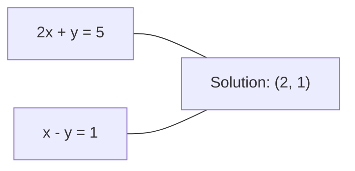
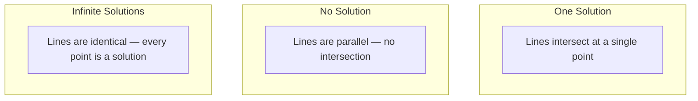

<!-- i18n:manual -->
# Линейные системы

> Решение Ax = b — старейшая задача математики, которая до сих пор крутит вашу нейросеть.

**Type:** Build
**Language:** Python
**Prerequisites:** Phase 1, Lessons 01 (Linear Algebra Intuition), 02 (Vectors & Matrices), 03 (Matrix Transformations)
**Time:** ~120 minutes

## Learning Objectives

- Решать Ax = b методом Гаусса с частичным выбором ведущего элемента и обратной подстановкой
- Раскладывать матрицы через LU, QR и Холецкого и объяснять, когда какое разложение уместно
- Вывести нормальные уравнения для метода наименьших квадратов и связать их с линейной и ridge-регрессией
- Диагностировать плохо обусловленные системы по числу обусловленности и стабилизировать их регуляризацией

> 🎒 **На пальцах.** «Два карандаша и три тетради стоят 100 рублей, три карандаша и одна тетрадь — 80. Сколько стоит карандаш?» Это система линейных уравнений. Вы решали такие в школе. Компьютер решает те же самые, только на миллион неизвестных.

## The Problem

Каждый раз, обучая линейную регрессию, вы решаете линейную систему. Каждый раз, считая приближение методом наименьших квадратов, вы решаете линейную систему. Каждый раз, когда слой нейросети вычисляет `y = Wx + b`, он вычисляет одну сторону линейной системы. Добавляете регуляризацию — меняете систему. Используете гауссовские процессы — раскладываете матрицу. Обращаете ковариационную матрицу для расстояния Махаланобиса — решаете линейную систему.

Уравнение Ax = b встречается повсюду. A — матрица известных коэффициентов. b — вектор известных выходов. x — вектор неизвестных, который вы ищете. В линейной регрессии A — ваша матрица данных, b — вектор целей, x — вектор весов. Вся модель сводится к одному: найти x, при котором Ax как можно ближе к b.

Этот урок строит с нуля все основные методы решения этого уравнения. Вы поймёте, почему одни методы быстрые, а другие устойчивые, почему одни работают только на квадратных системах, а другие тянут переопределённые, и почему число обусловленности вашей матрицы решает, значит ли ваш ответ хоть что-нибудь.

## The Concept

### What Ax = b means geometrically

У системы линейных уравнений есть геометрическое толкование. Каждое уравнение задаёт гиперплоскость. Решение — точка (или множество точек), где все гиперплоскости пересекаются.

```
2x + y = 5          Two lines in 2D.
x - y  = 1          They intersect at x=2, y=1.
```



Возможны три случая:



В матричной форме «одно решение» означает, что A обратима. «Нет решения» — система несовместна. «Бесконечно решений» — у A есть ядро. Большинство задач ML попадают в категорию «точного решения нет», потому что уравнений (точек данных) больше, чем неизвестных (параметров). Тут и вступает метод наименьших квадратов.

> 🎒 **На пальцах.** Две прямые на листе бумаги. Пересеклись в одной точке — одно решение. Идут параллельно — решения нет вообще. Легли друг на друга — решений бесконечно. Всё, третьего не дано, и это верно хоть для двух измерений, хоть для тысячи.

### Column picture vs row picture

Ax = b можно читать двумя способами.

**Row picture.** Каждая строка A задаёт одно уравнение. Каждое уравнение — гиперплоскость. Решение там, где все пересекаются.

**Column picture.** Каждый столбец A — вектор. Вопрос становится другим: какая линейная комбинация столбцов A даёт b?

```
A = | 2  1 |    b = | 5 |
    | 1 -1 |        | 1 |

Row picture: solve 2x + y = 5 and x - y = 1 simultaneously.

Column picture: find x1, x2 such that:
  x1 * [2, 1] + x2 * [1, -1] = [5, 1]
  2 * [2, 1] + 1 * [1, -1] = [4+1, 2-1] = [5, 1]   check.
```

Столбцовая картина фундаментальнее. Если b лежит в пространстве столбцов A, у системы есть решение. Если нет — вы ищете ближайшую точку в этом пространстве. Эта ближайшая точка и есть решение метода наименьших квадратов.

> 🎒 **На пальцах.** Строчная картина: «какая точка удовлетворяет всем условиям сразу?» Столбцовая: «сколько взять от первого ингредиента и сколько от второго, чтобы получилось нужное блюдо?» Второй вопрос ближе к тому, что делает машинное обучение: подобрать веса ингредиентов.

### Gaussian elimination

Метод Гаусса превращает Ax = b в верхнетреугольную систему Ux = c, которую решают обратной подстановкой. Это самый прямой способ.

Алгоритм:

```
1. For each column k (the pivot column):
   a. Find the largest entry in column k at or below row k (partial pivoting).
   b. Swap that row with row k.
   c. For each row i below k:
      - Compute multiplier m = A[i][k] / A[k][k]
      - Subtract m times row k from row i.
2. Back substitute: solve from the last equation upward.
```

Пример:

```
Original:
| 2  1  1 | 8 |       R2 = R2 - (2)R1     | 2  1   1 |  8 |
| 4  3  3 |20 |  -->  R3 = R3 - (1)R1 --> | 0  1   1 |  4 |
| 2  3  1 |12 |                            | 0  2   0 |  4 |

                       R3 = R3 - (2)R2     | 2  1   1 |  8 |
                                       --> | 0  1   1 |  4 |
                                           | 0  0  -2 | -4 |

Back substitute:
  -2 * x3 = -4    -->  x3 = 2
  x2 + 2  = 4     -->  x2 = 2
  2*x1 + 2 + 2 = 8 --> x1 = 2
```

Метод Гаусса стоит O(n^3) операций. Для системы 1000x1000 это около миллиарда операций с плавающей точкой. Быстро, но можно лучше, если надо решать много систем с одной и той же A.

> 🎒 **На пальцах.** Это ровно то, что вы делали в школе: вычитаете одно уравнение из другого, чтобы убрать переменную. Сначала избавляетесь от x во всех уравнениях кроме первого, потом от y, и в последнем уравнении остаётся одна неизвестная. Дальше подставляете обратно снизу вверх.

### Partial pivoting: why it matters

Без выбора ведущего элемента метод Гаусса может упасть или выдать мусор. Если ведущий элемент нулевой, вы делите на ноль. Если маленький — раздуваете ошибки округления.

```
Bad pivot:                       With partial pivoting:
| 0.001  1 | 1.001 |            Swap rows first:
| 1      1 | 2     |            | 1      1 | 2     |
                                 | 0.001  1 | 1.001 |
m = 1/0.001 = 1000              m = 0.001/1 = 0.001
R2 = R2 - 1000*R1               R2 = R2 - 0.001*R1
| 0.001  1     | 1.001   |      | 1      1     | 2     |
| 0     -999   | -999.0  |      | 0      0.999 | 0.999 |

x2 = 1.000 (correct)            x2 = 1.000 (correct)
x1 = (1.001 - 1)/0.001          x1 = (2 - 1)/1 = 1.000 (correct)
   = 0.001/0.001 = 1.000        Stable because the multiplier is small.
```

В арифметике с ограниченной точностью версия без перестановки теряет значащие цифры. Частичный выбор всегда берёт наибольший доступный ведущий элемент, минимизируя усиление ошибки.

> 🎒 **На пальцах.** Деление на маленькое число раздувает всё, включая мусор. Разделите ошибку в 0.0001 на 0.001 — получите 0.1, ошибка выросла в сто раз. Поэтому алгоритм сначала переставляет строки так, чтобы делить на самое большое число из доступных. Одна перестановка спасает весь расчёт.

### LU decomposition

LU-разложение раскладывает A на нижнетреугольную L и верхнетреугольную U: A = LU. Матрица L хранит множители из метода Гаусса. Матрица U — результат исключения.

```
A = L @ U

| 2  1  1 |   | 1  0  0 |   | 2  1   1 |
| 4  3  3 | = | 2  1  0 | @ | 0  1   1 |
| 2  3  1 |   | 1  2  1 |   | 0  0  -2 |
```

Зачем раскладывать, а не просто исключать? Потому что имея L и U, решение Ax = b для любого нового b стоит всего O(n^2):

```
Ax = b
LUx = b
Let y = Ux:
  Ly = b    (forward substitution, O(n^2))
  Ux = y    (back substitution, O(n^2))
```

Затраты O(n^3) платятся один раз при разложении. Каждое последующее решение стоит O(n^2). Если нужно решить 1000 систем с одной A и разными b, LU экономит примерно в 1000/3 раз работы.

С частичным выбором получается PA = LU, где P — матрица перестановок, записывающая обмены строк.

> 🎒 **На пальцах.** Как один раз выучить дорогу до магазина, а потом ходить туда за любым товаром. Тяжёлую работу (разбор матрицы) делаете один раз, а потом каждый новый ответ получаете почти мгновенно.

### QR decomposition

QR-разложение раскладывает A на ортогональную Q и верхнетреугольную R: A = QR.

У ортогональной матрицы есть свойство Q^T Q = I. Её столбцы — ортонормированные векторы. Умножение на Q сохраняет длины и углы.

```
A = Q @ R

Q has orthonormal columns: Q^T Q = I
R is upper triangular

To solve Ax = b:
  QRx = b
  Rx = Q^T b    (just multiply by Q^T, no inversion needed)
  Back substitute to get x.
```

QR численно устойчивее LU при решении задач наименьших квадратов. Процесс Грама-Шмидта строит Q столбец за столбцом:

```
Given columns a1, a2, ... of A:

q1 = a1 / ||a1||

q2 = a2 - (a2 . q1) * q1        (subtract projection onto q1)
q2 = q2 / ||q2||                (normalize)

q3 = a3 - (a3 . q1) * q1 - (a3 . q2) * q2
q3 = q3 / ||q3||

R[i][j] = qi . aj    for i <= j
```

Каждый шаг убирает составляющую вдоль всех предыдущих векторов q, оставляя только новое ортогональное направление.

> 🎒 **На пальцах.** Обратите внимание на строчку `Rx = Q^T b`. Обычно чтобы «отменить» матрицу, её надо обращать — долго и рискованно. А ортогональную матрицу отменяют простым транспонированием, то есть перестановкой строк со столбцами. Бесплатно. Ради этого свойства QR и придумали.

### Cholesky decomposition

Когда A симметрична (A = A^T) и положительно определена (все собственные значения положительны), её можно разложить как A = L L^T, где L нижнетреугольная. Это разложение Холецкого.

```
A = L @ L^T

| 4  2 |   | 2  0 |   | 2  1 |
| 2  5 | = | 1  2 | @ | 0  2 |

L[i][i] = sqrt(A[i][i] - sum(L[i][k]^2 for k < i))
L[i][j] = (A[i][j] - sum(L[i][k]*L[j][k] for k < j)) / L[j][j]    for i > j
```

Холецкий вдвое быстрее LU и требует вдвое меньше памяти. Он работает только для симметричных положительно определённых матриц, но такие встречаются постоянно:

- Ковариационные матрицы симметричны и положительно полуопределены (положительно определены с регуляризацией).
- Матрица ядра в гауссовских процессах симметрична и положительно определена.
- Гессиан выпуклой функции в минимуме симметричен и положительно определён.
- A^T A всегда симметрична и положительно полуопределена.

В гауссовских процессах матрицу ядра K раскладывают Холецким, затем решают K alpha = y, получая предсказательное среднее. Множитель Холецкого заодно даёт логарифм определителя для маргинального правдоподобия: log det(K) = 2 * sum(log(diag(L))).

> 🎒 **На пальцах.** Холецкий — это «квадратный корень из матрицы». Как для числа 9 корень равен 3, потому что 3 × 3 = 9, так для матрицы A находят L, что L × L^T = A. Симметрия матрицы означает, что половину работы можно не делать — отсюда и двукратная экономия.

### Least squares: when Ax = b has no exact solution

Если A имеет размер m x n с m > n (уравнений больше, чем неизвестных), система переопределена. Точного решения нет. Вместо этого минимизируют квадратичную ошибку:

```
minimize ||Ax - b||^2

This is the sum of squared residuals:
  sum((A[i,:] @ x - b[i])^2 for i in range(m))
```

Минимум удовлетворяет нормальным уравнениям:

```
A^T A x = A^T b
```

Вывод: раскройте ||Ax - b||^2 = (Ax - b)^T (Ax - b) = x^T A^T A x - 2 x^T A^T b + b^T b. Возьмите градиент по x и приравняйте нулю: 2 A^T A x - 2 A^T b = 0.

```
Original system (overdetermined, 4 equations, 2 unknowns):
| 1  1 |         | 3 |
| 1  2 | x     = | 5 |       No exact x satisfies all 4 equations.
| 1  3 |         | 6 |
| 1  4 |         | 8 |

Normal equations:
A^T A = | 4  10 |    A^T b = | 22 |
        | 10 30 |            | 63 |

Solve: x = [1.5, 1.6]

This is linear regression. x[0] is the intercept, x[1] is the slope.
```

> 🎒 **На пальцах.** Это про облако точек на графике и прямую, которую через него проводят. Через 4 точки одна прямая обычно не проходит — но можно провести такую, чтобы суммарный промах был минимален. Это и есть метод наименьших квадратов, и это же — вся линейная регрессия.

### Normal equations = linear regression

Связь точная. В линейной регрессии матрица данных X имеет по строке на пример и по столбцу на признак. Вектор целей y — по значению на пример. Вектор весов w удовлетворяет:

```
X^T X w = X^T y
w = (X^T X)^(-1) X^T y
```

Это решение линейной регрессии в замкнутой форме. Каждый вызов `sklearn.linear_model.LinearRegression.fit()` вычисляет именно это (или эквивалент через QR или SVD).

Добавьте слагаемое регуляризации lambda * I к матрице — получите ridge-регрессию:

```
(X^T X + lambda * I) w = X^T y
w = (X^T X + lambda * I)^(-1) X^T y
```

Регуляризация улучшает обусловленность матрицы (её легче точно обратить) и предотвращает переобучение, ужимая веса к нулю. Матрица X^T X + lambda * I всегда симметрична и положительно определена при lambda > 0, поэтому её можно решать Холецким.

### Pseudoinverse (Moore-Penrose)

Псевдообратная A+ обобщает обращение матриц на неквадратные и вырожденные. Для любой A:

```
x = A+ b

where A+ = V Sigma+ U^T    (computed via SVD)
```

Sigma+ получается взятием обратной величины каждого ненулевого сингулярного числа и транспонированием результата. Если A = U Sigma V^T, то A+ = V Sigma+ U^T.

```
A = U Sigma V^T        (SVD)

Sigma = | 5  0 |       Sigma+ = | 1/5  0  0 |
        | 0  2 |                | 0  1/2  0 |
        | 0  0 |

A+ = V Sigma+ U^T
```

Псевдообратная даёт решение наименьших квадратов с минимальной нормой. Если у системы:
- Одно решение: A+ b даёт его.
- Решений нет: A+ b даёт решение наименьших квадратов.
- Решений бесконечно: A+ b даёт то, у которого ||x|| наименьшая.

`np.linalg.lstsq` и `np.linalg.pinv` из NumPy внутри используют SVD.

### Condition number

Число обусловленности измеряет, насколько решение чувствительно к малым изменениям входа. Для матрицы A:

```
kappa(A) = ||A|| * ||A^(-1)|| = sigma_max / sigma_min
```

где sigma_max и sigma_min — наибольшее и наименьшее сингулярные числа.

```
Well-conditioned (kappa ~ 1):        Ill-conditioned (kappa ~ 10^15):
Small change in b -->                Small change in b -->
small change in x                    huge change in x

| 2  0 |   kappa = 2/1 = 2          | 1   1          |   kappa ~ 10^15
| 0  1 |   safe to solve            | 1   1+10^(-15) |   solution is garbage
```

Практические ориентиры:
- kappa < 100: безопасно, решение точное.
- kappa ~ 10^k: вы теряете около k знаков точности вашей арифметики.
- kappa ~ 10^16 (для float64): решение бессмысленно. Матрица фактически вырождена.

В ML плохая обусловленность возникает, когда признаки почти коллинеарны. Регуляризация (добавление lambda * I) улучшает число обусловленности с sigma_max / sigma_min до (sigma_max + lambda) / (sigma_min + lambda).

> 🎒 **На пальцах.** Плохо обусловленная система — это как определить точку пересечения двух почти параллельных прямых. Сдвиньте одну на волосок — точка пересечения улетит на километр. Ответ формально есть, но доверять ему нельзя. Число обусловленности как раз и меряет «насколько прямые параллельны».

### Iterative methods: conjugate gradient

Для очень больших разреженных систем (миллионы неизвестных) прямые методы вроде LU или Холецкого слишком дороги. Итеративные методы приближают решение, улучшая догадку за много итераций.

Метод сопряжённых градиентов (CG) решает Ax = b, когда A симметрична и положительно определена. Он находит точное решение не более чем за n итераций (в точной арифметике), но обычно сходится куда быстрее, если собственные значения A сгруппированы.

```
Algorithm sketch:
  x0 = initial guess (often zero)
  r0 = b - A x0           (residual)
  p0 = r0                 (search direction)

  For k = 0, 1, 2, ...:
    alpha = (rk . rk) / (pk . A pk)
    x_{k+1} = xk + alpha * pk
    r_{k+1} = rk - alpha * A pk
    beta = (r_{k+1} . r_{k+1}) / (rk . rk)
    p_{k+1} = r_{k+1} + beta * pk
    if ||r_{k+1}|| < tolerance: stop
```

CG используют в:
- Крупномасштабной оптимизации (метод Ньютона-CG)
- Решении дискретизаций уравнений в частных производных
- Ядровых методах, где матрица ядра слишком велика для разложения
- Предобуславливании других итеративных решателей

Скорость сходимости зависит от числа обусловленности. Лучше обусловленные системы сходятся быстрее — ещё одна причина, почему регуляризация помогает.

### The full picture: which method when

| Method | Requirements | Cost | Use case |
|--------|-------------|------|----------|
| Метод Гаусса | Квадратная невырожденная A | O(n^3) | Разовое решение квадратной системы |
| LU-разложение | Квадратная невырожденная A | O(n^3) разложение + O(n^2) решение | Много решений с одной A |
| QR-разложение | Любая A (m >= n) | O(mn^2) | Наименьшие квадраты, численно устойчиво |
| Холецкий | Симметричная положительно определённая A | O(n^3/3) | Ковариационные матрицы, гауссовские процессы, ridge-регрессия |
| Нормальные уравнения | Переопределённая (m > n) | O(mn^2 + n^3) | Линейная регрессия (малое n) |
| SVD / псевдообратная | Любая A | O(mn^2) | Системы неполного ранга, решения с минимальной нормой |
| Сопряжённые градиенты | Симметричная положительно определённая, разреженная A | O(n * k * nnz) | Большие разреженные системы, k = число итераций |

### Connection to ML

Каждый метод этого урока встречается в продакшн-ML:

**Linear regression.** Решение в замкнутой форме решает нормальные уравнения X^T X w = X^T y. Делается это через Холецкого (если n мало), QR (если важна численная устойчивость) или SVD (если матрица может быть неполного ранга).

**Ridge regression.** Добавляет lambda * I к X^T X. Регуляризованная система (X^T X + lambda * I) w = X^T y всегда решается Холецким, потому что X^T X + lambda * I симметрична и положительно определена при lambda > 0.

**Gaussian processes.** Предсказательное среднее требует решить K alpha = y, где K — матрица ядра. Стандартный подход — разложение Холецкого для K. Логарифм маргинального правдоподобия использует log det(K) = 2 sum(log(diag(L))).

**Neural network initialization.** Ортогональная инициализация использует QR-разложение для создания матриц весов с ортонормированными столбцами. Это предотвращает схлопывание сигнала в глубоких сетях.

**Preconditioning.** Крупномасштабные оптимизаторы используют неполное разложение Холецкого или LU как предобуславливатели для решателей на сопряжённых градиентах.

**Feature engineering.** Число обусловленности X^T X говорит, коллинеарны ли ваши признаки. Если kappa велико — выбрасывайте признаки или добавляйте регуляризацию.

```figure
linear-system-conditioning
```

## Build It

### Step 1: Gaussian elimination with partial pivoting

```python
import numpy as np

def gaussian_elimination(A, b):
    n = len(b)
    Ab = np.hstack([A.astype(float), b.reshape(-1, 1).astype(float)])

    for k in range(n):
        max_row = k + np.argmax(np.abs(Ab[k:, k]))
        Ab[[k, max_row]] = Ab[[max_row, k]]

        if abs(Ab[k, k]) < 1e-12:
            raise ValueError(f"Matrix is singular or nearly singular at pivot {k}")

        for i in range(k + 1, n):
            m = Ab[i, k] / Ab[k, k]
            Ab[i, k:] -= m * Ab[k, k:]

    x = np.zeros(n)
    for i in range(n - 1, -1, -1):
        x[i] = (Ab[i, -1] - Ab[i, i+1:n] @ x[i+1:n]) / Ab[i, i]

    return x
```

### Step 2: LU decomposition

```python
def lu_decompose(A):
    n = A.shape[0]
    L = np.eye(n)
    U = A.astype(float).copy()
    P = np.eye(n)

    for k in range(n):
        max_row = k + np.argmax(np.abs(U[k:, k]))
        if max_row != k:
            U[[k, max_row]] = U[[max_row, k]]
            P[[k, max_row]] = P[[max_row, k]]
            if k > 0:
                L[[k, max_row], :k] = L[[max_row, k], :k]

        for i in range(k + 1, n):
            L[i, k] = U[i, k] / U[k, k]
            U[i, k:] -= L[i, k] * U[k, k:]

    return P, L, U

def lu_solve(P, L, U, b):
    n = len(b)
    Pb = P @ b.astype(float)

    y = np.zeros(n)
    for i in range(n):
        y[i] = Pb[i] - L[i, :i] @ y[:i]

    x = np.zeros(n)
    for i in range(n - 1, -1, -1):
        x[i] = (y[i] - U[i, i+1:] @ x[i+1:]) / U[i, i]

    return x
```

### Step 3: Cholesky decomposition

```python
def cholesky(A):
    n = A.shape[0]
    L = np.zeros_like(A, dtype=float)

    for i in range(n):
        for j in range(i + 1):
            s = A[i, j] - L[i, :j] @ L[j, :j]
            if i == j:
                if s <= 0:
                    raise ValueError("Matrix is not positive definite")
                L[i, j] = np.sqrt(s)
            else:
                L[i, j] = s / L[j, j]

    return L
```

> 🎒 **На пальцах.** Заметьте строчку `if s <= 0: raise`. Под корнем оказалось отрицательное число — значит матрица не положительно определена, и Холецкий тут не применим. Алгоритм честно падает вместо того, чтобы выдать комплексные числа. Это не баг, а встроенная проверка условий.

### Step 4: Least squares via normal equations

```python
def least_squares_normal(A, b):
    AtA = A.T @ A
    Atb = A.T @ b
    return gaussian_elimination(AtA, Atb)

def ridge_regression(A, b, lam):
    n = A.shape[1]
    AtA = A.T @ A + lam * np.eye(n)
    Atb = A.T @ b
    L = cholesky(AtA)
    y = np.zeros(n)
    for i in range(n):
        y[i] = (Atb[i] - L[i, :i] @ y[:i]) / L[i, i]
    x = np.zeros(n)
    for i in range(n - 1, -1, -1):
        x[i] = (y[i] - L.T[i, i+1:] @ x[i+1:]) / L.T[i, i]
    return x
```

### Step 5: Condition number

```python
def condition_number(A):
    U, S, Vt = np.linalg.svd(A)
    return S[0] / S[-1]
```

## Use It

Собираем всё вместе для линейной и ridge-регрессии на реальных данных:

```python
np.random.seed(42)
X_raw = np.random.randn(100, 3)
w_true = np.array([2.0, -1.0, 0.5])
y = X_raw @ w_true + np.random.randn(100) * 0.1

X = np.column_stack([np.ones(100), X_raw])

w_ols = least_squares_normal(X, y)
print(f"OLS weights (ours):    {w_ols}")

w_np = np.linalg.lstsq(X, y, rcond=None)[0]
print(f"OLS weights (numpy):   {w_np}")
print(f"Max difference: {np.max(np.abs(w_ols - w_np)):.2e}")

w_ridge = ridge_regression(X, y, lam=1.0)
print(f"Ridge weights (ours):  {w_ridge}")

from sklearn.linear_model import Ridge
ridge_sk = Ridge(alpha=1.0, fit_intercept=False)
ridge_sk.fit(X, y)
print(f"Ridge weights (sklearn): {ridge_sk.coef_}")
```

> 🎒 **На пальцах.** Настоящие веса заданы в коде: [2.0, -1.0, 0.5]. Ваш решатель должен вернуть примерно эти числа — модель восстановит их из зашумлённых данных. А вот ridge-веса выйдут чуть меньше по модулю: регуляризация специально ужимает их к нулю. Увидите это на своих числах.

## Ship It

Этот урок производит:
- `code/linear_systems.py` с реализациями метода Гаусса, LU-разложения, разложения Холецкого, наименьших квадратов и ridge-регрессии с нуля
- Рабочую демонстрацию того, что нормальные уравнения и LinearRegression из sklearn дают одинаковые веса

## Exercises

1. Решите систему `[[1,2,3],[4,5,6],[7,8,10]] x = [6, 15, 27]` своим методом Гаусса, своим LU-решателем и через `np.linalg.solve`. Убедитесь, что все три дают одинаковый ответ в пределах точности с плавающей точкой.

2. Сгенерируйте случайную матрицу X размера 50x5 и цель y = X @ w_true + шум. Решите для w через нормальные уравнения, QR (`np.linalg.qr`), SVD (`np.linalg.svd`) и `np.linalg.lstsq`. Сравните все четыре решения. Измерьте число обусловленности X^T X и объясните, как оно влияет на то, какому методу верить.

3. Создайте почти вырожденную матрицу, сделав два столбца почти одинаковыми (например, столбец 2 = столбец 1 + 1e-10 * шум). Вычислите её число обусловленности. Решите Ax = b с регуляризацией и без (добавьте 0.01 * I). Сравните решения и невязки. Объясните, почему регуляризация помогает.

4. Реализуйте метод сопряжённых градиентов для случайной симметричной положительно определённой матрицы 100x100. Посчитайте, за сколько итераций он сходится к точности 1e-8. Сравните с теоретическим максимумом в n итераций.

5. Замерьте время своего решателя Холецкого против LU и против `np.linalg.solve` на симметричных положительно определённых матрицах размера 10, 50, 200, 500. Нарисуйте результаты. Убедитесь, что Холецкий примерно вдвое быстрее LU.

> 🎒 **На пальцах.** Третье задание — самое поучительное. Вы своими глазами увидите, как без регуляризации веса улетают в тысячи, а с регуляризацией остаются нормальными, причём предсказания в обоих случаях почти одинаковые. Это и есть ответ на вопрос «зачем нужна регуляризация» в одном эксперименте.

## Key Terms

| Term | What people say | What it actually means |
|------|----------------|----------------------|
| Linear system | «Решить относительно x» | Набор линейных уравнений Ax = b. Найти x — значит найти вход, дающий выход b под преобразованием A. |
| Gaussian elimination | «Привести к ступенчатому виду» | Систематически обнулить элементы под диагональю операциями со строками, получив верхнетреугольную систему, решаемую обратной подстановкой. O(n^3). |
| Partial pivoting | «Переставить строки ради устойчивости» | Перед исключением в столбце k переставить строку с наибольшим модулем в этом столбце на позицию ведущей. Не даёт делить на маленькие числа. |
| LU decomposition | «Разложить на треугольники» | Записать A = LU, где L нижнетреугольная (хранит множители), U верхнетреугольная (результат исключения). Размазывает стоимость O(n^3) по многим решениям. |
| QR decomposition | «Ортогональное разложение» | Записать A = QR, где у Q ортонормированные столбцы, а R верхнетреугольная. Устойчивее LU для наименьших квадратов. |
| Cholesky decomposition | «Квадратный корень из матрицы» | Для симметричной положительно определённой A записать A = LL^T. Вдвое дешевле LU. Для ковариационных матриц, матриц ядра и ridge-регрессии. |
| Least squares | «Лучшее приближение, когда точного нет» | Минимизировать сумму квадратов невязок ||Ax - b||^2, когда система переопределена (уравнений больше, чем неизвестных). |
| Normal equations | «Сокращённый путь через производную» | A^T A x = A^T b. Приравнивание градиента ||Ax - b||^2 нулю. Это И ЕСТЬ решение линейной регрессии в замкнутой форме. |
| Pseudoinverse | «Обращение для неквадратных матриц» | A+ = V Sigma+ U^T через SVD. Даёт решение наименьших квадратов с минимальной нормой для любой матрицы, квадратной или нет, вырожденной или нет. |
| Condition number | «Насколько можно верить ответу» | kappa = sigma_max / sigma_min. Меряет чувствительность к возмущениям входа. Теряется около log10(kappa) знаков точности. |
| Ridge regression | «Регуляризованные наименьшие квадраты» | Решить (X^T X + lambda I) w = X^T y. Добавление lambda I улучшает обусловленность и ужимает веса к нулю. Предотвращает переобучение. |
| Conjugate gradient | «Итеративное Ax=b для больших матриц» | Итеративный решатель для симметричных положительно определённых систем. Сходится не более чем за n шагов. Практичен для больших разреженных систем, где разложение слишком дорого. |
| Overdetermined system | «Данных больше, чем параметров» | m > n в системе m на n. Точного решения не существует. Наименьшие квадраты дают лучшее приближение. Это любая задача регрессии. |
| Back substitution | «Решать снизу вверх» | Для верхнетреугольной системы решить последнее уравнение первым, затем подставлять назад. O(n^2). |
| Forward substitution | «Решать сверху вниз» | Для нижнетреугольной системы решить первое уравнение первым, затем подставлять вперёд. O(n^2). Используется на шаге L при решении через LU. |

## Further Reading

- [MIT 18.06: Linear Algebra](https://ocw.mit.edu/courses/18-06-linear-algebra-spring-2010/) (Gilbert Strang) -- канонический курс по линейным системам и матричным разложениям
- [Numerical Linear Algebra](https://people.maths.ox.ac.uk/trefethen/text.html) (Trefethen & Bau) -- стандартный справочник для понимания численной устойчивости, обусловленности и причин отказа алгоритмов
- [Matrix Computations](https://www.cs.cornell.edu/cv/GolubVanLoan4/golubandvanloan.htm) (Golub & Van Loan) -- энциклопедический справочник по всем матричным алгоритмам
- [3Blue1Brown: Inverse Matrices](https://www.3blue1brown.com/lessons/inverse-matrices) -- визуальная интуиция того, что геометрически означает решение Ax = b
