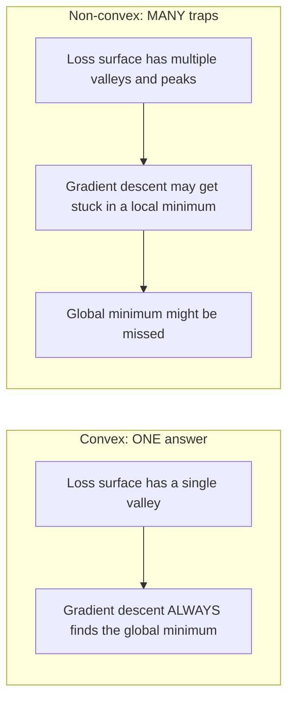
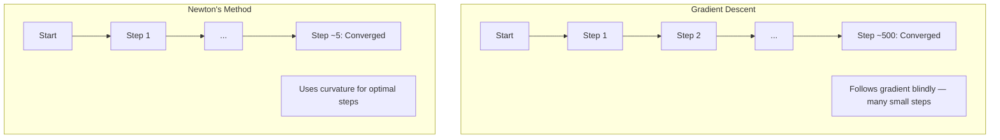
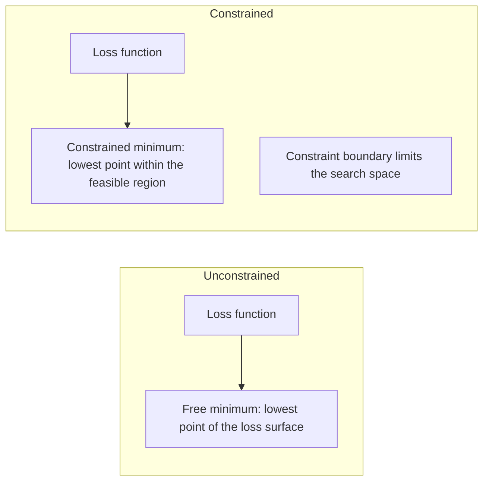
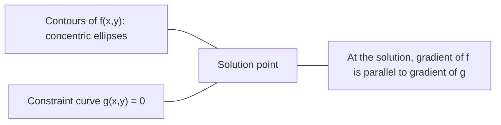

<!-- i18n:manual -->
# Выпуклая оптимизация

> У выпуклых задач одна долина. У нейросетей их миллионы. Разницу важно понимать.

**Type:** Build
**Language:** Python
**Prerequisites:** Phase 1, Lessons 04 (Calculus for ML), 08 (Optimization)
**Time:** ~90 minutes

## Learning Objectives

- Проверять выпуклость функции по определению, по второй производной и по гессиану
- Реализовать метод Ньютона и сравнить его квадратичную сходимость с градиентным спуском
- Решать задачи оптимизации с ограничениями через множители Лагранжа и толковать условия KKT
- Объяснить, почему ландшафты потерь нейросетей невыпуклы, а SGD всё равно находит хорошие решения

> 🎒 **На пальцах.** Выпуклая функция — это миска. Куда шарик ни положи, он скатится в одну и ту же точку. Невыпуклая — горная гряда с кучей ям. Весь урок про то, как отличить одно от другого и что с этим делать.

## The Problem

Урок 08 научил вас градиентному спуску, моменту и Adam. Эти оптимизаторы идут вниз по любой поверхности. Но без гарантий. Градиентный спуск на невыпуклом ландшафте может застрять в плохом локальном минимуме, залипнуть в седловой точке или колебаться вечно. Вы всё равно им пользовались, потому что нейросети невыпуклы и альтернативы нет.

Но многие задачи машинного обучения выпуклы. Линейная регрессия, логистическая регрессия, SVM, LASSO, ridge-регрессия. Для них есть кое-что посильнее: оптимизация с математическими гарантиями. У выпуклой задачи ровно одна долина. Любой алгоритм, идущий вниз, дойдёт до глобального минимума. Никаких перезапусков. Никаких расписаний learning rate. Никаких молитв.

Понимание выпуклости даёт три вещи. Во-первых, оно говорит, когда задача лёгкая (выпуклая), а когда трудная (невыпуклая). Во-вторых, даёт более быстрые инструменты вроде метода Ньютона для выпуклых задач. В-третьих, объясняет понятия, встречающиеся во всём ML: регуляризация как ограничение, двойственность в SVM и почему глубокое обучение работает, нарушая все хорошие свойства, которые даёт выпуклость.

## The Concept

### Convex sets

Множество S выпукло, если для любых двух точек из S отрезок между ними тоже целиком лежит в S.

| Convex sets | Not convex |
|---|---|
| **Rectangle**: любые две внутренние точки соединяются отрезком, не выходящим наружу | **Star/crescent shape**: отрезок между двумя внутренними точками может выйти за пределы фигуры |
| **Triangle**: то же свойство верно для всех внутренних точек | **Donut/annulus**: из-за дырки часть отрезков покидает множество |
| Отрезок между любыми двумя точками остаётся внутри множества | Отрезок между некоторыми парами точек выходит наружу |

Формальная проверка: для любых точек x, y из S и любого t в [0, 1] точка tx + (1-t)y тоже принадлежит S.

Примеры выпуклых множеств:
- Прямая, плоскость, всё R^n
- Шар (круг, сфера, гиперсфера)
- Полупространство: {x : a^T x <= b}
- Пересечение любого числа выпуклых множеств

Примеры невыпуклых множеств:
- Бублик (кольцо)
- Объединение двух непересекающихся кругов
- Любое множество с «вмятиной» или «дыркой»

> 🎒 **На пальцах.** Проверка на выпуклость простая: возьмите две точки внутри фигуры и натяните между ними нитку. Если нитка нигде не вышла наружу — фигура выпукла. Круг проходит проверку. Бублик — нет: нитка через дырку идёт по воздуху.

### Convex functions

Функция f выпукла, если её область определения — выпуклое множество и для любых двух точек x, y из области и любого t в [0, 1]:

```
f(tx + (1-t)y) <= t*f(x) + (1-t)*f(y)
```

Геометрически: отрезок между любыми двумя точками графика лежит выше графика или на нём.

| Property | Convex function | Non-convex function |
|---|---|---|
| **Line segment test** | Прямая между любыми двумя точками графика лежит **выше или на** кривой | Прямая между некоторыми точками уходит **ниже** кривой |
| **Shape** | Одна миска, изогнутая вверх | Несколько вершин и впадин со смешанной кривизной |
| **Local minima** | Каждый локальный минимум является глобальным | Может быть несколько локальных минимумов разной глубины |

Частые выпуклые функции:
- f(x) = x^2 (парабола)
- f(x) = |x| (модуль)
- f(x) = e^x (экспонента)
- f(x) = max(0, x) (ReLU, хотя и кусочно-линейная)
- f(x) = -log(x) для x > 0 (минус логарифм)
- Любая линейная функция f(x) = a^T x + b (и выпуклая, и вогнутая одновременно)

> 🎒 **На пальцах.** Проверка ещё проще: натяните нитку между двумя точками на графике. Если нитка везде выше графика — функция выпукла. У параболы так и есть, попробуйте нарисовать. У синусоиды нитка местами проваливается под кривую — значит невыпукла.

### Testing for convexity

Три практических способа, от простого к строгому.

**Test 1: Second derivative test (1D).** Если f''(x) >= 0 для всех x, функция выпукла.

- f(x) = x^2: f''(x) = 2 >= 0. Выпукла.
- f(x) = x^3: f''(x) = 6x. Отрицательна при x < 0. Не выпукла.
- f(x) = e^x: f''(x) = e^x > 0. Выпукла.

**Test 2: Hessian test (multivariate).** Если матрица Гессе H(x) положительно полуопределена при всех x, функция выпукла. Гессиан — матрица вторых частных производных.

**Test 3: Definition test.** Проверять неравенство f(tx + (1-t)y) <= t*f(x) + (1-t)*f(y) напрямую. Полезно, когда производные считать трудно.

### Why convexity matters

Центральная теорема выпуклой оптимизации:

**Для выпуклой функции каждый локальный минимум является глобальным.**

Значит градиентный спуск не может застрять. Любой путь вниз приводит к тому же ответу. Алгоритм гарантированно сходится к оптимальному решению.



Следствия:
- Не нужны случайные перезапуски
- Не нужны хитрые расписания learning rate
- Возможны доказательства сходимости (скорость зависит от свойств функции)
- Решение единственно (с точностью до плоских участков)

### Convex vs non-convex in ML

| Problem | Convex? | Why |
|---------|---------|-----|
| Линейная регрессия (MSE) | Да | Потери квадратичны по весам |
| Логистическая регрессия | Да | Log-loss выпукла по весам |
| SVM (hinge loss) | Да | Максимум линейных функций |
| LASSO (L1-регрессия) | Да | Сумма выпуклых функций выпукла |
| Ridge-регрессия (L2) | Да | Квадратичная + квадратичная = выпуклая |
| Нейросеть (любые потери) | Нет | Нелинейные активации делают ландшафт невыпуклым |
| k-means кластеризация | Нет | Дискретный шаг назначения |
| Матричная факторизация | Нет | Произведение неизвестных |

Линейные модели с выпуклыми потерями выпуклы. Как только вы добавляете скрытые слои с нелинейными активациями, выпуклость ломается.

> 🎒 **На пальцах.** Простое правило: пока модель — это прямая линия (или плоскость), задача выпуклая и решается надёжно. Как только появляется слой нелинейности, гарантий больше нет. Вся разница между «классическим ML» и «глубоким обучением» помещается в эту таблицу.

### The Hessian matrix

Гессиан H функции f: R^n -> R — матрица n x n вторых частных производных.

```
H[i][j] = d^2 f / (dx_i dx_j)
```

Для f(x, y) = x^2 + 3xy + y^2:

```
df/dx = 2x + 3y       d^2f/dx^2 = 2      d^2f/dxdy = 3
df/dy = 3x + 2y       d^2f/dydx = 3      d^2f/dy^2 = 2

H = [ 2  3 ]
    [ 3  2 ]
```

Гессиан говорит о кривизне:
- Все собственные значения положительны: функция изогнута вверх во всех направлениях (выпукла в этой точке)
- Все отрицательны: изогнута вниз во всех направлениях (вогнута, локальный максимум)
- Смешанные знаки: седловая точка (вверх в одних направлениях, вниз в других)
- Нулевое собственное значение: плоско в этом направлении (вырождение)

Для выпуклости гессиан должен быть положительно полуопределён (все собственные значения >= 0) везде, а не в одной точке.

### Newton's method

Градиентный спуск использует информацию первого порядка (градиент). Метод Ньютона — второго (гессиан). Он подгоняет квадратичное приближение в текущей точке и прыгает сразу в минимум этой параболы.

```
Update rule:
  x_new = x - H^(-1) * gradient

Compare to gradient descent:
  x_new = x - lr * gradient
```

Метод Ньютона заменяет скалярный learning rate обратным гессианом. Это автоматически подстраивает размер и направление шага под локальную кривизну.



Преимущества:
- Квадратичная сходимость вблизи минимума (ошибка возводится в квадрат каждый шаг)
- Нет learning rate для настройки
- Инвариантность к масштабу (работает независимо от параметризации задачи)

Недостатки:
- Вычисление гессиана стоит O(n^2) памяти и O(n^3) на обращение
- Для нейросети с миллионом весов это 10^12 элементов и 10^18 операций
- Непрактично для глубокого обучения

> 🎒 **На пальцах.** Градиентный спуск щупает склон ногой и делает шажок. Метод Ньютона видит форму всей ямы и прыгает сразу на дно. Прыжок точнее, но чтобы увидеть форму ямы, нужны вторые производные — а их для миллиона параметров считать невозможно. Отсюда и весь компромисс.

### Constrained optimization

Оптимизация без ограничений: минимизировать f(x) по всем x.
Оптимизация с ограничениями: минимизировать f(x) при выполнении ограничений.

У реальных задач есть ограничения. Вы хотите минимизировать затраты, но бюджет ограничен. Хотите минимизировать ошибку, но сложность модели ограничена.



### Lagrange multipliers

Метод множителей Лагранжа превращает задачу с ограничениями в задачу без них.

Задача: минимизировать f(x) при условии g(x) = 0.

Решение: ввести новую переменную (множитель Лагранжа lambda) и решить задачу без ограничений:

```
L(x, lambda) = f(x) + lambda * g(x)
```

В решении градиент L равен нулю:

```
dL/dx = df/dx + lambda * dg/dx = 0
dL/dlambda = g(x) = 0
```

Геометрическая интуиция: в минимуме с ограничением градиент f должен быть параллелен градиенту ограничения g. Если бы они не были параллельны, можно было бы сдвинуться вдоль поверхности ограничения и ещё уменьшить f.



Пример: минимизировать f(x,y) = x^2 + y^2 при условии x + y = 1.

```
L = x^2 + y^2 + lambda(x + y - 1)

dL/dx = 2x + lambda = 0  =>  x = -lambda/2
dL/dy = 2y + lambda = 0  =>  y = -lambda/2
dL/dlambda = x + y - 1 = 0

From first two: x = y
Substituting: 2x = 1, so x = y = 0.5, lambda = -1
```

Ближайшая к началу координат точка на прямой x + y = 1 — это (0.5, 0.5).

> 🎒 **На пальцах.** Это задача «до какого места на заборе от меня ближе всего». Ответ: до точки, где перпендикуляр от вас упирается в забор. «Градиенты параллельны» — это и есть математическая запись слова «перпендикулярно забору». В примере ответ (0.5, 0.5) — ровно середина, что видно и без формул.

### KKT conditions

Условия Каруша-Куна-Таккера расширяют множители Лагранжа на ограничения-неравенства.

Задача: минимизировать f(x) при g_i(x) <= 0 для i = 1, ..., m.

Условия KKT (необходимые для оптимальности):

```
1. Stationarity:    df/dx + sum(lambda_i * dg_i/dx) = 0
2. Primal feasibility:  g_i(x) <= 0  for all i
3. Dual feasibility:    lambda_i >= 0  for all i
4. Complementary slackness:  lambda_i * g_i(x) = 0  for all i
```

Дополняющая нежёсткость — ключевая мысль: либо ограничение активно (g_i = 0, решение сидит на границе), либо множитель равен нулю (ограничение ни на что не влияет). Ограничение, не влияющее на решение, имеет lambda = 0.

Условия KKT центральны для SVM. Опорные векторы — это те точки данных, где ограничение активно (lambda > 0). У всех остальных точек lambda = 0, и на границу решения они не влияют.

> 🎒 **На пальцах.** Дополняющая нежёсткость по-человечески: либо вы упёрлись в бюджет (тогда бюджет важен), либо не потратили всё (тогда бюджет вообще не имел значения). Одновременно и упереться, и не упереться нельзя. Именно поэтому в SVM границу определяют только несколько точек у самого края — остальные «не упёрлись» и не влияют ни на что.

### Regularization as constrained optimization

Регуляризации L1 и L2 — не произвольные трюки. Это замаскированные задачи оптимизации с ограничениями.

**L2 regularization (Ridge):**

```
minimize  Loss(w)  subject to  ||w||^2 <= t

Equivalent unconstrained form:
minimize  Loss(w) + lambda * ||w||^2
```

Ограничение ||w||^2 <= t задаёт шар (круг в 2D, сферу в 3D). Решение там, где линии уровня потерь впервые касаются этого шара.

**L1 regularization (LASSO):**

```
minimize  Loss(w)  subject to  ||w||_1 <= t

Equivalent unconstrained form:
minimize  Loss(w) + lambda * ||w||_1
```

Ограничение ||w||_1 <= t задаёт ромб (повёрнутый квадрат в 2D).

| Property | L2 constraint (circle) | L1 constraint (diamond) |
|---|---|---|
| **Constraint shape** | Круг (сфера в высоких размерностях) | Ромб (повёрнутый квадрат в 2D) |
| **Where loss contour touches** | Гладкая граница — любая точка окружности | Угол — выровненный с осью |
| **Solution behavior** | Веса маленькие, но ненулевые | Часть весов ровно нулевые (разреженность) |
| **Result** | Сжатие весов | Отбор признаков |

Это объясняет, почему L1 даёт разреженные модели (отбор признаков), а L2 только ужимает веса. У ромба углы выровнены с осями. Линии уровня потерь с большей вероятностью коснутся угла, обнулив один или несколько весов ровно в ноль.

### Duality

У каждой задачи оптимизации с ограничениями (прямой) есть задача-спутник (двойственная). Для выпуклых задач у прямой и двойственной одинаковое оптимальное значение. Это сильная двойственность.

Двойственная функция Лагранжа:

```
Primal: minimize f(x) subject to g(x) <= 0
Lagrangian: L(x, lambda) = f(x) + lambda * g(x)
Dual function: d(lambda) = min_x L(x, lambda)
Dual problem: maximize d(lambda) subject to lambda >= 0
```

Зачем нужна двойственность:
- Двойственную задачу иногда решить проще, чем прямую
- SVM решают в двойственной форме, где задача зависит от скалярных произведений между точками данных (это и открывает дорогу kernel trick)
- Двойственная даёт нижнюю границу прямого оптимума, полезно для проверки качества решения

Конкретно для SVM:

```
Primal: find w, b that maximize the margin 2/||w|| subject to
        y_i(w^T x_i + b) >= 1 for all i

Dual:   maximize sum(alpha_i) - 0.5 * sum_ij(alpha_i * alpha_j * y_i * y_j * x_i^T x_j)
        subject to alpha_i >= 0 and sum(alpha_i * y_i) = 0

The dual only involves dot products x_i^T x_j.
Replace x_i^T x_j with K(x_i, x_j) to get the kernel trick.
```

> 🎒 **На пальцах.** Двойственность — как задача «максимально дёшево купить» и парная к ней «максимально дорого продать». Ответы сходятся в одной цене. Практическая польза в том, что одну из двух формулировок часто решать сильно проще. У SVM двойственная зависит только от попарных скалярных произведений — и это позволяет подменить их ядром, не заходя в многомерное пространство.

### Why deep learning works despite non-convexity

Функции потерь нейросетей дико невыпуклы. По всем классическим меркам их оптимизация должна проваливаться. Однако стохастический градиентный спуск надёжно находит хорошие решения. Это объясняют несколько факторов.

**Most local minima are good enough.** В многомерных пространствах случайные критические точки (где градиент равен нулю) в подавляющем большинстве оказываются седловыми, а не локальными минимумами. Те немногие локальные минимумы, что есть, обычно имеют потери близко к глобальному минимуму. Застрять в ужасном локальном минимуме крайне маловероятно, когда у пространства параметров миллионы измерений.

**Saddle points, not local minima, are the real obstacle.** В функции с n параметрами у седловой точки смешанная кривизна: часть направлений вверх, часть вниз. Для случайной критической точки в высокой размерности вероятность того, что все n собственных значений положительны (локальный минимум), примерно 2^(-n). Почти все критические точки седловые. Шум SGD помогает из них выбираться.

**Overparameterization smooths the landscape.** У сетей, где параметров больше, чем обучающих примеров, поверхность потерь глаже и связнее. У более широких сетей меньше плохих локальных минимумов. Это контринтуитивно, но подтверждается на практике.

**Loss landscape structure:**

| Property | Low-dimensional space | High-dimensional space |
|---|---|---|
| **Landscape** | Много изолированных вершин и впадин | Плавно связанные долины |
| **Minima** | Много изолированных локальных минимумов | Мало плохих минимумов, большинство близки к оптимуму |
| **Navigation** | Трудно найти глобальный минимум | Много путей ведут к хорошим решениям |
| **Critical points** | Смесь локальных минимумов и седловых точек | Подавляющее большинство — седловые точки |

**Stochastic noise acts as implicit regularization.** Шум mini-batch SGD не даёт осесть в остром минимуме. Острые минимумы переобучаются, плоские обобщаются. Шум смещает оптимизацию в сторону плоских областей ландшафта.

> 🎒 **На пальцах.** Ключевая мысль: в пространстве из миллиона измерений почти невозможно оказаться в яме, из которой нет выхода. Чтобы яма была настоящей, надо, чтобы вверх шло сразу по всем миллиону направлений. Достаточно одного направления вниз — и вы уже не заперты. Именно поэтому теория пугает, а практика работает.

### Second-order methods in practice

Чистый метод Ньютона непрактичен для больших моделей. Несколько приближений делают информацию второго порядка применимой.

**L-BFGS (Limited-memory BFGS):** Приближает обратный гессиан по последним m разностям градиентов. Требует O(mn) памяти вместо O(n^2). Хорошо работает на задачах примерно до 10 000 параметров. Используется в классическом ML (логистическая регрессия, CRF), но не в глубоком обучении.

**Natural gradient:** Использует матрицу информации Фишера (ожидаемый гессиан логарифма правдоподобия) вместо обычного гессиана. Это учитывает геометрию распределений вероятностей. K-FAC (Kronecker-Factored Approximate Curvature) приближает матрицу Фишера кронекеровым произведением, делая её практичной для нейросетей.

**Hessian-free optimization:** Использует сопряжённые градиенты для решения Hx = g, никогда не формируя H. Требуются только произведения гессиана на вектор, которые считаются за O(n) через автоматическое дифференцирование.

**Diagonal approximations:** Второй момент Adam — диагональное приближение диагонали гессиана. AdaHessian развивает идею, используя настоящие диагональные элементы гессиана через оценку Хатчинсона.

| Method | Memory | Per-step cost | When to use |
|--------|--------|--------------|-------------|
| Градиентный спуск | O(n) | O(n) | База, большие модели |
| Метод Ньютона | O(n^2) | O(n^3) | Маленькие выпуклые задачи |
| L-BFGS | O(mn) | O(mn) | Средние выпуклые задачи |
| Adam | O(n) | O(n) | Стандарт глубокого обучения |
| K-FAC | O(n) | O(n) на слой | Исследования, обучение большими батчами |

```figure
convex-vs-nonconvex
```

## Build It

### Step 1: Convexity checker

Постройте функцию, эмпирически проверяющую выпуклость перебором точек и проверкой определения.

```python
import random
import math

def check_convexity(f, dim, bounds=(-5, 5), samples=1000):
    violations = 0
    for _ in range(samples):
        x = [random.uniform(*bounds) for _ in range(dim)]
        y = [random.uniform(*bounds) for _ in range(dim)]
        t = random.uniform(0, 1)
        mid = [t * xi + (1 - t) * yi for xi, yi in zip(x, y)]
        lhs = f(mid)
        rhs = t * f(x) + (1 - t) * f(y)
        if lhs > rhs + 1e-10:
            violations += 1
    return violations == 0, violations
```

> 🎒 **На пальцах.** Программа делает ровно то, что вы делали ниткой: берёт две случайные точки, находит точку между ними и проверяет, лежит ли график ниже нитки. Тысяча случайных проверок — и если ни одна не провалилась, функция скорее всего выпукла. Это не доказательство, но отличная проверка на практике.

### Step 2: Newton's method for 2D

Реализуйте метод Ньютона с явным гессианом. Сравните скорость сходимости с градиентным спуском.

```python
def newtons_method(f, grad_f, hessian_f, x0, steps=50, tol=1e-12):
    x = list(x0)
    history = [x[:]]
    for _ in range(steps):
        g = grad_f(x)
        H = hessian_f(x)
        det = H[0][0] * H[1][1] - H[0][1] * H[1][0]
        if abs(det) < 1e-15:
            break
        H_inv = [
            [H[1][1] / det, -H[0][1] / det],
            [-H[1][0] / det, H[0][0] / det],
        ]
        dx = [
            H_inv[0][0] * g[0] + H_inv[0][1] * g[1],
            H_inv[1][0] * g[0] + H_inv[1][1] * g[1],
        ]
        x = [x[0] - dx[0], x[1] - dx[1]]
        history.append(x[:])
        if sum(gi ** 2 for gi in g) < tol:
            break
    return history
```

### Step 3: Lagrange multiplier solver

Решайте задачу с ограничениями градиентным спуском по лагранжиану.

```python
def lagrange_solve(f_grad, g_val, g_grad, x0, lr=0.01,
                   lr_lambda=0.01, steps=5000):
    x = list(x0)
    lam = 0.0
    history = []
    for _ in range(steps):
        fg = f_grad(x)
        gv = g_val(x)
        gg = g_grad(x)
        x = [
            xi - lr * (fgi + lam * ggi)
            for xi, fgi, ggi in zip(x, fg, gg)
        ]
        lam = lam + lr_lambda * gv
        history.append((x[:], lam, gv))
    return history
```

### Step 4: Compare first-order vs second-order

Запустите градиентный спуск и метод Ньютона на одной и той же квадратичной функции. Посчитайте шаги до сходимости.

```python
def quadratic(x):
    return 5 * x[0] ** 2 + x[1] ** 2

def quadratic_grad(x):
    return [10 * x[0], 2 * x[1]]

def quadratic_hessian(x):
    return [[10, 0], [0, 2]]
```

Метод Ньютона сойдётся за 1 шаг (для квадратичных функций он точен). Градиентному спуску понадобятся сотни шагов, потому что собственные значения гессиана различаются в 5 раз, создавая вытянутую долину.

> 🎒 **На пальцах.** Почему Ньютон справляется за один шаг: он приближает функцию параболой, а тут функция и есть парабола. Приближение точное, прыжок сразу в дно. Градиентный спуск об этом не знает и честно шагает сотни раз по вытянутой долине зигзагом.

## Use It

Анализ выпуклости напрямую применяется при выборе моделей и решателей.

Для выпуклых задач (логистическая регрессия, SVM, LASSO):
- Используйте специальные решатели (liblinear, CVXPY, scipy.optimize.minimize с method='L-BFGS-B')
- Ожидайте единственное глобальное решение
- Методы второго порядка практичны и быстры

Для невыпуклых задач (нейросети):
- Используйте методы первого порядка (SGD, Adam)
- Примите, что решение зависит от инициализации и случайности
- Используйте избыточную параметризацию, шум и расписания learning rate как неявную регуляризацию
- Не тратьте время на поиск глобального минимума. Хорошего локального достаточно.

```python
from scipy.optimize import minimize

result = minimize(
    fun=lambda w: sum((y - X @ w) ** 2) + 0.1 * sum(w ** 2),
    x0=np.zeros(d),
    method='L-BFGS-B',
    jac=lambda w: -2 * X.T @ (y - X @ w) + 0.2 * w,
)
```

Для SVM двойственная формулировка позволяет применить kernel trick:

```python
from sklearn.svm import SVC

svm = SVC(kernel='rbf', C=1.0)
svm.fit(X_train, y_train)
print(f"Support vectors: {svm.n_support_}")
```

> 🎒 **На пальцах.** Последний пример напечатает число опорных векторов — обычно это малая доля от всех данных. Остальные тысячи точек на границу не влияют вообще. Это прямое следствие дополняющей нежёсткости из раздела про KKT: у них lambda = 0.

## Exercises

1. **Convexity gallery.** Проверьте эти функции на выпуклость своей программой: f(x) = x^4, f(x) = sin(x), f(x,y) = x^2 + y^2, f(x,y) = x*y, f(x) = max(x, 0). Объясните, почему каждый результат осмыслен.

2. **Newton vs gradient descent race.** Запустите оба метода на f(x,y) = 50*x^2 + y^2 из точки (10, 10). Сколько шагов нужно каждому, чтобы потери упали ниже 1e-10? Что происходит с градиентным спуском при росте числа обусловленности (отношения наибольшего собственного значения гессиана к наименьшему)?

3. **Lagrange multiplier geometry.** Минимизируйте f(x,y) = (x-3)^2 + (y-3)^2 при условии x + 2y = 4. Проверьте решение, убедившись, что градиент f параллелен градиенту g в точке решения.

4. **Regularization constraint.** Реализуйте оптимизацию с L1-ограничением: минимизировать (x-3)^2 + (y-2)^2 при |x| + |y| <= 1. Покажите, что у решения одна координата равна нулю (разреженность от ромбовидного ограничения).

5. **Hessian eigenvalue analysis.** Вычислите гессиан функции Розенброка в точках (1,1) и (-1,1). Посчитайте собственные значения в обеих. Что они говорят о кривизне в минимуме и вдали от него?

> 🎒 **На пальцах.** В первом задании самый интересный случай — f(x,y) = x*y. Кажется, что произведение двух простых вещей должно быть простым, но это седло: по одной диагонали функция растёт, по другой падает. Программа найдёт нарушения, и это правильно.

## Key Terms

| Term | What it means |
|------|---------------|
| Convex set | Множество, в котором отрезок между любыми двумя точками остаётся внутри |
| Convex function | Функция, у которой прямая между любыми двумя точками графика лежит выше графика или на нём. Эквивалентно: гессиан положительно полуопределён везде |
| Local minimum | Точка ниже всех соседних. Для выпуклых функций каждый локальный минимум — глобальный |
| Global minimum | Самая низкая точка функции на всей области определения |
| Hessian matrix | Матрица всех вторых частных производных. Кодирует информацию о кривизне |
| Positive semidefinite | Матрица, у которой все собственные значения неотрицательны. Многомерный аналог «вторая производная >= 0» |
| Condition number | Отношение наибольшего собственного значения гессиана к наименьшему. Большое число означает вытянутые долины и медленный градиентный спуск |
| Newton's method | Оптимизатор второго порядка, определяющий направление и размер шага через обратный гессиан. Квадратичная сходимость вблизи минимума |
| Lagrange multiplier | Переменная, вводимая для превращения задачи с ограничениями в задачу без них |
| KKT conditions | Необходимые условия оптимальности при ограничениях-неравенствах. Обобщают множители Лагранжа |
| Complementary slackness | В решении либо ограничение активно, либо его множитель равен нулю. Никогда не оба ненулевые |
| Duality | У каждой задачи с ограничениями есть парная двойственная. Для выпуклых задач у обеих одинаковое оптимальное значение |
| Strong duality | Оптимальные значения прямой и двойственной задач совпадают. Выполняется для выпуклых задач при условии Слейтера |
| L-BFGS | Приближённый метод второго порядка, хранящий последние m разностей градиентов вместо полного гессиана |
| Saddle point | Точка с нулевым градиентом, которая в одних направлениях минимум, а в других максимум |
| Overparameterization | Использование большего числа параметров, чем обучающих примеров. Сглаживает ландшафт потерь и уменьшает число плохих локальных минимумов |

## Further Reading

- [Boyd & Vandenberghe: Convex Optimization](https://web.stanford.edu/~boyd/cvxbook/) - стандартный учебник, свободно доступен онлайн
- [Bottou, Curtis, Nocedal: Optimization Methods for Large-Scale Machine Learning (2018)](https://arxiv.org/abs/1606.04838) - мост между теорией выпуклой оптимизации и практикой глубокого обучения
- [Choromanska et al.: The Loss Surfaces of Multilayer Networks (2015)](https://arxiv.org/abs/1412.0233) - почему невыпуклые ландшафты нейросетей не так страшны, как кажутся
- [Nocedal & Wright: Numerical Optimization](https://link.springer.com/book/10.1007/978-0-387-40065-5) - исчерпывающий справочник по методу Ньютона, L-BFGS и оптимизации с ограничениями
