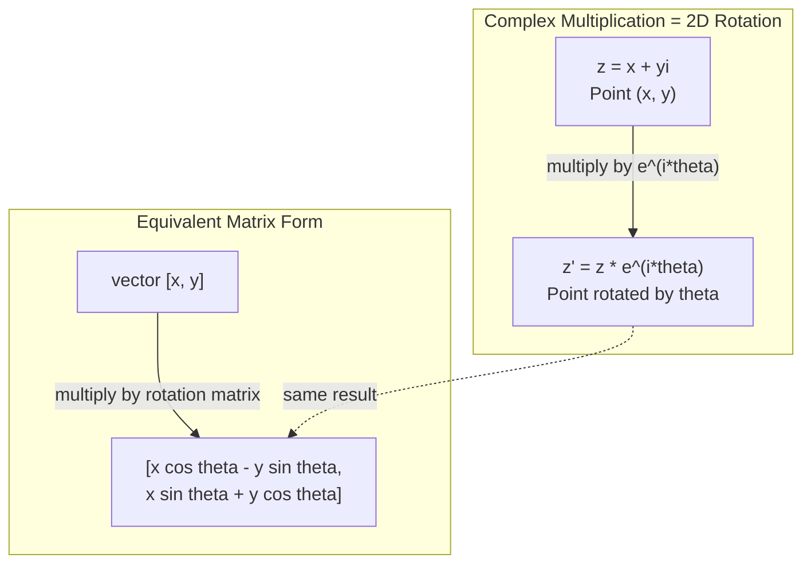
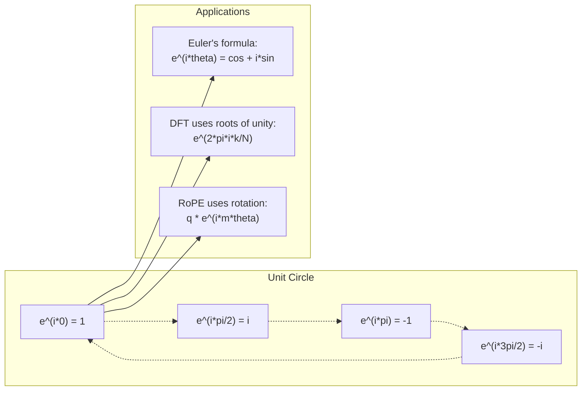

<!-- i18n:manual -->
# Комплексные числа для AI

> Корень из -1 не воображаемый. Это ключ к поворотам, частотам и половине обработки сигналов.

**Type:** Learn
**Language:** Python
**Prerequisites:** Phase 1, Lessons 01-04 (linear algebra, calculus)
**Time:** ~60 minutes

## Learning Objectives

- Выполнять комплексную арифметику (сложение, умножение, деление, сопряжение) в алгебраической и полярной форме
- Применять формулу Эйлера для перехода между комплексными экспонентами и тригонометрией
- Реализовать дискретное преобразование Фурье через комплексные корни из единицы
- Объяснить, как комплексные повороты лежат в основе RoPE и синусоидальных позиционных кодировок в трансформерах

> 🎒 **На пальцах.** Умножение на i — это поворот на 90 градусов. Умножили дважды — повернулись на 180, то есть развернулись в минус. Вот вам и i² = −1, безо всякой мистики. Дальше урок показывает, что из одного этого поворота получаются частоты, звук и позиционные кодировки в трансформерах.

## The Problem

Вы открываете статью про преобразование Фурье, и там всюду `i`. Смотрите на позиционные кодировки трансформера и видите `sin` и `cos` разных частот — вещественную и мнимую части комплексных экспонент. Читаете про квантовые вычисления и находите всё выраженным в комплексных векторных пространствах.

Комплексные числа кажутся абстракцией. Система чисел, построенная на корне из -1, выглядит математическим фокусом. Но это не фокус. Это естественный язык поворотов и колебаний. Всякий раз, когда что-то вращается, вибрирует или колеблется, комплексные числа — правильный инструмент.

Без понимания комплексных чисел вы не поймёте дискретное преобразование Фурье. Не поймёте FFT. Не поймёте, как работает RoPE (Rotary Position Embedding) в современных языковых моделях. Не поймёте, почему синусоидальные позиционные кодировки в оригинальной статье про Transformer используют именно такие частоты.

Этот урок строит комплексную арифметику с нуля, связывает её с геометрией и показывает, где именно комплексные числа появляются в машинном обучении.

## The Concept

### What is a complex number?

У комплексного числа две части: вещественная и мнимая.

```
z = a + bi

where:
  a is the real part
  b is the imaginary part
  i is the imaginary unit, defined by i^2 = -1
```

Вот и всё. Вы расширяете числовую прямую до плоскости. Вещественные числа сидят на одной оси, мнимые — на другой. Любое комплексное число — точка на этой плоскости.

> 🎒 **На пальцах.** Обычные числа живут на прямой линейки: влево и вправо. Комплексные добавляют второе измерение — вверх и вниз. Число 3 + 2i это просто «3 вправо, 2 вверх». Знакомая карта сокровищ из первого урока, только записанная по-другому.

### Complex arithmetic

**Addition.** Складываем вещественные части, складываем мнимые.

```
(a + bi) + (c + di) = (a + c) + (b + d)i

Example: (3 + 2i) + (1 + 4i) = 4 + 6i
```

**Multiplication.** Раскрываем скобки и помним, что i^2 = -1.

```
(a + bi)(c + di) = ac + adi + bci + bdi^2
                 = ac + adi + bci - bd
                 = (ac - bd) + (ad + bc)i

Example: (3 + 2i)(1 + 4i) = 3 + 12i + 2i + 8i^2
                            = 3 + 14i - 8
                            = -5 + 14i
```

**Conjugate.** Меняем знак мнимой части.

```
conjugate of (a + bi) = a - bi
```

Произведение комплексного числа на сопряжённое всегда вещественно:

```
(a + bi)(a - bi) = a^2 + b^2
```

**Division.** Умножаем числитель и знаменатель на сопряжённое к знаменателю.

```
(a + bi) / (c + di) = (a + bi)(c - di) / (c^2 + d^2)
```

Это убирает мнимую часть из знаменателя, давая чистое комплексное число.

> 🎒 **На пальцах.** Умножение раскрывается по обычному школьному правилу «каждый на каждый», как (a+b)(c+d). Единственное отличие: где встретилось i², пишем −1. Проверьте пример из кода в столбик — там ровно четыре произведения и одна подстановка.

### The complex plane

Комплексная плоскость сопоставляет каждому комплексному числу точку в 2D. Горизонтальная ось вещественная, вертикальная — мнимая.

```
z = 3 + 2i  corresponds to the point (3, 2)
z = -1 + 0i corresponds to the point (-1, 0) on the real axis
z = 0 + 4i  corresponds to the point (0, 4) on the imaginary axis
```

Комплексное число одновременно и точка, и вектор из начала координат. Эта двойственность и делает комплексные числа полезными для геометрии.

### Polar form

Любую точку плоскости можно описать расстоянием от начала координат и углом от положительной вещественной оси.

```
z = r * (cos(theta) + i*sin(theta))

where:
  r = |z| = sqrt(a^2 + b^2)     (magnitude, or modulus)
  theta = atan2(b, a)             (phase, or argument)
```

Алгебраическая форма (a + bi) удобна для сложения. Полярная (r, theta) — для умножения.

**Multiplication in polar form.** Перемножаем длины, складываем углы.

```
z1 = r1 * e^(i*theta1)
z2 = r2 * e^(i*theta2)

z1 * z2 = (r1 * r2) * e^(i*(theta1 + theta2))
```

Поэтому комплексные числа идеальны для поворотов. Умножение на комплексное число длины 1 — чистый поворот.

> 🎒 **На пальцах.** Две записи одного адреса. Алгебраическая: «3 квартала на восток, 2 на север». Полярная: «3.6 квартала под углом 34 градуса». Один и тот же дом. Для «пройти ещё немного на север» удобна первая запись, для «повернись на 30 градусов» — вторая.

### Euler's formula

Мост между комплексными экспонентами и тригонометрией:

```
e^(i*theta) = cos(theta) + i*sin(theta)
```

Это важнейшая формула урока. При theta = pi:

```
e^(i*pi) = cos(pi) + i*sin(pi) = -1 + 0i = -1

Therefore: e^(i*pi) + 1 = 0
```

Пять фундаментальных констант (e, i, pi, 1, 0) связаны одним уравнением.

### Why Euler's formula matters for ML

Формула Эйлера говорит, что `e^(i*theta)` описывает единичную окружность по мере изменения theta. При theta = 0 вы в точке (1, 0). При theta = pi/2 — в (0, 1). При theta = pi — в (-1, 0). При theta = 3*pi/2 — в (0, -1). Полный оборот — theta = 2*pi.

Значит комплексные экспоненты И ЕСТЬ повороты. А повороты повсюду в обработке сигналов и ML.

> 🎒 **На пальцах.** Читайте формулу как «стрелка часов». theta — сколько прошли по кругу. cos — тень стрелки на горизонтальной оси, sin — на вертикальной. Знаменитое e^(iπ) = −1 означает просто «прошли полкруга и оказались с другой стороны». Самая красивая формула математики — это описание разворота.

### Connection to 2D rotations

Умножение комплексного числа (x + yi) на e^(i*theta) поворачивает точку (x, y) на угол theta вокруг начала координат.

```
Rotation via complex multiplication:
  (x + yi) * (cos(theta) + i*sin(theta))
  = (x*cos(theta) - y*sin(theta)) + (x*sin(theta) + y*cos(theta))i

Rotation via matrix multiplication:
  [cos(theta)  -sin(theta)] [x]   [x*cos(theta) - y*sin(theta)]
  [sin(theta)   cos(theta)] [y] = [x*sin(theta) + y*cos(theta)]
```

Результаты идентичны. Комплексное умножение И ЕСТЬ поворот на плоскости. Матрица поворота — просто комплексное умножение, записанное в матричной нотации.



> 🎒 **На пальцах.** Сравните две строчки формул — они совпадают до последнего знака. Матрица поворота из урока 03 и умножение комплексных чисел — одно и то же действие, записанное двумя разными способами. Математики часто открывают одну вещь дважды и дают ей два имени.

### Phasors and rotating signals

Комплексная экспонента e^(i*omega*t) — точка, вращающаяся по единичной окружности с угловой частотой omega. С ростом t точка обходит круг.

Вещественная часть этой вращающейся точки — cos(omega*t). Мнимая — sin(omega*t). Синусоидальный сигнал — это тень вращающегося комплексного числа.

```
e^(i*omega*t) = cos(omega*t) + i*sin(omega*t)

Real part:      cos(omega*t)    -- a cosine wave
Imaginary part: sin(omega*t)    -- a sine wave
```

Это представление через фазоры. Вместо отслеживания извилистой синусоиды вы следите за плавно вращающейся стрелкой. Сдвиги фазы становятся смещениями угла. Изменения амплитуды — изменениями длины. Сложение сигналов — сложением векторов.

> 🎒 **На пальцах.** Возьмите колесо велосипеда и приклейте к ободу светоотражатель. Смотрите на едущий велосипед сбоку: отражатель идёт по кругу. Смотрите на его тень на стене: тень движется вверх-вниз, как синусоида. Круг и волна — одно и то же движение с двух точек зрения.

### Roots of unity

N-е корни из единицы — это N точек, равномерно расставленных по единичной окружности:

```
w_k = e^(2*pi*i*k/N)    for k = 0, 1, 2, ..., N-1
```

Для N = 4 корни: 1, i, -1, -i (четыре стороны света).
Для N = 8 — те же четыре плюс четыре диагонали.

Корни из единицы — фундамент дискретного преобразования Фурье. DFT раскладывает сигнал на составляющие на этих N равномерно расставленных частотах.

### Connection to the DFT

Дискретное преобразование Фурье сигнала x[0], x[1], ..., x[N-1]:

```
X[k] = sum_{n=0}^{N-1} x[n] * e^(-2*pi*i*k*n/N)
```

Каждое X[k] измеряет, насколько сигнал коррелирует с k-м корнем из единицы — комплексной синусоидой частоты k. DFT разбивает сигнал на N вращающихся фазоров и сообщает амплитуду и фазу каждого.

### Why i is not imaginary

Слово «мнимый» — историческая случайность. Декарт употребил его пренебрежительно. Но i не более мнимое, чем отрицательные числа, которые когда-то тоже отвергали. Отрицательные числа отвечают на вопрос «что вычесть из 3, чтобы получить 5 в минусе?» Мнимая единица отвечает на вопрос «что возвести в квадрат, чтобы получить -1?»

Полезнее другое: i — оператор поворота на 90 градусов. Умножьте вещественное число на i один раз — повернулись на 90 градусов к мнимой оси. Умножьте ещё раз (i^2) — повернулись ещё на 90 и смотрите в отрицательную вещественную сторону. Вот почему i^2 = -1. Никакой загадки. Полуоборот, собранный из двух четвертей.

Поэтому комплексные числа повсюду в инженерии. Всё, что вращается — электромагнитные волны, квантовые состояния, колебания сигналов, позиционные кодировки — естественно описывается комплексными числами.

> 🎒 **На пальцах.** Повернитесь налево. Ещё раз налево. Теперь вы смотрите назад. Два поворота на 90 градусов = разворот на 180. «Назад» — это «минус вперёд». Всё, вы только что вывели i² = −1 собственным телом.

### Complex exponentials vs trigonometric functions

До формулы Эйлера инженеры писали сигналы как A*cos(omega*t + phi) — амплитуда A, частота omega, фаза phi. Это работает, но делает арифметику мучительной. Сложение двух косинусов с разными фазами требует тригонометрических тождеств.

С комплексными экспонентами тот же сигнал — это A*e^(i*(omega*t + phi)). Сложение двух сигналов — просто сложение двух комплексных чисел. Умножение (модуляция) — перемножение длин и сложение углов. Сдвиги фазы становятся сложением углов. Сдвиги частоты — умножением на фазоры.

Вся область обработки сигналов перешла на нотацию комплексных экспонент, потому что математика чище. «Настоящий сигнал» — всегда просто вещественная часть комплексного представления. Мнимая часть тащится рядом как бухгалтерия, благодаря которой вся алгебра сходится сама собой.

### Connection to transformers

**Sinusoidal positional encodings** (оригинальная статья про Transformer):

```
PE(pos, 2i) = sin(pos / 10000^(2i/d))
PE(pos, 2i+1) = cos(pos / 10000^(2i/d))
```

Пары sin и cos — вещественная и мнимая части комплексных экспонент на разных частотах. Каждая частота даёт своё «разрешение» для кодирования позиции. Низкие частоты меняются медленно (грубая позиция). Высокие — быстро (точная позиция). Вместе они дают каждой позиции уникальный частотный отпечаток.

**RoPE (Rotary Position Embedding)** идёт дальше. Он явно умножает векторы query и key на комплексные матрицы поворота. Относительная позиция двух токенов становится углом поворота. Внимание вычисляется на этих повёрнутых векторах, и модель становится чувствительна к относительной позиции через комплексное умножение.

| Operation | Algebraic Form | Geometric Meaning |
|-----------|---------------|-------------------|
| Сложение | (a+c) + (b+d)i | Сложение векторов на плоскости |
| Умножение | (ac-bd) + (ad+bc)i | Повернуть и растянуть |
| Сопряжение | a - bi | Отразить относительно вещественной оси |
| Модуль | sqrt(a^2 + b^2) | Расстояние от начала координат |
| Фаза | atan2(b, a) | Угол от положительной вещественной оси |
| Деление | умножение на сопряжённое | Обратный поворот и изменение масштаба |
| Степень | r^n * e^(i*n*theta) | Повернуть n раз, растянуть в r^n |



> 🎒 **На пальцах.** Позиционные кодировки — как часы с несколькими стрелками. Секундная бежит быстро и различает соседние мгновения. Часовая ползёт и различает время суток. По одной стрелке момент не определить, а по всем вместе — однозначно. Так модель и понимает, какое слово стоит первым, а какое сотым.

```figure
roots-of-unity
```

## Build It

### Step 1: Complex class

Постройте класс комплексного числа с арифметикой, модулем, фазой и переходом между алгебраической и полярной формами.

```python
import math

class Complex:
    def __init__(self, real, imag=0.0):
        self.real = real
        self.imag = imag

    def __add__(self, other):
        return Complex(self.real + other.real, self.imag + other.imag)

    def __mul__(self, other):
        r = self.real * other.real - self.imag * other.imag
        i = self.real * other.imag + self.imag * other.real
        return Complex(r, i)

    def __truediv__(self, other):
        denom = other.real ** 2 + other.imag ** 2
        r = (self.real * other.real + self.imag * other.imag) / denom
        i = (self.imag * other.real - self.real * other.imag) / denom
        return Complex(r, i)

    def magnitude(self):
        return math.sqrt(self.real ** 2 + self.imag ** 2)

    def phase(self):
        return math.atan2(self.imag, self.real)

    def conjugate(self):
        return Complex(self.real, -self.imag)
```

### Step 2: Polar conversion and Euler's formula

```python
def to_polar(z):
    return z.magnitude(), z.phase()

def from_polar(r, theta):
    return Complex(r * math.cos(theta), r * math.sin(theta))

def euler(theta):
    return Complex(math.cos(theta), math.sin(theta))
```

Проверьте: `euler(theta).magnitude()` должен всегда давать 1.0. `euler(0)` должен давать (1, 0). `euler(pi)` — (-1, 0).

### Step 3: Rotation

Поворот точки (x, y) на угол theta — одно комплексное умножение:

```python
point = Complex(3, 4)
rotated = point * euler(math.pi / 4)
```

Длина остаётся прежней. Меняется только угол.

> 🎒 **На пальцах.** Проверьте это своими руками: длина точки (3, 4) равна 5 (тот самый треугольник). После поворота на любой угол длина останется 5, изменятся только координаты. Поворот двигает точку по окружности радиуса 5 — как гирю на верёвке.

### Step 4: DFT from complex arithmetic

```python
def dft(signal):
    N = len(signal)
    result = []
    for k in range(N):
        total = Complex(0, 0)
        for n in range(N):
            angle = -2 * math.pi * k * n / N
            total = total + Complex(signal[n], 0) * euler(angle)
        result.append(total)
    return result
```

Это DFT за O(N^2). Каждый выход X[k] — сумма отсчётов сигнала, умноженных на корни из единицы.

> 🎒 **На пальцах.** Что делает эта функция по-человечески: она берёт звук и отвечает, какие ноты в нём звучат. Так работает эквалайзер в плеере, где скачут полоски — каждая полоска и есть одно X[k]. Двадцать строк кода, а получается разложение звука на ноты.

### Step 5: Inverse DFT

Обратное DFT восстанавливает исходный сигнал из его спектра. Отличий от прямого всего два: знак в показателе и деление на N.

```python
def idft(spectrum):
    N = len(spectrum)
    result = []
    for n in range(N):
        total = Complex(0, 0)
        for k in range(N):
            angle = 2 * math.pi * k * n / N
            total = total + spectrum[k] * euler(angle)
        result.append(Complex(total.real / N, total.imag / N))
    return result
```

Это даёт идеальное восстановление. Примените DFT, затем IDFT — получите исходный сигнал с точностью машинной арифметики. Информация не теряется.

### Step 6: Roots of unity

```python
def roots_of_unity(N):
    return [euler(2 * math.pi * k / N) for k in range(N)]
```

Проверьте два свойства:
- У каждого корня модуль ровно 1.
- Сумма всех N корней равна нулю (они гасят друг друга по симметрии).

Именно эти свойства делают DFT обратимым. Корни из единицы образуют ортогональный базис частотной области.

> 🎒 **На пальцах.** Почему сумма нулевая: представьте N человек, равномерно расставленных по кругу, и каждый тянет верёвку от центра наружу. Тянут во все стороны одинаково — центр не сдвинется. Это и есть «сумма равна нулю», только на языке векторов.

## Use It

В Python комплексные числа встроенные. Литерал `j` обозначает мнимую единицу.

```python
z = 3 + 2j
w = 1 + 4j

print(z + w)
print(z * w)
print(abs(z))

import cmath
print(cmath.phase(z))
print(cmath.exp(1j * cmath.pi))
```

Для массивов numpy работает с комплексными числами нативно:

```python
import numpy as np

z = np.array([1+2j, 3+4j, 5+6j])
print(np.abs(z))
print(np.angle(z))
print(np.conj(z))
print(np.real(z))
print(np.imag(z))

signal = np.sin(2 * np.pi * 5 * np.linspace(0, 1, 128))
spectrum = np.fft.fft(signal)
freqs = np.fft.fftfreq(128, d=1/128)
```

> 🎒 **На пальцах.** Обратите внимание: в Python мнимая единица обозначается `j`, а не `i`. Так сложилось у инженеров-электротехников, где буква i уже занята силой тока. Мелочь, но новичков сбивает постоянно.

## Ship It

Запустите `code/complex_numbers.py`, чтобы сгенерировать `outputs/skill-complex-arithmetic.md`.

## Exercises

1. **Complex arithmetic by hand.** Вычислите (2 + 3i) * (4 - i) и сверьтесь с кодом. Затем вычислите (5 + 2i) / (1 - 3i). Нарисуйте оба результата на комплексной плоскости и убедитесь, что умножение повернуло и растянуло первое число.

2. **Rotation sequence.** Начните с точки (1, 0). Умножьте на e^(i*pi/6) двенадцать раз. Убедитесь, что после 12 умножений вы вернулись в (1, 0). Печатайте координаты на каждом шаге и подтвердите, что они обходят правильный 12-угольник.

3. **DFT of a known signal.** Создайте сигнал — сумму sin(2*pi*3*t) и 0.5*sin(2*pi*7*t), взятую в 32 точках. Запустите своё DFT. Убедитесь, что в спектре модулей есть пики на частотах 3 и 7, причём пик на 7 вдвое ниже пика на 3.

4. **Roots of unity visualization.** Вычислите 8 корней из единицы. Убедитесь, что их сумма равна нулю. Убедитесь, что умножение любого корня на примитивный корень e^(2*pi*i/8) даёт следующий корень.

5. **Rotation matrix equivalence.** Для 10 случайных углов и 10 случайных точек убедитесь, что комплексное умножение даёт тот же результат, что умножение вектора на матрицу поворота 2x2. Напечатайте максимальное численное расхождение.

> 🎒 **На пальцах.** Второе задание красивое: pi/6 — это 30 градусов, а 12 × 30 = 360, полный круг. Вы вернётесь ровно туда, откуда начали, обойдя циферблат часов по делениям. Если не вернулись — ищите ошибку в умножении.

## Key Terms

| Term | What it means |
|------|---------------|
| Complex number | Число a + bi, где a — вещественная часть, b — мнимая, а i^2 = -1 |
| Imaginary unit | Число i, заданное условием i^2 = -1. Мнимое не в философском смысле — это оператор поворота |
| Complex plane | Двумерная плоскость, где ось x вещественная, а ось y мнимая. Также плоскость Аргана |
| Magnitude (modulus) | Расстояние от начала координат: sqrt(a^2 + b^2). Записывается как \|z\| |
| Phase (argument) | Угол от положительной вещественной оси: atan2(b, a). Записывается как arg(z) |
| Conjugate | Зеркальное отражение относительно вещественной оси: сопряжённое к a + bi это a - bi |
| Polar form | Запись z как r * e^(i*theta) вместо a + bi. Упрощает умножение |
| Euler's formula | e^(i*theta) = cos(theta) + i*sin(theta). Связывает экспоненты с тригонометрией |
| Phasor | Вращающееся комплексное число e^(i*omega*t), представляющее синусоидальный сигнал |
| Roots of unity | N комплексных чисел e^(2*pi*i*k/N) при k от 0 до N-1. N равномерно расставленных точек на единичной окружности |
| DFT | Дискретное преобразование Фурье. Раскладывает сигнал на комплексные синусоидальные компоненты через корни из единицы |
| RoPE | Rotary Position Embedding. Использует комплексное умножение для кодирования относительной позиции во внимании трансформера |

## Further Reading

- [Visual Introduction to Euler's Formula](https://betterexplained.com/articles/intuitive-understanding-of-eulers-formula/) - выстраивает геометрическую интуицию без тяжёлой нотации
- [Su et al.: RoFormer (2021)](https://arxiv.org/abs/2104.09864) - статья, где введён Rotary Position Embedding через комплексные повороты
- [Vaswani et al.: Attention Is All You Need (2017)](https://arxiv.org/abs/1706.03762) - оригинальная статья про Transformer с синусоидальными позиционными кодировками
- [3Blue1Brown: Euler's formula with introductory group theory](https://www.youtube.com/watch?v=mvmuCPvRoWQ) - визуальное объяснение, почему e^(i*pi) = -1
- [Needham: Visual Complex Analysis](https://global.oup.com/academic/product/visual-complex-analysis-9780198534464) - лучшее визуальное изложение комплексных чисел, полное геометрических озарений
- [Strang: Introduction to Linear Algebra, Ch. 10](https://math.mit.edu/~gs/linearalgebra/) - комплексные числа в контексте линейной алгебры и собственных значений
