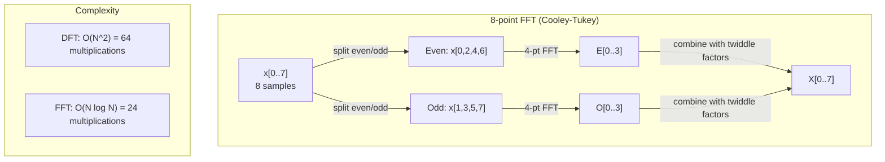
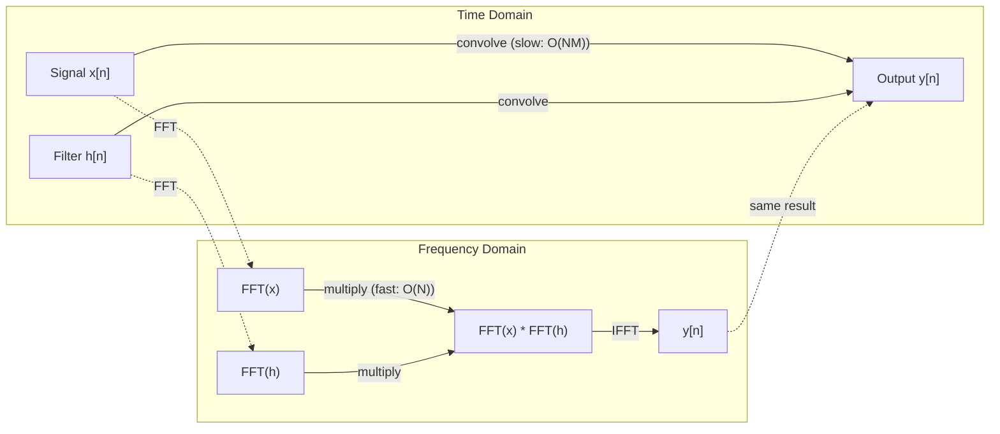

<!-- i18n:manual -->
# Преобразование Фурье

> Любой сигнал — сумма синусоид. Преобразование Фурье говорит, каких именно.

**Type:** Build
**Language:** Python
**Prerequisites:** Phase 1, Lessons 01-04, 19 (complex numbers)
**Time:** ~90 minutes

## Learning Objectives

- Реализовать DFT с нуля и сверить его с быстрым FFT Кули-Тьюки за O(N log N)
- Толковать частотные коэффициенты: извлекать амплитуду, фазу и спектр мощности сигнала
- Применять теорему о свёртке, выполняя свёртку через умножение в частотной области
- Связать частотное разложение Фурье с позиционными кодировками трансформеров и свёрточными слоями CNN

> 🎒 **На пальцах.** Вы слышите аккорд и различаете в нём три ноты. Ухо только что сделало преобразование Фурье: разобрало общий звук на отдельные частоты. Этот урок учит компьютер делать то же самое.

## The Problem

Аудиозапись — последовательность измерений давления во времени. Цена акции — последовательность значений по дням. Изображение — сетка яркостей пикселей в пространстве. Всё это данные во временной (или пространственной) области. Вы видите значения, меняющиеся по некоторому индексу.

Но многие закономерности во временной области невидимы. Этот аудиосигнал — чистый тон или аккорд? Есть ли у цены акции недельный цикл? Есть ли у изображения повторяющаяся текстура? Это вопросы о частотном содержании, и временная область его прячет.

Преобразование Фурье переводит данные из временной области в частотную. Оно берёт сигнал и раскладывает его на синусоиды разных частот. У каждой синусоиды есть амплитуда (насколько она сильна) и фаза (где она начинается). Преобразование Фурье выдаёт обе.

Для ML это важно, потому что мышление в частотной области встречается повсюду. Свёрточные нейросети выполняют свёртку, а это умножение в частотной области. Позиционные кодировки трансформеров используют частотное разложение для представления позиции. Аудиомодели (распознавание речи, генерация музыки) работают со спектрограммами — частотными представлениями звука. Модели временных рядов ищут периодические узоры. Понимание преобразования Фурье даёт словарь для работы со всем этим.

## The Concept

### The DFT definition

По N отсчётам x[0], x[1], ..., x[N-1] дискретное преобразование Фурье выдаёт N частотных коэффициентов X[0], X[1], ..., X[N-1]:

```
X[k] = sum_{n=0}^{N-1} x[n] * e^(-2*pi*i*k*n/N)

for k = 0, 1, ..., N-1
```

Каждое X[k] — комплексное число. Его модуль |X[k]| говорит об амплитуде частоты k. Его фаза angle(X[k]) — о фазовом сдвиге этой частоты.

Ключевая мысль: `e^(-2*pi*i*k*n/N)` — вращающийся фазор частоты k. DFT вычисляет корреляцию сигнала с каждой из N равномерно расставленных частот. Если в сигнале есть энергия на частоте k, корреляция велика. Если нет — близка к нулю.

> 🎒 **На пальцах.** Представьте, что вы прикладываете к сигналу трафареты — один с частыми полосками, другой с редкими. Где трафарет совпал с узором сигнала, там получается большое число. DFT прикладывает N таких трафаретов и записывает, насколько каждый подошёл.

### What each coefficient means

**X[0]: the DC component.** Это сумма всех отсчётов — пропорциональна среднему. Представляет постоянное смещение сигнала (нулевую частоту).

```
X[0] = sum_{n=0}^{N-1} x[n] * e^0 = sum of all samples
```

**X[k] for 1 <= k <= N/2: positive frequencies.** X[k] представляет частоту в k циклов на N отсчётов. Больше k — выше частота (быстрее колебания).

**X[N/2]: the Nyquist frequency.** Наибольшая частота, представимая при N отсчётах. Выше начинается алиасинг — высокие частоты маскируются под низкие.

**X[k] for N/2 < k < N: negative frequencies.** Для вещественных сигналов X[N-k] = conj(X[k]). Отрицательные частоты — зеркальные копии положительных. Поэтому полезная информация лежит в первых N/2 + 1 коэффициентах.

### Inverse DFT

Обратное DFT восстанавливает исходный сигнал по частотным коэффициентам:

```
x[n] = (1/N) * sum_{k=0}^{N-1} X[k] * e^(2*pi*i*k*n/N)

for n = 0, 1, ..., N-1
```

Отличий от прямого DFT только два: знак в показателе положительный (не отрицательный) и есть нормировка 1/N.

Обратное DFT даёт идеальное восстановление. Информация не теряется. Можно перейти из временной области в частотную и обратно без всякой ошибки. DFT — это смена базиса: та же информация, выраженная в другой системе координат.

> 🎒 **На пальцах.** Как разобрать конструктор LEGO на детали и собрать обратно. Ни одна деталь не потерялась, ни одна не появилась. Просто одно и то же можно смотреть либо как готовую модель, либо как кучку деталей.

### The FFT: making it fast

Определённое выше DFT работает за O(N^2): для каждого из N выходных коэффициентов вы суммируете по N входным отсчётам. При N = 1 миллион это 10^12 операций.

Быстрое преобразование Фурье (FFT) вычисляет тот же результат за O(N log N). При N = 1 миллион это около 20 миллионов операций вместо триллиона. Именно это делает частотный анализ практичным.

Алгоритм Кули-Тьюки (самый распространённый FFT) работает по принципу «разделяй и властвуй»:

1. Разбить сигнал на отсчёты с чётными и нечётными индексами.
2. Рекурсивно вычислить DFT каждой половины.
3. Объединить два DFT половинного размера через «поворачивающие множители» e^(-2*pi*i*k/N).

```
X[k] = E[k] + e^(-2*pi*i*k/N) * O[k]          for k = 0, ..., N/2 - 1
X[k + N/2] = E[k] - e^(-2*pi*i*k/N) * O[k]    for k = 0, ..., N/2 - 1

where E = DFT of even-indexed samples
      O = DFT of odd-indexed samples
```

Благодаря симметрии каждый уровень рекурсии делает O(N) работы, а уровней log2(N). Итого O(N log N).



FFT требует, чтобы длина сигнала была степенью двойки. На практике сигналы дополняют нулями до ближайшей степени двойки.

> 🎒 **На пальцах.** Тот же приём, что и в игре «угадай число за 20 вопросов». Вместо перебора миллиона вариантов вы каждый раз делите пополам. Триллион операций против двадцати миллионов — разница между «невозможно» и «мгновенно». Без этого алгоритма не было бы ни цифровой музыки, ни мобильной связи.

### Spectral analysis

**Спектр мощности** — это |X[k]|^2, квадрат модуля каждого частотного коэффициента. Он показывает, сколько энергии на каждой частоте.

**Фазовый спектр** — это angle(X[k]), фазовый сдвиг каждой частоты. Для большинства аналитических задач важен спектр мощности, а фаза игнорируется.

```
Power at frequency k:  P[k] = |X[k]|^2 = X[k].real^2 + X[k].imag^2
Phase at frequency k:  phi[k] = atan2(X[k].imag, X[k].real)
```

### Frequency resolution

Частотное разрешение DFT зависит от числа отсчётов N и частоты дискретизации fs.

```
Frequency of bin k:      f_k = k * fs / N
Frequency resolution:    delta_f = fs / N
Maximum frequency:       f_max = fs / 2  (Nyquist)
```

Чтобы различить две близкие частоты, нужно больше отсчётов. Чтобы поймать высокие частоты, нужна более высокая частота дискретизации.

> 🎒 **На пальцах.** Чтобы различить две ноты, отличающиеся на полтона, надо послушать их подольше. Секунда записи — различите. Одна сотая секунды — нет, слишком коротко. Это не недостаток алгоритма, а закон природы: точность по частоте покупается временем наблюдения.

### The convolution theorem

Один из важнейших результатов обработки сигналов, напрямую связанный с CNN.

**Свёртка во временной области равна поэлементному умножению в частотной.**

```
x * h = IFFT(FFT(x) . FFT(h))

where * is convolution and . is element-wise multiplication
```

Почему это важно:

- Прямая свёртка двух сигналов длины N и M требует O(N*M) операций.
- Свёртка через FFT требует O(N log N): преобразовать оба, перемножить, преобразовать обратно.
- Для больших ядер FFT-свёртка радикально быстрее.
- Именно это и происходит в свёрточных слоях с большим рецептивным полем.

Замечание: DFT вычисляет циклическую свёртку (сигнал заворачивается по кругу). Для линейной свёртки (без заворачивания) дополните оба сигнала нулями до длины N + M - 1 перед вычислением.



> 🎒 **На пальцах.** Как перемножить два больших числа: в столбик долго, а через логарифмы — сложить и потом взять экспоненту. Здесь идея та же: перешли в другую область, где сложная операция стала простым умножением, и вернулись обратно.

### Windowing

DFT предполагает, что сигнал периодичен — он считает N отсчётов одним периодом бесконечно повторяющегося сигнала. Если сигнал начинается и заканчивается разными значениями, на стыке возникает разрыв, который вылезает в спектре ложными высокими частотами. Это называется растеканием спектра.

Оконное взвешивание уменьшает растекание, плавно сводя сигнал к нулю по краям перед вычислением DFT.

Частые окна:

| Window | Shape | Main lobe width | Side lobe level | Use case |
|--------|-------|----------------|-----------------|----------|
| Прямоугольное | Плоское (окна нет) | Самый узкий | Самый высокий (-13 дБ) | Когда сигнал точно периодичен в N отсчётах |
| Ханна | Приподнятый косинус | Средний | Низкий (-31 дБ) | Универсальный спектральный анализ |
| Хэмминга | Изменённый косинус | Средний | Ниже (-42 дБ) | Обработка аудио, анализ речи |
| Блэкмана | Тройной косинус | Широкий | Очень низкий (-58 дБ) | Когда подавление боковых лепестков критично |

```
Hann window:    w[n] = 0.5 * (1 - cos(2*pi*n / (N-1)))
Hamming window: w[n] = 0.54 - 0.46 * cos(2*pi*n / (N-1))
```

Применяют окно поэлементным умножением на сигнал перед DFT: `X = DFT(x * w)`.

> 🎒 **На пальцах.** Резко оборванная запись даёт щелчок — вы слышали такое при склейке аудио. Щелчок это и есть куча ложных высоких частот из ниоткуда. Окно плавно приглушает звук к краям, как fade-out, и щелчок исчезает.

### DFT properties

| Property | Time Domain | Frequency Domain |
|----------|-------------|-----------------|
| Линейность | a*x + b*y | a*X + b*Y |
| Сдвиг во времени | x[n - k] | X[f] * e^(-2*pi*i*f*k/N) |
| Сдвиг по частоте | x[n] * e^(2*pi*i*f0*n/N) | X[f - f0] |
| Свёртка | x * h | X * H (поэлементно) |
| Умножение | x * h (поэлементно) | X * H (циклическая свёртка, делённая на N) |
| Теорема Парсеваля | sum \|x[n]\|^2 | (1/N) * sum \|X[k]\|^2 |
| Сопряжённая симметрия (вещественный вход) | x[n] вещественный | X[k] = conj(X[N-k]) |

Теорема Парсеваля говорит, что полная энергия одинакова в обеих областях. Энергия сохраняется при преобразовании.

### Connection to positional encodings

Оригинальный Transformer использует синусоидальные позиционные кодировки:

```
PE(pos, 2i)   = sin(pos / 10000^(2i/d_model))
PE(pos, 2i+1) = cos(pos / 10000^(2i/d_model))
```

Каждая пара измерений (2i, 2i+1) колеблется на своей частоте. Частоты расставлены геометрически от высоких (измерения 0, 1) к низким (последние измерения). Это даёт каждой позиции уникальный узор по всем частотным диапазонам — так же, как коэффициенты Фурье однозначно определяют сигнал.

Ключевые свойства, которые это даёт:

- **Uniqueness:** У двух разных позиций не бывает одинаковой кодировки.
- **Bounded values:** sin и cos всегда лежат в [-1, 1].
- **Relative position:** Кодировку позиции p+k можно выразить как линейную функцию кодировки позиции p. Модель может научиться обращать внимание на относительные позиции.

### Connection to CNNs

Свёрточный слой применяет выученный фильтр (ядро) ко входу, скользя им по сигналу или изображению. Математически это операция свёртки.

По теореме о свёртке это эквивалентно:
1. FFT входа
2. FFT ядра
3. Умножение в частотной области
4. IFFT результата

Стандартные реализации CNN используют прямую свёртку (быстрее для маленьких ядер 3x3). Но для больших ядер или глобальной свёртки подходы через FFT существенно быстрее. Некоторые архитектуры (например, FNet) вообще заменяют внимание на FFT, получая сравнимую точность при O(N log N) вместо O(N^2).

> 🎒 **На пальцах.** Фильтры в фоторедакторе — размытие, резкость — это свёртки. «Размыть» = «убрать высокие частоты», «повысить резкость» = «усилить высокие частоты». Слово «частота» для картинки значит «как быстро меняется яркость от пикселя к пикселю».

### Spectrograms and the Short-Time Fourier Transform

Одно FFT даёт частотное содержание всего сигнала, но ничего не говорит о том, когда эти частоты звучали. Свист с растущей частотой и аккорд, где все частоты звучат разом, могут дать одинаковый спектр модулей.

Кратковременное преобразование Фурье (STFT) решает это, вычисляя FFT на перекрывающихся окнах сигнала. Результат — спектрограмма: двумерное представление, где по одной оси время, по другой частота. Яркость в каждой точке показывает энергию на этой частоте в этот момент.

```
STFT procedure:
1. Choose a window size (e.g., 1024 samples)
2. Choose a hop size (e.g., 256 samples -- 75% overlap)
3. For each window position:
   a. Extract the windowed segment
   b. Apply a Hann/Hamming window
   c. Compute FFT
   d. Store the magnitude spectrum as one column of the spectrogram
```

Спектрограммы — стандартное входное представление для аудиомоделей ML. Модели распознавания речи (Whisper, DeepSpeech) работают на мел-спектрограммах, где частоты отображены на шкалу мел, лучше соответствующую человеческому восприятию высоты звука.

> 🎒 **На пальцах.** Спектрограмма — это нотная запись, только автоматическая. По горизонтали время, по вертикали высота звука, яркость — громкость. Так выглядит песня «глазами» компьютера, и именно такую картинку получает на вход модель распознавания речи.

### Aliasing

Если сигнал содержит частоты выше fs/2 (частоты Найквиста), дискретизация с частотой fs создаст их ложные копии. Сигнал 90 Гц, оцифрованный на 100 Гц, выглядит точно как сигнал 10 Гц. Отличить их по одним отсчётам невозможно.

```
Example:
  True signal: 90 Hz sine wave
  Sampling rate: 100 Hz
  Apparent frequency: 100 - 90 = 10 Hz

  The samples from the 90 Hz signal at 100 Hz sampling rate
  are identical to the samples from a 10 Hz signal.
  No amount of math can recover the original 90 Hz.
```

Поэтому аналого-цифровые преобразователи содержат антиалиасинговые фильтры, срезающие частоты выше Найквиста до оцифровки. В ML алиасинг возникает при уменьшении карт признаков без нормального низкочастотного фильтра — некоторые архитектуры лечат это antialiased-пулингом.

> 🎒 **На пальцах.** Вы видели это в кино: колёса машины крутятся назад, хотя машина едет вперёд. Камера снимает 24 кадра в секунду, а колесо крутится быстрее — и мозг видит ложное медленное вращение в другую сторону. Это и есть алиасинг, только с картинкой.

### Zero-padding does not increase resolution

Частое заблуждение: дополнение сигнала нулями перед FFT улучшает частотное разрешение. Нет. Дополнение нулями интерполирует между существующими частотными корзинами, давая более гладкий на вид спектр. Но оно не может выявить частотные детали, которых не было в исходных отсчётах.

Настоящее частотное разрешение зависит только от времени наблюдения T = N / fs. Чтобы различить две частоты, отличающиеся на delta_f, нужно как минимум T = 1 / delta_f секунд данных. Никакое дополнение нулями этот фундаментальный предел не сдвинет.

> 🎒 **На пальцах.** Это как растянуть маленькую фотографию до размера плаката. Пикселей стало больше, картинка стала глаже, но новых деталей не появилось — их просто не было в оригинале.

```figure
fourier-synthesis
```

## Build It

### Step 1: DFT from scratch

DFT за O(N^2) следует прямо из определения.

```python
import math

class Complex:
    ...

def dft(x):
    N = len(x)
    result = []
    for k in range(N):
        total = Complex(0, 0)
        for n in range(N):
            angle = -2 * math.pi * k * n / N
            w = Complex(math.cos(angle), math.sin(angle))
            xn = x[n] if isinstance(x[n], Complex) else Complex(x[n])
            total = total + xn * w
        result.append(total)
    return result
```

### Step 2: Inverse DFT

Та же структура, положительный показатель, деление на N.

```python
def idft(X):
    N = len(X)
    result = []
    for n in range(N):
        total = Complex(0, 0)
        for k in range(N):
            angle = 2 * math.pi * k * n / N
            w = Complex(math.cos(angle), math.sin(angle))
            total = total + X[k] * w
        result.append(Complex(total.real / N, total.imag / N))
    return result
```

### Step 3: FFT (Cooley-Tukey)

Рекурсивный FFT требует длины, равной степени двойки. Разбиваем на чётные и нечётные, рекурсия, объединение через поворачивающие множители.

```python
def fft(x):
    N = len(x)
    if N <= 1:
        return [x[0] if isinstance(x[0], Complex) else Complex(x[0])]
    if N % 2 != 0:
        return dft(x)

    even = fft([x[i] for i in range(0, N, 2)])
    odd = fft([x[i] for i in range(1, N, 2)])

    result = [Complex(0)] * N
    for k in range(N // 2):
        angle = -2 * math.pi * k / N
        twiddle = Complex(math.cos(angle), math.sin(angle))
        t = twiddle * odd[k]
        result[k] = even[k] + t
        result[k + N // 2] = even[k] - t
    return result
```

> 🎒 **На пальцах.** Вглядитесь в две последние строчки: `even[k] + t` и `even[k] - t`. Одно и то же значение t используется дважды, только со знаком плюс и минус. За счёт этого работы вдвое меньше — и это единственная хитрость, на которой держится весь FFT. Её называют «бабочкой» из-за формы схемы.

### Step 4: Spectral analysis helpers

```python
def power_spectrum(X):
    return [xk.real ** 2 + xk.imag ** 2 for xk in X]

def convolve_fft(x, h):
    N = len(x) + len(h) - 1
    padded_N = 1
    while padded_N < N:
        padded_N *= 2

    x_padded = x + [0.0] * (padded_N - len(x))
    h_padded = h + [0.0] * (padded_N - len(h))

    X = fft(x_padded)
    H = fft(h_padded)

    Y = [xk * hk for xk, hk in zip(X, H)]

    y = idft(Y)
    return [y[n].real for n in range(N)]
```

## Use It

Для реальной работы используйте FFT из numpy — за ним стоят сильно оптимизированные библиотеки на C.

```python
import numpy as np

signal = np.sin(2 * np.pi * 5 * np.arange(256) / 256)
spectrum = np.fft.fft(signal)
freqs = np.fft.fftfreq(256, d=1/256)

power = np.abs(spectrum) ** 2

positive_freqs = freqs[:len(freqs)//2]
positive_power = power[:len(power)//2]
```

Для оконного взвешивания и более продвинутого спектрального анализа:

```python
from scipy.signal import windows, stft

window = windows.hann(256)
windowed = signal * window
spectrum = np.fft.fft(windowed)
```

Для свёртки:

```python
from scipy.signal import fftconvolve

result = fftconvolve(signal, kernel, mode='full')
```

Для спектрограмм:

```python
from scipy.signal import stft

frequencies, times, Zxx = stft(signal, fs=sample_rate, nperseg=256)
spectrogram = np.abs(Zxx) ** 2
```

Матрица спектрограммы имеет форму (n_frequencies, n_time_frames). Каждый столбец — спектр мощности в одном временном окне. Именно это и получают на вход аудиомодели.

> 🎒 **На пальцах.** В примере сигнал — синусоида ровно 5 циклов на 256 отсчётов. Значит в спектре мощности будет один яркий пик на позиции 5 и почти нули везде остальные. Запустите и посмотрите: одна нота — один пик. Это лучшая проверка, что всё работает.

## Ship It

Запустите `code/fourier.py`, чтобы сгенерировать `outputs/prompt-spectral-analyzer.md`.

## Exercises

1. **Pure tone identification.** Создайте сигнал из одной синусоиды неизвестной частоты (от 1 до 50 Гц), оцифрованный на 128 Гц в течение 1 секунды. Определите частоту своим DFT. Проверьте ответ. Теперь добавьте гауссов шум со стандартным отклонением 0.5 и повторите. Как шум влияет на спектр?

2. **FFT vs DFT verification.** Сгенерируйте случайный сигнал длины 64. Вычислите и DFT (O(N^2)), и FFT. Убедитесь, что все коэффициенты совпадают с точностью 1e-10. Замерьте время обеих функций на сигналах длины 256, 512, 1024 и 2048. Нарисуйте отношение времени DFT ко времени FFT.

3. **Convolution theorem proof by example.** Создайте сигнал x = [1, 2, 3, 4, 0, 0, 0, 0] и фильтр h = [1, 1, 1, 0, 0, 0, 0, 0]. Вычислите их циклическую свёртку напрямую (вложенным циклом). Затем через FFT (преобразовать, перемножить, обратно преобразовать). Убедитесь, что результаты совпали. Теперь сделайте линейную свёртку, правильно дополнив нулями.

4. **Windowing effects.** Создайте сигнал — сумму двух синусоид на 10 Гц и 12 Гц (очень близко). Оцифруйте на 128 Гц в течение 1 секунды. Вычислите спектр мощности без окна, с окном Ханна и с окном Хэмминга. С каким окном два пика различаются легче всего? Почему?

5. **Positional encoding analysis.** Сгенерируйте синусоидальные позиционные кодировки для d_model = 128 и max_pos = 512. Для каждой пары позиций (p1, p2) вычислите скалярное произведение их кодировок. Покажите, что оно зависит только от |p1 - p2|, а не от абсолютных позиций. Что происходит со скалярным произведением при росте расстояния?

> 🎒 **На пальцах.** Второе задание даст самое приятное число в курсе. На длине 2048 разница DFT и FFT будет примерно в сто раз. Вы своими глазами увидите разницу между O(N²) и O(N log N) — не как формулу, а как секундомер.

## Key Terms

| Term | What it means |
|------|---------------|
| DFT (Discrete Fourier Transform) | Переводит N временных отсчётов в N частотных коэффициентов. Каждый коэффициент — корреляция с комплексной синусоидой этой частоты |
| FFT (Fast Fourier Transform) | Алгоритм вычисления DFT за O(N log N). Алгоритм Кули-Тьюки рекурсивно разбивает чётные и нечётные индексы |
| Inverse DFT | Восстанавливает временной сигнал по частотным коэффициентам. Та же формула, что и у DFT, со сменой знака показателя и делением на N |
| Frequency bin | Каждый индекс k на выходе DFT представляет частоту k*fs/N Гц. «Корзина» — дискретный частотный слот |
| DC component | X[0], коэффициент нулевой частоты. Пропорционален среднему сигнала |
| Nyquist frequency | fs/2, максимальная частота, представимая при частоте дискретизации fs. Частоты выше подвергаются алиасингу |
| Power spectrum | \|X[k]\|^2, квадрат модуля каждого частотного коэффициента. Показывает распределение энергии по частотам |
| Phase spectrum | angle(X[k]), фазовый сдвиг каждой частотной компоненты. При анализе часто игнорируется |
| Spectral leakage | Ложное частотное содержание из-за трактовки непериодического сигнала как периодического. Уменьшается оконным взвешиванием |
| Window function | Сглаживающая функция (Ханна, Хэмминга, Блэкмана), применяемая перед DFT для уменьшения растекания спектра |
| Twiddle factor | Комплексная экспонента e^(-2*pi*i*k/N), используемая для объединения под-DFT в «бабочке» FFT |
| Convolution theorem | Свёртка во временной области равна поэлементному умножению в частотной. Фундамент обработки сигналов и CNN |
| Circular convolution | Свёртка с заворачиванием сигнала по кругу. Именно её естественно вычисляет DFT |
| Linear convolution | Обычная свёртка без заворачивания. Достигается дополнением нулями перед DFT |
| Parseval's theorem | Полная энергия сохраняется при преобразовании Фурье. sum \|x[n]\|^2 = (1/N) sum \|X[k]\|^2 |
| Aliasing | Когда частоты выше Найквиста проявляются как более низкие из-за недостаточной частоты дискретизации |

## Further Reading

- [Cooley & Tukey: An Algorithm for the Machine Calculation of Complex Fourier Series (1965)](https://www.ams.org/journals/mcom/1965-19-090/S0025-5718-1965-0178586-1/) - оригинальная статья про FFT, изменившая вычислительную технику
- [3Blue1Brown: But what is the Fourier Transform?](https://www.youtube.com/watch?v=spUNpyF58BY) - лучшее визуальное введение в преобразование Фурье
- [Lee-Thorp et al.: FNet: Mixing Tokens with Fourier Transforms (2021)](https://arxiv.org/abs/2105.03824) - замена self-attention на FFT в трансформерах
- [Smith: The Scientist and Engineer's Guide to Digital Signal Processing](http://www.dspguide.com/) - бесплатный учебник с подробным разбором FFT, окон и спектрального анализа
- [Vaswani et al.: Attention Is All You Need (2017)](https://arxiv.org/abs/1706.03762) - синусоидальные позиционные кодировки, выведенные из частотного разложения Фурье
- [Radford et al.: Whisper (2022)](https://arxiv.org/abs/2212.04356) - распознавание речи на мел-спектрограммах как входном представлении
