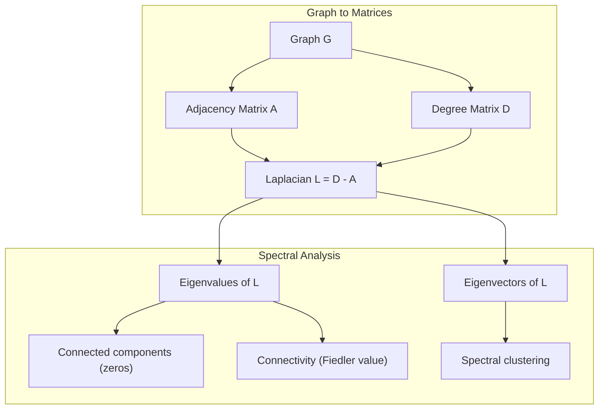
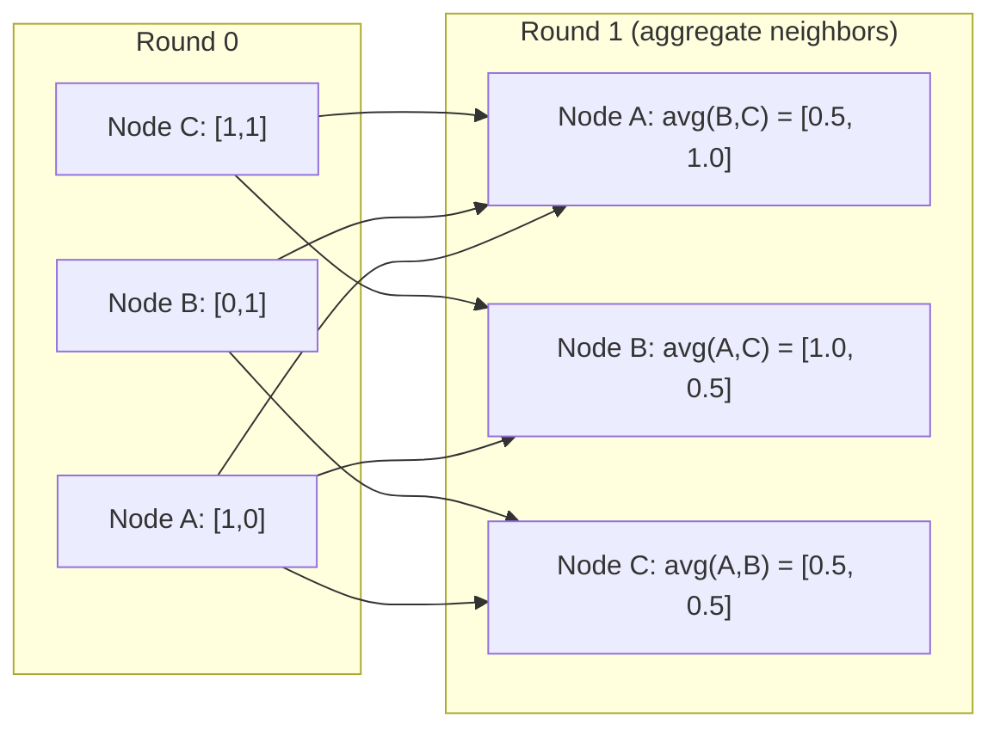

<!-- i18n:manual -->
# Теория графов для машинного обучения

> Графы — структура данных для отношений. Если в ваших данных есть связи, вам нужна теория графов.

**Type:** Build
**Language:** Python
**Prerequisites:** Phase 1, Lessons 01-03 (linear algebra, matrices)
**Time:** ~90 minutes

## Learning Objectives

- Построить класс графа с представлением через матрицу и списки смежности и реализовать обходы BFS и DFS
- Вычислить лапласиан графа и по его собственным значениям находить компоненты связности и кластеризовать узлы
- Реализовать один раунд message passing в духе GNN как умножение на нормированную матрицу смежности
- Применить спектральную кластеризацию для разбиения графа через вектор Фидлера

> 🎒 **На пальцах.** Граф — это кружочки и палочки между ними. Люди и дружба. Города и дороги. Атомы и связи. Всё, что можно нарисовать точками и линиями, — граф, и для всего этого работает одна и та же математика.

## The Problem

Социальные сети, молекулы, базы знаний, сети цитирований, карты дорог — всё это графы. Традиционное ML работает с данными как с плоскими таблицами. Каждая строка независима. Каждый признак — столбец. Но когда важна структура связей, таблицы не справляются.

Возьмите социальную сеть. Вы хотите предсказать, какой товар купит пользователь. Его история покупок важна. Но история покупок его друзей важнее. Связи несут сигнал.

Или возьмите молекулу. Вы хотите предсказать, свяжется ли она с белком. Атомы важны, но по-настоящему важно, как атомы связаны друг с другом. Структура и есть данные.

Графовые нейросети (GNN) — самая быстрорастущая область глубокого обучения. Они питают разработку лекарств, социальные рекомендации, детекцию мошенничества и рассуждения по графам знаний. Любая GNN стоит на одном фундаменте: базовой теории графов.

Вам нужны четыре вещи:
1. Способ представить графы матрицами (чтобы их можно было перемножать)
2. Алгоритмы обхода для исследования структуры графа
3. Лапласиан — важнейшая матрица спектральной теории графов
4. Message passing — операция, на которой работают GNN

## The Concept

### Graphs: Nodes and Edges

Граф G = (V, E) состоит из вершин (узлов) V и рёбер E. Каждое ребро соединяет две вершины.

**Directed vs undirected.** В неориентированном графе ребро (u, v) означает, что u связан с v И v связан с u. В ориентированном (орграфе) ребро (u, v) означает, что u указывает на v, но не обязательно наоборот.

**Weighted vs unweighted.** В невзвешенном графе рёбра либо есть, либо нет. Во взвешенном у каждого ребра числовой вес — расстояние, стоимость, сила связи.

| Graph type | Example |
|-----------|---------|
| Неориентированный, невзвешенный | Сеть дружбы в Facebook |
| Ориентированный, невзвешенный | Сеть подписок в Twitter |
| Неориентированный, взвешенный | Карта дорог (расстояния) |
| Ориентированный, взвешенный | Ссылки веб-страниц (оценки PageRank) |

> 🎒 **На пальцах.** Дружба взаимна: если Петя друг Васи, то и Вася друг Пети — это неориентированный граф. Подписка нет: вы подписаны на блогера, а он на вас нет — ориентированный. Разница простая, но забыть про неё значит получить неправильный ответ.

### The Adjacency Matrix

Матрица смежности A — основное представление. Для графа из n узлов:

```
A[i][j] = 1    if there is an edge from node i to node j
A[i][j] = 0    otherwise
```

Для неориентированных графов A симметрична: A[i][j] = A[j][i]. Для взвешенных A[i][j] = вес ребра (i, j).

**Example -- a triangle:**

```
Nodes: 0, 1, 2
Edges: (0,1), (1,2), (0,2)

A = [[0, 1, 1],
     [1, 0, 1],
     [1, 1, 0]]
```

Матрица смежности — вход для любой GNN. Матричные операции над A соответствуют операциям над графом.

> 🎒 **На пальцах.** Читайте матрицу как таблицу «кто с кем дружит»: строка — один человек, столбец — другой, единица на пересечении — дружат. Нули на диагонали означают «сам себе не друг». Симметричность матрицы и есть математическая запись взаимности дружбы.

### Degree

Степень узла — число рёбер, к нему подключённых. Для ориентированных графов есть входящая степень (сколько рёбер входит) и исходящая (сколько выходит).

Матрица степеней D диагональна:

```
D[i][i] = degree of node i
D[i][j] = 0    for i != j
```

Для примера с треугольником: D = diag(2, 2, 2), потому что каждый узел связан с двумя другими.

Степень говорит о важности узла. Высокая степень — узел-хаб. Распределение степеней сети раскрывает её структуру. Социальные сети следуют степенным законам (немного хабов, много листьев). У случайных графов степени распределены по Пуассону.

> 🎒 **На пальцах.** Степень — это «сколько у тебя друзей». В любом классе есть пара человек, которых знают все, и несколько тихонь. Это не случайность, а закон: в социальных сетях всегда мало хабов и много обычных узлов.

### BFS and DFS

Два фундаментальных алгоритма обхода графа. Нужны оба.

**Breadth-First Search (BFS):** Сначала обойти всех соседей, потом соседей соседей. Использует очередь (FIFO).

```
BFS from node 0:
  Visit 0
  Queue: [1, 2]        (neighbors of 0)
  Visit 1
  Queue: [2, 3]        (add neighbors of 1)
  Visit 2
  Queue: [3]           (neighbors of 2 already visited)
  Visit 3
  Queue: []            (done)
```

BFS находит кратчайшие пути в невзвешенных графах. Расстояние от старта до любого узла равно уровню BFS, на котором узел впервые обнаружен. Поэтому BFS используют для подсчёта «рукопожатий» в социальных сетях.

**Depth-First Search (DFS):** Идти как можно глубже, потом возвращаться. Использует стек (LIFO) или рекурсию.

```
DFS from node 0:
  Visit 0
  Stack: [1, 2]        (neighbors of 0)
  Visit 2               (pop from stack)
  Stack: [1, 3]         (add neighbors of 2)
  Visit 3               (pop from stack)
  Stack: [1]
  Visit 1               (pop from stack)
  Stack: []             (done)
```

DFS полезен для:
- Поиска компонент связности (запускать DFS из непосещённых узлов)
- Обнаружения циклов (обратные рёбра в дереве DFS)
- Топологической сортировки (обратный порядок завершения DFS)

| Algorithm | Data structure | Finds | Use case |
|-----------|---------------|-------|----------|
| BFS | Очередь | Кратчайшие пути | Расстояние в соцсети, обход графа знаний |
| DFS | Стек | Компоненты, циклы | Связность, топологическая сортировка |

> 🎒 **На пальцах.** BFS — как искать выход из лабиринта, посылая вперёд толпу: все идут по всем коридорам одновременно, кто первый нашёл выход — тот путь и кратчайший. DFS — как идти одному: сворачиваете в первый коридор, упёрлись в тупик, вернулись, свернули в следующий.

### The Graph Laplacian

L = D - A. Важнейшая матрица спектральной теории графов.

Для треугольника:

```
D = [[2, 0, 0],    A = [[0, 1, 1],    L = [[2, -1, -1],
     [0, 2, 0],         [1, 0, 1],         [-1, 2, -1],
     [0, 0, 2]]         [1, 1, 0]]         [-1, -1,  2]]
```

У лапласиана замечательные свойства:

1. **L is positive semi-definite.** Все собственные значения >= 0.

2. **The number of zero eigenvalues equals the number of connected components.** У связного графа ровно одно нулевое собственное значение. У графа из 3 несвязанных кусков — три нуля.

3. **The smallest non-zero eigenvalue (Fiedler value) measures connectivity.** Большое значение Фидлера означает хорошо связанный граф. Малое — что у графа есть слабое место, бутылочное горлышко.

4. **The eigenvector of the Fiedler value (Fiedler vector) reveals the best split.** Узлы с положительными значениями идут в одну группу, с отрицательными — в другую. Это и есть спектральная кластеризация.



> 🎒 **На пальцах.** Второе свойство почти волшебное. Вы хотите узнать, распадается ли ваша сеть на отдельные куски, — и вместо обхода всех связей просто считаете собственные значения одной матрицы. Сколько нулей — столько отдельных кусков. Число вместо путешествия.

### Spectral Properties

Собственные значения матрицы смежности и лапласиана раскрывают структурные свойства без всякого обхода.

**Spectral clustering** работает так:
1. Вычислить лапласиан L
2. Найти k наименьших собственных векторов L (пропустив первый, который для связного графа состоит из единиц)
3. Использовать эти собственные векторы как новые координаты каждого узла
4. Запустить k-means на этих координатах

Почему это работает? Собственные векторы L кодируют «самые гладкие» функции на графе. Хорошо связанные узлы получают близкие значения. Узлы, разделённые бутылочным горлышком, получают разные. Собственные векторы естественным образом разделяют кластеры.

**Random walk connection.** Нормированный лапласиан связан со случайными блужданиями по графу. Стационарное распределение блуждания пропорционально степени узла. Время перемешивания (как быстро блуждание сходится) зависит от спектрального зазора.

### Message Passing

Ключевая операция графовых нейросетей. Каждый узел собирает сообщения от соседей, агрегирует их и обновляет собственное состояние.

```
h_v^(k+1) = UPDATE(h_v^(k), AGGREGATE({h_u^(k) : u in neighbors(v)}))
```

В простейшем виде AGGREGATE — это среднее, а UPDATE — линейное преобразование плюс активация:

```
h_v^(k+1) = sigma(W * mean({h_u^(k) : u in neighbors(v)}))
```

Это замаскированное умножение матриц. Если H — матрица признаков всех узлов, а A — матрица смежности:

```
H^(k+1) = sigma(A_norm * H^(k) * W)
```

где A_norm — нормированная матрица смежности (сумма каждой строки равна 1).

Один раунд message passing позволяет каждому узлу «увидеть» ближайших соседей. Два раунда — соседей соседей. K раундов дают каждому узлу информацию из его K-шаговой окрестности.



> 🎒 **На пальцах.** Это игра в испорченный телефон, только полезная. Каждый узел спрашивает соседей «что у вас нового» и усредняет ответы. После второго круга новости доходят уже от соседей соседей. Так информация расходится по сети — и так GNN понимает, что происходит вокруг узла.

### Concepts and ML Applications

| Concept | ML Application |
|---------|---------------|
| Матрица смежности | Входное представление GNN |
| Лапласиан графа | Спектральная кластеризация, поиск сообществ |
| BFS/DFS | Обход графа знаний, поиск путей |
| Распределение степеней | Важность узлов, конструирование признаков |
| Message passing | Слои GNN (GCN, GAT, GraphSAGE) |
| Собственные значения L | Поиск сообществ, разбиение графа |
| Спектральная кластеризация | Обучение без учителя, группировка узлов |
| PageRank | Ранжирование важности узлов, веб-поиск |

```figure
graph-degree-distribution
```

## Build It

### Step 1: Graph class from scratch

```python
class Graph:
    def __init__(self, n_nodes, directed=False):
        self.n = n_nodes
        self.directed = directed
        self.adj = {i: {} for i in range(n_nodes)}

    def add_edge(self, u, v, weight=1.0):
        self.adj[u][v] = weight
        if not self.directed:
            self.adj[v][u] = weight

    def neighbors(self, node):
        return list(self.adj[node].keys())

    def degree(self, node):
        return len(self.adj[node])

    def adjacency_matrix(self):
        import numpy as np
        A = np.zeros((self.n, self.n))
        for u in range(self.n):
            for v, w in self.adj[u].items():
                A[u][v] = w
        return A

    def degree_matrix(self):
        import numpy as np
        D = np.zeros((self.n, self.n))
        for i in range(self.n):
            D[i][i] = self.degree(i)
        return D

    def laplacian(self):
        return self.degree_matrix() - self.adjacency_matrix()
```

Список смежности (`self.adj`) хранит соседей экономно. Перевод в матрицу смежности использует numpy, потому что все спектральные операции требуют его.

> 🎒 **На пальцах.** Заметьте строчку `if not self.directed`. Для неориентированного графа ребро добавляется в обе стороны — именно так «дружба взаимна» превращается в две строчки кода.

### Step 2: BFS and DFS

```python
from collections import deque

def bfs(graph, start):
    visited = set()
    order = []
    distances = {}
    queue = deque([(start, 0)])
    visited.add(start)
    while queue:
        node, dist = queue.popleft()
        order.append(node)
        distances[node] = dist
        for neighbor in graph.neighbors(node):
            if neighbor not in visited:
                visited.add(neighbor)
                queue.append((neighbor, dist + 1))
    return order, distances


def dfs(graph, start):
    visited = set()
    order = []
    stack = [start]
    while stack:
        node = stack.pop()
        if node in visited:
            continue
        visited.add(node)
        order.append(node)
        for neighbor in reversed(graph.neighbors(node)):
            if neighbor not in visited:
                stack.append(neighbor)
    return order
```

BFS использует deque (двустороннюю очередь) ради popleft за O(1). DFS использует список как стек. Оба посещают каждый узел ровно один раз — время O(V + E).

> 🎒 **На пальцах.** Разница между двумя функциями всего в одной строке: `popleft()` против `pop()`. Первая берёт из начала очереди (кто раньше пришёл, тот раньше вышел — как в столовой), вторая с конца (как стопка тарелок — берут верхнюю). Одно слово меняет весь порядок обхода.

### Step 3: Connected components and Laplacian eigenvalues

```python
def connected_components(graph):
    visited = set()
    components = []
    for node in range(graph.n):
        if node not in visited:
            order, _ = bfs(graph, node)
            visited.update(order)
            components.append(order)
    return components


def laplacian_eigenvalues(graph):
    import numpy as np
    L = graph.laplacian()
    eigenvalues = np.linalg.eigvalsh(L)
    return eigenvalues
```

`eigvalsh` предназначена для симметричных матриц — лапласиан всегда симметричен для неориентированных графов. Она возвращает собственные значения по возрастанию. Посчитайте нули, чтобы узнать число компонент связности.

### Step 4: Spectral clustering

```python
def spectral_clustering(graph, k=2):
    import numpy as np
    L = graph.laplacian()
    eigenvalues, eigenvectors = np.linalg.eigh(L)
    features = eigenvectors[:, 1:k+1]

    labels = np.zeros(graph.n, dtype=int)
    for i in range(graph.n):
        if features[i, 0] >= 0:
            labels[i] = 0
        else:
            labels[i] = 1
    return labels
```

При k=2 знак вектора Фидлера делит граф на два кластера. При k>2 надо запускать k-means на первых k собственных векторах (исключая тривиальный из единиц).

> 🎒 **На пальцах.** Обратите внимание, как разделяются группы: просто по знаку числа. Положительное — в первую компанию, отрицательное — во вторую. Никакого перебора вариантов, одно разложение матрицы и проверка знака.

### Step 5: Message passing

```python
def message_passing(graph, features, weight_matrix):
    import numpy as np
    A = graph.adjacency_matrix()
    row_sums = A.sum(axis=1, keepdims=True)
    row_sums[row_sums == 0] = 1
    A_norm = A / row_sums
    aggregated = A_norm @ features
    output = aggregated @ weight_matrix
    return output
```

Это один раунд message passing в GNN. Новые признаки каждого узла — взвешенное среднее признаков его соседей, преобразованное матрицей весов. Складывайте раунды, чтобы информация расходилась дальше.

## Use It

С networkx и numpy те же операции пишутся в одну строку:

```python
import networkx as nx
import numpy as np

G = nx.karate_club_graph()

A = nx.adjacency_matrix(G).toarray()
L = nx.laplacian_matrix(G).toarray()

eigenvalues = np.linalg.eigvalsh(L.astype(float))
print(f"Smallest eigenvalues: {eigenvalues[:5]}")
print(f"Connected components: {nx.number_connected_components(G)}")

communities = nx.community.greedy_modularity_communities(G)
print(f"Communities found: {len(communities)}")

pr = nx.pagerank(G)
top_nodes = sorted(pr.items(), key=lambda x: x[1], reverse=True)[:5]
print(f"Top 5 PageRank nodes: {top_nodes}")
```

networkx работает с графами любого размера через оптимизированные бэкенды на C. Используйте его в продакшене. А свою реализацию с нуля — чтобы понимать, что он делает.

> 🎒 **На пальцах.** Karate Club — знаменитый учебный граф: 34 члена клуба карате, между которыми в 1970-х произошёл раскол на две группы. Алгоритм спектральной кластеризации, ничего не зная про людей, предсказывает этот раскол почти точно. Математика угадала ссору по одной структуре связей.

### numpy spectral analysis

```python
import numpy as np

A = np.array([
    [0, 1, 1, 0, 0],
    [1, 0, 1, 0, 0],
    [1, 1, 0, 1, 0],
    [0, 0, 1, 0, 1],
    [0, 0, 0, 1, 0]
])

D = np.diag(A.sum(axis=1))
L = D - A

eigenvalues, eigenvectors = np.linalg.eigh(L)
print(f"Eigenvalues: {np.round(eigenvalues, 4)}")
print(f"Fiedler value: {eigenvalues[1]:.4f}")
print(f"Fiedler vector: {np.round(eigenvectors[:, 1], 4)}")

fiedler = eigenvectors[:, 1]
group_a = np.where(fiedler >= 0)[0]
group_b = np.where(fiedler < 0)[0]
print(f"Cluster A: {group_a}")
print(f"Cluster B: {group_b}")
```

Вектор Фидлера делает всю тяжёлую работу. Положительные элементы в один кластер, отрицательные в другой. Никакой итеративной оптимизации — одно разложение по собственным векторам.

## Ship It

Этот урок производит:
- `outputs/skill-graph-analysis.md` -- справочник по анализу данных со структурой графа

## Connections

| Concept | Where it shows up |
|---------|------------------|
| Матрица смежности | Вход GCN, GAT, GraphSAGE |
| Лапласиан | Спектральная кластеризация, фильтры ChebNet |
| BFS | Обход графа знаний, запросы кратчайшего пути |
| Message passing | Каждый слой GNN, нейронная передача сообщений |
| Спектральный зазор | Связность графа, время перемешивания случайных блужданий |
| Распределение степеней | Сети со степенным законом, конструирование признаков узлов |
| Компоненты связности | Предобработка, работа с несвязными графами |
| PageRank | Ранжирование важности узлов, инициализация внимания |

Отдельного упоминания заслуживают GNN. Операция графовой свёртки в GCN (Kipf & Welling, 2017) использует матрицу смежности с добавленными петлями, A_hat = A + I:

```text
H^(l+1) = sigma(D_hat^(-1/2) * A_hat * D_hat^(-1/2) * H^(l) * W^(l))
```

где A_hat = A + I (смежность плюс петли), а D_hat — матрица степеней A_hat. Петли гарантируют, что каждый узел учитывает и собственные признаки при агрегации. Это ровно message passing с симметричной нормировкой. D_hat^(-1/2) * A_hat * D_hat^(-1/2) — нормированная матрица смежности. Лапласиан появляется потому, что эта нормировка связана с L_sym = I - D^(-1/2) * A * D^(-1/2). Понять лапласиан — значит понять, почему работают GCN.

> 🎒 **На пальцах.** Зачем добавлять петли (A + I): без них узел при агрегации слушает всех соседей, но забывает себя. Как если бы вы формировали мнение исключительно по словам друзей, полностью игнорируя собственный опыт. Единичная матрица возвращает голос самому узлу.

## Exercises

1. **Implement PageRank from scratch.** Начните с равномерных оценок. На каждом шаге: score(v) = (1-d)/n + d * sum(score(u)/out_degree(u)) по всем u, указывающим на v. Возьмите d=0.85. Гоняйте до сходимости (изменение < 1e-6). Проверьте на маленьком веб-графе.

2. **Find communities using spectral clustering.** Создайте граф с двумя явно разделёнными кластерами (например, две клики, соединённые одним ребром). Запустите спектральную кластеризацию и проверьте, что она находит правильное разбиение. Что происходит при добавлении рёбер между кластерами?

3. **Implement Dijkstra's algorithm** для кратчайших путей во взвешенных графах. Сравните результаты с BFS на том же графе при одинаковых весах.

4. **Build a 2-layer message passing network.** Примените message passing дважды с разными матрицами весов. Покажите, что после 2 раундов у каждого узла есть информация из его двухшаговой окрестности.

5. **Analyze a real-world graph.** Возьмите граф Karate Club (34 узла, 78 рёбер). Вычислите распределение степеней, собственные значения лапласиана и спектральную кластеризацию. Сравните результат кластеризации с известным истинным разбиением.

> 🎒 **На пальцах.** Первое задание — это алгоритм, на котором построен Google. Идея в одном предложении: страница важна, если на неё ссылаются важные страницы. Определение кажется замкнутым на себя, но если повторять расчёт по кругу, числа сходятся к устойчивому ответу. Так родился поиск, которым вы пользуетесь каждый день.

## Key Terms

| Term | What people say | What it actually means |
|------|----------------|----------------------|
| Graph | «Узлы и рёбра» | Математическая структура G=(V,E), кодирующая попарные отношения |
| Adjacency matrix | «Таблица связей» | Матрица n x n, где A[i][j] = 1, если узлы i и j соединены |
| Degree | «Насколько узел связан» | Число рёбер, касающихся узла |
| Laplacian | «D минус A» | L = D - A, матрица, чьи собственные значения раскрывают структуру графа |
| Fiedler value | «Алгебраическая связность» | Наименьшее ненулевое собственное значение L, мера связности графа |
| BFS | «Поиск по уровням» | Обход, посещающий всех соседей перед углублением; находит кратчайшие пути |
| DFS | «Сначала вглубь» | Обход, идущий по одному пути до конца, затем возвращающийся назад |
| Message passing | «Узлы говорят с соседями» | Каждый узел агрегирует информацию от соседей — ядро GNN |
| Spectral clustering | «Кластеризация по собственным векторам» | Разбиение графа через собственные векторы его лапласиана |
| Connected component | «Отдельный кусок» | Максимальный подграф, где от любого узла достижим любой другой |

## Further Reading

- **Kipf & Welling (2017)** -- "Semi-Supervised Classification with Graph Convolutional Networks." Статья, запустившая современные GNN. Показывает, что спектральные графовые свёртки сводятся к message passing.
- **Spielman (2012)** -- "Spectral Graph Theory", конспекты лекций. Каноническое введение в лапласианы, спектральные зазоры и разбиение графов.
- **Hamilton (2020)** -- "Graph Representation Learning." Книга, покрывающая GNN от основ до применений.
- **Bronstein et al. (2021)** -- "Geometric Deep Learning: Grids, Groups, Graphs, Geodesics, and Gauges." Статья с объединяющим каркасом.
- **Veličković et al. (2018)** -- "Graph Attention Networks." Расширяет message passing механизмами внимания.
