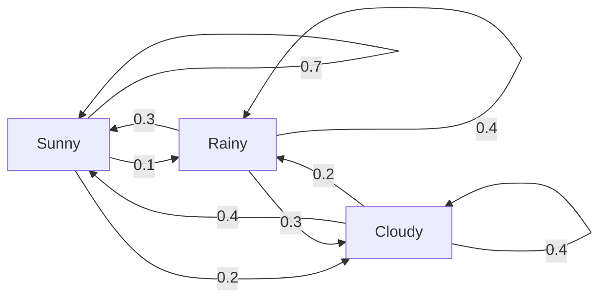
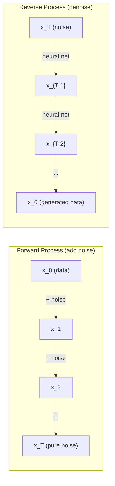

<!-- i18n:manual -->
# Случайные процессы

> Случайность со структурой. Математика за случайными блужданиями, цепями Маркова и диффузионными моделями.

**Type:** Learn
**Language:** Python
**Prerequisites:** Phase 1, Lessons 06-07 (probability, Bayes)
**Time:** ~75 minutes

## Learning Objectives

- Смоделировать одномерные и двумерные случайные блуждания и проверить рост смещения как sqrt(n)
- Построить симулятор цепи Маркова и вычислить её стационарное распределение через разложение по собственным векторам
- Реализовать MCMC методом Метрополиса-Гастингса и динамику Ланжевена для сэмплирования из целевых распределений
- Связать прямой диффузионный процесс с броуновским движением и объяснить, как обратный процесс порождает данные

> 🎒 **На пальцах.** Пьяный матрос идёт домой, шатаясь влево-вправо наугад. Куда он дойдёт через час? Ответ на этот шуточный вопрос лежит в основе и диффузионных моделей, рисующих картинки, и способа, которым языковая модель выбирает слова.

## The Problem

Многие AI-системы содержат случайность, развивающуюся во времени. Не статическую случайность, а структурированную, последовательную, где каждый шаг зависит от предыдущего.

Языковые модели порождают токены по одному. Каждый токен зависит от предыдущего контекста. Модель выдаёт распределение вероятностей, сэмплирует из него и идёт дальше. Это случайный процесс.

Диффузионные модели добавляют к изображению шум шаг за шагом, пока оно не превращается в чистые помехи. Затем разворачивают процесс, убирая шум по шагам, пока не проявится новое изображение. Прямой процесс — цепь Маркова. Обратный — выученная цепь Маркова, идущая назад.

Агенты обучения с подкреплением совершают действия в среде. Каждое действие с некоторой вероятностью ведёт в новое состояние. Агент следует случайной политике в случайном мире. Всё это — марковский процесс принятия решений.

Сэмплирование MCMC — хребет байесовского вывода — строит цепь Маркова, стационарное распределение которой и есть нужное вам апостериорное.

Всё это стоит на четырёх фундаментальных идеях:
1. Случайные блуждания — простейший случайный процесс
2. Цепи Маркова — структурированная случайность с матрицей переходов
3. Динамика Ланжевена — градиентный спуск с шумом
4. Метрополис-Гастингс — сэмплирование из любого распределения

## The Concept

### Random Walks

Начните в позиции 0. На каждом шаге бросайте честную монету. Орёл: шаг вправо (+1). Решка: шаг влево (-1).

После n шагов ваша позиция — сумма n случайных значений +/-1. Ожидаемая позиция равна 0 (блуждание без смещения). Но ожидаемое расстояние от начала растёт как sqrt(n).

Это контринтуитивно. Блуждание честное — никакого сноса ни в одну сторону. Но со временем оно уходит всё дальше и дальше от старта. Стандартное отклонение после n шагов равно sqrt(n).

```
Step 0:  Position = 0
Step 1:  Position = +1 or -1
Step 2:  Position = +2, 0, or -2
...
Step 100: Expected distance from origin ~ 10 (sqrt(100))
Step 10000: Expected distance from origin ~ 100 (sqrt(10000))
```

**In 2D** блуждание идёт вверх, вниз, влево или вправо с равной вероятностью. То же правило sqrt(n) применимо к расстоянию от начала. Путь вычерчивает узор, похожий на фрактал.

**Why sqrt(n)?** Каждый шаг равен +1 или -1 с равной вероятностью. После n шагов позиция S_n = X_1 + X_2 + ... + X_n, где каждый X_i равен +/-1. Дисперсия каждого шага равна 1, шаги независимы, значит Var(S_n) = n. Стандартное отклонение = sqrt(n). По центральной предельной теореме S_n / sqrt(n) сходится к стандартному нормальному распределению.

Это правило sqrt(n) встречается в ML повсюду. Шум SGD масштабируется как 1/sqrt(batch_size). Размерности представлений — как sqrt(d). Корень — визитная карточка независимых случайных сложений.

**Connection to Brownian motion.** Возьмите блуждание с шагом 1/sqrt(n) и n шагами в единицу времени. При n, стремящемся к бесконечности, блуждание сходится к броуновскому движению B(t) — непрерывному процессу, где B(t) распределён нормально со средним 0 и дисперсией t.

Броуновское движение — математический фундамент диффузии. Оно моделирует случайное дрожание частиц в жидкости, колебания цен акций и, что критично, шумовой процесс в диффузионных моделях.

**Gambler's ruin.** Блуждающий стартует в позиции k, с поглощающими барьерами в 0 и N. Какова вероятность дойти до N раньше, чем до 0? Для честного блуждания: P(дойти до N) = k/N. Удивительно просто и изящно. Это связано с теорией мартингалов — честное случайное блуждание является мартингалом (ожидаемое будущее значение равно текущему).

> 🎒 **На пальцах.** Проверьте на цифрах: за 100 шагов матрос отойдёт примерно на 10 шагов, за 10 000 шагов — примерно на 100. То есть в 100 раз больше шагов дают всего в 10 раз большее расстояние. Он топчется, а не идёт. Именно поэтому за час пути пьяный оказывается не так далеко от бара.

### Markov Chains

Цепь Маркова — система, переходящая между состояниями по фиксированным вероятностям. Ключевое свойство: следующее состояние зависит только от текущего, а не от истории.

```
P(X_{t+1} = j | X_t = i, X_{t-1} = ...) = P(X_{t+1} = j | X_t = i)
```

Это марковское свойство. Оно означает, что всю динамику можно описать матрицей переходов P:

```
P[i][j] = probability of going from state i to state j
```

Каждая строка P в сумме даёт 1 (куда-то перейти надо обязательно).

**Example -- Weather:**

```
States: Sunny (0), Rainy (1), Cloudy (2)

P = [[0.7, 0.1, 0.2],    (if sunny: 70% sunny, 10% rainy, 20% cloudy)
     [0.3, 0.4, 0.3],    (if rainy: 30% sunny, 40% rainy, 30% cloudy)
     [0.4, 0.2, 0.4]]    (if cloudy: 40% sunny, 20% rainy, 40% cloudy)
```

Начните в любом состоянии. После многих переходов распределение состояний сходится к стационарному распределению pi, где pi * P = pi. Это левый собственный вектор P с собственным значением 1.

Для погодной цепи стационарное распределение равно [0.55, 0.18, 0.27] — в долгую солнечно 55% времени независимо от начального состояния.



**Computing the stationary distribution.** Есть два подхода:

1. **Power method**: умножать любое начальное распределение на P многократно. После достаточного числа итераций оно сойдётся.
2. **Eigenvalue method**: найти левый собственный вектор P с собственным значением 1. Это собственный вектор P^T с собственным значением 1.

Оба подхода требуют, чтобы цепь удовлетворяла условиям сходимости.

**Convergence conditions.** Цепь Маркова сходится к единственному стационарному распределению, если она:
- **Irreducible**: из любого состояния достижимо любое другое
- **Aperiodic**: цепь не зациклена с фиксированным периодом

Большинство цепей, встречающихся в ML, удовлетворяют обоим условиям.

**Absorbing states.** Состояние поглощающее, если, попав в него, вы уже не выходите (P[i][i] = 1). Поглощающие цепи Маркова моделируют процессы с конечными состояниями: игра закончилась, клиент ушёл, последовательность токенов достигла конца текста.

**Mixing time.** Сколько шагов, пока цепь не станет «близка» к стационарному распределению? Формально — число шагов, пока полное вариационное расстояние до стационарности не упадёт ниже порога. Быстрое перемешивание = мало шагов. Спектральный зазор P (единица минус второе по величине собственное значение) управляет временем перемешивания. Больше зазор — быстрее перемешивание.

> 🎒 **На пальцах.** Марковское свойство — это «прошлое не помню, помню только сейчас». Погода завтра зависит от погоды сегодня, а какая была неделю назад — модели неважно. Упрощение грубое, зато считать легко, и на удивление часто хватает.

### Connection to Language Models

Порождение токенов в языковой модели — приблизительно марковский процесс. По текущему контексту модель выдаёт распределение по следующему токену. Температура управляет резкостью:

```
P(token_i) = exp(logit_i / temperature) / sum(exp(logit_j / temperature))
```

- Температура = 1.0: стандартное распределение
- Температура < 1.0: резче (детерминированнее)
- Температура > 1.0: площе (случайнее)
- Температура -> 0: argmax (жадный выбор)

Top-k сэмплирование обрезает до k самых вероятных токенов. Top-p (nucleus) обрезает до наименьшего набора токенов, чья суммарная вероятность превышает p. Оба меняют марковские вероятности переходов.

> 🎒 **На пальцах.** Температура — это ручка «насколько модель осторожничает». Возьмите два токена с логитами 2 и 1. При температуре 1.0 первый выигрывает с вероятностью около 73%. При 0.5 — уже 88%, модель почти всегда берёт очевидное. При 2.0 — только 62%, модель начинает рисковать. А при температуре, стремящейся к нулю, выбор превращается в жёсткий argmax: всегда первый токен, и ответы становятся одинаковыми от запуска к запуску.

### Brownian Motion

Непрерывный предел случайного блуждания. У позиции B(t) три свойства:
1. B(0) = 0
2. B(t) - B(s) распределена нормально со средним 0 и дисперсией t - s (для t > s)
3. Приращения на непересекающихся промежутках независимы

Броуновское движение непрерывно, но нигде не дифференцируемо — оно дрожит на любом масштабе. У пути фрактальная размерность 2 на плоскости.

В дискретном моделировании броуновское движение приближают так:

```
B(t + dt) = B(t) + sqrt(dt) * z,    where z ~ N(0, 1)
```

Масштабирование через sqrt(dt) важно. Оно берётся из центральной предельной теоремы, применённой к случайным блужданиям.

> 🎒 **На пальцах.** Броуновское движение открыл ботаник, разглядывая в микроскоп пыльцу в воде: пылинки дёргались туда-сюда без всякой причины. Причина оказалась в невидимых молекулах воды, толкающих пылинку со всех сторон. Тот же танец сегодня используют, чтобы рисовать картинки нейросетями.

### Langevin Dynamics

Градиентный спуск ищет минимум функции. Динамика Ланжевена ищет распределение вероятностей, пропорциональное exp(-U(x)/T), где U — функция энергии, а T — температура.

```
x_{t+1} = x_t - dt * gradient(U(x_t)) + sqrt(2 * T * dt) * z_t
```

На частицу действуют две силы:
1. **Gradient force** (-dt * gradient(U)): толкает к низкой энергии (как градиентный спуск)
2. **Random force** (sqrt(2*T*dt) * z): толкает в случайные стороны (исследование)

При температуре T = 0 это чистый градиентный спуск. При высокой температуре — почти случайное блуждание. При правильной температуре частица исследует энергетический ландшафт и проводит больше времени в низкоэнергетических областях.

**Connection to diffusion models.** Прямой процесс диффузионной модели:

```
x_t = sqrt(alpha_t) * x_{t-1} + sqrt(1 - alpha_t) * noise
```

Это цепь Маркова, постепенно смешивающая данные с шумом. После достаточного числа шагов x_T — чистый гауссов шум.

Обратный процесс — путь от шума обратно к данным — тоже цепь Маркова, но её вероятности переходов выучивает нейросеть. Сеть учится предсказывать шум, добавленный на каждом шаге, и вычитать его.



> 🎒 **На пальцах.** Динамика Ланжевена — это шарик в миске, который кто-то постоянно потряхивает. Без тряски он замрёт на дне. С сильной тряской выскочит из миски. С умеренной — будет прыгать вокруг дна, чаще внизу, реже наверху. Именно такое поведение и нужно, чтобы «сэмплировать» распределение, а не просто найти одну точку.

### MCMC: Markov Chain Monte Carlo

Иногда нужно сэмплировать из распределения p(x), которое можно вычислять (с точностью до константы), но нельзя сэмплировать напрямую. Классический пример — байесовские апостериорные: правдоподобие на априорное вы знаете, а нормировочная константа невычислима.

**Metropolis-Hastings** строит цепь Маркова, стационарное распределение которой и есть p(x):

1. Стартовать в некоторой позиции x
2. Предложить новую позицию x' из распределения предложений Q(x'|x)
3. Вычислить отношение принятия: a = p(x') * Q(x|x') / (p(x) * Q(x'|x))
4. Принять x' с вероятностью min(1, a). Иначе остаться в x.
5. Повторить.

Если Q симметрично (например, Q(x'|x) = Q(x|x') = N(x, sigma^2)), отношение упрощается до a = p(x') / p(x). Нужно только отношение вероятностей — нормировочная константа сокращается.

Цепь гарантированно сходится к p(x) при мягких условиях. Но сходимость может быть медленной, если предложение слишком мелкое (случайное блуждание) или слишком крупное (много отказов). Настройка предложения — искусство MCMC.

**Why it works.** Отношение принятия обеспечивает детальный баланс: вероятность быть в x и перейти в x' равна вероятности быть в x' и перейти в x. Детальный баланс означает, что p(x) — стационарное распределение цепи. Значит после достаточного числа шагов выборки приходят из p(x).

**Practical considerations:**
- **Burn-in**: отбросить первые N выборок. Цепи нужно время, чтобы дойти до стационарного распределения от стартовой точки.
- **Thinning**: оставлять каждую k-ю выборку, снижая автокорреляцию.
- **Multiple chains**: запустить несколько цепей из разных стартов. Если они сошлись к одному распределению, это свидетельство сходимости.
- **Acceptance rate**: для гауссовых предложений в d измерениях оптимальная доля принятия около 23% (Roberts & Rosenthal, 2001). Слишком высокая — цепь почти не двигается. Слишком низкая — всё отвергается.

> 🎒 **На пальцах.** Сокращение нормировочной константы — главный фокус метода. Вам не нужно знать, сколько всего в мире вариантов; достаточно уметь сравнивать два: «этот вариант вдвое лучше того». Как выбрать лучшее мороженое, не пробуя все сорта в мире — достаточно попарных сравнений.

### Stochastic Processes in AI

| Process | AI Application |
|---------|---------------|
| Случайное блуждание | Исследование в RL, представления Node2Vec |
| Цепь Маркова | Генерация текста, сэмплирование MCMC |
| Броуновское движение | Диффузионные модели (прямой процесс) |
| Динамика Ланжевена | Score-based генеративные модели, SGLD |
| Марковский процесс принятия решений | Обучение с подкреплением |
| Метрополис-Гастингс | Байесовский вывод, сэмплирование апостериорного |

```figure
random-walk-diffusion
```

## Build It

### Step 1: Random walk simulator

```python
import numpy as np

def random_walk_1d(n_steps, seed=None):
    rng = np.random.RandomState(seed)
    steps = rng.choice([-1, 1], size=n_steps)
    positions = np.concatenate([[0], np.cumsum(steps)])
    return positions


def random_walk_2d(n_steps, seed=None):
    rng = np.random.RandomState(seed)
    directions = rng.choice(4, size=n_steps)
    dx = np.zeros(n_steps)
    dy = np.zeros(n_steps)
    dx[directions == 0] = 1   # right
    dx[directions == 1] = -1  # left
    dy[directions == 2] = 1   # up
    dy[directions == 3] = -1  # down
    x = np.concatenate([[0], np.cumsum(dx)])
    y = np.concatenate([[0], np.cumsum(dy)])
    return x, y
```

Одномерное блуждание хранит накопленные суммы. Каждый шаг равен +1 или -1. После n шагов позиция — сумма. Дисперсия растёт линейно по n, значит стандартное отклонение растёт как sqrt(n).

### Step 2: Markov chain

```python
class MarkovChain:
    def __init__(self, transition_matrix, state_names=None):
        self.P = np.array(transition_matrix, dtype=float)
        self.n_states = len(self.P)
        self.state_names = state_names or [str(i) for i in range(self.n_states)]

    def step(self, current_state, rng=None):
        if rng is None:
            rng = np.random.RandomState()
        probs = self.P[current_state]
        return rng.choice(self.n_states, p=probs)

    def simulate(self, start_state, n_steps, seed=None):
        rng = np.random.RandomState(seed)
        states = [start_state]
        current = start_state
        for _ in range(n_steps):
            current = self.step(current, rng)
            states.append(current)
        return states

    def stationary_distribution(self):
        eigenvalues, eigenvectors = np.linalg.eig(self.P.T)
        idx = np.argmin(np.abs(eigenvalues - 1.0))
        stationary = np.real(eigenvectors[:, idx])
        stationary = stationary / stationary.sum()
        return np.abs(stationary)
```

Стационарное распределение — левый собственный вектор P с собственным значением 1. Мы находим его, вычисляя собственные векторы P^T (транспонирование превращает левые собственные векторы в правые).

> 🎒 **На пальцах.** Стационарное распределение — это «сколько процентов дней в году какая погода». Сегодня может быть дождь, завтра солнце, но в среднем за много лет доли устаканиваются. И самое интересное: эти доли не зависят от того, с какой погоды вы начали считать.

### Step 3: Langevin dynamics

```python
def langevin_dynamics(grad_U, x0, dt, temperature, n_steps, seed=None):
    rng = np.random.RandomState(seed)
    x = np.array(x0, dtype=float)
    trajectory = [x.copy()]
    for _ in range(n_steps):
        noise = rng.randn(*x.shape)
        x = x - dt * grad_U(x) + np.sqrt(2 * temperature * dt) * noise
        trajectory.append(x.copy())
    return np.array(trajectory)
```

Градиент толкает x к низкой энергии. Шум не даёт застрять. В равновесии распределение выборок пропорционально exp(-U(x)/temperature).

### Step 4: Metropolis-Hastings

```python
def metropolis_hastings(target_log_prob, proposal_std, x0, n_samples, seed=None):
    rng = np.random.RandomState(seed)
    x = np.array(x0, dtype=float)
    samples = [x.copy()]
    accepted = 0
    for _ in range(n_samples - 1):
        x_proposed = x + rng.randn(*x.shape) * proposal_std
        log_ratio = target_log_prob(x_proposed) - target_log_prob(x)
        if np.log(rng.rand()) < log_ratio:
            x = x_proposed
            accepted += 1
        samples.append(x.copy())
    acceptance_rate = accepted / (n_samples - 1)
    return np.array(samples), acceptance_rate
```

Алгоритм предлагает новую точку, проверяет, выше ли у неё вероятность (или принимает с вероятностью, пропорциональной отношению), и повторяет. Доля принятия должна быть около 23-50% для хорошего перемешивания.

> 🎒 **На пальцах.** Обратите внимание на строку с `np.log(rng.rand()) < log_ratio` — весь алгоритм держится на ней. Если новое место лучше, отношение больше единицы, логарифм положительный, и условие выполняется всегда. Если хуже — иногда всё равно переходим, с вероятностью, равной отношению. Именно эти «иногда» и не дают застрять.

## Use It

На практике для этих алгоритмов используют готовые библиотеки. Но понимание механики важно для отладки и настройки.

```python
import numpy as np

rng = np.random.RandomState(42)
walk = np.cumsum(rng.choice([-1, 1], size=10000))
print(f"Final position: {walk[-1]}")
print(f"Expected distance: {np.sqrt(10000):.1f}")
print(f"Actual distance: {abs(walk[-1])}")
```

### numpy for transition matrices

```python
import numpy as np

P = np.array([[0.7, 0.1, 0.2],
              [0.3, 0.4, 0.3],
              [0.4, 0.2, 0.4]])

distribution = np.array([1.0, 0.0, 0.0])
for _ in range(100):
    distribution = distribution @ P

print(f"Stationary distribution: {np.round(distribution, 4)}")
```

Умножайте начальное распределение на P многократно. После достаточного числа итераций оно сходится к стационарному распределению независимо от старта. Это степенной метод поиска доминирующего левого собственного вектора.

> 🎒 **На пальцах.** Начальное распределение [1, 0, 0] означает «сегодня точно солнечно». Прогоните сто умножений — и получите [0.55, 0.18, 0.27] независимо от того, с чего начали. Цепь буквально забывает своё прошлое, и это можно увидеть на своих числах.

### Connections to real frameworks

- **PyTorch diffusion:** `DDPMScheduler` в Hugging Face `diffusers` реализует прямую и обратную цепи Маркова
- **NumPyro / PyMC:** используют MCMC (сэмплер NUTS, улучшенная версия Метрополиса-Гастингса) для байесовского вывода
- **Gymnasium (RL):** функция шага среды задаёт марковский процесс принятия решений

### Verifying Markov chain convergence

```python
import numpy as np

P = np.array([[0.9, 0.1], [0.3, 0.7]])

eigenvalues = np.linalg.eigvals(P)
spectral_gap = 1 - sorted(np.abs(eigenvalues))[-2]
print(f"Eigenvalues: {eigenvalues}")
print(f"Spectral gap: {spectral_gap:.4f}")
print(f"Approximate mixing time: {1/spectral_gap:.1f} steps")
```

Спектральный зазор говорит, как быстро цепь забывает начальное состояние. Зазор 0.2 означает примерно 5 шагов до перемешивания. Зазор 0.01 — примерно 100 шагов. Всегда проверяйте это перед долгими симуляциями: медленно перемешивающаяся цепь тратит вычисления впустую.

> 🎒 **На пальцах.** Посчитаем зазор для матрицы из кода вручную. У любой матрицы переходов одно собственное значение равно 1, а второе для матрицы 2x2 равно сумме диагонали минус единица: 0.9 + 0.7 − 1 = 0.6. Значит зазор равен 1 − 0.6 = 0.4, а время перемешивания примерно 1 / 0.4 = 2.5 шага — цепь забывает старт почти сразу. Поставьте на диагональ 0.99 и 0.97 (состояния «липкие», система редко меняется) — зазор упадёт до 0.04, и ждать придётся уже 25 шагов.

## Ship It

Этот урок производит:
- `outputs/prompt-stochastic-process-advisor.md` -- промпт, помогающий определить, какой каркас случайных процессов подходит к конкретной задаче

## Connections

| Concept | Where it shows up |
|---------|------------------|
| Случайное блуждание | Графовые представления Node2Vec, исследование в RL |
| Цепь Маркова | Генерация токенов в LLM, сэмплирование MCMC |
| Броуновское движение | Прямой диффузионный процесс в DDPM, модели на основе СДУ |
| Динамика Ланжевена | Score-based генеративные модели, стохастическая динамика Ланжевена (SGLD) |
| Стационарное распределение | Цель сходимости MCMC, PageRank |
| Метрополис-Гастингс | Сэмплирование байесовского апостериорного, имитация отжига |
| Температура | Сэмплирование в LLM, больцмановское исследование в RL, имитация отжига |
| Время перемешивания | Скорость сходимости MCMC, анализ спектрального зазора |
| Поглощающее состояние | Токен конца последовательности, терминальные состояния в RL |
| Детальный баланс | Гарантия корректности MCMC-сэмплеров |

Диффузионные модели заслуживают отдельного внимания. DDPM (Ho et al., 2020) задаёт прямую цепь Маркова:

```
q(x_t | x_{t-1}) = N(x_t; sqrt(1-beta_t) * x_{t-1}, beta_t * I)
```

где beta_t — расписание шума. После T шагов x_T приблизительно равно N(0, I). Обратный процесс параметризуется нейросетью, предсказывающей шум:

```
p_theta(x_{t-1} | x_t) = N(x_{t-1}; mu_theta(x_t, t), sigma_t^2 * I)
```

Каждый шаг генерации — шаг в выученной цепи Маркова. Понять цепи Маркова значит понять, как и почему диффузионные модели порождают данные.

SGLD (Stochastic Gradient Langevin Dynamics) объединяет градиентный спуск по mini-batch с ланжевеновским шумом. Вместо полного градиента вы используете стохастическую оценку и добавляете откалиброванный шум. По мере затухания learning rate SGLD переходит от оптимизации к сэмплированию — вы бесплатно получаете приближённые выборки байесовского апостериорного. Это один из простейших способов получить оценки неопределённости от нейросети.

Ключевая мысль, объединяющая все эти связи: случайные процессы — не просто теоретические инструменты. Это вычислительные механизмы внутри современных AI-систем. Когда вы крутите температуру языковой модели, вы настраиваете цепь Маркова. Когда обучаете диффузионную модель, вы учитесь разворачивать процесс, похожий на броуновское движение. Когда запускаете байесовский вывод, вы строите цепь, сходящуюся к апостериорному распределению.

> 🎒 **На пальцах.** Диффузионная модель по-простому: возьмите фотографию и 1000 раз подсыпьте немного шума, пока не останется телевизионная рябь. Теперь научите сеть делать один шаг назад — из чуть более зашумлённой картинки получать чуть менее зашумлённую. Прогоните эту сеть 1000 раз от чистого шума — и она нарисует новую фотографию, которой никогда не существовало.

## Exercises

1. **Simulate 1000 random walks of 10000 steps.** Нарисуйте распределение конечных позиций. Убедитесь, что оно примерно гауссово со средним 0 и стандартным отклонением sqrt(10000) = 100.

2. **Build a text generator using a Markov chain.** Обучите на небольшом корпусе: для каждого слова посчитайте переходы к следующему. Постройте матрицу переходов. Порождайте новые предложения, сэмплируя из цепи.

3. **Implement simulated annealing** через Метрополиса-Гастингса. Стартуйте с высокой температуры (принимать почти всё) и постепенно охлаждайте (принимать только улучшения). Найдите с её помощью минимум функции со множеством локальных минимумов.

4. **Compare Langevin dynamics at different temperatures.** Сэмплируйте из потенциала с двумя ямами U(x) = (x^2 - 1)^2. При низкой температуре выборки скучиваются в одной яме. При высокой — расползаются по обеим. Найдите критическую температуру, при которой цепь начинает перемешиваться между ямами.

5. **Implement the forward diffusion process.** Начните с одномерного сигнала (например, синусоиды). Постепенно добавляйте шум за 100 шагов по линейному расписанию. Покажите, как сигнал деградирует до чистого шума. Затем реализуйте простой шумоподавитель, разворачивающий процесс (пусть даже наивный, просто вычитающий оценённый шум).

> 🎒 **На пальцах.** Второе задание — самое весёлое. Марковский генератор текста работает так: «после слова "мама" чаще всего идёт "мыла"». Обучите на любимой книге и получите бессвязный, но узнаваемо похожий на автора текст. Это прадедушка ChatGPT: та же идея, только память на одно слово вместо тысяч.

## Key Terms

| Term | What people say | What it actually means |
|------|----------------|----------------------|
| Random walk | «Движение по броску монеты» | Процесс, где позиция меняется случайными приращениями на каждом шаге |
| Markov property | «Без памяти» | Будущее зависит только от настоящего состояния, а не от истории |
| Transition matrix | «Таблица вероятностей» | P[i][j] = вероятность перейти из состояния i в состояние j |
| Stationary distribution | «Среднее в долгую» | Распределение pi, для которого pi*P = pi — равновесие цепи |
| Brownian motion | «Случайное дрожание» | Непрерывный предел случайного блуждания, B(t) ~ N(0, t) |
| Langevin dynamics | «Градиентный спуск с шумом» | Правило обновления, объединяющее детерминированный градиент и случайное возмущение |
| MCMC | «Идти к цели блужданием» | Построение цепи Маркова, стационарное распределение которой — нужное вам |
| Metropolis-Hastings | «Предложить и принять/отвергнуть» | Алгоритм MCMC, использующий отношения принятия для гарантии сходимости |
| Temperature | «Ручка случайности» | Параметр, управляющий балансом между исследованием и эксплуатацией |
| Diffusion process | «Шум туда, шум обратно» | Вперёд: постепенно добавлять шум. Назад: постепенно убирать. Так порождаются данные. |

## Further Reading

- **Ho, Jain, Abbeel (2020)** -- "Denoising Diffusion Probabilistic Models." Статья про DDPM, запустившая революцию диффузионных моделей. Понятный вывод прямой и обратной цепей Маркова.
- **Song & Ermon (2019)** -- "Generative Modeling by Estimating Gradients of the Data Distribution." Score-based подход с динамикой Ланжевена для сэмплирования.
- **Roberts & Rosenthal (2004)** -- "General state space Markov chains and MCMC algorithms." Теория того, когда и почему MCMC работает.
- **Norris (1997)** -- "Markov Chains." Стандартный учебник. Покрывает сходимость, стационарные распределения и времена достижения.
- **Welling & Teh (2011)** -- "Bayesian Learning via Stochastic Gradient Langevin Dynamics." Объединяет SGD с динамикой Ланжевена для масштабируемого байесовского вывода.
