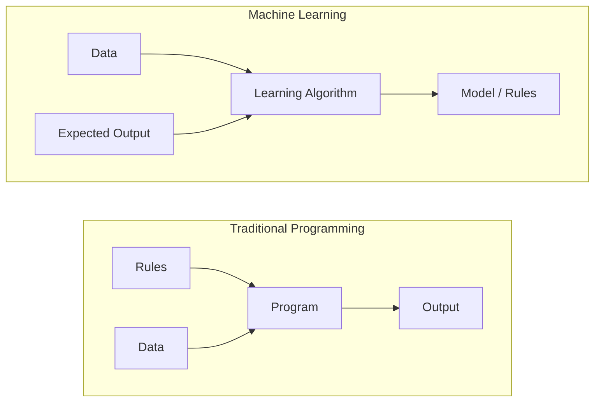
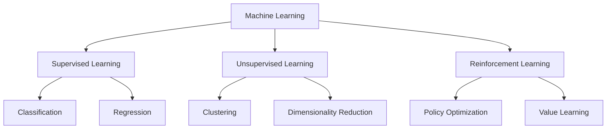
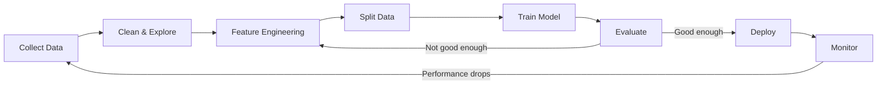
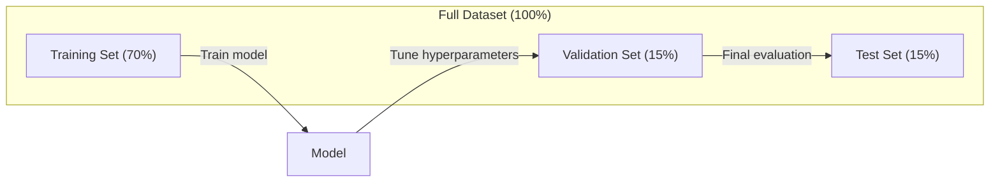
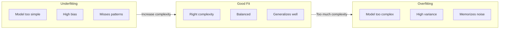
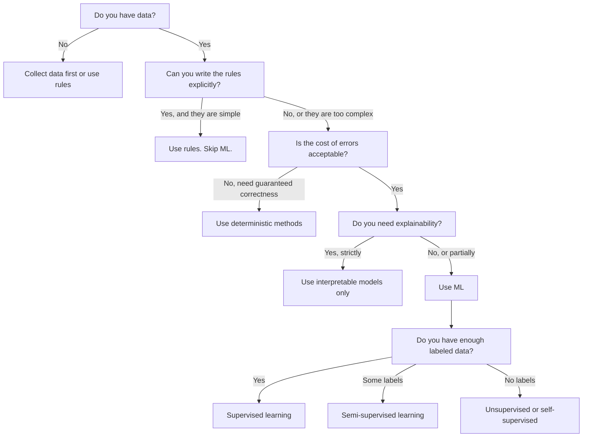

<!-- i18n:manual -->
# Что такое машинное обучение

> Машинное обучение — это когда компьютер сам находит закономерности в данных, вместо того чтобы вы писали правила руками.

**Type:** Learn
**Languages:** Python
**Prerequisites:** Phase 1 (Math Foundations)
**Time:** ~45 minutes

## Learning Objectives

- Объяснить разницу между обучением с учителем, без учителя и с подкреплением и определять, какой тип подходит к задаче
- Реализовать классификатор по ближайшему центроиду с нуля и сравнить его со случайной базой
- Отличать задачи классификации от регрессии и подбирать подходящую функцию потерь для каждой
- Оценивать, подходит ли бизнес-задача для ML или её лучше решить обычными правилами

> 🎒 **На пальцах.** Вы не объясняете ребёнку словами, чем кошка отличается от собаки. Вы показываете сто кошек и сто собак, и он сам начинает различать. Машинное обучение работает ровно так же.

## The Problem

Вы хотите сделать спам-фильтр. Традиционный подход: сесть и написать сотни правил. «Если в письме есть "БЕСПЛАТНЫЕ ДЕНЬГИ" — спам. Если больше трёх восклицательных знаков — спам». Вы тратите недели на правила. Потом спамеры меняют формулировки. Правила ломаются. Вы пишете новые. Цикл бесконечен.

Машинное обучение переворачивает это. Вместо написания правил вы даёте компьютеру тысячи размеченных писем («спам» или «не спам») и позволяете ему вывести правила самому. Компьютер находит закономерности, о которых вы бы никогда не подумали. Когда спамеры меняют тактику, вы переобучаете модель на новых данных вместо переписывания кода.

Этот сдвиг от «программирования правил» к «обучению на данных» — ядро машинного обучения. Каждый рекомендательный движок, голосовой ассистент, беспилотный автомобиль и языковая модель работают так.

> 🎒 **На пальцах.** Представьте, что вы объясняете инопланетянину, как отличить смешную шутку от несмешной. Правилами не выйдет: «смешное» не описывается списком условий. А вот показать тысячу примеров — можно. Именно такие задачи и решает ML.

## The Concept

### Learning From Data, Not Rules

Традиционное программирование и машинное обучение решают задачи в противоположных направлениях.



Традиционное программирование: правила пишете вы. Программа применяет их к данным и выдаёт результат.

Машинное обучение: вы даёте данные и ожидаемые результаты. Алгоритм сам находит правила.

«Модель», получившаяся после обучения, И ЕСТЬ эти правила, закодированные числами (весами, параметрами). Она обобщает увиденные примеры, чтобы делать предсказания на данных, которых никогда не видела.

> 🎒 **На пальцах.** В школе вам дают формулу и задачу — вы считаете ответ. Тут наоборот: вам дают задачи с ответами, а вы должны догадаться, по какой формуле их решали. Машинное обучение решает именно эту обратную задачу.

### The Three Types of Machine Learning



**Supervised Learning**: У вас есть пары «вход-выход». Модель учится переводить входы в выходы.
- «Вот 10 000 фотографий с подписями кошка или собака. Научись их различать.»
- «Вот характеристики домов и их цены. Научись предсказывать цену.»

**Unsupervised Learning**: У вас есть только входы. Меток нет. Модель находит структуру сама.
- «Вот 10 000 историй покупок. Найди естественные группы.»
- «Вот тысячемерные точки данных. Сожми до двух измерений, сохранив структуру.»

**Reinforcement Learning**: Агент совершает действия в среде и получает награды или наказания. Он учится стратегии (политике), максимизирующей суммарную награду.
- «Играй в эту игру. +1 за победу, -1 за поражение. Придумай стратегию.»
- «Управляй этой рукой робота. +1 за поднятый предмет, -0.01 за каждую потраченную секунду.»

Большая часть того, что вы будете строить на практике, — обучение с учителем. Обучение без учителя часто используют для предобработки и разведки данных. Обучение с подкреплением питает игровой AI, робототехнику и RLHF для языковых моделей.

> 🎒 **На пальцах.** Три способа научиться. С учителем: вам показывают задачу и правильный ответ. Без учителя: вам дают кучу вещей и просят разложить по кучкам, как считаете нужным. С подкреплением: вас никто ничему не учит, но за хорошие поступки хвалят, за плохие ругают. Так учат собаку командам.

### Beyond the Big Three

Три категории выше выглядят чётко, но в реальном ML границы часто размываются.

**Semi-supervised learning** использует маленький набор размеченных данных и большой неразмеченный. У вас может быть 100 размеченных медицинских снимков и 100 000 неразмеченных. Техники:

- **Label propagation:** Построить граф, соединяющий похожие точки. Метки расползаются от размеченных узлов к неразмеченным соседям по графу.
- **Pseudo-labeling:** Обучить модель на размеченных данных, предсказать ею метки для неразмеченных, затем переобучить на всём вместе. Модель сама себе создаёт обучающую выборку.
- **Consistency regularization:** Модель должна давать одно и то же предсказание на вход и на его слегка изменённую версию. Это работает даже без меток.

**Self-supervised learning** создаёт разметку из самих данных. Человеческие метки не нужны вообще. Модель придумывает себе задачу предсказания из структуры данных.

- **Masked language modeling (BERT):** Спрятать 15% слов в предложении, обучить модель предсказывать пропущенные. «Метки» берутся из исходного текста.
- **Contrastive learning (SimCLR):** Взять картинку, сделать две изменённые версии. Обучить модель понимать, что они из одной картинки, и отличать их от версий других картинок.
- **Next-token prediction (GPT):** Предсказать следующее слово по всем предыдущим. Любой текстовый документ становится обучающим примером.

Это не отдельные категории от большой тройки. Это стратегии, комбинирующие идеи обучения с учителем и без. Self-supervised формально относится к обучению с учителем (модель что-то предсказывает), но метки порождаются автоматически, а не людьми.

> 🎒 **На пальцах.** Self-supervised — как учиться по учебнику с ответами в конце, закрывая ответ ладонью. Вы сами создаёте себе проверку из того же материала. Именно так обучались все языковые модели: закрыли следующее слово, попробовали угадать, подсмотрели. Миллиард раз.

### Classification vs Regression

Две главные задачи обучения с учителем.

| Aspect | Classification | Regression |
|--------|---------------|------------|
| Выход | Дискретные категории | Непрерывные числа |
| Пример | «Это письмо спам?» | «Какая будет цена дома?» |
| Пространство выхода | {кошка, собака, птица} | Любое вещественное число |
| Функция потерь | Cross-entropy, accuracy | Среднеквадратичная ошибка, MAE |
| Решение | Границы между классами | Кривая, проходящая через данные |

Классификация отвечает на вопрос «какая категория?». Регрессия — на вопрос «сколько?».

Некоторые задачи можно поставить и так, и так. Предсказать, вырастет акция или упадёт, — классификация. Предсказать точную цену — регрессия.

> 🎒 **На пальцах.** «Будет ли завтра дождь?» — классификация, ответ да или нет. «Сколько миллиметров осадков выпадет?» — регрессия, ответ число. Один и тот же прогноз погоды, два разных вопроса и два разных типа модели.

### The ML Workflow

Любой проект машинного обучения проходит один и тот же конвейер, независимо от алгоритма.



**Collect Data**: Собрать сырые данные. Больше данных почти всегда лучше, но качество важнее количества.

**Clean & Explore**: Обработать пропуски, убрать дубликаты, посмотреть на распределения, найти аномалии. Этот шаг часто занимает 60-80% времени всего проекта.

**Feature Engineering**: Превратить сырые данные в признаки, пригодные для модели. Из даты сделать день недели. Отнормировать числовые столбцы. Закодировать категориальные переменные. Хорошие признаки важнее модных алгоритмов.

**Split Data**: Разделить на обучающую, валидационную и тестовую выборки. Модель обучается на обучающей, гиперпараметры настраиваются на валидационной, итоговое качество измеряется на тестовой.

**Train Model**: Подать обучающие данные в алгоритм. Алгоритм подстраивает внутренние параметры, минимизируя функцию потерь.

**Evaluate**: Измерить качество на валидационной/тестовой выборке. Если качество неприемлемо, вернуться назад и попробовать другие признаки, алгоритмы или гиперпараметры.

**Deploy**: Вывести модель в продакшн, где она делает предсказания на новых данных.

**Monitor**: Следить за качеством во времени. Распределения данных меняются (data drift), модели деградируют. Когда качество падает — переобучать.

> 🎒 **На пальцах.** Обратите внимание на цифру: 60-80% времени уходит на чистку данных, а не на «обучение нейросети». В кино показывают, как программист запускает обучение и смотрит на красивые графики. В жизни он неделю выясняет, почему в столбце «возраст» встречается значение 999.

### Training, Validation, and Test Splits

Это то, что новички понимают неправильно чаще всего. Вы обязаны оценивать модель на данных, которых она не видела при обучении. Иначе вы измеряете зубрёжку, а не понимание.



| Split | Purpose | When used | Typical size |
|-------|---------|-----------|-------------|
| Training | Модель учится на этих данных | Во время обучения | 60-80% |
| Validation | Настройка гиперпараметров, сравнение моделей | После каждого прогона обучения | 10-20% |
| Test | Итоговая несмещённая оценка качества | Один раз, в самом конце | 10-20% |

Тестовая выборка священна. Вы смотрите на неё ровно один раз. Если вы продолжаете подкручивать модель по результатам на тесте, вы фактически обучаетесь на тесте, и заявленные цифры ничего не значат.

Для маленьких наборов данных используйте k-кратную кросс-валидацию: разделить данные на k частей, обучаться на k-1 частях, проверяться на оставшейся, поменять части местами и усреднить результаты.

> 🎒 **На пальцах.** Тестовая выборка — это экзамен. Обучающая — домашние задания. Валидационная — пробник перед экзаменом. Если вы решаете экзаменационные задачи заранее и по ним готовитесь, оценка перестаёт что-либо значить. Именно поэтому на тест смотрят один раз и в самом конце.

### Overfitting vs Underfitting



**Underfitting**: Модель слишком проста, чтобы уловить закономерности в данных. Прямая линия пытается описать кривую зависимость. Ошибка на обучении высокая. На тесте тоже высокая.

**Overfitting**: Модель слишком сложна и заучивает обучающие данные вместе с их шумом. Извилистая кривая проходит через каждую обучающую точку, но проваливается на новых данных. Ошибка на обучении низкая. На тесте высокая.

**Good fit**: Модель улавливает настоящие закономерности, не заучивая шум. Ошибки на обучении и на тесте обе разумно низкие.

Признаки переобучения:
- Точность на обучении сильно выше, чем на валидации
- Модель хорошо работает на обучающих данных и плохо на новых
- Добавление данных улучшает качество (модель зубрила, а не училась)

Как лечить переобучение:
- Собрать больше обучающих данных
- Уменьшить сложность модели (меньше параметров, проще архитектура)
- Регуляризация (добавить штраф за большие веса)
- Dropout (случайно занулять нейроны при обучении)
- Ранняя остановка (прекратить обучение, когда ошибка на валидации начала расти)

Как лечить недообучение:
- Взять более сложную модель
- Добавить признаков
- Уменьшить регуляризацию
- Учить дольше

> 🎒 **На пальцах.** Переобучение — это ученик, вызубривший ответы к конкретным задачам из учебника. На тех же задачах — пятёрка. Чуть поменяли числа — двойка. Недообучение — ученик, который выучил только «умножать на два» и пытается этим решать всё подряд. Нужен третий: тот, кто понял принцип.

### The Bias-Variance Tradeoff

Это математический каркас, стоящий за переобучением и недообучением.

**Bias**: Ошибка из-за неверных предположений в модели. У линейной модели высокое смещение, если истинная зависимость нелинейна. Высокое смещение ведёт к недообучению.

**Variance**: Ошибка из-за чувствительности к мелким колебаниям обучающих данных. Модель с высокой дисперсией даёт совершенно разные предсказания при обучении на разных подвыборках. Высокая дисперсия ведёт к переобучению.

| Model complexity | Bias | Variance | Result |
|-----------------|------|----------|--------|
| Слишком низкая (линейная модель для кривых данных) | Высокое | Низкая | Недообучение |
| В самый раз | Среднее | Средняя | Хорошее обобщение |
| Слишком высокая (полином степени 20 на 10 точках) | Низкое | Высокая | Переобучение |

Полная ошибка = Bias^2 + Variance + неустранимый шум

Неустранимый шум убрать нельзя (это случайность в самих данных). Ваша задача — найти золотую середину, где bias^2 + variance минимальны.

> 🎒 **На пальцах.** Стрельба по мишени. Высокое смещение — все пули кучно легли, но не в центр: прицел сбит. Высокая дисперсия — пули разлетелись по всей мишени: рука дрожит. Идеал — кучно и в центр. Ошибки эти разные, и лечатся они разным.

### No Free Lunch Theorem

Не существует единственного алгоритма, лучшего для всех задач. Алгоритм, хорошо работающий на одном классе задач, будет плох на другом. Поэтому специалисты по данным пробуют несколько алгоритмов и сравнивают результаты.

На практике выбор зависит от:
- Сколько у вас данных
- Сколько признаков
- Линейна зависимость или нет
- Нужна ли интерпретируемость
- Сколько вычислений вы можете себе позволить

### When NOT to Use Machine Learning

ML мощный инструмент, но не всегда подходящий. Прежде чем тянуться к модели, спросите, нужна ли она вообще.

**Do not use ML when:**

- **Правила простые и чёткие.** Расчёт налога, алгоритмы сортировки, перевод единиц. Если логика умещается в несколько if-ов, модель добавит сложности без всякой пользы.
- **Данных нет или очень мало.** ML нужны примеры для обучения. На 10 точках ничего осмысленного не натренируешь. Сначала соберите данные.
- **Цена ошибки катастрофична и нужна гарантированная правильность.** Расчёт дозы лекарства, управление ядерным реактором, криптографическая проверка. Модели ML вероятностны. Они иногда ошибаются. Если «иногда ошибается» недопустимо — используйте детерминированные методы.
- **Задачу решает таблица или простая эвристика.** Если простой порог или таблица покрывают 99% случаев, добавление ML увеличит стоимость поддержки без заметного выигрыша.
- **Вы не можете объяснить решение, а объяснимость обязательна.** Регулируемые отрасли (кредитование, страхование, правосудие) иногда требуют, чтобы каждое решение было полностью объяснимо. Некоторые модели интерпретируемы (линейная регрессия, небольшие деревья решений). Большинство — нет.
- **Задача меняется быстрее, чем вы успеваете переобучать.** Если правила меняются ежедневно, а переобучение занимает неделю, модель всегда устаревшая.

Пользуйтесь этой блок-схемой решений:



> 🎒 **На пальцах.** Самый ценный раздел урока — и самый пропускаемый. Калькулятор чаевых не надо делать нейросетью. Умножение на 0.1 работает всегда и не ошибается, а модель будет иногда врать и потребует данных, серверов и присмотра. ML — это когда правило написать нельзя, а не когда лень.

```figure
f3-learning-boundary
```

## Build It

Код в `code/ml_intro.py` реализует классификатор по ближайшему центроиду с нуля — простейший из возможных алгоритмов ML. Он показывает основную идею: научиться на данных, затем предсказывать на новых.

### Step 1: Nearest Centroid Classifier from Scratch

Классификатор по ближайшему центроиду вычисляет центр (среднее) каждого класса в обучающих данных. Для предсказания он относит новую точку к тому классу, чей центр ближе.

```python
class NearestCentroid:
    def fit(self, X, y):
        self.classes = np.unique(y)
        self.centroids = np.array([
            X[y == c].mean(axis=0) for c in self.classes
        ])

    def predict(self, X):
        distances = np.array([
            np.sqrt(((X - c) ** 2).sum(axis=1))
            for c in self.centroids
        ])
        return self.classes[distances.argmin(axis=0)]
```

Это весь алгоритм целиком. Обучение считает два средних. Предсказание считает расстояния. Ни градиентного спуска, ни итераций, ни гиперпараметров.

> 🎒 **На пальцах.** По-человечески: вычислили «среднюю кошку» и «среднюю собаку». Пришло новое животное — смотрим, на кого оно похоже больше. Всё. Первый в вашей жизни алгоритм машинного обучения уместился в восемь строк.

### Step 2: Train on Synthetic Data

Мы генерируем двумерный набор данных с двумя слегка перекрывающимися классами. Классификатор по центроиду проводит линейную границу решения между центрами классов.

```python
rng = np.random.RandomState(42)
X_class0 = rng.randn(100, 2) + np.array([1.0, 1.0])
X_class1 = rng.randn(100, 2) + np.array([-1.0, -1.0])
X = np.vstack([X_class0, X_class1])
y = np.array([0] * 100 + [1] * 100)
```

### Step 3: Compare Against a Baseline

Любую модель ML надо сравнивать с тривиальной базой. Здесь база предсказывает случайный класс. Если ваша модель не обыгрывает случайное угадывание, что-то не так.

```python
baseline_preds = rng.choice([0, 1], size=len(y_test))
baseline_acc = np.mean(baseline_preds == y_test)
```

Классификатор по центроиду должен дать около 90%+ точности на этих чистых данных. Случайная база даёт около 50%.

> 🎒 **На пальцах.** Всегда спрашивайте: «а сколько будет, если просто угадывать?» Модель с точностью 85% звучит отлично, пока не выяснится, что монетка даёт 50%, а «всегда отвечать да» — 84%. Без базы для сравнения цифра точности бессмысленна.

### Why This Matters

Классификатор по ближайшему центроиду до смешного прост. У него нет гиперпараметров, итераций, градиентного спуска. Но он схватывает фундаментальный шаблон ML:

1. **Learn** представление из обучающих данных (центроиды)
2. **Predict** на новых данных, используя это представление (ближайшее расстояние)
3. **Evaluate** относительно базы (случайное угадывание)

Каждый алгоритм ML, от логистической регрессии до трансформеров, следует этой же трёхшаговой схеме. Представление усложняется, но порядок действий тот же.

### Step 4: What the Centroid Classifier Cannot Do

Классификатор по ближайшему центроиду предполагает, что каждый класс образует единое пятно. Он проводит линейные границы решения. Он проваливается, когда:

- У классов несколько скоплений (например, цифру «1» пишут несколькими разными способами)
- Граница решения нелинейна (например, один класс обёрнут вокруг другого)
- У признаков сильно разные масштабы (расстояние определяется признаком с наибольшим масштабом)

Эти ограничения и мотивируют все остальные алгоритмы, которые вы изучите. K ближайших соседей справляется с несколькими скоплениями. Деревья решений — с нелинейными границами. Масштабирование признаков чинит проблему масштабов. Каждый урок вырастает из ограничений предыдущего.

> 🎒 **На пальцах.** Проблема масштабов наглядна: если один признак — рост в миллиметрах (1750), а другой — количество детей (2), то расстояние определяется ростом целиком, а дети вообще не влияют. Как сравнивать людей по «росту плюс возраст», складывая сантиметры с годами — числа-то складываются, а смысла нет.

## Use It

В sklearn есть `NearestCentroid` и генераторы синтетических данных:

```python
from sklearn.neighbors import NearestCentroid
from sklearn.datasets import make_classification
from sklearn.model_selection import train_test_split

X, y = make_classification(
    n_samples=500, n_features=2, n_redundant=0,
    n_clusters_per_class=1, random_state=42
)
X_train, X_test, y_train, y_test = train_test_split(X, y, test_size=0.3)

clf = NearestCentroid()
clf.fit(X_train, y_train)
print(f"Accuracy: {clf.score(X_test, y_test):.3f}")
```

## Ship It

Этот урок производит `outputs/prompt-ml-problem-framer.md` -- промпт, превращающий расплывчатые бизнес-задачи в конкретные ML-задачи. Дайте ему описание проблемы («хотим снизить отток» или «предсказать спрос на следующий квартал»), и он определит тип обучения, задаст цель предсказания, перечислит кандидатов в признаки, выберет метрику успеха, установит базу и укажет на подводные камни вроде утечки данных или дисбаланса классов. Используйте его в начале любого ML-проекта, чтобы не построить не то.

## Key Terms

| Term | What people say | What it actually means |
|------|----------------|----------------------|
| Model | «Искусственный интеллект» | Математическая функция с обучаемыми параметрами, переводящая входы в выходы |
| Training | «Обучаем нейросеть» | Запуск алгоритма оптимизации, подстраивающего параметры модели так, чтобы предсказания совпадали с известными ответами |
| Feature | «Входной столбец» | Измеримое свойство данных, которое модель использует для предсказаний |
| Label | «Правильный ответ» | Известный выход для обучающего примера, по которому считается сигнал ошибки |
| Hyperparameter | «Настройка, которую крутят» | Параметр, задаваемый до обучения и управляющий процессом обучения (learning rate, число слоёв) |
| Loss function | «Насколько модель неправа» | Функция, измеряющая разрыв между предсказанным и настоящим выходом; обучение старается её уменьшить |
| Overfitting | «Она зазубрила тест» | Модель выучила шум обучающей выборки вместо общих закономерностей и проваливается на новых данных |
| Underfitting | «Она ничему не научилась» | Модель слишком проста, чтобы уловить настоящие закономерности в данных |
| Generalization | «Работает на новых данных» | Способность модели делать точные предсказания на данных, которых не было при обучении |
| Cross-validation | «Проверка на разных кусках» | Многократное разбиение данных на обучение/тест с усреднением результатов; даёт более надёжную оценку качества |
| Regularization | «Держим веса маленькими» | Добавление к функции потерь штрафа, отбивающего охоту к излишне сложным моделям |
| Data drift | «Мир изменился» | Статистическое распределение поступающих данных со временем сдвигается, ухудшая качество модели |

## Exercises

1. Возьмите любой набор данных (например, Iris, Titanic). Разбейте его 70/15/15 на обучение/валидацию/тест. Объясните, почему нельзя настраивать гиперпараметры на тестовой выборке.
2. Перечислите три реальные задачи. Для каждой определите, классификация это, регрессия или кластеризация, и с учителем она или без.
3. Модель даёт 99% точности на обучающих данных и 60% на тестовых. Поставьте диагноз и перечислите три способа это починить.

> 🎒 **На пальцах.** Третье задание — диагноз очевиден: переобучение, разрыв в 39 процентных пунктов. Модель зазубрила обучающую выборку. Три лечения из списка выше: больше данных, проще модель, регуляризация. Такой разрыв вы увидите в реальной работе десятки раз.

## Further Reading

- [An Introduction to Statistical Learning](https://www.statlearning.com/) - бесплатный учебник, покрывающий все классические методы ML с практическими примерами
- [Google's Machine Learning Crash Course](https://developers.google.com/machine-learning/crash-course) - сжатое визуальное введение в понятия ML
- [Scikit-learn User Guide](https://scikit-learn.org/stable/user_guide.html) - практический справочник по реализации ML на Python
