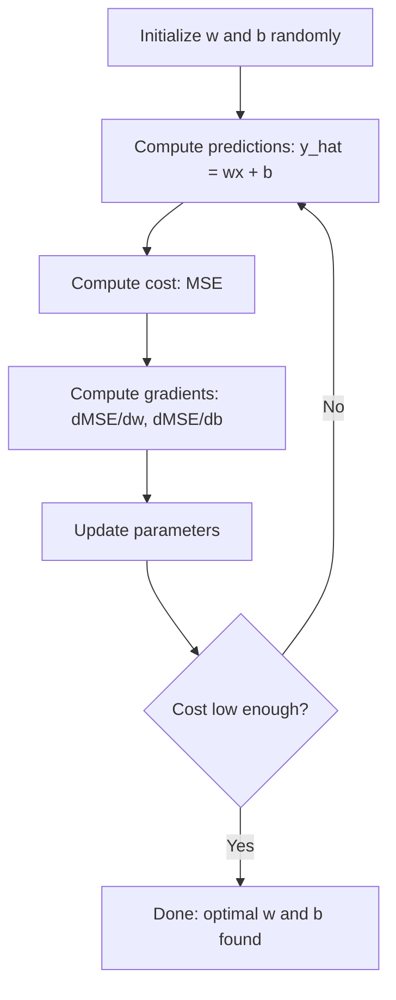

<!-- i18n:manual -->
# Линейная регрессия

> Линейная регрессия проводит лучшую прямую через ваши данные. Это «hello world» машинного обучения.

**Type:** Build
**Languages:** Python
**Prerequisites:** Phase 1 (Linear Algebra, Calculus, Optimization), Phase 2 Lesson 1
**Time:** ~90 minutes

## Learning Objectives

- Вывести правила обновления градиентного спуска для среднеквадратичной ошибки и реализовать линейную регрессию с нуля
- Сравнить градиентный спуск и нормальное уравнение по вычислительной сложности и понять, когда что применять
- Построить множественную линейную регрессию со стандартизацией признаков и истолковать выученные веса
- Объяснить, как Ridge-регрессия (L2-регуляризация) предотвращает переобучение, штрафуя большие веса

> 🎒 **На пальцах.** Вы отмечаете на графике рост и вес одноклассников и проводите через облако точек прямую «на глазок». Линейная регрессия делает то же самое, только не на глазок, а самой удачной прямой из всех возможных.

## The Problem

У вас есть данные: площади домов и цены их продажи. Вы хотите предсказать цену нового дома по его площади. Можно прикинуть по диаграмме рассеяния, но вам нужна формула. Нужна прямая, наилучшим образом описывающая данные, чтобы подставить любую площадь и получить прогноз цены.

Линейная регрессия даёт эту прямую. Что важнее, она вводит весь цикл обучения ML: задать модель, задать функцию стоимости, оптимизировать параметры. Каждый алгоритм ML следует этой схеме. Освойте её здесь, на простейшем случае, и будете узнавать её везде.

Это не только для простых задач. Линейную регрессию используют в продакшене для прогноза спроса, анализа A/B-тестов, финансового моделирования и как базовую линию для любой задачи регрессии.

## The Concept

### The Model

Линейная регрессия предполагает линейную связь между входом (x) и выходом (y):

```
y = wx + b
```

- `w` (вес/наклон): насколько меняется y при увеличении x на 1
- `b` (смещение/свободный член): значение y при x = 0

Для нескольких входов (признаков) это расширяется до:

```
y = w1*x1 + w2*x2 + ... + wn*xn + b
```

Или в векторной форме: `y = w^T * x + b`

Цель: найти такие w и b, при которых предсказанный y максимально близок к настоящему y на всех обучающих примерах.

> 🎒 **На пальцах.** `y = wx + b` — это уравнение прямой из школьной геометрии, просто буквы другие. `w` — насколько круто прямая идёт вверх, `b` — на какой высоте она пересекает вертикальную ось. Всё машинное обучение начинается с того, что вы подбираете эти два числа.

### The Cost Function (Mean Squared Error)

Как измерить «максимально близко»? Нужно одно число, показывающее, насколько вы ошибаетесь. Самый частый выбор — среднеквадратичная ошибка (MSE):

```
MSE = (1/n) * sum((y_predicted - y_actual)^2)
```

Почему квадрат? По двум причинам. Во-первых, он наказывает большие ошибки сильнее маленьких (ошибка в 10 в 100 раз хуже ошибки в 1, а не в 10). Во-вторых, квадратичная функция гладкая и всюду дифференцируемая, что делает оптимизацию простой.

Функция стоимости образует поверхность. Для одного веса w и смещения b поверхность MSE выглядит как чаша (выпуклый параболоид). Дно чаши — там, где MSE минимальна. Обучение и означает поиск этого дна.

> 🎒 **На пальцах.** Почему нельзя просто складывать ошибки: промах на +5 и промах на −5 дадут в сумме ноль, и модель решит, что всё идеально. Возведение в квадрат убирает минусы и заодно сильнее ругает за крупные промахи. Тот же приём, что и в формуле расстояния.

### Gradient Descent

Градиентный спуск находит дно чаши, шагая вниз по склону.



Градиенты говорят две вещи: в какую сторону двигать каждый параметр и насколько.

Для MSE при y_hat = wx + b:

```
dMSE/dw = (2/n) * sum((y_hat - y) * x)
dMSE/db = (2/n) * sum(y_hat - y)
```

Правило обновления:

```
w = w - learning_rate * dMSE/dw
b = b - learning_rate * dMSE/db
```

Learning rate управляет размером шага. Слишком большой — перелетаете минимум и расходитесь. Слишком маленький — обучение длится вечность. Типичные стартовые значения: 0.01, 0.001 или 0.0001.

### The Normal Equation (Closed-Form Solution)

Конкретно для линейной регрессии существует прямая формула, дающая оптимальные веса без всяких итераций:

```
w = (X^T * X)^(-1) * X^T * y
```

Она обращает матрицу и решает задачу за один шаг. Для небольших наборов данных работает идеально. Для больших (миллионы строк или тысячи признаков) предпочтительнее градиентный спуск, потому что обращение матрицы стоит O(n^3) по числу признаков.

> 🎒 **На пальцах.** Здесь редкий случай: у задачи есть точная формула ответа, никакого «постепенного приближения» не нужно. Как решить квадратное уравнение через дискриминант вместо подбора корней. Проблема одна: формула требует обратить матрицу, а это дорого. На тысяче признаков — уже слишком дорого.

### Multiple Linear Regression

С несколькими признаками модель становится:

```
y = w1*x1 + w2*x2 + ... + wn*xn + b
```

Всё работает так же: MSE — функция стоимости, градиентный спуск обновляет все веса одновременно. Единственное отличие: вы подгоняете гиперплоскость вместо прямой.

Здесь важно масштабирование признаков. Если один признак лежит от 0 до 1, а другой от 0 до 1 000 000, градиентный спуск будет мучиться, потому что поверхность стоимости вытянется. Стандартизуйте признаки (вычесть среднее, поделить на стандартное отклонение) перед обучением.

> 🎒 **На пальцах.** Цена квартиры зависит не только от площади, но и от этажа, района, года постройки. Каждый признак получает свой вес — «насколько сильно он тянет цену вверх или вниз». Это уже не прямая на плоскости, а что-то многомерное, но арифметика ровно та же.

### Polynomial Regression

А если зависимость нелинейна? Линейную регрессию всё равно можно использовать, создав полиномиальные признаки:

```
y = w1*x + w2*x^2 + w3*x^3 + b
```

Это по-прежнему «линейная» регрессия, потому что модель линейна по весам (w1, w2, w3). Вы просто используете нелинейные признаки от x.

Полиномы более высокой степени описывают более сложные кривые, но рискуют переобучиться. Полином степени 10 пройдёт через каждую точку в наборе из 10 точек, но на новых данных будет предсказывать плохо.

> 🎒 **На пальцах.** Фокус в том, что вы не меняете алгоритм, а меняете входные данные: подсовываете ему не только x, но и x², x³. Алгоритм всё так же тупо проводит «прямую», но в новых координатах эта прямая на исходном графике выглядит кривой.

### R-Squared Score

MSE говорит, насколько вы ошибаетесь, но число зависит от масштаба y. R-квадрат (R^2) даёт независимую от масштаба меру:

```
R^2 = 1 - (sum of squared residuals) / (sum of squared deviations from mean)
    = 1 - SS_res / SS_tot
```

- R^2 = 1.0: идеальные предсказания
- R^2 = 0.0: модель не лучше, чем каждый раз предсказывать среднее
- R^2 < 0.0: модель хуже, чем предсказывать среднее

> 🎒 **На пальцах.** R² удобно читать как «сколько процентов разброса объяснила модель». 0.9 значит «объяснили 90%, остальное непонятный шум». И заметьте, что R² бывает отрицательным — это значит, что было бы честнее просто всегда называть среднее значение.

### Regularization Preview (Ridge Regression)

Когда признаков много, модель может переобучиться, назначив большие веса. Ridge-регрессия (L2-регуляризация) добавляет штраф:

```
Cost = MSE + lambda * sum(w_i^2)
```

Штрафное слагаемое отбивает охоту к большим весам. Гиперпараметр lambda управляет компромиссом: больше lambda — меньше веса и сильнее регуляризация. Подробно это разбирается в следующем уроке. Пока достаточно знать, что оно существует и зачем помогает.

```figure
linear-regression-fit
```

## Build It

### Step 1: Generate sample data

```python
import random
import math

random.seed(42)

TRUE_W = 3.0
TRUE_B = 7.0
N_SAMPLES = 100

X = [random.uniform(0, 10) for _ in range(N_SAMPLES)]
y = [TRUE_W * x + TRUE_B + random.gauss(0, 2.0) for x in X]

print(f"Generated {N_SAMPLES} samples")
print(f"True relationship: y = {TRUE_W}x + {TRUE_B} (+ noise)")
print(f"First 5 points: {[(round(X[i], 2), round(y[i], 2)) for i in range(5)]}")
```

> 🎒 **На пальцах.** Обратите внимание на приём: мы сами придумали правильный ответ (w = 3, b = 7), потом добавили шум и «забыли» ответ. Теперь можно проверить, найдёт ли программа исходные числа. Так проверяют любой алгоритм: сначала на данных, где ответ известен заранее.

### Step 2: Linear regression from scratch with gradient descent

```python
class LinearRegression:
    def __init__(self, learning_rate=0.01):
        self.w = 0.0
        self.b = 0.0
        self.lr = learning_rate
        self.cost_history = []

    def predict(self, X):
        return [self.w * x + self.b for x in X]

    def compute_cost(self, X, y):
        predictions = self.predict(X)
        n = len(y)
        cost = sum((pred - actual) ** 2 for pred, actual in zip(predictions, y)) / n
        return cost

    def compute_gradients(self, X, y):
        predictions = self.predict(X)
        n = len(y)
        dw = (2 / n) * sum((pred - actual) * x for pred, actual, x in zip(predictions, y, X))
        db = (2 / n) * sum(pred - actual for pred, actual in zip(predictions, y))
        return dw, db

    def fit(self, X, y, epochs=1000, print_every=200):
        for epoch in range(epochs):
            dw, db = self.compute_gradients(X, y)
            self.w -= self.lr * dw
            self.b -= self.lr * db
            cost = self.compute_cost(X, y)
            self.cost_history.append(cost)
            if epoch % print_every == 0:
                print(f"  Epoch {epoch:4d} | Cost: {cost:.4f} | w: {self.w:.4f} | b: {self.b:.4f}")
        return self

    def r_squared(self, X, y):
        predictions = self.predict(X)
        y_mean = sum(y) / len(y)
        ss_res = sum((actual - pred) ** 2 for actual, pred in zip(y, predictions))
        ss_tot = sum((actual - y_mean) ** 2 for actual in y)
        return 1 - (ss_res / ss_tot)


print("=== Training Linear Regression (Gradient Descent) ===")
model = LinearRegression(learning_rate=0.005)
model.fit(X, y, epochs=1000, print_every=200)
print(f"\nLearned: y = {model.w:.4f}x + {model.b:.4f}")
print(f"True:    y = {TRUE_W}x + {TRUE_B}")
print(f"R-squared: {model.r_squared(X, y):.4f}")
```

> 🎒 **На пальцах.** Модель стартует с w = 0 и b = 0 — то есть с гипотезы «цена не зависит ни от чего и всегда равна нулю». За тысячу шагов она доползает примерно до w = 3, b = 7. Смотрите на печать: числа с каждой сотней эпох приближаются к правильным. Обучение можно увидеть глазами.

### Step 3: Normal equation (closed-form solution)

```python
class LinearRegressionNormal:
    def __init__(self):
        self.w = 0.0
        self.b = 0.0

    def fit(self, X, y):
        n = len(X)
        x_mean = sum(X) / n
        y_mean = sum(y) / n
        numerator = sum((X[i] - x_mean) * (y[i] - y_mean) for i in range(n))
        denominator = sum((X[i] - x_mean) ** 2 for i in range(n))
        self.w = numerator / denominator
        self.b = y_mean - self.w * x_mean
        return self

    def predict(self, X):
        return [self.w * x + self.b for x in X]

    def r_squared(self, X, y):
        predictions = self.predict(X)
        y_mean = sum(y) / len(y)
        ss_res = sum((actual - pred) ** 2 for actual, pred in zip(y, predictions))
        ss_tot = sum((actual - y_mean) ** 2 for actual in y)
        return 1 - (ss_res / ss_tot)


print("\n=== Normal Equation (Closed-Form) ===")
model_normal = LinearRegressionNormal()
model_normal.fit(X, y)
print(f"Learned: y = {model_normal.w:.4f}x + {model_normal.b:.4f}")
print(f"R-squared: {model_normal.r_squared(X, y):.4f}")
```

> 🎒 **На пальцах.** Сравните два подхода на своих числах: градиентный спуск дошёл до ответа за тысячу шагов, нормальное уравнение — за ноль шагов, одной формулой. Ответы получатся практически одинаковые. Заодно обратите внимание на `b = y_mean - w * x_mean`: прямая обязательно проходит через точку средних значений.

### Step 4: Multiple linear regression

```python
class MultipleLinearRegression:
    def __init__(self, n_features, learning_rate=0.01):
        self.weights = [0.0] * n_features
        self.bias = 0.0
        self.lr = learning_rate
        self.cost_history = []

    def predict_single(self, x):
        return sum(w * xi for w, xi in zip(self.weights, x)) + self.bias

    def predict(self, X):
        return [self.predict_single(x) for x in X]

    def compute_cost(self, X, y):
        predictions = self.predict(X)
        n = len(y)
        return sum((pred - actual) ** 2 for pred, actual in zip(predictions, y)) / n

    def fit(self, X, y, epochs=1000, print_every=200):
        n = len(y)
        n_features = len(X[0])
        for epoch in range(epochs):
            predictions = self.predict(X)
            errors = [pred - actual for pred, actual in zip(predictions, y)]
            for j in range(n_features):
                grad = (2 / n) * sum(errors[i] * X[i][j] for i in range(n))
                self.weights[j] -= self.lr * grad
            grad_b = (2 / n) * sum(errors)
            self.bias -= self.lr * grad_b
            cost = self.compute_cost(X, y)
            self.cost_history.append(cost)
            if epoch % print_every == 0:
                print(f"  Epoch {epoch:4d} | Cost: {cost:.4f}")
        return self

    def r_squared(self, X, y):
        predictions = self.predict(X)
        y_mean = sum(y) / len(y)
        ss_res = sum((actual - pred) ** 2 for actual, pred in zip(y, predictions))
        ss_tot = sum((actual - y_mean) ** 2 for actual in y)
        return 1 - (ss_res / ss_tot)


random.seed(42)
N = 100
X_multi = []
y_multi = []
for _ in range(N):
    size = random.uniform(500, 3000)
    bedrooms = random.randint(1, 5)
    age = random.uniform(0, 50)
    price = 50 * size + 10000 * bedrooms - 1000 * age + 50000 + random.gauss(0, 20000)
    X_multi.append([size, bedrooms, age])
    y_multi.append(price)


def standardize(X):
    n_features = len(X[0])
    means = [sum(X[i][j] for i in range(len(X))) / len(X) for j in range(n_features)]
    stds = []
    for j in range(n_features):
        variance = sum((X[i][j] - means[j]) ** 2 for i in range(len(X))) / len(X)
        stds.append(variance ** 0.5)
    X_scaled = []
    for i in range(len(X)):
        row = [(X[i][j] - means[j]) / stds[j] if stds[j] > 0 else 0 for j in range(n_features)]
        X_scaled.append(row)
    return X_scaled, means, stds


y_mean_val = sum(y_multi) / len(y_multi)
y_std_val = (sum((yi - y_mean_val) ** 2 for yi in y_multi) / len(y_multi)) ** 0.5
y_scaled = [(yi - y_mean_val) / y_std_val for yi in y_multi]

X_scaled, x_means, x_stds = standardize(X_multi)

print("\n=== Multiple Linear Regression (3 features) ===")
print("Features: house size, bedrooms, age")
multi_model = MultipleLinearRegression(n_features=3, learning_rate=0.01)
multi_model.fit(X_scaled, y_scaled, epochs=1000, print_every=200)

print(f"\nWeights (standardized): {[round(w, 4) for w in multi_model.weights]}")
print(f"Bias (standardized): {multi_model.bias:.4f}")
print(f"R-squared: {multi_model.r_squared(X_scaled, y_scaled):.4f}")
```

> 🎒 **На пальцах.** Посмотрите на формулу генерации цены: площадь идёт с плюсом, спальни с плюсом, возраст с минусом. Здравый смысл: больше площадь — дороже, старее дом — дешевле. Модель должна выучить эти знаки сама. Если у неё возраст выйдет с плюсом — где-то ошибка.

### Step 5: Polynomial regression

```python
class PolynomialRegression:
    def __init__(self, degree, learning_rate=0.01):
        self.degree = degree
        self.weights = [0.0] * degree
        self.bias = 0.0
        self.lr = learning_rate

    def make_features(self, X):
        return [[x ** (d + 1) for d in range(self.degree)] for x in X]

    def predict(self, X):
        features = self.make_features(X)
        return [sum(w * f for w, f in zip(self.weights, row)) + self.bias for row in features]

    def fit(self, X, y, epochs=1000, print_every=200):
        features = self.make_features(X)
        n = len(y)
        for epoch in range(epochs):
            predictions = [sum(w * f for w, f in zip(self.weights, row)) + self.bias for row in features]
            errors = [pred - actual for pred, actual in zip(predictions, y)]
            for j in range(self.degree):
                grad = (2 / n) * sum(errors[i] * features[i][j] for i in range(n))
                self.weights[j] -= self.lr * grad
            grad_b = (2 / n) * sum(errors)
            self.bias -= self.lr * grad_b
            if epoch % print_every == 0:
                cost = sum(e ** 2 for e in errors) / n
                print(f"  Epoch {epoch:4d} | Cost: {cost:.6f}")
        return self

    def r_squared(self, X, y):
        predictions = self.predict(X)
        y_mean = sum(y) / len(y)
        ss_res = sum((actual - pred) ** 2 for actual, pred in zip(y, predictions))
        ss_tot = sum((actual - y_mean) ** 2 for actual in y)
        return 1 - (ss_res / ss_tot)


random.seed(42)
X_poly = [x / 10.0 for x in range(0, 50)]
y_poly = [0.5 * x ** 2 - 2 * x + 3 + random.gauss(0, 1.0) for x in X_poly]

x_max = max(abs(x) for x in X_poly)
X_poly_norm = [x / x_max for x in X_poly]
y_poly_mean = sum(y_poly) / len(y_poly)
y_poly_std = (sum((yi - y_poly_mean) ** 2 for yi in y_poly) / len(y_poly)) ** 0.5
y_poly_norm = [(yi - y_poly_mean) / y_poly_std for yi in y_poly]

print("\n=== Polynomial Regression (degree 2 vs degree 5) ===")
print("True relationship: y = 0.5x^2 - 2x + 3")

print("\nDegree 2:")
poly2 = PolynomialRegression(degree=2, learning_rate=0.1)
poly2.fit(X_poly_norm, y_poly_norm, epochs=2000, print_every=500)
print(f"  R-squared: {poly2.r_squared(X_poly_norm, y_poly_norm):.4f}")

print("\nDegree 5:")
poly5 = PolynomialRegression(degree=5, learning_rate=0.1)
poly5.fit(X_poly_norm, y_poly_norm, epochs=2000, print_every=500)
print(f"  R-squared: {poly5.r_squared(X_poly_norm, y_poly_norm):.4f}")

print("\nDegree 2 fits the true curve well. Degree 5 fits training data slightly better")
print("but risks overfitting on new data.")
```

> 🎒 **На пальцах.** Ключевой момент эксперимента: истинная зависимость квадратичная, значит степень 2 — правильный выбор. Степень 5 даст чуть лучший R² на обучающих данных — и это ловушка. Она подогнала лишние изгибы под шум. На новых данных пятая степень проиграет второй.

### Step 6: Ridge regression (L2 regularization)

```python
class RidgeRegression:
    def __init__(self, n_features, learning_rate=0.01, alpha=1.0):
        self.weights = [0.0] * n_features
        self.bias = 0.0
        self.lr = learning_rate
        self.alpha = alpha

    def predict_single(self, x):
        return sum(w * xi for w, xi in zip(self.weights, x)) + self.bias

    def predict(self, X):
        return [self.predict_single(x) for x in X]

    def fit(self, X, y, epochs=1000, print_every=200):
        n = len(y)
        n_features = len(X[0])
        for epoch in range(epochs):
            predictions = self.predict(X)
            errors = [pred - actual for pred, actual in zip(predictions, y)]
            mse = sum(e ** 2 for e in errors) / n
            reg_term = self.alpha * sum(w ** 2 for w in self.weights)
            cost = mse + reg_term
            for j in range(n_features):
                grad = (2 / n) * sum(errors[i] * X[i][j] for i in range(n))
                grad += 2 * self.alpha * self.weights[j]
                self.weights[j] -= self.lr * grad
            grad_b = (2 / n) * sum(errors)
            self.bias -= self.lr * grad_b
            if epoch % print_every == 0:
                print(f"  Epoch {epoch:4d} | Cost: {cost:.4f} | L2 penalty: {reg_term:.4f}")
        return self


print("\n=== Ridge Regression (L2 Regularization) ===")
print("Same data as multiple regression, with alpha=0.1")
ridge = RidgeRegression(n_features=3, learning_rate=0.01, alpha=0.1)
ridge.fit(X_scaled, y_scaled, epochs=1000, print_every=200)
print(f"\nRidge weights: {[round(w, 4) for w in ridge.weights]}")
print(f"Plain weights: {[round(w, 4) for w in multi_model.weights]}")
print("Ridge weights are smaller (shrunk toward zero) due to the L2 penalty.")
```

> 🎒 **На пальцах.** Всё отличие Ridge от обычной регрессии — одна строчка `grad += 2 * self.alpha * self.weights[j]`. Она добавляет к градиенту слагаемое, пропорциональное самому весу: чем вес больше, тем сильнее его тянут обратно к нулю. Как резинка, привязанная к нулю. Вся регуляризация — вот эта резинка.

## Use It

Теперь то же самое на scikit-learn — тем, чем вы реально будете пользоваться в продакшене.

```python
from sklearn.linear_model import LinearRegression as SklearnLR
from sklearn.linear_model import Ridge
from sklearn.preprocessing import PolynomialFeatures, StandardScaler
from sklearn.model_selection import train_test_split
from sklearn.metrics import mean_squared_error, r2_score
import numpy as np

np.random.seed(42)
X_sk = np.random.uniform(0, 10, (100, 1))
y_sk = 3.0 * X_sk.squeeze() + 7.0 + np.random.normal(0, 2.0, 100)

X_train, X_test, y_train, y_test = train_test_split(X_sk, y_sk, test_size=0.2, random_state=42)

lr = SklearnLR()
lr.fit(X_train, y_train)
y_pred = lr.predict(X_test)

print("=== Scikit-learn Linear Regression ===")
print(f"Coefficient (w): {lr.coef_[0]:.4f}")
print(f"Intercept (b): {lr.intercept_:.4f}")
print(f"R-squared (test): {r2_score(y_test, y_pred):.4f}")
print(f"MSE (test): {mean_squared_error(y_test, y_pred):.4f}")

poly = PolynomialFeatures(degree=2, include_bias=False)
X_poly_sk = poly.fit_transform(X_train)
X_poly_test = poly.transform(X_test)

lr_poly = SklearnLR()
lr_poly.fit(X_poly_sk, y_train)
print(f"\nPolynomial degree 2 R-squared: {r2_score(y_test, lr_poly.predict(X_poly_test)):.4f}")

scaler = StandardScaler()
X_train_scaled = scaler.fit_transform(X_train)
X_test_scaled = scaler.transform(X_test)

ridge = Ridge(alpha=1.0)
ridge.fit(X_train_scaled, y_train)
print(f"Ridge R-squared: {r2_score(y_test, ridge.predict(X_test_scaled)):.4f}")
print(f"Ridge coefficient: {ridge.coef_[0]:.4f}")
```

Ваша реализация с нуля и scikit-learn дают одинаковые результаты. Разница в том, что scikit-learn обрабатывает граничные случаи, следит за численной устойчивостью и оптимизирован по скорости. Библиотеку — в продакшн. Версию с нуля — чтобы понимать, что происходит.

> 🎒 **На пальцах.** Обратите внимание на `scaler.fit_transform(X_train)` и `scaler.transform(X_test)` — на обучении `fit_transform`, на тесте только `transform`. Это не опечатка. Среднее и разброс считают ТОЛЬКО по обучающим данным, иначе информация о тесте просочится в обучение. Одна из самых частых ошибок новичков.

## Ship It

Этот урок производит:
- `outputs/skill-regression.md` - навык выбора подходящего подхода к регрессии под задачу

## Exercises

1. Реализуйте пакетный градиентный спуск, стохастический (SGD) и mini-batch. Сравните скорость сходимости на одном наборе данных. Какой сходится быстрее? У какого самая гладкая кривая стоимости?
2. Сгенерируйте данные из кубической функции (y = ax^3 + bx^2 + cx + d + шум). Подгоните полиномы степеней 1, 3 и 10. Сравните R² на обучении и на тесте. При какой степени переобучение становится очевидным?
3. Реализуйте Lasso-регрессию (L1-регуляризация: штраф = alpha * sum(|w_i|)). Обучите на многопризнаковых данных по домам. Сравните, какие веса обнуляются, с результатом Ridge. Почему L1 даёт разреженные решения, а L2 нет?

> 🎒 **На пальцах.** Во втором задании вы увидите картину целиком: степень 1 недообучится (R² низкий и на обучении, и на тесте), степень 3 попадёт в точку, степень 10 покажет отличный R² на обучении и провальный на тесте. Три диагноза из первого урока — на одном графике.

## Key Terms

| Term | What people say | What it actually means |
|------|----------------|----------------------|
| Linear regression | «Провести линию через данные» | Найти вес w и смещение b, минимизирующие сумму квадратов разностей между wx+b и настоящими значениями y |
| Cost function | «Насколько модель плоха» | Функция, переводящая параметры модели в одно число, измеряющее ошибку предсказаний; оптимизация её минимизирует |
| Mean squared error | «Среднее квадратов ошибок» | (1/n) * сумма (предсказано − настоящее)^2; наказывает большие ошибки непропорционально сильнее |
| Gradient descent | «Идти вниз по склону» | Итеративно подстраивать параметры в направлении, уменьшающем функцию стоимости, по частным производным |
| Learning rate | «Размер шага» | Скаляр, задающий, насколько параметры меняются за один шаг градиентного спуска |
| Normal equation | «Решить сразу» | Решение в замкнутой форме w = (X^T X)^-1 X^T y, дающее оптимальные веса без итераций |
| R-squared | «Насколько хорошо подошло» | Доля дисперсии y, объяснённая моделью; меняется от минус бесконечности до 1.0 |
| Feature scaling | «Сделать признаки сопоставимыми» | Приведение признаков к похожим диапазонам (например, нулевое среднее и единичная дисперсия), чтобы градиентный спуск сходился быстрее |
| Regularization | «Штрафовать сложность» | Добавление к функции стоимости слагаемого, ужимающего веса и предотвращающего переобучение |
| Ridge regression | «L2-регуляризация» | Линейная регрессия со штрафом lambda * sum(w_i^2), добавленным к MSE |
| Polynomial regression | «Подгонка кривых линейной математикой» | Линейная регрессия на полиномиальных признаках (x, x^2, x^3, ...); по весам она всё ещё линейна |
| Overfitting | «Зазубрил обучающие данные» | Использование модели настолько сложной, что она подгоняется под шум обучающих данных и проваливается на новых |

## Further Reading

- [An Introduction to Statistical Learning (ISLR)](https://www.statlearning.com/) -- бесплатный PDF; главы 3 и 6 покрывают линейную регрессию и регуляризацию с практическими примерами на R
- [The Elements of Statistical Learning (ESL)](https://hastie.su.domains/ElemStatLearn/) -- бесплатный PDF; более математический спутник ISLR с глубоким разбором ridge и lasso
- [Stanford CS229 Lecture Notes on Linear Regression](https://cs229.stanford.edu/main_notes.pdf) -- конспекты Эндрю Ына с выводом нормального уравнения и градиентного спуска с нуля
- [scikit-learn LinearRegression documentation](https://scikit-learn.org/stable/modules/linear_model.html) -- практический справочник по LinearRegression, Ridge, Lasso и ElasticNet с примерами кода
