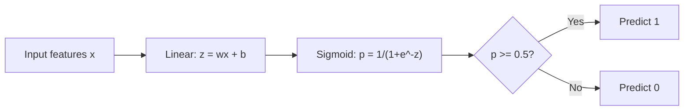
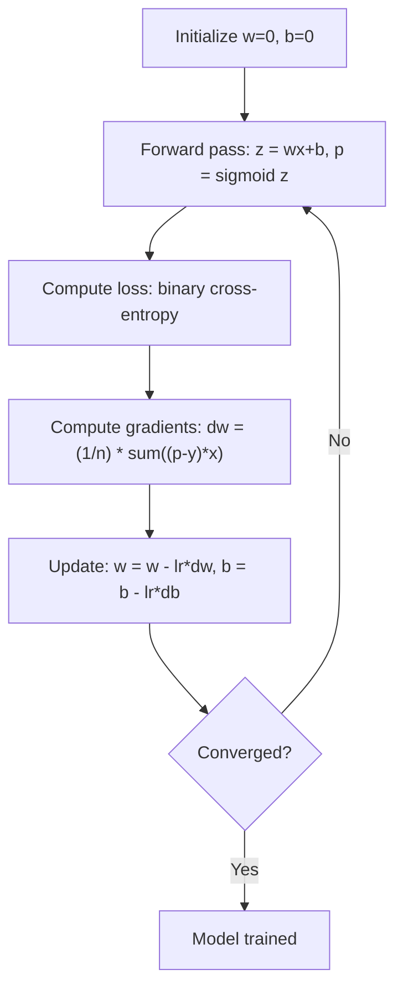

<!-- i18n:manual -->
# Логистическая регрессия

> Логистическая регрессия сгибает прямую в S-образную кривую, чтобы отвечать на вопросы «да или нет» вероятностями.

**Type:** Build
**Languages:** Python
**Prerequisites:** Phase 2 Lesson 1-2 (What Is ML, Linear Regression)
**Time:** ~90 minutes

## Learning Objectives

- Реализовать логистическую регрессию с нуля: сигмоида плюс binary cross-entropy
- Считать и читать precision, recall, F1 и confusion matrix для бинарной классификации
- Объяснить, почему MSE не годится для классификации и почему binary cross-entropy даёт выпуклую поверхность ошибки
- Построить softmax-регрессию для нескольких классов и оценить компромиссы при подборе порога

> 🎒 **На пальцах.** Линейная регрессия отвечает на вопрос «сколько». Логистическая — на вопрос «да или нет», причём с оценкой уверенности: не просто «болен», а «болен с вероятностью 0.87». Внутри тот же линейный кусок `wx + b`, только пропущенный через сжимающую функцию.

## The Problem

Вы хотите предсказать, злокачественная опухоль или доброкачественная, зная её размер. Пробуете линейную регрессию. На выходе числа вроде 0.3, 1.7 или -0.5. Что они значат? 1.7 — это «очень злокачественная»? -0.5 — «очень доброкачественная»? Линейная регрессия выдаёт неограниченные числа. Классификации нужны вероятности от 0 до 1 и ясное решение: да или нет.

Логистическая регрессия решает эту задачу. Она берёт ту же линейную комбинацию (wx + b) и пропускает её через сигмоиду, которая сжимает любое число в диапазон (0, 1). Выход — вероятность. Вы задаёте порог (обычно 0.5) и принимаете решение.

Это один из самых используемых алгоритмов на практике. Несмотря на название, логистическая регрессия — это классификация, а не регрессия. Название пришло от логистической (сигмоидной) функции, которую она использует.

## The Concept

### Why Linear Regression Fails for Classification

Представьте, что вы предсказываете «сдал/не сдал» (1/0) по числу часов подготовки. Линейная регрессия проводит через данные прямую:

```
hours:  1   2   3   4   5   6   7   8   9   10
actual: 0   0   0   0   1   1   1   1   1   1
```

Прямая может дать -0.2 для первого часа и 1.3 для десятого. Это не вероятности: они уходят ниже 0 и выше 1. Хуже того, один выброс (кто-то занимался 50 часов) утянет за собой всю линию и изменит предсказания для всех.

Классификации нужна функция, которая:
- Выдаёт значения от 0 до 1 (вероятности)
- Создаёт резкий переход (границу решения)
- Не искажается выбросами, далёкими от границы

> 🎒 **На пальцах.** Посмотрите на таблицу выше: до 4 часов завалили все, с 5 часов сдали все. Переключение происходит почти мгновенно между 4 и 5. Прямая так не умеет — она может только плавно ползти вверх и вылезать за пределы 0 и 1.

### The Sigmoid Function

Сигмоида делает ровно это:

```
sigmoid(z) = 1 / (1 + e^(-z))
```

Свойства:
- При большом положительном z sigmoid(z) стремится к 1
- При большом отрицательном z sigmoid(z) стремится к 0
- При z = 0 sigmoid(z) = 0.5
- Выход всегда лежит между 0 и 1
- Функция гладкая и дифференцируемая везде

У производной удобная форма: sigmoid'(z) = sigmoid(z) * (1 - sigmoid(z)). Благодаря этому градиент считается дёшево.

> 🎒 **На пальцах.** Подставьте z = 2: e^(-2) ≈ 0.135, значит sigmoid(2) = 1 / 1.135 ≈ 0.88. При z = -2 получится примерно 0.12. При нуле — ровно 0.5, полная неуверенность. Сигмоида работает как регулятор громкости с упорами: как ни крути, ниже нуля и выше единицы не уйдёшь.

### Logistic Regression = Linear Model + Sigmoid

Модель считает z = wx + b (как в линейной регрессии), затем применяет сигмоиду:



Выход p читается как P(y=1 | x) — вероятность того, что вход относится к классу 1. Граница решения проходит там, где wx + b = 0: именно там сигмоида выдаёт ровно 0.5.

### Binary Cross-Entropy Loss

Для логистической регрессии нельзя брать MSE. MSE вместе с сигмоидой даёт невыпуклую поверхность ошибки с множеством локальных минимумов. Вместо неё используют binary cross-entropy (log loss):

```
Loss = -(1/n) * sum(y * log(p) + (1-y) * log(1-p))
```

Почему это работает:
- y=1, а p близко к 1: log(1) = 0, потери почти нулевые (верно, дёшево)
- y=1, а p близко к 0: log(0) уходит в минус бесконечность, потери огромные (неверно, дорого)
- y=0, а p близко к 0: log(1) = 0, потери почти нулевые (верно, дёшево)
- y=0, а p близко к 1: log(0) уходит в минус бесконечность, потери огромные (неверно, дорого)

Для логистической регрессии эта функция потерь выпукла, а значит, минимум ровно один — глобальный.

> 🎒 **На пальцах.** Штраф растёт не линейно, а взрывообразно. Правильный ответ 1, модель сказала 0.9 — штраф -log(0.9) ≈ 0.105. Сказала 0.5 — штраф 0.69. Сказала 0.01 — штраф 4.6. Уверенная и неправильная модель наказывается в десятки раз сильнее, чем просто сомневающаяся.

### Gradient Descent for Logistic Regression

У градиентов binary cross-entropy с сигмоидой аккуратная форма:

```
dL/dw = (1/n) * sum((p - y) * x)
dL/db = (1/n) * sum(p - y)
```

Выглядит так же, как градиенты линейной регрессии. Разница в том, что здесь p = sigmoid(wx + b), а не p = wx + b. Сигмоида вносит нелинейность, но правило обновления весов остаётся прежним.

> 🎒 **На пальцах.** `p - y` — это просто «насколько промахнулись». Ответ был 1, модель сказала 0.7: ошибка -0.3, вес по этому признаку подтянется вверх. Ответ был 0, а модель снова сказала 0.7: ошибка +0.7, вес поедет вниз, причём более чем вдвое резче.



### The Decision Boundary

Для двумерного входа (два признака) граница решения — это линия, где:

```
w1*x1 + w2*x2 + b = 0
```

Точки с одной стороны получают класс 1, с другой — класс 0. Логистическая регрессия всегда даёт линейную границу. Нужна кривая — либо добавляйте полиномиальные признаки, либо берите нелинейную модель.

> 🎒 **На пальцах.** Представьте рассыпанные по полу красные и синие мячики и одну прямую верёвку. Разделить их получится, только если они лежат кучками по разные стороны. Если синие лежат кольцом вокруг красных, прямая верёвка бессильна — ровно здесь логистическая регрессия и ломается.

### Multi-Class Classification with Softmax

Бинарная логистическая регрессия работает с двумя классами. Для k классов берут softmax:

```
softmax(z_i) = e^(z_i) / sum(e^(z_j) for all j)
```

У каждого класса свой вектор весов. Модель считает балл z_i для каждого класса, а softmax превращает баллы в вероятности, дающие в сумме 1. Предсказанный класс — тот, у которого вероятность выше.

Функция потерь становится categorical cross-entropy:

```
Loss = -(1/n) * sum(sum(y_k * log(p_k)))
```

где y_k равно 1 для истинного класса и 0 для всех остальных (one-hot кодирование).

> 🎒 **На пальцах.** Softmax делит пирог между классами: сумма кусков всегда равна 100%. Баллы 2, 1 и 0 превращаются примерно в 0.66, 0.24 и 0.09, потому что e² ≈ 7.4, e¹ ≈ 2.7, e⁰ = 1, а их сумма 11.1. Больший балл забирает непропорционально больший кусок.

### Evaluation Metrics

Одной accuracy мало. Если в данных 95% отрицательных примеров и 5% положительных, модель, всегда отвечающая «нет», получит 95% accuracy и будет бесполезна.

**Confusion Matrix**:

| | Predicted Positive | Predicted Negative |
|---|---|---|
| Actually Positive | True Positive (TP) | False Negative (FN) |
| Actually Negative | False Positive (FP) | True Negative (TN) |

**Precision**: Из всех предсказанных положительных сколько действительно положительные?

```
Precision = TP / (TP + FP)
```

**Recall** (Sensitivity): Из всех реально положительных сколько мы поймали?

```
Recall = TP / (TP + FN)
```

**F1 Score**: Гармоническое среднее precision и recall. Балансирует обе метрики.

```
F1 = 2 * (Precision * Recall) / (Precision + Recall)
```

Что важнее в каком случае:
- **Precision**: когда дороги ложные срабатывания (спам-фильтр — нельзя блокировать нормальные письма)
- **Recall**: когда дороги пропуски (скрининг рака — нельзя не заметить опухоль)
- **F1**: когда нужна одна сбалансированная цифра

> 🎒 **На пальцах.** Возьмём 100 писем, из них 10 — спам. Фильтр пометил 8 писем, из них 6 действительно спам. Precision = 6/8 = 0.75, recall = 6/10 = 0.6, F1 = 2 × 0.75 × 0.6 / 1.35 ≈ 0.67. Четыре спама прошли, два нормальных письма зря заблокированы — вот почему одна accuracy ничего не говорит.

```figure
logistic-sigmoid
```

## Build It

### Step 1: Sigmoid function and data generation

```python
import random
import math

def sigmoid(z):
    z = max(-500, min(500, z))
    return 1.0 / (1.0 + math.exp(-z))


random.seed(42)
N = 200
X = []
y = []

for _ in range(N // 2):
    X.append([random.gauss(2, 1), random.gauss(2, 1)])
    y.append(0)

for _ in range(N // 2):
    X.append([random.gauss(5, 1), random.gauss(5, 1)])
    y.append(1)

combined = list(zip(X, y))
random.shuffle(combined)
X, y = zip(*combined)
X = list(X)
y = list(y)

print(f"Generated {N} samples (2 classes, 2 features)")
print(f"Class 0 center: (2, 2), Class 1 center: (5, 5)")
print(f"First 5 samples:")
for i in range(5):
    print(f"  Features: [{X[i][0]:.2f}, {X[i][1]:.2f}], Label: {y[i]}")
```

> 🎒 **На пальцах.** Данные сделаны честно: 100 точек вокруг центра (2, 2) с меткой 0 и 100 точек вокруг (5, 5) с меткой 1. Два облака, между ними пустота, — такие классы прямая разделит легко. `random.seed(42)` нужен, чтобы у вас на экране получились те же числа, что и здесь.

### Step 2: Logistic regression from scratch

```python
class LogisticRegression:
    def __init__(self, n_features, learning_rate=0.01):
        self.weights = [0.0] * n_features
        self.bias = 0.0
        self.lr = learning_rate
        self.loss_history = []

    def predict_proba(self, x):
        z = sum(w * xi for w, xi in zip(self.weights, x)) + self.bias
        return sigmoid(z)

    def predict(self, x, threshold=0.5):
        return 1 if self.predict_proba(x) >= threshold else 0

    def compute_loss(self, X, y):
        n = len(y)
        total = 0.0
        for i in range(n):
            p = self.predict_proba(X[i])
            p = max(1e-15, min(1 - 1e-15, p))
            total += y[i] * math.log(p) + (1 - y[i]) * math.log(1 - p)
        return -total / n

    def fit(self, X, y, epochs=1000, print_every=200):
        n = len(y)
        n_features = len(X[0])
        for epoch in range(epochs):
            dw = [0.0] * n_features
            db = 0.0
            for i in range(n):
                p = self.predict_proba(X[i])
                error = p - y[i]
                for j in range(n_features):
                    dw[j] += error * X[i][j]
                db += error
            for j in range(n_features):
                self.weights[j] -= self.lr * (dw[j] / n)
            self.bias -= self.lr * (db / n)
            loss = self.compute_loss(X, y)
            self.loss_history.append(loss)
            if epoch % print_every == 0:
                print(f"  Epoch {epoch:4d} | Loss: {loss:.4f} | w: [{self.weights[0]:.3f}, {self.weights[1]:.3f}] | b: {self.bias:.3f}")
        return self

    def accuracy(self, X, y):
        correct = sum(1 for i in range(len(y)) if self.predict(X[i]) == y[i])
        return correct / len(y)


split = int(0.8 * N)
X_train, X_test = X[:split], X[split:]
y_train, y_test = y[:split], y[split:]

print("\n=== Training Logistic Regression ===")
model = LogisticRegression(n_features=2, learning_rate=0.1)
model.fit(X_train, y_train, epochs=1000, print_every=200)

print(f"\nTrain accuracy: {model.accuracy(X_train, y_train):.4f}")
print(f"Test accuracy:  {model.accuracy(X_test, y_test):.4f}")
print(f"Weights: [{model.weights[0]:.4f}, {model.weights[1]:.4f}]")
print(f"Bias: {model.bias:.4f}")
```

> 🎒 **На пальцах.** Обучение стартует с `w = [0, 0]` и `b = 0`: модель всем ставит вероятность 0.5, то есть «не знаю». Loss на первой эпохе будет около 0.69, потому что -log(0.5) = 0.693. Каждая эпоха чуть двигает веса, и loss ползёт вниз. Не падает — уменьшите learning rate.

### Step 3: Confusion matrix and metrics from scratch

```python
class ClassificationMetrics:
    def __init__(self, y_true, y_pred):
        self.tp = sum(1 for t, p in zip(y_true, y_pred) if t == 1 and p == 1)
        self.tn = sum(1 for t, p in zip(y_true, y_pred) if t == 0 and p == 0)
        self.fp = sum(1 for t, p in zip(y_true, y_pred) if t == 0 and p == 1)
        self.fn = sum(1 for t, p in zip(y_true, y_pred) if t == 1 and p == 0)

    def accuracy(self):
        total = self.tp + self.tn + self.fp + self.fn
        return (self.tp + self.tn) / total if total > 0 else 0

    def precision(self):
        denom = self.tp + self.fp
        return self.tp / denom if denom > 0 else 0

    def recall(self):
        denom = self.tp + self.fn
        return self.tp / denom if denom > 0 else 0

    def f1(self):
        p = self.precision()
        r = self.recall()
        return 2 * p * r / (p + r) if (p + r) > 0 else 0

    def print_confusion_matrix(self):
        print(f"\n  Confusion Matrix:")
        print(f"                  Predicted")
        print(f"                  Pos   Neg")
        print(f"  Actual Pos     {self.tp:4d}  {self.fn:4d}")
        print(f"  Actual Neg     {self.fp:4d}  {self.tn:4d}")

    def print_report(self):
        self.print_confusion_matrix()
        print(f"\n  Accuracy:  {self.accuracy():.4f}")
        print(f"  Precision: {self.precision():.4f}")
        print(f"  Recall:    {self.recall():.4f}")
        print(f"  F1 Score:  {self.f1():.4f}")


y_pred_test = [model.predict(x) for x in X_test]
print("\n=== Classification Report (Test Set) ===")
metrics = ClassificationMetrics(y_test, y_pred_test)
metrics.print_report()
```

> 🎒 **На пальцах.** Класс `ClassificationMetrics` считает всего четыре числа: TP, TN, FP, FN. Все остальные метрики — арифметика над ними. На тестовых 40 точках здесь обычно получается 20 TP, 20 TN и ноль ошибок: облака слишком далеко друг от друга, чтобы перепутать.

### Step 4: Decision boundary analysis

```python
print("\n=== Decision Boundary ===")
w1, w2 = model.weights
b = model.bias
print(f"Decision boundary: {w1:.4f}*x1 + {w2:.4f}*x2 + {b:.4f} = 0")
if abs(w2) > 1e-10:
    print(f"Solved for x2:     x2 = {-w1/w2:.4f}*x1 + {-b/w2:.4f}")

print("\nSample predictions near the boundary:")
test_points = [
    [3.0, 3.0],
    [3.5, 3.5],
    [4.0, 4.0],
    [2.5, 2.5],
    [5.0, 5.0],
]
for point in test_points:
    prob = model.predict_proba(point)
    pred = model.predict(point)
    print(f"  [{point[0]}, {point[1]}] -> prob={prob:.4f}, class={pred}")
```

> 🎒 **На пальцах.** Точка (3.5, 3.5) лежит ровно посередине между центрами (2, 2) и (5, 5), поэтому вероятность там будет около 0.5 — модель сомневается. Точка (2.5, 2.5) уверенно уйдёт в класс 0, а (5, 5) — в класс 1. Проверьте руками: подставьте x1 и x2 в `w1*x1 + w2*x2 + b` и посмотрите на знак. Плюс — класс 1, минус — класс 0.

### Step 5: Multi-class with softmax

```python
class SoftmaxRegression:
    def __init__(self, n_features, n_classes, learning_rate=0.01):
        self.n_features = n_features
        self.n_classes = n_classes
        self.lr = learning_rate
        self.weights = [[0.0] * n_features for _ in range(n_classes)]
        self.biases = [0.0] * n_classes

    def softmax(self, scores):
        max_score = max(scores)
        exp_scores = [math.exp(s - max_score) for s in scores]
        total = sum(exp_scores)
        return [e / total for e in exp_scores]

    def predict_proba(self, x):
        scores = [
            sum(self.weights[k][j] * x[j] for j in range(self.n_features)) + self.biases[k]
            for k in range(self.n_classes)
        ]
        return self.softmax(scores)

    def predict(self, x):
        probs = self.predict_proba(x)
        return probs.index(max(probs))

    def fit(self, X, y, epochs=1000, print_every=200):
        n = len(y)
        for epoch in range(epochs):
            grad_w = [[0.0] * self.n_features for _ in range(self.n_classes)]
            grad_b = [0.0] * self.n_classes
            total_loss = 0.0
            for i in range(n):
                probs = self.predict_proba(X[i])
                for k in range(self.n_classes):
                    target = 1.0 if y[i] == k else 0.0
                    error = probs[k] - target
                    for j in range(self.n_features):
                        grad_w[k][j] += error * X[i][j]
                    grad_b[k] += error
                true_prob = max(probs[y[i]], 1e-15)
                total_loss -= math.log(true_prob)
            for k in range(self.n_classes):
                for j in range(self.n_features):
                    self.weights[k][j] -= self.lr * (grad_w[k][j] / n)
                self.biases[k] -= self.lr * (grad_b[k] / n)
            if epoch % print_every == 0:
                print(f"  Epoch {epoch:4d} | Loss: {total_loss / n:.4f}")
        return self

    def accuracy(self, X, y):
        correct = sum(1 for i in range(len(y)) if self.predict(X[i]) == y[i])
        return correct / len(y)


random.seed(42)
X_3class = []
y_3class = []

centers = [(1, 1), (5, 1), (3, 5)]
for label, (cx, cy) in enumerate(centers):
    for _ in range(50):
        X_3class.append([random.gauss(cx, 0.8), random.gauss(cy, 0.8)])
        y_3class.append(label)

combined = list(zip(X_3class, y_3class))
random.shuffle(combined)
X_3class, y_3class = zip(*combined)
X_3class = list(X_3class)
y_3class = list(y_3class)

split_3 = int(0.8 * len(X_3class))
X_train_3 = X_3class[:split_3]
y_train_3 = y_3class[:split_3]
X_test_3 = X_3class[split_3:]
y_test_3 = y_3class[split_3:]

print("\n=== Multi-class Softmax Regression (3 classes) ===")
softmax_model = SoftmaxRegression(n_features=2, n_classes=3, learning_rate=0.1)
softmax_model.fit(X_train_3, y_train_3, epochs=1000, print_every=200)
print(f"\nTrain accuracy: {softmax_model.accuracy(X_train_3, y_train_3):.4f}")
print(f"Test accuracy:  {softmax_model.accuracy(X_test_3, y_test_3):.4f}")

print("\nSample predictions:")
for i in range(5):
    probs = softmax_model.predict_proba(X_test_3[i])
    pred = softmax_model.predict(X_test_3[i])
    print(f"  True: {y_test_3[i]}, Predicted: {pred}, Probs: [{', '.join(f'{p:.3f}' for p in probs)}]")
```

> 🎒 **На пальцах.** Три класса — три центра: (1, 1), (5, 1) и (3, 5), по 50 точек в каждом. Модель хранит три вектора весов вместо одного. В методе `softmax` есть строка `s - max_score` — это защита от переполнения: вычитание максимума не меняет результат, но спасает `math.exp` от гигантских чисел.

### Step 6: Threshold tuning

```python
print("\n=== Threshold Tuning ===")
print("Default threshold: 0.5. Adjusting the threshold trades precision for recall.\n")

thresholds = [0.3, 0.4, 0.5, 0.6, 0.7]
print(f"{'Threshold':>10} {'Accuracy':>10} {'Precision':>10} {'Recall':>10} {'F1':>10}")
print("-" * 52)

for t in thresholds:
    y_pred_t = [1 if model.predict_proba(x) >= t else 0 for x in X_test]
    m = ClassificationMetrics(y_test, y_pred_t)
    print(f"{t:>10.1f} {m.accuracy():>10.4f} {m.precision():>10.4f} {m.recall():>10.4f} {m.f1():>10.4f}")
```

> 🎒 **На пальцах.** Порог — единственная ручка, которую можно крутить уже после обучения. Опустите его до 0.3, и модель станет чаще говорить «да»: recall вырастет, precision упадёт. Поднимите до 0.7 — наоборот. Веса при этом не меняются вовсе, двигается только линия отсечки.

## Use It

Теперь то же самое на scikit-learn.

```python
from sklearn.linear_model import LogisticRegression as SklearnLR
from sklearn.metrics import accuracy_score, precision_score, recall_score, f1_score
from sklearn.metrics import confusion_matrix, classification_report
from sklearn.model_selection import train_test_split
from sklearn.preprocessing import StandardScaler
import numpy as np

np.random.seed(42)
X_0 = np.random.randn(100, 2) + [2, 2]
X_1 = np.random.randn(100, 2) + [5, 5]
X_sk = np.vstack([X_0, X_1])
y_sk = np.array([0] * 100 + [1] * 100)

X_tr, X_te, y_tr, y_te = train_test_split(X_sk, y_sk, test_size=0.2, random_state=42)

scaler = StandardScaler()
X_tr_sc = scaler.fit_transform(X_tr)
X_te_sc = scaler.transform(X_te)

lr = SklearnLR()
lr.fit(X_tr_sc, y_tr)
y_pred = lr.predict(X_te_sc)

print("=== Scikit-learn Logistic Regression ===")
print(f"Accuracy:  {accuracy_score(y_te, y_pred):.4f}")
print(f"Precision: {precision_score(y_te, y_pred):.4f}")
print(f"Recall:    {recall_score(y_te, y_pred):.4f}")
print(f"F1:        {f1_score(y_te, y_pred):.4f}")
print(f"\nConfusion Matrix:\n{confusion_matrix(y_te, y_pred)}")
print(f"\nClassification Report:\n{classification_report(y_te, y_pred)}")
```

Ваша реализация с нуля даёт ту же границу решения и те же метрики. Scikit-learn добавляет выбор солвера (liblinear, lbfgs, saga), автоматическую регуляризацию, стратегии для многих классов (one-vs-rest, multinomial) и оптимизации численной устойчивости.

> 🎒 **На пальцах.** Обратите внимание на `StandardScaler`: он приводит признаки к среднему 0 и разбросу 1. Для градиентного спуска это важно. Если один признак измеряется тысячами, а другой долями единицы, шаги по ним получаются несоизмеримыми и обучение тормозит.

## Ship It

Этот урок производит:
- `code/logistic_regression.py` - логистическая регрессия с нуля вместе с метриками

## Exercises

1. Сгенерируйте набор данных, который НЕ разделяется прямой (например, две концентрические окружности). Обучите логистическую регрессию и убедитесь, что она проваливается. Затем добавьте полиномиальные признаки (x1^2, x2^2, x1*x2) и обучите заново. Покажите, что accuracy выросла.
2. Реализуйте confusion matrix для трёх классов из softmax-модели. Посчитайте precision и recall по каждому классу. Какой класс распознать труднее всего?
3. Постройте ROC-кривую с нуля. Для 100 значений порога от 0 до 1 посчитайте true positive rate и false positive rate. Вычислите AUC (площадь под кривой) методом трапеций.

> 🎒 **На пальцах.** Подсказка к первому заданию: если синие точки лежат кольцом вокруг красных, прямой их не разделить и accuracy застрянет около 50%. Но добавьте признак x1^2 + x2^2 — это квадрат расстояния до центра — и задача станет тривиальной: «близко к центру» против «далеко». Прямая в новом пространстве признаков — это окружность в старом.

## Key Terms

| Term | What people say | What it actually means |
|------|----------------|----------------------|
| Logistic regression | «Регрессия для классификации» | Линейная модель, за которой идёт сигмоида, выдающая вероятности классов |
| Sigmoid function | «S-образная кривая» | Функция 1/(1+e^(-z)), переводящая любое вещественное число в диапазон (0, 1) |
| Binary cross-entropy | «Log loss» | Функция потерь -[y*log(p) + (1-y)*log(1-p)], жёстко наказывающая уверенные неверные ответы |
| Decision boundary | «Разделяющая линия» | Поверхность, на которой вероятность на выходе модели равна 0.5; она разделяет предсказанные классы |
| Softmax | «Сигмоида для многих классов» | Функция, превращающая вектор баллов в вероятности с суммой 1 |
| Precision | «Сколько из выбранного релевантно» | TP / (TP + FP) — доля действительно положительных среди положительных предсказаний |
| Recall | «Сколько релевантного выбрано» | TP / (TP + FN) — доля реальных положительных, которые модель нашла |
| F1 score | «Сбалансированная accuracy» | Гармоническое среднее precision и recall: 2*P*R / (P+R) |
| Confusion matrix | «Разбор ошибок» | Таблица с числом TP, TN, FP, FN для каждой пары классов |
| Threshold | «Отсечка» | Значение вероятности, выше которого модель предсказывает класс 1 (по умолчанию 0.5, настраивается) |
| One-hot encoding | «Бинарные колонки для категорий» | Представление класса k вектором из нулей с единицей на позиции k |
| Categorical cross-entropy | «Log loss для многих классов» | Обобщение binary cross-entropy на k классов с one-hot метками |
