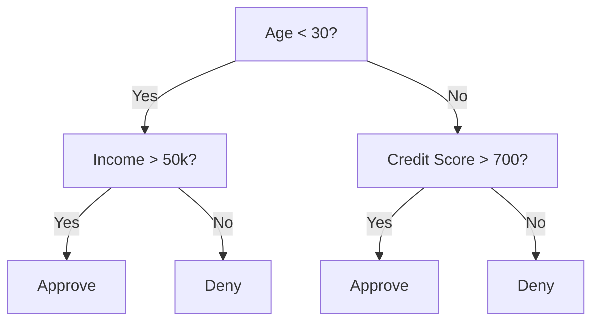
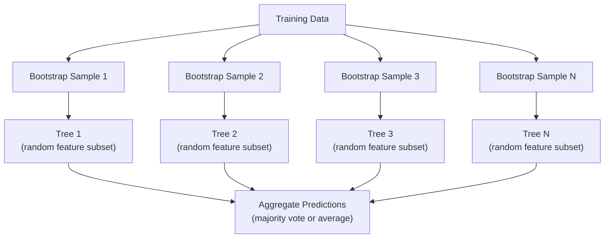

<!-- i18n:manual -->
# Деревья решений и случайный лес

> Дерево решений — это обычная блок-схема. Но лес из таких деревьев — один из самых мощных инструментов в ML.

**Type:** Build
**Language:** Python
**Prerequisites:** Phase 1 (Lessons 09 Information Theory, 06 Probability)
**Time:** ~90 minutes

## Learning Objectives

- Реализовать Gini impurity, энтропию и information gain, чтобы находить лучшие разбиения в дереве
- Построить классификатор на дереве решений с нуля и с ограничениями роста (максимальная глубина, минимум примеров)
- Собрать random forest на bootstrap-выборках и случайных подмножествах признаков и объяснить, почему это снижает разброс
- Сравнить важность признаков по MDI с permutation importance и понять, когда MDI врёт

> 🎒 **На пальцах.** Дерево решений — это игра «Угадай животное»: «Оно больше кошки?», «Оно летает?». Каждый вопрос отсекает половину вариантов. Random forest — это когда вы задаёте вопросы не одному эксперту, а сотне, и берёте самый частый ответ.

## The Problem

У вас табличные данные. Строки — примеры, столбцы — признаки, и есть целевой столбец, который нужно предсказать. Можно натравить на них нейросеть. Но на табличных данных модели на деревьях (деревья решений, случайные леса, градиентный бустинг) стабильно обходят глубокое обучение. Соревнования Kaggle на структурированных данных выигрывают XGBoost и LightGBM, а не трансформеры.

Почему? Деревья работают со смешанными типами признаков (числовыми и категориальными) без предобработки. Они ловят нелинейные зависимости без feature engineering. Они интерпретируемы: можно посмотреть на дерево и увидеть, почему получилось именно такое предсказание. А случайные леса, усредняющие много деревьев, очень устойчивы к overfitting на данных умеренного размера.

В этом уроке мы построим дерево решений с нуля через рекурсивное разбиение, а поверх него — случайный лес. Вы реализуете математику критериев разбиения (Gini impurity, энтропия, information gain) и поймёте, почему ансамбль слабых моделей становится сильной.

> 🎒 **На пальцах.** Табличные данные — это то, что лежит в любом Excel-файле: возраст, доход, город, купил или нет. Для картинок и текста нужны нейросети, а для таблиц почти всегда достаточно деревьев — и обучаются они минуты, а не часы.

## The Concept

### What a decision tree does

Дерево решений разрезает пространство признаков на прямоугольные области, задавая последовательность вопросов «да/нет».



Каждый внутренний узел сравнивает признак с порогом. Каждый лист выдаёт предсказание. Чтобы классифицировать новую точку, вы стартуете в корне и идёте по ветвям, пока не упрётесь в лист.

Дерево строится сверху вниз: в каждом узле выбирается признак и порог, которые лучше всего разделяют данные. Что значит «лучше всего», задаёт критерий разбиения.

> 🎒 **На пальцах.** Пройдите по схеме за конкретного человека: 25 лет, доход 60k. Первый вопрос «Age < 30?» — да, идём налево. Второй «Income > 50k?» — да, ответ Approve. Две проверки, и решение готово; никакой магии внутри нет.

### Split criteria: measuring impurity

В каждом узле у нас есть набор примеров. Мы хотим разбить их так, чтобы дочерние узлы получились как можно «чище», то есть в каждом лежал в основном один класс.

**Gini impurity** — это вероятность ошибиться, если случайно взятому примеру приписать метку случайно, согласно распределению классов в этом узле.

```
Gini(S) = 1 - sum(p_k^2)

where p_k is the proportion of class k in set S.
```

Для чистого узла (все примеры одного класса) Gini = 0. Для бинарного разбиения 50/50 Gini = 0.5. Чем меньше, тем лучше.

```
Example: 6 cats, 4 dogs

Gini = 1 - (0.6^2 + 0.4^2) = 1 - (0.36 + 0.16) = 0.48
```

> 🎒 **На пальцах.** Проверьте руками: 6 котов и 4 собаки из 10, значит доли 0.6 и 0.4. Возводим в квадрат: 0.36 и 0.16, сумма 0.52. Gini = 1 - 0.52 = 0.48. Стало бы 10 котов и 0 собак — получили бы 1 - 1 = 0, идеально чистый узел.

**Entropy** измеряет количество информации (беспорядок) в узле. Разбиралась в Phase 1, Lesson 09.

```
Entropy(S) = -sum(p_k * log2(p_k))
```

Для чистого узла энтропия = 0. Для бинарного разбиения 50/50 энтропия = 1.0. Чем меньше, тем лучше.

```
Example: 6 cats, 4 dogs

Entropy = -(0.6 * log2(0.6) + 0.4 * log2(0.4))
        = -(0.6 * -0.737 + 0.4 * -1.322)
        = 0.442 + 0.529
        = 0.971 bits
```

> 🎒 **На пальцах.** Те же 6 котов и 4 собаки дают энтропию 0.971 бита — почти максимум (1.0 бит). Смысл прямой: чтобы угадать животное в этом узле, вам всё ещё нужен почти целый бит информации, то есть один честный вопрос «да/нет». В чистом узле спрашивать нечего, там 0 бит.

**Information gain** — это уменьшение неоднородности (энтропии или Gini) после разбиения.

```
IG(S, feature, threshold) = Impurity(S) - weighted_avg(Impurity(S_left), Impurity(S_right))

where the weights are the proportions of samples in each child.
```

Жадный алгоритм в каждом узле: перебрать все признаки и все возможные пороги. Выбрать пару (признак, порог), дающую максимальный information gain.

### How splitting works

Для набора с n признаками и m примерами в текущем узле:

1. Для каждого признака j (j = 1 ... n):
   - Отсортировать примеры по признаку j
   - Перебрать в качестве порога каждую середину между соседними различными значениями
   - Посчитать information gain для каждого порога
2. Выбрать признак и порог с наибольшим information gain
3. Разделить данные на левую часть (признак <= порог) и правую (признак > порог)
4. Рекурсивно повторить для каждой части

Такой жадный подход не гарантирует глобально оптимального дерева. Поиск оптимального дерева — NP-трудная задача. Но на практике жадное разбиение работает хорошо.

> 🎒 **На пальцах.** Если в столбце 100 разных значений, порогов будет 99 — по одному между каждой парой соседей. Умножьте на число признаков, и станет ясно, почему обучение дерева упирается в перебор. Зато перебор честный: алгоритм действительно проверяет все варианты в узле, просто не заглядывает вперёд на шаг дальше.

### Stopping conditions

Без условий остановки дерево растёт, пока каждый лист не станет чистым (по одному примеру на лист). Так оно идеально запоминает обучающие данные и ужасно обобщает.

**Pre-pruning** останавливает дерево до того, как оно вырастет полностью:
- Максимальная глубина: перестать делить, когда дерево достигло заданной глубины
- Минимум примеров в листе: остановиться, если в узле меньше k примеров
- Минимальный information gain: остановиться, если лучшее разбиение улучшает чистоту меньше, чем на порог
- Максимальное число листьев: ограничить общее количество листьев

**Post-pruning** выращивает дерево целиком, а потом подрезает:
- Cost-complexity pruning (используется в scikit-learn): добавляет штраф, пропорциональный числу листьев. Больше штраф — меньше дерево
- Reduced error pruning: убрать поддерево, если ошибка на валидации от этого не растёт

Pre-pruning проще и быстрее. Post-pruning часто даёт лучшие деревья, потому что не обрывает преждевременно разбиение, за которым могли последовать полезные.

> 🎒 **На пальцах.** Дерево без ограничений — это школьник, который вызубрил ответы к конкретному варианту контрольной. На своём варианте — сто баллов, на любом другом — ноль. `max_depth=3` заставляет его выучить общее правило вместо списка исключений.

### Decision trees for regression

В регрессии предсказание листа — это среднее целевых значений в нём. Критерий разбиения тоже меняется:

**Variance reduction** заменяет information gain:

```
VR(S, feature, threshold) = Var(S) - weighted_avg(Var(S_left), Var(S_right))
```

Выбираем разбиение, которое сильнее всего уменьшает дисперсию. Дерево режет пространство входов на области и в каждой предсказывает константу (среднее).

> 🎒 **На пальцах.** Предсказываете цену квартиры. Дерево доводит вас до листа «район центр, площадь 40-55 м²», где лежат 12 квартир, и выдаёт их среднюю цену. Именно поэтому регрессионное дерево рисует лесенку, а не гладкую линию: внутри одной области ответ всегда один и тот же.

### Random forests: the power of ensembles

Одно дерево решений имеет высокий разброс. Небольшое изменение данных может дать совершенно другое дерево. Случайный лес решает это усреднением множества деревьев.



Разнообразие деревьев обеспечивают два источника случайности:

**Bagging (bootstrap aggregating):** Каждое дерево обучается на bootstrap-выборке — случайной выборке с возвращением из обучающих данных. Примерно 63% исходных примеров попадают в каждую такую выборку (остальные — out-of-bag примеры, их можно использовать для валидации).

**Feature randomization:** В каждом разбиении рассматривается только случайное подмножество признаков. Для классификации по умолчанию берут sqrt(n_features), для регрессии — n_features/3. Это мешает всем деревьям делить данные по одному и тому же доминирующему признаку.

Ключевая мысль: усреднение множества слабо связанных деревьев снижает разброс, не увеличивая смещение. Каждое отдельное дерево может быть посредственным. Ансамбль получается сильным.

> 🎒 **На пальцах.** Bootstrap — это вытащить из мешка 100 шаров, каждый раз возвращая шар обратно. Часть шаров попадётся дважды, а примерно 37% не попадутся ни разу — это и есть out-of-bag. Отсюда и знаменитые 63%: 1 - 1/e ≈ 0.632.

### Feature importance

Случайные леса естественным образом дают оценку важности признаков. Самый распространённый способ:

**Mean Decrease in Impurity (MDI):** Для каждого признака суммируется общее снижение неоднородности по всем деревьям и всем узлам, где этот признак использовался. Признаки, дающие большее снижение на ранних разбиениях, важнее.

```
importance(feature_j) = sum over all nodes where feature_j is used:
    (n_samples_at_node / n_total_samples) * impurity_decrease
```

Считается быстро (прямо во время обучения), но метод смещён в пользу признаков с большим числом уникальных значений и большим количеством возможных порогов.

**Permutation importance** — альтернатива: перемешать значения одного признака и посмотреть, насколько упадёт точность модели. Надёжнее, но медленнее.

> 🎒 **На пальцах.** Возьмите столбец «номер клиента» — там 10000 уникальных значений, и дерево легко нарежет по нему что угодно. MDI объявит этот мусор важнейшим признаком. Permutation importance перемешает номера, точность не изменится ни на процент — и обман вскроется.

### When trees beat neural networks

На табличных данных деревья и леса обходят нейросети. Причин несколько:

| Factor | Trees | Neural networks |
|--------|-------|----------------|
| Смешанные типы (числа + категории) | Поддержка из коробки | Нужно кодирование |
| Маленькие наборы данных (< 10k строк) | Работают хорошо | Переобучаются |
| Взаимодействия признаков | Находятся разбиениями | Нужно проектировать архитектуру |
| Интерпретируемость | Полная прозрачность | Чёрный ящик |
| Время обучения | Минуты | Часы |
| Чувствительность к гиперпараметрам | Низкая | Высокая |

Нейросети выигрывают, когда в данных есть пространственная или последовательная структура (картинки, текст, звук). Для плоских таблиц признаков деревья — выбор по умолчанию.

```figure
decision-tree-depth
```

## Build It

### Step 1: Gini impurity and entropy

Реализуйте оба критерия разбиения с нуля и убедитесь, что они сходятся во мнении, какие разбиения хорошие.

```python
import math

def gini_impurity(labels):
    n = len(labels)
    if n == 0:
        return 0.0
    counts = {}
    for label in labels:
        counts[label] = counts.get(label, 0) + 1
    return 1.0 - sum((c / n) ** 2 for c in counts.values())

def entropy(labels):
    n = len(labels)
    if n == 0:
        return 0.0
    counts = {}
    for label in labels:
        counts[label] = counts.get(label, 0) + 1
    return -sum(
        (c / n) * math.log2(c / n) for c in counts.values() if c > 0
    )
```

> 🎒 **На пальцах.** Обе функции делают одно и то же в три шага: посчитать, сколько каких меток, перевести в доли, свернуть в одно число. Скормите им `[1, 1, 1, 1]` — получите 0.0 и там, и там. Скормите `[0, 1]` — получите 0.5 у Gini и 1.0 у энтропии.

### Step 2: Find the best split

Перебрать каждый признак и каждый порог. Вернуть тот, у которого information gain наибольший.

```python
def information_gain(parent_labels, left_labels, right_labels, criterion="gini"):
    measure = gini_impurity if criterion == "gini" else entropy
    n = len(parent_labels)
    n_left = len(left_labels)
    n_right = len(right_labels)
    if n_left == 0 or n_right == 0:
        return 0.0
    parent_impurity = measure(parent_labels)
    child_impurity = (
        (n_left / n) * measure(left_labels) +
        (n_right / n) * measure(right_labels)
    )
    return parent_impurity - child_impurity
```

> 🎒 **На пальцах.** Формула внутри — обычное взвешенное среднее. Если родитель дал Gini 0.48, а после разбиения слева 40 примеров с 0.1 и справа 60 с 0.2, то дети весят 0.4 × 0.1 + 0.6 × 0.2 = 0.16, а gain = 0.48 - 0.16 = 0.32. Веса нужны, чтобы крошечный чистый листок не перевесил большой грязный.

### Step 3: Build the DecisionTree class

Рекурсивное разбиение, предсказание и учёт важности признаков. `_build` — сердце дерева: оно останавливается, когда узел чист или упёрся в ограничение pre-pruning, а иначе берёт лучшее разбиение и рекурсивно уходит в обоих детей.

```python
import random

class DecisionTree:
    def __init__(self, max_depth=None, min_samples_split=2,
                 min_samples_leaf=1, criterion="gini",
                 max_features=None):
        self.max_depth = max_depth
        self.min_samples_split = min_samples_split
        self.min_samples_leaf = min_samples_leaf
        self.criterion = criterion
        self.max_features = max_features
        self.tree = None
        self.feature_importances_ = None

    def fit(self, X, y):
        self.n_features = len(X[0])
        self.feature_importances_ = [0.0] * self.n_features
        self.n_samples = len(X)
        self.tree = self._build(X, y, depth=0)
        total = sum(self.feature_importances_)
        if total > 0:
            self.feature_importances_ = [
                fi / total for fi in self.feature_importances_
            ]

    def predict(self, X):
        return [self._predict_one(x, self.tree) for x in X]

    def _build(self, X, y, depth):
        if len(set(y)) == 1:
            return {"leaf": True, "value": y[0]}

        if self.max_depth is not None and depth >= self.max_depth:
            return self._make_leaf(y)

        if len(y) < self.min_samples_split:
            return self._make_leaf(y)

        best_feature, best_threshold, best_gain = self._best_split(X, y)

        if best_feature is None or best_gain <= 0:
            return self._make_leaf(y)

        left_X, left_y, right_X, right_y = self._split_data(
            X, y, best_feature, best_threshold
        )

        if len(left_y) < self.min_samples_leaf or len(right_y) < self.min_samples_leaf:
            return self._make_leaf(y)

        weight = len(y) / self.n_samples
        self.feature_importances_[best_feature] += weight * best_gain

        return {
            "leaf": False,
            "feature": best_feature,
            "threshold": best_threshold,
            "left": self._build(left_X, left_y, depth + 1),
            "right": self._build(right_X, right_y, depth + 1),
        }

    def _make_leaf(self, y):
        counts = {}
        for label in y:
            counts[label] = counts.get(label, 0) + 1
        return {"leaf": True, "value": max(counts, key=counts.get)}

    def _best_split(self, X, y):
        best_feature = None
        best_threshold = None
        best_gain = -1.0

        if self.max_features == "sqrt":
            k = max(1, int(math.sqrt(self.n_features)))
            feature_indices = random.sample(range(self.n_features), k)
        elif isinstance(self.max_features, int):
            if self.max_features < 1:
                raise ValueError("max_features must be at least 1 when given as an integer")
            k = min(self.max_features, self.n_features)
            feature_indices = random.sample(range(self.n_features), k)
        else:
            feature_indices = list(range(self.n_features))

        for feature_idx in feature_indices:
            values = sorted(set(X[i][feature_idx] for i in range(len(X))))
            if len(values) <= 1:
                continue

            for i in range(len(values) - 1):
                threshold = (values[i] + values[i + 1]) / 2.0
                left_y = [y[j] for j in range(len(X)) if X[j][feature_idx] <= threshold]
                right_y = [y[j] for j in range(len(X)) if X[j][feature_idx] > threshold]

                if len(left_y) < self.min_samples_leaf or len(right_y) < self.min_samples_leaf:
                    continue

                gain = information_gain(y, left_y, right_y, self.criterion)
                if gain > best_gain:
                    best_gain = gain
                    best_feature = feature_idx
                    best_threshold = threshold

        return best_feature, best_threshold, best_gain

    def _split_data(self, X, y, feature, threshold):
        left_X, left_y, right_X, right_y = [], [], [], []
        for i in range(len(X)):
            if X[i][feature] <= threshold:
                left_X.append(X[i])
                left_y.append(y[i])
            else:
                right_X.append(X[i])
                right_y.append(y[i])
        return left_X, left_y, right_X, right_y

    def _predict_one(self, x, node):
        if node["leaf"]:
            return node["value"]
        if x[node["feature"]] <= node["threshold"]:
            return self._predict_one(x, node["left"])
        return self._predict_one(x, node["right"])
```

> 🎒 **На пальцах.** Всё дерево здесь — это вложенные словари. Внутренний узел хранит `feature`, `threshold` и двух детей, лист хранит только `value`. `_predict_one` просто спускается по этим словарям: сравнил значение с порогом, шагнул влево или вправо, дошёл до листа — вернул ответ.

### Step 4: Build the RandomForest class

Bootstrap-выборки, случайные подмножества признаков и голосование большинством.

```python
class RandomForest:
    def __init__(self, n_trees=100, max_depth=None,
                 min_samples_split=2, max_features="sqrt",
                 criterion="gini"):
        self.n_trees = n_trees
        self.max_depth = max_depth
        self.min_samples_split = min_samples_split
        self.max_features = max_features
        self.criterion = criterion
        self.trees = []

    def fit(self, X, y):
        n = len(X)
        for _ in range(self.n_trees):
            indices = [random.randint(0, n - 1) for _ in range(n)]
            X_boot = [X[i] for i in indices]
            y_boot = [y[i] for i in indices]
            tree = DecisionTree(
                max_depth=self.max_depth,
                min_samples_split=self.min_samples_split,
                max_features=self.max_features,
                criterion=self.criterion,
            )
            tree.fit(X_boot, y_boot)
            self.trees.append(tree)

    def predict(self, X):
        all_preds = [tree.predict(X) for tree in self.trees]
        predictions = []
        for i in range(len(X)):
            votes = {}
            for preds in all_preds:
                v = preds[i]
                votes[v] = votes.get(v, 0) + 1
            predictions.append(max(votes, key=votes.get))
        return predictions
```

> 🎒 **На пальцах.** Обратите внимание на строку с `random.randint`: она набирает n индексов с повторами — это и есть bootstrap. Дальше 100 деревьев голосуют, и побеждает самая частая метка. Если 60 деревьев сказали «кот», а 40 — «собака», ответ будет «кот», хотя почти половина ошиблась.

Полную реализацию со всеми вспомогательными методами смотрите в `code/trees.py`.

## Use It

На scikit-learn обучение случайного леса занимает три строки:

```python
from sklearn.ensemble import RandomForestClassifier
from sklearn.datasets import load_iris
from sklearn.model_selection import train_test_split

X, y = load_iris(return_X_y=True)
X_train, X_test, y_train, y_test = train_test_split(X, y, random_state=42)

rf = RandomForestClassifier(n_estimators=100, random_state=42)
rf.fit(X_train, y_train)
print(f"Accuracy: {rf.score(X_test, y_test):.4f}")
print(f"Feature importances: {rf.feature_importances_}")
```

На практике градиентный бустинг (XGBoost, LightGBM, CatBoost) часто сильнее случайного леса, потому что деревья строятся последовательно и каждое следующее исправляет ошибки предыдущих. Зато случайный лес труднее испортить настройками: ему почти не нужен подбор гиперпараметров.

> 🎒 **На пальцах.** Датасет iris — это 150 цветков и 4 признака (длина и ширина лепестка и чашелистика). Лес из 100 деревьев обычно даёт около 0.95 accuracy на тесте, и `feature_importances_` покажет, что решают в основном лепестки, а не чашелистики.

## Ship It

Этот урок производит `outputs/prompt-tree-interpreter.md` -- промпт, который объясняет разбиения дерева решений бизнес-заказчику. Дайте ему структуру обученного дерева (глубину, признаки, пороги, точность), и он переведёт модель в правила на человеческом языке, отранжирует важность признаков, укажет на overfitting или утечку данных и подскажет следующие шаги. Пригодится каждый раз, когда модель на деревьях нужно объяснить человеку, который не читает код.

## Exercises

1. Обучите одно дерево решений на двумерных данных с 3 классами. Вручную проследите разбиения и нарисуйте прямоугольные границы решений. Сравните картинку при max_depth=2 и при max_depth=10.

2. Реализуйте разбиение по variance reduction для регрессионных деревьев. Сгенерируйте y = sin(x) + шум для 200 точек и обучите своё регрессионное дерево. Нарисуйте кусочно-постоянные предсказания дерева поверх настоящей кривой.

3. Постройте случайный лес из 1, 5, 10, 50 и 200 деревьев. Нарисуйте графики accuracy на обучении и на тесте в зависимости от числа деревьев. Убедитесь, что тестовая accuracy выходит на плато, но не падает (лес устойчив к overfitting).

4. Сравните Gini impurity и энтропию как критерии разбиения на 5 разных наборах данных. Замерьте accuracy и глубину дерева. В большинстве случаев результаты почти совпадут. Объясните почему.

5. Реализуйте permutation importance. Сравните её с MDI на наборе, где один признак — случайный шум, но с большим числом уникальных значений. MDI поставит шумовой признак высоко. Permutation importance — нет.

> 🎒 **На пальцах.** Подсказка ко второму заданию: дерево не умеет рисовать плавную синусоиду. Оно нарежет ось x на отрезки и в каждом выдаст среднее — получится лесенка. Чем больше max_depth, тем мельче ступеньки и тем ближе лесенка к кривой; на глубине 10 она начнёт повторять и шум тоже.

## Key Terms

| Term | What people say | What it actually means |
|------|----------------|----------------------|
| Decision tree | «Блок-схема для предсказаний» | Модель, которая режет пространство признаков на прямоугольные области, обучая последовательность if/else-разбиений |
| Gini impurity | «Насколько узел перемешан» | Вероятность ошибиться на случайном примере в узле. 0 = чисто, 0.5 = максимум для двух классов |
| Entropy | «Беспорядок в узле» | Количество информации в узле. 0 = чисто, 1.0 = максимальная неопределённость для двух классов. Из теории информации |
| Information gain | «Насколько разбиение хорошее» | Снижение неоднородности после разбиения. Жадный критерий выбора разбиений |
| Pre-pruning | «Остановить дерево заранее» | Остановка роста дерева через максимальную глубину, минимум примеров или минимальный gain |
| Post-pruning | «Подрезать дерево потом» | Вырастить дерево целиком, а затем убрать поддеревья, не улучшающие результат на валидации |
| Bagging | «Обучать на случайных подвыборках» | Bootstrap aggregating. Каждая модель обучается на своей случайной выборке с возвращением |
| Random forest | «Куча деревьев» | Ансамбль деревьев решений, каждое обучено на bootstrap-выборке со случайным подмножеством признаков в каждом разбиении |
| Feature importance (MDI) | «Какие признаки важны» | Суммарное снижение неоднородности от каждого признака по всем деревьям и узлам |
| Permutation importance | «Перемешать и проверить» | Падение accuracy при случайном перемешивании значений признака. Надёжнее MDI на шумных признаках |
| Variance reduction | «Information gain для регрессии» | Аналог information gain для регрессионных деревьев. Выбирает разбиение, сильнее всего снижающее дисперсию цели |
| Bootstrap sample | «Случайная выборка с повторами» | Случайная выборка с возвращением из исходных данных. Того же размера, но с дубликатами |

## Further Reading

- [Breiman: Random Forests (2001)](https://link.springer.com/article/10.1023/A:1010933404324) - оригинальная статья про случайный лес
- [Grinsztajn et al.: Why do tree-based models still outperform deep learning on tabular data? (2022)](https://arxiv.org/abs/2207.08815) - строгое сравнение деревьев и нейросетей на табличных задачах
- [scikit-learn Decision Trees documentation](https://scikit-learn.org/stable/modules/tree.html) - практическое руководство с инструментами визуализации
- [XGBoost: A Scalable Tree Boosting System (Chen & Guestrin, 2016)](https://arxiv.org/abs/1603.02754) - статья про градиентный бустинг, который правит Kaggle
