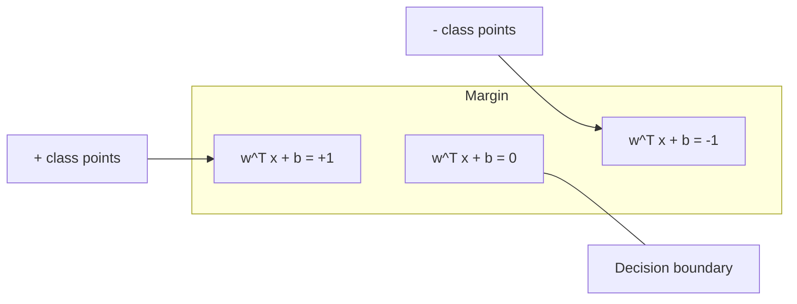
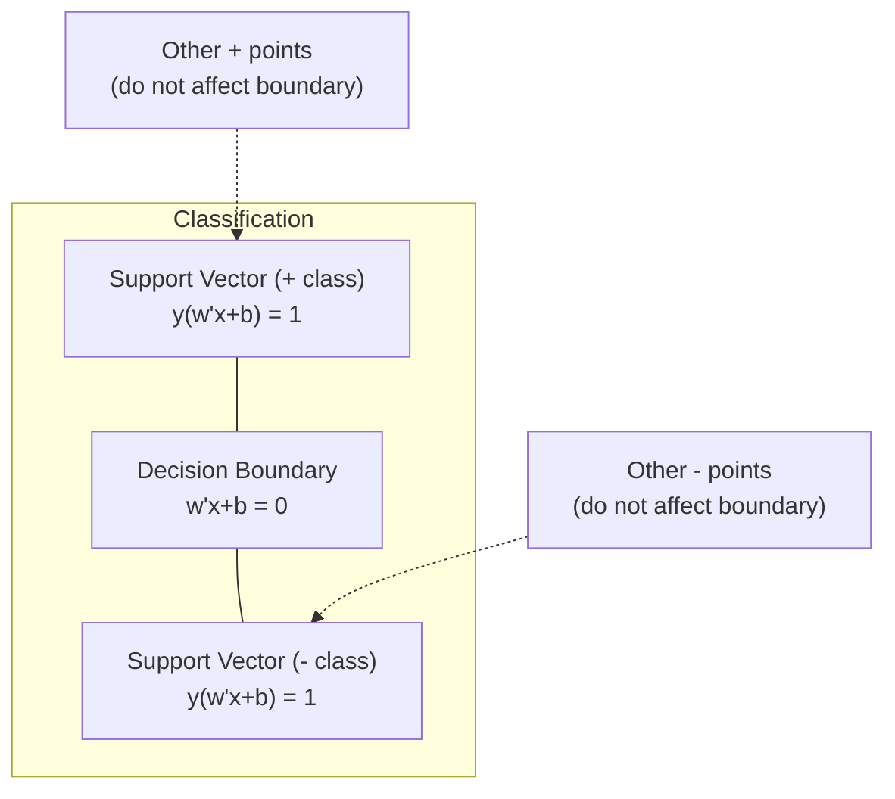
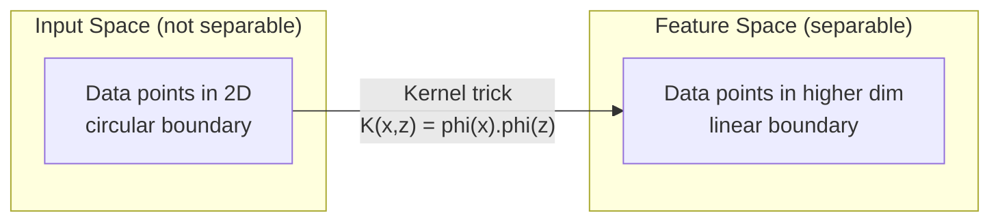

<!-- i18n:manual -->
# Метод опорных векторов

> Найдите самую широкую улицу между двумя классами. В этом вся идея.

**Type:** Build
**Language:** Python
**Prerequisites:** Phase 1 (Lessons 08 Optimization, 14 Norms and Distances, 18 Convex Optimization)
**Time:** ~90 minutes

## Learning Objectives

- Реализовать линейный SVM с нуля: hinge loss плюс градиентный спуск в прямой (primal) постановке
- Объяснить принцип максимального margin и находить опорные векторы в обученной модели
- Сравнить линейное, полиномиальное и RBF-ядро и объяснить, как kernel trick обходится без явного перехода в пространство высокой размерности
- Оценить компромисс между шириной margin и числом ошибок, которым управляет параметр C

> 🎒 **На пальцах.** Представьте, что между двумя дворами надо проложить дорогу. Провести её можно тысячей способов, но самая удобная — та, что идёт ровно посередине и максимально далеко от обоих заборов. SVM ищет именно такую дорогу, а «заборные» точки, которые её ограничивают, и называются опорными векторами.

## The Problem

У вас два класса точек, и нужно провести линию (или гиперплоскость), которая их разделяет. Подойдёт бесконечно много линий. Какую выбрать?

Ту, у которой самый широкий margin. Margin — это расстояние от разделяющей границы до ближайших точек с каждой стороны. Чем шире margin, тем увереннее классификатор и тем лучше он обобщается на новые данные.

Из этой интуиции вырастает Support Vector Machine — один из самых красивых с математической точки зрения алгоритмов в ML. До эпохи глубокого обучения SVM был главным методом классификации, и он до сих пор остаётся лучшим выбором для маленьких датасетов, данных высокой размерности и задач, где нужна хорошо изученная модель с теоретическими гарантиями.

SVM напрямую опирается на Phase 1: задача оптимизации выпуклая (Lesson 18), margin измеряется нормами (Lesson 14), а kernel trick пользуется скалярными произведениями, чтобы строить нелинейные границы, ни разу не заходя в пространство высокой размерности.

> 🎒 **На пальцах.** Почему широкая улица лучше узкой: если завтра придёт новая точка и слегка сдвинется в сторону, на широкой дороге она всё равно останется на своей полосе. На узкой — сразу окажется по ту сторону линии. Широкий margin — это запас прочности.

## The Concept

### The maximum margin classifier

Есть линейно разделимые данные: метки y_i из {-1, +1} и векторы признаков x_i. Нужна гиперплоскость w^T x + b = 0, которая разделяет классы.

Расстояние от точки x_i до гиперплоскости:

```
distance = |w^T x_i + b| / ||w||
```

Для правильно классифицированной точки: y_i * (w^T x_i + b) > 0. Margin — это удвоенное расстояние от гиперплоскости до ближайшей точки с любой из сторон.



Задача оптимизации:

```
maximize    2 / ||w||     (the margin width)
subject to  y_i * (w^T x_i + b) >= 1  for all i
```

Эквивалентная формулировка (минимизировать ||w||^2 удобнее):

```
minimize    (1/2) ||w||^2
subject to  y_i * (w^T x_i + b) >= 1  for all i
```

Это выпуклая квадратичная задача. У неё единственное глобальное решение. Точки, которые лежат ровно на границах margin (там, где y_i * (w^T x_i + b) = 1), и есть опорные векторы. Только они определяют разделяющую границу. Подвиньте или удалите любую другую точку — граница не сдвинется.

> 🎒 **На пальцах.** Ширина улицы равна 2 / ||w||. Значит, «сделать улицу шире» и «сделать ||w|| меньше» — это одно и то же действие. Проверьте руками: при ||w|| = 0.5 margin равен 2 / 0.5 = 4, а при ||w|| = 2 всего 2 / 2 = 1. Поэтому в задаче и написано «минимизировать ||w||^2» — так проще считать производные, а результат тот же.

### Support vectors: the critical few



Большинство обучающих точек не играют никакой роли. Важны только опорные векторы. Именно поэтому SVM экономен по памяти на этапе предсказания: хранить нужно опорные векторы, а не весь обучающий набор.

Количество опорных векторов ещё и даёт оценку ошибки обобщения. Чем их меньше относительно размера датасета, тем лучше модель обобщается.

> 🎒 **На пальцах.** Похоже на школьный забег: чтобы натянуть ленточку между двумя командами, важны только те, кто стоит у самого края. Если в датасете 1000 точек, а опорных векторов 20, модель фактически запомнила 20 примеров вместо тысячи — и предсказывает по ним. Остальные 980 можно выбросить, граница не шелохнётся.

### Soft margin: handling noise with the C parameter

Реальные данные почти никогда не разделяются идеально. Какие-то точки окажутся не с той стороны границы или внутри margin. Постановка с мягким margin (soft margin) разрешает такие нарушения, вводя slack-переменные.

```
minimize    (1/2) ||w||^2 + C * sum(xi_i)
subject to  y_i * (w^T x_i + b) >= 1 - xi_i
            xi_i >= 0  for all i
```

Slack-переменная xi_i показывает, насколько сильно точка i нарушает margin. Компромиссом управляет C:

| C value | Behavior |
|---------|----------|
| Large C | Наказывает нарушения жёстко. Узкий margin, меньше ошибок классификации. Переобучается |
| Small C | Разрешает больше нарушений. Широкий margin, больше ошибок классификации. Недообучается |

C — это сила регуляризации наоборот. Большое C = меньше регуляризации. Маленькое C = больше регуляризации.

> 🎒 **На пальцах.** C — это строгость учителя. Большое C: «ни одной ошибки, все точки строго по местам» — модель подстраивается под каждую случайную опечатку в данных. Маленькое C: «ну пара ошибок не страшна, зато правило простое». Если у вас в данных шум, ставьте C поменьше: несколько неправильно классифицированных точек дешевле, чем кривая граница.

### Hinge loss: the SVM loss function

Soft margin SVM можно переписать как задачу без ограничений:

```
minimize    (1/2) ||w||^2 + C * sum(max(0, 1 - y_i * (w^T x_i + b)))
```

Слагаемое max(0, 1 - y_i * f(x_i)) — это hinge loss. Оно равно нулю, когда точка классифицирована правильно и лежит за пределами margin. Оно линейно растёт, когда точка внутри margin или классифицирована неправильно.

```
Hinge loss for a single point:

loss
  |
  | \
  |  \
  |   \
  |    \
  |     \_______________
  |
  +-----|-----|-------->  y * f(x)
       0     1

Zero loss when y*f(x) >= 1 (correctly classified, outside margin).
Linear penalty when y*f(x) < 1.
```

Сравните с логистической функцией потерь (логистическая регрессия):

```
Hinge:     max(0, 1 - y*f(x))          Hard cutoff at margin
Logistic:  log(1 + exp(-y*f(x)))        Smooth, never exactly zero
```

Hinge loss даёт разреженные решения: ненулевой вклад вносят только опорные векторы. Логистическая функция потерь использует все точки данных. Поэтому SVM экономнее по памяти на предсказании.

> 🎒 **На пальцах.** Считаем hinge loss руками. Точка с y * f(x) = 1.2: она за margin, потери max(0, 1 − 1.2) = 0 — модель на неё не смотрит вообще. Точка с y * f(x) = 0.3: внутри margin, потери 1 − 0.3 = 0.7. Точка с y * f(x) = −0.5: ошибка, потери 1.5. Отсюда и название «шарнир» (hinge): график — прямая линия, которая в точке 1 ломается и превращается в ноль.

### Training a linear SVM with gradient descent

Линейный SVM можно обучать градиентным спуском по hinge loss с L2-регуляризацией, вообще не решая задачу с ограничениями:

```
L(w, b) = (lambda/2) * ||w||^2 + (1/n) * sum(max(0, 1 - y_i * (w^T x_i + b)))

Gradient with respect to w:
  If y_i * (w^T x_i + b) >= 1:  dL/dw = lambda * w
  If y_i * (w^T x_i + b) < 1:   dL/dw = lambda * w - y_i * x_i

Gradient with respect to b:
  If y_i * (w^T x_i + b) >= 1:  dL/db = 0
  If y_i * (w^T x_i + b) < 1:   dL/db = -y_i
```

Это называется прямой (primal) постановкой. Одна эпоха стоит O(n * d), где n — число примеров, d — число признаков. Для больших разреженных данных высокой размерности (классификация текстов) это быстро.

> 🎒 **На пальцах.** Обратите внимание на развилку в градиенте. Если точка уже далеко за margin (y_i * (w^T x_i + b) >= 1), в градиенте остаётся только lambda * w — то есть веса просто медленно сжимаются к нулю, а сама точка ни на что не влияет. И наоборот: точка внутри margin добавляет свой вектор −y_i * x_i и реально тянет границу. Модель учится только на «спорных» примерах.

### The dual formulation and the kernel trick

Двойственная задача Лагранжа для SVM (Phase 1 Lesson 18, условия KKT) выглядит так:

```
maximize    sum(alpha_i) - (1/2) * sum_ij(alpha_i * alpha_j * y_i * y_j * (x_i . x_j))
subject to  0 <= alpha_i <= C
            sum(alpha_i * y_i) = 0
```

В двойственной задаче фигурируют только скалярные произведения x_i . x_j между точками данных. В этом вся суть. Замените каждое скалярное произведение на функцию ядра K(x_i, x_j) — и SVM научится строить нелинейные границы, ни разу не вычислив само преобразование.

```
Linear kernel:      K(x, z) = x . z
Polynomial kernel:  K(x, z) = (x . z + c)^d
RBF (Gaussian):     K(x, z) = exp(-gamma * ||x - z||^2)
```

RBF-ядро отображает данные в бесконечномерное пространство. У близких во входном пространстве точек значение ядра около 1. У далёких — около 0. Таким ядром можно выучить любую гладкую границу.



Kernel trick вычисляет скалярное произведение в пространстве высокой размерности, ни разу туда не попадая. Для полиномиального ядра степени d в D измерениях явное пространство признаков имеет O(D^d) измерений. А K(x, z) считается за O(D).

> 🎒 **На пальцах.** Возьмите x = [1, 2] и z = [3, 4]. Скалярное произведение: 1×3 + 2×4 = 11. Полиномиальное ядро степени 3 с c = 1: (11 + 1)^3 = 12^3 = 1728. Три умножения — и вы получили ответ, который «по-честному» потребовал бы построить десятки новых признаков вида x1^2, x1*x2, x1^2*x2 и так далее. RBF на тех же точках: разность [−2, −2], квадрат длины 8, при gamma = 0.5 получаем exp(−4) ≈ 0.018 — то есть «почти не похожи».

### SVM for regression (SVR)

Support Vector Regression натягивает на данные трубу ширины epsilon. Точки внутри трубы дают нулевые потери. Точки снаружи штрафуются линейно.

```
minimize    (1/2) ||w||^2 + C * sum(xi_i + xi_i*)
subject to  y_i - (w^T x_i + b) <= epsilon + xi_i
            (w^T x_i + b) - y_i <= epsilon + xi_i*
            xi_i, xi_i* >= 0
```

Параметр epsilon задаёт ширину трубы. Шире труба = меньше опорных векторов = более гладкая подгонка. Уже труба = больше опорных векторов = более точная подгонка.

> 🎒 **На пальцах.** Классификация ищет широкую пустую улицу между классами, а регрессия — наоборот, широкий коридор, внутри которого лежит как можно больше точек. Если epsilon = 0.5, то точка с истинным значением 10.3 при предсказании 10.0 не штрафуется вообще: промах 0.3 меньше 0.5. А промах 0.9 обойдётся в 0.9 − 0.5 = 0.4.

### Why SVMs lost to deep learning (and when they still win)

SVM доминировали в ML с конца 1990-х до начала 2010-х. Глубокое обучение обошло их по нескольким причинам:

| Factor | SVMs | Deep learning |
|--------|------|---------------|
| Инженерия признаков | Нужна вручную | Выучивает признаки сама |
| Масштабируемость | От O(n^2) до O(n^3) с ядром | O(n) за эпоху с SGD |
| Картинки/текст/звук | Нужны рукодельные признаки | Учится на сырых данных |
| Большие датасеты (>100k) | Медленно | Масштабируется хорошо |
| Ускорение на GPU | Выигрыш небольшой | Ускорение огромное |

SVM всё ещё выигрывают в таких ситуациях:
- Маленькие датасеты (от сотен до нескольких тысяч примеров)
- Разреженные данные высокой размерности (тексты с TF-IDF признаками)
- Когда нужны математические гарантии (оценки через margin)
- Когда время обучения должно быть минимальным (линейный SVM очень быстрый)
- Бинарная классификация с явной структурой margin
- Поиск аномалий (one-class SVM)

```figure
svm-margin
```

> 🎒 **На пальцах.** Ключевая строка таблицы — масштабируемость. O(n^2) означает: увеличили датасет в 10 раз — время выросло в 100 раз. Датасет из 1000 примеров обучится мгновенно, из 100 000 — вы уйдёте пить чай. Поэтому SVM живут там, где данных мало, а нейросети — там, где их миллионы.

## Build It

### Step 1: Hinge loss and gradient

Фундамент. Считаем hinge loss для batch и его градиент.

```python
def hinge_loss(X, y, w, b):
    n = len(X)
    total_loss = 0.0
    for i in range(n):
        margin = y[i] * (dot(w, X[i]) + b)
        total_loss += max(0.0, 1.0 - margin)
    return total_loss / n
```

### Step 2: Linear SVM via gradient descent

Обучаем минимизацией hinge loss с регуляризацией. Решатель квадратичных задач не нужен.

```python
class LinearSVM:
    def __init__(self, lr=0.001, lambda_param=0.01, n_epochs=1000):
        self.lr = lr
        self.lambda_param = lambda_param
        self.n_epochs = n_epochs
        self.w = None
        self.b = 0.0

    def fit(self, X, y):
        n_features = len(X[0])
        self.w = [0.0] * n_features
        self.b = 0.0

        for epoch in range(self.n_epochs):
            for i in range(len(X)):
                margin = y[i] * (dot(self.w, X[i]) + self.b)
                if margin >= 1:
                    self.w = [wj - self.lr * self.lambda_param * wj
                              for wj in self.w]
                else:
                    self.w = [wj - self.lr * (self.lambda_param * wj - y[i] * X[i][j])
                              for j, wj in enumerate(self.w)]
                    self.b -= self.lr * (-y[i])

    def predict(self, X):
        return [1 if dot(self.w, x) + self.b >= 0 else -1 for x in X]
```

> 🎒 **На пальцах.** Посмотрите на `if margin >= 1`. Это буквально «точка уже правильно классифицирована и стоит далеко — трогаем только веса, саму точку игнорируем». В `else` веса дополнительно двигаются в сторону этой точки. С настройками по умолчанию (`lr=0.001`, `n_epochs=1000`) алгоритм проходит по всему датасету 1000 раз, каждый раз делая крошечный шаг размером 0.001.

### Step 3: Kernel functions

Реализуем линейное, полиномиальное и RBF-ядро.

```python
def linear_kernel(x, z):
    return dot(x, z)

def polynomial_kernel(x, z, degree=3, c=1.0):
    return (dot(x, z) + c) ** degree

def rbf_kernel(x, z, gamma=0.5):
    diff = [xi - zi for xi, zi in zip(x, z)]
    return math.exp(-gamma * dot(diff, diff))
```

> 🎒 **На пальцах.** Все три функции — это способы ответить на вопрос «насколько эти два объекта похожи», просто по-разному. Линейное: чем больше скалярное произведение, тем похожее. Полиномиальное: то же самое, но возведённое в степень, что резко усиливает разницу между «похоже» и «не очень». RBF: одинаковые точки дают ровно `exp(0) = 1`, а далёкие — почти ноль.

### Step 4: Margin and support vector identification

После обучения находим, какие точки оказались опорными векторами, и считаем ширину margin.

```python
def find_support_vectors(X, y, w, b, tol=1e-3):
    support_vectors = []
    for i in range(len(X)):
        margin = y[i] * (dot(w, X[i]) + b)
        if abs(margin - 1.0) < tol:
            support_vectors.append(i)
    return support_vectors
```

Полная реализация со всеми демонстрациями — в `code/svm.py`.

> 🎒 **На пальцах.** Зачем здесь `tol=1e-3`: из-за арифметики с плавающей точкой margin почти никогда не будет ровно 1.0. Точка с margin 1.0004 пройдёт проверку `abs(margin - 1.0) < 0.001` и попадёт в опорные векторы, а точка с margin 1.05 — нет, она стоит слишком далеко от границы.

## Use It

Через scikit-learn:

```python
from sklearn.svm import SVC, LinearSVC, SVR
from sklearn.preprocessing import StandardScaler
from sklearn.pipeline import Pipeline

clf = Pipeline([
    ("scaler", StandardScaler()),
    ("svm", SVC(kernel="rbf", C=1.0, gamma="scale")),
])
clf.fit(X_train, y_train)
print(f"Accuracy: {clf.score(X_test, y_test):.4f}")
print(f"Support vectors: {clf['svm'].n_support_}")
```

Важно: всегда масштабируйте признаки перед обучением SVM. SVM чувствителен к масштабам признаков, потому что margin зависит от ||w||, а немасштабированные признаки искажают геометрию.

Для больших датасетов используйте `LinearSVC` (прямая постановка, O(n) за эпоху) вместо `SVC` (двойственная постановка, от O(n^2) до O(n^3)):

```python
from sklearn.svm import LinearSVC

clf = Pipeline([
    ("scaler", StandardScaler()),
    ("svm", LinearSVC(C=1.0, max_iter=10000)),
])
```

> 🎒 **На пальцах.** Почему без `StandardScaler` всё ломается. Пусть один признак — возраст (от 18 до 70), а второй — зарплата (от 30000 до 200000). В формуле расстояния зарплата даёт разницы в тысячи, а возраст — в десятки, поэтому возраст просто перестаёт существовать для модели. `StandardScaler` приводит оба признака к одному масштабу, и SVM наконец видит их обоих.

## Exercises

1. Сгенерируйте линейно разделимый двумерный датасет. Обучите свой LinearSVM и найдите опорные векторы. Убедитесь, что опорные векторы — это точки, ближайшие к разделяющей границе.

2. Переберите C от 0.001 до 1000 на зашумлённом датасете. Нарисуйте разделяющую границу для каждого значения C. Проследите переход от широкого margin (недообучение) к узкому (переобучение).

3. Создайте датасет, где границы классов круговые, а не линейные. Покажите, что линейный SVM с ними не справляется. Посчитайте матрицу RBF-ядра и покажите, что в порождённом ядром пространстве признаков классы становятся разделимыми.

4. Сравните hinge loss и логистическую функцию потерь на одном датасете. Обучите линейный SVM и логистическую регрессию. Посчитайте, сколько обучающих точек вносит вклад в границу каждой модели (опорные векторы против всех точек).

5. Реализуйте SVR (epsilon-нечувствительная функция потерь). Обучите его на y = sin(x) + шум. Нарисуйте epsilon-трубу вокруг предсказаний и выделите опорные векторы (точки за пределами трубы).

> 🎒 **На пальцах.** Подсказка ко второму заданию: возьмите не 5 значений C подряд, а логарифмическую шкалу — 0.001, 0.01, 0.1, 1, 10, 100, 1000. Разница между C = 1 и C = 2 почти не видна, а между C = 0.01 и C = 100 — огромная. С такими параметрами всегда шагают умножением на 10, а не прибавлением.

## Key Terms

| Term | What it actually means |
|------|----------------------|
| Support vectors | Обучающие точки, ближайшие к разделяющей границе. Единственные точки, которые определяют гиперплоскость |
| Margin | Расстояние от разделяющей границы до ближайших опорных векторов. SVM его максимизирует |
| Hinge loss | max(0, 1 - y*f(x)). Ноль, если точка классифицирована верно и лежит за margin. Иначе линейный штраф |
| C parameter | Компромисс между шириной margin и числом ошибок. Большое C = узкий margin, маленькое C = широкий |
| Soft margin | Постановка SVM, разрешающая нарушения margin через slack-переменные. Работает на неразделимых данных |
| Kernel trick | Вычисление скалярных произведений в пространстве высокой размерности без явного перехода в него |
| Linear kernel | K(x, z) = x . z. То же самое, что обычное скалярное произведение. Для линейно разделимых данных |
| RBF kernel | K(x, z) = exp(-gamma * \|\|x-z\|\|^2). Отображает в бесконечномерное пространство. Учит любую гладкую границу |
| Polynomial kernel | K(x, z) = (x . z + c)^d. Отображает в пространство полиномиальных комбинаций признаков |
| Dual formulation | Переформулировка задачи SVM, зависящая только от скалярных произведений между точками. Делает возможными ядра |
| SVR | Support Vector Regression. Натягивает на данные epsilon-трубу. Точки внутри трубы дают нулевые потери |
| Slack variables | xi_i: насколько сильно точка нарушает margin. Ноль для верно классифицированных точек за пределами margin |
| Maximum margin | Принцип выбора гиперплоскости, которая максимизирует расстояние до ближайших точек каждого класса |

## Further Reading

- [Vapnik: The Nature of Statistical Learning Theory (1995)](https://link.springer.com/book/10.1007/978-1-4757-3264-1) - основополагающий текст по SVM и статистической теории обучения
- [Cortes & Vapnik: Support-vector networks (1995)](https://link.springer.com/article/10.1007/BF00994018) - оригинальная статья про SVM
- [Platt: Sequential Minimal Optimization (1998)](https://www.microsoft.com/en-us/research/publication/sequential-minimal-optimization-a-fast-algorithm-for-training-support-vector-machines/) - алгоритм SMO, сделавший обучение SVM практичным
- [scikit-learn SVM documentation](https://scikit-learn.org/stable/modules/svm.html) - практическое руководство с деталями реализации
- [LIBSVM: A Library for Support Vector Machines](https://www.csie.ntu.edu.tw/~cjlin/libsvm/) - C++ библиотека, лежащая в основе большинства реализаций SVM
