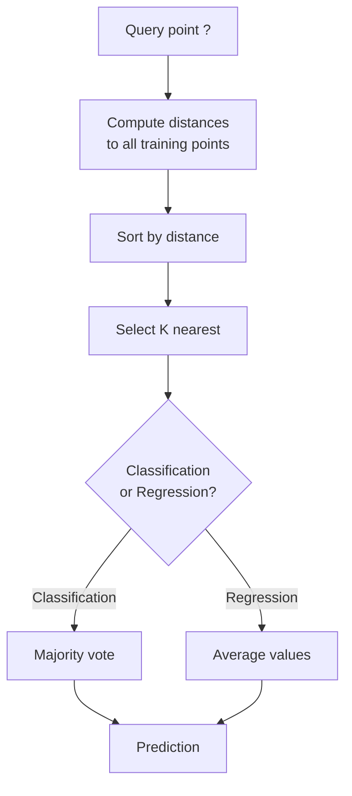
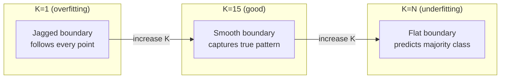
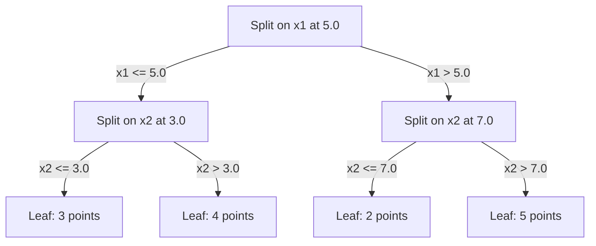

<!-- i18n:manual -->
# K ближайших соседей и расстояния

> Запомнить всё. Предсказывать, глядя на соседей. Самый простой алгоритм, который действительно работает.

**Type:** Build
**Language:** Python
**Prerequisites:** Phase 1 (Lesson 14 Norms and Distances)
**Time:** ~90 minutes

## Learning Objectives

- Реализовать классификацию и регрессию методом KNN с нуля: настраиваемое K и взвешивание по расстоянию
- Сравнить метрики L1, L2, косинусную и Минковского и выбирать подходящую под тип данных
- Объяснить проклятие размерности и показать, почему KNN деградирует в пространствах высокой размерности
- Построить KD-дерево для быстрого поиска ближайших соседей и понять, когда оно выигрывает у полного перебора

> 🎒 **На пальцах.** Новый ученик пришёл в класс, и надо угадать, чем он увлекается. Простой способ: посмотреть на пятерых, кто сидит к нему ближе всего, и взять то, чем занимается большинство из них. Это и есть KNN целиком. Никакой учёбы, никаких формул — просто «посмотри на соседей».

## The Problem

У вас есть датасет. Приходит новая точка. Её нужно классифицировать или предсказать для неё значение. Вместо того чтобы выучивать параметры по данным (как линейная регрессия или SVM), вы просто находите K ближайших обучающих точек и даёте им проголосовать.

Это метод K ближайших соседей. Фазы обучения нет. Параметров, которые надо выучить, нет. Функции потерь, которую надо минимизировать, тоже нет. Вы храните весь обучающий набор и считаете расстояния в момент предсказания.

Звучит слишком просто, чтобы работать. Но KNN на удивление конкурентоспособен во многих задачах, особенно на маленьких и средних датасетах, а глубокое понимание метода вскрывает фундаментальные вещи: выбор метрики расстояния (отсылка к Phase 1 Lesson 14), проклятие размерности и разницу между ленивым и жадным обучением.

KNN встречается везде в современном AI, просто под другими именами. Векторные базы данных ищут ближайших соседей среди эмбеддингов. Retrieval-augmented generation (RAG) находит K ближайших кусков документов. Рекомендательные системы находят похожих пользователей или товары. Алгоритм тот же. Отличаются масштаб и структуры данных.

> 🎒 **На пальцах.** Когда вы спрашиваете у ChatGPT про свои документы и он «находит нужный кусок» — под капотом там ровно этот алгоритм: посчитать расстояние от вашего вопроса до каждого куска текста и взять 5 ближайших. Разница только в том, что кусков может быть миллиард, поэтому там нужны хитрые структуры данных, а не простой цикл.

## The Concept

### How KNN works

Дан набор размеченных точек и новая точка-запрос:

1. Посчитать расстояние от запроса до каждой точки датасета
2. Отсортировать по расстоянию
3. Взять K ближайших точек
4. Для классификации: голосование большинством среди K соседей
5. Для регрессии: среднее (или взвешенное среднее) значений K соседей



Это весь алгоритм. Никакой подгонки. Никакого градиентного спуска. Никаких эпох.

> 🎒 **На пальцах.** Проверьте на пальцах: K = 5, и среди пяти соседей три «кошки» и две «собаки». Ответ — «кошка», 3 против 2. Для регрессии те же пять соседей с ценами 100, 120, 110, 130, 140 дадут (100 + 120 + 110 + 130 + 140) / 5 = 120. Вот и всё «предсказание».

### Choosing K

K — единственный гиперпараметр. Он управляет компромиссом смещения и разброса:

| K | Behavior |
|---|----------|
| K = 1 | Граница повторяет каждую точку. Нулевая ошибка на обучении. Высокий разброс. Переобучение |
| Small K (3-5) | Чувствителен к локальной структуре. Умеет ловить сложные границы |
| Large K | Более гладкие границы. Устойчивее к шуму. Может недообучиться |
| K = N | Для каждой точки предсказывает самый частый класс. Максимальное смещение |

Разумная стартовая точка — K = sqrt(N) для датасета из N точек. Для бинарной классификации берите нечётное K, чтобы не было ничьих.



> 🎒 **На пальцах.** K = 1 — это «слушать только лучшего друга»: если он ошибся, ошиблись и вы. K = N — «слушать всю страну»: ответ всегда одинаковый и бесполезный. Правило sqrt(N) на датасете из 10 000 точек даёт K = 100. И нечётное K нужно ровно затем, чтобы при двух классах не вышло 2:2 — иначе голосование ничего не решает.

### Distance metrics

Функция расстояния определяет, что значит «рядом». Разные метрики дают разных соседей и разные предсказания.

**L2 (Euclidean)** — метрика по умолчанию. Расстояние по прямой.

```
d(a, b) = sqrt(sum((a_i - b_i)^2))
```

Чувствительна к масштабу признаков. Всегда стандартизируйте признаки, прежде чем использовать L2 в KNN.

**L1 (Manhattan)** складывает модули разностей. Устойчивее к выбросам, чем L2, потому что не возводит разности в квадрат.

```
d(a, b) = sum(|a_i - b_i|)
```

**Cosine distance** измеряет угол между векторами, игнорируя длину. Незаменима для текста и эмбеддингов.

```
d(a, b) = 1 - (a . b) / (||a|| * ||b||)
```

**Minkowski** обобщает L1 и L2 через параметр p.

```
d(a, b) = (sum(|a_i - b_i|^p))^(1/p)

p=1: Manhattan
p=2: Euclidean
p->inf: Chebyshev (max absolute difference)
```

Какую метрику брать, зависит от данных:

| Data type | Best metric | Why |
|-----------|------------|-----|
| Числовые признаки, схожий масштаб | L2 (Euclidean) | По умолчанию, хорошо работает для пространственных данных |
| Числовые признаки, есть выбросы | L1 (Manhattan) | Устойчива, не раздувает большие разности |
| Эмбеддинги текста | Cosine | Длина — это шум, смысл в направлении |
| Разреженные данные высокой размерности | Cosine или L1 | L2 страдает от проклятия размерности |
| Смешанные типы | Своя метрика | Комбинировать метрики по типам признаков |

> 🎒 **На пальцах.** Точки (0, 0) и (3, 4). По L2 расстояние 5 — это полёт по прямой. По L1 оно 3 + 4 = 7 — это путь по улицам квартала, отсюда и «манхэттенское». А косинусное расстояние между [1, 0] и [10, 0] равно нулю: векторы разной длины, но смотрят в одну сторону. Поэтому для текстов берут косинус: длинная статья и короткая заметка об одном и том же должны считаться похожими.

### Weighted KNN

Обычный KNN даёт всем K соседям одинаковый вес. Но сосед на расстоянии 0.1 должен значить больше, чем сосед на расстоянии 5.0.

**Distance-weighted KNN** взвешивает каждого соседа обратно пропорционально расстоянию:

```
weight_i = 1 / (distance_i + epsilon)

For classification: weighted vote
For regression:     weighted average = sum(w_i * y_i) / sum(w_i)
```

Epsilon защищает от деления на ноль, когда точка-запрос в точности совпадает с обучающей точкой.

Взвешенный KNN менее чувствителен к выбору K, потому что дальние соседи всё равно вносят очень маленький вклад.

> 🎒 **На пальцах.** Посчитайте веса для тех самых расстояний. Сосед на 0.1 получает вес 1 / 0.1 = 10, сосед на 5.0 — вес 1 / 5.0 = 0.2. Разница в 50 раз: ближний сосед фактически решает всё сам. Именно поэтому со взвешиванием можно спокойно ставить K = 30 — лишние двадцать далёких соседей просто утонут в весах.

### The curse of dimensionality

В высоких размерностях KNN работает всё хуже. Это не расплывчатое опасение, а математический факт.

**Problem 1: distances converge.** С ростом размерности отношение максимального расстояния к минимальному стремится к 1. Все точки становятся одинаково «далёкими» от запроса.

```
In d dimensions, for random uniform points:

d=2:    max_dist / min_dist = varies widely
d=100:  max_dist / min_dist ~ 1.01
d=1000: max_dist / min_dist ~ 1.001

When all distances are nearly equal, "nearest" is meaningless.
```

**Problem 2: volume explodes.** Чтобы поймать K соседей в фиксированной доле данных, радиус поиска приходится раздувать так, что он покрывает уже огромную часть пространства признаков. «Окрестность» в высоких размерностях охватывает почти всё пространство.

**Problem 3: corners dominate.** В единичном гиперкубе в d измерениях почти весь объём сосредоточен у углов, а не в центре. Доля объёма вписанного в куб шара стремится к нулю с ростом d.

Практический вывод: KNN хорошо работает примерно до 20-50 признаков. Дальше нужно снижать размерность (PCA, UMAP, t-SNE) перед применением KNN — или использовать древовидные структуры поиска, которые опираются на внутреннюю, более низкую размерность данных.

> 🎒 **На пальцах.** Взгляните на числа: при d = 1000 отношение максимального расстояния к минимальному равно 1.001. То есть самый далёкий сосед дальше самого ближнего всего на одну десятую процента. Слово «ближайший» тут теряет смысл: выбирать «ближайшего» из таких — то же самое, что тыкать пальцем наугад.

### KD-trees: fast nearest neighbor search

Перебор в лоб считает расстояние от запроса до каждой обучающей точки. Это O(n * d) на запрос. Для больших датасетов слишком медленно.

KD-дерево рекурсивно режет пространство по осям признаков. На каждом уровне оно делит данные по одному измерению в точке медианы.



Чтобы найти ближайшего соседа, спускаемся по дереву до листа, содержащего запрос, затем идём обратно и проверяем соседние области только если в них вообще могут оказаться более близкие точки.

Среднее время запроса: O(log n) для низких размерностей. Но в высоких размерностях (d > 20) KD-деревья деградируют до O(n), потому что при возврате отсекается всё меньше и меньше веток.

> 🎒 **На пальцах.** Это поиск по алфавитному указателю вместо чтения книги подряд. При миллионе точек полный перебор — это миллион сравнений, а спуск по дереву — примерно log2(1 000 000) ≈ 20 шагов. Выигрыш в десятки тысяч раз. Правда, только пока признаков мало: при d > 20 дерево перестаёт помогать и снова превращается в перебор.

### Ball trees: better for moderate dimensions

Ball tree режет данные на вложенные гиперсферы вместо параллельных осям прямоугольников. Каждый узел задаёт шар (центр + радиус), содержащий все точки своего поддерева.

Преимущества перед KD-деревьями:
- Лучше работают на средних размерностях (примерно до 50)
- Справляются со структурой, не выровненной по осям
- Более плотные ограничивающие объёмы означают, что при поиске отсекается больше веток

И KD-деревья, и ball trees дают точный ответ. Для по-настоящему больших масштабов (миллионы точек, сотни измерений) вместо них используют приближённые методы поиска соседей (HNSW, IVF, product quantization). Они разбираются в Phase 1 Lesson 14.

> 🎒 **На пальцах.** Разница как между коробками и мыльными пузырями. KD-дерево нарезает пространство строго по линиям сетки, поэтому вокруг наклонного облака точек остаётся много пустоты. Ball tree обтягивает то же облако шаром — пустоты меньше, значит при поиске можно раньше сказать «сюда точно заходить не надо».

### Lazy learning vs eager learning

KNN — ленивый ученик: он не делает ничего во время обучения и делает всю работу во время предсказания. Большинство других алгоритмов (линейная регрессия, SVM, нейросети) — жадные ученики: они выполняют тяжёлые вычисления на обучении, чтобы построить компактную модель, зато потом предсказывают быстро.

| Aspect | Lazy (KNN) | Eager (SVM, neural net) |
|--------|------------|------------------------|
| Время обучения | O(1), просто сохранить данные | O(n * epochs) |
| Время предсказания | O(n * d) на запрос | O(d) или O(параметров) |
| Память при предсказании | Хранить весь обучающий набор | Хранить только параметры модели |
| Реакция на новые данные | Точки добавляются мгновенно | Модель надо переобучать |
| Разделяющая граница | Неявная, считается на лету | Явная, зафиксирована после обучения |

Ленивое обучение хорошо, когда:
- Датасет часто меняется (точки добавляются и удаляются без переобучения)
- Предсказаний нужно совсем немного
- Хочется нулевого времени обучения
- Датасет достаточно маленький, чтобы перебор в лоб был быстрым

> 🎒 **На пальцах.** Жадный ученик — школьник, который выучил все правила заранее и на контрольной пишет мгновенно. Ленивый — тот, кто ничего не учил, но пришёл с полным рюкзаком учебников и ищет ответ прямо на контрольной. Первому дорого готовиться, второму дорого отвечать. Зато когда программу меняют, ленивому достаточно доложить в рюкзак ещё одну книжку.

### KNN for regression

Вместо голосования большинством KNN для регрессии усредняет целевые значения K соседей.

```
prediction = (1/K) * sum(y_i for i in K nearest neighbors)

Or with distance weighting:
prediction = sum(w_i * y_i) / sum(w_i)
where w_i = 1 / distance_i
```

KNN-регрессия даёт кусочно-постоянные предсказания (или кусочно-гладкие, если использовать взвешивание). Она не умеет экстраполировать за пределы диапазона обучающих данных. Если все целевые значения на обучении лежат между 0 и 100, KNN никогда не предскажет 200.

```figure
knn-smoothness
```

> 🎒 **На пальцах.** Про экстраполяцию: обучите KNN на квартирах площадью от 30 до 100 м² с ценами от 3 до 10 млн, и он никогда не назовёт цену выше 10 млн — даже для дворца в 500 м². Просто потому, что усреднять он может только те числа, которые уже видел. Линейная регрессия тут бы смело продолжила прямую, а KNN упрётся в потолок.

## Build It

### Step 1: Distance functions

Реализуем расстояния L1, L2, косинусное и Минковского. Это прямое продолжение Phase 1 Lesson 14.

```python
import math

def l2_distance(a, b):
    return math.sqrt(sum((ai - bi) ** 2 for ai, bi in zip(a, b)))

def l1_distance(a, b):
    return sum(abs(ai - bi) for ai, bi in zip(a, b))

def cosine_distance(a, b):
    dot_val = sum(ai * bi for ai, bi in zip(a, b))
    norm_a = math.sqrt(sum(ai ** 2 for ai in a))
    norm_b = math.sqrt(sum(bi ** 2 for bi in b))
    if norm_a == 0 or norm_b == 0:
        return 1.0
    return 1.0 - dot_val / (norm_a * norm_b)

def minkowski_distance(a, b, p=2):
    if p == float('inf'):
        return max(abs(ai - bi) for ai, bi in zip(a, b))
    return sum(abs(ai - bi) ** p for ai, bi in zip(a, b)) ** (1 / p)
```

> 🎒 **На пальцах.** Обратите внимание на проверку `if norm_a == 0 or norm_b == 0` в косинусном расстоянии: у нулевого вектора нет направления, угол посчитать невозможно, поэтому возвращаем 1.0 — «максимально не похожи». А в `minkowski_distance` при p = 2 формула буквально превращается в L2, при p = 1 — в L1. Одна функция вместо трёх.

### Step 2: KNN classifier and regressor

Собираем полноценный KNN с настраиваемым K, метрикой расстояния и опциональным взвешиванием по расстоянию.

```python
class KNN:
    def __init__(self, k=5, distance_fn=l2_distance, weighted=False,
                 task="classification"):
        self.k = k
        self.distance_fn = distance_fn
        self.weighted = weighted
        self.task = task
        self.X_train = None
        self.y_train = None

    def fit(self, X, y):
        self.X_train = X
        self.y_train = y

    def predict(self, X):
        return [self._predict_one(x) for x in X]
```

> 🎒 **На пальцах.** Найдите глазами метод `fit`. Он просто присваивает две переменные — и всё, «обучение» закончено. Это самая честная иллюстрация ленивого обучения: вся настоящая работа спрятана в `predict`, который для каждой новой точки заново пробегает по всему датасету.

### Step 3: KD-tree for efficient search

Строим KD-дерево с нуля: оно рекурсивно делит данные по медиане очередного измерения.

```python
class KDTree:
    def __init__(self, X, indices=None, depth=0):
        # Recursively partition the data
        self.axis = depth % len(X[0])
        # Split on median of the current axis
        ...

    def query(self, point, k=1):
        # Traverse to leaf, then backtrack
        ...
```

Полная реализация со всеми вспомогательными методами и демонстрациями — в `code/knn.py`.

### Step 4: Feature scaling

KNN требует масштабирования признаков, потому что расстояния чувствительны к величине значений. Признак со значениями от 0 до 1000 полностью заглушит признак со значениями от 0 до 1.

```python
def standardize(X):
    n = len(X)
    d = len(X[0])
    means = [sum(X[i][j] for i in range(n)) / n for j in range(d)]
    stds = [
        max(1e-10, (sum((X[i][j] - means[j]) ** 2 for i in range(n)) / n) ** 0.5)
        for j in range(d)
    ]
    return [[((X[i][j] - means[j]) / stds[j]) for j in range(d)] for i in range(n)], means, stds
```

> 🎒 **На пальцах.** Посчитаем, насколько всё плохо без масштабирования. Две квартиры: разница по площади 20 м², разница по числу комнат 1. В квадрате расстояния это 400 против 1 — число комнат просто исчезает из расчёта. После стандартизации оба признака приводятся к среднему 0 и разбросу 1, и голос каждого становится сопоставимым.

## Use It

Через scikit-learn:

```python
from sklearn.neighbors import KNeighborsClassifier
from sklearn.preprocessing import StandardScaler
from sklearn.pipeline import Pipeline

clf = Pipeline([
    ("scaler", StandardScaler()),
    ("knn", KNeighborsClassifier(n_neighbors=5, metric="euclidean")),
])
clf.fit(X_train, y_train)
print(f"Accuracy: {clf.score(X_test, y_test):.4f}")
```

Scikit-learn сам переключается на KD-деревья или ball trees, когда датасет достаточно большой, а размерность достаточно низкая. Для данных высокой размерности он откатывается к полному перебору. Управлять этим можно параметром `algorithm`.

Для поиска соседей на больших масштабах (миллионы векторов) используйте FAISS, Annoy или векторную базу данных:

```python
import faiss

index = faiss.IndexFlatL2(dimension)
index.add(embeddings)
distances, indices = index.search(query_vectors, k=5)
```

> 🎒 **На пальцах.** Имя `IndexFlatL2` расшифровывается буквально: «плоский» индекс — то есть тот самый перебор в лоб, только написанный на C и векторизованный. Даже он на миллионе векторов работает быстрее любого цикла на Python. А ускоренные индексы FAISS дают ответ приблизительный: чуть-чуть точности в обмен на стократную скорость.

## Exercises

1. Реализуйте KNN-классификацию на двумерном датасете с 3 классами. Нарисуйте разделяющую границу для K=1, K=5, K=15 и K=N. Проследите переход от переобучения к недообучению.

2. Сгенерируйте 1000 случайных точек в 2, 5, 10, 50, 100 и 500 измерениях. Для каждой размерности посчитайте отношение максимального попарного расстояния к минимальному. Постройте график отношения от размерности, чтобы увидеть проклятие размерности.

3. Сравните L1, L2 и косинусное расстояние для KNN на задаче классификации текстов (используйте TF-IDF векторы). Какая метрика даёт лучшую точность? Почему на текстах обычно выигрывает косинус?

4. Реализуйте KD-дерево и замерьте время запроса против полного перебора на датасетах из 1k, 10k и 100k точек в 2D, 10D и 50D. При какой размерности KD-дерево перестаёт выигрывать у перебора?

5. Постройте взвешенный KNN-регрессор для y = sin(x) + шум. Сравните его с невзвешенным KNN при K=3, 10, 30. Покажите, что взвешивание даёт более гладкие предсказания, особенно при больших K.

> 🎒 **На пальцах.** Подсказка ко второму заданию: считайте отношение, а не сами расстояния. При d = 2 у вас получится что-то вроде 20 или 50 (ближайшая пара очень близко, дальняя очень далеко), при d = 500 — почти ровно 1. График лучше строить с логарифмической осью по размерности, иначе точки 2 и 5 сольются в левом углу.

## Key Terms

| Term | What it actually means |
|------|----------------------|
| K-nearest neighbors | Непараметрический алгоритм, который предсказывает, находя K ближайших к запросу обучающих точек |
| Lazy learning | Никаких вычислений на обучении. Вся работа происходит при предсказании. KNN — канонический пример |
| Eager learning | Тяжёлые вычисления на обучении ради компактной модели. Большинство ML-алгоритмов жадные |
| Curse of dimensionality | В высоких размерностях расстояния сближаются, а окрестности разрастаются на всё пространство, из-за чего KNN перестаёт работать |
| KD-tree | Бинарное дерево, рекурсивно делящее пространство по осям признаков. Запросы за O(log n) в низких размерностях |
| Ball tree | Дерево вложенных гиперсфер. Работает лучше KD-деревьев на средних размерностях (примерно до 50) |
| Weighted KNN | Соседи взвешиваются обратно пропорционально расстоянию. Ближние соседи сильнее влияют на предсказание |
| Feature scaling | Приведение признаков к сопоставимым диапазонам. Обязательно для методов на основе расстояний вроде KNN |
| Majority vote | Классификация подсчётом того, какой класс чаще всего встречается среди K соседей |
| Brute force search | Расстояние считается до каждой обучающей точки. O(n*d) на запрос. Точно, но медленно при большом n |
| Approximate nearest neighbor | Алгоритмы (HNSW, LSH, IVF), находящие приблизительно ближайшие точки гораздо быстрее точного поиска |
| Voronoi diagram | Разбиение пространства, где каждая область содержит все точки, ближайшие к одной обучающей точке. KNN с K=1 порождает границы Вороного |

## Further Reading

- [Cover & Hart: Nearest Neighbor Pattern Classification (1967)](https://ieeexplore.ieee.org/document/1053964) - основополагающая статья про KNN с доказательством, что его ошибка не более чем вдвое хуже байесовски оптимальной
- [Friedman, Bentley, Finkel: An Algorithm for Finding Best Matches in Logarithmic Expected Time (1977)](https://dl.acm.org/doi/10.1145/355744.355745) - оригинальная статья про KD-деревья
- [Beyer et al.: When Is "Nearest Neighbor" Meaningful? (1999)](https://link.springer.com/chapter/10.1007/3-540-49257-7_15) - формальный разбор проклятия размерности для поиска ближайших соседей
- [scikit-learn Nearest Neighbors documentation](https://scikit-learn.org/stable/modules/neighbors.html) - практическое руководство с выбором алгоритма
- [FAISS: A Library for Efficient Similarity Search](https://github.com/facebookresearch/faiss) - библиотека Meta для приближённого поиска соседей на миллиардных масштабах
