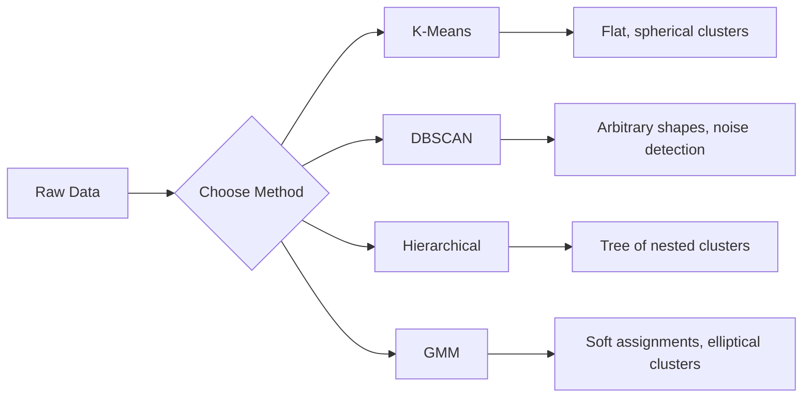

<!-- i18n:manual -->
# Обучение без учителя

> Никаких меток, никакого учителя. Алгоритм сам находит структуру.

**Type:** Build
**Languages:** Python
**Prerequisites:** Phase 1 (Norms & Distances, Probability & Distributions), Phase 2 Lessons 1-6
**Time:** ~90 minutes

## Learning Objectives

- Реализовать K-Means, DBSCAN и Gaussian Mixture Models с нуля и сравнить, как они кластеризуют одни и те же данные
- Оценивать качество кластеров через silhouette score и метод локтя, чтобы подобрать оптимальное K
- Объяснить, когда DBSCAN лучше K-Means, и понимать, какой алгоритм справляется с несферическими кластерами и выбросами
- Собрать пайплайн детекции аномалий на кластеризации: помечать точки, выпадающие из обычного паттерна

> 🎒 **На пальцах.** Во всех прошлых уроках вместе с задачами вам давали ответы. Здесь ответов нет: есть только куча точек, и границы групп надо найти самому. Как рассыпать по столу конфеты и разложить их по кучкам, заранее не зная ни сортов, ни их количества.

## The Problem

Каждый урок ML до сих пор предполагал размеченные данные: «вот вход, вот правильный ответ». В реальности разметка стоит дорого. У больницы миллионы карт пациентов, но никто не проставил каждой диагноз вручную. У интернет-магазина миллионы пользовательских сессий, но никто руками не разложил клиентов по сегментам. У службы безопасности есть логи сети, но никто не отметил в них каждую аномалию.

Обучение без учителя находит закономерности, когда никто не сказал, что именно искать. Оно группирует похожие точки, обнаруживает скрытую структуру и вытаскивает наружу выбросы. Если обучение с учителем — это учебник с ответами в конце, то обучение без учителя — это разглядывание сырых данных, пока закономерности не проступят сами.

Подвох: без меток нельзя напрямую измерить «правильно» или «неправильно». Нужны другие инструменты, чтобы понять, осмысленна ли найденная структура.

> 🎒 **На пальцах.** Представьте коробку с 500 фотографиями без подписей. Разложить их на «море», «горы» и «люди» можно и не зная названий — просто по похожести. Беда одна: проверить себя не у кого, правильного ответа в конверте нет. Поэтому во второй половине урока появляются отдельные метрики качества.

## The Concept

### Clustering: Grouping Similar Things Together

Кластеризация назначает каждой точке группу (кластер) так, чтобы точки внутри одной группы были похожи друг на друга сильнее, чем на точки из других групп. Вопрос всегда один: что значит «похожи»?



> 🎒 **На пальцах.** «Похожи» всегда означает «близки по какой-то линейке». Для роста и веса линейка одна, для текстов совсем другая. Схема выше — просто меню: четыре способа разрезать одни и те же точки на группы.

### K-Means: The Workhorse

K-Means делит данные ровно на K кластеров. У каждого кластера есть центроид (его центр масс), и каждая точка принадлежит ближайшему центроиду.

Алгоритм Ллойда:

1. Выбрать K случайных точек как начальные центроиды
2. Отнести каждую точку к ближайшему центроиду
3. Пересчитать каждый центроид как среднее назначенных ему точек
4. Повторять шаги 2-3, пока назначения не перестанут меняться

Целевая функция (inertia) — суммарное квадратичное расстояние от каждой точки до её центроида. K-Means минимизирует её, но находит только локальный минимум. Разная инициализация даёт разный результат.

> 🎒 **На пальцах.** Возьмите три числа на прямой: 1, 2 и 9, и K=2. Пусть центроиды случайно попали в 1 и 9. Точка 2 ближе к первому (расстояние 1 против 7) — идёт в его группу. Пересчитываем центры: (1 + 2) / 2 = 1.5 и 9. Следующий проход ничего не меняет — алгоритм сошёлся. Весь K-Means состоит из этих двух действий, повторённых много раз.

### Choosing K

Два стандартных способа:

**Elbow method:** Запустите K-Means для K = 1, 2, 3, ..., n. Постройте график inertia от K. Ищите «локоть» — место, после которого новые кластеры почти перестают снижать inertia.

**Silhouette score:** Для каждой точки измерьте, насколько она похожа на свой кластер (a) и на ближайший чужой (b). Коэффициент силуэта равен (b - a) / max(a, b) и лежит от -1 (точка попала не туда) до +1 (точка сидит в своём кластере уверенно). Усредните по всем точкам, чтобы получить общую оценку.

> 🎒 **На пальцах.** Посчитайте силуэт руками. До своих соседей в среднем 1.0, до ближайшего чужого кластера 4.0: (4 − 1) / 4 = 0.75, точка явно на своём месте. А если бы вышло 1.0 и 1.1, получилось бы (1.1 − 1) / 1.1 ≈ 0.09 — точка стоит на границе, и кластеры почти слиплись.

### DBSCAN: Density-Based Clustering

K-Means считает кластеры сферическими и требует задать K заранее. DBSCAN не делает ни того, ни другого. Он ищет кластеры как плотные области, разделённые разреженными.

Два параметра:
- **eps**: радиус окрестности
- **min_samples**: минимальное число точек, при котором область считается плотной

Три типа точек:
- **Core point**: внутри радиуса eps есть хотя бы min_samples точек
- **Border point**: попадает в eps-окрестность core-точки, но сама не core
- **Noise point**: ни core, ни border. Это и есть выбросы.

DBSCAN соединяет в один кластер core-точки, лежащие друг от друга ближе eps. Border-точки присоединяются к кластеру ближайшей core-точки. Noise-точки не входят никуда.

Сильные стороны: находит кластеры любой формы, сам определяет их количество, выделяет выбросы. Слабость: плохо работает, когда плотность у разных кластеров разная.

> 🎒 **На пальцах.** Представьте огни на земле, если смотреть с самолёта. eps — «на сколько метров вокруг я смотрю», min_samples — «сколько огней должно попасть в круг, чтобы это считалось городом». В коде ниже eps=1.5 и min_samples=5: точка становится core, если в круге радиуса 1.5 набралось минимум 5 соседей. Одинокий фонарь в поле останется шумом — и это ровно то, что нужно для поиска аномалий.

### Hierarchical Clustering

Строит дерево (дендрограмму) вложенных кластеров.

Агломеративный подход (снизу вверх):
1. Начать с того, что каждая точка — отдельный кластер
2. Слить два ближайших кластера
3. Повторять, пока не останется один кластер
4. Разрезать дендрограмму на нужном уровне, чтобы получить K кластеров

«Близость» кластеров можно мерить по-разному:
- **Single linkage**: минимальное расстояние между любыми двумя точками из двух кластеров
- **Complete linkage**: максимальное расстояние между любыми двумя точками
- **Average linkage**: среднее расстояние по всем парам
- **Ward's method**: то слияние, которое даёт наименьший прирост суммарной внутрикластерной дисперсии

### Gaussian Mixture Models (GMM)

K-Means даёт жёсткие назначения: точка принадлежит ровно одному кластеру. GMM даёт мягкие: у каждой точки есть вероятность принадлежать каждому кластеру.

GMM предполагает, что данные порождены смесью K гауссовых распределений, у каждого своё среднее и своя ковариация. Алгоритм Expectation-Maximization (EM) чередует два шага:

- **E-step**: посчитать вероятность того, что каждая точка принадлежит каждой гауссиане
- **M-step**: обновить среднее, ковариацию и вес каждой гауссианы так, чтобы правдоподобие данных стало максимальным

GMM умеет моделировать эллиптические кластеры (а не только сферические, как K-Means) и естественно справляется с перекрытием.

> 🎒 **На пальцах.** K-Means говорит: «ты из третьей группы, точка». GMM говорит: «ты на 70% из третьей и на 30% из второй». Примерно как с породой собаки: чистокровный лабрадор или метис 70 на 30. Для точек, лежащих на стыке двух кластеров, второй ответ честнее.

### When to Use Which

| Method | Best for | Avoid when |
|--------|----------|------------|
| K-Means | Большие датасеты, сферические кластеры, K известно | Кластеры неправильной формы, есть выбросы |
| DBSCAN | K неизвестно, произвольные формы, поиск выбросов | Разная плотность, очень высокая размерность |
| Hierarchical | Маленькие датасеты, нужна дендрограмма, K неизвестно | Большие датасеты (память O(n^2)) |
| GMM | Перекрывающиеся кластеры, нужны мягкие назначения | Очень большие датасеты, слишком много измерений |

> 🎒 **На пальцах.** Правило по таблице читается за секунду. Знаете число групп и они круглые — K-Means. Не знаете число и формы кривые — DBSCAN. Нужны вероятности вместо жёстких ярлыков — GMM. Данных мало, но хочется увидеть дерево — иерархическая кластеризация.

### Anomaly Detection with Clustering

Кластеризация естественно годится и для поиска аномалий:
- **K-Means**: точки далеко от всех центроидов — аномалии
- **DBSCAN**: noise-точки аномальны по определению
- **GMM**: точки с низкой вероятностью под всеми гауссианами — аномалии

```figure
kmeans-step
```

> 🎒 **На пальцах.** Аномалия — это просто «слишком далеко от всех остальных». В демо ниже к 150 нормальным точкам (они собраны около координат (2, 2), (8, 3) и (5, 8)) добавляют (20, 20), (−5, −5) и (15, 0). DBSCAN пометит их меткой −1 сам, без единой подсказки.

## Build It

### Step 1: K-Means from scratch

```python
import math
import random


def euclidean_distance(a, b):
    return math.sqrt(sum((ai - bi) ** 2 for ai, bi in zip(a, b)))


def kmeans(data, k, max_iterations=100, seed=42):
    random.seed(seed)
    n_features = len(data[0])

    centroids = random.sample(data, k)

    for iteration in range(max_iterations):
        clusters = [[] for _ in range(k)]
        assignments = []

        for point in data:
            distances = [euclidean_distance(point, c) for c in centroids]
            nearest = distances.index(min(distances))
            clusters[nearest].append(point)
            assignments.append(nearest)

        new_centroids = []
        for cluster in clusters:
            if len(cluster) == 0:
                new_centroids.append(random.choice(data))
                continue
            centroid = [
                sum(point[j] for point in cluster) / len(cluster)
                for j in range(n_features)
            ]
            new_centroids.append(centroid)

        if all(
            euclidean_distance(old, new) < 1e-6
            for old, new in zip(centroids, new_centroids)
        ):
            print(f"  Converged at iteration {iteration + 1}")
            break

        centroids = new_centroids

    return assignments, centroids
```

> 🎒 **На пальцах.** Прикиньте объём работы: 150 точек и k=3, значит на каждой итерации считается 150 × 3 = 450 расстояний, а потом три средних. Как только центры сдвигаются меньше чем на 0.000001, печатается `Converged` и цикл прерывается — обычно это происходит за 5-10 проходов, а не за все 100.

### Step 2: Elbow method and silhouette score

```python
def compute_inertia(data, assignments, centroids):
    total = 0.0
    for point, cluster_id in zip(data, assignments):
        total += euclidean_distance(point, centroids[cluster_id]) ** 2
    return total


def silhouette_score(data, assignments):
    n = len(data)
    if n < 2:
        return 0.0

    clusters = {}
    for i, c in enumerate(assignments):
        clusters.setdefault(c, []).append(i)

    if len(clusters) < 2:
        return 0.0

    scores = []
    for i in range(n):
        own_cluster = assignments[i]
        own_members = [j for j in clusters[own_cluster] if j != i]

        if len(own_members) == 0:
            scores.append(0.0)
            continue

        a = sum(euclidean_distance(data[i], data[j]) for j in own_members) / len(own_members)

        b = float("inf")
        for cluster_id, members in clusters.items():
            if cluster_id == own_cluster:
                continue
            avg_dist = sum(euclidean_distance(data[i], data[j]) for j in members) / len(members)
            b = min(b, avg_dist)

        if max(a, b) == 0:
            scores.append(0.0)
        else:
            scores.append((b - a) / max(a, b))

    return sum(scores) / len(scores)


def find_best_k(data, max_k=10):
    print("Elbow method:")
    inertias = []
    for k in range(1, max_k + 1):
        assignments, centroids = kmeans(data, k)
        inertia = compute_inertia(data, assignments, centroids)
        inertias.append(inertia)
        print(f"  K={k}: inertia={inertia:.2f}")

    print("\nSilhouette scores:")
    for k in range(2, max_k + 1):
        assignments, centroids = kmeans(data, k)
        score = silhouette_score(data, assignments)
        print(f"  K={k}: silhouette={score:.4f}")

    return inertias
```

> 🎒 **На пальцах.** Inertia — это «сумма квадратов промахов». При K=1 она огромная, а при K, равном числу точек, ровно ноль (каждая точка сама себе центр). Локоть — место, где падение резко замедляется: например 900 → 300 → 120 → 110 → 105. Здесь локоть на K=3, дальше вы платите новыми кластерами почти ни за что.

### Step 3: DBSCAN from scratch

```python
def dbscan(data, eps, min_samples):
    n = len(data)
    labels = [-1] * n
    cluster_id = 0

    def region_query(point_idx):
        neighbors = []
        for i in range(n):
            if euclidean_distance(data[point_idx], data[i]) <= eps:
                neighbors.append(i)
        return neighbors

    visited = [False] * n

    for i in range(n):
        if visited[i]:
            continue
        visited[i] = True

        neighbors = region_query(i)

        if len(neighbors) < min_samples:
            labels[i] = -1
            continue

        labels[i] = cluster_id
        seed_set = list(neighbors)
        seed_set.remove(i)

        j = 0
        while j < len(seed_set):
            q = seed_set[j]

            if not visited[q]:
                visited[q] = True
                q_neighbors = region_query(q)
                if len(q_neighbors) >= min_samples:
                    for nb in q_neighbors:
                        if nb not in seed_set:
                            seed_set.append(nb)

            if labels[q] == -1:
                labels[q] = cluster_id

            j += 1

        cluster_id += 1

    return labels
```

> 🎒 **На пальцах.** Метка `-1` в этом коде означает «шум». Обратите внимание на цикл `while j < len(seed_set)`: он дописывает новых соседей прямо в тот список, который перебирает. Так кластер и расползается по плотной области, как огонь по сухой траве, и сам останавливается там, где точки кончились.

### Step 4: Gaussian Mixture Model (EM algorithm)

```python
def gmm(data, k, max_iterations=100, seed=42):
    random.seed(seed)
    n = len(data)
    d = len(data[0])

    indices = random.sample(range(n), k)
    means = [list(data[i]) for i in indices]
    variances = [1.0] * k
    weights = [1.0 / k] * k

    def gaussian_pdf(x, mean, variance):
        d = len(x)
        coeff = 1.0 / ((2 * math.pi * variance) ** (d / 2))
        exponent = -sum((xi - mi) ** 2 for xi, mi in zip(x, mean)) / (2 * variance)
        return coeff * math.exp(max(exponent, -500))

    for iteration in range(max_iterations):
        responsibilities = []
        for i in range(n):
            probs = []
            for j in range(k):
                probs.append(weights[j] * gaussian_pdf(data[i], means[j], variances[j]))
            total = sum(probs)
            if total == 0:
                total = 1e-300
            responsibilities.append([p / total for p in probs])

        old_means = [list(m) for m in means]

        for j in range(k):
            r_sum = sum(responsibilities[i][j] for i in range(n))
            if r_sum < 1e-10:
                continue

            weights[j] = r_sum / n

            for dim in range(d):
                means[j][dim] = sum(
                    responsibilities[i][j] * data[i][dim] for i in range(n)
                ) / r_sum

            variances[j] = sum(
                responsibilities[i][j]
                * sum((data[i][dim] - means[j][dim]) ** 2 for dim in range(d))
                for i in range(n)
            ) / (r_sum * d)
            variances[j] = max(variances[j], 1e-6)

        shift = sum(
            euclidean_distance(old_means[j], means[j]) for j in range(k)
        )
        if shift < 1e-6:
            print(f"  GMM converged at iteration {iteration + 1}")
            break

    assignments = []
    for i in range(n):
        assignments.append(responsibilities[i].index(max(responsibilities[i])))

    return assignments, means, weights, responsibilities
```

> 🎒 **На пальцах.** `responsibilities` — это таблица «кто чей». Для одной точки строка выглядит примерно как [0.02, 0.95, 0.03]: почти наверняка второй кластер. Числа в строке всегда дают в сумме 1, потому что каждое делят на общую сумму. В самом конце `index(max(...))` берёт самый вероятный кластер и превращает мягкий ответ обратно в жёсткий.

### Step 5: Generate test data and run everything

```python
def make_blobs(centers, n_per_cluster=50, spread=0.5, seed=42):
    random.seed(seed)
    data = []
    true_labels = []
    for label, (cx, cy) in enumerate(centers):
        for _ in range(n_per_cluster):
            x = cx + random.gauss(0, spread)
            y = cy + random.gauss(0, spread)
            data.append([x, y])
            true_labels.append(label)
    return data, true_labels


def make_moons(n_samples=200, noise=0.1, seed=42):
    random.seed(seed)
    data = []
    labels = []
    n_half = n_samples // 2
    for i in range(n_half):
        angle = math.pi * i / n_half
        x = math.cos(angle) + random.gauss(0, noise)
        y = math.sin(angle) + random.gauss(0, noise)
        data.append([x, y])
        labels.append(0)
    for i in range(n_half):
        angle = math.pi * i / n_half
        x = 1 - math.cos(angle) + random.gauss(0, noise)
        y = 1 - math.sin(angle) - 0.5 + random.gauss(0, noise)
        data.append([x, y])
        labels.append(1)
    return data, labels


if __name__ == "__main__":
    centers = [[2, 2], [8, 3], [5, 8]]
    data, true_labels = make_blobs(centers, n_per_cluster=50, spread=0.8)

    print("=== K-Means on 3 blobs ===")
    assignments, centroids = kmeans(data, k=3)
    print(f"  Centroids: {[[round(c, 2) for c in cent] for cent in centroids]}")
    sil = silhouette_score(data, assignments)
    print(f"  Silhouette score: {sil:.4f}")

    print("\n=== Elbow Method ===")
    find_best_k(data, max_k=6)

    print("\n=== DBSCAN on 3 blobs ===")
    db_labels = dbscan(data, eps=1.5, min_samples=5)
    n_clusters = len(set(db_labels) - {-1})
    n_noise = db_labels.count(-1)
    print(f"  Found {n_clusters} clusters, {n_noise} noise points")

    print("\n=== GMM on 3 blobs ===")
    gmm_assignments, gmm_means, gmm_weights, _ = gmm(data, k=3)
    print(f"  Means: {[[round(m, 2) for m in mean] for mean in gmm_means]}")
    print(f"  Weights: {[round(w, 3) for w in gmm_weights]}")
    gmm_sil = silhouette_score(data, gmm_assignments)
    print(f"  Silhouette score: {gmm_sil:.4f}")

    print("\n=== DBSCAN on moons (non-spherical clusters) ===")
    moon_data, moon_labels = make_moons(n_samples=200, noise=0.1)
    moon_db = dbscan(moon_data, eps=0.3, min_samples=5)
    n_moon_clusters = len(set(moon_db) - {-1})
    n_moon_noise = moon_db.count(-1)
    print(f"  Found {n_moon_clusters} clusters, {n_moon_noise} noise points")

    print("\n=== K-Means on moons (will fail to separate) ===")
    moon_km, moon_centroids = kmeans(moon_data, k=2)
    moon_sil = silhouette_score(moon_data, moon_km)
    print(f"  Silhouette score: {moon_sil:.4f}")
    print("  K-Means splits moons poorly because they are not spherical")

    print("\n=== Anomaly detection with DBSCAN ===")
    anomaly_data = list(data)
    anomaly_data.append([20.0, 20.0])
    anomaly_data.append([-5.0, -5.0])
    anomaly_data.append([15.0, 0.0])
    anomaly_labels = dbscan(anomaly_data, eps=1.5, min_samples=5)
    anomalies = [
        anomaly_data[i]
        for i in range(len(anomaly_labels))
        if anomaly_labels[i] == -1
    ]
    print(f"  Detected {len(anomalies)} anomalies")
    for a in anomalies[-3:]:
        print(f"    Point {[round(v, 2) for v in a]}")
```

> 🎒 **На пальцах.** Финальный запуск — честное сравнение. На трёх круглых пятнах K-Means и DBSCAN дадут почти одинаковый результат. А на «лунах» K-Means разрежет их пополам прямой линией и получит низкий silhouette, тогда как DBSCAN найдёт ровно 2 полумесяца: его волнует только плотность, а не форма.

## Use It

В scikit-learn те же алгоритмы записываются в одну строку:

```python
from sklearn.cluster import KMeans, DBSCAN, AgglomerativeClustering
from sklearn.mixture import GaussianMixture
from sklearn.metrics import silhouette_score as sklearn_silhouette

km = KMeans(n_clusters=3, random_state=42).fit(data)
db = DBSCAN(eps=1.5, min_samples=5).fit(data)
agg = AgglomerativeClustering(n_clusters=3).fit(data)
gmm_model = GaussianMixture(n_components=3, random_state=42).fit(data)
```

Версии, написанные с нуля, показывают, что именно считают эти библиотеки. K-Means чередует назначение и пересчёт. DBSCAN выращивает кластеры из плотных зёрен. GMM чередует expectation и maximization. Библиотечные версии добавляют численную устойчивость, более умную инициализацию (K-Means++) и ускорение на GPU, но суть та же.

> 🎒 **На пальцах.** Четыре строчки sklearn делают то же, что ваши двести. Разница в мелочах: `KMeans` по умолчанию использует инициализацию K-Means++ (первый центр случайный, остальные — подальше от уже выбранных) и прогоняет алгоритм несколько раз, оставляя лучший результат. Ваша версия с `random.sample` иногда будет застревать в плохом локальном минимуме.

## Ship It

Этот урок даёт работающие реализации K-Means, DBSCAN и GMM с нуля. Код кластеризации можно переиспользовать как фундамент для более продвинутых методов обучения без учителя.

## Exercises

1. Реализуйте инициализацию K-Means++: вместо случайных центроидов выберите первый случайно, а каждый следующий — с вероятностью, пропорциональной квадрату расстояния до ближайшего уже выбранного центроида. Сравните скорость сходимости со случайной инициализацией.
2. Добавьте в код иерархическую агломеративную кластеризацию. Реализуйте связь по методу Уорда и постройте дендрограмму (как вложенный список слияний). Разрежьте её на разных уровнях и сравните с результатами K-Means.
3. Соберите простой пайплайн детекции аномалий: запустите DBSCAN и GMM на одних данных и пометьте точки, которые оба метода считают выбросами (шум в DBSCAN, низкая вероятность в GMM). Измерьте пересечение и разберитесь, в каких случаях методы расходятся.

> 🎒 **На пальцах.** Подсказка к первому заданию: в K-Means++ вероятность стать центром пропорциональна квадрату расстояния до ближайшего уже выбранного центра. Точка на расстоянии 10 в сто раз вероятнее точки на расстоянии 1 (10² = 100 против 1² = 1). Именно поэтому центры почти никогда не рождаются в одной куче.

## Key Terms

| Term | What people say | What it actually means |
|------|----------------|----------------------|
| Clustering | «Группировка похожего» | Разбиение данных на подмножества, где сходство внутри группы выше, чем между группами, по конкретной метрике расстояния |
| Centroid | «Центр кластера» | Среднее всех точек, отнесённых к кластеру; в K-Means служит представителем кластера |
| Inertia | «Насколько кластеры плотные» | Сумма квадратов расстояний от каждой точки до её центроида; чем меньше, тем плотнее |
| Silhouette score | «Насколько кластеры разделены» | Для каждой точки (b - a) / max(a, b), где a — среднее расстояние внутри своего кластера, b — среднее расстояние до ближайшего чужого |
| Core point | «Точка в плотной области» | В DBSCAN: точка, у которой в радиусе eps есть хотя бы min_samples соседей |
| EM algorithm | «Мягкий K-Means» | Expectation-Maximization: по очереди считать вероятности принадлежности (E-шаг) и обновлять параметры распределений (M-шаг) |
| Dendrogram | «Дерево кластеров» | Древовидная диаграмма, показывающая порядок и расстояния, на которых кластеры сливались при иерархической кластеризации |
| Anomaly | «Выброс» | Точка, не укладывающаяся в ожидаемый паттерн; DBSCAN помечает её как шум, GMM — как маловероятную |

## Further Reading

- [Stanford CS229 - Unsupervised Learning](https://cs229.stanford.edu/notes2022fall/main_notes.pdf) - конспекты лекций Эндрю Ына по кластеризации и EM
- [scikit-learn Clustering Guide](https://scikit-learn.org/stable/modules/clustering.html) - практическое сравнение всех алгоритмов кластеризации с наглядными примерами
- [DBSCAN original paper (Ester et al., 1996)](https://www.aaai.org/Papers/KDD/1996/KDD96-037.pdf) - статья, которая ввела кластеризацию по плотности
