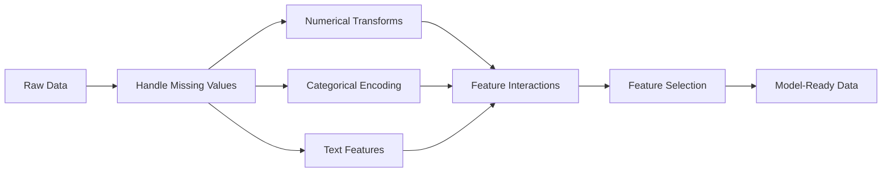

<!-- i18n:manual -->
# Проектирование и отбор признаков

> Один хороший признак стоит тысячи новых примеров.

**Type:** Build
**Languages:** Python
**Prerequisites:** Phase 1 (Statistics for ML, Linear Algebra), Phase 2 Lessons 1-7
**Time:** ~90 minutes

## Learning Objectives

- Реализовать числовые преобразования (стандартизация, min-max scaling, логарифм, биннинг) и объяснить, когда какое уместно
- Написать one-hot, label и target encoding для категориальных признаков и понять, где в target encoding прячется утечка данных
- Собрать TF-IDF-векторизатор с нуля и объяснить, почему он лучше сырых частот слов для классификации текста
- Применить фильтрующий отбор признаков (порог дисперсии, корреляция, взаимная информация), чтобы снизить размерность

> 🎒 **На пальцах.** Модель — как повар: из хороших продуктов даже простой рецепт выходит вкусным, а из плохих не спасёт и мишленовская техника. Этот урок целиком про подготовку продуктов, а не про рецепт.

## The Problem

У вас есть датасет. Вы выбираете алгоритм. Обучаете. Результат посредственный. Пробуете алгоритм посложнее. Всё равно посредственный. Неделю крутите гиперпараметры. Улучшение на копейку.

Потом кто-то преобразует сырые данные в хорошие признаки, и простая логистическая регрессия обыгрывает ваш вылизанный градиентный бустинг.

Так происходит постоянно. В классическом ML представление данных важнее выбора алгоритма. Модель цен на жильё с признаками «площадь» и «число комнат» победит модель с признаком «адрес одной строкой», каким бы умным ни был алгоритм. Алгоритм может работать только с тем, что вы ему дали.

Feature engineering — это превращение сырых данных в представление, в котором закономерности видны модели легче. Отбор признаков — это выбрасывание всего, что добавляет шум, но не добавляет сигнала. Вместе они дают самый большой рычаг во всём классическом ML.

> 🎒 **На пальцах.** Пример из жизни: по строке «ул. Ленина, 5» модель цену квартиры не предскажет. А по двум числам — 54 квадратных метра и 12 минут до метро — предскажет вполне прилично. Данные те же самые, признаки разные. Неделя настройки гиперпараметров такой разницы никогда не даст.

## The Concept

### The Feature Pipeline



> 🎒 **На пальцах.** Читайте схему как конвейер на кухне: сначала разобраться с испорченным (пропуски), потом по-разному нарезать числа, категории и текст, потом смешать, и только в конце выкинуть лишнее. Порядок важен: масштабировать пропуски нельзя, их сначала надо чем-то заполнить.

### Numerical Features

Сырые числа редко готовы к подаче в модель. Типичные преобразования:

**Scaling:** Приводит признаки к одному диапазону, чтобы алгоритмы, основанные на расстояниях (K-Means, KNN, SVM), учитывали все признаки одинаково. Min-max scaling переводит в [0, 1]. Стандартизация (z-score) даёт среднее 0 и стандартное отклонение 1.

**Log transform:** Сжимает распределения с длинным правым хвостом (доход, население, частоты слов). Превращает мультипликативные зависимости в аддитивные.

**Binning:** Превращает непрерывные значения в категории. Полезно, когда связь признака с целевой переменной нелинейная, но ступенчатая (например, возрастные группы).

**Polynomial features:** Создаёт члены x^2, x^3, x1*x2. Позволяет линейным моделям поймать нелинейные зависимости ценой роста числа признаков.

> 🎒 **На пальцах.** Зачем масштабировать: пусть у квартиры площадь 54 (м²) и этаж 3. Расстояние между двумя квартирами почти целиком определит площадь — этажи отличаются на единицы, а метры на десятки. После стандартизации оба признака имеют среднее 0 и разброс 1, и алгоритм слышит их одинаково громко. А логарифм нужен для зарплат: 30 000 и 3 000 000 отличаются в 100 раз, а после log — примерно в 1.5.

### Categorical Features

Моделям нужны числа. Категории нужно закодировать.

**One-hot encoding:** Создаёт по бинарной колонке на каждую категорию. «color = red/blue/green» превращается в три колонки: is_red, is_blue, is_green. Хорошо работает при малом числе категорий и взрывается, когда их много.

**Label encoding:** Сопоставляет каждой категории целое число: red=0, blue=1, green=2. Вносит ложный порядок (модель может решить, что green > blue > red). Подходит только деревьям, которые делят выборку по отдельным значениям.

**Target encoding:** Заменяет каждую категорию средним значением целевой переменной по этой категории. Мощно, но опасно: высокий риск утечки данных. Считать нужно только на обучающей выборке и применять к тестовой.

> 🎒 **На пальцах.** Три района: центр, спальный, деревня. One-hot даёт три колонки-флажка, и центр становится [1, 0, 0]. Label encoding даёт 0, 1, 2 — и модель может решить, что деревня (2) «больше» центра (0), хотя это чушь. Target encoding заменит район на среднюю цену в нём: сильно, но если считать среднее по всем данным вместе с тестом, вы просто подсмотрите ответ.

### Text Features

**Count vectorizer:** Считает, сколько раз каждое слово встретилось в документе. «the cat sat on the mat» превращается в {the: 2, cat: 1, sat: 1, on: 1, mat: 1}.

**TF-IDF:** Term Frequency-Inverse Document Frequency. Взвешивает слова по тому, насколько они редки в корпусе. Частые слова вроде «the» получают маленький вес. Редкие и характерные — большой.

```
TF(word, doc) = count(word in doc) / total words in doc
IDF(word) = log(total docs / docs containing word)
TF-IDF = TF * IDF
```

> 🎒 **На пальцах.** Посчитайте IDF руками. Слово «the» встречается во всех 5 документах: log(5 / 5) = log(1) = 0, вес обнуляется полностью. Слово «pool» встретилось в одном: log(5 / 1) ≈ 1.61. Вот почему TF-IDF сам, без всякого списка стоп-слов, выбрасывает мусорные слова.

### Missing Values

В реальных данных бывают дырки. Стратегии:

- **Drop rows:** Только если пропуски редки и случайны
- **Mean/median imputation:** Просто, сохраняет форму распределения (медиана устойчивее к выбросам)
- **Mode imputation:** Для категориальных признаков
- **Indicator column:** Добавить бинарную колонку «здесь было пусто» до заполнения. Сам факт пропуска бывает информативным
- **Forward/backward fill:** Для временных рядов

> 🎒 **На пальцах.** Дырка в данных — тоже данные. Если в анкете не указан доход, это часто значит «доход маленький» или «не хочу говорить», а не «случайно пропустил». Поэтому перед заполнением добавляют колонку-флажок. А медиану предпочитают среднему потому, что один миллиардер в выборке сдвинет среднее сильно, а медиану почти не тронет.

### Feature Interaction

Иногда зависимость прячется в комбинации. «Рост» и «вес» по отдельности предсказывают хуже, чем «BMI = вес / рост^2». Взаимодействия признаков размножают пространство признаков, поэтому выбирать их стоит по знанию предметной области.

> 🎒 **На пальцах.** BMI — готовый пример. Вес 80 кг и рост 1.8 м по отдельности говорят мало, а 80 / 1.8² ≈ 24.7 — уже почти диагноз. Хорошие комбинации рождаются из понимания предметной области, а не из слепого перебора всех пар.

### Feature Selection

Больше признаков не всегда лучше. Ненужные признаки добавляют шум, удлиняют обучение и провоцируют overfitting.

**Filter methods (pre-model):**
- Корреляция: убрать признаки, сильно скоррелированные друг с другом (они дублируют информацию)
- Взаимная информация: измеряет, насколько знание признака снижает неопределённость о целевой переменной
- Порог дисперсии: убрать признаки, которые почти не меняются

**Wrapper methods (model-based):**
- L1-регуляризация (Lasso): загоняет веса бесполезных признаков ровно в ноль
- Рекурсивное исключение признаков: обучить, убрать самый слабый признак, повторить

**Why selection matters:** Модель с 10 хорошими признаками обычно обыгрывает модель с теми же 10 хорошими и 90 шумными. Шумные признаки дают модели возможность подстроиться под случайные узоры в обучающих данных, которые не переносятся на новые.

```figure
feature-scaling
```

> 🎒 **На пальцах.** 10 полезных колонок плюс 90 случайных — это как решать задачу, когда рядом 90 человек кричат неправильные ответы. Модель обязательно услышит в этом шуме «закономерность», а на новых данных она развалится. Фильтры при этом простые: колонка, где почти всегда одно и то же значение, бесполезна; из двух колонок с корреляцией 0.95 одну можно смело выкинуть.

## Build It

### Step 1: Numerical transforms from scratch

```python
import math


def min_max_scale(values):
    min_val = min(values)
    max_val = max(values)
    if max_val == min_val:
        return [0.0] * len(values)
    return [(v - min_val) / (max_val - min_val) for v in values]


def standardize(values):
    n = len(values)
    mean = sum(values) / n
    variance = sum((v - mean) ** 2 for v in values) / n
    std = math.sqrt(variance) if variance > 0 else 1.0
    return [(v - mean) / std for v in values]


def log_transform(values):
    return [math.log(v + 1) for v in values]


def bin_values(values, n_bins=5):
    min_val = min(values)
    max_val = max(values)
    bin_width = (max_val - min_val) / n_bins
    if bin_width == 0:
        return [0] * len(values)
    result = []
    for v in values:
        bin_idx = int((v - min_val) / bin_width)
        bin_idx = min(bin_idx, n_bins - 1)
        result.append(bin_idx)
    return result


def polynomial_features(row, degree=2):
    n = len(row)
    result = list(row)
    if degree >= 2:
        for i in range(n):
            result.append(row[i] ** 2)
        for i in range(n):
            for j in range(i + 1, n):
                result.append(row[i] * row[j])
    return result
```

> 🎒 **На пальцах.** Проверьте `min_max_scale` на числах [10, 20, 30]: min = 10, max = 30, значит (10 − 10) / 20 = 0, (20 − 10) / 20 = 0.5, (30 − 10) / 20 = 1. А `log_transform` берёт `log(v + 1)` именно из-за нуля: log(0) не существует, зато log(0 + 1) = 0.

### Step 2: Categorical encoding from scratch

```python
def one_hot_encode(values):
    categories = sorted(set(values))
    cat_to_idx = {cat: i for i, cat in enumerate(categories)}
    n_cats = len(categories)

    encoded = []
    for v in values:
        row = [0] * n_cats
        row[cat_to_idx[v]] = 1
        encoded.append(row)

    return encoded, categories


def label_encode(values):
    categories = sorted(set(values))
    cat_to_int = {cat: i for i, cat in enumerate(categories)}
    return [cat_to_int[v] for v in values], cat_to_int


def target_encode(feature_values, target_values, smoothing=10):
    global_mean = sum(target_values) / len(target_values)

    category_stats = {}
    for feat, target in zip(feature_values, target_values):
        if feat not in category_stats:
            category_stats[feat] = {"sum": 0.0, "count": 0}
        category_stats[feat]["sum"] += target
        category_stats[feat]["count"] += 1

    encoding = {}
    for cat, stats in category_stats.items():
        cat_mean = stats["sum"] / stats["count"]
        weight = stats["count"] / (stats["count"] + smoothing)
        encoding[cat] = weight * cat_mean + (1 - weight) * global_mean

    return [encoding[v] for v in feature_values], encoding
```

> 🎒 **На пальцах.** Посмотрите на `weight` в `target_encode`. Если в категории 5 объектов и smoothing = 10, то weight = 5 / 15 ≈ 0.33: результат на треть из среднего по категории и на две трети из общего среднего. А если объектов 1000, то weight = 1000 / 1010 ≈ 0.99 — категории верим почти полностью. Так редкая категория не выдаёт случайный шум за сигнал.

### Step 3: Text features from scratch

```python
def count_vectorize(documents):
    vocab = {}
    idx = 0
    for doc in documents:
        for word in doc.lower().split():
            if word not in vocab:
                vocab[word] = idx
                idx += 1

    vectors = []
    for doc in documents:
        vec = [0] * len(vocab)
        for word in doc.lower().split():
            vec[vocab[word]] += 1
        vectors.append(vec)

    return vectors, vocab


def tfidf(documents):
    n_docs = len(documents)

    vocab = {}
    idx = 0
    for doc in documents:
        for word in doc.lower().split():
            if word not in vocab:
                vocab[word] = idx
                idx += 1

    doc_freq = {}
    for doc in documents:
        seen = set()
        for word in doc.lower().split():
            if word not in seen:
                doc_freq[word] = doc_freq.get(word, 0) + 1
                seen.add(word)

    vectors = []
    for doc in documents:
        words = doc.lower().split()
        word_count = len(words)
        tf_map = {}
        for word in words:
            tf_map[word] = tf_map.get(word, 0) + 1

        vec = [0.0] * len(vocab)
        for word, count in tf_map.items():
            tf = count / word_count
            idf = math.log(n_docs / doc_freq[word])
            vec[vocab[word]] = tf * idf
        vectors.append(vec)

    return vectors, vocab
```

> 🎒 **На пальцах.** Строка `idf = math.log(n_docs / doc_freq[word])` — тот самый штраф за распространённость. Слово, встретившееся во всех документах, даёт log(1) = 0 и полностью исчезает из вектора. В демо из пяти описаний слово `with` встречается в трёх, а `pool` — в одном, поэтому у «pool» вес заметно выше.

### Step 4: Missing value imputation from scratch

```python
def impute_mean(values):
    present = [v for v in values if v is not None]
    if not present:
        return [0.0] * len(values), 0.0
    mean = sum(present) / len(present)
    return [v if v is not None else mean for v in values], mean


def impute_median(values):
    present = sorted(v for v in values if v is not None)
    if not present:
        return [0.0] * len(values), 0.0
    n = len(present)
    if n % 2 == 0:
        median = (present[n // 2 - 1] + present[n // 2]) / 2
    else:
        median = present[n // 2]
    return [v if v is not None else median for v in values], median


def impute_mode(values):
    present = [v for v in values if v is not None]
    if not present:
        return values, None
    counts = {}
    for v in present:
        counts[v] = counts.get(v, 0) + 1
    mode = max(counts, key=counts.get)
    return [v if v is not None else mode for v in values], mode


def add_missing_indicator(values):
    return [0 if v is not None else 1 for v in values]
```

### Step 5: Feature selection from scratch

```python
def correlation(x, y):
    n = len(x)
    mean_x = sum(x) / n
    mean_y = sum(y) / n
    cov = sum((xi - mean_x) * (yi - mean_y) for xi, yi in zip(x, y)) / n
    std_x = math.sqrt(sum((xi - mean_x) ** 2 for xi in x) / n)
    std_y = math.sqrt(sum((yi - mean_y) ** 2 for yi in y) / n)
    if std_x == 0 or std_y == 0:
        return 0.0
    return cov / (std_x * std_y)


def mutual_information(feature, target, n_bins=10):
    feat_min = min(feature)
    feat_max = max(feature)
    bin_width = (feat_max - feat_min) / n_bins if feat_max != feat_min else 1.0
    feat_binned = [
        min(int((f - feat_min) / bin_width), n_bins - 1) for f in feature
    ]

    n = len(feature)
    target_classes = sorted(set(target))

    feat_bins = sorted(set(feat_binned))
    p_feat = {}
    for b in feat_bins:
        p_feat[b] = feat_binned.count(b) / n

    p_target = {}
    for t in target_classes:
        p_target[t] = target.count(t) / n

    mi = 0.0
    for b in feat_bins:
        for t in target_classes:
            joint_count = sum(
                1 for fb, tv in zip(feat_binned, target) if fb == b and tv == t
            )
            p_joint = joint_count / n
            if p_joint > 0:
                mi += p_joint * math.log(p_joint / (p_feat[b] * p_target[t]))

    return mi


def variance_threshold(features, threshold=0.01):
    n_features = len(features[0])
    n_samples = len(features)
    selected = []

    for j in range(n_features):
        col = [features[i][j] for i in range(n_samples)]
        mean = sum(col) / n_samples
        var = sum((v - mean) ** 2 for v in col) / n_samples
        if var >= threshold:
            selected.append(j)

    return selected


def remove_correlated(features, threshold=0.9):
    n_features = len(features[0])
    n_samples = len(features)

    to_remove = set()
    for i in range(n_features):
        if i in to_remove:
            continue
        col_i = [features[r][i] for r in range(n_samples)]
        for j in range(i + 1, n_features):
            if j in to_remove:
                continue
            col_j = [features[r][j] for r in range(n_samples)]
            corr = abs(correlation(col_i, col_j))
            if corr >= threshold:
                to_remove.add(j)

    return [i for i in range(n_features) if i not in to_remove]
```

> 🎒 **На пальцах.** `remove_correlated` работает жадно: он идёт по колонкам слева направо и выбрасывает вторую из каждой слишком похожей пары. Порог 0.9 значит «эти две колонки почти повторяют друг друга». Например, «площадь в метрах» и «площадь в футах» дадут корреляцию ровно 1.0, и одну из них надо убрать — они несут один и тот же сигнал дважды.

### Step 6: Full pipeline and demo

```python
import random


def make_housing_data(n=200, seed=42):
    random.seed(seed)
    data = []
    for _ in range(n):
        sqft = random.uniform(500, 5000)
        bedrooms = random.choice([1, 2, 3, 4, 5])
        age = random.uniform(0, 50)
        neighborhood = random.choice(["downtown", "suburbs", "rural"])
        has_pool = random.choice([True, False])

        sqft_with_missing = sqft if random.random() > 0.05 else None
        age_with_missing = age if random.random() > 0.08 else None

        price = (
            50 * sqft
            + 20000 * bedrooms
            - 1000 * age
            + (50000 if neighborhood == "downtown" else 10000 if neighborhood == "suburbs" else 0)
            + (15000 if has_pool else 0)
            + random.gauss(0, 20000)
        )

        data.append({
            "sqft": sqft_with_missing,
            "bedrooms": bedrooms,
            "age": age_with_missing,
            "neighborhood": neighborhood,
            "has_pool": has_pool,
            "price": price,
        })
    return data


if __name__ == "__main__":
    data = make_housing_data(200)

    print("=== Raw Data Sample ===")
    for row in data[:3]:
        print(f"  {row}")

    sqft_raw = [d["sqft"] for d in data]
    age_raw = [d["age"] for d in data]
    prices = [d["price"] for d in data]

    print("\n=== Missing Value Handling ===")
    sqft_missing = sum(1 for v in sqft_raw if v is None)
    age_missing = sum(1 for v in age_raw if v is None)
    print(f"  sqft missing: {sqft_missing}/{len(sqft_raw)}")
    print(f"  age missing: {age_missing}/{len(age_raw)}")

    sqft_indicator = add_missing_indicator(sqft_raw)
    age_indicator = add_missing_indicator(age_raw)
    sqft_imputed, sqft_fill = impute_median(sqft_raw)
    age_imputed, age_fill = impute_mean(age_raw)
    print(f"  sqft filled with median: {sqft_fill:.0f}")
    print(f"  age filled with mean: {age_fill:.1f}")

    print("\n=== Numerical Transforms ===")
    sqft_scaled = standardize(sqft_imputed)
    age_scaled = min_max_scale(age_imputed)
    sqft_log = log_transform(sqft_imputed)
    age_binned = bin_values(age_imputed, n_bins=5)
    print(f"  sqft standardized: mean={sum(sqft_scaled)/len(sqft_scaled):.4f}, std={math.sqrt(sum(v**2 for v in sqft_scaled)/len(sqft_scaled)):.4f}")
    print(f"  age min-max: [{min(age_scaled):.2f}, {max(age_scaled):.2f}]")
    print(f"  age bins: {sorted(set(age_binned))}")

    print("\n=== Categorical Encoding ===")
    neighborhoods = [d["neighborhood"] for d in data]

    ohe, ohe_cats = one_hot_encode(neighborhoods)
    print(f"  One-hot categories: {ohe_cats}")
    print(f"  Sample encoding: {neighborhoods[0]} -> {ohe[0]}")

    le, le_map = label_encode(neighborhoods)
    print(f"  Label encoding map: {le_map}")

    te, te_map = target_encode(neighborhoods, prices, smoothing=10)
    print(f"  Target encoding: {({k: round(v) for k, v in te_map.items()})}")

    print("\n=== Text Features ===")
    descriptions = [
        "large modern house with pool",
        "small cozy cottage near downtown",
        "spacious family home with large yard",
        "modern apartment downtown with view",
        "rustic cabin in rural area",
    ]
    cv, cv_vocab = count_vectorize(descriptions)
    print(f"  Vocabulary size: {len(cv_vocab)}")
    print(f"  Doc 0 non-zero features: {sum(1 for v in cv[0] if v > 0)}")

    tf, tf_vocab = tfidf(descriptions)
    print(f"  TF-IDF vocabulary size: {len(tf_vocab)}")
    top_words = sorted(tf_vocab.keys(), key=lambda w: tf[0][tf_vocab[w]], reverse=True)[:3]
    print(f"  Doc 0 top TF-IDF words: {top_words}")

    print("\n=== Polynomial Features ===")
    sample_row = [sqft_scaled[0], age_scaled[0]]
    poly = polynomial_features(sample_row, degree=2)
    print(f"  Input: {[round(v, 4) for v in sample_row]}")
    print(f"  Polynomial: {[round(v, 4) for v in poly]}")
    print(f"  Features: [x1, x2, x1^2, x2^2, x1*x2]")

    print("\n=== Feature Selection ===")
    feature_matrix = [
        [sqft_scaled[i], age_scaled[i], float(sqft_indicator[i]), float(age_indicator[i])]
        + ohe[i]
        for i in range(len(data))
    ]

    print(f"  Total features: {len(feature_matrix[0])}")

    surviving_var = variance_threshold(feature_matrix, threshold=0.01)
    print(f"  After variance threshold (0.01): {len(surviving_var)} features kept")

    surviving_corr = remove_correlated(feature_matrix, threshold=0.9)
    print(f"  After correlation filter (0.9): {len(surviving_corr)} features kept")

    binary_prices = [1 if p > sum(prices) / len(prices) else 0 for p in prices]
    print("\n  Mutual information with target:")
    feature_names = ["sqft", "age", "sqft_missing", "age_missing"] + [f"neigh_{c}" for c in ohe_cats]
    for j in range(len(feature_matrix[0])):
        col = [feature_matrix[i][j] for i in range(len(feature_matrix))]
        mi = mutual_information(col, binary_prices, n_bins=10)
        print(f"    {feature_names[j]}: MI={mi:.4f}")

    print("\n  Correlation with price:")
    for j in range(len(feature_matrix[0])):
        col = [feature_matrix[i][j] for i in range(len(feature_matrix))]
        corr = correlation(col, prices)
        print(f"    {feature_names[j]}: r={corr:.4f}")
```

> 🎒 **На пальцах.** Демо прогоняет весь конвейер на 200 сгенерированных домах. Полезная деталь: цена в генераторе устроена как 50 × метраж + 20000 × комнаты − 1000 × возраст плюс надбавки. Поэтому корреляция `sqft` с ценой выйдет высокой, а `sqft_missing` (флажок пропуска) — почти нулевой. Так и должно быть: этот флажок здесь честно случайный, и отбор признаков обязан это заметить.

## Use It

В scikit-learn эти преобразования складываются в композируемые пайплайны:

```python
from sklearn.preprocessing import StandardScaler, OneHotEncoder, PolynomialFeatures
from sklearn.impute import SimpleImputer
from sklearn.feature_extraction.text import TfidfVectorizer
from sklearn.feature_selection import mutual_info_classif, VarianceThreshold
from sklearn.compose import ColumnTransformer
from sklearn.pipeline import Pipeline

numeric_pipe = Pipeline([
    ("imputer", SimpleImputer(strategy="median")),
    ("scaler", StandardScaler()),
])

categorical_pipe = Pipeline([
    ("encoder", OneHotEncoder(sparse_output=False)),
])

preprocessor = ColumnTransformer([
    ("num", numeric_pipe, ["sqft", "age"]),
    ("cat", categorical_pipe, ["neighborhood"]),
])
```

Версии, написанные с нуля, показывают, что именно происходит внутри каждого преобразования. Библиотечные добавляют обработку краевых случаев, поддержку разреженных матриц и сборку пайплайнов, но математика та же.

> 🎒 **На пальцах.** `Pipeline` в sklearn — не украшение, а защита от утечки. Он запоминает медиану и среднее, посчитанные на обучающих данных, и применяет к тесту ровно те же числа. Посчитаете медиану по всему датасету руками — получите красивую метрику, которая в бою не повторится.

## Ship It

Этот урок производит:
- `outputs/prompt-feature-engineer.md` - промпт для системного конструирования признаков из сырых данных

## Exercises

1. Добавьте к числовым преобразованиям robust scaling (по медиане и межквартильному размаху вместо среднего и стандартного отклонения). Сравните его со стандартизацией на данных с сильными выбросами.
2. Реализуйте leave-one-out target encoding: для каждой строки считайте среднее целевой переменной, исключая её собственное значение. Покажите, как это снижает переобучение по сравнению с наивным target encoding.
3. Соберите автоматический пайплайн отбора признаков, объединяющий порог дисперсии, фильтр по корреляции и ранжирование по взаимной информации. Примените его к датасету с домами и сравните качество модели (возьмите простую линейную регрессию) на всех признаках и на отобранных.

> 🎒 **На пальцах.** Подсказка к первому заданию: robust scaling — это (v − медиана) / (Q3 − Q1). Возьмите данные [1, 2, 3, 4, 100]: среднее равно 22, а медиана всего 3. Обычная стандартизация раздавит четыре нормальных числа почти в одну точку, а robust оставит их различимыми.

## Key Terms

| Term | What people say | What it actually means |
|------|----------------|----------------------|
| Feature engineering | «Придумывание новых колонок» | Превращение сырых данных в представление, в котором закономерности видны модели |
| Standardization | «Приведение к норме» | Вычесть среднее и поделить на стандартное отклонение, чтобы у признака стали среднее 0 и std 1 |
| One-hot encoding | «Фиктивные переменные» | По одной бинарной колонке на категорию, причём в каждой строке ровно одна колонка равна 1 |
| Target encoding | «Кодирование через ответ» | Замена категории на среднее значение целевой переменной в ней, со сглаживанием против переобучения |
| TF-IDF | «Хитрый подсчёт слов» | Term Frequency, умноженная на Inverse Document Frequency: слова взвешены по тому, насколько они характерны на фоне всего корпуса |
| Imputation | «Заполнение пропусков» | Подстановка вместо пропущенных значений оценок: среднего, медианы, моды или предсказания модели |
| Feature selection | «Выбрасывание плохих колонок» | Удаление признаков, дающих шум или дублирующих друг друга, с сохранением тех, где есть сигнал о цели |
| Mutual information | «Насколько одно говорит о другом» | Мера снижения неопределённости относительно Y, которое даёт наблюдение X |
| Data leakage | «Случайное списывание» | Использование при обучении информации, недоступной в момент предсказания; даёт ложно оптимистичные результаты |

## Further Reading

- [Feature Engineering and Selection (Max Kuhn & Kjell Johnson)](http://www.feat.engineering/) - бесплатная книга, охватывающая всю тему проектирования признаков
- [scikit-learn Preprocessing Guide](https://scikit-learn.org/stable/modules/preprocessing.html) - практический справочник по всем стандартным преобразованиям
- [Target Encoding Done Right (Micci-Barreca, 2001)](https://dl.acm.org/doi/10.1145/507533.507538) - оригинальная статья о target encoding со сглаживанием
