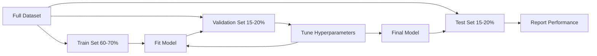

<!-- i18n:manual -->
# Оценка качества модели

> Модель хороша ровно настолько, насколько честно вы её измеряете.

**Type:** Build
**Languages:** Python
**Prerequisites:** Phase 1 (Probability & Distributions, Statistics for ML), Phase 2 Lessons 1-8
**Time:** ~90 minutes

## Learning Objectives

- Реализовать K-fold и stratified K-fold cross-validation с нуля и объяснить, зачем нужна стратификация на несбалансированных данных
- Посчитать с нуля precision, recall, F1, AUC-ROC и метрики регрессии (MSE, RMSE, MAE, R-squared)
- Читать learning curves и по ним определять, страдает модель от high bias или от high variance
- Распознавать типовые ошибки оценки: утечку данных, неверно выбранную метрику, загрязнение тестовой выборки

> 🎒 **На пальцах.** Прошлые уроки учили строить модели. Этот учит их проверять. Это как разница между «я решил задачу» и «я проверил ответ»: без второго шага первый ничего не стоит.

## The Problem

Вы обучили модель. Она даёт 95% accuracy на ваших данных. Это хорошо?

Может быть. А может и нет. Если 95% ваших данных относятся к одному классу, модель, которая всегда предсказывает этот класс, получит 95% accuracy и будет при этом абсолютно бесполезной. Если вы измеряли качество на тех же данных, на которых обучались, число 95% ничего не значит: модель просто запомнила ответы. Если в данных есть время, а вы перед разбиением случайно всё перемешали, модель может предсказывать прошлое, подглядывая в будущее.

Именно на оценке ломается большинство ML-проектов. Неверная метрика делает плохую модель красивой. Неверное разбиение позволяет модели жульничать. Неверное сравнение заставляет выбрать худший вариант. Правильная оценка — не опция. Это разница между моделью, которая работает в продакшене, и моделью, которая рассыпается при первой встрече с реальными данными.

> 🎒 **На пальцах.** Представьте, что учитель дал контрольную с теми же задачами, что были в домашке, и с ответами на обороте. Все получат пятёрки, но никто ничего не выучил. Тестовая выборка — это контрольная с новыми задачами.

## The Concept

### Train, Validation, Test



Три части, три назначения:

- **Training set**: на этих данных модель учится. Она видит эти примеры во время обучения.
- **Validation set**: используется для подбора гиперпараметров и выбора между моделями. Модель на них не обучается, но ваши решения от них зависят.
- **Test set**: трогаете ровно один раз, в самом конце, чтобы сообщить финальное качество. Если вы посмотрели на тест, а потом вернулись править модель, это уже не тест. Это второй validation set.

Тестовая выборка — ваша гарантия того, что заявленное качество отражает поведение модели на действительно новых данных.

> 🎒 **На пальцах.** Train — это домашние задания, validation — пробник, test — настоящий экзамен. Пробник можно писать сколько угодно раз и подстраивать подготовку. Экзамен один. Посмотрели ответы на экзамене и переучились — экзамен превратился в очередной пробник, и честной оценки у вас больше нет.

### K-Fold Cross-Validation

На маленьких данных одно разбиение train/validation расточительно и даёт шумную оценку. K-fold cross-validation использует все данные и для обучения, и для проверки:

```mermaid
flowchart TB
    subgraph Fold1["Fold 1"]
        direction LR
        V1["Val"] --- T1a["Train"] --- T1b["Train"] --- T1c["Train"] --- T1d["Train"]
    end
    subgraph Fold2["Fold 2"]
        direction LR
        T2a["Train"] --- V2["Val"] --- T2b["Train"] --- T2c["Train"] --- T2d["Train"]
    end
    subgraph Fold3["Fold 3"]
        direction LR
        T3a["Train"] --- T3b["Train"] --- V3["Val"] --- T3c["Train"] --- T3d["Train"]
    end
    subgraph Fold4["Fold 4"]
        direction LR
        T4a["Train"] --- T4b["Train"] --- T4c["Train"] --- V4["Val"] --- T4d["Train"]
    end
    subgraph Fold5["Fold 5"]
        direction LR
        T5a["Train"] --- T5b["Train"] --- T5c["Train"] --- T5d["Train"] --- V5["Val"]
    end
    Fold1 --> R["Average scores"]
    Fold2 --> R
    Fold3 --> R
    Fold4 --> R
    Fold5 --> R
```



1. Разбить данные на K частей (folds) одинакового размера
2. Для каждой части обучиться на K-1 частях и проверить на оставшейся
3. Усреднить K полученных оценок

Стандартный выбор — K=5 или K=10. Каждая точка данных ровно один раз побывает в проверочной части. Средняя оценка стабильнее, чем результат любого одиночного разбиения.

**Stratified K-fold**: сохраняет распределение классов в каждой части. Если в датасете 70% класса A и 30% класса B, в каждой части будет примерно та же пропорция. Это важно для несбалансированных данных, где случайное разбиение может отправить все примеры редкого класса в одну часть.

> 🎒 **На пальцах.** Пять кусков пирога: каждый по очереди становится «проверочным», остальные четыре — «учебными». На 300 объектах при K=5 каждая часть — 60 объектов. Вы получаете пять оценок вместо одной и видите не только среднее, но и разброс. Если оценки 0.91, 0.89, 0.90, 0.62, 0.90 — четвёртая часть подозрительна, и это важнее среднего.

### Classification Metrics

**Confusion matrix**: основа всего. Для бинарной классификации:

|  | Predicted Positive | Predicted Negative |
|--|---|---|
| Модель права, объект положительный | True Positive (TP) | False Negative (FN) |
| Объект на самом деле отрицательный | False Positive (FP) | True Negative (TN) |

Из этой матрицы выводятся все остальные метрики:

- **Accuracy** = (TP + TN) / (TP + TN + FP + FN). Доля верных предсказаний. Обманчива при дисбалансе классов.
- **Precision** = TP / (TP + FP). Из всего, что модель назвала положительным, сколько таким и оказалось? Нужна, когда дорого ошибиться ложной тревогой (спам-фильтр выкинул настоящее письмо).
- **Recall** (sensitivity) = TP / (TP + FN). Из всех настоящих положительных сколько мы поймали? Нужна, когда дорого пропустить (скрининг рака не заметил опухоль).
- **F1 score** = 2 * precision * recall / (precision + recall). Среднее гармоническое precision и recall. Балансирует обе метрики, когда ни одна явно не важнее.
- **AUC-ROC**: площадь под ROC-кривой. Кривая строится по true positive rate против false positive rate при разных порогах классификации. AUC = 0.5 — модель угадывает наугад, AUC = 1.0 — идеальное разделение. Метрика не зависит от порога: она измеряет, насколько хорошо модель ставит положительные примеры выше отрицательных.

> 🎒 **На пальцах.** Вы ищете грибы. Precision — какая доля собранного вами съедобна. Recall — какую долю всех съедобных грибов в лесу вы нашли. Собрали один белый и ушли: precision = 1.0, recall почти 0. Смели всё подряд: recall высокий, precision ужасный. F1 наказывает за перекос: при precision = 0.5 и recall = 1.0 получится 2 × 0.5 × 1.0 / 1.5 = 0.67, а не 0.75, как дало бы обычное среднее.

### Regression Metrics

- **MSE** (Mean Squared Error) = mean((y_true - y_pred)^2). Наказывает крупные ошибки квадратично. Чувствителен к выбросам.
- **RMSE** (Root Mean Squared Error) = sqrt(MSE). В тех же единицах, что и целевая переменная. Понимать легче, чем MSE.
- **MAE** (Mean Absolute Error) = mean(|y_true - y_pred|). Считает все ошибки линейно. Устойчивее к выбросам, чем MSE.
- **R-squared** = 1 - SS_res / SS_tot, где SS_res = sum((y_true - y_pred)^2) и SS_tot = sum((y_true - y_mean)^2). Доля дисперсии, объяснённая моделью. R^2 = 1.0 — идеально. R^2 = 0.0 — модель не лучше, чем всегда предсказывать среднее. R^2 может быть отрицательным, если модель хуже среднего.

> 🎒 **На пальцах.** Пусть модель ошиблась на 1, 1, 1 и 10 рублей. MAE = (1+1+1+10)/4 = 3.25. MSE = (1+1+1+100)/4 = 25.75, RMSE ≈ 5.07. Одна большая ошибка утянула RMSE вверх, а MAE почти не заметил. Отсюда правило: если выбросы для вас катастрофа — берите RMSE, если это просто редкий шум — берите MAE.

### Learning Curves

Строим графики качества на обучении и на валидации в зависимости от размера обучающей выборки:

- **High bias (underfitting)**: обе кривые сходятся к низкому качеству. Больше данных не поможет. Нужна более сложная модель.
- **High variance (overfitting)**: качество на обучении высокое, а на валидации сильно ниже. Разрыв между ними большой. Больше данных должно помочь.

> 🎒 **На пальцах.** Разрыв между кривыми — это «насколько ученик хуже отвечает на новых задачах, чем на решённых». Разрыв огромный — он зубрит, дайте больше задач. Разрыв маленький, но обе кривые внизу — он просто не понял тему, задачи тут не спасут, нужен другой учебник. Learning curve меняет количество данных, а validation curve — сложность модели: первая отвечает на вопрос «собирать ли ещё данные», вторая — «крутить ли ручку сложности».

### Validation Curves

Строим графики качества на обучении и на валидации в зависимости от гиперпараметра:

- При низкой сложности обе оценки низкие (underfitting)
- При правильной сложности обе оценки высокие и близки друг к другу
- При высокой сложности качество на обучении держится, а на валидации падает (overfitting)

Оптимальное значение гиперпараметра — там, где валидационная кривая достигает максимума.

### Common Evaluation Mistakes

**Data leakage**: информация из тестовой выборки просачивается в обучение. Примеры: обучение нормализатора на всех данных до разбиения, попадание будущих данных в предсказание временного ряда, использование признака, выведенного из целевой переменной. Всегда сначала разбивайте, потом обрабатывайте.

**Class imbalance**: 99% транзакций честные, 1% — мошеннические. Модель, которая всегда говорит «честная», получает 99% accuracy. Используйте precision, recall, F1 или AUC-ROC.

**Wrong metric**: оптимизируете accuracy там, где нужен recall (медицинская диагностика), или RMSE там, где данные полны выбросов (нужен MAE).

**Not using stratified splits**: на несбалансированных данных случайное разбиение может оставить в валидационной части совсем мало объектов редкого класса, и оценка станет нестабильной.

**Testing too often**: каждый раз, когда вы посмотрели на тест и что-то поправили, вы переобучаетесь на тест. Тестовая выборка одноразовая.

> 🎒 **На пальцах.** Классическая утечка: вы посчитали среднее и стандартное отклонение по всем 300 объектам, а потом разбили их на train и test. Всё, среднее уже «знает» про тестовые объекты. Правильный порядок: сначала разбить, потом считать среднее только по train и применить его к test.

```figure
precision-recall-threshold
```

## Build It

### Step 1: Train/validation/test split

```python
import random
import math


def train_val_test_split(X, y, train_ratio=0.6, val_ratio=0.2, seed=42):
    random.seed(seed)
    n = len(X)
    indices = list(range(n))
    random.shuffle(indices)

    train_end = int(n * train_ratio)
    val_end = int(n * (train_ratio + val_ratio))

    train_idx = indices[:train_end]
    val_idx = indices[train_end:val_end]
    test_idx = indices[val_end:]

    X_train = [X[i] for i in train_idx]
    y_train = [y[i] for i in train_idx]
    X_val = [X[i] for i in val_idx]
    y_val = [y[i] for i in val_idx]
    X_test = [X[i] for i in test_idx]
    y_test = [y[i] for i in test_idx]

    return X_train, y_train, X_val, y_val, X_test, y_test
```

> 🎒 **На пальцах.** Проверьте руками на 300 объектах: train_end = int(300 × 0.6) = 180, val_end = int(300 × 0.8) = 240. Значит train — 180 объектов, val — 60, test — 60. Обратите внимание на `random.seed(seed)`: без него каждый запуск давал бы новое разбиение, и сравнивать результаты было бы невозможно.

### Step 2: K-fold and stratified K-fold cross-validation

```python
def kfold_split(n, k=5, seed=42):
    random.seed(seed)
    indices = list(range(n))
    random.shuffle(indices)

    fold_size = n // k
    folds = []

    for i in range(k):
        start = i * fold_size
        end = start + fold_size if i < k - 1 else n
        val_idx = indices[start:end]
        train_idx = indices[:start] + indices[end:]
        folds.append((train_idx, val_idx))

    return folds


def stratified_kfold_split(y, k=5, seed=42):
    random.seed(seed)

    class_indices = {}
    for i, label in enumerate(y):
        class_indices.setdefault(label, []).append(i)

    for label in class_indices:
        random.shuffle(class_indices[label])

    folds = [{"train": [], "val": []} for _ in range(k)]

    for label, indices in class_indices.items():
        fold_size = len(indices) // k
        for i in range(k):
            start = i * fold_size
            end = start + fold_size if i < k - 1 else len(indices)
            val_part = indices[start:end]
            train_part = indices[:start] + indices[end:]
            folds[i]["val"].extend(val_part)
            folds[i]["train"].extend(train_part)

    return [(f["train"], f["val"]) for f in folds]


def cross_validate(X, y, model_fn, k=5, metric_fn=None, stratified=False):
    n = len(X)

    if stratified:
        folds = stratified_kfold_split(y, k)
    else:
        folds = kfold_split(n, k)

    scores = []
    for train_idx, val_idx in folds:
        X_train = [X[i] for i in train_idx]
        y_train = [y[i] for i in train_idx]
        X_val = [X[i] for i in val_idx]
        y_val = [y[i] for i in val_idx]

        model = model_fn()
        model.fit(X_train, y_train)
        predictions = [model.predict(x) for x in X_val]

        if metric_fn:
            score = metric_fn(y_val, predictions)
        else:
            score = sum(1 for yt, yp in zip(y_val, predictions) if yt == yp) / len(y_val)
        scores.append(score)

    return scores
```

> 🎒 **На пальцах.** При n=300 и k=5 получаем fold_size = 300 // 5 = 60. Последняя часть берёт всё до конца (`end = n`), чтобы ни один объект не потерялся при делении с остатком. В stratified-версии перемешивание и нарезка идут отдельно внутри каждого класса — поэтому пропорция 70/30 сохранится в каждой части автоматически.

### Step 3: Confusion matrix and classification metrics

```python
def confusion_matrix(y_true, y_pred):
    tp = sum(1 for yt, yp in zip(y_true, y_pred) if yt == 1 and yp == 1)
    tn = sum(1 for yt, yp in zip(y_true, y_pred) if yt == 0 and yp == 0)
    fp = sum(1 for yt, yp in zip(y_true, y_pred) if yt == 0 and yp == 1)
    fn = sum(1 for yt, yp in zip(y_true, y_pred) if yt == 1 and yp == 0)
    return tp, tn, fp, fn


def accuracy(y_true, y_pred):
    tp, tn, fp, fn = confusion_matrix(y_true, y_pred)
    total = tp + tn + fp + fn
    return (tp + tn) / total if total > 0 else 0.0


def precision(y_true, y_pred):
    tp, tn, fp, fn = confusion_matrix(y_true, y_pred)
    return tp / (tp + fp) if (tp + fp) > 0 else 0.0


def recall(y_true, y_pred):
    tp, tn, fp, fn = confusion_matrix(y_true, y_pred)
    return tp / (tp + fn) if (tp + fn) > 0 else 0.0


def f1_score(y_true, y_pred):
    p = precision(y_true, y_pred)
    r = recall(y_true, y_pred)
    return 2 * p * r / (p + r) if (p + r) > 0 else 0.0


def roc_curve(y_true, y_scores):
    thresholds = sorted(set(y_scores), reverse=True)
    tpr_list = []
    fpr_list = []

    total_positives = sum(y_true)
    total_negatives = len(y_true) - total_positives

    for threshold in thresholds:
        y_pred = [1 if s >= threshold else 0 for s in y_scores]
        tp = sum(1 for yt, yp in zip(y_true, y_pred) if yt == 1 and yp == 1)
        fp = sum(1 for yt, yp in zip(y_true, y_pred) if yt == 0 and yp == 1)

        tpr = tp / total_positives if total_positives > 0 else 0.0
        fpr = fp / total_negatives if total_negatives > 0 else 0.0

        tpr_list.append(tpr)
        fpr_list.append(fpr)

    return fpr_list, tpr_list, thresholds


def auc_roc(y_true, y_scores):
    fpr_list, tpr_list, _ = roc_curve(y_true, y_scores)

    pairs = sorted(zip(fpr_list, tpr_list))
    fpr_sorted = [p[0] for p in pairs]
    tpr_sorted = [p[1] for p in pairs]

    area = 0.0
    for i in range(1, len(fpr_sorted)):
        width = fpr_sorted[i] - fpr_sorted[i - 1]
        height = (tpr_sorted[i] + tpr_sorted[i - 1]) / 2
        area += width * height

    return area
```

> 🎒 **На пальцах.** Все четыре метрики — это просто счёт по четырём коробочкам. Пусть из 100 писем 10 спам, модель пометила 8 писем как спам и 6 из них угадала. Тогда TP=6, FP=2, FN=4, TN=88. Precision = 6/8 = 0.75, recall = 6/10 = 0.6, F1 = 2 × 0.75 × 0.6 / 1.35 ≈ 0.67. Никакой магии, четыре счётчика.

### Step 4: Regression metrics

```python
def mse(y_true, y_pred):
    n = len(y_true)
    return sum((yt - yp) ** 2 for yt, yp in zip(y_true, y_pred)) / n


def rmse(y_true, y_pred):
    return math.sqrt(mse(y_true, y_pred))


def mae(y_true, y_pred):
    n = len(y_true)
    return sum(abs(yt - yp) for yt, yp in zip(y_true, y_pred)) / n


def r_squared(y_true, y_pred):
    mean_y = sum(y_true) / len(y_true)
    ss_res = sum((yt - yp) ** 2 for yt, yp in zip(y_true, y_pred))
    ss_tot = sum((yt - mean_y) ** 2 for yt in y_true)
    if ss_tot == 0:
        return 0.0
    return 1.0 - ss_res / ss_tot
```

> 🎒 **На пальцах.** Посмотрите на `r_squared`: если модель предсказывает ровно среднее, то ss_res равен ss_tot, и результат 1 − 1 = 0. Ноль здесь — это не «плохо на 0%», а «ровно как самый тупой прогноз». Хуже среднего — уходит в минус.

### Step 5: Learning curves

```python
def learning_curve(X, y, model_fn, metric_fn, train_sizes=None, val_ratio=0.2, seed=42):
    random.seed(seed)
    n = len(X)
    indices = list(range(n))
    random.shuffle(indices)

    val_size = int(n * val_ratio)
    val_idx = indices[:val_size]
    pool_idx = indices[val_size:]

    X_val = [X[i] for i in val_idx]
    y_val = [y[i] for i in val_idx]

    if train_sizes is None:
        train_sizes = [int(len(pool_idx) * r) for r in [0.1, 0.2, 0.4, 0.6, 0.8, 1.0]]

    train_scores = []
    val_scores = []

    for size in train_sizes:
        subset = pool_idx[:size]
        X_train = [X[i] for i in subset]
        y_train = [y[i] for i in subset]

        model = model_fn()
        model.fit(X_train, y_train)

        train_pred = [model.predict(x) for x in X_train]
        val_pred = [model.predict(x) for x in X_val]

        train_scores.append(metric_fn(y_train, train_pred))
        val_scores.append(metric_fn(y_val, val_pred))

    return train_sizes, train_scores, val_scores
```

> 🎒 **На пальцах.** Валидационная часть вырезается один раз и дальше не меняется — иначе кривые нельзя было бы сравнивать между собой. Обучающие подвыборки берутся вложенными (`pool_idx[:size]`): сначала 10% пула, потом 20%, и так до 100%. То есть каждый следующий эксперимент — это предыдущий плюс новые объекты.

### Step 6: A simple classifier for testing, plus the full demo

```python
class SimpleLogistic:
    def __init__(self, lr=0.1, epochs=100):
        self.lr = lr
        self.epochs = epochs
        self.weights = None
        self.bias = 0.0

    def sigmoid(self, z):
        z = max(-500, min(500, z))
        return 1.0 / (1.0 + math.exp(-z))

    def fit(self, X, y):
        n_features = len(X[0])
        self.weights = [0.0] * n_features
        self.bias = 0.0

        for _ in range(self.epochs):
            for xi, yi in zip(X, y):
                z = sum(w * x for w, x in zip(self.weights, xi)) + self.bias
                pred = self.sigmoid(z)
                error = yi - pred
                for j in range(n_features):
                    self.weights[j] += self.lr * error * xi[j]
                self.bias += self.lr * error

    def predict_proba(self, x):
        z = sum(w * xi for w, xi in zip(self.weights, x)) + self.bias
        return self.sigmoid(z)

    def predict(self, x):
        return 1 if self.predict_proba(x) >= 0.5 else 0


class SimpleLinearRegression:
    def __init__(self, lr=0.001, epochs=200):
        self.lr = lr
        self.epochs = epochs
        self.weights = None
        self.bias = 0.0

    def fit(self, X, y):
        n_features = len(X[0])
        self.weights = [0.0] * n_features
        self.bias = 0.0
        n = len(X)

        for _ in range(self.epochs):
            for xi, yi in zip(X, y):
                pred = sum(w * x for w, x in zip(self.weights, xi)) + self.bias
                error = yi - pred
                for j in range(n_features):
                    self.weights[j] += self.lr * error * xi[j] / n
                self.bias += self.lr * error / n

    def predict(self, x):
        return sum(w * xi for w, xi in zip(self.weights, x)) + self.bias


def standardize(values):
    n = len(values)
    mean = sum(values) / n
    var = sum((v - mean) ** 2 for v in values) / n
    std = math.sqrt(var) if var > 0 else 1.0
    return [(v - mean) / std for v in values], mean, std


def make_classification_data(n=300, seed=42):
    random.seed(seed)
    X = []
    y = []
    for _ in range(n):
        x1 = random.gauss(0, 1)
        x2 = random.gauss(0, 1)
        label = 1 if (x1 + x2 + random.gauss(0, 0.5)) > 0 else 0
        X.append([x1, x2])
        y.append(label)
    return X, y


def make_regression_data(n=200, seed=42):
    random.seed(seed)
    X = []
    y = []
    for _ in range(n):
        x1 = random.uniform(0, 10)
        x2 = random.uniform(0, 5)
        target = 3 * x1 + 2 * x2 + random.gauss(0, 2)
        X.append([x1, x2])
        y.append(target)
    return X, y


def make_imbalanced_data(n=300, minority_ratio=0.05, seed=42):
    random.seed(seed)
    X = []
    y = []
    for _ in range(n):
        if random.random() < minority_ratio:
            x1 = random.gauss(3, 0.5)
            x2 = random.gauss(3, 0.5)
            label = 1
        else:
            x1 = random.gauss(0, 1)
            x2 = random.gauss(0, 1)
            label = 0
        X.append([x1, x2])
        y.append(label)
    return X, y


if __name__ == "__main__":
    X_clf, y_clf = make_classification_data(300)

    print("=== Train/Validation/Test Split ===")
    X_train, y_train, X_val, y_val, X_test, y_test = train_val_test_split(X_clf, y_clf)
    print(f"  Train: {len(X_train)}, Val: {len(X_val)}, Test: {len(X_test)}")
    print(f"  Train class distribution: {sum(y_train)}/{len(y_train)} positive")
    print(f"  Val class distribution: {sum(y_val)}/{len(y_val)} positive")

    model = SimpleLogistic(lr=0.1, epochs=200)
    model.fit(X_train, y_train)

    print("\n=== Classification Metrics ===")
    y_pred = [model.predict(x) for x in X_test]
    tp, tn, fp, fn = confusion_matrix(y_test, y_pred)
    print(f"  Confusion matrix: TP={tp}, TN={tn}, FP={fp}, FN={fn}")
    print(f"  Accuracy:  {accuracy(y_test, y_pred):.4f}")
    print(f"  Precision: {precision(y_test, y_pred):.4f}")
    print(f"  Recall:    {recall(y_test, y_pred):.4f}")
    print(f"  F1 Score:  {f1_score(y_test, y_pred):.4f}")

    y_scores = [model.predict_proba(x) for x in X_test]
    auc = auc_roc(y_test, y_scores)
    print(f"  AUC-ROC:   {auc:.4f}")

    print("\n=== K-Fold Cross-Validation (K=5) ===")
    cv_scores = cross_validate(
        X_clf, y_clf,
        model_fn=lambda: SimpleLogistic(lr=0.1, epochs=200),
        k=5,
        metric_fn=accuracy,
    )
    mean_cv = sum(cv_scores) / len(cv_scores)
    std_cv = math.sqrt(sum((s - mean_cv) ** 2 for s in cv_scores) / len(cv_scores))
    print(f"  Fold scores: {[round(s, 4) for s in cv_scores]}")
    print(f"  Mean: {mean_cv:.4f} (+/- {std_cv:.4f})")

    print("\n=== Stratified K-Fold Cross-Validation (K=5) ===")
    strat_scores = cross_validate(
        X_clf, y_clf,
        model_fn=lambda: SimpleLogistic(lr=0.1, epochs=200),
        k=5,
        metric_fn=accuracy,
        stratified=True,
    )
    strat_mean = sum(strat_scores) / len(strat_scores)
    strat_std = math.sqrt(sum((s - strat_mean) ** 2 for s in strat_scores) / len(strat_scores))
    print(f"  Fold scores: {[round(s, 4) for s in strat_scores]}")
    print(f"  Mean: {strat_mean:.4f} (+/- {strat_std:.4f})")

    print("\n=== Imbalanced Data: Why Accuracy Lies ===")
    X_imb, y_imb = make_imbalanced_data(300, minority_ratio=0.05)
    positives = sum(y_imb)
    print(f"  Class distribution: {positives} positive, {len(y_imb) - positives} negative ({positives/len(y_imb)*100:.1f}% positive)")

    always_negative = [0] * len(y_imb)
    print(f"  Always-negative baseline:")
    print(f"    Accuracy:  {accuracy(y_imb, always_negative):.4f}")
    print(f"    Precision: {precision(y_imb, always_negative):.4f}")
    print(f"    Recall:    {recall(y_imb, always_negative):.4f}")
    print(f"    F1 Score:  {f1_score(y_imb, always_negative):.4f}")

    X_tr_i, y_tr_i, X_v_i, y_v_i, X_te_i, y_te_i = train_val_test_split(X_imb, y_imb)
    model_imb = SimpleLogistic(lr=0.5, epochs=500)
    model_imb.fit(X_tr_i, y_tr_i)
    y_pred_imb = [model_imb.predict(x) for x in X_te_i]
    print(f"\n  Trained model on imbalanced data:")
    print(f"    Accuracy:  {accuracy(y_te_i, y_pred_imb):.4f}")
    print(f"    Precision: {precision(y_te_i, y_pred_imb):.4f}")
    print(f"    Recall:    {recall(y_te_i, y_pred_imb):.4f}")
    print(f"    F1 Score:  {f1_score(y_te_i, y_pred_imb):.4f}")

    print("\n=== Regression Metrics ===")
    X_reg, y_reg = make_regression_data(200)

    col0 = [x[0] for x in X_reg]
    col1 = [x[1] for x in X_reg]
    col0_s, m0, s0 = standardize(col0)
    col1_s, m1, s1 = standardize(col1)
    X_reg_scaled = [[col0_s[i], col1_s[i]] for i in range(len(X_reg))]

    X_tr_r, y_tr_r, X_v_r, y_v_r, X_te_r, y_te_r = train_val_test_split(X_reg_scaled, y_reg)
    reg_model = SimpleLinearRegression(lr=0.01, epochs=500)
    reg_model.fit(X_tr_r, y_tr_r)
    y_pred_r = [reg_model.predict(x) for x in X_te_r]

    print(f"  MSE:       {mse(y_te_r, y_pred_r):.4f}")
    print(f"  RMSE:      {rmse(y_te_r, y_pred_r):.4f}")
    print(f"  MAE:       {mae(y_te_r, y_pred_r):.4f}")
    print(f"  R-squared: {r_squared(y_te_r, y_pred_r):.4f}")

    mean_baseline = [sum(y_tr_r) / len(y_tr_r)] * len(y_te_r)
    print(f"\n  Mean baseline:")
    print(f"    MSE:       {mse(y_te_r, mean_baseline):.4f}")
    print(f"    R-squared: {r_squared(y_te_r, mean_baseline):.4f}")

    print("\n=== Learning Curve ===")
    sizes, train_sc, val_sc = learning_curve(
        X_clf, y_clf,
        model_fn=lambda: SimpleLogistic(lr=0.1, epochs=200),
        metric_fn=accuracy,
    )
    print(f"  {'Size':>6} {'Train':>8} {'Val':>8}")
    for s, tr, va in zip(sizes, train_sc, val_sc):
        print(f"  {s:>6} {tr:>8.4f} {va:>8.4f}")

    print("\n=== Statistical Model Comparison ===")
    model_a_scores = cross_validate(
        X_clf, y_clf,
        model_fn=lambda: SimpleLogistic(lr=0.1, epochs=100),
        k=5, metric_fn=accuracy,
    )
    model_b_scores = cross_validate(
        X_clf, y_clf,
        model_fn=lambda: SimpleLogistic(lr=0.1, epochs=500),
        k=5, metric_fn=accuracy,
    )
    diffs = [a - b for a, b in zip(model_a_scores, model_b_scores)]
    mean_diff = sum(diffs) / len(diffs)
    std_diff = math.sqrt(sum((d - mean_diff) ** 2 for d in diffs) / len(diffs))
    t_stat = mean_diff / (std_diff / math.sqrt(len(diffs))) if std_diff > 0 else 0.0
    print(f"  Model A (100 epochs) mean: {sum(model_a_scores)/len(model_a_scores):.4f}")
    print(f"  Model B (500 epochs) mean: {sum(model_b_scores)/len(model_b_scores):.4f}")
    print(f"  Mean difference: {mean_diff:.4f}")
    print(f"  Paired t-statistic: {t_stat:.4f}")
    print(f"  (|t| > 2.78 for significance at p<0.05 with df=4)")
```

> 🎒 **На пальцах.** Самая говорящая часть демо — блок про несбалансированные данные. Из 300 объектов положительных около 15 (5%). Модель «всегда отвечай отрицательно» даёт accuracy ≈ 285/300 = 0.95, но precision = 0, recall = 0 и F1 = 0. Одна строчка кода, ноль пользы, отличная цифра в отчёте. Именно поэтому accuracy на дисбалансе нельзя показывать в одиночку.

## Use It

В scikit-learn оценка встроена прямо в рабочий процесс:

```python
from sklearn.model_selection import cross_val_score, StratifiedKFold, learning_curve
from sklearn.metrics import (
    accuracy_score, precision_score, recall_score, f1_score,
    roc_auc_score, confusion_matrix, mean_squared_error, r2_score,
)
from sklearn.linear_model import LogisticRegression

model = LogisticRegression()
scores = cross_val_score(model, X, y, cv=StratifiedKFold(5), scoring="f1")
```

Версии, написанные с нуля, показывают ровно то, что делает cross-validation (никакой магии, только циклы и учёт индексов), как считается каждая метрика (просто подсчёт TP/FP/TN/FN) и почему важна стратификация (сохранение пропорции классов в каждой части). Библиотечные версии добавляют параллельность, больше вариантов метрик и интеграцию с пайплайнами.

> 🎒 **На пальцах.** Одна строка `cross_val_score(model, X, y, cv=StratifiedKFold(5), scoring="f1")` делает всё, что вы писали руками в Step 2 и Step 3. Но теперь вы знаете, что там внутри — и, например, понимаете, почему `scoring="f1"` на несбалансированных данных честнее, чем `scoring="accuracy"`.

## Ship It

Этот урок производит:
- `outputs/skill-evaluation.md` - навык, описывающий стратегию оценки для моделей классификации и регрессии

## Exercises

1. Реализуйте precision-recall кривые: постройте precision против recall при разных порогах. Посчитайте average precision (площадь под PR-кривой). Сравните PR-кривую и ROC-кривую на несбалансированном датасете и объясните, когда какая информативнее.
2. Соберите вложенную cross-validation: внешний цикл оценивает качество модели, внутренний подбирает гиперпараметры. Используйте её, чтобы честно сравнить две модели, не протаскивая валидационные данные в оценку.
3. Реализуйте перестановочный тест для сравнения моделей: перемешайте метки, переобучите модель и измерьте качество. Повторите 100 раз, чтобы получить нулевое распределение. Посчитайте p-value для наблюдаемого качества модели относительно этого распределения.

> 🎒 **На пальцах.** Подсказка к третьему заданию: если перемешать метки, никакой закономерности в данных не остаётся, и модель должна работать как монетка. Получите 100 таких «случайных» оценок — это и есть нулевое распределение. Дальше просто считаете, сколько из них оказались не хуже вашей настоящей оценки: 3 из 100 — это p-value 0.03.

## Key Terms

| Term | What people say | What it actually means |
|------|----------------|----------------------|
| Overfitting | «Модель зазубрила обучающие данные» | Модель уловила шум в обучающих данных: хорошо работает на них и плохо на новых |
| Cross-validation | «Проверка на разных кусках» | Систематическая ротация того, какая часть данных идёт на валидацию, с усреднением результатов по всем ротациям |
| Precision | «Сколько из предсказанных положительных верны» | TP / (TP + FP): доля положительных предсказаний, которые действительно положительные |
| Recall | «Сколько настоящих положительных мы нашли» | TP / (TP + FN): доля настоящих положительных, которые модель распознала |
| AUC-ROC | «Насколько хорошо модель разделяет классы» | Площадь под кривой true positive rate против false positive rate по всем порогам: от 0.5 (случайно) до 1.0 (идеально) |
| R-squared | «Сколько дисперсии объяснено» | 1 - (сумма квадратов остатков / общая сумма квадратов): доля дисперсии цели, схваченная моделью |
| Data leakage | «Модель сжульничала» | Использование при обучении информации, которой не будет в момент предсказания, из-за чего оценка получается завышенной |
| Learning curve | «Как качество меняется с ростом данных» | График качества на обучении и валидации против размера обучающей выборки, показывающий underfitting или overfitting |
| Stratified split | «Сохраняем пропорции классов» | Разбиение, при котором в каждой части доля каждого класса такая же, как во всём датасете |

## Further Reading

- [scikit-learn Model Selection Guide](https://scikit-learn.org/stable/model_selection.html) - подробный справочник по cross-validation, метрикам и подбору гиперпараметров
- [Beyond Accuracy: Precision and Recall (Google ML Crash Course)](https://developers.google.com/machine-learning/crash-course/classification/precision-and-recall) - ясное объяснение с интерактивными примерами
- [A Survey of Cross-Validation Procedures (Arlot & Celisse, 2010)](https://projecteuclid.org/journals/statistics-surveys/volume-4/issue-none/A-survey-of-cross-validation-procedures-for-model-selection/10.1214/09-SS054.full) - строгий разбор того, когда и почему работают разные стратегии CV
