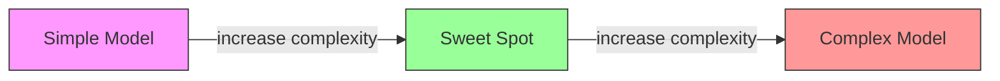
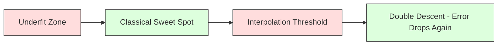
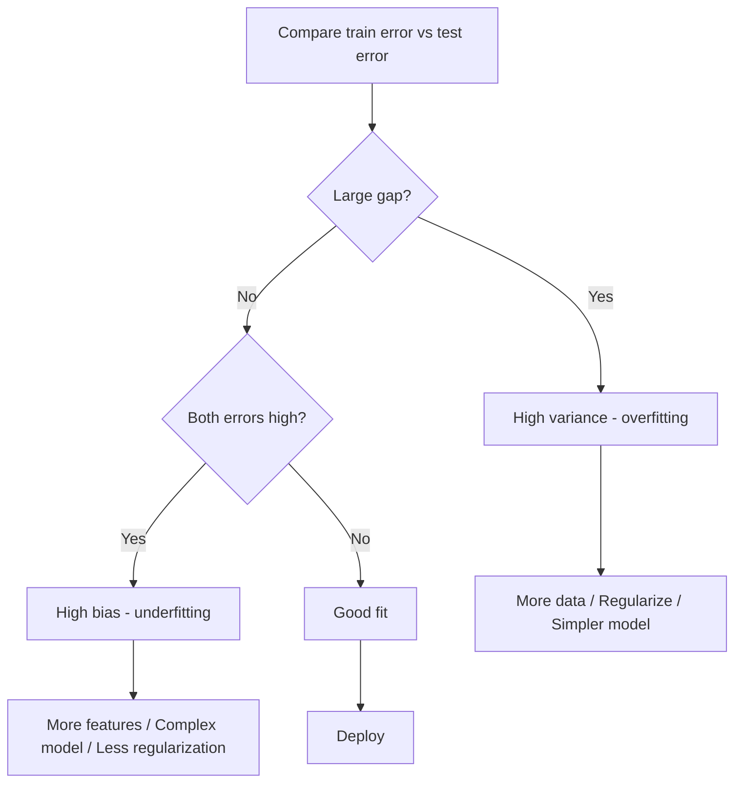
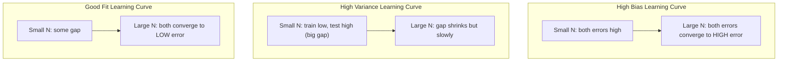
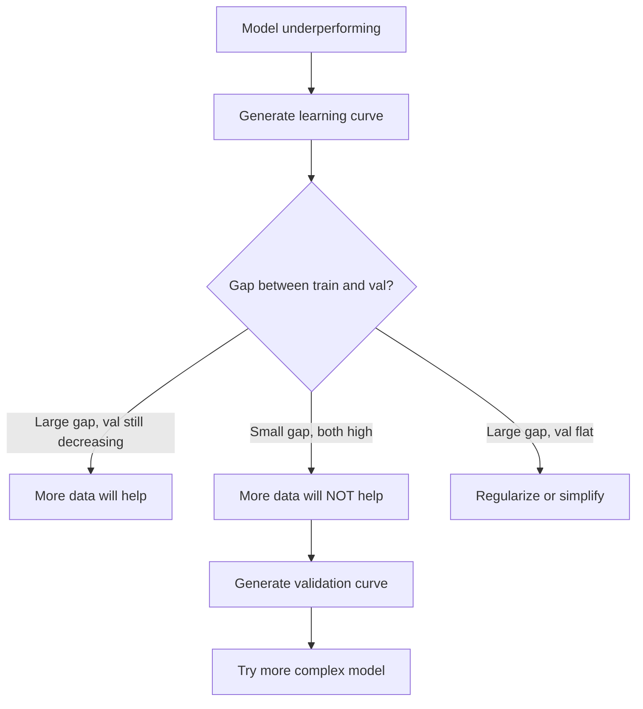

<!-- i18n:manual -->
# Компромисс смещения и дисперсии

> Любая ошибка модели складывается из трёх источников: bias, variance и шум. Управлять вы можете только первыми двумя.

**Type:** Learn
**Language:** Python
**Prerequisites:** Phase 2, Lessons 01-09 (ML basics, regression, classification, evaluation)
**Time:** ~75 minutes

## Learning Objectives

- Вывести разложение ожидаемой ошибки предсказания на bias и variance и объяснить роль неустранимого шума
- Определять по ошибкам на обучении и на тесте, чем страдает модель: high bias или high variance
- Объяснять, как регуляризация (L1, L2, dropout, early stopping) обменивает variance на bias
- Ставить эксперименты, которые показывают bias-variance tradeoff на моделях растущей сложности

## The Problem

Вы обучили модель. На тестовых данных у неё какая-то ошибка. Откуда она берётся?

Если модель слишком простая (линейная регрессия на изогнутых данных), она будет стабильно промахиваться мимо настоящей закономерности. Это bias. Если модель слишком сложная (полином 20-й степени на 15 точках), она идеально сядет на обучающие данные, но на новых будет выдавать дикий разброс. Это variance.

При фиксированной ёмкости модели уменьшить оба сразу нельзя. Давите на bias — растёт variance. Давите на variance — растёт bias. Понимание этого обмена — самый полезный диагностический навык в машинном обучении. Оно подсказывает, усложнять модель или упрощать, собирать данные или конструировать признаки, усиливать регуляризацию или ослаблять.

> 🎒 **На пальцах.** Стрельба по мишени. Все пули кучно легли левее центра — это bias: прицел сбит. Пули разлетелись по всей мишени, но в среднем вокруг центра — это variance: рука дрожит. Одна проблема лечится подкруткой прицела, другая — упором. Перепутаете диагноз — будете чинить не то.

## The Concept

### Bias: Systematic Error

Bias измеряет, насколько среднее предсказание модели отстоит от истины. Если обучить одну и ту же модель на многих разных обучающих выборках из одного распределения и усреднить предсказания, bias — это расстояние между этим средним и правдой.

Высокий bias означает, что модель слишком жёсткая и не способна уловить настоящую закономерность. Прямая, подогнанная к параболе, всегда будет мимо кривой, сколько данных ей ни дай. Это underfitting.

```
High bias (underfitting):
  Model always predicts roughly the same wrong thing.
  Training error: HIGH
  Test error: HIGH
  Gap between them: SMALL
```

### Variance: Sensitivity to Training Data

Variance измеряет, насколько сильно меняются предсказания, если обучаться на разных подвыборках данных. Если небольшие изменения обучающей выборки сильно меняют модель, variance высокий.

Высокий variance означает, что модель подгоняется под шум в обучающих данных, а не под сигнал. Полином 20-й степени пройдёт через каждую обучающую точку, но между ними будет дико колебаться. Это overfitting.

```
High variance (overfitting):
  Model fits training data perfectly but fails on new data.
  Training error: LOW
  Test error: HIGH
  Gap between them: LARGE
```

> 🎒 **На пальцах.** Ученик выучил наизусть решения 15 задач из сборника. На этих 15 у него ноль ошибок, на любой шестнадцатой — провал. Уберите из сборника одну задачу и добавьте другую — и «модель» станет совсем другой. Вот это и есть variance: результат сильно зависит от того, какие именно примеры попались.

### The Decomposition

Для любой точки x ожидаемая ошибка предсказания при квадратичной функции потерь раскладывается точно:

```
Expected Error = Bias^2 + Variance + Irreducible Noise

where:
  Bias^2   = (E[f_hat(x)] - f(x))^2
  Variance = E[(f_hat(x) - E[f_hat(x)])^2]
  Noise    = E[(y - f(x))^2]             (sigma^2)
```

- `f(x)` — истинная функция
- `f_hat(x)` — предсказание вашей модели
- `E[...]` — математическое ожидание по разным обучающим выборкам
- `y` — наблюдаемая метка (истинная функция плюс шум)

Слагаемое с шумом неустранимо. Ни одна модель не опустится ниже sigma^2 на зашумлённых данных. Ваша работа — найти правильный баланс между bias^2 и variance.

> 🎒 **На пальцах.** Пусть шум в данных имеет sigma = 0.5, тогда неустранимый пол ошибки равен 0.5² = 0.25. Если ваша модель даёт суммарную ошибку 0.75, то на bias² и variance вместе приходится 0.75 − 0.25 = 0.5, и вот за эти 0.5 вы можете бороться. Обещание «ошибка будет 0.1» здесь просто невыполнимо, сколько бы данных вы ни собрали.

### Model Complexity vs Error



Классическая U-образная кривая:

| Complexity | Bias | Variance | Total Error |
|-----------|------|----------|-------------|
| Слишком низкая | HIGH | LOW | HIGH (underfitting) |
| В самый раз | MODERATE | MODERATE | LOWEST |
| Слишком высокая | LOW | HIGH | HIGH (overfitting) |

### Regularization as Bias-Variance Control

Регуляризация сознательно повышает bias, чтобы снизить variance. Она ограничивает модель, чтобы та не гонялась за шумом.

- **L2 (Ridge):** Стягивает все веса к нулю. Оставляет все признаки, но уменьшает их влияние.
- **L1 (Lasso):** Обнуляет часть весов ровно в ноль. Фактически отбирает признаки.
- **Dropout:** Случайно отключает нейроны во время обучения. Заставляет сеть строить дублирующие представления.
- **Early stopping:** Останавливает обучение раньше, чем модель полностью подгонится под обучающие данные.

Сила регуляризации (lambda, доля dropout, число эпох) прямо задаёт, в какой точке кривой bias-variance вы находитесь. Больше регуляризации — больше bias, меньше variance.

> 🎒 **На пальцах.** Регуляризация — это как ограничение скорости. Вы сознательно едете медленнее оптимального (растёт bias), зато перестаёте вылетать на поворотах (падает variance). Ручка lambda: 0.001 — почти без ограничений, 100 — модель почти константа. И помните таблицу выше как «горку наоборот»: просто «сделать модель посложнее» не работает, можно перевалить через дно и поехать вверх по правому склону.

### Double Descent: The Modern Perspective

Классическая теория говорит: после оптимума любое усложнение только вредит. Но исследования с 2019 года показали неожиданное. Если продолжать наращивать ёмкость модели далеко за порог интерполяции (там, где параметров хватает, чтобы идеально сесть на обучающие данные), ошибка на тесте может снова начать падать.



Это явление «double descent» объясняет, почему чудовищно переопараметризованные нейросети (у которых параметров гораздо больше, чем обучающих примеров) всё равно хорошо обобщают. Классический bias-variance tradeoff не неверен, но для современного режима он неполон.

Ключевые наблюдения про double descent:
- Он встречается в линейных моделях, решающих деревьях и нейросетях
- В области интерполяции больше данных может сделать хуже (sample-wise double descent)
- Больше эпох обучения тоже способно его вызвать (epoch-wise double descent)
- Регуляризация сглаживает пик, но не убирает его

Почему так происходит? На пороге интерполяции ёмкости модели ровно-ровно хватает, чтобы пройти через все обучающие точки. Модель загнана в одно очень конкретное решение, и малейшее возмущение данных сильно меняет подгонку. Здесь variance достигает пика. За порогом решений, идеально ложащихся на данные, становится много. Алгоритм обучения (например, градиентный спуск с его неявной регуляризацией) склонен выбирать из них самое простое. Эта неявная тяга к простым решениям и объясняет, почему переопараметризованные модели обобщают.

| Regime | Parameters vs Samples | Behavior |
|--------|----------------------|----------|
| Underparameterized | p << n | Работает классический tradeoff |
| Interpolation threshold | p ~ n | Пик variance, всплеск тестовой ошибки |
| Overparameterized | p >> n | Включается неявная регуляризация, тестовая ошибка падает |

Практический вывод: если вы работаете с нейросетями или большими ансамблями деревьев, не останавливайтесь на пороге интерполяции. Либо держитесь заметно ниже него (с явной регуляризацией), либо уходите заметно выше. Худшее место — ровно на пороге.

> 🎒 **На пальцах.** Порог интерполяции — это когда у вас ровно 15 уравнений на 15 неизвестных: решение единственное и хрупкое, поменяли одно число — ответ поехал целиком. Если неизвестных 1000, решений бесконечно много, и алгоритм выбирает самое «спокойное». Правило простое: не садитесь на p ≈ n, стойте либо явно левее, либо явно правее.

### Diagnosing Your Model



| Symptom | Diagnosis | Fix |
|---------|-----------|-----|
| Высокая ошибка на train, высокая на test | Bias | Больше признаков, более сложная модель, меньше регуляризации |
| Низкая ошибка на train, высокая на test | Variance | Больше данных, регуляризация, более простая модель, dropout |
| Низкая ошибка на train, низкая на test | Good fit | Выкатывайте |
| Ошибка на train падает, на test растёт | Overfitting in progress | Early stopping |

> 🎒 **На пальцах.** Вся диагностика — это два числа и один вопрос. Например: train MSE = 0.05, test MSE = 0.90. Разрыв огромный, значит variance. А если train = 0.85 и test = 0.90 — разрыва почти нет, обе плохие, значит bias. Два числа, тридцать секунд, правильное направление работы.

### Practical Strategies

**When bias is the problem:**
- Добавьте полиномиальные признаки или произведения признаков
- Возьмите более гибкую модель (ансамбль деревьев вместо линейной)
- Ослабьте регуляризацию
- Учите дольше (если ещё не сошлось)

**When variance is the problem:**
- Соберите больше обучающих данных
- Используйте bagging (случайные леса)
- Усильте регуляризацию (выше lambda, больше dropout)
- Отберите признаки (уберите шумные)
- Ловите проблему заранее с помощью cross-validation

### Ensemble Methods and Variance Reduction

Ансамбли — самый практичный инструмент против variance.

**Bagging (Bootstrap Aggregating)** обучает несколько моделей на разных бутстрап-выборках обучающих данных, а потом усредняет их предсказания. У каждой отдельной модели variance высокий, а у среднего он гораздо ниже. Случайные леса — это bagging, применённый к решающим деревьям.

Почему это работает математически: если усреднить N независимых предсказаний с дисперсией sigma^2 каждое, дисперсия среднего будет sigma^2 / N. Модели не по-настоящему независимы (они видят похожие данные), поэтому выигрыш меньше, чем 1/N, но всё равно существенный.

**Boosting** снижает bias, строя модели последовательно: каждая следующая занимается ошибками уже собранного ансамбля. Основные примеры — gradient boosting и AdaBoost. Boosting может переобучиться, если добавить слишком много моделей, поэтому нужен early stopping или регуляризация.

| Method | Primary Effect | Bias Change | Variance Change |
|--------|---------------|-------------|-----------------|
| Bagging | Снижает variance | Не меняется | Падает |
| Boosting | Снижает bias | Падает | Может вырасти |
| Stacking | Снижает и то, и другое | Зависит от мета-модели | Зависит от базовых моделей |
| Dropout | Неявный bagging | Слегка растёт | Падает |

**Practical rule:** если у базовой модели высокий variance (глубокие деревья, полиномы высокой степени) — берите bagging. Если у базовой модели высокий bias (короткие пни, простые линейные модели) — берите boosting.

> 🎒 **На пальцах.** Формула sigma^2 / N очень наглядна: усреднили 10 моделей — дисперсия упала в 10 раз, а разброс (корень из дисперсии) в √10 ≈ 3.2 раза. Так же работает опрос десяти человек вместо одного: каждый ошибается по-своему, а среднее выходит устойчивым. Но если все десять читали один и тот же неверный учебник, среднее останется неверным — это и есть «bagging не лечит bias». Отсюда и правило: списки лекарств не пересекаются, «больше данных» и bagging помогают только против variance, а «более сложная модель» — только против bias, поэтому сначала диагноз, потом лечение.

### Learning Curves

Learning curves показывают ошибку на обучении и на валидации как функцию размера обучающей выборки. Это самый практичный диагностический инструмент из имеющихся. В отличие от разового сравнения train/test, learning curves показывают траекторию модели и говорят, поможет ли ещё больше данных.



Как их читать:

| Scenario | Training Error | Validation Error | Gap | What It Means | What to Do |
|----------|---------------|-----------------|-----|---------------|------------|
| High bias | Высокая | Высокая | Маленький | Модель не способна уловить закономерность | Больше признаков, сложнее модель, меньше регуляризации |
| High variance | Низкая | Высокая | Большой | Модель запоминает обучающие данные | Больше данных, регуляризация, проще модель |
| Good fit | Средняя | Средняя | Маленький | Модель хорошо обобщает | Выкатывайте |
| High variance, improving | Низкая | Падает с ростом данных | Сокращается | Проблема variance, которую вылечат данные | Собирайте ещё данные |
| High bias, flat | Высокая | Высокая и плоская | Маленький и плоский | Больше данных НЕ поможет | Меняйте архитектуру модели |

Главная мысль: если обе кривые вышли на плато, разрыв маленький, а ошибки при этом высокие — данные бесполезны, нужна другая модель. Если разрыв большой и всё ещё сокращается — данные помогут.

> 🎒 **На пальцах.** Смотрите не на точку, а на движение. Разрыв 0.40 → 0.30 → 0.22 с ростом выборки — он схлопывается, есть смысл размечать ещё данные. Разрыв 0.05 → 0.05 → 0.05 при обеих высоких ошибках — сколько ни размечай, ничего не изменится, деньги на разметку выброшены.

### How to Generate Learning Curves

Есть два подхода:

**Approach 1: Vary training set size, fixed model.** Держите модель и гиперпараметры неизменными. Обучайте на всё больших подвыборках обучающих данных. Замеряйте ошибку на обучении и на валидации при каждом размере. Это и есть стандартная learning curve.

**Approach 2: Vary model complexity, fixed data.** Держите данные неизменными. Прогоняйте параметр сложности (степень полинома, глубина дерева, число слоёв). Замеряйте ошибку на обучении и на валидации при каждой сложности. Это validation curve, она показывает bias-variance tradeoff напрямую.

Оба подхода дополняют друг друга. Первый говорит, помогут ли данные. Второй — поможет ли другая модель. Запускайте оба, прежде чем решать, что делать дальше.



```figure
bias-variance
```

## Build It

Код в `code/bias_variance.py` прогоняет полный эксперимент по разложению bias-variance. Вот сам подход, шаг за шагом.

### Step 1: Generate Synthetic Data from a Known Function

Мы берём `f(x) = sin(1.5x) + 0.5x` с гауссовским шумом. Знание истинной функции позволяет посчитать bias и variance точно.

```python
def true_function(x):
    return np.sin(1.5 * x) + 0.5 * x

def generate_data(n_samples=30, noise_std=0.5, x_range=(-3, 3), seed=None):
    rng = np.random.RandomState(seed)
    x = rng.uniform(x_range[0], x_range[1], n_samples)
    y = true_function(x) + rng.normal(0, noise_std, n_samples)
    return x, y
```

> 🎒 **На пальцах.** В реальной задаче истинную функцию никто не знает, поэтому bias и variance по отдельности не измеришь. Здесь мы её задали сами (`sin(1.5x) + 0.5x`), а сверху добавили шум с noise_std=0.5. Это как решать задачу с известным ответом: только так можно проверить, что метод работает.

### Step 2: Bootstrap Sampling and Polynomial Fitting

Для каждой степени полинома мы берём много бутстрап-выборок, обучаем полином и записываем предсказания на фиксированной тестовой сетке. Так получается распределение предсказаний в каждой тестовой точке.

```python
def fit_polynomial(x_train, y_train, degree, lam=0.0):
    X = np.column_stack([x_train ** d for d in range(degree + 1)])
    if lam > 0:
        penalty = lam * np.eye(X.shape[1])
        penalty[0, 0] = 0
        w = np.linalg.solve(X.T @ X + penalty, X.T @ y_train)
    else:
        w = np.linalg.lstsq(X, y_train, rcond=None)[0]
    return w
```

Мы обучаемся на 200 разных бутстрап-выборках. Каждая выборка приходит из одного и того же распределения, но состоит из других точек.

> 🎒 **На пальцах.** Строка `penalty[0, 0] = 0` — маленькая, но важная: свободный член (сдвиг всей кривой вверх-вниз) не штрафуется. Штрафовать его бессмысленно, ведь он не добавляет модели гибкости. И обратите внимание: 200 обучений вместо одного — весь смысл эксперимента в том, чтобы увидеть разброс, а не одну кривую.

### Step 3: Computing Bias^2, Variance Decomposition

Имея 200 наборов предсказаний в каждой тестовой точке, можно посчитать разложение прямо по определению:

```python
mean_pred = predictions.mean(axis=0)
bias_sq = np.mean((mean_pred - y_true) ** 2)
variance = np.mean(predictions.var(axis=0))
total_error = np.mean(np.mean((predictions - y_true) ** 2, axis=1))
```

- `mean_pred` — это E[f_hat(x)], оценённое по бутстрап-выборкам
- `bias_sq` — квадрат зазора между средним предсказанием и правдой
- `variance` — средний разброс предсказаний по бутстрап-выборкам
- `total_error` должен примерно равняться bias^2 + variance + шум

> 🎒 **На пальцах.** Три строки кода буквально повторяют формулу. `predictions.mean(axis=0)` — усреднить 200 кривых в одну «среднюю кривую», сравнить её с правдой, вот вам bias². `predictions.var(axis=0)` — посмотреть, как сильно 200 кривых расходятся между собой, вот вам variance. Слово «axis=0» здесь означает «по моделям, а не по точкам».

### Step 4: Learning Curves

Learning curves меняют размер обучающей выборки при неизменной сложности модели. Они показывают, чего модели не хватает: данных или ёмкости.

```python
def demo_learning_curves():
    sizes = [10, 15, 20, 30, 50, 75, 100, 150, 200, 300]
    degree = 5

    for n in sizes:
        train_errors = []
        test_errors = []
        for seed in range(50):
            x_train, y_train = generate_data(n_samples=n, seed=seed * 100)
            w = fit_polynomial(x_train, y_train, degree)
            train_pred = predict_polynomial(x_train, w)
            train_mse = np.mean((train_pred - y_train) ** 2)
            test_pred = predict_polynomial(x_test, w)
            test_mse = np.mean((test_pred - y_test) ** 2)
            train_errors.append(train_mse)
            test_errors.append(test_mse)
        # Average over runs gives the learning curve point
```

Для модели с высоким variance (степень 5 на малых данных) вы увидите:
- Ошибка на обучении сначала мала и растёт, потому что с ростом данных запоминать всё труднее
- Ошибка на тесте сначала велика и падает, потому что модель получает больше сигнала
- Разрыв сокращается с ростом данных

Для модели с высоким bias (степень 1) обе ошибки быстро сходятся к одному и тому же высокому значению, и больше данных не помогает.

> 🎒 **На пальцах.** Обратите внимание на `for seed in range(50)`: каждая точка кривой — среднее по 50 запускам, а не один замер. Иначе кривая скакала бы от случайности выборки, и вы читали бы шум вместо тренда. И заметьте противоход: с ростом n ошибка на train растёт, а на test падает — они идут навстречу друг другу.

### Step 5: Regularization Sweep

В коде есть и `demo_regularization_sweep()`: он фиксирует полином высокой степени (15) и прогоняет силу Ridge-регуляризации от 0.001 до 100. Это показывает bias-variance tradeoff под другим углом: вместо сложности модели мы меняем силу ограничения.

```python
def demo_regularization_sweep():
    alphas = [0.001, 0.005, 0.01, 0.05, 0.1, 0.5, 1.0, 5.0, 10.0, 50.0, 100.0]
    for alpha in alphas:
        results = bias_variance_decomposition([15], lam=alpha)
        r = results[15]
        print(f"alpha={alpha:.3f}  bias={r['bias_sq']:.4f}  var={r['variance']:.4f}")
```

При малой alpha полином 15-й степени почти ничем не ограничен. Доминирует variance: модель гоняется за шумом в каждой бутстрап-выборке. При большой alpha штраф так силён, что модель фактически превращается в почти постоянную функцию. Доминирует bias. Оптимальная alpha лежит между крайностями.

Это та же U-образная кривая, что и при переборе степени полинома, но управляемая непрерывной ручкой вместо дискретной. На практике регуляризация — предпочтительный способ управлять этим обменом: она даёт тонкую настройку, не трогая набор признаков.

> 🎒 **На пальцах.** Степень полинома — переключатель с делениями: 5, 6, 7, промежуточного не бывает. Alpha — плавная ручка громкости: между 0.05 и 0.1 есть сколько угодно значений. Поэтому и берут одну большую степень плюс alpha, а не подбирают степень вручную. И крутите ручки по одной: поменяли сразу и сложность модели, и объём данных — уже не поймёте, что именно повлияло на результат.

## Use It

sklearn даёт `learning_curve` и `validation_curve`, чтобы автоматизировать эту диагностику без ручных бутстрап-циклов.

### Validation Curve: Sweep Model Complexity

```python
from sklearn.model_selection import validation_curve
from sklearn.pipeline import make_pipeline
from sklearn.preprocessing import PolynomialFeatures
from sklearn.linear_model import Ridge

degrees = list(range(1, 16))
train_scores_all = []
val_scores_all = []

for d in degrees:
    pipe = make_pipeline(PolynomialFeatures(d), Ridge(alpha=0.01))
    train_scores, val_scores = validation_curve(
        pipe, X, y, param_name="polynomialfeatures__degree",
        param_range=[d], cv=5, scoring="neg_mean_squared_error"
    )
    train_scores_all.append(-train_scores.mean())
    val_scores_all.append(-val_scores.mean())
```

Это сразу даёт кривую bias-variance tradeoff. Где валидационная оценка сильнее всего отстаёт от обучающей — доминирует variance. Где плохи обе — доминирует bias.

### Learning Curve: Sweep Training Set Size

```python
from sklearn.model_selection import learning_curve

pipe = make_pipeline(PolynomialFeatures(5), Ridge(alpha=0.01))
train_sizes, train_scores, val_scores = learning_curve(
    pipe, X, y, train_sizes=np.linspace(0.1, 1.0, 10),
    cv=5, scoring="neg_mean_squared_error"
)
train_mse = -train_scores.mean(axis=1)
val_mse = -val_scores.mean(axis=1)
```

Постройте `train_mse` и `val_mse` против `train_sizes`. Форма графика скажет о модели всё.

> 🎒 **На пальцах.** Минус в `-train_scores.mean(axis=1)` не опечатка. sklearn всегда считает, что «больше — лучше», поэтому MSE он возвращает со знаком минус (`neg_mean_squared_error`). Минус спереди возвращает обычную MSE, которую можно читать глазами.

### Cross-Validation with Regularization Sweep

```python
from sklearn.model_selection import cross_val_score

alphas = [0.001, 0.01, 0.1, 1.0, 10.0, 100.0]
for alpha in alphas:
    pipe = make_pipeline(PolynomialFeatures(10), Ridge(alpha=alpha))
    scores = cross_val_score(pipe, X, y, cv=5, scoring="neg_mean_squared_error")
    print(f"alpha={alpha:>7.3f}  MSE={-scores.mean():.4f} +/- {scores.std():.4f}")
```

Здесь перебирается сила регуляризации при фиксированной сложности модели. Вы увидите тот же bias-variance tradeoff: малая alpha — высокий variance, большая alpha — высокий bias.

### Putting It All Together: A Complete Diagnostic Workflow

На практике эти проверки запускают по порядку:

1. Обучите модель. Посчитайте ошибку на train и на test.
2. Обе высокие — у вас проблема с bias. Переходите к шагу 4.
3. Train низкая, test высокая — проблема с variance. Постройте learning curve и посмотрите, помогут ли данные. Если нет — регуляризуйте.
4. Постройте validation curve по главному параметру сложности. Найдите оптимум.
5. В оптимуме постройте learning curve. Если разрыв всё ещё велик, нужны данные или регуляризация.
6. Попробуйте Ridge/Lasso с разными alpha через `cross_val_score`. Возьмите ту alpha, где кросс-валидационная ошибка минимальна.

Для большинства табличных датасетов это 10-15 минут счёта, которые экономят часы гадания.

> 🎒 **На пальцах.** Шесть шагов — это медицинский протокол: сначала измерить температуру (шаг 1), потом поставить диагноз (шаги 2-3), и только потом лечить (шаги 4-6). Самая частая ошибка новичка — начать с шага 6 и подбирать alpha, ещё не зная, что проблема вообще была в bias, где alpha только вредит.

## Ship It

Этот урок производит: `outputs/prompt-model-diagnostics.md`

## Exercises

1. Прогоните разложение с `noise_std=0` (без шума). Что произойдёт со слагаемым неустранимой ошибки? Сдвинется ли оптимальная сложность?

2. Увеличьте обучающую выборку с 30 до 300. Как это скажется на компоненте variance? Сдвинется ли оптимальная степень полинома?

3. Добавьте в эксперимент L2-регуляризацию (Ridge). При фиксированной высокой степени полинома (15) прогоните lambda от 0 до 100. Постройте bias^2 и variance как функции lambda.

4. Замените истинную функцию с полиномиальной на `sin(x)`. Как изменится разложение bias-variance? Сохраняется ли ясный оптимум по степени?

5. Реализуйте простую обёртку bootstrap aggregating (bagging): обучите 10 моделей на бутстрап-выборках и усредните предсказания. Покажите, что variance падает, а bias почти не растёт.

> 🎒 **На пальцах.** Подсказка к первому заданию: при `noise_std=0` метки становятся ровно `sin(1.5x) + 0.5x`, и слагаемое шума обнуляется. Значит суммарная ошибка теперь равна bias² + variance, и её в принципе можно довести почти до нуля. Оптимальная степень при этом сдвинется вправо: без шума гоняться уже не за чем, и сложную модель ничто не наказывает.

## Key Terms

| Term | What people say | What it actually means |
|------|----------------|----------------------|
| Bias | «Модель слишком простая» | Систематическая ошибка из-за неверных допущений. Зазор между средним предсказанием модели и правдой. |
| Variance | «Модель переобучается» | Ошибка из-за чувствительности к обучающим данным. Насколько сильно меняются предсказания при смене обучающей выборки. |
| Irreducible error | «Шум в данных» | Ошибка из-за случайности самого процесса, порождающего данные. Ни одна модель её не уберёт. |
| Underfitting | «Недоучилась» | У модели высокий bias. Она не улавливает закономерность даже на обучающих данных. |
| Overfitting | «Зазубрила данные» | У модели высокий variance. Она подгоняется под шум, который не переносится на новые данные. |
| Regularization | «Ограничиваем модель» | Добавление штрафа, снижающего сложность модели: меняем немного bias на заметно меньший variance. |
| Double descent | «Больше параметров может помочь» | Ошибка на тесте снова падает, когда ёмкость модели уходит далеко за порог интерполяции. |
| Model complexity | «Насколько модель гибкая» | Способность модели подстроиться под произвольные закономерности. Задаётся архитектурой, признаками или регуляризацией. |

## Further Reading

- [Hastie, Tibshirani, Friedman: Elements of Statistical Learning, Ch. 7](https://hastie.su.domains/ElemStatLearn/) -- канонический разбор bias-variance разложения
- [Belkin et al., Reconciling modern machine learning practice and the bias-variance trade-off (2019)](https://arxiv.org/abs/1812.11118) -- статья про double descent
- [Nakkiran et al., Deep Double Descent (2019)](https://arxiv.org/abs/1912.02292) -- double descent по эпохам и по размеру выборки
- [Scott Fortmann-Roe: Understanding the Bias-Variance Tradeoff](http://scott.fortmann-roe.com/docs/BiasVariance.html) -- наглядное визуальное объяснение
