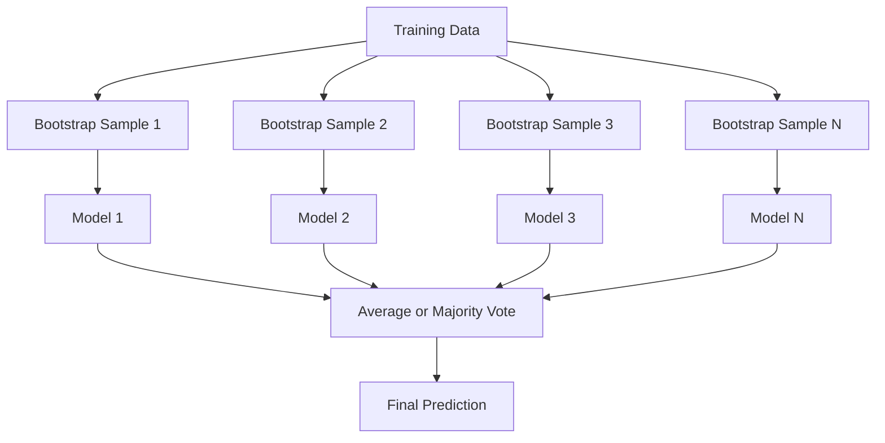
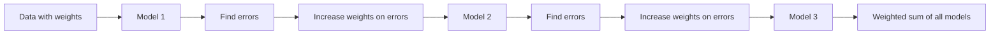
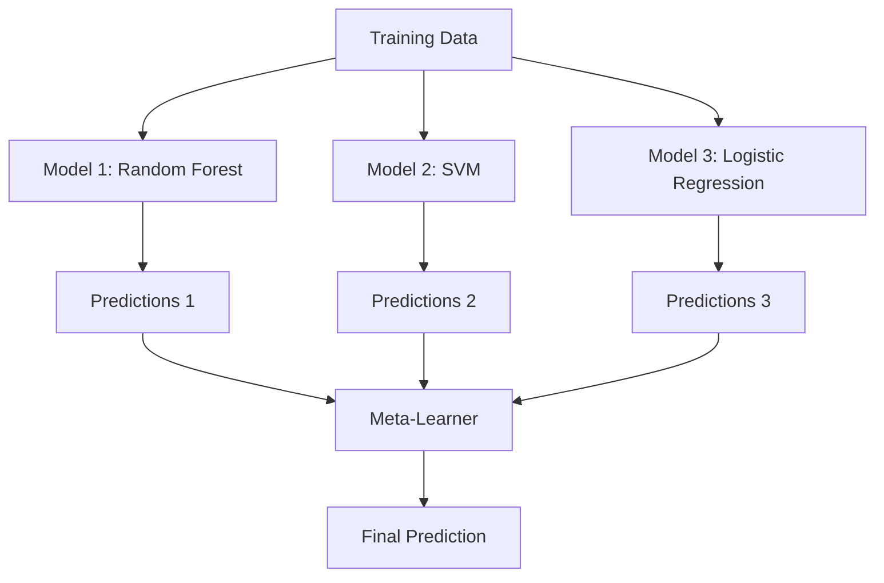

<!-- i18n:manual -->
# Ансамблевые методы

> Группа слабых моделей, собранная правильно, становится сильной моделью. Это не метафора. Это теорема.

**Type:** Build
**Language:** Python
**Prerequisites:** Phase 2, Lesson 10 (Bias-Variance Tradeoff)
**Time:** ~120 minutes

## Learning Objectives

- Реализовать AdaBoost и gradient boosting с нуля и объяснить, как boosting последовательно снижает bias
- Собрать bagging-ансамбль и показать, как усреднение декоррелированных моделей снижает variance, не увеличивая bias
- Сравнить bagging, boosting и stacking по тому, какую составляющую ошибки бьёт каждый метод
- Оценивать разнообразие ансамбля и объяснять, почему точность голосования растёт с числом независимых слабых моделей

> 🎒 **На пальцах.** Одна модель — один эксперт. Ансамбль — комиссия из десятков экспертов, которые ошибаются в разных местах. Урок про то, как собрать такую комиссию и почему она умнее каждого её участника.

## The Problem

Одно решающее дерево быстро обучается и легко читается, но переобучается. Одна линейная модель недообучается на сложных границах. Можно потратить дни на подбор идеальной архитектуры. А можно скомбинировать кучу несовершенных моделей и получить нечто лучшее, чем любая из них по отдельности.

Ансамблевые методы делают ровно это. Это самый надёжный способ выигрывать соревнования Kaggle на табличных данных, на них держится большая часть продакшен-систем ML, и они наглядно показывают bias-variance tradeoff в действии. Bagging снижает variance. Boosting снижает bias. Stacking учится, какой модели доверять на каких входах.

> 🎒 **На пальцах.** Представьте контрольную, где у каждого одноклассника своя слабая сторона: один путает дроби, другой — проценты, третий — геометрию. Если списывать у одного, унаследуете его слабость. Если взять ответ большинства из класса — ошибки разойдутся и погасят друг друга.

## The Concept

### Why Ensembles Work

Пусть у вас N независимых классификаторов, у каждого точность p > 0.5. Точность голосования большинством:

```
P(majority correct) = sum over k > N/2 of C(N,k) * p^k * (1-p)^(N-k)
```

Для 21 классификатора с точностью 60% голосование большинством даёт около 74%. Для 101 классификатора — уже 84%. Ошибки взаимно гасятся, когда модели ошибаются по-разному.

Ключевое требование — **diversity**, разнообразие. Если все модели ошибаются одинаково, объединять их бессмысленно. Ансамбли работают, потому что создают разные модели за счёт:

- Разных подвыборок обучающих данных (bagging)
- Разных подмножеств признаков (random forests)
- Последовательного исправления ошибок (boosting)
- Разных семейств моделей (stacking)

> 🎒 **На пальцах.** Считайте руками: 21 «эксперт» с точностью 60% вместе дают 74%, 101 эксперт — 84%. Каждый по отдельности почти угадывает, а комиссия уже уверенно права. Но только при одном условии: они не списывают друг у друга. Сто одинаковых копий одного эксперта так и останутся 60%.

### Bagging (Bootstrap Aggregating)

Bagging создаёт разнообразие, обучая каждую модель на своей bootstrap-выборке данных.



Bootstrap-выборка берётся из исходных данных с возвращением и имеет тот же размер. В каждую такую выборку попадает примерно 63.2% уникальных объектов. Оставшиеся 36.8% (out-of-bag объекты) дают бесплатную валидационную выборку.

Bagging снижает variance, почти не увеличивая bias. Каждое отдельное дерево переобучается под свою выборку, но переобучается по-своему, поэтому усреднение гасит шум.

**Random Forests** — это bagging с добавкой: на каждом разбиении рассматривается только случайное подмножество признаков. Это заставляет деревья различаться ещё сильнее. Обычное число кандидатов — `sqrt(n_features)` для классификации и `n_features / 3` для регрессии.

> 🎒 **На пальцах.** Bootstrap — это лотерейный барабан: вытянули шарик, записали номер, вернули обратно. Из 1000 объектов после 1000 таких вытягиваний примерно 632 окажутся уникальными, а 368 не выпадут ни разу. Вот эти 368 и есть бесплатная проверочная выборка — модель их не видела, отдельно откладывать ничего не надо.

### Boosting (Sequential Error Correction)

Boosting обучает модели последовательно. Каждая новая модель сосредотачивается на примерах, где ошиблись предыдущие.



Boosting снижает bias. Каждая новая модель исправляет систематические ошибки уже накопленного ансамбля. Итоговый прогноз — взвешенная сумма всех моделей, где у более точных моделей вес выше.

Обратная сторона: boosting может переобучиться, если сделать слишком много раундов, потому что он продолжает подгоняться под всё более трудные примеры, а часть из них — просто шум.

> 🎒 **На пальцах.** Так работает подготовка к экзамену по ошибкам: прорешали вариант, отметили задачи, где ошиблись, следующий заход посвятили именно им. Разница с bagging: там все решают параллельно и независимо, здесь — строго по очереди, каждый следующий смотрит на промахи предыдущих.

### AdaBoost

AdaBoost (Adaptive Boosting) был первым практичным алгоритмом boosting. Он работает с любой базовой моделью, обычно с decision stumps (деревьями глубины 1).

Алгоритм:

```
1. Initialize sample weights: w_i = 1/N for all i

2. For t = 1 to T:
   a. Train weak learner h_t on weighted data
   b. Compute weighted error:
      err_t = sum(w_i * I(h_t(x_i) != y_i)) / sum(w_i)
   c. Compute model weight:
      alpha_t = 0.5 * ln((1 - err_t) / err_t)
   d. Update sample weights:
      w_i = w_i * exp(-alpha_t * y_i * h_t(x_i))
   e. Normalize weights to sum to 1

3. Final prediction: H(x) = sign(sum(alpha_t * h_t(x)))
```

У моделей с меньшей ошибкой alpha больше. Неверно классифицированные объекты получают больший вес, чтобы следующая модель занялась именно ими.

> 🎒 **На пальцах.** Подставьте числа в формулу alpha. Если модель ошибается в 10% случаев, alpha = 0.5 × ln(0.9 / 0.1) = 0.5 × ln(9) ≈ 1.1 — голос весомый. Если ошибается ровно в половине случаев, alpha = 0.5 × ln(1) = 0, голос ничего не стоит. Монетка права ровно в 50% случаев, и её мнение справедливо обнуляется.

### Gradient Boosting

Gradient boosting обобщает boosting на произвольные функции потерь. Вместо перевзвешивания объектов он обучает каждую новую модель на остатках (отрицательном градиенте функции потерь) текущего ансамбля.

```
1. Initialize: F_0(x) = argmin_c sum(L(y_i, c))

2. For t = 1 to T:
   a. Compute pseudo-residuals:
      r_i = -dL(y_i, F_{t-1}(x_i)) / dF_{t-1}(x_i)
   b. Fit a tree h_t to the residuals r_i
   c. Find optimal step size:
      gamma_t = argmin_gamma sum(L(y_i, F_{t-1}(x_i) + gamma * h_t(x_i)))
   d. Update:
      F_t(x) = F_{t-1}(x) + learning_rate * gamma_t * h_t(x)

3. Final prediction: F_T(x)
```

Для квадратичной ошибки псевдоостатки совпадают с обычными остатками: `r_i = y_i - F_{t-1}(x_i)`. Каждое дерево буквально подгоняется под ошибки предыдущего ансамбля.

Learning rate (shrinkage) определяет, какой вклад вносит каждое дерево. Меньший learning rate требует больше деревьев, но лучше обобщает. Типичные значения: от 0.01 до 0.3.

> 🎒 **На пальцах.** Вы угадываете вес арбуза. Сказали 5 кг, на весах 7 кг — остаток +2 кг. Следующая «модель» предсказывает не вес, а этот остаток. С learning rate 0.1 вы прибавляете не всё сразу, а десятую часть поправки: 5 + 0.2 = 5.2. Осторожно, зато без резких скачков — поэтому маленький learning rate требует больше шагов.

### XGBoost: Why It Dominates Tabular Data

XGBoost (eXtreme Gradient Boosting) — это gradient boosting с инженерными оптимизациями, которые делают его быстрым, точным и устойчивым к переобучению:

- **Regularized objective:** L1- и L2-штрафы на веса листьев не дают отдельным деревьям быть слишком самоуверенными
- **Second-order approximation:** используются первая и вторая производные функции потерь, что даёт более удачные разбиения
- **Sparsity-aware splits:** пропуски обрабатываются нативно — алгоритм сам учит, в какую сторону отправлять объекты с пропущенным значением
- **Column subsampling:** как в random forests, признаки сэмплируются на каждом разбиении ради разнообразия
- **Weighted quantile sketch:** эффективный поиск точек разбиения для непрерывных признаков на распределённых данных
- **Cache-aware block structure:** раскладка данных в памяти подогнана под кэш-линии процессора

На табличных данных XGBoost (и его наследник LightGBM) стабильно обходит нейросети. В ближайшее время это не изменится. Если ваши данные укладываются в таблицу со строками и столбцами, начинайте с gradient boosting.

> 🎒 **На пальцах.** XGBoost — это не новая математика, а тот же gradient boosting, доведённый до ума инженерами. Как разница между самодельным велосипедом и заводским: устройство одинаковое, но подшипники, рама и сборка делают его втрое быстрее. Практический вывод простой: таблица с колонками — сначала XGBoost, нейросеть потом (и, скорее всего, зря).

### Stacking (Meta-Learning)

Stacking использует прогнозы нескольких базовых моделей как признаки для мета-модели.



Мета-модель учится, какой базовой модели доверять на каких входах. Если random forest лучше в одних областях, а SVM — в других, мета-модель научится направлять запросы соответственно.

Чтобы не было утечки данных, прогнозы базовых моделей нужно получать через кросс-валидацию на обучающей выборке. Нельзя обучать базовые модели и собирать мета-признаки на одних и тех же данных.

> 🎒 **На пальцах.** Это как классный руководитель, который знает: по алгебре спрашивай Петю, по истории — Машу. Он сам ничего не решает, он решает, кого слушать. И важное правило: оценивать Петю надо по тем задачам, которые он не видел заранее, иначе он покажется гением — на этом и держится требование кросс-валидации.

### Voting

Самый простой ансамбль. Просто объединяем прогнозы напрямую.

- **Hard voting:** голосование большинством по меткам классов.
- **Soft voting:** усредняем предсказанные вероятности и берём класс с наибольшим средним. Обычно лучше, потому что учитывает уверенность моделей.

```figure
f3-ensemble-average
```

> 🎒 **На пальцах.** Три модели говорят «кот» с уверенностью 0.51, 0.52, 0.49. Hard voting считает голоса: 2 против 1, побеждает «кот». Soft voting усредняет: (0.51 + 0.52 + 0.49) / 3 = 0.507 — тоже «кот», но видно, что решение шаткое. Первый способ теряет эту информацию, второй — сохраняет.

## Build It

### Step 1: Decision Stump (Base Learner)

Код в `code/ensembles.py` реализует всё с нуля. Начинаем с decision stump — дерева с единственным разбиением.

```python
class DecisionStump:
    def __init__(self):
        self.feature_idx = None
        self.threshold = None
        self.polarity = 1
        self.alpha = None

    def fit(self, X, y, weights):
        n_samples, n_features = X.shape
        best_error = float("inf")

        for f in range(n_features):
            thresholds = np.unique(X[:, f])
            for thresh in thresholds:
                for polarity in [1, -1]:
                    pred = np.ones(n_samples)
                    pred[polarity * X[:, f] < polarity * thresh] = -1
                    error = np.sum(weights[pred != y])
                    if error < best_error:
                        best_error = error
                        self.feature_idx = f
                        self.threshold = thresh
                        self.polarity = polarity

    def predict(self, X):
        n = X.shape[0]
        pred = np.ones(n)
        idx = self.polarity * X[:, self.feature_idx] < self.polarity * self.threshold
        pred[idx] = -1
        return pred
```

> 🎒 **На пальцах.** Decision stump — это одно правило вида «если рост больше 170 см, скажи +1, иначе -1». Метод `fit` тупо перебирает все признаки и все пороги и оставляет тот вариант, который даёт наименьшую взвешенную ошибку. `polarity` нужна, чтобы правило можно было развернуть: иногда верно наоборот, «больше 170 — это -1».

### Step 2: AdaBoost from Scratch

```python
class AdaBoostScratch:
    def __init__(self, n_estimators=50):
        self.n_estimators = n_estimators
        self.stumps = []
        self.alphas = []

    def fit(self, X, y):
        n = X.shape[0]
        weights = np.full(n, 1 / n)

        for _ in range(self.n_estimators):
            stump = DecisionStump()
            stump.fit(X, y, weights)
            pred = stump.predict(X)

            err = np.sum(weights[pred != y])
            err = np.clip(err, 1e-10, 1 - 1e-10)

            alpha = 0.5 * np.log((1 - err) / err)
            weights *= np.exp(-alpha * y * pred)
            weights /= weights.sum()

            stump.alpha = alpha
            self.stumps.append(stump)
            self.alphas.append(alpha)

    def predict(self, X):
        total = sum(a * s.predict(X) for a, s in zip(self.alphas, self.stumps))
        return np.sign(total)
```

> 🎒 **На пальцах.** Проследите за весами. Сначала у всех объектов вес 1/n — все равны. После обучения строка `weights *= np.exp(-alpha * y * pred)` умножает вес угаданного объекта на число меньше 1, а промаха — на число больше 1. Потом деление на сумму возвращает всё к единице. Итог: трудные примеры «тяжелеют» и следующий stump обязан на них смотреть. `np.clip` стоит там, чтобы при нулевой ошибке не делить на ноль.

### Step 3: Gradient Boosting from Scratch

```python
class GradientBoostingScratch:
    def __init__(self, n_estimators=100, learning_rate=0.1, max_depth=3):
        self.n_estimators = n_estimators
        self.lr = learning_rate
        self.max_depth = max_depth
        self.trees = []
        self.initial_pred = None

    def fit(self, X, y):
        self.initial_pred = np.mean(y)
        current_pred = np.full(len(y), self.initial_pred)

        for _ in range(self.n_estimators):
            residuals = y - current_pred
            tree = SimpleRegressionTree(max_depth=self.max_depth)
            tree.fit(X, residuals)
            update = tree.predict(X)
            current_pred += self.lr * update
            self.trees.append(tree)

    def predict(self, X):
        pred = np.full(X.shape[0], self.initial_pred)
        for tree in self.trees:
            pred += self.lr * tree.predict(X)
        return pred
```

> 🎒 **На пальцах.** Весь gradient boosting здесь помещается в три строки. Первый прогноз — просто среднее по всем ответам, самая тупая догадка. Дальше `residuals = y - current_pred` считает, насколько мы промахнулись, дерево учится предсказывать этот промах, и `current_pred += self.lr * update` добавляет 10% поправки. Сто таких шажков — и грубое среднее превращается в точную модель.

### Step 4: Compare against sklearn

Код проверяет, что наши реализации с нуля дают точность, близкую к `AdaBoostClassifier` и `GradientBoostingClassifier` из sklearn, и сравнивает все методы бок о бок.

## Use It

### When to Use Each Method

| Method | Reduces | Best for | Watch out for |
|--------|---------|----------|---------------|
| Bagging / Random Forest | Variance | Шумные данные, много признаков | Не помогает против bias |
| AdaBoost | Bias | Чистые данные, простые базовые модели | Чувствителен к выбросам и шуму |
| Gradient Boosting | Bias | Табличные данные, соревнования | Медленно обучается, легко переобучается без тюнинга |
| XGBoost / LightGBM | Both | Продакшен-ML на таблицах | Много гиперпараметров |
| Stacking | Both | Выжать последние 1-2% точности | Сложно, есть риск переобучить мета-модель |
| Voting | Variance | Быстро скомбинировать разные модели | Помогает, только если модели действительно разные |

> 🎒 **На пальцах.** Таблица читается по одному столбцу — Reduces. Модель ошибается стабильно и одинаково (недоучилась) — это bias, берите boosting. Модель скачет и переобучается — это variance, берите bagging. Не помните, что у вас, — начните с random forest: он редко бывает плохим выбором.

### The Production Stack for Tabular Data

Для большинства задач предсказания на табличных данных порядок такой:

1. **LightGBM or XGBoost** с параметрами по умолчанию
2. Настроить n_estimators, learning_rate, max_depth, min_child_weight
3. Если нужны последние 0.5%, собрать stacking-ансамбль из 3-5 разных моделей
4. Всё это — с кросс-валидацией

Нейросети на табличных данных почти всегда хуже gradient boosting, несмотря на непрекращающиеся попытки исследователей. TabNet, NODE и им подобные архитектуры иногда догоняют, но редко обгоняют хорошо настроенный XGBoost.

## Ship It

Этот урок производит `outputs/prompt-ensemble-selector.md` — промпт, который помогает выбрать подходящий ансамблевый метод для конкретного датасета. Опишите свои данные (размер, типы признаков, уровень шума, баланс классов) и задачу. Промпт проведёт вас по чек-листу решений, порекомендует метод, предложит стартовые гиперпараметры и предупредит о типичных ошибках для этого метода. Также производит `outputs/skill-ensemble-builder.md` с полным руководством по выбору.

## Exercises

1. Доработайте реализацию AdaBoost так, чтобы она отслеживала точность на обучении после каждого раунда. Постройте график зависимости точности от числа моделей. Когда он выходит на плато?

2. Реализуйте random forest с нуля, добавив случайный отбор признаков в регрессионное дерево. Обучите 100 деревьев с `max_features=sqrt(n_features)` и усредните прогнозы. Сравните снижение variance с одним деревом.

3. В реализации gradient boosting добавьте early stopping: следите за валидационной ошибкой после каждого раунда и останавливайтесь, если она не улучшалась 10 раундов подряд. Сколько деревьев нужно на самом деле?

4. Соберите stacking-ансамбль из трёх базовых моделей (логистическая регрессия, решающее дерево, метод k ближайших соседей) и логистической регрессии в роли мета-модели. Мета-признаки получите пятифолдовой кросс-валидацией. Сравните с каждой базовой моделью по отдельности.

5. Запустите XGBoost на том же датасете с параметрами по умолчанию. Сравните его точность с вашим gradient boosting с нуля. Замерьте время обоих. Насколько велика разница в скорости?

> 🎒 **На пальцах.** Подсказка к заданию 3. Early stopping — это счётчик терпения. Заведите переменную `patience = 0`, после каждого раунда сравнивайте валидационную ошибку с лучшей на данный момент: стало лучше — обнулите счётчик и запомните новый минимум, стало хуже — прибавьте единицу. Дошли до 10 — стоп. Скорее всего, из 100 деревьев реально понадобится 30-40.

## Key Terms

| Term | What people say | What it actually means |
|------|----------------|----------------------|
| Bagging | «Обучать на случайных подвыборках» | Bootstrap aggregating: обучаем модели на bootstrap-выборках и усредняем прогнозы, чтобы снизить variance |
| Boosting | «Налегать на трудные примеры» | Обучаем модели последовательно, каждая исправляет ошибки уже собранного ансамбля, чтобы снизить bias |
| AdaBoost | «Перевзвесить данные» | Boosting через обновление весов объектов: неверно классифицированные точки получают больший вес для следующей модели |
| Gradient boosting | «Подгонять остатки» | Boosting, где каждая новая модель обучается на отрицательном градиенте функции потерь |
| XGBoost | «Оружие для Kaggle» | Gradient boosting с регуляризацией, оптимизацией второго порядка и системными трюками ради скорости |
| Stacking | «Модели поверх моделей» | Прогнозы базовых моделей используются как входные признаки для мета-модели |
| Random forest | «Много рандомизированных деревьев» | Bagging на решающих деревьях плюс случайный отбор признаков на каждом разбиении ради разнообразия |
| Ensemble diversity | «Ошибаться по-разному» | Ошибки моделей должны быть некоррелированы, иначе ансамбль не обгонит своих участников |
| Out-of-bag error | «Бесплатная валидация» | Объекты, не попавшие в bootstrap-выборку (~36.8%), играют роль валидационной выборки без отдельного холдаута |

## Further Reading

- [Schapire & Freund: Boosting: Foundations and Algorithms](https://mitpress.mit.edu/9780262526036/) -- книга создателей AdaBoost
- [Friedman: Greedy Function Approximation: A Gradient Boosting Machine (2001)](https://statweb.stanford.edu/~jhf/ftp/trebst.pdf) -- оригинальная статья про gradient boosting
- [Chen & Guestrin: XGBoost (2016)](https://arxiv.org/abs/1603.02754) -- статья про XGBoost
- [Wolpert: Stacked Generalization (1992)](https://www.sciencedirect.com/science/article/abs/pii/S0893608005800231) -- оригинальная статья про stacking
- [scikit-learn Ensemble Methods](https://scikit-learn.org/stable/modules/ensemble.html) -- практический справочник
