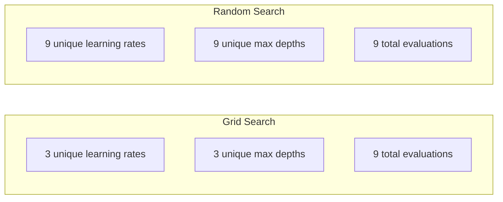
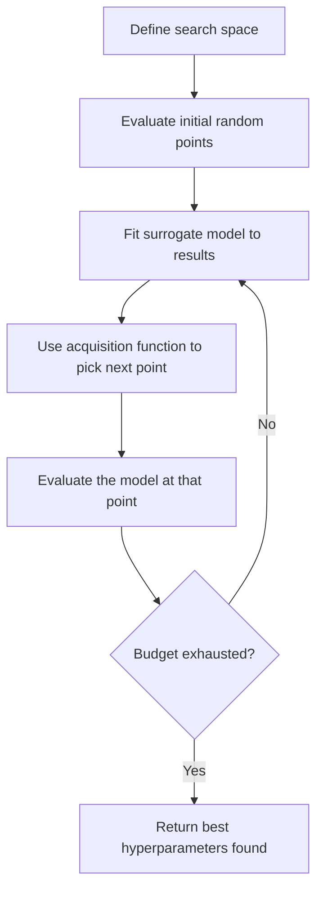
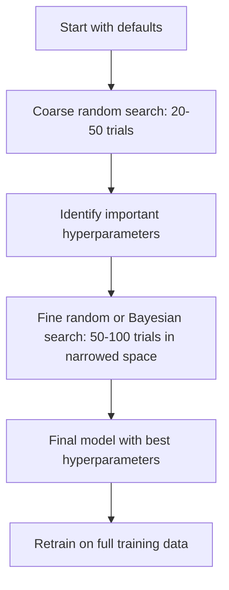
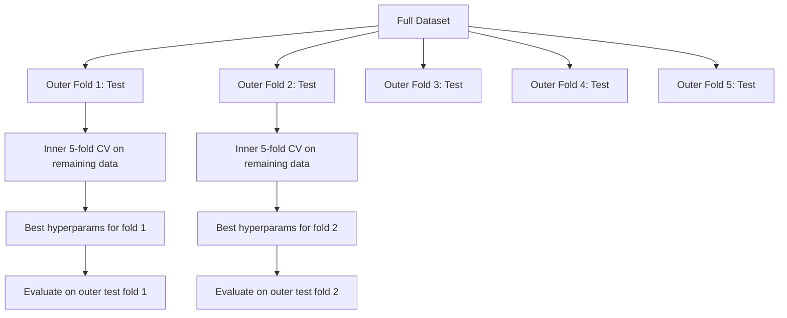

<!-- i18n:manual -->
# Настройка гиперпараметров

> Гиперпараметры — это ручки, которые вы крутите до начала обучения. Умение крутить их правильно отличает посредственную модель от отличной.

**Type:** Build
**Language:** Python
**Prerequisites:** Phase 2, Lesson 11 (Ensemble Methods)
**Time:** ~90 minutes

## Learning Objectives

- Реализовать grid search, random search и байесовскую оптимизацию с нуля и сравнить их эффективность по числу проб
- Объяснить, почему random search обходит grid search, когда у большинства гиперпараметров низкая эффективная размерность
- Собрать цикл байесовской оптимизации с суррогатной моделью и acquisition-функцией, которая ведёт поиск
- Спроектировать стратегию настройки, которая не переобучается под валидационную выборку благодаря правильной кросс-валидации

> 🎒 **На пальцах.** Параметры модель находит сама во время обучения. Гиперпараметры вы задаёте до старта — как настройки духовки перед выпечкой. Урок про то, как перебирать эти настройки умно, а не наугад и не подряд.

## The Problem

У вашей модели gradient boosting есть learning rate, число деревьев, максимальная глубина, минимум объектов в листе, доля объектов и доля признаков на дерево. Итого шесть гиперпараметров. Если у каждого по 5 разумных значений, в сетке 5^6 = 15 625 комбинаций. Каждое обучение занимает 10 секунд. Это 43 часа вычислений, чтобы перебрать всё.

Grid search — очевидный подход и худший при масштабе. Random search справляется лучше и дешевле. Байесовская оптимизация ещё лучше, потому что учится на прошлых замерах. Знание того, какую стратегию выбрать и какие гиперпараметры вообще важны, экономит дни GPU-времени.

> 🎒 **На пальцах.** 5^6 — это как кодовый замок с шестью колёсиками по пять цифр. Перебирать все 15 625 комбинаций по 10 секунд — почти двое суток без сна. А ведь обычно реально важны одно-два колёсика, остальные почти ни на что не влияют.

## The Concept

### Parameters vs Hyperparameters

Параметры выучиваются во время обучения (веса, смещения, пороги разбиений). Гиперпараметры задаются до начала обучения и управляют тем, как идёт обучение.

| Hyperparameter | What it controls | Typical range |
|---------------|-----------------|---------------|
| Learning rate | Размер шага при обновлении | 0.001 to 1.0 |
| Number of trees/epochs | Как долго учить | 10 to 10,000 |
| Max depth | Сложность модели | 1 to 30 |
| Regularization (lambda) | Защита от переобучения | 0.0001 to 100 |
| Batch size | Шум в оценке градиента | 16 to 512 |
| Dropout rate | Доля отключаемых нейронов | 0.0 to 0.5 |

### Grid Search

Grid search перебирает все комбинации заданных значений. Метод исчерпывающий и понятный, но растёт экспоненциально с числом гиперпараметров.

```
Grid for 2 hyperparameters:

  learning_rate: [0.01, 0.1, 1.0]
  max_depth:     [3, 5, 7]

  Evaluations: 3 x 3 = 9 combinations

  (0.01, 3)  (0.01, 5)  (0.01, 7)
  (0.1,  3)  (0.1,  5)  (0.1,  7)
  (1.0,  3)  (1.0,  5)  (1.0,  7)
```

У grid search есть принципиальный изъян: если один гиперпараметр важен, а другой нет, большинство замеров потрачено впустую. Из 9 запусков вы получаете всего 3 разных значения важного параметра.

> 🎒 **На пальцах.** Посмотрите на сетку 3 × 3 из блока выше. Столбец `max_depth` вообще ни на что не влияет — тогда все три запуска в каждой строке дают почти одинаковый результат. Реально полезной информации у вас на 3 замера, а заплатили за 9. Две трети бюджета в мусор.

### Random Search

Random search сэмплирует гиперпараметры из распределений, а не берёт узлы сетки. При том же бюджете в 9 запусков вы получаете 9 разных значений каждого гиперпараметра.



Почему random обгоняет grid (Bergstra & Bengio, 2012):

- У большинства гиперпараметров низкая эффективная размерность. Обычно на конкретной задаче важны 1-2 из 6.
- Grid search тратит замеры на неважные измерения.
- Random search при том же бюджете плотнее покрывает важные измерения.
- На 60 случайных пробах вероятность найти точку в пределах 5% от оптимума — 95% (если такая точка вообще есть в пространстве поиска).

> 🎒 **На пальцах.** Тот же бюджет 9 запусков, но 9 разных learning rate вместо 3. Если важен только learning rate, random search даёт втрое больше полезных наблюдений бесплатно. Запомните число 60: столько случайных проб хватает, чтобы с вероятностью 95% попасть в лучшие 5% пространства.

### Bayesian Optimization

Random search игнорирует результаты. Он не запоминает, что высокие learning rate приводят к расходимости, а глубина 3 стабильно лучше глубины 10. Байесовская оптимизация использует прошлые замеры, чтобы решить, куда смотреть дальше.



Два ключевых компонента:

**Surrogate model:** дешёвая в вычислении модель (обычно гауссовский процесс), которая приближает дорогую целевую функцию. Она даёт и прогноз, и оценку неопределённости в любой точке пространства поиска.

**Acquisition function:** решает, где мерить дальше, балансируя между эксплуатацией (искать рядом с известными хорошими точками) и разведкой (искать там, где неопределённость велика). Частые варианты:

- **Expected Improvement (EI):** насколько сильно мы ожидаем улучшить текущий лучший результат в этой точке?
- **Upper Confidence Bound (UCB):** прогноз плюс несколько единиц неопределённости. Высокий UCB значит либо перспективно, либо неизведанно.
- **Probability of Improvement (PI):** какова вероятность, что эта точка побьёт текущий рекорд?

Байесовская оптимизация обычно находит гиперпараметры лучше, чем random search, при в 2-5 раз меньшем числе замеров. Накладные расходы на обучение суррогатной модели ничтожны на фоне обучения настоящей модели.

### Early Stopping

Не каждый запуск обучения обязан доработать до конца. Если конфигурация явно плоха уже на 10-й эпохе, остановите её и идите дальше. Это и есть early stopping в контексте поиска гиперпараметров.

Стратегии:
- **Patience-based:** остановиться, если валидационная ошибка не улучшалась N эпох подряд
- **Median pruning:** остановиться, если промежуточный результат пробы хуже медианы завершённых проб на том же шаге
- **Hyperband:** раздать маленькие бюджеты многим конфигурациям, а потом постепенно наращивать бюджет лучшим

Особенно хорош Hyperband. Он запускает 81 конфигурацию по 1 эпохе каждая, оставляет лучшую треть, даёт им 3 эпохи, снова оставляет лучшую треть и так далее. Хорошие конфигурации находятся в 10-50 раз быстрее, чем при полном прогоне всех.

> 🎒 **На пальцах.** Hyperband — это отборочный турнир. 81 конфигурация, первый тур по 1 эпохе: 81 → 27 → 9 → 3 → 1, а бюджет каждому выжившему утраивается: 1 → 3 → 9 → 27. Суммарно это примерно 5 × 81 эпох вместо 81 × 27, если бы каждую гоняли полностью. Слабых отсеиваем дёшево, силы тратим на финалистов.

### Learning Rate Schedulers

Learning rate почти всегда самый важный гиперпараметр. Вместо того чтобы держать его постоянным, планировщики меняют его по ходу обучения.

| Scheduler | Formula | When to use |
|-----------|---------|-------------|
| Step decay | Multiply by 0.1 every N epochs | Классическое обучение CNN |
| Cosine annealing | lr * 0.5 * (1 + cos(pi * t / T)) | Современный вариант по умолчанию |
| Warmup + decay | Linear increase then cosine decay | Трансформеры |
| One-cycle | Increase then decrease over one cycle | Быстрая сходимость |
| Reduce on plateau | Reduce by factor when metric stalls | Безопасный вариант по умолчанию |

> 🎒 **На пальцах.** Так подходят к машине на парковочное место: сначала едете быстро, у самого бордюра — по сантиметру. Cosine annealing делает это плавно: в начале обучения (t = 0) множитель равен 0.5 × (1 + 1) = 1, то есть полный learning rate, а в конце (t = T) — 0.5 × (1 − 1) = 0, то есть шаги почти замирают.

### Hyperparameter Importance

Не все гиперпараметры одинаково важны. Исследования random forests (Probst et al., 2019) и gradient boosting показывают устойчивые закономерности:

**High importance:**
- Learning rate (настраивайте первым делом)
- Число моделей / эпох (вместо настройки используйте early stopping)
- Сила регуляризации

**Medium importance:**
- Max depth / число слоёв
- Минимум объектов в листе / weight decay
- Доля подвыборки

**Low importance:**
- Max features (для random forests)
- Конкретный выбор функции активации
- Batch size (в разумных пределах)

Сначала настраивайте важные, остальное оставьте по умолчанию.

### Practical Strategy



Конкретный рабочий процесс:

1. **Start with library defaults.** Их выбирали опытные практики, и обычно это уже 80% результата.
2. **Coarse random search.** Широкие диапазоны, 20-50 проб. Используйте early stopping, чтобы быстро убивать плохие запуски.
3. **Analyze results.** Какие гиперпараметры коррелируют с качеством? Сузьте пространство поиска.
4. **Fine search.** Байесовская оптимизация или прицельный random search в суженном пространстве. 50-100 проб.
5. **Retrain on all training data** с найденными лучшими гиперпараметрами.

### Cross-Validation Integration

Настраивать гиперпараметры на одном валидационном разбиении рискованно. Лучшие гиперпараметры могут переобучиться под конкретный фолд. Вложенная кросс-валидация решает это двумя циклами:

- **Outer loop** (оценка): делит данные на train+val и test. Даёт несмещённую оценку качества.
- **Inner loop** (настройка): делит train+val на train и val. Находит лучшие гиперпараметры.



Каждый внешний фолд ищет свои лучшие гиперпараметры независимо. Внешние оценки дают несмещённую оценку обобщающей способности.

С sklearn:

```python
from sklearn.model_selection import cross_val_score, GridSearchCV
from sklearn.ensemble import GradientBoostingRegressor

inner_cv = GridSearchCV(
    GradientBoostingRegressor(),
    param_grid={
        "learning_rate": [0.01, 0.05, 0.1],
        "max_depth": [2, 3, 5],
        "n_estimators": [50, 100, 200],
    },
    cv=5,
    scoring="neg_mean_squared_error",
)

outer_scores = cross_val_score(
    inner_cv, X, y, cv=5, scoring="neg_mean_squared_error"
)

print(f"Nested CV MSE: {-outer_scores.mean():.4f} +/- {outer_scores.std():.4f}")
```

Это дорого (5 внешних фолдов × 5 внутренних × 27 узлов сетки = 675 обучений модели), зато оценка качества получается надёжной. Применяйте, когда публикуете финальные результаты или когда цена ошибки высока.

> 🎒 **На пальцах.** Откуда 27 узлов сетки: 3 значения learning_rate × 3 значения max_depth × 3 значения n_estimators = 27. Умножаем на 5 внутренних фолдов и 5 внешних — 675 обучений. Если одно обучение занимает 2 секунды, это 22 минуты. Поэтому вложенную кросс-валидацию берегут для финальных цифр, а не для повседневных экспериментов.

### Practical Tips

**Start with the learning rate.** Для градиентных методов это всегда самый важный гиперпараметр. При плохом learning rate всё остальное не имеет значения. Зафиксируйте прочие гиперпараметры на дефолтах и сначала прогоните learning rate.

**Use log-uniform distributions for learning rate and regularization.** Разница между 0.001 и 0.01 значит столько же, сколько разница между 0.1 и 1.0. Линейный поиск сливает бюджет на большие значения.

**Use early stopping instead of tuning n_estimators.** Для boosting и нейросетей выставьте n_estimators или число эпох с запасом и дайте early stopping решить, когда остановиться. Это убирает один гиперпараметр из поиска.

**Budget allocation.** Тратьте 60% бюджета настройки на 2 самых важных гиперпараметра. Остальные 40% — на всё прочее. Эти два дают большую часть разброса качества.

**Scale matters.** Никогда не ищите batch size по логарифмической шкале (16, 32, 64 — нормально). Learning rate всегда ищите по логарифмической. Подбирайте распределение поиска под то, как гиперпараметр влияет на модель.

| Model Type | Top Hyperparameters | Recommended Search | Budget |
|-----------|--------------------|--------------------|--------|
| Random Forest | n_estimators, max_depth, min_samples_leaf | Random search, 50 проб | Низкий (быстрое обучение) |
| Gradient Boosting | learning_rate, n_estimators, max_depth | Байесовский, 100 проб + early stopping | Средний |
| Neural Network | learning_rate, weight_decay, batch_size | Байесовский или random, 100+ проб | Высокий (медленное обучение) |
| SVM | C, gamma (RBF kernel) | Сетка по лог-шкале, 25-50 проб | Низкий (2 параметра) |
| Lasso/Ridge | alpha | Одномерный поиск по лог-шкале, 20 проб | Очень низкий |
| XGBoost | learning_rate, max_depth, subsample, colsample | Байесовский, 100-200 проб + early stopping | Средний |

**When in doubt:** random search с числом проб вдвое больше числа гиперпараметров (например, 6 гиперпараметров = минимум 12 проб). Вы удивитесь, как часто random search на 50 пробах обгоняет тщательно продуманный grid search.

```figure
k-fold-cv
```

> 🎒 **На пальцах.** Про лог-шкалу на конкретных числах. Между 0.001 и 0.01 — десятикратная разница, и между 0.1 и 1.0 тоже десятикратная. Но линейный поиск от 0.001 до 1.0 положит почти все пробы выше 0.1 и почти ни одной в области малых значений, где часто и лежит оптимум. Лог-шкала раскладывает пробы равномерно по порядкам величины.

## Build It

### Step 1: Grid Search from Scratch

Код в `code/tuning.py` реализует grid search, random search и простой байесовский оптимизатор с нуля.

```python
def grid_search(model_fn, param_grid, X_train, y_train, X_val, y_val):
    keys = list(param_grid.keys())
    values = list(param_grid.values())
    best_score = -float("inf")
    best_params = None
    n_evals = 0

    for combo in itertools.product(*values):
        params = dict(zip(keys, combo))
        model = model_fn(**params)
        model.fit(X_train, y_train)
        score = evaluate(model, X_val, y_val)
        n_evals += 1

        if score > best_score:
            best_score = score
            best_params = params

    return best_params, best_score, n_evals
```

> 🎒 **На пальцах.** Вся суть grid search в одной строке — `itertools.product(*values)`. Это декартово произведение: он честно составляет все возможные наборы. Дайте ему три списка по 5 значений — получите 125 итераций цикла. Ни капли ума, только терпение.

### Step 2: Random Search from Scratch

```python
def random_search(model_fn, param_distributions, X_train, y_train,
                  X_val, y_val, n_iter=50, seed=42):
    rng = np.random.RandomState(seed)
    best_score = -float("inf")
    best_params = None

    for _ in range(n_iter):
        params = {k: sample(v, rng) for k, v in param_distributions.items()}
        model = model_fn(**params)
        model.fit(X_train, y_train)
        score = evaluate(model, X_val, y_val)

        if score > best_score:
            best_score = score
            best_params = params

    return best_params, best_score, n_iter
```

### Step 3: Bayesian Optimization (Simplified)

Основная идея: обучить гауссовский процесс на наблюдённых парах (гиперпараметры, качество), а затем acquisition-функцией решить, куда смотреть дальше.

```python
class SimpleBayesianOptimizer:
    def __init__(self, search_space, n_initial=5):
        self.search_space = search_space
        self.n_initial = n_initial
        self.X_observed = []
        self.y_observed = []

    def _kernel(self, x1, x2, length_scale=1.0):
        dists = np.sum((x1[:, None, :] - x2[None, :, :]) ** 2, axis=2)
        return np.exp(-0.5 * dists / length_scale ** 2)

    def _fit_gp(self, X_new):
        X_obs = np.array(self.X_observed)
        y_obs = np.array(self.y_observed)
        y_mean = y_obs.mean()
        y_centered = y_obs - y_mean

        K = self._kernel(X_obs, X_obs) + 1e-4 * np.eye(len(X_obs))
        K_star = self._kernel(X_new, X_obs)

        L = np.linalg.cholesky(K)
        alpha = np.linalg.solve(L.T, np.linalg.solve(L, y_centered))
        mu = K_star @ alpha + y_mean

        v = np.linalg.solve(L, K_star.T)
        var = 1.0 - np.sum(v ** 2, axis=0)
        var = np.maximum(var, 1e-6)

        return mu, var

    def _expected_improvement(self, mu, var, best_y):
        sigma = np.sqrt(var)
        z = (mu - best_y) / (sigma + 1e-10)
        ei = sigma * (z * norm_cdf(z) + norm_pdf(z))
        return ei

    def suggest(self):
        if len(self.X_observed) < self.n_initial:
            return sample_random(self.search_space)

        candidates = [sample_random(self.search_space) for _ in range(500)]
        X_cand = np.array([to_vector(c) for c in candidates])
        mu, var = self._fit_gp(X_cand)
        ei = self._expected_improvement(mu, var, max(self.y_observed))
        return candidates[np.argmax(ei)]

    def observe(self, params, score):
        self.X_observed.append(to_vector(params))
        self.y_observed.append(score)
```

Суррогатная модель на основе GP даёт в каждой кандидатной точке две вещи: прогноз качества (mu) и неопределённость (var). Expected Improvement балансирует их: она предпочитает точки, где модель прогнозирует высокое качество ИЛИ где велика неопределённость. В начале почти везде неопределённость высокая, поэтому оптимизатор разведывает. Дальше он концентрируется на самой перспективной области.

> 🎒 **На пальцах.** Метод `suggest` работает так: первые 5 точек (`n_initial=5`) берутся наугад — сравнивать пока не с чем. Дальше он генерирует 500 случайных кандидатов, для каждого спрашивает у GP «сколько тут ожидается и насколько ты уверен», считает EI и возвращает единственного победителя через `np.argmax(ei)`. Перебрать 500 кандидатов в уме дёшево, а обучить 500 моделей — нет, в этом и весь фокус. Получается игра «горячо-холодно»: после пары «холодно» оптимизатор туда больше не ходит и тратит пробы там, где теплее или где ещё вообще не был, и отсюда выигрыш в 2-5 раз по числу попыток.

### Step 4: Compare All Methods

Прогоните все три метода на одной синтетической целевой функции и сравните. В этом сравнении используется упрощённая обёртка, которая вызывает каждый оптимизатор с целевой функцией напрямую (без обучения модели), поэтому API отличается от реализаций выше:

```python
def synthetic_objective(params):
    lr = params["learning_rate"]
    depth = params["max_depth"]
    return -(np.log10(lr) + 2) ** 2 - (depth - 4) ** 2 + 10

param_grid = {
    "learning_rate": [0.001, 0.01, 0.1, 1.0],
    "max_depth": [2, 3, 4, 5, 6, 7, 8],
}

grid_best = None
grid_score = -float("inf")
grid_history = []
for combo in itertools.product(*param_grid.values()):
    params = dict(zip(param_grid.keys(), combo))
    score = synthetic_objective(params)
    grid_history.append((params, score))
    if score > grid_score:
        grid_score = score
        grid_best = params

param_dist = {
    "learning_rate": ("log_float", 0.001, 1.0),
    "max_depth": ("int", 2, 8),
}

rand_best = None
rand_score = -float("inf")
rand_history = []
rng = np.random.RandomState(42)
for _ in range(28):
    params = {k: sample(v, rng) for k, v in param_dist.items()}
    score = synthetic_objective(params)
    rand_history.append((params, score))
    if score > rand_score:
        rand_score = score
        rand_best = params

optimizer = SimpleBayesianOptimizer(param_dist, n_initial=5)
bayes_history = []
for _ in range(28):
    params = optimizer.suggest()
    score = synthetic_objective(params)
    optimizer.observe(params, score)
    bayes_history.append((params, score))
bayes_score = max(s for _, s in bayes_history)

print(f"{'Method':<20} {'Best Score':>12} {'Evaluations':>12}")
print("-" * 50)
print(f"{'Grid Search':<20} {grid_score:>12.4f} {len(grid_history):>12}")
print(f"{'Random Search':<20} {rand_score:>12.4f} {len(rand_history):>12}")
print(f"{'Bayesian Opt':<20} {bayes_score:>12.4f} {len(bayes_history):>12}")
```

При одинаковом бюджете байесовская оптимизация обычно быстрее всех выходит на лучший результат, потому что не тратит замеры на заведомо плохие области. Random search покрывает больше пространства, чем grid search. Grid search выигрывает только когда гиперпараметров совсем мало и можно позволить себе полный перебор.

> 🎒 **На пальцах.** Целевую функцию здесь можно решить в уме: максимум там, где оба квадрата равны нулю, то есть `log10(lr) = -2` (то есть lr = 0.01) и `depth = 4`, и тогда score = 10. Бюджет у всех одинаковый: сетка 4 × 7 = 28 точек, у random и Bayes тоже по 28. Сетка попадает в точку 10 случайно, потому что 0.01 и 4 в её списках есть, а вот на реальных задачах такой удачи не бывает.

## Use It

### Optuna in Practice

Optuna — рекомендуемая библиотека для серьёзной настройки гиперпараметров. Она из коробки поддерживает pruning, распределённый поиск и визуализацию.

```python
import optuna

def objective(trial):
    lr = trial.suggest_float("learning_rate", 1e-4, 1e-1, log=True)
    n_est = trial.suggest_int("n_estimators", 50, 500)
    max_depth = trial.suggest_int("max_depth", 2, 10)

    model = GradientBoostingRegressor(
        learning_rate=lr,
        n_estimators=n_est,
        max_depth=max_depth,
    )
    model.fit(X_train, y_train)
    return mean_squared_error(y_val, model.predict(X_val))

study = optuna.create_study(direction="minimize")
study.optimize(objective, n_trials=100)

print(f"Best params: {study.best_params}")
print(f"Best MSE: {study.best_value:.4f}")
```

Ключевые возможности Optuna:
- `suggest_float(..., log=True)` для параметров, которые лучше искать по лог-шкале (learning rate, регуляризация)
- `suggest_int` для целочисленных параметров
- `suggest_categorical` для дискретного выбора
- Встроенный MedianPruner для ранней остановки плохих проб
- `study.trials_dataframe()` для анализа

> 🎒 **На пальцах.** Обратите внимание на `log=True` у learning rate и на его отсутствие у `n_estimators`. Первый живёт в порядках величины (0.0001, 0.001, 0.01), второй — в обычных числах (50, 200, 500). Функция `objective` возвращает MSE, а `direction="minimize"` говорит: чем меньше, тем лучше. Всё, больше от вас ничего не требуется — остальные 100 проб Optuna проведёт сама.

### Optuna with Pruning

Pruning останавливает бесперспективные пробы рано и экономит огромные вычисления. Схема такая:

```python
import optuna
from sklearn.model_selection import cross_val_score

def objective(trial):
    params = {
        "learning_rate": trial.suggest_float("lr", 1e-4, 0.5, log=True),
        "max_depth": trial.suggest_int("max_depth", 2, 10),
        "n_estimators": trial.suggest_int("n_estimators", 50, 500),
        "subsample": trial.suggest_float("subsample", 0.5, 1.0),
    }

    model = GradientBoostingRegressor(**params)
    scores = cross_val_score(model, X_train, y_train, cv=3,
                             scoring="neg_mean_squared_error")
    mean_score = -scores.mean()

    trial.report(mean_score, step=0)
    if trial.should_prune():
        raise optuna.TrialPruned()

    return mean_score

pruner = optuna.pruners.MedianPruner(n_startup_trials=10, n_warmup_steps=5)
study = optuna.create_study(direction="minimize", pruner=pruner)
study.optimize(objective, n_trials=200)
```

`MedianPruner` останавливает пробу, если её промежуточное значение хуже медианы всех завершённых проб на том же шаге. Для pruning нужно вызывать `trial.report()`, чтобы сообщать промежуточные метрики, и `trial.should_prune()`, чтобы проверять, пора ли останавливаться. Параметр `n_startup_trials=10` гарантирует, что минимум 10 проб пройдут целиком, прежде чем pruning вообще включится. Обычно это экономит 40-60% всех вычислений.

> 🎒 **На пальцах.** Медиана — это значение посередине списка. Если 10 завершённых проб дали MSE от 3 до 20, медиана где-то около 8. Новая проба на том же шаге показала 15 — она хуже половины уже испытанных, шансов почти нет, останавливаем. Ровно так тренер снимает с дистанции бегуна, который на середине уже отстаёт от всех.

### sklearn's Built-in Tuners

Для быстрых экспериментов в sklearn есть `GridSearchCV`, `RandomizedSearchCV` и `HalvingRandomSearchCV`:

```python
from sklearn.model_selection import RandomizedSearchCV
from scipy.stats import loguniform, randint

param_dist = {
    "learning_rate": loguniform(1e-4, 0.5),
    "max_depth": randint(2, 10),
    "n_estimators": randint(50, 500),
}

search = RandomizedSearchCV(
    GradientBoostingRegressor(),
    param_dist,
    n_iter=100,
    cv=5,
    scoring="neg_mean_squared_error",
    random_state=42,
    n_jobs=-1,
)
search.fit(X_train, y_train)
print(f"Best params: {search.best_params_}")
print(f"Best CV MSE: {-search.best_score_:.4f}")
```

Для learning rate и регуляризации берите `loguniform` из scipy. Для целочисленных гиперпараметров — `randint`. Флаг `n_jobs=-1` распараллеливает работу по всем ядрам процессора.

> 🎒 **На пальцах.** Прикиньте цену запуска: `n_iter=100` проб × `cv=5` фолдов = 500 обучений модели. При `n_jobs=-1` и восьми ядрах это примерно в 8 раз быстрее по времени, но работы всё равно 500 обучений. Всегда считайте это произведение перед тем, как нажать Enter.

### Common Mistakes in Hyperparameter Tuning

**Data leakage through preprocessing.** Если обучить scaler на всём датасете до кросс-валидации, информация из валидационного фолда просочится в обучение. Всегда кладите препроцессинг внутрь `Pipeline`, чтобы он обучался только на обучающем фолде.

**Overfitting to the validation set.** Тысячи проб — это фактически обучение по валидационной выборке. Для финальной оценки качества используйте вложенную кросс-валидацию или отложите отдельный тестовый набор, к которому вы не притрагиваетесь во время настройки.

**Searching too narrow a range.** Если лучшее найденное значение оказалось на границе диапазона, вы искали слишком узко. Оптимум может лежать за пределами вашего диапазона. Всегда проверяйте, не упёрлись ли лучшие параметры в края.

**Ignoring interaction effects.** В boosting learning rate и число моделей сильно связаны. Маленькому learning rate нужно больше моделей. Настраивать их по отдельности хуже, чем вместе.

**Not using early stopping for iterative models.** Для gradient boosting и нейросетей выставляйте n_estimators или число эпох с запасом и включайте early stopping. Это строго лучше, чем настраивать число итераций как гиперпараметр.

> 🎒 **На пальцах.** Про границы диапазона на примере: искали learning rate в [0.01, 0.1], лучшим оказался ровно 0.1 — край. Это красный флаг, а не результат. Расширьте до [0.01, 1.0] и перезапустите. То же самое, что искать потерянную вещь строго внутри комнаты, хотя она могла закатиться в коридор.

## Exercises

1. Запустите grid search и random search с одинаковым общим бюджетом (например, 50 замеров). Сравните найденные лучшие результаты. Повторите эксперимент 10 раз с разными сидами. Как часто выигрывает random search?

2. Реализуйте Hyperband с нуля. Начните с 81 конфигурации, каждая обучается 1 эпоху. На каждом раунде оставляйте лучшую треть и утраивайте их бюджет. Сравните суммарные вычисления (сумма всех эпох по всем конфигурациям) с прогоном всех 81 конфигураций на полный бюджет.

3. Добавьте планировщик learning rate (cosine annealing) в реализацию gradient boosting из урока 11. Помогает ли это по сравнению с фиксированным learning rate?

4. Настройте RandomForestClassifier на реальном датасете (например, breast cancer из sklearn) с помощью Optuna. Посмотрите через `optuna.visualization.plot_param_importances(study)`, какие гиперпараметры важнее всего. Совпадает ли это с рейтингом важности из этого урока?

5. Реализуйте простую acquisition-функцию (Expected Improvement) и продемонстрируйте разведку против эксплуатации. Постройте график среднего и неопределённости суррогатной модели и покажите, где EI выбирает следующую точку.

> 🎒 **На пальцах.** Подсказка к заданию 2. Считайте суммарные эпохи по раундам: 81 × 1 + 27 × 3 + 9 × 9 + 3 × 27 + 1 × 81 = 81 + 81 + 81 + 81 + 81 = 405 эпох. Прогон всех 81 конфигураций на полный бюджет 81 эпоха стоил бы 81 × 81 = 6561. Экономия примерно в 16 раз — и это без всякой магии, просто вы не тратите ресурсы на заведомых аутсайдеров.

## Key Terms

| Term | What people say | What it actually means |
|------|----------------|----------------------|
| Hyperparameter | «Настройка, которую вы выбираете» | Значение, задаваемое до обучения и управляющее процессом обучения, а не выучиваемое из данных |
| Grid search | «Перебрать все комбинации» | Полный перебор по заданной сетке параметров. Экспоненциальная стоимость. |
| Random search | «Просто сэмплить случайно» | Сэмплирование гиперпараметров из распределений. Покрывает важные измерения лучше, чем grid search. |
| Bayesian optimization | «Умный поиск» | Использует суррогатную модель целевой функции, чтобы решать, где мерить дальше, балансируя разведку и эксплуатацию |
| Surrogate model | «Дешёвое приближение» | Модель (обычно гауссовский процесс), приближающая дорогую целевую функцию по уже сделанным замерам |
| Acquisition function | «Куда смотреть дальше» | Оценивает кандидатные точки, балансируя ожидаемое улучшение и неопределённость. Частые варианты — EI и UCB. |
| Early stopping | «Хватит тратить время» | Прервать обучение досрочно, когда качество на валидации перестало расти |
| Hyperband | «Турнирная сетка для конфигураций» | Адаптивное распределение ресурсов: запустить много конфигураций с малым бюджетом, оставить лучшие и увеличить им бюджет |
| Learning rate scheduler | «Менять lr по ходу обучения» | Функция, которая меняет learning rate в течение обучения ради лучшей сходимости |

## Further Reading

- [Bergstra & Bengio: Random Search for Hyper-Parameter Optimization (2012)](https://jmlr.org/papers/v13/bergstra12a.html) -- статья, показавшая, что random обгоняет grid
- [Snoek et al., Practical Bayesian Optimization of Machine Learning Algorithms (2012)](https://arxiv.org/abs/1206.2944) -- байесовская оптимизация для ML
- [Li et al., Hyperband: A Novel Bandit-Based Approach (2018)](https://jmlr.org/papers/v18/16-558.html) -- статья про Hyperband
- [Optuna: A Next-generation Hyperparameter Optimization Framework](https://arxiv.org/abs/1907.10902) -- статья про Optuna
- [Probst et al., Tunability: Importance of Hyperparameters (2019)](https://jmlr.org/papers/v20/18-444.html) -- какие гиперпараметры важны
