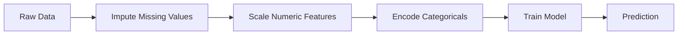
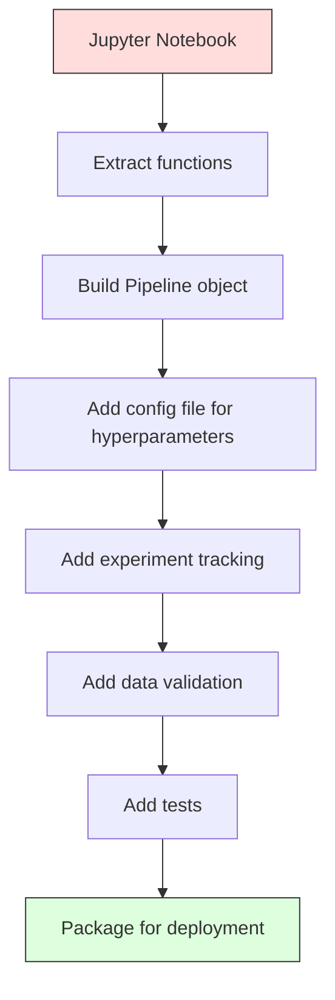

<!-- i18n:manual -->
# ML-пайплайны

> Продукт — это не модель. Продукт — это пайплайн. Пайплайн — это весь путь от сырых данных до предсказания в проде, и каждый шаг обязан быть воспроизводимым.

**Type:** Build
**Language:** Python
**Prerequisites:** Phase 2, Lesson 12 (Hyperparameter Tuning)
**Time:** ~120 minutes

## Learning Objectives

- Собрать ML-пайплайн с нуля, соединив в один воспроизводимый объект заполнение пропусков, масштабирование, кодирование категорий и обучение модели
- Распознавать ситуации с утечкой данных и объяснять, как пайплайн их предотвращает, обучая трансформеры только на обучающей выборке
- Построить ColumnTransformer, который применяет разную предобработку к числовым и категориальным признакам
- Реализовать сериализацию пайплайна и показать, что один и тот же обученный пайплайн даёт одинаковый результат и при обучении, и в продакшене

> 🎒 **На пальцах.** Модель — это как один рецепт из тетрадки. Пайплайн — это вся кухня: мытьё овощей, нарезка, плита, тарелка. Урок про то, как упаковать кухню в коробку, чтобы завтра в другом месте получилось точно такое же блюдо.

## The Problem

У вас есть ноутбук, который загружает данные, заполняет пропуски медианой, масштабирует признаки, обучает модель и печатает accuracy. Он работает. Вы его выкатываете.

Через месяц кто-то переобучает модель и получает другие результаты. Медиана считалась по всему датасету, включая тестовую часть (утечка данных). Параметры масштабирования никто не сохранил, поэтому на инференсе используется другая статистика. Код подготовки признаков копипастили между обучением и сервингом, и копии разошлись. В продакшене в категориальной колонке появилось новое значение, которого энкодер никогда не видел.

Это не выдуманные проблемы. Это самые частые причины падения ML-систем в продакшене. Пайплайны решают их все, упаковывая каждый шаг преобразования в один упорядоченный воспроизводимый объект.

> 🎒 **На пальцах.** Представьте, что вы посчитали средний рост класса, подсмотрев в том числе рост учеников из контрольной группы, а потом хвастаетесь, что «угадали» их рост. Это и есть утечка: вы подглядели ответ и сами же себя обманули. Модель на такой оценке выглядит отличницей, а в жизни ошибается.

## The Concept

### What a Pipeline Is

Пайплайн — это упорядоченная последовательность преобразований данных, за которой идёт модель. Каждый шаг получает на вход выход предыдущего. Весь пайплайн обучается один раз на обучающих данных. На инференсе тот же обученный пайплайн преобразует новые данные и выдаёт предсказания.



Пайплайн гарантирует:
- Преобразования обучаются только на обучающих данных (нет утечки)
- Те же самые преобразования применяются на инференсе
- Весь объект можно сериализовать и выкатить как один артефакт
- Кросс-валидация применяет пайплайн внутри каждого фолда, что предотвращает незаметные утечки

> 🎒 **На пальцах.** Пайплайн — это конвейер на фабрике: деталь едет по ленте и проходит станки строго по порядку. Нельзя переставить местами покраску и сушку. И главное: на ленте одна и та же настройка станков и при обучении, и в проде — вы не собираете вторую фабрику «для боевых данных».

### Data Leakage: The Silent Killer

Утечка данных случается, когда информация из тестовой выборки или из будущего просачивается в обучение. Пайплайны предотвращают самые частые её формы.

**Leaky (wrong):**

```python
X = df.drop("target", axis=1)
y = df["target"]

scaler = StandardScaler()
X_scaled = scaler.fit_transform(X)

X_train, X_test = X_scaled[:800], X_scaled[800:]
y_train, y_test = y[:800], y[800:]
```

Scaler увидел тестовые данные. Среднее и стандартное отклонение посчитаны с учётом тестовых примеров. Это завышает оценку качества.

**Correct:**

```python
X_train, X_test = X[:800], X[800:]

scaler = StandardScaler()
X_train_scaled = scaler.fit_transform(X_train)
X_test_scaled = scaler.transform(X_test)
```

С пайплайном об этом можно не думать. Он делает всё сам.

> 🎒 **На пальцах.** Разница ровно в одной строке: в первом варианте `fit_transform` вызывается на всех данных, во втором `fit_transform` только на `X_train`, а для `X_test` — просто `transform`. `fit` означает «запомнить среднее и разброс». Тест должен пройти через уже готовые числа, а не участвовать в их подсчёте.

### sklearn Pipeline

`Pipeline` из sklearn соединяет трансформеры и модель в цепочку. У него есть `.fit()`, `.predict()` и `.score()`, которые применяют все шаги по порядку.

```python
from sklearn.pipeline import Pipeline
from sklearn.preprocessing import StandardScaler
from sklearn.linear_model import LogisticRegression

pipe = Pipeline([
    ("scaler", StandardScaler()),
    ("model", LogisticRegression()),
])

pipe.fit(X_train, y_train)
predictions = pipe.predict(X_test)
```

Когда вы вызываете `pipe.fit(X_train, y_train)`:
1. Scaler вызывает `fit_transform` на X_train
2. Модель вызывает `fit` на масштабированном X_train

Когда вы вызываете `pipe.predict(X_test)`:
1. Scaler вызывает `transform` (не fit_transform) на X_test
2. Модель вызывает `predict` на масштабированном X_test

Scaler никогда не видит тестовые данные во время обучения. В этом весь смысл.

> 🎒 **На пальцах.** Список `[("scaler", ...), ("model", ...)]` читается сверху вниз, как порядок действий в рецепте. Имена в кавычках нужны, чтобы потом обращаться к шагу: `pipe.named_steps["scaler"]`. Правило простое: последний шаг — модель, все предыдущие — трансформеры.

### ColumnTransformer: Different Pipelines for Different Columns

В реальных датасетах есть числовые и категориальные колонки, которым нужна разная предобработка. Этим занимается `ColumnTransformer`.

```python
from sklearn.compose import ColumnTransformer
from sklearn.preprocessing import StandardScaler, OneHotEncoder
from sklearn.impute import SimpleImputer

numeric_pipe = Pipeline([
    ("impute", SimpleImputer(strategy="median")),
    ("scale", StandardScaler()),
])

categorical_pipe = Pipeline([
    ("impute", SimpleImputer(strategy="most_frequent")),
    ("encode", OneHotEncoder(handle_unknown="ignore")),
])

preprocessor = ColumnTransformer([
    ("num", numeric_pipe, ["age", "income", "score"]),
    ("cat", categorical_pipe, ["city", "gender", "plan"]),
])

full_pipeline = Pipeline([
    ("preprocess", preprocessor),
    ("model", GradientBoostingClassifier()),
])
```

Параметр `handle_unknown="ignore"` в OneHotEncoder критичен для продакшена. Когда появляется новая категория (город, которого модель не видела), энкодер выдаёт нулевой вектор вместо падения.

> 🎒 **На пальцах.** Возраст и доход — числа, их можно усреднить, поэтому пропуски заполняем медианой. Город — слово, среднего города не бывает, поэтому берём самое частое значение и превращаем в набор колонок из нулей и единицы. Три числовые колонки идут по одной ветке, три категориальные — по другой, потом результаты склеиваются в одну таблицу.

### Experiment Tracking

Пайплайн делает обучение воспроизводимым, но вам ещё нужно отслеживать, что происходило от эксперимента к эксперименту: какие гиперпараметры использовались, какая версия датасета, какие были метрики, какой код работал.

**MLflow** — самое распространённое open-source решение:

```python
import mlflow

with mlflow.start_run():
    mlflow.log_param("max_depth", 5)
    mlflow.log_param("n_estimators", 100)
    mlflow.log_param("learning_rate", 0.1)

    pipe.fit(X_train, y_train)
    accuracy = pipe.score(X_test, y_test)

    mlflow.log_metric("accuracy", accuracy)
    mlflow.sklearn.log_model(pipe, "model")
```

Каждый запуск записывается вместе с параметрами, метриками, артефактами и полной моделью. Запуски можно сравнивать, любой эксперимент — воспроизвести, любую версию модели — выкатить.

**Weights & Biases (wandb)** даёт то же самое, но с хостящимся дашбордом:

```python
import wandb

wandb.init(project="my-pipeline")
wandb.config.update({"max_depth": 5, "n_estimators": 100})

pipe.fit(X_train, y_train)
accuracy = pipe.score(X_test, y_test)

wandb.log({"accuracy": accuracy})
```

> 🎒 **На пальцах.** Это лабораторный журнал. Без него через две недели вы не вспомните, дала ли accuracy 0.87 модель с `max_depth=5` или с `max_depth=8`. MLflow записывает три строчки параметров и одну метрику — и через месяц вы просто открываете таблицу запусков и находите лучший.

### Model Versioning

После трекинга экспериментов нужно управлять версиями моделей. Какая модель сейчас в продакшене? Какая на стейджинге? А какая была на прошлой неделе?

Model Registry в MLflow даёт:
- **Version tracking:** каждая сохранённая модель получает номер версии
- **Stage transitions:** «Staging», «Production», «Archived»
- **Approval workflow:** модель должна быть явно переведена в продакшен
- **Rollback:** мгновенный откат на предыдущую версию

> 🎒 **На пальцах.** Как версии документа в облаке: «черновик», «на проверке», «финал». Реестр моделей просто не даёт случайно отправить черновик клиентам, а если финал оказался плохим — возвращает вчерашний одним кликом.

### Data Versioning with DVC

Код версионируется через git. Данные тоже надо версионировать, но git не тянет большие файлы. Эту задачу решает DVC (Data Version Control).

```
dvc init
dvc add data/training.csv
git add data/training.csv.dvc data/.gitignore
git commit -m "Track training data"
dvc push
```

DVC хранит сами данные в удалённом хранилище (S3, GCS, Azure), а в git держит маленький файл `.dvc` с хешем. Когда вы переключаетесь на другой коммит, `dvc checkout` восстанавливает ровно те данные, которые тогда использовались.

Это значит, что каждый git-коммит фиксирует и код, и данные. Полная воспроизводимость.

> 🎒 **На пальцах.** В git едет не сам CSV на 5 гигабайт, а бумажка с его «отпечатком пальца» — хешем. Бумажка весит сотню байт. По ней DVC потом находит и скачивает нужный файл из хранилища. Так же в гардеробе: номерок в кармане маленький, а куртка висит на складе.

### Reproducible Experiments

Для воспроизводимого эксперимента нужны четыре вещи:

1. **Fixed random seeds:** задать seed для numpy, random и фреймворка (torch, sklearn)
2. **Pinned dependencies:** requirements.txt или poetry.lock с точными версиями
3. **Versioned data:** DVC или аналог
4. **Config files:** все гиперпараметры в конфиге, а не зашиты в код

```python
import numpy as np
import random

def set_seed(seed=42):
    random.seed(seed)
    np.random.seed(seed)
    try:
        import torch
        torch.manual_seed(seed)
        torch.cuda.manual_seed_all(seed)
        torch.backends.cudnn.deterministic = True
    except ImportError:
        pass
```

> 🎒 **На пальцах.** Seed — это стартовый номер в генераторе «случайных» чисел. Одинаковый seed = одинаковая последовательность «случайностей» = одинаковый результат. Обратите внимание: в функции seed ставится сразу в трёх местах — `random`, `numpy` и `torch`. Забудете один — и запуск снова разъедется.

### From Notebook to Production Pipeline



Типичная последовательность:

1. **Notebook exploration:** быстрые эксперименты, графики, идеи признаков
2. **Extract functions:** вынести предобработку, генерацию признаков и оценку в модули
3. **Build Pipeline:** соединить преобразования в sklearn Pipeline или свой класс
4. **Config management:** перенести все гиперпараметры в YAML/JSON-конфиг
5. **Experiment tracking:** добавить логирование в MLflow или wandb
6. **Data validation:** проверять схему, распределения и пропуски до обучения
7. **Tests:** юнит-тесты для трансформеров, интеграционные тесты для всего пайплайна
8. **Deployment:** сериализовать пайплайн, обернуть в API (FastAPI, Flask), упаковать в контейнер

> 🎒 **На пальцах.** Ноутбук — это черновик в тетради, продовый пайплайн — сданная чистовая работа. Никто не выкидывает черновик: из него по очереди вынимают куски и превращают в аккуратные функции. Восемь шагов — восемь маленьких переписываний, а не одно героическое.

### Common Pipeline Mistakes

| Mistake | Why it is bad | Fix |
|---------|-------------|-----|
| Обучение на всех данных до разбиения | Утечка данных | Использовать Pipeline вместе с cross_val_score |
| Генерация признаков вне пайплайна | Разные преобразования при обучении и в проде | Положить все преобразования в Pipeline |
| Не обработаны неизвестные категории | Падение в проде на новых значениях | OneHotEncoder(handle_unknown="ignore") |
| Захардкоженные имена колонок | Ломается при смене схемы | Брать списки колонок из конфига |
| Нет валидации данных | Молча неверные предсказания на плохих данных | Добавить проверку схемы перед предсказанием |
| Training/serving skew | В проде модель видит другие признаки | Один объект Pipeline для обоих режимов |

```figure
f3-pipeline-flow
```

> 🎒 **На пальцах.** Почти все шесть ошибок сводятся к одной мысли: если преобразование живёт снаружи пайплайна, рано или поздно оно будет разным при обучении и в проде. Проверьте себя вопросом: «сколько объектов мне нужно сохранить, чтобы завтра сделать предсказание?» Правильный ответ — один.

## Build It

Код в `code/pipeline.py` строит полноценный ML-пайплайн с нуля:

### Step 1: Custom Transformer

```python
class CustomTransformer:
    def __init__(self):
        self.means = None
        self.stds = None

    def fit(self, X):
        self.means = np.mean(X, axis=0)
        self.stds = np.std(X, axis=0)
        self.stds[self.stds == 0] = 1.0
        return self

    def transform(self, X):
        return (X - self.means) / self.stds

    def fit_transform(self, X):
        return self.fit(X).transform(X)
```

### Step 2: Pipeline from Scratch

```python
class PipelineFromScratch:
    def __init__(self, steps):
        self.steps = steps

    def fit(self, X, y=None):
        X_current = X.copy()
        for name, step in self.steps[:-1]:
            X_current = step.fit_transform(X_current)
        name, model = self.steps[-1]
        model.fit(X_current, y)
        return self

    def predict(self, X):
        X_current = X.copy()
        for name, step in self.steps[:-1]:
            X_current = step.transform(X_current)
        name, model = self.steps[-1]
        return model.predict(X_current)
```

> 🎒 **На пальцах.** Смотрите на срез `self.steps[:-1]` — это «все шаги кроме последнего», то есть трансформеры; последний шаг `self.steps[-1]` — модель. И главное отличие: в `fit` вызывается `fit_transform`, а в `predict` — только `transform`. Одно слово разницы, и именно оно закрывает утечку данных. Строка `self.stds[self.stds == 0] = 1.0` из первого шага — защита от деления на ноль для колонки, где все значения одинаковые.

### Step 3: Cross-Validation with Pipeline

Код показывает, как кросс-валидация вместе с пайплайном предотвращает утечку данных: scaler обучается отдельно на обучающей части каждого фолда.

### Step 4: Full Production Pipeline with sklearn

Полный пайплайн с `ColumnTransformer`, несколькими ветками предобработки и моделью, обученный с корректной кросс-валидацией и логированием экспериментов.

> 🎒 **На пальцах.** При 5-фолдовой кросс-валидации scaler обучается пять раз — по одному на каждый фолд. Если бы вы масштабировали данные один раз заранее, каждый фолд подглядывал бы в свою «контрольную» часть, и итоговая оценка была бы завышена. Пять честных обучений вместо одного удобного.

## Ship It

Этот урок производит:
- `outputs/prompt-ml-pipeline.md` -- навык для сборки и отладки ML-пайплайнов
- `code/pipeline.py` -- полный пайплайн от реализации с нуля до sklearn

## Exercises

1. Соберите пайплайн для датасета с 3 числовыми и 2 категориальными колонками. С помощью `ColumnTransformer` примените к числовым медианное заполнение пропусков + масштабирование, а к категориальным — заполнение самым частым значением + one-hot кодирование. Обучите с 5-фолдовой кросс-валидацией.

2. Намеренно устройте утечку данных: обучите scaler на всём датасете до разбиения. Сравните оценку кросс-валидации (с утечкой) с оценкой пайплайна (чистой). Насколько велика разница?

3. Сериализуйте свой пайплайн через `joblib.dump`. Загрузите его в отдельном скрипте и сделайте предсказания. Убедитесь, что предсказания совпадают.

4. Добавьте в пайплайн свой трансформер, который создаёт полиномиальные признаки (степень 2) для двух самых важных числовых колонок. В каком месте пайплайна он должен стоять?

5. Настройте трекинг в MLflow для пайплайна. Проведите 5 экспериментов с разными гиперпараметрами. Через MLflow UI (`mlflow ui`) сравните запуски и выберите лучшую модель.

> 🎒 **На пальцах.** Подсказка к четвёртому заданию: полиномиальные признаки — это добавление квадратов и произведений, например из `age` и `income` получаются `age²`, `income²` и `age*income`. Ставить такой трансформер надо после заполнения пропусков (иначе он умножит `NaN` на `NaN`), но до масштабирования — чтобы новые колонки тоже получили нормальный масштаб.

## Key Terms

| Term | What people say | What it actually means |
|------|----------------|----------------------|
| Pipeline | «Цепочка преобразований плюс модель» | Упорядоченная последовательность обученных трансформеров и модели, применяемая как единое целое, чтобы не допустить утечки |
| Data leakage | «Тестовая информация просочилась в обучение» | Использование информации извне обучающей выборки при построении модели, что завышает оценки качества |
| ColumnTransformer | «Своя предобработка для каждой колонки» | Применяет разные пайплайны к разным подмножествам колонок и склеивает результаты |
| Experiment tracking | «Логирование запусков» | Запись параметров, метрик, артефактов и версий кода для каждого запуска обучения |
| MLflow | «Трекинг и деплой моделей» | Open-source платформа для трекинга экспериментов, реестра моделей и деплоя |
| DVC | «Git для данных» | Система контроля версий для больших файлов данных: хеши хранятся в git, сами данные — в удалённом хранилище |
| Model registry | «Каталог версий моделей» | Система, которая отслеживает версии моделей с метками стадий (staging, production, archived) |
| Training/serving skew | «В ноутбуке же работало» | Различия в обработке данных при обучении и на инференсе, дающие молчаливые ошибки |
| Reproducibility | «Тот же код — тот же результат» | Возможность получить идентичный результат при том же коде, данных и конфигурации |

## Further Reading

- [scikit-learn Pipeline docs](https://scikit-learn.org/stable/modules/compose.html) -- официальный справочник по пайплайнам
- [MLflow documentation](https://mlflow.org/docs/latest/index.html) -- трекинг экспериментов и реестр моделей
- [DVC documentation](https://dvc.org/doc) -- версионирование данных
- [Sculley et al., Hidden Technical Debt in Machine Learning Systems (2015)](https://papers.nips.cc/paper/2015/hash/86df7dcfd896fcaf2674f757a2463eba-Abstract.html) -- основополагающая статья о сложности ML-систем
- [Google ML Best Practices: Rules of ML](https://developers.google.com/machine-learning/guides/rules-of-ml) -- практические советы по продакшен-ML
