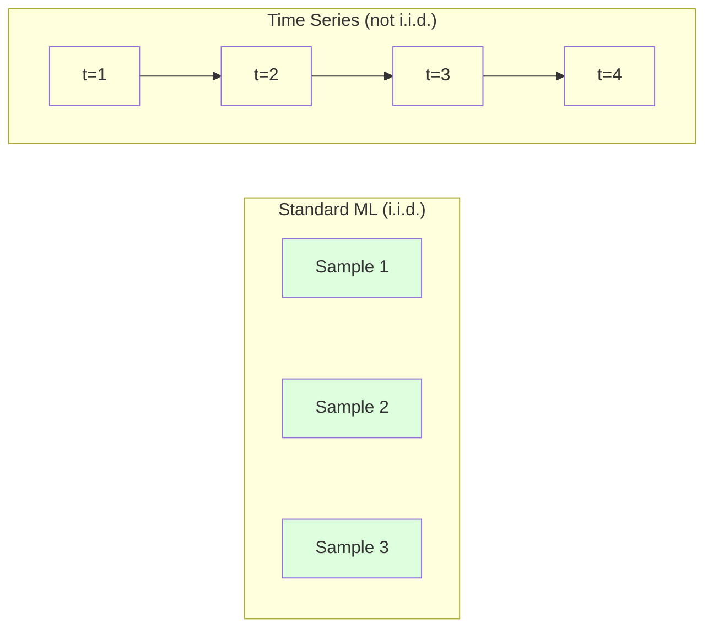
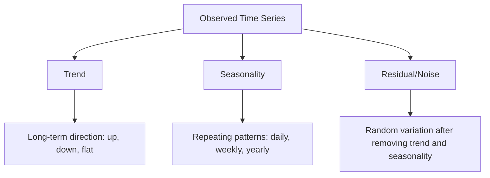
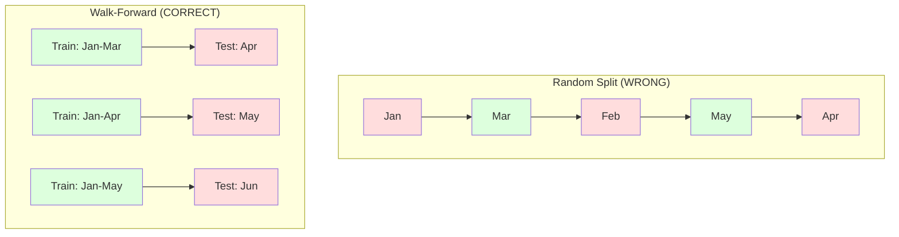

<!-- i18n:manual -->
# Основы временных рядов

> Прошлые результаты действительно предсказывают будущие -- если сначала проверить стационарность.

**Type:** Build
**Language:** Python
**Prerequisites:** Phase 2, Lessons 01-09
**Time:** ~90 minutes

## Learning Objectives

- Разложить временной ряд на тренд, сезонность и остаток и проверить его на стационарность
- Построить lag-признаки и скользящие статистики, чтобы превратить ряд в обычную задачу обучения с учителем
- Собрать walk-forward валидацию, которая не пускает будущие данные в обучение
- Объяснить, почему случайное разбиение на train/test не годится для временных рядов, и показать разрыв в качестве по сравнению с корректным разбиением по времени

> 🎒 **На пальцах.** Временной ряд — это дневник: записи идут по датам, и порядок нельзя перемешивать. Весь урок про одно: как учиться на прошлом, ни разу не подсмотрев в будущее.

## The Problem

У вас есть данные, упорядоченные по времени. Продажи по дням, температура по часам, загрузка CPU по минутам, котировки по неделям. Вы хотите предсказать следующее значение, следующую неделю, следующий квартал.

Вы берёте привычный ML-набор: случайное разбиение на train/test, кросс-валидация, матрица признаков на вход, предсказание на выход. Каждый шаг здесь неверен.

Временные ряды нарушают предположения, на которых держится обычный ML. Наблюдения не независимы: сегодняшняя температура зависит от вчерашней. Случайное разбиение протаскивает информацию из будущего в прошлое. Признаки, которые отлично выглядят на бэктесте, проваливаются в проде, потому что опираются на закономерности, которые со временем меняются.

Модель, которая даёт 95% точности на случайной кросс-валидации, может дать 55% при честной оценке по времени. Это не формальность. Это разница между моделью, которая работает на бумаге, и моделью, которая работает в проде.

Урок разбирает базу: чем данные со временем отличаются от обычных, как честно оценивать модели и как превратить ряд в признаки, понятные любой стандартной ML-модели.

> 🎒 **На пальцах.** Представьте контрольную, где вы «случайно» разрешили себе заглянуть в ответы на пару задач. Оценка выйдет 95, знания — 55. Случайное разбиение временного ряда делает ровно это: часть будущих дней попадает в обучение, и модель как будто подглядела ответ.

## The Concept

### What Makes Time Series Different

Обычный ML предполагает i.i.d. -- независимые и одинаково распределённые наблюдения. Каждый пример взят из одного и того же распределения, независимо от остальных. Временной ряд нарушает оба условия:

- **Not independent.** Сегодняшняя цена акции зависит от вчерашней. Продажи этой недели коррелируют с прошлой.
- **Not identically distributed.** Распределение сдвигается со временем. Продажи в декабре выглядят не так, как в марте.

Эти нарушения не мелочь. Они меняют то, как вы строите признаки, как оцениваете модели и какие алгоритмы вообще работают.



В обычном ML наблюдения взаимозаменяемы. Перемешайте их — ничего не изменится. Во временном ряде порядок решает всё. Перемешивание уничтожает сигнал.

### Components of a Time Series

Любой временной ряд — это комбинация трёх вещей:



- **Trend**: Долгосрочное направление. Выручка растёт на 10% в год. Средняя температура планеты повышается.
- **Seasonality**: Повторяющиеся паттерны с фиксированным периодом. Розничные продажи взлетают в декабре. Кондиционеры работают на максимум в июле.
- **Residual**: Всё, что осталось после вычитания тренда и сезонности. Если остаток похож на белый шум, разложение поймало сигнал.

> 🎒 **На пальцах.** Продажи мороженого: тренд — город растёт, продают всё больше год от года. Сезонность — летом в разы больше, чем зимой. Остаток — в среду шёл дождь, и купили меньше обычного. Если после вычитания первых двух остаётся только «дождь по средам», разложение сделано правильно.

### Stationarity

Ряд стационарен, если его статистические свойства (среднее, дисперсия, автокорреляция) не меняются со временем. Большинство методов прогнозирования предполагают стационарность.

**Why it matters:** У нестационарного ряда среднее уплывает. Модель, обученная на январских данных, выучила не то среднее, которое покажет февраль. Она будет ошибаться систематически.

**How to check:** Посчитайте скользящее среднее и скользящее стандартное отклонение по окнам. Если они уплывают, ряд нестационарен.

**How to fix:** Взятие разностей (differencing). Вместо самих значений моделируйте изменение между соседними:

```
diff[t] = value[t] - value[t-1]
```

Если одного прохода не хватило, примените ещё раз (разности второго порядка). Реальным рядам почти никогда не нужно больше двух.

**Example:**

Исходный ряд: [100, 102, 106, 112, 120]
Первая разность:  [2, 4, 6, 8] (всё ещё растёт)
Вторая разность:  [2, 2, 2] (постоянна -- стационарно)

У исходного ряда был квадратичный тренд. Первая разность превратила его в линейный. Вторая сделала ряд плоским. На практике больше двух проходов нужно редко.

**Formal test:** Расширенный тест Дики-Фуллера (ADF) -- стандартный статистический тест на стационарность. Нулевая гипотеза: «ряд нестационарен». P-значение ниже 0.05 позволяет отвергнуть нулевую гипотезу и считать ряд стационарным. Мы не пишем ADF с нуля (нужны таблицы асимптотических распределений), но скользящие статистики в нашем коде дают практичную визуальную проверку.

> 🎒 **На пальцах.** Посчитайте разности руками: 102 − 100 = 2, 106 − 102 = 4, 112 − 106 = 6, 120 − 112 = 8. Ряд [2, 4, 6, 8] всё ещё растёт, берём разности ещё раз: 4 − 2 = 2, 6 − 4 = 2, 8 − 6 = 2. Получили ровную двойку — рост стал предсказуемым. Это как перейти от «сколько метров я прошёл» к «с какой скоростью иду»: скорость может быть постоянной, даже когда расстояние всё время растёт.

### Autocorrelation

Автокорреляция показывает, насколько значение в момент t связано со значением в момент t-k (на k шагов раньше). Функция автокорреляции (ACF) рисует эту связь для каждого лага k.

**ACF tells you:**
- Насколько далеко ряд «помнит». Если ACF падает до нуля после лага 5, значения старше 5 шагов не нужны.
- Есть ли сезонность. Если ACF даёт всплеск на лаге 12 (месячные данные), значит есть годовая сезонность.
- Сколько lag-признаков создавать. Берите лаги до тех пор, пока ACF не станет пренебрежимо малой.

**PACF (Partial Autocorrelation Function)** убирает косвенные связи. Если сегодня коррелирует с позавчера только потому, что оба коррелируют со вчера, PACF на лаге 3 будет нулевой, а ACF — нет.

### Lag Features: Turning Time Series into Supervised Learning

Обычным ML-моделям нужна матрица признаков X и цель y. Временной ряд даёт один столбец чисел. Мостом служат lag-признаки.

Возьмём ряд [10, 12, 14, 13, 15] и построим признаки lag-1 и lag-2:

| lag_2 | lag_1 | target |
|-------|-------|--------|
| 10    | 12    | 14     |
| 12    | 14    | 13     |
| 14    | 13    | 15     |

Теперь перед вами обычная задача регрессии. Любая ML-модель (линейная регрессия, random forest, градиентный бустинг) может предсказать цель по лагам.

Что ещё можно добавить:
- **Rolling statistics:** среднее, std, минимум, максимум по последним k значениям
- **Calendar features:** день недели, месяц, is_holiday, is_weekend
- **Differenced values:** изменение относительно предыдущего шага
- **Expanding statistics:** накопленное среднее, накопленная сумма
- **Ratio features:** текущее значение / скользящее среднее (насколько далеко от недавнего уровня)
- **Interaction features:** lag_1 * day_of_week (влияние дня недели на инерцию)

**How many lags?** Смотрите на функцию автокорреляции. Если ACF значима до лага 10, берите минимум 10 лагов. Если есть недельная сезонность, обязательно включите лаг 7 (возможно, и 14). Больше лагов — больше истории для модели, но и больше признаков, а значит выше риск переобучения.

**The target alignment trap.** При построении lag-признаков цель — это значение в момент t, а все признаки должны быть из момента t-1 или раньше. Если вы случайно включили значение в момент t как признак, у вас идеальный предсказатель и совершенно бесполезная модель. Это самая частая ошибка в feature engineering для временных рядов.

> 🎒 **На пальцах.** Посмотрите на первую строку таблицы: признаки 10 и 12, цель 14. Модель видит позавчера и вчера, угадывает сегодня. А теперь представьте, что вы по ошибке положили 14 ещё и в признаки — модель «предскажет» идеально и на реальных данных развалится, потому что завтрашнего числа завтра ещё нет.

### Walk-Forward Validation

Это главная идея урока. Обычная k-fold кросс-валидация раскидывает наблюдения по фолдам случайно. Для временного ряда это утечка будущего.



Walk-forward валидация:
1. Обучаемся на данных до момента t
2. Предсказываем момент t+1 (или с t+1 по t+k для многошагового прогноза)
3. Сдвигаем окно вперёд
4. Повторяем

В каждом тестовом фолде лежат только те данные, которые идут после всех обучающих. Утечки будущего нет. Так вы получаете честную оценку того, как модель поведёт себя в проде.

**Expanding window** использует для обучения всю историю (окно растёт). **Sliding window** держит обучающее окно фиксированной длины (окно едет вперёд). Расширяющееся окно — когда старые данные всё ещё актуальны. Скользящее — когда мир меняется и старые данные вредят.

> 🎒 **На пальцах.** Учитель проверяет вас честно: объяснил темы за сентябрь — спросил за октябрь, объяснил ещё и октябрь — спросил за ноябрь. Никогда не спрашивает то, что уже разобрали на этом же уроке. Схема на картинке слева (Jan, Mar, Feb, May, Apr) — это как раз нечестная проверка: март попал в обучение раньше февраля.

### ARIMA Intuition

ARIMA — классическая модель временных рядов. У неё три части:

- **AR (Autoregressive):** Предсказание по прошлым значениям. AR(p) использует последние p значений.
- **I (Integrated):** Разности для достижения стационарности. I(d) применяет d проходов взятия разностей.
- **MA (Moving Average):** Предсказание по прошлым ошибкам прогноза. MA(q) использует последние q ошибок.

ARIMA(p, d, q) объединяет всё три. Значения p, d, q выбирают по анализу ACF/PACF или автоматическим перебором (auto-ARIMA).

Мы не будем писать ARIMA с нуля -- там нужна численная оптимизация, которая выходит за рамки урока. Важно понимать, за что отвечает каждая часть: тогда вы сможете читать результаты ARIMA и понимать, когда её применять.

> 🎒 **На пальцах.** ARIMA(2, 1, 1) читается так: смотрю на два последних значения (AR=2), работаю не с самими числами, а с их изменениями (I=1), и подправляю прогноз с учётом одной последней ошибки (MA=1). Последняя часть — как ученик, который вчера недооценил задачу и сегодня закладывает поправку.

### When to Use What

| Approach | Best For | Handles Seasonality | Handles External Features |
|----------|---------|-------------------|------------------------|
| Lag-признаки + ML | Табличные данные с внешними признаками | Через календарные признаки | Да |
| ARIMA | Один одномерный ряд, короткий горизонт | Вариант SARIMA | Нет (ARIMAX ограниченно) |
| Экспоненциальное сглаживание | Простой тренд + сезонность | Да (Holt-Winters) | Нет |
| Prophet | Бизнес-прогнозы, праздники | Да (ряды Фурье) | Ограниченно |
| Нейросети (LSTM, Transformer) | Длинные последовательности, много рядов | Выучивается сама | Да |

Для большинства практических задач lag-признаки плюс градиентный бустинг — самая сильная стартовая точка. Внешние признаки подключаются естественно, стационарность не требуется, отлаживать легко.

### Forecasting Horizons and Strategies

Одношаговый прогноз предсказывает один шаг вперёд. Многошаговый — несколько. Стратегий три:

**Recursive (iterated):** Предсказать один шаг, подставить предсказание как вход для следующего. Просто, но ошибки накапливаются: каждое предсказание опирается на предыдущее, и промахи умножаются.

**Direct:** Обучить отдельную модель на каждый горизонт. Модель-1 предсказывает t+1, модель-5 предсказывает t+5. Ошибки не накапливаются, но у каждой модели меньше обучающих примеров и они не делятся информацией.

**Multi-output:** Одна модель выдаёт сразу все горизонты. Информация делится между горизонтами, но нужна модель с несколькими выходами (или своя функция потерь).

На практике начинайте с recursive для коротких горизонтов (1-5 шагов) и с direct для длинных.

### Common Mistakes in Time Series

| Mistake | Why it happens | How to fix |
|---------|---------------|-----------|
| Случайное разбиение train/test | Привычка из обычного ML | Использовать walk-forward или разбиение по времени |
| Признаки из будущего | Значение в момент t попало в признаки по недосмотру | Проверять каждый признак на временное выравнивание |
| Переобучение на сезонность | Модель заучивает календарь | Держать в тесте целый сезонный цикл |
| Игнорирование смены масштаба | Выручка удвоилась, а паттерны те же | Моделировать процентное изменение, а не абсолютное |
| Слишком много lag-признаков | «Чем больше истории, тем лучше» | Определять нужные лаги по ACF |
| Отказ от разностей | «Модель сама разберётся» | Деревья справляются с трендом, линейным моделям нужна стационарность |

```figure
f3-series-decompose
```

## Build It

Код в `code/time_series.py` реализует основные кирпичики с нуля.

### Lag Feature Creator

```python
def make_lag_features(series, n_lags):
    n = len(series)
    X = np.full((n, n_lags), np.nan)
    for lag in range(1, n_lags + 1):
        X[lag:, lag - 1] = series[:-lag]
    valid = ~np.isnan(X).any(axis=1)
    return X[valid], series[valid]
```

Функция превращает одномерный ряд в матрицу признаков: в каждой строке последние `n_lags` значений как признаки и текущее значение как цель.

> 🎒 **На пальцах.** Строка `X[lag:, lag - 1] = series[:-lag]` — это просто сдвиг ряда вниз на `lag` позиций. Сверху остаются дырки (`nan`): для самых первых наблюдений истории ещё нет. Их выбрасывает `valid`. Поэтому при 10 лагах и ряде из 100 точек обучаться вы будете на 90 строках, а не на 100.

### Walk-Forward Cross-Validation

```python
def walk_forward_split(n_samples, n_splits=5, min_train=50):
    assert min_train < n_samples, "min_train must be less than n_samples"
    step = max(1, (n_samples - min_train) // n_splits)
    for i in range(n_splits):
        train_end = min_train + i * step
        test_end = min(train_end + step, n_samples)
        if train_end >= n_samples:
            break
        yield slice(0, train_end), slice(train_end, test_end)
```

Каждое разбиение гарантирует, что обучающие данные идут строго раньше тестовых. Обучающее окно растёт с каждым фолдом.

> 🎒 **На пальцах.** Подставьте числа: 250 наблюдений, 5 фолдов, минимум 50 на обучение. Тогда `step = (250 − 50) // 5 = 40`. Первый фолд: учимся на строках 0-49, проверяемся на 50-89. Второй: учимся на 0-89, проверяемся на 90-129. Обучающая часть каждый раз растёт на 40, а тест всегда лежит справа от неё.

### Simple Autoregressive Model

Чистая AR-модель — это линейная регрессия на lag-признаках:

```python
class SimpleAR:
    def __init__(self, n_lags=5):
        self.n_lags = n_lags
        self.weights = None
        self.bias = None

    def fit(self, series):
        X, y = make_lag_features(series, self.n_lags)
        # Solve via normal equations
        X_b = np.column_stack([np.ones(len(X)), X])
        theta = np.linalg.lstsq(X_b, y, rcond=None)[0]
        self.bias = theta[0]
        self.weights = theta[1:]
        return self
```

Концептуально это та же линейная регрессия из урока 02, только применённая к сдвинутым во времени копиям одной и той же переменной.

> 🎒 **На пальцах.** Модель ищет формулу вида «завтра ≈ 0.6 × сегодня + 0.3 × вчера + 0.1 × позавчера + постоянная». Веса подбирает `lstsq`, а `np.ones` в первом столбце — это тот самый свободный член. Никакой магии: обычная линейная регрессия, у которой все признаки взяты из прошлого того же ряда.

### Stationarity Check

Код считает скользящие статистики, чтобы оценить стационарность и на глаз, и численно:

```python
def check_stationarity(series, window=50):
    rolling_mean = np.array([
        series[max(0, i - window):i].mean()
        for i in range(1, len(series) + 1)
    ])
    rolling_std = np.array([
        series[max(0, i - window):i].std()
        for i in range(1, len(series) + 1)
    ])
    return rolling_mean, rolling_std
```

Если скользящее среднее уплывает или скользящее std меняется, ряд нестационарен. Возьмите разности и проверьте снова.

Код также сравнивает первую и вторую половины ряда. Если средние различаются больше чем на половину стандартного отклонения или отношение дисперсий превышает 2, ряд помечается как нестационарный.

> 🎒 **На пальцах.** Это как измерить средний рост учеников в первой половине класса и во второй. Если 150 см против 152 см — всё ровно, ряд стационарен. Если 150 см против 175 см — что-то системно меняется, и модель, обученная на первой половине, будет постоянно занижать.

### Autocorrelation

```python
def autocorrelation(series, max_lag=20):
    n = len(series)
    mean = series.mean()
    var = series.var()
    acf = np.zeros(max_lag + 1)
    for k in range(max_lag + 1):
        cov = np.mean((series[:n-k] - mean) * (series[k:] - mean))
        acf[k] = cov / var if var > 0 else 0
    return acf
```

> 🎒 **На пальцах.** При `k = 0` ряд сравнивается сам с собой, поэтому `acf[0]` всегда равен 1. Дальше значения обычно падают. Если у ежедневных данных виден всплеск на `acf[7]`, значит понедельники похожи на понедельники — это недельная сезонность, и лаг 7 стоит взять в признаки.

## Use It

В sklearn lag-признаки подаются напрямую в любой регрессор:

```python
from sklearn.linear_model import Ridge
from sklearn.ensemble import GradientBoostingRegressor

X, y = make_lag_features(series, n_lags=10)

for train_idx, test_idx in walk_forward_split(len(X)):
    model = Ridge(alpha=1.0)
    model.fit(X[train_idx], y[train_idx])
    predictions = model.predict(X[test_idx])
```

Для ARIMA используйте statsmodels:

```python
from statsmodels.tsa.arima.model import ARIMA

model = ARIMA(train_series, order=(5, 1, 2))
fitted = model.fit()
forecast = fitted.forecast(steps=30)
```

Код в `time_series.py` показывает оба подхода и сравнивает их через walk-forward валидацию.

### sklearn TimeSeriesSplit

В sklearn есть `TimeSeriesSplit` — готовая реализация walk-forward валидации:

```python
from sklearn.model_selection import TimeSeriesSplit

tscv = TimeSeriesSplit(n_splits=5)
for train_index, test_index in tscv.split(X):
    X_train, X_test = X[train_index], X[test_index]
    y_train, y_test = y[train_index], y[test_index]
    model.fit(X_train, y_train)
    score = model.score(X_test, y_test)
```

Это эквивалент нашего `walk_forward_split`, но встроенный в механику кросс-валидации sklearn. Его можно передать в `cross_val_score`:

```python
from sklearn.model_selection import cross_val_score

scores = cross_val_score(model, X, y, cv=TimeSeriesSplit(n_splits=5))
print(f"Mean score: {scores.mean():.4f} +/- {scores.std():.4f}")
```

### Evaluation Metrics

Для прогнозов используют метрики регрессии, но с поправкой на время:

- **MAE (Mean Absolute Error):** Среднее от |y_true - y_pred|. Легко читается в исходных единицах: «в среднем прогноз ошибается на 3.2 градуса».
- **RMSE (Root Mean Squared Error):** Корень из среднеквадратичной ошибки. Наказывает крупные промахи сильнее, чем MAE. Берите, когда один большой промах хуже многих мелких.
- **MAPE (Mean Absolute Percentage Error):** Среднее от |ошибка / истинное значение| * 100. Не зависит от масштаба, удобно сравнивать разные ряды. Но не определена там, где истинное значение равно нулю.
- **Naive baseline comparison:** Всегда сравнивайте с простыми базовыми прогнозами. Сезонный наивный прогноз просто повторяет значение периодом раньше (вчера, неделю назад). Если модель не бьёт наивный прогноз, что-то не так.

> 🎒 **На пальцах.** Разница между MAE и RMSE на пальцах: ошибки 1, 1, 1 и 9 дают MAE = (1+1+1+9)/4 = 3, а RMSE = корень из (1+1+1+81)/4 = корень из 21 ≈ 4.58. RMSE выше, потому что девятка возводится в квадрат. Если один большой промах для вас страшнее четырёх маленьких — смотрите на RMSE.

### Rolling Features

Код показывает, как добавить к lag-признакам скользящие статистики (среднее, std, минимум, максимум по окнам 7 и 14 дней). Они дают модели информацию о недавнем тренде и волатильности, которой в одних лагах нет.

Например, если скользящее среднее растёт, это признак восходящего тренда. Если растёт скользящее std, растёт волатильность. Такие закономерности деревья умеют использовать, а линейные модели — нет.

## Ship It

Урок производит:
- `outputs/prompt-time-series-advisor.md` -- промпт для постановки задач по временным рядам
- `code/time_series.py` -- lag-признаки, walk-forward валидация, AR-модель, проверки стационарности

### Baselines You Must Beat

Прежде чем строить модель, зафиксируйте базовые прогнозы:

1. **Last value (persistence).** Предсказываем, что завтра будет как сегодня. Для многих рядов это на удивление трудно перебить.
2. **Seasonal naive.** Предсказываем, что сегодня будет как в тот же день на прошлой неделе (или в прошлом году). Если модель это не бьёт, она не выучила ничего, кроме сезонности.
3. **Moving average.** Предсказываем среднее последних k значений. Сглаживает шум, но не ловит резкие изменения.

Если ваша навороченная ML-модель проигрывает сезонному наивному прогнозу — у вас баг. Чаще всего это утечка будущего в признаках, неверный метод оценки или ряд действительно случаен и непредсказуем.

> 🎒 **На пальцах.** Наивный прогноз погоды «завтра будет как сегодня» угадывает примерно в 70% случаев. Это и есть планка. Модель с точностью 65% — не «неплохо для первой попытки», а хуже, чем вообще ничего не делать.

### Practical Tips

1. **Start with plotting.** До всякого моделирования нарисуйте сырой ряд. Ищите тренды, сезонность, выбросы, структурные сдвиги (резкие изменения поведения). Тридцать секунд взгляда на график часто дают больше, чем час автоматического анализа.

2. **Difference first, model second.** Если у ряда явный тренд, возьмите разности до построения lag-признаков. Деревья с трендом справляются, линейные модели — нет, а разности никогда не вредят.

3. **Hold out at least one full seasonal cycle.** Есть недельная сезонность — тесту нужна минимум полная неделя. Месячная — минимум полный месяц. Иначе вы просто не сможете проверить, поймала ли модель сезонный паттерн.

4. **Monitor in production.** Модели временных рядов деградируют по мере изменения мира. Следите за ошибками прогнозов в скользящем окне. Ошибки поползли вверх — переобучайте на свежих данных.

5. **Beware of regime changes.** Модель, обученная на допандемийных данных, не предскажет постпандемийное поведение. Добавляйте признаки-индикаторы известных сдвигов режима или используйте скользящее окно, которое забывает старое.

6. **Log-transform skewed series.** Выручка, цены и счётчики обычно скошены вправо. Логарифм стабилизирует дисперсию и превращает мультипликативные паттерны в аддитивные, с которыми линейные модели умеют работать. Прогнозируйте в логарифмах, потом возводите в экспоненту обратно.

## Exercises

1. **Stationarity experiment.** Сгенерируйте ряд с линейным трендом. Проверьте стационарность по скользящим статистикам. Возьмите первую разность. Проверьте снова. Сколько раз придётся брать разности для квадратичного тренда?

2. **Lag selection.** Посчитайте ACF на сезонном ряде (период 7). У каких лагов автокорреляция самая высокая? Постройте lag-признаки только по этим лагам (не по подряд идущим). Стало ли точнее, чем с лагами с 1 по 7?

3. **Walk-forward vs random split.** Обучите Ridge-регрессию на lag-признаках. Оцените её случайным разбиением 80/20 и walk-forward валидацией. Насколько случайное разбиение завышает качество?

4. **Feature engineering.** Добавьте к lag-признакам скользящее среднее (окно 7), скользящее std (окно 7) и день недели. Сравните точность с этими признаками и без них через walk-forward валидацию.

5. **Multi-step forecasting.** Переделайте AR-модель так, чтобы она предсказывала на 5 шагов вперёд, а не на 1. Сравните две стратегии: (a) предсказать шаг и подставить предсказание на вход следующему (recursive) и (b) обучить отдельные модели на каждый горизонт (direct). Какая точнее?

> 🎒 **На пальцах.** Подсказка к заданию 1: линейному тренду хватает одной разности, квадратичному нужны две. Проверьте на ряде 1, 4, 9, 16, 25 (квадраты): первые разности 3, 5, 7, 9, вторые — 2, 2, 2. Ровно тот же ответ, что и в примере выше.

## Key Terms

| Term | What people say | What it actually means |
|------|----------------|----------------------|
| Stationarity | «Статистики не меняются со временем» | Ряд, у которого среднее, дисперсия и структура автокорреляции постоянны во времени |
| Differencing | «Вычесть соседние значения» | Вычисление y[t] - y[t-1], чтобы убрать тренд и получить стационарность |
| Autocorrelation (ACF) | «Как ряд коррелирует сам с собой» | Корреляция ряда со своей сдвинутой копией как функция величины сдвига |
| Partial autocorrelation (PACF) | «Только прямая связь» | Автокорреляция на лаге k после удаления влияния всех более коротких лагов |
| Lag features | «Прошлые значения как входы» | Использование y[t-1], y[t-2], ..., y[t-k] как признаков для предсказания y[t] |
| Walk-forward validation | «Кросс-валидация с уважением ко времени» | Оценка, при которой обучающие данные всегда хронологически предшествуют тестовым |
| ARIMA | «Классическая модель временных рядов» | AutoRegressive Integrated Moving Average: сочетает прошлые значения (AR), разности (I) и прошлые ошибки (MA) |
| Seasonality | «Повторяющиеся календарные паттерны» | Регулярные предсказуемые циклы в ряде, привязанные к календарю (день, неделя, год) |
| Trend | «Долгосрочное направление» | Устойчивый рост или спад уровня ряда во времени |
| Expanding window | «Использовать всю историю» | Walk-forward валидация, где обучающая выборка растёт с каждым фолдом |
| Sliding window | «История фиксированной длины» | Walk-forward валидация, где обучающая выборка — окно фиксированной длины, едущее вперёд |

## Further Reading

- [Hyndman and Athanasopoulos, Forecasting: Principles and Practice (3rd ed.)](https://otexts.com/fpp3/) -- лучший бесплатный учебник по прогнозированию временных рядов
- [scikit-learn Time Series Split](https://scikit-learn.org/stable/modules/generated/sklearn.model_selection.TimeSeriesSplit.html) -- walk-forward сплиттер из sklearn
- [statsmodels ARIMA docs](https://www.statsmodels.org/stable/generated/statsmodels.tsa.arima.model.ARIMA.html) -- реализация ARIMA с диагностикой
- [Makridakis et al., The M5 Competition (2022)](https://www.sciencedirect.com/science/article/pii/S0169207021001874) -- крупное соревнование по прогнозированию, сравнение ML-методов со статистическими
