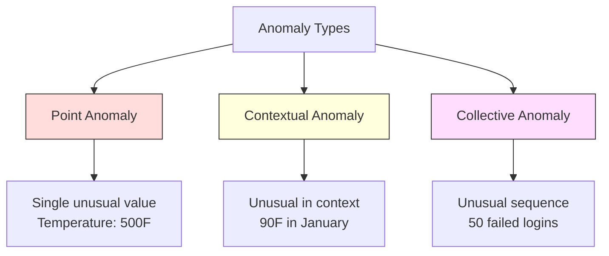
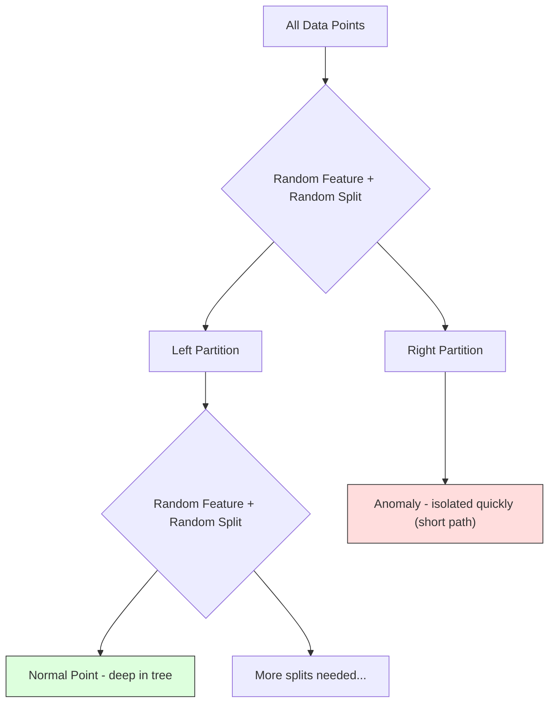
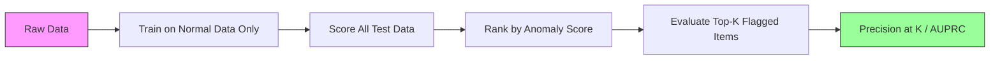

<!-- i18n:manual -->
# Обнаружение аномалий

> Норму описать легко. Аномалия — это всё, что в неё не вписалось.

**Type:** Build
**Language:** Python
**Prerequisites:** Phase 2, Lessons 01-09
**Time:** ~75 minutes

## Learning Objectives

- Реализовать с нуля обнаружение аномалий через Z-score, IQR и Isolation Forest
- Различать точечные, контекстные и коллективные аномалии и подбирать подходящий метод для каждого типа
- Объяснить, почему задачу ставят как моделирование нормы, а не как классификацию аномалий
- Сравнить обучение без учителя с обычной классификацией и оценить компромисс между охватом новых аномалий и точностью

> 🎒 **На пальцах.** Никто не может показать вам все виды подделок, которые придумают завтра. Зато можно очень хорошо выучить, как выглядит настоящая купюра. Весь урок построен на этой перестановке.

## The Problem

Картой расплатились в Нью-Йорке в 14:00, а в 14:05 — в Токио. Датчик на заводе показывает 150 градусов при норме 80-120. Сервер шлёт 50 000 запросов в секунду при среднесуточных 200.

Это аномалии. Находить их важно. Мошенничество стоит миллиарды. Отказы оборудования стоят простоя. Взломы сети стоят данных.

Сложность в том, что размеченных примеров аномалий почти никогда нет. Мошенничество — 0.1% транзакций. Отказы оборудования случаются пару раз в год. Обучить обычный классификатор невозможно: в классе «аномалия» просто нечему учиться. И даже если разметка есть, увиденные аномалии — не единственные, с которыми вы столкнётесь. Завтрашняя схема мошенничества не похожа на сегодняшнюю.

Обнаружение аномалий переворачивает задачу. Вместо того чтобы учить, что ненормально, учим, что нормально. Всё, что отклоняется от нормы, подозрительно. Это работает без разметки, подхватывает новые типы аномалий и масштабируется на огромные данные.

> 🎒 **На пальцах.** Мама узнаёт, что вы приболели, не потому, что помнит все болезни на свете, а потому, что знает вас обычного. Отклонение видно даже без диагноза. Модель делает то же самое: выучивает «обычного вас» и поднимает флаг на отклонение.

## The Concept

### Types of Anomalies

Аномалии бывают разные:

- **Point anomalies.** Одна точка, странная сама по себе, вне всякого контекста. Показание термометра 500 градусов. Покупка на $50 000 со счёта, где обычно тратят $50.
- **Contextual anomalies.** Точка, странная именно в своём контексте. 90 градусов по Фаренгейту нормальны летом и аномальны зимой. Значение то же, контекст другой.
- **Collective anomalies.** Последовательность точек, странная как группа, хотя каждая точка по отдельности нормальна. Пять неудачных входов — норма. Пятьдесят подряд — брутфорс.

Большинство методов ловит точечные аномалии. Для контекстных нужны признаки времени или места. Для коллективных — методы, понимающие последовательности.



> 🎒 **На пальцах.** Три типа на школьном примере. Точечная: ученик получил 100 баллов из 50 возможных — явная ошибка. Контекстная: тройка сама по себе нормальна, но не у отличника, у которого весь год пятёрки. Коллективная: один пропуск урока — ничего, десять подряд — что-то случилось.

### The Unsupervised Framing

В обычной классификации разметка есть для обоих классов. В обнаружении аномалий обычно бывает одна из трёх ситуаций:

1. **Fully unsupervised.** Разметки нет вообще. Детектор обучают на всех данных и надеются, что аномалий достаточно мало, чтобы не испортить модель «нормы».
2. **Semi-supervised.** Есть чистый набор только из нормальных данных. Обучаемся на нём и оцениваем всё остальное. Если такое возможно, это самый сильный вариант.
3. **Weakly supervised.** Есть несколько размеченных аномалий. Используйте их для оценки, а не для обучения. Обучаемся без учителя, потом меряем precision/recall на размеченном куске.

Ключевая мысль: обнаружение аномалий принципиально отличается от классификации. Вы моделируете распределение нормальных данных, а не границу между двумя классами.

### Supervised vs Unsupervised: The Tradeoff

Если размеченные аномалии всё-таки есть, использовать их для обучения (классификация с учителем) или только для оценки (детектор без учителя)?

**Supervised (treat as classification):**
- Ловит ровно те типы аномалий, которые уже видели
- Выше точность на известных типах
- Полностью пропускает новые типы
- Требует переобучения при появлении новых типов
- Нужно достаточно примеров аномалий (а их обычно слишком мало)

**Unsupervised (model normal, flag deviations):**
- Ловит любое отклонение от нормы, включая новые типы
- Не требует размеченных аномалий
- Больше ложных срабатываний (не всё необычное — плохое)
- Устойчивее к сдвигу распределения

На практике лучшие системы совмещают оба подхода: детектор без учителя для широкого охвата, модели с учителем для известных приоритетных типов и ручная проверка спорных случаев.

### Z-Score Method

Самый простой подход. Считаем среднее и стандартное отклонение каждого признака. Помечаем точку, если она дальше k стандартных отклонений от среднего.

```text
z_score = (x - mean) / std
anomaly if |z_score| > threshold
```

Порог по умолчанию — 3.0 (для нормального распределения 99.7% данных лежит в пределах трёх стандартных отклонений).

**Strengths:** Просто. Быстро. Понятно человеку («это значение на 4.5 сигмы отклоняется от нормы»).

**Weaknesses:** Предполагает нормальное распределение. Чувствителен к выбросам в обучающих данных (выбросы сдвигают среднее и раздувают std, из-за чего сами становятся менее заметными). Проваливается на многомодальных распределениях.

**When it works well:** Мониторинг одного показателя, распределение которого примерно колоколообразное. Время ответа сервера, производственные допуски, показания датчиков со стабильной базой.

**When it fails:** Данные из нескольких кластеров (два офиса с разной базовой температурой), скошенные данные (суммы транзакций, где $1000 редки, но не аномальны), обучающая выборка с выбросами.

> 🎒 **На пальцах.** Средний рост в классе 160 см, разброс (std) 10 см. Ученик ростом 195 см даёт z = (195 − 160) / 10 = 3.5, больше порога 3.0 — флаг. Ученик ростом 175 см даёт z = 1.5 — обычное дело. Вся формула — «на сколько разбросов ты отошёл от середины».

### IQR Method

Устойчивее Z-score. Использует межквартильный размах вместо среднего и стандартного отклонения.

```
Q1 = 25th percentile
Q3 = 75th percentile
IQR = Q3 - Q1
lower_bound = Q1 - factor * IQR
upper_bound = Q3 + factor * IQR
anomaly if x < lower_bound or x > upper_bound
```

Множитель по умолчанию — 1.5.

**Strengths:** Устойчив к выбросам (перцентили не реагируют на экстремальные значения). Работает на скошенных распределениях. Не требует нормальности.

**Weaknesses:** Только одномерный (применяется к каждому признаку отдельно). Не видит аномалий, которые проявляются лишь в сочетании признаков (точка может быть нормальной по каждому признаку и аномальной в их совместном пространстве).

**Practical note:** Множитель 1.5 в IQR соответствует «усам» на диаграмме размаха. Точки за усами — кандидаты в выбросы. Множитель 3.0 вместо 1.5 делает детектор консервативнее (меньше флагов, меньше ложных срабатываний). Правильное значение зависит от того, сколько ложных тревог вы готовы терпеть.

> 🎒 **На пальцах.** Возьмите зарплаты: Q1 = 40, Q3 = 80 тысяч, значит IQR = 40. Граница сверху: 80 + 1.5 × 40 = 140. Зарплата 200 тысяч — выброс, зарплата 130 — нет. Главное отличие от Z-score: один директор с миллионом не сдвинет квартили, а вот среднее сдвинет сильно.

### Isolation Forest

Ключевая мысль: аномалий мало и они другие. При случайном разбиении данных аномалию отделить проще — ей нужно меньше случайных разрезов, чтобы остаться в одиночестве.



**How it works:**
1. Строим много случайных деревьев (isolation forest)
2. В каждом узле берём случайный признак и случайное значение разреза между его минимумом и максимумом
3. Режем, пока каждая точка не окажется одна в своём листе
4. У аномалий средняя длина пути по всем деревьям короче

**Why it works:** Нормальные точки живут в плотных областях. Чтобы отделить одну от соседей, нужно много случайных разрезов. Аномалии живут в разреженных областях. Там хватает одного-двух разрезов.

Оценка аномальности строится на средней длине пути по всем деревьям, нормированной на ожидаемую длину пути в случайном двоичном дереве поиска:

```
score(x) = 2^(-average_path_length(x) / c(n))
```

Здесь `c(n)` — ожидаемая длина пути для n наблюдений. Значение около 1 означает аномалию. Около 0.5 — норму. Около 0 — очень нормальную точку (глубоко внутри плотного кластера).

**Strengths:** Никаких предположений о распределении. Работает в высокой размерности. Хорошо масштабируется (сублинейно по размеру выборки, потому что каждое дерево берёт подвыборку). Справляется со смешанными типами признаков.

**Weaknesses:** Плохо ловит аномалии внутри плотных областей (эффект маскировки). Случайные разрезы работают хуже, когда много ненужных признаков.

**Key hyperparameters:**
- `n_estimators`: Число деревьев. 100 обычно достаточно. Больше деревьев — стабильнее оценки, но медленнее счёт.
- `max_samples`: Число наблюдений на дерево. В оригинальной статье по умолчанию 256. Меньшие значения делают отдельные деревья менее точными, зато повышают разнообразие. Именно подвыборка делает Isolation Forest быстрым: каждое дерево видит малую долю данных.
- `contamination`: Ожидаемая доля аномалий. Влияет только на выбор порога. Сами оценки не меняет.

> 🎒 **На пальцах.** Игра «угадай человека» с вопросами наугад. Обычного школьника из класса вы будете отсеивать долго: таких же много. А единственного двухметрового рыжего отсечёт первый же случайный вопрос. Isolation Forest считает именно это число вопросов: мало вопросов — аномалия.

### Local Outlier Factor (LOF)

LOF сравнивает локальную плотность вокруг точки с плотностью вокруг её соседей. Точка в разреженной области, окружённая плотными областями, аномальна.

**How it works:**
1. Для каждой точки находим k ближайших соседей
2. Считаем локальную достижимую плотность (насколько плотно вокруг)
3. Сравниваем плотность точки с плотностью её соседей
4. Если у точки плотность заметно ниже, чем у соседей, это выброс

**LOF score:**
- LOF около 1.0 — плотность как у соседей (норма)
- LOF больше 1.0 — плотность ниже, чем у соседей (возможная аномалия)
- LOF заметно больше 1.0 (например, 2.0 и выше) — плотность существенно ниже (скорее всего аномалия)

Слово «локальный» здесь ключевое. Представьте набор из двух кластеров: плотный из 1000 точек и разреженный из 50. Точка на краю разреженного кластера не выглядит аномальной глобально — у неё 50 соседей. Но локально она аномальна, если её ближайшие соседи расположены плотнее, чем она сама. LOF ловит этот нюанс, который глобальные методы упускают.

**Strengths:** Находит локальные аномалии (точки, странные в своей окрестности, даже если глобально они не выделяются). Работает с кластерами разной плотности.

**Weaknesses:** Медленный на больших данных (O(n^2) в наивной реализации). Чувствителен к выбору k. Плохо работает в очень высокой размерности (проклятие размерности портит расстояния).

> 🎒 **На пальцах.** Дом на 20 соток посреди плотной застройки не аномален по площади участка — за городом такие все. Но локально он выбивается: у всех соседей по 6 соток. LOF смотрит именно на «а как у соседей», а не на «а как вообще по стране».

### Comparison

| Method | Assumptions | Speed | Handles High Dims | Detects Local Anomalies |
|--------|------------|-------|-------------------|------------------------|
| Z-score | Нормальное распределение | Очень быстро | Да (по каждому признаку) | Нет |
| IQR | Нет (по каждому признаку) | Очень быстро | Да (по каждому признаку) | Нет |
| Isolation Forest | Нет | Быстро | Да | Частично |
| LOF | Расстояние осмысленно | Медленно | Плохо | Да |

### Evaluation Challenges

Оценивать детекторы аномалий сложнее, чем классификаторы:

- **Extreme class imbalance.** При 0.1% аномалий модель, которая всегда отвечает «норма», даёт 99.9% точности. Accuracy бесполезна.
- **AUROC is misleading.** При сильном дисбалансе AUROC может выглядеть хорошо, даже если на практичных порогах модель пропускает большинство аномалий.
- **Better metrics:** Precision@k (сколько настоящих аномалий среди k помеченных), AUPRC (площадь под precision-recall кривой) и recall при фиксированной доле ложных срабатываний.



> 🎒 **На пальцах.** На миллион транзакций тысяча мошеннических. Модель «всё нормально» даёт 99.9% правильных ответов и ноль пойманных мошенников. Поэтому меряют иначе: взяли топ-100 самых подозрительных и спросили, сколько из них настоящие. Вот это Precision@100.

### Anomaly Detection Pipeline

На практике обнаружение аномалий устроено так:

1. **Collect baseline data.** В идеале — период, про который вы знаете, что аномалий там нет (или почти нет).
2. **Feature engineering.** Сырые признаки плюс производные (скользящие статистики, признаки времени, отношения).
3. **Train the detector.** Обучаемся на базовом периоде. Модель узнаёт, как выглядит «норма».
4. **Score new data.** Каждое новое наблюдение получает оценку аномальности.
5. **Threshold selection.** Выбираем отсечку. Это бизнес-решение: выше порог — меньше ложных тревог, но больше пропущенных аномалий.
6. **Alert and investigate.** Помеченные точки уходят человеку или в автоматическую реакцию.
7. **Feedback collection.** Записываем, оказалась ли тревога настоящей. По этим данным оцениваем детектор и со временем настраиваем порог.

Этот процесс никогда не «завершается». Распределения сдвигаются, появляются новые типы аномалий, пороги требуют подкрутки. Считайте детектор живой системой, а не разовой моделью.

```figure
f3-anomaly-fence
```

## Build It

Код в `code/anomaly_detection.py` реализует Z-score, IQR и Isolation Forest с нуля.

### Z-Score Detector

```python
def zscore_detect(X, threshold=3.0):
    mean = X.mean(axis=0)
    std = X.std(axis=0)
    std[std == 0] = 1.0
    z = np.abs((X - mean) / std)
    return z.max(axis=1) > threshold
```

Просто и векторизованно. Точка помечается, если хотя бы один её признак превысил порог.

> 🎒 **На пальцах.** Строка `std[std == 0] = 1.0` спасает от деления на ноль: если признак у всех одинаковый, разброс равен нулю и формула развалилась бы. А `z.max(axis=1)` означает «берём самый подозрительный признак строки» — достаточно одного странного показателя, чтобы поднять флаг.

### IQR Detector

```python
def iqr_detect(X, factor=1.5):
    q1 = np.percentile(X, 25, axis=0)
    q3 = np.percentile(X, 75, axis=0)
    iqr = q3 - q1
    iqr[iqr == 0] = 1.0
    lower = q1 - factor * iqr
    upper = q3 + factor * iqr
    outside = (X < lower) | (X > upper)
    return outside.any(axis=1)
```

### Isolation Forest from Scratch

Реализация с нуля строит isolation-деревья, случайно разрезающие пространство признаков:

```python
class IsolationTree:
    def __init__(self, max_depth):
        self.max_depth = max_depth

    def fit(self, X, depth=0):
        n, p = X.shape
        if depth >= self.max_depth or n <= 1:
            self.is_leaf = True
            self.size = n
            return self
        self.is_leaf = False
        self.feature = np.random.randint(p)
        x_min = X[:, self.feature].min()
        x_max = X[:, self.feature].max()
        if x_min == x_max:
            self.is_leaf = True
            self.size = n
            return self
        self.threshold = np.random.uniform(x_min, x_max)
        left_mask = X[:, self.feature] < self.threshold
        self.left = IsolationTree(self.max_depth).fit(X[left_mask], depth + 1)
        self.right = IsolationTree(self.max_depth).fit(X[~left_mask], depth + 1)
        return self
```

Длина пути до изоляции точки и определяет её оценку аномальности. Короче путь — аномальнее точка.

Класс `IsolationForest` оборачивает несколько деревьев:

```python
class IsolationForest:
    def __init__(self, n_estimators=100, max_samples=256, seed=42):
        self.n_estimators = n_estimators
        self.max_samples = max_samples

    def fit(self, X):
        sample_size = min(self.max_samples, X.shape[0])
        max_depth = int(np.ceil(np.log2(sample_size)))
        for _ in range(self.n_estimators):
            idx = rng.choice(X.shape[0], size=sample_size, replace=False)
            tree = IsolationTree(max_depth=max_depth)
            tree.fit(X[idx])
            self.trees.append(tree)

    def anomaly_score(self, X):
        avg_path = average path length across all trees
        scores = 2.0 ** (-avg_path / c(max_samples))
        return scores
```

Нормировка `c(n)` — это ожидаемая длина пути при неудачном поиске в двоичном дереве поиска с n элементами. Она равна `2 * H(n-1) - 2*(n-1)/n`, где `H` — гармоническое число. Благодаря этой нормировке оценки сопоставимы между наборами данных разного размера.

> 🎒 **На пальцах.** Проверьте глубину: при `max_samples = 256` получаем `max_depth = log2(256) = 8`. То есть дерево режет максимум восемь раз. Нормальная точка обычно доходит до самого низа, а аномалия отваливается на втором-третьем разрезе. Средний путь 2.5 против 8 — это и есть разница, которую превращает в оценку формула со степенью двойки.

### Demo Scenarios

Код генерирует несколько тестовых сценариев:

1. **Single cluster with outliers.** Двумерное гауссово облако с аномалиями, вброшенными далеко от центра. Здесь должны справиться все методы.
2. **Multimodal data.** Три кластера разного размера и плотности. Аномальны точки между кластерами. Z-score здесь буксует, потому что диапазоны отдельных признаков широкие.
3. **High-dimensional data.** 50 признаков, но аномалии отличаются только по пяти из них. Проверка, умеет ли метод найти аномалию в подмножестве признаков.

Каждый сценарий сравнивает все методы по precision, recall, F1 и Precision@k.

> 🎒 **На пальцах.** Второй сценарий объясняет главную слабость Z-score. Если один кластер около 10, а другой около 90, среднее выйдет примерно 50 — там, где точек как раз нет. Точка со значением 50 окажется «идеально нормальной» по Z-score, хотя на самом деле она в пустоте между кластерами.

## Use It

С sklearn (библиотечные реализации, не наши):

```python
from sklearn.ensemble import IsolationForest
from sklearn.neighbors import LocalOutlierFactor

iso = IsolationForest(n_estimators=100, contamination=0.05, random_state=42)
iso.fit(X_train)
predictions = iso.predict(X_test)

lof = LocalOutlierFactor(n_neighbors=20, contamination=0.05, novelty=True)
lof.fit(X_train)
predictions = lof.predict(X_test)
```

Параметр `contamination` задаёт ожидаемую долю аномалий. Задать его правильно важно: слишком мало — пропустите аномалии, слишком много — получите ложные тревоги.

Код в `anomaly_detection.py` сравнивает реализации с нуля с sklearn на одних и тех же данных.

### sklearn Contamination Parameter

Параметр `contamination` в sklearn задаёт порог, по которому непрерывные оценки аномальности превращаются в бинарные предсказания. Сами оценки он не меняет.

```python
iso_5 = IsolationForest(contamination=0.05)
iso_10 = IsolationForest(contamination=0.10)
```

Оба варианта дают одинаковые оценки аномальности. Но `iso_5` помечает верхние 5%, а `iso_10` — верхние 10%. Если истинная доля аномалий вам неизвестна (а так обычно и есть), ставьте contamination в "auto" и работайте прямо с сырыми оценками. Порог выбирайте сами, исходя из цены ложных срабатываний против цены пропусков.

> 🎒 **На пальцах.** Это как решить заранее, сколько человек в классе получат двойку. Оценки за контрольную от этого решения не изменятся — изменится только черта, ниже которой ставят двойку. Ставите 5% — двойку получат двое, ставите 10% — четверо.

### One-Class SVM

Ещё один детектор без учителя, который стоит знать. One-Class SVM строит границу вокруг нормальных данных в пространстве высокой размерности (через kernel trick).

```python
from sklearn.svm import OneClassSVM

oc_svm = OneClassSVM(kernel="rbf", gamma="auto", nu=0.05)
oc_svm.fit(X_train)
predictions = oc_svm.predict(X_test)
```

Параметр `nu` приблизительно задаёт долю аномалий. One-Class SVM хорош на маленьких и средних наборах данных, но не тянет очень большие: матрица ядра растёт квадратично.

### Autoencoder Approach (Preview)

Автокодировщики — нейросети, которые учатся сжимать и восстанавливать данные. Обучаем на нормальных данных. На тесте у аномалий высокая ошибка восстановления, потому что сеть научилась восстанавливать только нормальные паттерны.

Это тема Phase 3 (Deep Learning), но принцип тот же: моделируем норму, помечаем отклонения.

### Ensemble Anomaly Detection

Как ансамбли улучшают классификацию (урок 11), так и объединение нескольких детекторов улучшает обнаружение. Самый простой рецепт:

1. Прогнать несколько детекторов (Z-score, IQR, Isolation Forest, LOF)
2. Отнормировать оценки каждого к отрезку [0, 1]
3. Усреднить нормированные оценки
4. Помечать точки, у которых средняя оценка выше порога

Так снижается число ложных срабатываний, потому что у разных методов разные слабые места. Точка, помеченная всеми четырьмя, почти наверняка аномальна. Точка, помеченная одним, может быть просто причудой этого метода.

Более сложные ансамбли взвешивают детекторы по их надёжности (измеренной на валидационной выборке с известными аномалиями, если такая есть).

### Production Considerations

1. **Threshold drift.** Данные сдвигаются, и фиксированный порог устаревает. Следите за распределением оценок аномальности и периодически подкручивайте порог.
2. **Alert fatigue.** Много ложных тревог — и операторы перестают реагировать. Начинайте с высокого порога (меньше тревог, зато надёжнее) и снижайте его по мере роста доверия.
3. **Ensemble approach.** В проде комбинируйте детекторы. Помечайте точку, только если несколько методов согласны. Это заметно снижает долю ложных срабатываний.
4. **Feature engineering.** Сырых признаков редко хватает. Добавляйте скользящие статистики, отношения, время с последнего события и предметные признаки. Хороший набор признаков важнее выбора детектора.
5. **Feedback loop.** Когда оператор разбирает помеченный случай и подтверждает или отклоняет его, возвращайте это в систему. Со временем накопится разметка для оценки и улучшения детектора.

> 🎒 **На пальцах.** Пункт 2 — это басня про мальчика, который кричал «Волки!». Детектор, который срабатывает на всё подряд, через месяц просто перестают читать, и он становится бесполезным, даже если технически он точен.

## Ship It

Урок производит:
- `outputs/skill-anomaly-detector.md` -- навык для выбора подходящего детектора
- `code/anomaly_detection.py` -- Z-score, IQR и Isolation Forest с нуля, со сравнением с sklearn

### Choosing a Threshold

Оценка аномальности непрерывна. Чтобы принимать решения, нужен порог. Это решение бизнеса, а не техники.

Два сценария для сравнения:
- **Fraud detection.** Пропущенное мошенничество стоит дорого (чарджбэки, доверие клиентов). Ложная тревога стоит пяти минут работы аналитика. Ставьте порог низко, ловите больше, миритесь с ложными тревогами.
- **Equipment maintenance.** Ложная тревога — это лишняя остановка производства на $50 000. Пропущенный отказ — ремонт на $500 000. Порог подбирают так, чтобы уравновесить эти суммы.

В обоих случаях оптимальный порог зависит от соотношения цен ложного срабатывания и пропуска. Постройте precision и recall при разных порогах, наложите функцию издержек и возьмите точку минимума.

> 🎒 **На пальцах.** Посчитайте на числах: если пропуск стоит $500 000, а ложная тревога $50 000, то одна пойманная поломка окупает до десяти напрасных остановок. Значит порог надо опускать. Для мошенничества, где ложная тревога стоит пять минут аналитика, порог опускают ещё ниже.

### Scaling to Production

Для обнаружения аномалий в реальном времени:

1. **Batch training, online scoring.** Обучайте модель периодически (ежедневно, еженедельно) на свежих нормальных данных. Каждое новое наблюдение оценивайте на лету.
2. **Feature computation must match.** Если вы обучались на скользящих статистиках за 30 дней, для нового наблюдения нужны те же 30 дней истории. Держите нужную историю в буфере.
3. **Score distribution monitoring.** Следите за распределением оценок во времени. Если медиана ползёт вверх, значит либо данные меняются, либо модель устарела.
4. **Explainability.** Помечая аномалию, объясняйте почему. Z-score: «признак X на 4.2 стандартных отклонения выше нормы». Isolation Forest: «точка изолируется в среднем за 3.1 разреза, нормальным нужно 8.5».

## Exercises

1. **Threshold tuning.** Прогоните Z-score детектор с порогами от 1.0 до 5.0 с шагом 0.5. Постройте precision и recall на каждом пороге. Где для ваших данных золотая середина?

2. **Multivariate anomalies.** Сделайте двумерные данные, где каждый признак по отдельности выглядит нормально, а их сочетание аномально (например, точки далеко от главной диагонали кластера). Покажите, что Z-score по каждому признаку их пропускает, а Isolation Forest ловит.

3. **LOF from scratch.** Реализуйте Local Outlier Factor через k ближайших соседей. Сравните с `LocalOutlierFactor` из sklearn на тех же данных. Возьмите k=10 и k=50 -- как выбор k влияет на результат?

4. **Streaming anomaly detection.** Переделайте Z-score детектор под потоковый режим: обновляйте текущее среднее и дисперсию по мере поступления точек (онлайн-алгоритм Уэлфорда). Сравните с пакетным Z-score на тех же данных.

5. **Real-world evaluation.** Возьмите набор данных с известными аномалиями (например, мошеннические транзакции с Kaggle). Оцените все четыре метода по precision@100, precision@500 и AUPRC. Какой метод лучше и почему?

> 🎒 **На пальцах.** Подсказка ко второму заданию: сгенерируйте точки вида (x, x) с небольшим шумом — оба признака в диапазоне от 0 до 10. Теперь добавьте точку (1, 9). По каждому признаку она в норме (и 1, и 9 внутри диапазона), но пара такая нигде не встречается. Именно эту точку Z-score пропустит, а Isolation Forest пометит.

## Key Terms

| Term | What people say | What it actually means |
|------|----------------|----------------------|
| Anomaly | «Выброс, странная точка» | Наблюдение, которое существенно отклоняется от ожидаемого поведения нормальных данных |
| Point anomaly | «Одно странное значение» | Отдельное наблюдение, необычное само по себе, вне зависимости от контекста |
| Contextual anomaly | «Нормальное значение не в том контексте» | Наблюдение, необычное в своём контексте (время, место и т.д.), но нормальное в другом |
| Isolation Forest | «Случайные разрезы для поиска выбросов» | Ансамбль случайных деревьев, который изолирует аномалии за меньшее число разрезов, чем нормальные точки |
| Local Outlier Factor | «Сравнить плотность с соседями» | Метод, помечающий точки, у которых локальная плотность заметно ниже, чем у их соседей |
| Z-score | «Сколько стандартных отклонений от среднего» | (x - mean) / std, мера удалённости точки от центра в единицах стандартного отклонения |
| IQR | «Межквартильный размах» | Q3 - Q1, мера разброса средних 50% данных, используется для устойчивого поиска выбросов |
| Contamination | «Ожидаемая доля аномалий» | Гиперпараметр, задающий детектору, какую долю данных он должен помечать как аномальную |
| Precision@k | «Сколько настоящих среди топ-k помеченных» | Precision, посчитанная только на k самых подозрительных точках, полезна при сильном дисбалансе |
| AUPRC | «Площадь под precision-recall кривой» | Метрика, обобщающая качество по всем порогам; для несбалансированных данных лучше AUROC |

## Further Reading

- [Liu et al., Isolation Forest (2008)](https://cs.nju.edu.cn/zhouzh/zhouzh.files/publication/icdm08b.pdf) -- оригинальная статья про Isolation Forest
- [Breunig et al., LOF: Identifying Density-Based Local Outliers (2000)](https://dl.acm.org/doi/10.1145/342009.335388) -- оригинальная статья про LOF
- [scikit-learn Outlier Detection docs](https://scikit-learn.org/stable/modules/outlier_detection.html) -- обзор всех детекторов аномалий в sklearn
- [Chandola et al., Anomaly Detection: A Survey (2009)](https://dl.acm.org/doi/10.1145/1541880.1541882) -- подробный обзор методов обнаружения аномалий
- [Goldstein and Uchida, A Comparative Evaluation of Unsupervised Anomaly Detection Algorithms (2016)](https://journals.plos.org/plosone/article?id=10.1371/journal.pone.0152173) -- эмпирическое сравнение 10 методов на реальных данных
