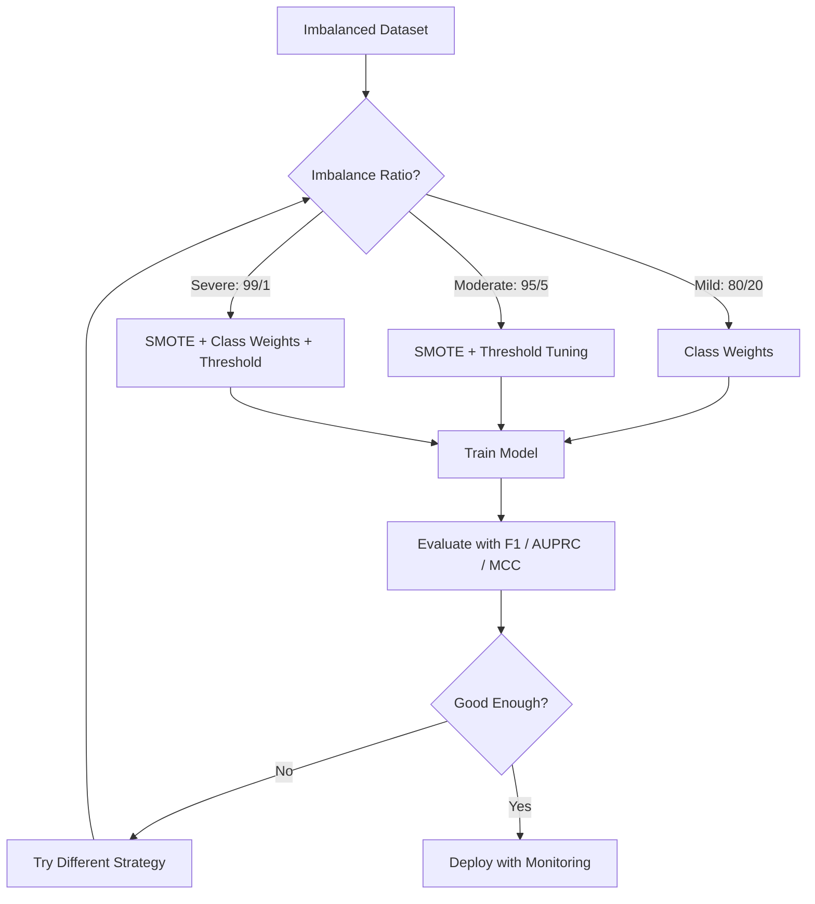
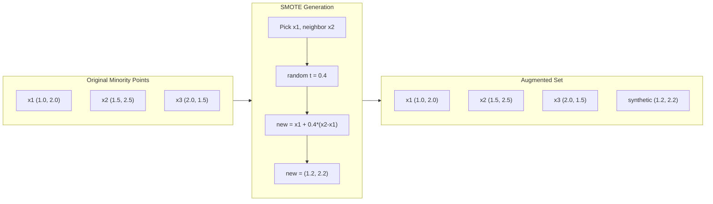
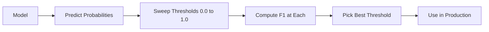
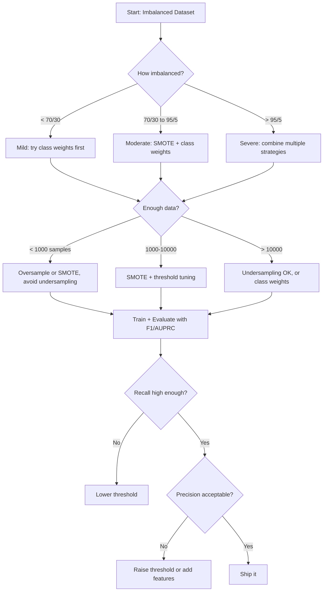

<!-- i18n:manual -->
# Работа с несбалансированными данными

> Когда 99% данных «нормальные», accuracy врёт.

**Type:** Build
**Language:** Python
**Prerequisites:** Phase 2, Lessons 01-09 (especially evaluation metrics)
**Time:** ~90 minutes

## Learning Objectives

- Реализовать SMOTE с нуля и объяснить, чем синтетический oversampling отличается от простого дублирования
- Оценивать несбалансированные классификаторы через F1, AUPRC и Matthews Correlation Coefficient вместо accuracy
- Сравнить class weights, подбор порога и resampling и выбрать подход под конкретное соотношение классов
- Собрать полный пайплайн для несбалансированных данных: SMOTE + class weights + оптимизация порога

> 🎒 **На пальцах.** Представьте класс, где 99 учеников пишут контрольную на «пять», а один — на «два». Учитель, который всем ставит «пять» не глядя, будет прав в 99 случаях из 100. Формально он молодец, по сути — бесполезен. Весь урок про то, как поймать этого одного.

## The Problem

Вы построили модель поиска мошеннических транзакций. Она даёт 99,9% accuracy. Вы радуетесь. Потом понимаете: модель отвечает «не мошенничество» на каждую транзакцию.

Это не баг. Это разумное поведение, когда мошеннических транзакций всего 0,1%. Модель поняла: всегда угадывать большинство — значит минимизировать общую ошибку. Формально верно и совершенно бесполезно.

Так происходит везде, где классификация действительно важна. Диагностика болезни: 1% положительных. Сетевые вторжения: 0,01% атак. Брак на производстве: 0,5%. Спам-фильтр: 20% спама. Отток клиентов: 5% ушедших. Чем важнее редкий класс, тем реже он встречается.

Accuracy подводит, потому что считает все правильные ответы одинаковыми. Верно распознать честную транзакцию и верно поймать мошенника — оба случая дают одно очко. Но ловля мошенников — единственная причина, ради которой модель вообще существует. Нужны метрики, приёмы и стратегии обучения, которые заставят модель обращать внимание на редкий, но важный класс.

## The Concept

### Why Accuracy Fails

Возьмём набор из 1000 примеров: 990 отрицательных и 10 положительных. Модель, которая всегда отвечает «отрицательно»:

|  | Predicted Positive | Predicted Negative |
|--|---|---|
| Actually Positive | 0 (TP) | 10 (FN) |
| Actually Negative | 0 (FP) | 990 (TN) |

Accuracy = (0 + 990) / 1000 = 99,0%

Модель не поймала ни одного мошенника. Ни одной болезни. Ни одного дефекта. А accuracy показывает 99%. Вот почему accuracy опасна на несбалансированных задачах.

> 🎒 **На пальцах.** Посчитайте руками по таблице: правильных ответов 0 + 990 = 990, всего 1000, значит 990/1000 = 99%. А теперь посчитайте, сколько из 10 больных мы нашли: 0 из 10, то есть ноль процентов. Два честных числа про одну и ту же модель — и они говорят прямо противоположное.

### Better Metrics

**Precision** = TP / (TP + FP). Из всего, что помечено как положительное, сколько действительно положительное? Высокая precision означает мало ложных тревог.

**Recall** = TP / (TP + FN). Из всего, что действительно положительное, сколько мы поймали? Высокий recall означает мало пропущенных.

**F1 Score** = 2 * precision * recall / (precision + recall). Среднее гармоническое. Сильнее наказывает за перекос между precision и recall, чем обычное среднее.

**F-beta Score** = (1 + beta^2) * precision * recall / (beta^2 * precision + recall). При beta > 1 важнее recall. При beta < 1 важнее precision. F2 часто берут в антифроде: пропустить мошенника хуже, чем зря дёрнуть клиента.

**AUPRC** (площадь под кривой precision-recall). Как AUC-ROC, но информативнее на несбалансированных данных. У случайного классификатора AUPRC равна доле положительного класса (а не 0,5, как у ROC). Из-за этого улучшения виднее.

**Matthews Correlation Coefficient** = (TP * TN - FP * FN) / sqrt((TP+FP)(TP+FN)(TN+FP)(TN+FN)). Значения от -1 до +1. Высокий балл получается, только если модель хороша на обоих классах сразу. Не ломается, даже когда классы сильно разного размера.

Для модели «всегда отвечай отрицательно» из примера выше: precision = 0/0 (не определена, обычно считают нулём), recall = 0/10 = 0, F1 = 0, MCC = 0. Эти метрики честно называют модель бесполезной.

> 🎒 **На пальцах.** Почему среднее гармоническое, а не обычное? Допустим, precision = 1,0, а recall = 0,01. Обычное среднее: (1,0 + 0,01) / 2 = 0,505 — вроде бы «серединка». F1: 2 × 1,0 × 0,01 / 1,01 ≈ 0,02 — почти ноль. Гармоническое среднее тянется к худшему из двух, и это именно то, что нам нужно: нельзя быть хорошим наполовину.

### The Imbalanced Data Pipeline



### SMOTE: Synthetic Minority Oversampling Technique

Случайный oversampling просто дублирует существующие примеры редкого класса. Это работает, но легко ведёт к переобучению: модель видит одни и те же точки много раз.

SMOTE создаёт новые синтетические примеры редкого класса — правдоподобные, но не копии. Алгоритм:

1. Для каждого примера x редкого класса найти k ближайших соседей среди других примеров редкого класса
2. Выбрать одного соседа случайно
3. Создать новую точку на отрезке между x и этим соседом

Формула: `new_sample = x + random(0, 1) * (neighbor - x)`

Это интерполяция между реальными точками редкого класса: новые примеры появляются в той же области пространства признаков, но не повторяют уже имеющиеся данные.



> 🎒 **На пальцах.** Проверьте арифметику из схемы руками. Точки x1 = (1,0; 2,0) и x2 = (1,5; 2,5), случайное t = 0,4. По первой координате: 1,0 + 0,4 × (1,5 − 1,0) = 1,0 + 0,2 = 1,2. По второй: 2,0 + 0,4 × 0,5 = 2,2. Получили (1,2; 2,2) — точку ровно на 40% пути от x1 к x2. Это как встать между двумя друзьями в очереди: вы новый человек, но стоите там же, где стоят они.

### Sampling Strategies Compared

**Random Oversampling**: дублировать примеры редкого класса до количества большинства.
- Плюсы: просто, информация не теряется
- Минусы: точные копии ведут к переобучению, обучение идёт дольше

**Random Undersampling**: выбросить часть примеров большинства до количества редкого класса.
- Плюсы: быстрое обучение, простота
- Минусы: выбрасывает потенциально полезные данные большинства, выше разброс

**SMOTE**: создать синтетические примеры редкого класса интерполяцией.
- Плюсы: появляются новые точки, переобучение меньше, чем при обычном oversampling
- Минусы: может породить шум у границы решения, не учитывает распределение большинства

| Strategy | Data Changed | Risk | When to Use |
|----------|-------------|------|-------------|
| Oversample | Дублируется редкий класс | Переобучение | Небольшие датасеты, умеренный перекос |
| Undersample | Удаляется часть большинства | Потеря информации | Большие датасеты, нужно быстрое обучение |
| SMOTE | Добавляются синтетические примеры | Шум у границы | Умеренный перекос, достаточно примеров для k-NN |

> 🎒 **На пальцах.** Три способа выровнять команды во дворе, где 950 игроков против 50. Oversampling: попросить тех же 50 сыграть по 19 раз каждого — количество сравнялось, но игроки-то те же. Undersampling: отправить домой 900 человек — быстро, но 900 человек ушли зря. SMOTE: собрать «средних» игроков между реальными — новые лица, похожие на настоящих.

### Class Weights

Вместо того чтобы менять данные, поменяйте отношение модели к ошибкам. Назначьте больший вес ошибке на редком классе.

Для бинарной задачи с 950 отрицательными и 50 положительными примерами:
- Вес отрицательного класса = n_samples / (2 * n_negative) = 1000 / (2 * 950) = 0,526
- Вес положительного класса = n_samples / (2 * n_positive) = 1000 / (2 * 50) = 10,0

Положительный класс получает вес в 19 раз больше. Ошибка на одном положительном примере стоит столько же, сколько 19 ошибок на отрицательных. Модель вынуждена обратить внимание на редкий класс.

В логистической регрессии это меняет функцию потерь:

```
weighted_loss = -sum(w_i * [y_i * log(p_i) + (1-y_i) * log(1-p_i)])
```

где w_i зависит от класса примера i.

Class weights математически эквивалентны oversampling в среднем, но новые точки не создаются. Поэтому они быстрее и не несут риска переобучения на дубликатах.

> 🎒 **На пальцах.** Проверьте отношение весов сами: 10,0 / 0,526 = 19. Это как штрафы в игре: за потерянную пешку минус одно очко, за потерянного ферзя минус девятнадцать. Правила игры те же, но теперь вы очень внимательно следите за ферзём.

### Threshold Tuning

Большинство классификаторов выдают вероятность. Порог по умолчанию — 0,5: если P(положительный) >= 0,5, отвечаем «положительный». Но 0,5 взята с потолка. При перекосе классов оптимальный порог обычно заметно ниже.

Процедура:
1. Обучить модель
2. Получить предсказанные вероятности на валидационной выборке
3. Перебрать пороги от 0,0 до 1,0
4. Посчитать F1 (или вашу метрику) на каждом пороге
5. Взять порог, который максимизирует метрику



Модель может выдать P(мошенничество) = 0,15 для реально мошеннической транзакции. При пороге 0,5 её признают честной. При пороге 0,10 — поймают. Калибровка вероятностей важна меньше, чем порядок: пока мошенничеству достаются более высокие вероятности, чем честным операциям, существует порог, который их разделит.

> 🎒 **На пальцах.** Порог — это планка на соревнованиях по прыжкам. Модель ставит её на 0,5 просто по привычке. Транзакция с оценкой 0,15 через такую планку не перепрыгнет, хотя она мошенническая. Опустите планку до 0,10 — и она пройдёт. Ничего в модели не поменялось, поменялось только одно число на выходе.

### Cost-Sensitive Learning

Обобщение class weights. Вместо одинаковых цен назначаем конкретные стоимости за каждый тип ошибки:

| | Predict Positive | Predict Negative |
|--|---|---|
| Actually Positive | 0 (correct) | C_FN = 100 |
| Actually Negative | C_FP = 1 | 0 (correct) |

Пропустить мошенническую транзакцию (FN) стоит в 100 раз дороже ложной тревоги (FP). Модель оптимизирует суммарную стоимость, а не количество ошибок.

Это самый честный подход, если вы можете оценить реальные издержки. Пропущенный диагноз рака и лишняя биопсия по ложной тревоге стоят совершенно разного. Когда цены прописаны явно, компромиссы становятся правильными.

> 🎒 **На пальцах.** По этой таблице сто ложных тревог стоят 100 × 1 = 100, ровно столько же, сколько один пропущенный мошенник. Значит, модели выгодно сто раз ошибиться в сторону перестраховки, лишь бы не пропустить один настоящий случай. Так же рассуждает пожарная сигнализация: сто ложных срабатываний неприятны, один пропущенный пожар — катастрофа.

### Decision Flowchart



```figure
class-imbalance
```

## Build It

### Step 1: Generate an imbalanced dataset

```python
import numpy as np


def make_imbalanced_data(n_majority=950, n_minority=50, seed=42):
    rng = np.random.RandomState(seed)

    X_maj = rng.randn(n_majority, 2) * 1.0 + np.array([0.0, 0.0])
    X_min = rng.randn(n_minority, 2) * 0.8 + np.array([2.5, 2.5])

    X = np.vstack([X_maj, X_min])
    y = np.concatenate([np.zeros(n_majority), np.ones(n_minority)])

    shuffle_idx = rng.permutation(len(y))
    return X[shuffle_idx], y[shuffle_idx]
```

> 🎒 **На пальцах.** Мы сами делаем «нечестный» датасет: 950 точек кучкуются вокруг (0,0), а 50 — вокруг (2,5; 2,5). Итого 1000 строк, редкого класса ровно 5%. Классы даже разделимы глазом — и всё равно наивная модель будет проваливаться. Это и есть суть проблемы: дело не в сложности данных, а в их перекосе.

### Step 2: SMOTE from scratch

```python
def euclidean_distance(a, b):
    return np.sqrt(np.sum((a - b) ** 2))


def find_k_neighbors(X, idx, k):
    distances = []
    for i in range(len(X)):
        if i == idx:
            continue
        d = euclidean_distance(X[idx], X[i])
        distances.append((i, d))
    distances.sort(key=lambda x: x[1])
    return [d[0] for d in distances[:k]]


def smote(X_minority, k=5, n_synthetic=100, seed=42):
    rng = np.random.RandomState(seed)
    n_samples = len(X_minority)
    k = min(k, n_samples - 1)
    synthetic = []

    for _ in range(n_synthetic):
        idx = rng.randint(0, n_samples)
        neighbors = find_k_neighbors(X_minority, idx, k)
        neighbor_idx = neighbors[rng.randint(0, len(neighbors))]
        t = rng.random()
        new_point = X_minority[idx] + t * (X_minority[neighbor_idx] - X_minority[idx])
        synthetic.append(new_point)

    return np.array(synthetic)
```

> 🎒 **На пальцах.** Весь SMOTE — это три строки внутри цикла: выбрать случайную точку, выбрать одного из пяти её ближайших соседей, встать где-то между ними. Строка `t = rng.random()` даёт число от 0 до 1: при t = 0 новая точка совпадёт с исходной, при t = 1 — с соседом, при t = 0,5 окажется ровно посередине. Никакой нейросети внутри нет, есть школьная формула точки на отрезке.

### Step 3: Random oversampling and undersampling

```python
def random_oversample(X, y, seed=42):
    rng = np.random.RandomState(seed)
    classes, counts = np.unique(y, return_counts=True)
    max_count = counts.max()

    X_resampled = list(X)
    y_resampled = list(y)

    for cls, count in zip(classes, counts):
        if count < max_count:
            cls_indices = np.where(y == cls)[0]
            n_needed = max_count - count
            chosen = rng.choice(cls_indices, size=n_needed, replace=True)
            X_resampled.extend(X[chosen])
            y_resampled.extend(y[chosen])

    X_out = np.array(X_resampled)
    y_out = np.array(y_resampled)
    shuffle = rng.permutation(len(y_out))
    return X_out[shuffle], y_out[shuffle]


def random_undersample(X, y, seed=42):
    rng = np.random.RandomState(seed)
    classes, counts = np.unique(y, return_counts=True)
    min_count = counts.min()

    X_resampled = []
    y_resampled = []

    for cls in classes:
        cls_indices = np.where(y == cls)[0]
        chosen = rng.choice(cls_indices, size=min_count, replace=False)
        X_resampled.extend(X[chosen])
        y_resampled.extend(y[chosen])

    X_out = np.array(X_resampled)
    y_out = np.array(y_resampled)
    shuffle = rng.permutation(len(y_out))
    return X_out[shuffle], y_out[shuffle]
```

> 🎒 **На пальцах.** Ключевая разница спрятана в одном аргументе. В oversampling стоит `replace=True` — берём с возвратом, поэтому одну и ту же точку можно вытянуть много раз. В undersampling стоит `replace=False` — берём без возврата, каждая точка попадётся не больше одного раза. На наших данных первый вариант раздует выборку с 1000 до 1900 строк, второй сожмёт её до 100.

### Step 4: Logistic regression with class weights

```python
def sigmoid(z):
    return 1.0 / (1.0 + np.exp(-np.clip(z, -500, 500)))


def logistic_regression_weighted(X, y, weights, lr=0.01, epochs=200):
    n_samples, n_features = X.shape
    w = np.zeros(n_features)
    b = 0.0

    for _ in range(epochs):
        z = X @ w + b
        pred = sigmoid(z)
        error = pred - y
        weighted_error = error * weights

        gradient_w = (X.T @ weighted_error) / n_samples
        gradient_b = np.mean(weighted_error)

        w -= lr * gradient_w
        b -= lr * gradient_b

    return w, b


def compute_class_weights(y):
    classes, counts = np.unique(y, return_counts=True)
    n_samples = len(y)
    n_classes = len(classes)
    weight_map = {}
    for cls, count in zip(classes, counts):
        weight_map[cls] = n_samples / (n_classes * count)
    return np.array([weight_map[yi] for yi in y])
```

> 🎒 **На пальцах.** Вся магия class weights — это одна строка: `weighted_error = error * weights`. Ошибка на редком примере умножается на 10,0, на частом — на 0,526. Формула `n_samples / (n_classes * count)` даёт это автоматически: для 1000 примеров и 50 положительных получается 1000 / (2 × 50) = 10,0. Обратите внимание: если передать `np.ones(...)`, всё вернётся к обычной логистической регрессии.

### Step 5: Threshold tuning

```python
def find_optimal_threshold(y_true, y_probs, metric="f1"):
    best_threshold = 0.5
    best_score = -1.0

    for threshold in np.arange(0.05, 0.96, 0.01):
        y_pred = (y_probs >= threshold).astype(int)
        tp = np.sum((y_pred == 1) & (y_true == 1))
        fp = np.sum((y_pred == 1) & (y_true == 0))
        fn = np.sum((y_pred == 0) & (y_true == 1))

        if metric == "f1":
            precision = tp / (tp + fp) if (tp + fp) > 0 else 0.0
            recall = tp / (tp + fn) if (tp + fn) > 0 else 0.0
            score = 2 * precision * recall / (precision + recall) if (precision + recall) > 0 else 0.0
        elif metric == "recall":
            score = tp / (tp + fn) if (tp + fn) > 0 else 0.0
        elif metric == "precision":
            score = tp / (tp + fp) if (tp + fp) > 0 else 0.0

        if score > best_score:
            best_score = score
            best_threshold = threshold

    return best_threshold, best_score
```

> 🎒 **На пальцах.** `np.arange(0.05, 0.96, 0.01)` — это просто список из 91 числа: 0,05, 0,06, 0,07 и так до 0,95. Для каждого считаем F1 и запоминаем лучшее. Никакой оптимизации, чистый перебор — но именно он часто даёт больше прироста, чем неделя подбора гиперпараметров.

### Step 6: Evaluation functions

```python
def confusion_matrix_values(y_true, y_pred):
    tp = np.sum((y_pred == 1) & (y_true == 1))
    tn = np.sum((y_pred == 0) & (y_true == 0))
    fp = np.sum((y_pred == 1) & (y_true == 0))
    fn = np.sum((y_pred == 0) & (y_true == 1))
    return tp, tn, fp, fn


def compute_metrics(y_true, y_pred):
    tp, tn, fp, fn = confusion_matrix_values(y_true, y_pred)
    accuracy = (tp + tn) / (tp + tn + fp + fn)
    precision = tp / (tp + fp) if (tp + fp) > 0 else 0.0
    recall = tp / (tp + fn) if (tp + fn) > 0 else 0.0
    f1 = 2 * precision * recall / (precision + recall) if (precision + recall) > 0 else 0.0

    denom = np.sqrt(float((tp + fp) * (tp + fn) * (tn + fp) * (tn + fn)))
    mcc = (tp * tn - fp * fn) / denom if denom > 0 else 0.0

    return {
        "accuracy": accuracy,
        "precision": precision,
        "recall": recall,
        "f1": f1,
        "mcc": mcc,
    }
```

### Step 7: Compare all approaches

```python
X, y = make_imbalanced_data(950, 50, seed=42)
split = int(0.8 * len(y))
X_train, X_test = X[:split], X[split:]
y_train, y_test = y[:split], y[split:]

# Baseline: no treatment
w_base, b_base = logistic_regression_weighted(
    X_train, y_train, np.ones(len(y_train)), lr=0.1, epochs=300
)
probs_base = sigmoid(X_test @ w_base + b_base)
preds_base = (probs_base >= 0.5).astype(int)

# Oversampled
X_over, y_over = random_oversample(X_train, y_train)
w_over, b_over = logistic_regression_weighted(
    X_over, y_over, np.ones(len(y_over)), lr=0.1, epochs=300
)
preds_over = (sigmoid(X_test @ w_over + b_over) >= 0.5).astype(int)

# SMOTE
minority_mask = y_train == 1
X_minority = X_train[minority_mask]
synthetic = smote(X_minority, k=5, n_synthetic=len(y_train) - 2 * int(minority_mask.sum()))
X_smote = np.vstack([X_train, synthetic])
y_smote = np.concatenate([y_train, np.ones(len(synthetic))])
w_sm, b_sm = logistic_regression_weighted(
    X_smote, y_smote, np.ones(len(y_smote)), lr=0.1, epochs=300
)
preds_smote = (sigmoid(X_test @ w_sm + b_sm) >= 0.5).astype(int)

# Class weights
sample_weights = compute_class_weights(y_train)
w_cw, b_cw = logistic_regression_weighted(
    X_train, y_train, sample_weights, lr=0.1, epochs=300
)
probs_cw = sigmoid(X_test @ w_cw + b_cw)
preds_cw = (probs_cw >= 0.5).astype(int)

# Threshold tuning (tune on held-out validation set, not test set)
probs_val = sigmoid(X_val @ w_cw + b_cw)
best_thresh, best_f1 = find_optimal_threshold(y_val, probs_val, metric="f1")
preds_thresh = (probs_cw >= best_thresh).astype(int)
```

Этот файл с кодом прогоняет всё сразу одним скриптом и печатает результаты.

> 🎒 **На пальцах.** Разберём формулу для `n_synthetic`. В обучающей выборке 800 строк, из них редкого класса примерно 40. Тогда 800 − 2 × 40 = 720 синтетических точек. После добавления получаем 40 + 720 = 760 редких и 760 частых — идеальный баланс. И запомните комментарий про валидацию: порог подбирают на отдельной выборке, а не на тестовой. Иначе вы подгоняете экзамен под ответы.

## Use It

С scikit-learn и imbalanced-learn всё это делается однострочниками:

```python
from sklearn.linear_model import LogisticRegression
from sklearn.metrics import classification_report, f1_score
from sklearn.model_selection import train_test_split
from imblearn.over_sampling import SMOTE
from imblearn.under_sampling import RandomUnderSampler
from imblearn.pipeline import Pipeline

X_train, X_test, y_train, y_test = train_test_split(X, y, stratify=y)

model_weighted = LogisticRegression(class_weight="balanced")
model_weighted.fit(X_train, y_train)
print(classification_report(y_test, model_weighted.predict(X_test)))

smote = SMOTE(random_state=42)
X_resampled, y_resampled = smote.fit_resample(X_train, y_train)
model_smote = LogisticRegression()
model_smote.fit(X_resampled, y_resampled)
print(classification_report(y_test, model_smote.predict(X_test)))

pipeline = Pipeline([
    ("smote", SMOTE()),
    ("model", LogisticRegression(class_weight="balanced")),
])
pipeline.fit(X_train, y_train)
print(classification_report(y_test, pipeline.predict(X_test)))
```

Реализации с нуля показывают, что именно делает каждый приём. SMOTE — это интерполяция по k-NN внутри редкого класса. Class weights — умножение слагаемых в функции потерь. Подбор порога — цикл по отсечкам. Никакой магии.

> 🎒 **На пальцах.** Два аргумента здесь стоят целого урока. `class_weight="balanced"` — это ровно наша формула `n_samples / (n_classes * count)`, посчитанная за вас. `stratify=y` следит, чтобы в обучении и тесте сохранилась одна и та же доля редкого класса: без него на 5% перекосе тестовая выборка может случайно остаться почти без положительных примеров.

## Ship It

Этот урок производит:
- `outputs/skill-imbalanced-data.md` -- чек-лист принятия решений для задач с несбалансированной классификацией

## Exercises

1. **Borderline-SMOTE**: измените реализацию SMOTE так, чтобы синтетические примеры создавались только для точек редкого класса рядом с границей решения (у которых среди k ближайших соседей есть точки большинства). Сравните результат с обычным SMOTE на данных, где классы перекрываются.

2. **Cost matrix optimization**: реализуйте cost-sensitive learning, где матрица стоимостей является параметром. Напишите функцию, которая принимает матрицу стоимостей и возвращает предсказания, минимизирующие ожидаемую стоимость. Проверьте на разных соотношениях цен (1:10, 1:100, 1:1000) и постройте график того, как меняется компромисс precision-recall.

3. **Threshold calibration**: реализуйте Platt scaling (обучите логистическую регрессию на сырых выходах модели, чтобы получить калиброванные вероятности). Сравните кривую precision-recall до и после калибровки. Покажите, что калибровка не меняет порядок (AUC остаётся тем же), но делает вероятности осмысленными.

4. **Ensemble with balanced bagging**: обучите несколько моделей, каждую на сбалансированной бутстрап-выборке (весь редкий класс плюс случайное подмножество большинства). Усредните их предсказания. Сравните этот подход с одной моделью на SMOTE. Измерьте и качество, и разброс между запусками.

5. **Imbalance ratio experiment**: возьмите сбалансированный датасет и постепенно увеличивайте перекос (50/50, 70/30, 90/10, 95/5, 99/1). Для каждого соотношения обучите модель с SMOTE и без. Постройте график F1 в зависимости от перекоса для обоих подходов. При каком соотношении SMOTE начинает давать заметную разницу?

> 🎒 **На пальцах.** Подсказка к пятому заданию: скорее всего, при 50/50 и 70/30 графики почти совпадут, а разойдутся они где-то около 90/10. Логика простая: пока редкого класса хватает, модель и так его видит. Соберите результаты в таблицу из пяти строк — та строка, где линии впервые расходятся, и есть ответ на вопрос «когда пора включать SMOTE».

## Key Terms

| Term | What people say | What it actually means |
|------|----------------|----------------------|
| Class imbalance | «Одного класса намного больше» | Распределение классов в датасете сильно перекошено, из-за чего модели склоняются к большинству |
| SMOTE | «Синтетический oversampling» | Создаёт новые примеры редкого класса, интерполируя между существующими примерами и их k ближайшими соседями того же класса |
| Class weights | «Ошибки на редких классах дороже» | Умножение функции потерь на веса по классам, чтобы модель сильнее наказывалась за ошибки на редком классе |
| Threshold tuning | «Двигаем границу решения» | Замена стандартной отсечки вероятности 0,5 на значение, которое оптимизирует нужную метрику |
| Precision-recall tradeoff | «Одновременно не бывает» | Снижение порога ловит больше положительных (выше recall), но и даёт больше ложных тревог (ниже precision), и наоборот |
| AUPRC | «Площадь под PR-кривой» | Сводит кривую precision-recall к одному числу; информативнее AUC-ROC при сильном перекосе классов |
| Matthews Correlation Coefficient | «Сбалансированная метрика» | Корреляция между предсказанными и настоящими метками; высокий балл получается только когда модель хороша на обоих классах |
| Cost-sensitive learning | «Разные ошибки стоят по-разному» | Учёт реальных издержек ошибок в целевой функции, чтобы модель минимизировала суммарную стоимость, а не число ошибок |
| Random oversampling | «Продублировать редкий класс» | Повторение примеров редкого класса до выравнивания количества; просто, но рискует переобучением на дубликатах |

## Further Reading

- [SMOTE: Synthetic Minority Over-sampling Technique (Chawla et al., 2002)](https://arxiv.org/abs/1106.1813) -- оригинальная статья про SMOTE, до сих пор самая цитируемая работа по несбалансированным данным
- [Learning from Imbalanced Data (He & Garcia, 2009)](https://ieeexplore.ieee.org/document/5128907) -- подробный обзор: сэмплирование, cost-sensitive и алгоритмические подходы
- [imbalanced-learn documentation](https://imbalanced-learn.org/stable/) -- библиотека для Python с вариантами SMOTE, стратегиями undersampling и встраиванием в пайплайны
- [The Precision-Recall Plot Is More Informative than the ROC Plot (Saito & Rehmsmeier, 2015)](https://journals.plos.org/plosone/article?id=10.1371/journal.pone.0118432) -- когда и почему на несбалансированных задачах PR-кривые лучше ROC
