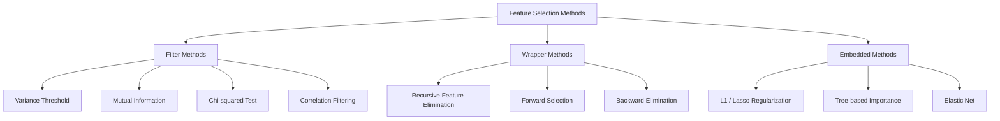
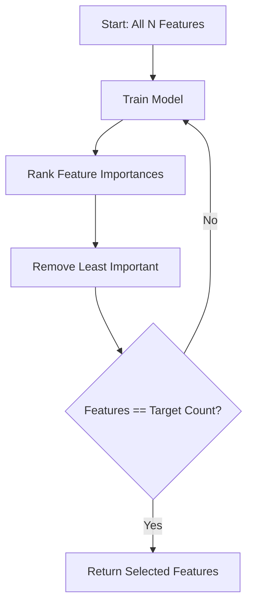
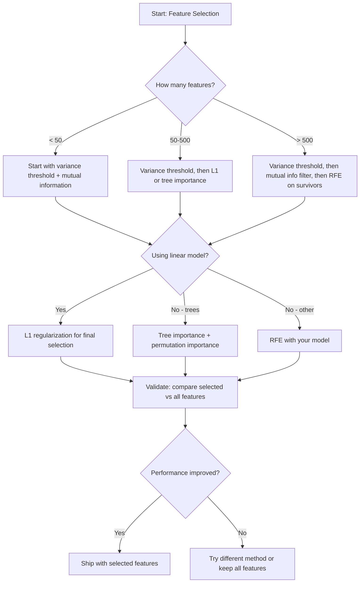

<!-- i18n:manual -->
# Отбор признаков

> Больше признаков не значит лучше. Лучше — это правильные признаки.

**Type:** Build
**Language:** Python
**Prerequisites:** Phase 2, Lessons 01-09, 08 (feature engineering)
**Time:** ~75 minutes

## Learning Objectives

- Реализовать с нуля filter-методы (variance threshold, mutual information, хи-квадрат) и wrapper-методы (RFE, forward selection)
- Объяснить, почему mutual information ловит нелинейные связи признака с целью, которые корреляция пропускает
- Сравнить L1-регуляризацию (embedded-отбор) с RFE (wrapper-отбор) и оценить их вычислительную цену
- Собрать пайплайн отбора признаков из нескольких методов и показать, что обобщение на отложенных данных улучшилось

## The Problem

У вас 500 признаков. Модель обучается медленно, постоянно переобучается, и никто не может объяснить, чему она научилась. Вы добавляете ещё признаков в надежде на улучшение. Становится хуже.

Это проклятие размерности в действии. Чем больше признаков, тем взрывнее растёт объём пространства признаков. Точки данных становятся разреженными. Расстояния между ними сближаются. Модели нужно экспоненциально больше данных, чтобы найти реальные закономерности. Шумовые признаки заглушают сигнальные. Переобучение становится нормой.

Отбор признаков — противоядие. Убрать шум. Убрать дублирование. Оставить то, что действительно несёт информацию о цели. Результат: быстрее обучение, лучше обобщение, и модель, которую можно объяснить.

Цель не в том, чтобы использовать всю доступную информацию. Цель в том, чтобы использовать правильную.

> 🎒 **На пальцах.** Почему больше признаков вредит: представьте, что ищете друга. На прямой линии длиной 10 метров он рядом. На поле 10×10 метров искать уже дольше. В кубе 10×10×10 — совсем долго. Каждое новое измерение умножает пространство на 10, а количество людей остаётся прежним. Именно так «разбегаются» ваши данные при 500 признаках.

## The Concept

### Three Categories of Feature Selection

Любой метод отбора признаков попадает в одну из трёх категорий:



**Filter methods** оценивают каждый признак по отдельности статистической мерой. Модель не используется. Быстро, но взаимодействия между признаками не видны.

**Wrapper methods** обучают модель, чтобы оценить подмножество признаков. Оценкой служит качество модели. Результат лучше, но дорого: модель переобучается много раз.

**Embedded methods** отбирают признаки прямо в процессе обучения. L1-регуляризация загоняет веса в ноль. Деревья решений делят по самым полезным признакам. Отбор происходит во время обучения, а не отдельным шагом.

### Variance Threshold

Самый простой фильтр. Если признак почти не меняется от примера к примеру, информации в нём почти нет.

Представьте признак, который равен 0.0 у 999 примеров из 1000. Его дисперсия близка к нулю. Ни одна модель не сможет по нему различить классы. Удалить.

```
variance(x) = mean((x - mean(x))^2)
```

Задайте порог (например, 0.01). Выбросьте все признаки с дисперсией ниже. Так убираются постоянные и почти постоянные признаки — причём на целевую переменную мы вообще не смотрим.

Когда применять: как шаг предобработки перед остальными методами. Он ловит очевидно бесполезные признаки практически бесплатно.

Ограничение: у признака может быть высокая дисперсия и при этом чистый шум. Variance threshold необходим, но недостаточен.

> 🎒 **На пальцах.** Признак с нулевой дисперсией — это графа в анкете, где все написали одно и то же. Если у всех 1000 учеников в графе «планета» стоит «Земля», по этой графе никого не отличить. Но обратное неверно: если в графе «случайное число» у всех разное, дисперсия огромная, а пользы столько же — ноль.

### Mutual Information

Mutual information (взаимная информация) измеряет, насколько знание значения признака X снижает неопределённость относительно цели Y.

```
I(X; Y) = sum_x sum_y p(x, y) * log(p(x, y) / (p(x) * p(y)))
```

Если X и Y независимы, то p(x, y) = p(x) * p(y), логарифм обращается в ноль и I(X; Y) = 0. Чем больше X говорит о Y, тем выше взаимная информация.

Ключевое преимущество перед корреляцией: взаимная информация ловит нелинейные зависимости. У признака может быть нулевая корреляция с целью и при этом высокая mutual information, потому что связь квадратичная или периодическая.

Для непрерывных признаков сначала разбейте значения на корзины (оценка по гистограмме). Число корзин влияет на результат: слишком мало — теряется информация, слишком много — добавляется шум. Обычный выбор: sqrt(n) корзин или правило Стёрджеса (1 + log2(n)).


> 🎒 **На пальцах.** Классический пример, где корреляция слепа, а mutual information — нет: пусть y = x². При x от −3 до 3 корреляция получится примерно нулевой (левая половина тянет вниз, правая вверх, они гасят друг друга). Но зная x, вы точно знаете y. Взаимная информация это увидит. Про число корзин: при n = 500 правило sqrt даёт около 22 корзин, правило Стёрджеса — 1 + log2(500) ≈ 10.

### Recursive Feature Elimination (RFE)

RFE — это wrapper-метод. Он использует собственную оценку важности модели и постепенно обрезает признаки:

1. Обучить модель на всех признаках
2. Отранжировать признаки по важности (коэффициенты у линейных моделей, снижение неоднородности у деревьев)
3. Удалить наименее важный признак (или несколько)
4. Повторять, пока не останется нужное количество



RFE учитывает взаимодействия признаков, потому что модель видит все оставшиеся признаки вместе. Удаление одного признака меняет важность остальных. Поэтому метод основательнее фильтров.

Цена: модель обучается N − target раз. Для 500 признаков и цели в 10 это 490 запусков обучения. Для тяжёлых моделей — медленно. Ускорить можно, удаляя несколько признаков за шаг (например, нижние 10% на каждом круге).

> 🎒 **На пальцах.** 500 − 10 = 490 обучений. Если одно обучение занимает 10 секунд, весь RFE отработает 4900 секунд, то есть больше часа. Если выбрасывать по 10% за круг, кругов будет около 37 вместо 490 — минут семь. Это как отбор в команду: можно выгонять по одному человеку в день, а можно сразу десятерых.

### L1 (Lasso) Regularization

L1-регуляризация добавляет к функции потерь сумму модулей весов:

```
loss = prediction_error + alpha * sum(|w_i|)
```

Параметр alpha управляет тем, насколько жёстко обрезаются признаки. Чем больше alpha, тем больше весов становятся ровно нулевыми.

Почему именно ноль? Штраф L1 задаёт в пространстве весов область-ромб. Оптимум обычно оказывается в углу этого ромба, а в углах одна или несколько координат равны нулю. L2-регуляризация (ridge) задаёт круг: веса уменьшаются, но в ноль попадают редко.

Это встроенный (embedded) отбор: модель сама во время обучения решает, какие признаки игнорировать. Признаки с нулевым весом фактически удалены.

Плюсы: одно обучение, разумно работает с коррелированными признаками (оставляет один, остальные обнуляет), встроена почти во все реализации линейных моделей.

Ограничение: работает только для линейных моделей. Нелинейную важность не поймает.

> 🎒 **На пальцах.** Ромб и круг — это про углы. У круга углов нет, поэтому точка касания почти никогда не лежит ровно на оси, и вес получается маленький, но не нулевой (0,003 вместо 0). У ромба четыре угла, и все они лежат на осях — попасть в угол значит получить ровно 0. Отсюда и вся разница между «признак почти не важен» и «признака больше нет».

### Tree-Based Feature Importance

Деревья решений и их ансамбли (random forest, градиентный бустинг) ранжируют признаки естественным образом. Каждое разбиение снижает неоднородность (Gini или энтропия для классификации, дисперсия для регрессии). Признаки, дающие большее снижение, важнее.

Для случайного леса из T деревьев:

```
importance(feature_j) = (1/T) * sum over all trees of
    sum over all nodes splitting on feature_j of
        (n_samples * impurity_decrease)
```

Так получается нормированная оценка важности для каждого признака. Метод сам справляется с нелинейностями и взаимодействиями.

Осторожно: важность по деревьям смещена в сторону признаков с большим числом уникальных значений (высокая кардинальность). Столбец со случайным ID будет выглядеть важным, потому что идеально разделяет каждый пример. Проверяйте себя permutation importance.

> 🎒 **На пальцах.** Про смещение к кардинальности. Если добавить в данные столбец «номер строки», дерево сможет разбить по нему что угодно: «строки до 137 — класс 0, после — класс 1». На обучающих данных Gini упадёт до нуля, важность взлетит. На новых данных этот признак не значит ничего. Так что высокая важность у столбца, похожего на ID, — не открытие, а тревожный звонок.

### Permutation Importance

Метод, не зависящий от модели:

1. Обучить модель и записать базовое качество на валидационных данных
2. Для каждого признака: случайно перемешать его значения и измерить падение качества
3. Чем больше падение, тем важнее признак

Если перемешивание признака не вредит качеству, модель на него не опирается. Если качество рушится — признак критичен.

Permutation importance не страдает от смещения к кардинальности, как важность по деревьям. Но метод медленный: полная оценка на каждый признак, да ещё повторённая несколько раз ради устойчивости.

> 🎒 **На пальцах.** Это проверка «а что если убрать этого человека из команды». Вы не выкидываете признак совсем — вы делаете его бессмысленным, перетасовав значения между строками. Если F1 упал с 0,85 до 0,55, признак нёс много. Если остался 0,84 — можно спокойно выбрасывать.

### Comparison Table

| Method | Type | Speed | Nonlinear | Feature Interactions |
|--------|------|-------|-----------|---------------------|
| Variance threshold | Filter | Очень быстро | Нет | Нет |
| Mutual information | Filter | Быстро | Да | Нет |
| Correlation filter | Filter | Быстро | Нет | Нет |
| RFE | Wrapper | Медленно | Зависит от модели | Да |
| L1 / Lasso | Embedded | Быстро | Нет (линейный) | Нет |
| Tree importance | Embedded | Средне | Да | Да |
| Permutation importance | Model-agnostic | Медленно | Да | Да |

### Decision Flowchart



```figure
f3-feature-prune
```

## Build It

### Step 1: Generate synthetic data with known feature structure

```python
import numpy as np


def make_feature_selection_data(n_samples=500, seed=42):
    rng = np.random.RandomState(seed)

    x1 = rng.randn(n_samples)
    x2 = rng.randn(n_samples)
    x3 = rng.randn(n_samples)
    x4 = x1 + 0.1 * rng.randn(n_samples)
    x5 = x2 + 0.1 * rng.randn(n_samples)

    informative = np.column_stack([x1, x2, x3, x4, x5])

    correlated = np.column_stack([
        x1 * 0.9 + 0.1 * rng.randn(n_samples),
        x2 * 0.8 + 0.2 * rng.randn(n_samples),
        x3 * 0.7 + 0.3 * rng.randn(n_samples),
        x1 * 0.5 + x2 * 0.5 + 0.1 * rng.randn(n_samples),
        x2 * 0.6 + x3 * 0.4 + 0.1 * rng.randn(n_samples),
    ])

    noise = rng.randn(n_samples, 10) * 0.5

    X = np.hstack([informative, correlated, noise])
    y = (2 * x1 - 1.5 * x2 + x3 + 0.5 * rng.randn(n_samples) > 0).astype(int)

    feature_names = (
        [f"info_{i}" for i in range(5)]
        + [f"corr_{i}" for i in range(5)]
        + [f"noise_{i}" for i in range(10)]
    )

    return X, y, feature_names
```

Правильный ответ нам известен заранее: признаки 0-4 информативные (при этом 3 и 4 — зашумлённые копии 0 и 1), признаки 5-9 коррелируют с информативными, признаки 10-19 — чистый шум. Хороший метод отбора должен поставить 0-4 наверх, а 10-19 в самый низ.

> 🎒 **На пальцах.** Мы сами написали ответ на задачу, а потом просим методы его угадать. Цель считается по формуле `2*x1 - 1.5*x2 + x3`: в ней участвуют только три признака. Значит, 10 шумовых столбцов физически не могут ничего знать про y — если метод ставит `noise_7` выше `info_0`, метод сломан. Всего признаков 5 + 5 + 10 = 20 на 500 строк.

### Step 2: Variance threshold

```python
def variance_threshold(X, threshold=0.01):
    variances = np.var(X, axis=0)
    mask = variances > threshold
    return mask, variances
```

> 🎒 **На пальцах.** Три строки — и это весь метод. `np.var(X, axis=0)` считает дисперсию по каждому столбцу, `mask` — массив из True и False. Заметьте: на нашем датасете он не выкинет ничего. Шумовые признаки сделаны как `randn * 0.5`, их дисперсия примерно 0,25 — намного выше порога 0,01. Полезный, но грубый инструмент.

### Step 3: Mutual information (discrete)

```python
def discretize(x, n_bins=10):
    min_val, max_val = x.min(), x.max()
    if max_val == min_val:
        return np.zeros_like(x, dtype=int)
    bin_edges = np.linspace(min_val, max_val, n_bins + 1)
    binned = np.digitize(x, bin_edges[1:-1])
    return binned


def mutual_information(X, y, n_bins=10):
    n_samples, n_features = X.shape
    mi_scores = np.zeros(n_features)

    y_vals, y_counts = np.unique(y, return_counts=True)
    p_y = y_counts / n_samples

    for f in range(n_features):
        x_binned = discretize(X[:, f], n_bins)
        x_vals, x_counts = np.unique(x_binned, return_counts=True)
        p_x = dict(zip(x_vals, x_counts / n_samples))

        mi = 0.0
        for xv in x_vals:
            for yi, yv in enumerate(y_vals):
                joint_mask = (x_binned == xv) & (y == yv)
                p_xy = np.sum(joint_mask) / n_samples
                if p_xy > 0:
                    mi += p_xy * np.log(p_xy / (p_x[xv] * p_y[yi]))
        mi_scores[f] = mi

    return mi_scores
```

> 🎒 **На пальцах.** Внутри — обычный подсчёт по клеточкам таблицы. Признак режется на 10 корзин, класс принимает 2 значения, значит клеток 10 × 2 = 20. Для каждой клетки считаем долю примеров и сравниваем с тем, что было бы при независимости. Пример: если в корзине 50 из 500 строк (p_x = 0,1), положительных всего 40% (p_y = 0,4), а в этой клетке оказалось 45 строк (p_xy = 0,09) вместо ожидаемых 0,1 × 0,4 = 0,04 — связь есть, и логарифм отношения даст положительный вклад.

### Step 4: Recursive Feature Elimination

```python
def simple_logistic_importance(X, y, lr=0.1, epochs=100):
    n_samples, n_features = X.shape
    w = np.zeros(n_features)
    b = 0.0

    for _ in range(epochs):
        z = X @ w + b
        pred = 1.0 / (1.0 + np.exp(-np.clip(z, -500, 500)))
        error = pred - y
        w -= lr * (X.T @ error) / n_samples
        b -= lr * np.mean(error)

    return w, b


def rfe(X, y, n_features_to_select=5, lr=0.1, epochs=100):
    n_total = X.shape[1]
    remaining = list(range(n_total))
    rankings = np.ones(n_total, dtype=int)
    rank = n_total

    while len(remaining) > n_features_to_select:
        X_subset = X[:, remaining]
        w, _ = simple_logistic_importance(X_subset, y, lr, epochs)
        importances = np.abs(w)

        least_idx = np.argmin(importances)
        original_idx = remaining[least_idx]
        rankings[original_idx] = rank
        rank -= 1
        remaining.pop(least_idx)

    for idx in remaining:
        rankings[idx] = 1

    selected_mask = rankings == 1
    return selected_mask, rankings
```

> 🎒 **На пальцах.** Важность здесь — просто `np.abs(w)`, модуль коэффициента. Знак не важен: вес −2,0 влияет ровно так же сильно, как +2,0, просто в другую сторону. На наших 20 признаках и цели в 5 цикл прокрутится 15 раз, и на каждом круге модель обучается заново на всё более коротком списке. Ранги проставляются задом наперёд: первый выброшенный получает 20, последний выброшенный — 6, а выжившие — 1.

### Step 5: L1 feature selection

```python
def soft_threshold(w, alpha):
    return np.sign(w) * np.maximum(np.abs(w) - alpha, 0)


def l1_feature_selection(X, y, alpha=0.1, lr=0.01, epochs=500):
    n_samples, n_features = X.shape
    w = np.zeros(n_features)
    b = 0.0

    for _ in range(epochs):
        z = X @ w + b
        pred = 1.0 / (1.0 + np.exp(-np.clip(z, -500, 500)))
        error = pred - y

        gradient_w = (X.T @ error) / n_samples
        gradient_b = np.mean(error)

        w -= lr * gradient_w
        w = soft_threshold(w, lr * alpha)
        b -= lr * gradient_b

    selected_mask = np.abs(w) > 1e-6
    return selected_mask, w
```

> 🎒 **На пальцах.** `soft_threshold` — это «налог» на каждый вес. Здесь он равен lr × alpha = 0,01 × 0,1 = 0,001 за эпоху. Вес 0,0025 после одного шага станет 0,0015, после второго 0,0005, после третьего — ровно 0. А вес 0,8 этот налог даже не заметит, потому что градиент возвращает ему больше, чем 0,001. Именно так признаки «умирают» сами: не выдерживают налога.

### Step 6: Tree-based importance (simple decision tree)

```python
def gini_impurity(y):
    if len(y) == 0:
        return 0.0
    classes, counts = np.unique(y, return_counts=True)
    probs = counts / len(y)
    return 1.0 - np.sum(probs ** 2)


def best_split(X, y, feature_idx):
    values = np.unique(X[:, feature_idx])
    if len(values) <= 1:
        return None, -1.0

    best_threshold = None
    best_gain = -1.0
    parent_gini = gini_impurity(y)
    n = len(y)

    for i in range(len(values) - 1):
        threshold = (values[i] + values[i + 1]) / 2.0
        left_mask = X[:, feature_idx] <= threshold
        right_mask = ~left_mask

        n_left = np.sum(left_mask)
        n_right = np.sum(right_mask)

        if n_left == 0 or n_right == 0:
            continue

        gain = parent_gini - (n_left / n) * gini_impurity(y[left_mask]) - (n_right / n) * gini_impurity(y[right_mask])

        if gain > best_gain:
            best_gain = gain
            best_threshold = threshold

    return best_threshold, best_gain


def tree_importance(X, y, n_trees=50, max_depth=5, seed=42):
    rng = np.random.RandomState(seed)
    n_samples, n_features = X.shape
    importances = np.zeros(n_features)

    for _ in range(n_trees):
        sample_idx = rng.choice(n_samples, size=n_samples, replace=True)
        feature_subset = rng.choice(n_features, size=max(1, int(np.sqrt(n_features))), replace=False)

        X_boot = X[sample_idx]
        y_boot = y[sample_idx]

        tree_imp = _build_tree_importance(X_boot, y_boot, feature_subset, max_depth)
        importances += tree_imp

    total = importances.sum()
    if total > 0:
        importances /= total

    return importances


def _build_tree_importance(X, y, feature_subset, max_depth, depth=0):
    n_features = X.shape[1]
    importances = np.zeros(n_features)

    if depth >= max_depth or len(np.unique(y)) <= 1 or len(y) < 4:
        return importances

    best_feature = None
    best_threshold = None
    best_gain = -1.0

    for f in feature_subset:
        threshold, gain = best_split(X, y, f)
        if gain > best_gain:
            best_gain = gain
            best_feature = f
            best_threshold = threshold

    if best_feature is None or best_gain <= 0:
        return importances

    importances[best_feature] += best_gain * len(y)

    left_mask = X[:, best_feature] <= best_threshold
    right_mask = ~left_mask

    importances += _build_tree_importance(X[left_mask], y[left_mask], feature_subset, max_depth, depth + 1)
    importances += _build_tree_importance(X[right_mask], y[right_mask], feature_subset, max_depth, depth + 1)

    return importances
```

> 🎒 **На пальцах.** Посчитайте Gini руками. Узел, где половина примеров класса 0 и половина класса 1: 1 − (0,5² + 0,5²) = 1 − 0,5 = 0,5, максимальный беспорядок. Узел, где все примеры одного класса: 1 − 1² = 0, идеальная чистота. Разбиение «зарабатывает» ровно эту разницу. А `int(np.sqrt(20))` = 4 означает, что каждое дерево видит только 4 случайных признака из 20 — так деревья получаются разными, и лес перестаёт быть одним переобученным деревом в пятидесяти копиях.

### Step 7: Run all methods and compare

Файл с кодом прогоняет все пять методов на одном и том же синтетическом датасете и печатает сравнительную таблицу: какие признаки выбрал каждый метод.

> 🎒 **На пальцах.** Читая эту таблицу, смотрите не на совпадения, а на расхождения. Все методы должны сойтись на том, что шумовые признаки не нужны. А вот по признакам `info_3` и `info_4` (копиям `info_0` и `info_1`) они разойдутся: L1 оставит один из пары и обнулит второй, mutual information даст обоим одинаково высокие баллы, потому что оценивает каждый в отдельности.

## Use It

В scikit-learn отбор признаков встроен прямо в пайплайн:

```python
from sklearn.feature_selection import (
    VarianceThreshold,
    mutual_info_classif,
    RFE,
    SelectFromModel,
)
from sklearn.linear_model import Lasso, LogisticRegression
from sklearn.ensemble import RandomForestClassifier

vt = VarianceThreshold(threshold=0.01)
X_filtered = vt.fit_transform(X)

mi_scores = mutual_info_classif(X, y)
top_k = np.argsort(mi_scores)[-10:]

rfe_selector = RFE(LogisticRegression(), n_features_to_select=10)
rfe_selector.fit(X, y)
X_rfe = rfe_selector.transform(X)

lasso_selector = SelectFromModel(Lasso(alpha=0.01))
lasso_selector.fit(X, y)
X_lasso = lasso_selector.transform(X)

rf = RandomForestClassifier(n_estimators=100)
rf.fit(X, y)
importances = rf.feature_importances_
```

Реализации с нуля показывают, что происходит внутри каждого метода. Variance threshold — это `var(X, axis=0)` и маска. Mutual information — подсчёт совместных и маргинальных частот в таблице сопряжённости. RFE — цикл, который обучает, ранжирует и обрезает. L1 — градиентный спуск с шагом мягкого порога. Tree importance — накопление снижений неоднородности по разбиениям. Никакой магии — статистика и циклы.

Версии из sklearn добавляют устойчивость (например, `mutual_info_classif` оценивает плотность через k-NN вместо разбиения на корзины), скорость (реализация на C) и встраивание в пайплайны.

> 🎒 **На пальцах.** Одна строка стоит отдельного внимания: `np.argsort(mi_scores)[-10:]`. `argsort` возвращает индексы по возрастанию, поэтому срез `[-10:]` берёт десять последних — то есть десять признаков с самыми высокими баллами. Частая ошибка новичка — написать `[:10]` и отобрать ровно самый бесполезный мусор.

## Ship It

Этот урок производит:
- `outputs/skill-feature-selector.md` -- краткое дерево решений для выбора подходящего метода отбора признаков

## Exercises

1. **Forward selection**: реализуйте обратное к RFE. Начните с нуля признаков. На каждом шаге добавляйте тот признак, который сильнее всего улучшает качество модели. Остановитесь, когда добавление перестанет помогать. Сравните полученный набор с результатом RFE. Что быстрее? Что даёт лучший результат?

2. **Stability selection**: запустите L1-отбор 50 раз, каждый раз на случайной подвыборке в 80% данных и со слегка разными значениями alpha. Посчитайте, как часто выбирается каждый признак. Признаки, попавшие в отбор более чем в 80% запусков, считаются «устойчивыми». Сравните их с результатом одного запуска L1. Что надёжнее?

3. **Multicollinearity detection**: посчитайте корреляционную матрицу для всех признаков. Напишите функцию, которая по заданному порогу корреляции (например, 0.9) удаляет один признак из каждой сильно коррелированной пары (оставляя тот, у которого выше mutual information с целью). Проверьте на синтетическом датасете и убедитесь, что избыточные коррелированные признаки удалены.

4. **Feature selection pipeline**: соедините variance threshold, фильтр по mutual information и RFE в один пайплайн. Сначала уберите признаки с почти нулевой дисперсией, затем оставьте топ-50% по mutual information, затем запустите RFE на выживших. Сравните этот пайплайн с одним только RFE на всех признаках. Быстрее ли пайплайн? Так же ли он точен?

5. **Permutation importance from scratch**: реализуйте permutation importance. Для каждого признака перемешайте его значения 10 раз и измерьте среднее падение F1. Сравните ранжирование с важностью по деревьям. Найдите случаи, где они расходятся, и объясните почему (подсказка: коррелированные признаки).

> 🎒 **На пальцах.** Подсказка к пятому заданию: расхождение почти наверняка случится на паре `info_0` и `info_3` — они почти копии друг друга. Перемешайте `info_0` — модель просто возьмёт информацию из `info_3`, и падение F1 будет крохотным. Перемешайте `info_3` — то же самое. Permutation importance объявит обоих неважными, хотя вместе они несут весь сигнал. Мораль: важность одного признака имеет смысл, только пока у него нет дублёра.

## Key Terms

| Term | What people say | What it actually means |
|------|----------------|----------------------|
| Filter method | «Оцениваем признаки по отдельности» | Подход, ранжирующий признаки статистической мерой без обучения модели, оценивая каждый признак изолированно |
| Wrapper method | «Пусть модель выберет признаки» | Подход, который оценивает подмножества признаков, обучая модель и используя её качество как критерий отбора |
| Embedded method | «Модель отбирает признаки во время обучения» | Отбор, происходящий как часть обучения модели, например L1-регуляризация, загоняющая веса в ноль |
| Mutual information | «Насколько одна переменная говорит о другой» | Мера снижения неопределённости относительно Y при знании X; ловит и линейные, и нелинейные зависимости |
| Recursive Feature Elimination | «Обучить, отранжировать, обрезать, повторить» | Итеративный wrapper-метод: обучает модель, удаляет наименее важные признаки и повторяет, пока не останется нужное количество |
| L1 / Lasso regularization | «Штраф, который убивает признаки» | Добавление суммы модулей весов к функции потерь, из-за чего веса неважных признаков становятся ровно нулевыми |
| Variance threshold | «Убрать постоянные признаки» | Удаление признаков, дисперсия которых по выборке ниже заданного порога, то есть тех, что не несут информации |
| Feature importance | «Какие признаки важнее» | Оценка вклада каждого признака в предсказания, посчитанная по приросту от разбиений (деревья) или величине коэффициентов (линейные модели) |
| Permutation importance | «Перемешать и посмотреть на ущерб» | Оценка важности через случайное перемешивание значений признака и измерение падения качества модели |
| Curse of dimensionality | «Слишком много признаков, слишком мало данных» | Явление, при котором добавление признаков экспоненциально раздувает объём пространства, делая данные разреженными, а расстояния бессмысленными |

## Further Reading

- [An Introduction to Variable and Feature Selection (Guyon & Elisseeff, 2003)](https://jmlr.org/papers/v3/guyon03a.html) -- основополагающий обзор методов отбора признаков, на него до сих пор массово ссылаются
- [scikit-learn Feature Selection Guide](https://scikit-learn.org/stable/modules/feature_selection.html) -- практический справочник по filter-, wrapper- и embedded-методам с примерами кода
- [Stability Selection (Meinshausen & Buhlmann, 2010)](https://arxiv.org/abs/0809.2932) -- сочетание подвыборок с отбором признаков ради устойчивых, воспроизводимых результатов
- [Beware Default Random Forest Importances (Strobl et al., 2007)](https://bmcbioinformatics.biomedcentral.com/articles/10.1186/1471-2105-8-25) -- показывает смещение важности по деревьям к высокой кардинальности и предлагает условную важность как альтернативу
