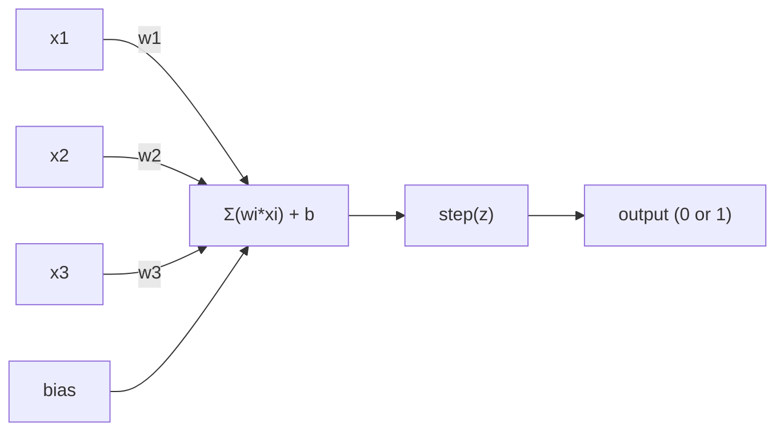
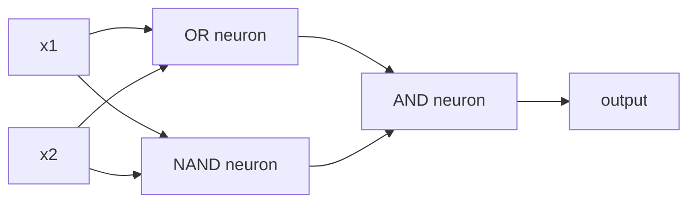

<!-- i18n:manual -->
# Перцептрон

> Перцептрон — это атом нейросетей. Разломите его, и внутри окажутся веса, смещение и решение.

**Type:** Build
**Languages:** Python
**Prerequisites:** Phase 1 (Linear Algebra Intuition)
**Time:** ~60 minutes

## Learning Objectives

- Реализовать перцептрон с нуля на Python, включая правило обновления весов и ступенчатую функцию активации
- Объяснить, почему один перцептрон решает только линейно разделимые задачи, и показать провал на XOR
- Собрать многослойный перцептрон из вентилей OR, NAND и AND, чтобы решить XOR
- Обучить двухслойную сеть с сигмоидой и обратным распространением, чтобы она выучила XOR сама

> 🎒 **На пальцах.** Перцептрон — это как один охранник на входе: он смотрит на несколько признаков, каждому доверяет по-своему и говорит «пускать» или «не пускать». В этом уроке вы сначала напишете такого охранника из 30 строк, потом увидите задачу, с которой он не справляется в принципе, и почините её тремя охранниками подряд.

## The Problem

Вы знаете векторы и скалярные произведения. Вы знаете, что матрица превращает входы в выходы. Но откуда машина *узнаёт*, какое именно преобразование ей нужно?

На это отвечает перцептрон. Это простейшая обучающаяся машина: взять входы, умножить на веса, прибавить смещение и принять бинарное решение. Потом подправить веса. Всё. Любая нейросеть, когда-либо построенная, — это слои из той же идеи.

Понять перцептрон — значит понять, что такое «обучение» в коде: подкручивать числа, пока выход не совпадёт с реальностью.

> 🎒 **На пальцах.** «Обучение» звучит загадочно, но в коде это одна строка вида «прибавь к весу немного ошибки». Как настройка гитары: дёрнул струну, услышал, что низко, чуть подкрутил колок, повторил. Никакой магии, только повторение и маленькие поправки.

## The Concept

### One Neuron, One Decision

Перцептрон берёт n входов, умножает каждый на свой вес, складывает, прибавляет смещение и пропускает результат через функцию активации.



Ступенчатая функция беспощадна: если взвешенная сумма плюс смещение >= 0, на выходе 1. Иначе 0.

```
step(z) = 1  if z >= 0
           0  if z < 0
```

Это линейный классификатор. Веса и смещение задают линию (или гиперплоскость в больших размерностях), которая делит пространство входов на две области.

> 🎒 **На пальцах.** Представьте, что вы решаете, брать ли зонт. Вес 0.5 у «тучи на небе», вес 0.3 у «прогноз обещал дождь», смещение −0.6. Небо в тучах (1), прогноз молчит (0): 0.5×1 + 0.3×0 − 0.6 = −0.1, это меньше нуля — зонт не берём. Добавился прогноз (1): 0.5 + 0.3 − 0.6 = 0.2, больше нуля — берём. Один и тот же нейрон, разное решение.

### The Decision Boundary

Для двух входов перцептрон проводит линию через двумерное пространство:

```
  x2
  ┤
  │  Class 1        /
  │    (0)          /
  │                /
  │               / w1·x1 + w2·x2 + b = 0
  │              /
  │             /     Class 2
  │            /        (1)
  ┼───────────/──────────── x1
```

Всё по одну сторону линии даёт 0. Всё по другую — 1. Обучение двигает эту линию, пока она не разделит классы правильно.

> 🎒 **На пальцах.** Это как черта мелом на школьном дворе: слева играют пятиклассники, справа — шестиклассники. Веса задают наклон черты, смещение двигает её вбок. Обучение — это когда учитель видит, что кто-то стоит не на своей стороне, и чуть сдвигает черту. Никаких изгибов: черта всегда прямая, и это главное ограничение перцептрона.

### The Learning Rule

Правило обучения перцептрона простое:

```
For each training example (x, y_true):
    y_pred = predict(x)
    error = y_true - y_pred

    For each weight:
        w_i = w_i + learning_rate * error * x_i
    bias = bias + learning_rate * error
```

Если предсказание верное, ошибка = 0 и ничего не меняется. Если предсказал 0, а нужна 1 — веса растут. Если предсказал 1, а нужен 0 — веса падают. Learning rate управляет размером каждой поправки.

> 🎒 **На пальцах.** Пройдём первый шаг обучения AND руками. Старт: веса [0, 0], смещение 0, learning rate 0.1. Первый пример ([0, 0], ответ 0): сумма 0, а правило «>= 0 даёт 1» выдаёт 1. Ошибка = 0 − 1 = −1. Веса умножаются на входы (оба нуля), значит не меняются вовсе, а смещение становится 0 + 0.1×(−1) = −0.1. Одна крошечная поправка — и теперь на [0, 0] сеть отвечает 0 правильно.

### The XOR Problem

Вот где всё ломается. Посмотрите на эти логические вентили:

```
AND gate:           OR gate:            XOR gate:
x1  x2  out         x1  x2  out         x1  x2  out
0   0   0           0   0   0           0   0   0
0   1   0           0   1   1           0   1   1
1   0   0           1   0   1           1   0   1
1   1   1           1   1   1           1   1   0
```

AND и OR линейно разделимы: одной прямой можно отделить нули от единиц. XOR — нет. Никакая одна линия не отделит [0,1] и [1,0] от [0,0] и [1,1].

```
AND (separable):        XOR (not separable):

  x2                      x2
  1 ┤  0     1            1 ┤  1     0
    │     /                 │
  0 ┤  0 / 0              0 ┤  0     1
    ┼──/──────── x1         ┼──────────── x1
       line works!          no single line works!
```

Это фундаментальный предел. Один перцептрон решает только линейно разделимые задачи. Минский и Паперт доказали это в 1969 году, и это едва не убило исследования нейросетей на десятилетие.

Лечение: сложить перцептроны в слои. Многослойный перцептрон решает XOR, комбинируя два линейных решения в одно нелинейное.

> 🎒 **На пальцах.** XOR — это «или то, или то, но не оба сразу». Как в столовой: можно взять компот, можно сок, но не два напитка и не ноль. На картинке нужные точки [0,1] и [1,0] лежат по диагонали, а лишние [0,0] и [1,1] — по другой диагонали. Возьмите линейку и попробуйте разделить их одной прямой: не выйдет ни за что. А вот двумя прямыми — легко, и это ровно то, что делают два нейрона вместо одного.

```figure
perceptron-boundary
```

## Build It

### Step 1: The Perceptron class

```python
class Perceptron:
    def __init__(self, n_inputs, learning_rate=0.1):
        self.weights = [0.0] * n_inputs
        self.bias = 0.0
        self.lr = learning_rate

    def predict(self, inputs):
        total = sum(w * x for w, x in zip(self.weights, inputs))
        total += self.bias
        return 1 if total >= 0 else 0

    def train(self, training_data, epochs=100):
        for epoch in range(epochs):
            errors = 0
            for inputs, target in training_data:
                prediction = self.predict(inputs)
                error = target - prediction
                if error != 0:
                    errors += 1
                    for i in range(len(self.weights)):
                        self.weights[i] += self.lr * error * inputs[i]
                    self.bias += self.lr * error
            if errors == 0:
                print(f"Converged at epoch {epoch + 1}")
                return
        print(f"Did not converge after {epochs} epochs")
```

> 🎒 **На пальцах.** Обратите внимание на `epochs=100`. Эпоха — это один полный проход по всем обучающим примерам, как одно прочтение всего параграфа перед контрольной. Если за целую эпоху не нашлось ни одной ошибки (`errors == 0`), учить больше нечему и цикл выходит досрочно.

### Step 2: Train on logic gates

```python
and_data = [
    ([0, 0], 0),
    ([0, 1], 0),
    ([1, 0], 0),
    ([1, 1], 1),
]

or_data = [
    ([0, 0], 0),
    ([0, 1], 1),
    ([1, 0], 1),
    ([1, 1], 1),
]

not_data = [
    ([0], 1),
    ([1], 0),
]

print("=== AND Gate ===")
p_and = Perceptron(2)
p_and.train(and_data)
for inputs, _ in and_data:
    print(f"  {inputs} -> {p_and.predict(inputs)}")

print("\n=== OR Gate ===")
p_or = Perceptron(2)
p_or.train(or_data)
for inputs, _ in or_data:
    print(f"  {inputs} -> {p_or.predict(inputs)}")

print("\n=== NOT Gate ===")
p_not = Perceptron(1)
p_not.train(not_data)
for inputs, _ in not_data:
    print(f"  {inputs} -> {p_not.predict(inputs)}")
```

> 🎒 **На пальцах.** Запустите — AND сходится на 4-й эпохе, то есть после четырёх проходов по четырём примерам. Итоговые веса [0.2, 0.1] и смещение −0.2. Проверим руками: вход [1, 1] даёт 0.2 + 0.1 − 0.2 = 0.1, это >= 0, ответ 1. Вход [0, 1] даёт 0 + 0.1 − 0.2 = −0.1, меньше нуля, ответ 0. Ровно таблица AND, и всё это выучено из четырёх строчек данных.

### Step 3: Watch XOR fail

```python
xor_data = [
    ([0, 0], 0),
    ([0, 1], 1),
    ([1, 0], 1),
    ([1, 1], 0),
]

print("\n=== XOR Gate (single perceptron) ===")
p_xor = Perceptron(2)
p_xor.train(xor_data, epochs=1000)
for inputs, expected in xor_data:
    result = p_xor.predict(inputs)
    status = "OK" if result == expected else "WRONG"
    print(f"  {inputs} -> {result} (expected {expected}) {status}")
```

Он никогда не сойдётся. Это жёсткое доказательство того, что один перцептрон не может выучить XOR.

> 🎒 **На пальцах.** 1000 эпох — это 4000 просмотренных примеров, и всё равно «Did not converge». Ошибка не уменьшается со временем: линия дёргается туда-сюда бесконечно, потому что правильного положения просто не существует. Полезный урок на будущее: если модель не учится, иногда виновата не настройка, а архитектура.

### Step 4: Solve XOR with two layers

Трюк: XOR = (x1 OR x2) AND NOT (x1 AND x2). Соединяем три перцептрона:



```python
def xor_network(x1, x2):
    or_neuron = Perceptron(2)
    or_neuron.weights = [1.0, 1.0]
    or_neuron.bias = -0.5

    nand_neuron = Perceptron(2)
    nand_neuron.weights = [-1.0, -1.0]
    nand_neuron.bias = 1.5

    and_neuron = Perceptron(2)
    and_neuron.weights = [1.0, 1.0]
    and_neuron.bias = -1.5

    hidden1 = or_neuron.predict([x1, x2])
    hidden2 = nand_neuron.predict([x1, x2])
    output = and_neuron.predict([hidden1, hidden2])
    return output


print("\n=== XOR Gate (multi-layer network) ===")
for inputs, expected in xor_data:
    result = xor_network(inputs[0], inputs[1])
    print(f"  {inputs} -> {result} (expected {expected})")
```

Все четыре случая верны. Складывая перцептроны в слои, вы получаете границы решения, которые один перцептрон построить не может.

> 🎒 **На пальцах.** Пройдём вход [1, 1] по цепочке. OR-нейрон: 1×1 + 1×1 − 0.5 = 1.5 >= 0, значит 1. NAND-нейрон: −1×1 − 1×1 + 1.5 = −0.5 < 0, значит 0. AND-нейрон получает [1, 0]: 1 + 0 − 1.5 = −0.5 < 0, итог 0. Именно то, что нужно для XOR. Смысл человеческими словами: «хотя бы один есть» И «не оба сразу».

### Step 5: Train a Two-Layer Network

В шаге 4 веса были прописаны руками. Для XOR это работает, но не для настоящих задач, где правильные веса заранее неизвестны. Лечение: заменить ступенчатую функцию сигмоидой и выучить веса автоматически через backprop.

```python
class TwoLayerNetwork:
    def __init__(self, learning_rate=0.5):
        import random
        random.seed(0)
        self.w_hidden = [[random.uniform(-1, 1), random.uniform(-1, 1)] for _ in range(2)]
        self.b_hidden = [random.uniform(-1, 1), random.uniform(-1, 1)]
        self.w_output = [random.uniform(-1, 1), random.uniform(-1, 1)]
        self.b_output = random.uniform(-1, 1)
        self.lr = learning_rate

    def sigmoid(self, x):
        import math
        x = max(-500, min(500, x))
        return 1.0 / (1.0 + math.exp(-x))

    def forward(self, inputs):
        self.inputs = inputs
        self.hidden_outputs = []
        for i in range(2):
            z = sum(w * x for w, x in zip(self.w_hidden[i], inputs)) + self.b_hidden[i]
            self.hidden_outputs.append(self.sigmoid(z))
        z_out = sum(w * h for w, h in zip(self.w_output, self.hidden_outputs)) + self.b_output
        self.output = self.sigmoid(z_out)
        return self.output

    def train(self, training_data, epochs=10000):
        for epoch in range(epochs):
            total_error = 0
            for inputs, target in training_data:
                output = self.forward(inputs)
                error = target - output
                total_error += error ** 2

                d_output = error * output * (1 - output)

                saved_w_output = self.w_output[:]
                hidden_deltas = []
                for i in range(2):
                    h = self.hidden_outputs[i]
                    hd = d_output * saved_w_output[i] * h * (1 - h)
                    hidden_deltas.append(hd)

                for i in range(2):
                    self.w_output[i] += self.lr * d_output * self.hidden_outputs[i]
                self.b_output += self.lr * d_output

                for i in range(2):
                    for j in range(len(inputs)):
                        self.w_hidden[i][j] += self.lr * hidden_deltas[i] * inputs[j]
                    self.b_hidden[i] += self.lr * hidden_deltas[i]
```

```python
net = TwoLayerNetwork(learning_rate=2.0)
net.train(xor_data, epochs=10000)
for inputs, expected in xor_data:
    result = net.forward(inputs)
    predicted = 1 if result >= 0.5 else 0
    print(f"  {inputs} -> {result:.4f} (rounded: {predicted}, expected {expected})")
```

Два ключевых отличия от шага 4. Первое: сигмоида вместо ступеньки — она гладкая, значит градиенты существуют. Второе: метод `train` гонит ошибку назад от выхода к скрытому слою, подправляя каждый вес пропорционально его вкладу в ошибку. Это и есть обратное распространение в 20 строках.

Отсюда мост к уроку 03. Математика за `d_output` и `hidden_deltas` — это цепное правило, применённое к графу сети. Там мы выведем его как следует.

> 🎒 **На пальцах.** Запустите — получите примерно `[0, 0] -> 0.0074`, `[0, 1] -> 0.9923`, `[1, 0] -> 0.9923`, `[1, 1] -> 0.0094`. Сеть не отвечает ровно 0 и 1, она отвечает «почти ноль» и «почти единица», а порог 0.5 округляет. Это как оценка 4.9 из 5: формально не пятёрка, но всем понятно.

> 🎒 **На пальцах.** Почему ступенька не годится для обучения: у неё нет наклона. Она прыгает с 0 на 1 в одной точке, и вопрос «в какую сторону подвинуть вес, чтобы стало чуть лучше» остаётся без ответа. Сигмоида — это пологая горка вместо ступеньки: всегда видно, куда катиться. Отсюда и множитель `output * (1 - output)` в коде: это крутизна горки в текущей точке, и в середине (при 0.5) она максимальна — 0.5 × 0.5 = 0.25.

## Use It

Всё, что вы только что написали с нуля, существует в одном импорте:

```python
from sklearn.linear_model import Perceptron as SkPerceptron
import numpy as np

X = np.array([[0,0],[0,1],[1,0],[1,1]])
y = np.array([0, 0, 0, 1])

clf = SkPerceptron(max_iter=100, tol=1e-3)
clf.fit(X, y)
print([clf.predict([x])[0] for x in X])
```

Пять строк. Ваш 30-строчный класс `Perceptron` делает то же самое. Версия sklearn добавляет проверки сходимости, разные функции потерь и поддержку разреженных входов, но основной цикл идентичен: взвешенная сумма, ступенчатая функция, обновление весов по ошибке.

Настоящая разница проявляется на масштабе. Что меняется в промышленных сетях:

- Ступенчатая функция становится сигмоидой, ReLU или другой гладкой активацией
- Веса обучаются автоматически через обратное распространение (урок 03)
- Слои становятся глубже: 3, 10, 100+ слоёв
- Принцип остаётся тем же: каждый слой строит новые признаки из выходов предыдущего

Один перцептрон умеет рисовать только прямые. Сложите их в слои — и сможете нарисовать любую фигуру.

> 🎒 **На пальцах.** Сравните масштабы: у вас в перцептроне 2 веса и 1 смещение — 3 числа. У сети для распознавания рукописных цифр 784-128-10 их уже больше ста тысяч. Идея одна и та же, отличается только количество. Так же, как один кирпич и дом из кирпичей подчиняются одной физике.

## Ship It

Этот урок производит:
- `outputs/skill-perceptron.md` - навык о том, когда нужны однослойные, а когда многослойные архитектуры

## Exercises

1. Обучите перцептрон на вентиле NAND (универсальный вентиль — любая логическая схема собирается из NAND). Проверьте, что его веса и смещение задают корректную границу решения.
2. Доработайте класс Perceptron так, чтобы он отслеживал границу решения (w1*x1 + w2*x2 + b = 0) на каждой эпохе. Напечатайте, как линия сдвигается во время обучения на вентиле AND.
3. Постройте перцептрон с 3 входами, который выдаёт 1, только если хотя бы 2 из 3 входов равны 1 (функция большинства). Линейно ли это разделимо? Почему?

> 🎒 **На пальцах.** Подсказка к третьему заданию: попробуйте веса [1, 1, 1] и смещение −1.5. Тогда «две единицы» дают 1 + 1 + 0 − 1.5 = 0.5 >= 0 — срабатывает, а «одна единица» даёт 1 − 1.5 = −0.5 < 0 — не срабатывает. Значит, одна прямая (точнее, плоскость) справляется, и задача линейно разделима. Голосование большинством — линейная задача, а вот XOR — нет.

## Key Terms

| Term | What people say | What it actually means |
|------|----------------|----------------------|
| Perceptron | «Ненастоящий нейрон» | Линейный классификатор: скалярное произведение входов и весов, плюс смещение, через ступенчатую функцию |
| Weight | «Насколько важен вход» | Множитель, который масштабирует вклад каждого входа в решение |
| Bias | «Порог» | Константа, сдвигающая границу решения; позволяет перцептрону сработать даже при нулевых входах |
| Activation function | «Штука, которая сжимает значения» | Функция, применяемая после взвешенной суммы — ступенька для перцептронов, сигмоида или ReLU для современных сетей |
| Linearly separable | «Между ними можно провести линию» | Набор данных, в котором одна гиперплоскость идеально разделяет классы |
| XOR problem | «То, чего перцептроны не умеют» | Доказательство, что однослойные сети не способны выучить линейно неразделимые функции |
| Decision boundary | «Где классификатор переключается» | Гиперплоскость w*x + b = 0, которая делит пространство входов на два класса |
| Multi-layer perceptron | «Настоящая нейросеть» | Перцептроны, сложенные в слои, где выход каждого слоя становится входом следующего |

## Further Reading

- Frank Rosenblatt, "The Perceptron: A Probabilistic Model for Information Storage and Organization in the Brain" (1958) -- оригинальная статья, с которой всё началось
- Minsky & Papert, "Perceptrons" (1969) -- книга, доказавшая, что XOR не решается однослойными сетями, и остановившая исследования перцептронов на десятилетие
- Michael Nielsen, "Neural Networks and Deep Learning", Chapter 1 (http://neuralnetworksanddeeplearning.com/) -- бесплатно онлайн, лучшее наглядное объяснение того, как перцептроны складываются в сети
