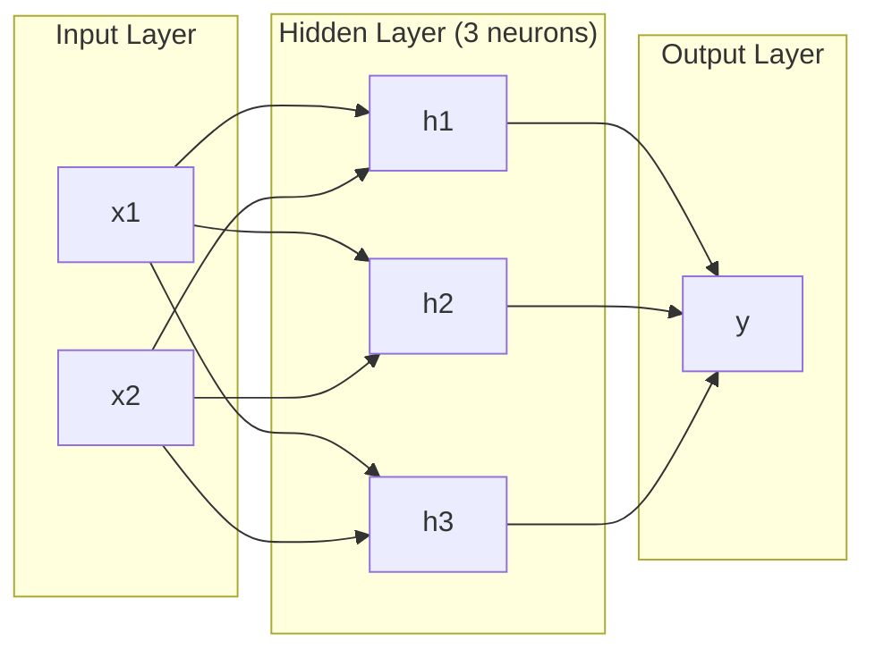
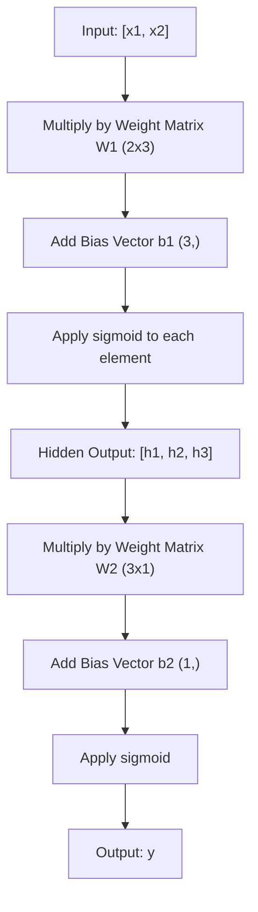
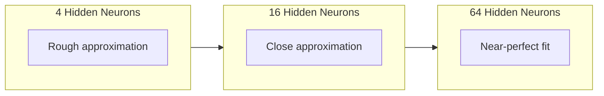

<!-- i18n:manual -->
# Многослойные сети и прямой проход

> Один нейрон рисует линию. Сложите их в слои — и нарисуете что угодно.

**Type:** Build
**Languages:** Python
**Prerequisites:** Phase 01 (Math Foundations), Lesson 03.01 (The Perceptron)
**Time:** ~90 minutes

## Learning Objectives

- Собрать многослойную сеть с нуля из классов Layer и Network, выполняющих полный forward pass
- Проследить размерности матриц через каждый слой сети и находить несовпадения форм
- Объяснить, как наложение нелинейных активаций позволяет сети выучить искривлённые границы решения
- Решить задачу XOR архитектурой 2-2-1 с сигмоидой и подобранными вручную весами

> 🎒 **На пальцах.** В прошлом уроке один нейрон умел проводить одну прямую и спотыкался на XOR. Здесь мы соберём конвейер из нейронов: первый слой нарезает пространство прямыми, второй склеивает куски в фигуру любой формы. Как из прямых палочек мозаики собирают круглый узор.

## The Problem

Один нейрон — рисовальщик прямых. И всё. Одна прямая линия через ваши данные. Любая настоящая задача в AI — распознавание изображений, понимание языка, игра в го — требует кривых. Кривые получаются, когда нейроны складывают в слои.

В 1969 году Минский и Паперт доказали, что это ограничение смертельно: однослойная сеть не может выучить XOR. Не «плохо учится» — математически не может. В таблице истинности XOR точки [0,1] и [1,0] лежат с одной стороны, [0,0] и [1,1] — с другой. Ни одна прямая их не разделяет.

Это остановило финансирование нейросетей больше чем на десятилетие. Решение задним числом очевидно: перестать пользоваться одним слоем. Сложить нейроны в слои. Пусть первый слой нарежет пространство входов на новые признаки, а второй соберёт из этих признаков решения, недоступные ни одной прямой.

Такая стопка и есть многослойная сеть. Это фундамент любой промышленной модели глубокого обучения. Прямой проход — данные текут от входа через скрытые слои к выходу — это первое, что нужно построить, прежде чем заработает всё остальное.

> 🎒 **На пальцах.** Аналогия из школы: один учитель ставит одну оценку по одному правилу. Комиссия из трёх учителей сначала оценивает разное (аккуратность, логику, скорость), а потом председатель складывает три их мнения в итог. Итоговое решение получается сложнее, чем любое из трёх, хотя каждый судил по простому линейному правилу.

## The Concept

### Layers: Input, Hidden, Output

В многослойной сети три типа слоёв:

**Input layer** -- на самом деле не слой. Он просто держит ваши сырые данные. Два признака — два входных узла. Вычислений здесь нет.

**Hidden layers** -- здесь происходит работа. Каждый нейрон берёт все выходы предыдущего слоя, применяет веса и смещение, а результат пропускает через функцию активации. «Скрытые» — потому что эти значения не видны напрямую в обучающих данных.

**Output layer** -- окончательный ответ. Для бинарной классификации — один нейрон с сигмоидой. Для многоклассовой — по нейрону на класс.



Это сеть 2-3-1. Два входа, три скрытых нейрона, один выход. Каждая связь несёт вес. Каждый нейрон (кроме входных) несёт смещение.

Каждый слой выдаёт вектор чисел, который называется скрытым состоянием. Для текста скрытые состояния увеличивают размерность — слово кодируется 768 числами, чтобы уместить смысл. Для изображений они размерность уменьшают, сжимая миллионы пикселей в компактное представление. Именно в скрытом состоянии живёт обучение.

> 🎒 **На пальцах.** Посчитаем параметры сети 2-3-1. Связей от входа к скрытому слою 2 × 3 = 6, от скрытого к выходу 3 × 1 = 3, итого 9 весов. Плюс смещения: 3 у скрытых нейронов и 1 у выходного, всего 4. Итого 13 чисел — вся сеть помещается в одну строчку тетради. У GPT-класса моделей таких чисел сотни миллиардов, но природа у них ровно та же.

### Neurons and Activations

Каждый нейрон делает три вещи:

1. Умножает каждый вход на соответствующий вес
2. Складывает все произведения и прибавляет смещение
3. Пропускает сумму через функцию активации

Пока что активация — сигмоида:

```
sigmoid(z) = 1 / (1 + e^(-z))
```

Сигмоида сжимает любое число в диапазон (0, 1). Большие положительные числа тянет к 1. Большие отрицательные — к 0. Ноль переходит в 0.5. Эта гладкая кривая и делает обучение возможным: в отличие от жёсткой ступеньки перцептрона, у сигмоиды всюду есть градиент.

> 🎒 **На пальцах.** Сигмоида — это переводчик из «сколько угодно» в «вероятность от 0 до 1». Проверьте: sigmoid(0) = 0.5 (полная неуверенность), sigmoid(2) ≈ 0.88 (скорее да), sigmoid(−2) ≈ 0.12 (скорее нет). Даже sigmoid(1000) не станет больше 1 — просто прижмётся к единице вплотную. Как оценка в процентах: 99.9% бывает, 120% не бывает.

### Forward Pass: How Data Flows

Прямой проход проталкивает входные данные через сеть, слой за слоем, до самого выхода. Во время прямого прохода обучения не происходит. Это чистое вычисление: умножить, сложить, активировать, повторить.



На каждом слое по очереди происходят три операции:

```
z = W * input + b       (linear transformation)
a = sigmoid(z)           (activation)
```

Выход одного слоя становится входом следующего. Это и есть весь прямой проход.

> 🎒 **На пальцах.** Прямой проход — как конвейер в столовой: поднос едет мимо станций, на каждой что-то добавляют, и в конце получается обед. Обратно поднос не едет — это будет обратное распространение из урока 03. Сейчас мы строим только движение вперёд, и это буквально два действия на слой: `W * input + b`, потом сигмоида.

### Matrix Dimensions

Отслеживание размерностей — самый важный навык отладки в глубоком обучении. Вот сеть 2-3-1:

| Step | Operation | Dimensions | Result Shape |
|------|-----------|------------|-------------|
| Input | x | -- | (2,) |
| Hidden linear | W1 * x + b1 | W1: (3, 2), b1: (3,) | (3,) |
| Hidden activation | sigmoid(z1) | -- | (3,) |
| Output linear | W2 * h + b2 | W2: (1, 3), b2: (1,) | (1,) |
| Output activation | sigmoid(z2) | -- | (1,) |

Правило: матрица весов W на слое k имеет форму (нейронов_на_слое_k, нейронов_на_слое_k_минус_1). Строки соответствуют текущему слою. Столбцы — предыдущему. Если формы не стыкуются, у вас баг.

> 🎒 **На пальцах.** Читайте таблицу как маршрут: вошли 2 числа, вышли 3, потом 1. Матрица W1 имеет форму (3, 2) — три строки, потому что нейронов три, и два столбца, потому что входов два. Умножение (3, 2) на (2,) даёт (3,): внутренние двойки «съедаются». Если вы случайно напишете форму (2, 3), Python выдаст ошибку размерности — и это самая частая ошибка новичка в PyTorch.

### Universal Approximation Theorem

В 1989 году Джордж Цибенко доказал нечто замечательное: нейросеть с одним скрытым слоем и достаточным числом нейронов может приблизить любую непрерывную функцию с любой желаемой точностью.

Это не значит, что один скрытый слой всегда лучший вариант. Это значит, что архитектура теоретически способна на всё. На практике более глубокие сети (больше слоёв, меньше нейронов в слое) выучивают те же функции с куда меньшим общим числом параметров, чем широкие и мелкие. Именно поэтому глубокое обучение работает.

Интуиция: каждый нейрон скрытого слоя выучивает один «горбик», одну особенность. Достаточное число горбиков, расставленных в нужных местах, приблизит любую гладкую кривую. Больше нейронов — больше горбиков — точнее приближение.



> 🎒 **На пальцах.** Это как рисовать окружность из прямых отрезков. Четыре отрезка дают квадрат, шестнадцать — уже похоже на круг, шестьдесят четыре — глазом не отличить. Теорема Цибенко говорит: отрезков всегда хватит, если их достаточно. Она не обещает, что их будет мало, и не объясняет, как их найти — этим займётся обучение.

### Composability

Нейросети композируемы. Их можно складывать в стопку, соединять в цепочку, запускать параллельно. Модель Whisper использует сеть-энкодер для обработки звука и отдельную сеть-декодер для генерации текста. Современные LLM — только декодер. BERT — только энкодер. T5 — энкодер-декодер. Выбор архитектуры определяет, что модель умеет.

> 🎒 **На пальцах.** Сети собираются как детали конструктора: важно только, чтобы совпадали числа на стыке. Энкодер превращает звук в числа, декодер превращает числа в текст — и они работают вместе именно потому, что выход одного по форме подходит ко входу другого. То же правило (3, 2) @ (2,), только на уровне целых моделей.

```figure
mlp-forward
```

## Build It

Чистый Python. Без numpy. Каждая матричная операция написана с нуля.

### Step 1: Sigmoid Activation

```python
import math

def sigmoid(x):
    x = max(-500.0, min(500.0, x))
    return 1.0 / (1.0 + math.exp(-x))
```

Ограничение диапазоном [-500, 500] предотвращает переполнение. `math.exp(500)` — большое, но конечное число. `math.exp(1000)` — бесконечность.

> 🎒 **На пальцах.** Компьютер умеет считать большие числа, но не бесконечно большие. `math.exp(1000)` не влезает в тип float и превращается в `inf`, после чего вся сеть выдаёт `nan` и обучение умирает. Две буквы `min` и `max` в одной строке спасают от этого навсегда. И потеря точности нулевая: sigmoid(500) и sigmoid(1000) для компьютера одинаково равны 1.0.

### Step 2: Layer Class

Самая важная операция во всём глубоком обучении — умножение матриц. Каждый слой, каждая attention-голова, каждый forward pass — это матричные умножения до самого низа. Линейный слой берёт входной вектор, умножает его на матрицу весов и прибавляет вектор смещения: y = Wx + b. Это одно уравнение — 90% всех вычислений в нейросети.

Слой хранит матрицу весов и вектор смещений. Его метод forward берёт входной вектор и возвращает активированный выход.

```python
class Layer:
    def __init__(self, n_inputs, n_neurons, weights=None, biases=None):
        if weights is not None:
            self.weights = weights
        else:
            import random
            self.weights = [
                [random.uniform(-1, 1) for _ in range(n_inputs)]
                for _ in range(n_neurons)
            ]
        if biases is not None:
            self.biases = biases
        else:
            self.biases = [0.0] * n_neurons

    def forward(self, inputs):
        self.last_input = inputs
        self.last_output = []
        for neuron_idx in range(len(self.weights)):
            z = sum(
                w * x for w, x in zip(self.weights[neuron_idx], inputs)
            )
            z += self.biases[neuron_idx]
            self.last_output.append(sigmoid(z))
        return self.last_output
```

Матрица весов имеет форму (n_neurons, n_inputs). Каждая строка — веса одного нейрона по всем входам. Метод forward проходит по нейронам, считает взвешенную сумму плюс смещение, применяет сигмоиду и собирает результаты.

> 🎒 **На пальцах.** Строка — это один нейрон, столбец — один вход. Слой `Layer(n_inputs=2, n_neurons=8)` хранит 8 строк по 2 числа = 16 весов плюс 8 смещений, всего 24 параметра. Представьте классный журнал: строка на ученика, столбец на предмет. Чтобы узнать итог одного ученика, вы читаете его строку целиком — ровно это и делает внутренний цикл `zip(self.weights[neuron_idx], inputs)`.

### Step 3: Network Class

Сеть — это список слоёв. Прямой проход соединяет их в цепочку: выход слоя k становится входом слоя k+1.

```python
class Network:
    def __init__(self, layers):
        self.layers = layers

    def forward(self, inputs):
        current = inputs
        for layer in self.layers:
            current = layer.forward(current)
        return current
```

Это весь прямой проход. Четыре строки логики. Данные входят, текут через все слои и выходят с другой стороны.

> 🎒 **На пальцах.** Заметьте, насколько это глупый код: переменная `current` просто передаётся дальше по кругу. Никакой хитрости, никакой математики сверх той, что уже внутри `Layer.forward`. В PyTorch этот же цикл называется `nn.Sequential`, и делает он ровно то же самое. Сложность нейросетей не в коде, а в числах внутри весов.

### Step 4: XOR with Hand-Tuned Weights

В уроке 01 мы решили XOR, скомбинировав перцептроны OR, NAND и AND. Теперь сделаем то же самое классами Layer и Network. Архитектура 2-2-1: два входа, два скрытых нейрона, один выход.

```python
hidden = Layer(
    n_inputs=2,
    n_neurons=2,
    weights=[[20.0, 20.0], [-20.0, -20.0]],
    biases=[-10.0, 30.0],
)

output = Layer(
    n_inputs=2,
    n_neurons=1,
    weights=[[20.0, 20.0]],
    biases=[-30.0],
)

xor_net = Network([hidden, output])

xor_data = [
    ([0, 0], 0),
    ([0, 1], 1),
    ([1, 0], 1),
    ([1, 1], 0),
]

for inputs, expected in xor_data:
    result = xor_net.forward(inputs)
    predicted = 1 if result[0] >= 0.5 else 0
    print(f"  {inputs} -> {result[0]:.6f} (rounded: {predicted}, expected: {expected})")
```

Большие веса (20, -20) заставляют сигмоиду вести себя как ступенька. Первый скрытый нейрон приближает OR. Второй приближает NAND. Выходной нейрон объединяет их в AND, что и даёт XOR.

> 🎒 **На пальцах.** Проследим вход [1, 1]. Первый скрытый нейрон: 20×1 + 20×1 − 10 = 30, sigmoid(30) ≈ 1.0. Второй: −20 − 20 + 30 = −10, sigmoid(−10) ≈ 0.000045, то есть почти ноль. Выход: 20×1.0 + 20×0.000045 − 30 ≈ −10, снова почти ноль. Печатается `0.000045` — округляем до 0, правильный ответ XOR. Почему веса такие большие: sigmoid(10) = 0.99995 и sigmoid(−10) = 0.000045 практически неотличимы от единицы и нуля, так гладкая горка притворяется резкой ступенькой.

### Step 5: Circle Classification

Задача посложнее: классифицировать точки на плоскости как лежащие внутри или снаружи круга радиуса 0.5 с центром в начале координат. Здесь нужна изогнутая граница решения — для одного перцептрона невозможная.

```python
import random
import math

random.seed(42)

data = []
for _ in range(200):
    x = random.uniform(-1, 1)
    y = random.uniform(-1, 1)
    label = 1 if (x * x + y * y) < 0.25 else 0
    data.append(([x, y], label))

circle_net = Network([
    Layer(n_inputs=2, n_neurons=8),
    Layer(n_inputs=8, n_neurons=1),
])
```

Со случайными весами сеть будет классифицировать плохо. Но прямой проход всё равно отработает. В этом и смысл — прямой проход это просто вычисление. Подбор правильных весов — это обратное распространение, оно будет в уроке 03.

> 🎒 **На пальцах.** Почему в коде сравнение с 0.25, а не с 0.5: радиус 0.5, а условие «внутри круга» — это x² + y² < r², то есть 0.5 × 0.5 = 0.25. Так экономят вычисление квадратного корня. Проверьте точку (0.3, 0.4): 0.09 + 0.16 = 0.25, ровно на границе, значит `< 0.25` ложно и метка 0.

```python
correct = 0
for inputs, expected in data:
    result = circle_net.forward(inputs)
    predicted = 1 if result[0] >= 0.5 else 0
    if predicted == expected:
        correct += 1

print(f"Accuracy with random weights: {correct}/{len(data)} ({100*correct/len(data):.1f}%)")
```

Случайные веса дают низкую точность — часто хуже, чем угадывание самого частого класса. После обучения (урок 03) та же архитектура с 8 скрытыми нейронами проведёт изогнутую границу, отделяющую внутреннее от внешнего.

> 🎒 **На пальцах.** Посчитайте честно: из 200 случайных точек внутрь круга попадают всего 35, остальные 165 снаружи. Значит, тупейшая стратегия «всегда отвечай 0» даёт 165/200 = 82.5%. Сеть со случайными весами показывает ровно те же 82.5% — то есть не знает вообще ничего, а цифра выглядит солидно. Отсюда правило: всегда сравнивайте точность с простой базовой стратегией, иначе легко обмануть себя.

## Use It

PyTorch делает всё вышеперечисленное в четыре строки:

```python
import torch
import torch.nn as nn

model = nn.Sequential(
    nn.Linear(2, 8),
    nn.Sigmoid(),
    nn.Linear(8, 1),
    nn.Sigmoid(),
)

x = torch.tensor([[0.0, 0.0], [0.0, 1.0], [1.0, 0.0], [1.0, 1.0]])
output = model(x)
print(output)
```

`nn.Linear(2, 8)` — это ваш класс Layer: матрица весов формы (8, 2), вектор смещений формы (8,). `nn.Sigmoid()` — это ваша функция sigmoid, применённая поэлементно. `nn.Sequential` — это ваш класс Network: цепочка слоёв по порядку.

Разница в скорости и масштабе. PyTorch работает на GPU, обрабатывает батчи из миллионов примеров и автоматически считает градиенты для обратного распространения. Но логика прямого прохода идентична той, что вы только что написали с нуля.

> 🎒 **На пальцах.** Сравните построчно: `nn.Linear(2, 8)` = ваш `Layer(n_inputs=2, n_neurons=8)`, `nn.Sigmoid()` = ваша функция `sigmoid`, `nn.Sequential(...)` = ваш `Network([...])`. Те же 24 параметра в первом слое, те же 9 во втором. Вы не изучали игрушечную версию — вы написали настоящую, просто медленную.

## Ship It

Этот урок производит переиспользуемый промпт для проектирования архитектур сетей:

- `outputs/prompt-network-architect.md`

Используйте его, когда нужно решить, сколько слоёв, сколько нейронов в слое и какие функции активации взять для конкретной задачи.

## Exercises

1. Постройте сеть 2-4-2-1 (два скрытых слоя) и прогоните прямой проход на данных XOR со случайными весами. Напечатайте промежуточные выходы скрытых слоёв, чтобы увидеть, как представление меняется на каждом слое.

2. Поменяйте размер скрытого слоя в классификаторе круга с 8 на 2, потом на 32. Каждый раз прогоняйте прямой проход со случайными весами. Меняется ли диапазон или распределение выходов от числа скрытых нейронов? Почему?

3. Реализуйте метод `count_parameters` у класса Network, возвращающий общее число обучаемых весов и смещений. Проверьте его на сети 784-256-128-10 (классическая архитектура для MNIST). Сколько у неё параметров?

4. Постройте прямой проход для сети 3-4-4-2. Подайте ей значения цветов RGB (нормированные в 0-1) и посмотрите на два выхода. Это архитектура простого классификатора цветов на два класса.

5. Замените сигмоиду на «дырявую ступеньку»: возвращать 0.01 * z при z < 0 и 1.0 иначе. Прогоните прямой проход на XOR с теми же подобранными вручную весами из шага 4. Всё ещё работает? Почему гладкая сигмоида предпочтительнее резких обрывов?

> 🎒 **На пальцах.** Подсказка к третьему заданию: считайте послойно по формуле «входы × нейроны + нейроны». Первый слой: 784 × 256 + 256 = 200 960. Второй: 256 × 128 + 128 = 32 896. Третий: 128 × 10 + 10 = 1290. Сумма — 235 146 параметров. Обратите внимание, что почти 85% из них живут в самом первом слое: широкий вход дорого обходится.

## Key Terms

| Term | What people say | What it actually means |
|------|----------------|----------------------|
| Forward pass | «Запуск модели» | Проталкивание входа через каждый слой — умножить на веса, прибавить смещение, активировать — чтобы получить выход |
| Hidden layer | «Средняя часть» | Любой слой между входом и выходом, значения которого напрямую в данных не наблюдаются |
| Multi-layer network | «Глубокая нейросеть» | Слои нейронов, сложенные последовательно, где выход каждого слоя становится входом следующего |
| Activation function | «Нелинейность» | Функция, применяемая после линейного преобразования; она вносит изгибы в границу решения |
| Sigmoid | «S-образная кривая» | sigma(z) = 1/(1+e^(-z)), сжимает любое вещественное число в (0,1), гладкая и дифференцируемая всюду |
| Weight matrix | «Параметры» | Матрица W формы (нейронов_текущего_слоя, нейронов_предыдущего_слоя) с обучаемыми силами связей |
| Bias vector | «Сдвиг» | Вектор, прибавляемый после матричного умножения; позволяет нейронам срабатывать даже при нулевых входах |
| Universal approximation | «Нейросети могут выучить что угодно» | Одного скрытого слоя с достаточным числом нейронов хватит для любой непрерывной функции — но «достаточное» может означать миллиарды |
| Linear transformation | «Шаг с умножением матриц» | z = W * x + b, вычисление перед активацией, которое переводит входы в новое пространство |
| Decision boundary | «Где классификатор переключается» | Поверхность в пространстве входов, на которой выход сети пересекает порог классификации |

## Further Reading

- Michael Nielsen, "Neural Networks and Deep Learning", Chapter 1-2 (http://neuralnetworksanddeeplearning.com/) -- самое понятное бесплатное объяснение прямого прохода и структуры сети, с интерактивными визуализациями
- Cybenko, "Approximation by Superpositions of a Sigmoidal Function" (1989) -- оригинальная статья о теореме универсальной аппроксимации, на удивление читаемая
- 3Blue1Brown, "But what is a neural network?" (https://www.youtube.com/watch?v=aircAruvnKk) -- двадцатиминутный визуальный разбор слоёв, весов и прямых проходов, выстраивающий правильную картину в голове
- Goodfellow, Bengio, Courville, "Deep Learning", Chapter 6 (https://www.deeplearningbook.org/) -- стандартный справочник по многослойным сетям, бесплатно онлайн
