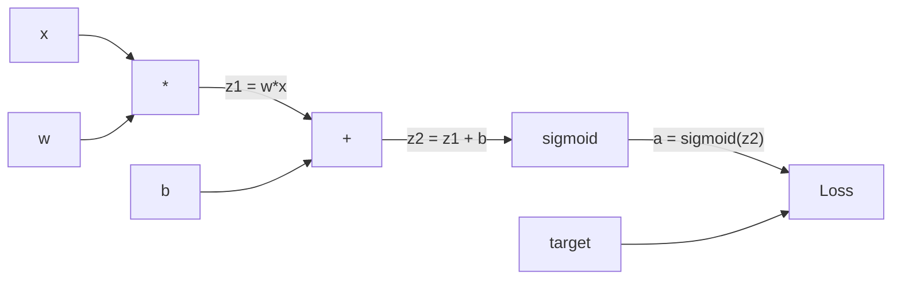
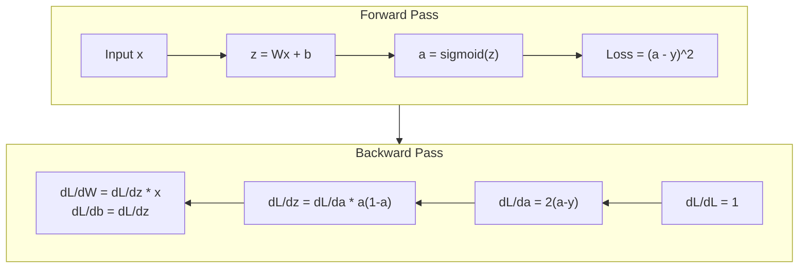
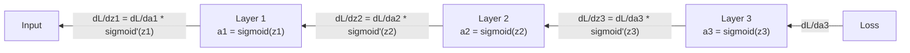

<!-- i18n:manual -->
# Обратное распространение с нуля

> Обратное распространение — алгоритм, который делает обучение возможным. Без него нейросеть просто дорогой генератор случайных чисел.

**Type:** Build
**Languages:** Python
**Prerequisites:** Lesson 03.02 (Multi-Layer Networks)
**Time:** ~120 minutes

## Learning Objectives

- Реализовать движок autograd на классе Value: он строит вычислительный граф и считает градиенты через топологическую сортировку
- Вывести обратный проход для сложения, умножения и sigmoid, опираясь на цепное правило
- Обучить многослойную сеть на XOR и на классификации точек внутри круга, используя только свой движок обратного распространения
- Распознать проблему затухающего градиента в глубоких sigmoid-сетях и объяснить, почему градиенты уменьшаются экспоненциально

> 🎒 **На пальцах.** В прошлом уроке сеть считала ответ. Здесь она впервые учится сама. Весь урок — про один вопрос: «кто виноват в ошибке и насколько». Ответ на него даёт цепное правило, применённое ко всем весам сразу.

## The Problem

У вашей сети один скрытый слой: 768 входов и 3072 выхода. Это 2 359 296 весов. Сеть выдала неверный ответ. Какие веса в этом виноваты? Проверять каждый вес по отдельности — 2,3 миллиона прямых проходов. Обратное распространение считает все 2,3 миллиона градиентов за один обратный проход. Это не оптимизация. Это разница между «обучаемо» и «невозможно».

Наивный подход: взять один вес, сдвинуть его на крошечную величину, снова прогнать прямой проход, посмотреть, выросли потери или упали. Получили градиент для этого веса. Теперь повторите для каждого веса сети. Умножьте на тысячи шагов обучения и миллионы примеров данных. На обучение чего-нибудь полезного ушли бы геологические эпохи.

Обратное распространение решает эту задачу. Один прямой проход, один обратный — все градиенты посчитаны. Фокус в цепном правиле из матанализа, применённом системно к вычислительному графу. Именно этот алгоритм сделал глубокое обучение практичным. Без него мы бы до сих пор возились с игрушечными задачами.

> 🎒 **На пальцах.** Представьте класс из 2,3 миллиона учеников, которые вместе решали одну задачу и ошиблись. Наивный способ — опросить каждого по очереди: 2,3 миллиона разговоров. Обратное распространение опрашивает всех одним объявлением, идя от ответа назад по цепочке. Одна поездка вместо миллионов.

## The Concept

### The Chain Rule, Applied to Networks

Цепное правило вы видели в Phase 01, Lesson 05. Короткое напоминание: если y = f(g(x)), то dy/dx = f'(g(x)) * g'(x). Производные вдоль цепочки перемножаются.

В нейросети «цепочка» — это последовательность операций от входа до потерь. Каждый слой умножает на веса, прибавляет смещения, прогоняет результат через активацию. Функция потерь сравнивает финальный выход с целью. Обратное распространение проходит эту цепочку назад и считает, какой вклад в ошибку внесла каждая операция.

> 🎒 **На пальцах.** Велосипедные передачи. Педали крутятся в 3 раза быстрее заднего колеса, колесо катится в 2 раза быстрее вашей скорости на карте. Хотите узнать, как поворот педали влияет на карту, — просто перемножьте: 3 × 2 = 6. Цепное правило и есть перемножение передаточных чисел. В сети таких «передач» столько же, сколько операций.

### Computational Graphs

Каждый прямой проход строит граф. Каждый узел — операция (умножение, сложение, sigmoid). Каждое ребро несёт значение вперёд и градиент назад.



Прямой проход: значения текут слева направо. x и w дают z1 = w*x. Прибавляем b, получаем z2. Sigmoid даёт активацию a. Сравниваем a с целью y через функцию потерь.

Обратный проход: градиенты текут справа налево. Начинаем с dL/da (как потери меняются от активации). Умножаем на da/dz2 (производная sigmoid). Получаем dL/dz2. Разделяем на dL/db (оно равно dL/dz2, ведь z2 = z1 + b) и dL/dz1. Дальше dL/dw = dL/dz1 * x и dL/dx = dL/dz1 * w.

У каждого узла графа во время обратного прохода ровно одна работа: взять градиент, пришедший сверху, умножить на свою локальную производную и передать вниз.

> 🎒 **На пальцах.** Подставим числа: x = 2, w = 0,5, b = −0,5. Тогда z1 = 1, z2 = 0,5, a = sigmoid(0,5) ≈ 0,622. Если цель y = 1, то dL/da = 2(0,622 − 1) = −0,756, производная sigmoid равна 0,622 × 0,378 ≈ 0,235, значит dL/dz2 ≈ −0,178. Отсюда dL/dw = −0,178 × 2 = −0,356: вес надо увеличить. Весь обратный проход — три умножения.

### Forward vs Backward



Прямой проход сохраняет каждое промежуточное значение: z, a, входы каждого слоя. Обратному проходу эти сохранённые значения нужны, чтобы посчитать градиенты. Это и есть компромисс «память против вычислений» в самом сердце backprop. Вы платите памятью (храните активации) за скорость (один проход вместо миллионов).

> 🎒 **На пальцах.** Как решение задачи в тетради: если записывать только финальный ответ, при проверке придётся всё решать заново. Если сохранены промежуточные строчки, ошибку находишь, просто идя по ним снизу вверх. Активации — это те самые промежуточные строчки, и за них платят оперативной памятью.

### Gradient Flow Through a Network

В трёхслойной сети градиент проходит по цепочке через каждый слой:



На каждом слое градиент умножается на производную sigmoid. Производная sigmoid равна a * (1 - a) и достигает максимума 0.25 (при a = 0.5). На глубине трёх слоёв градиент умножен максимум на 0.25^3 = 0.0156. На глубине десяти слоёв: 0.25^10 = 0.000001.

> 🎒 **На пальцах.** Ксерокопия копии. Каждая перепечатка теряет чёткость: после трёх раз остаётся 1,6% исходного контраста (0,25 × 0,25 × 0,25 = 0,0156), после десяти — миллионная доля. И это ещё лучший случай: 0,25 бывает ровно в одной точке, обычно множитель меньше.

### Vanishing Gradients

Это и есть проблема затухающего градиента. Sigmoid сжимает выход в диапазон от 0 до 1. Его производная всегда меньше 0.25. Сложите достаточно sigmoid-слоёв — и градиенты усохнут до нуля. Ранние слои почти не учатся, потому что до них доходят околонулевые градиенты.

```
sigmoid(z):     Output range [0, 1]
sigmoid'(z):    Max value 0.25 (at z = 0)

After 5 layers:   gradient * 0.25^5 = 0.001x original
After 10 layers:  gradient * 0.25^10 = 0.000001x original
```

Именно поэтому глубокие sigmoid-сети почти невозможно обучить. Лекарство — ReLU и его родственники — тема Lesson 04. Пока запомните: сам backprop работает безупречно. Проблема в том, сквозь что он работает.

> 🎒 **На пальцах.** Посчитайте пять слоёв на калькуляторе: 0,25^5 = 0,000977, то есть примерно одна тысячная. Если первый слой «заслужил» поправку 0,1, до него дойдёт 0,0001. При скорости обучения 1,0 вес сдвинется на одну десятитысячную. Формально сеть учится. Практически первый слой стоит на месте.

### Deriving Gradients for a 2-Layer Network

Конкретная математика для сети со входом x, скрытым слоем с sigmoid, выходным слоем с sigmoid и MSE-потерями.

Forward pass:

```
z1 = W1 * x + b1
a1 = sigmoid(z1)
z2 = W2 * a1 + b2
a2 = sigmoid(z2)
L = (a2 - y)^2
```

Обратный проход (цепное правило шаг за шагом):

```
dL/da2 = 2(a2 - y)
da2/dz2 = a2 * (1 - a2)
dL/dz2 = dL/da2 * da2/dz2 = 2(a2 - y) * a2 * (1 - a2)

dL/dW2 = dL/dz2 * a1
dL/db2 = dL/dz2

dL/da1 = dL/dz2 * W2
da1/dz1 = a1 * (1 - a1)
dL/dz1 = dL/da1 * da1/dz1

dL/dW1 = dL/dz1 * x
dL/db1 = dL/dz1
```

Каждый градиент — произведение локальных производных, прослеженное назад от потерь. Больше в обратном распространении ничего нет.

> 🎒 **На пальцах.** Прогоним числа. Пусть a2 = 0,8, цель y = 1, a1 = 0,5. Тогда dL/da2 = 2(0,8 − 1) = −0,4; da2/dz2 = 0,8 × 0,2 = 0,16; dL/dz2 = −0,4 × 0,16 = −0,064. Дальше dL/dW2 = −0,064 × 0,5 = −0,032, а dL/db2 = −0,064. Минус означает «увеличить вес». Шесть арифметических действий — и обе поправки готовы.

```figure
backprop-vanishing
```

## Build It

### Step 1: The Value Node

Каждое число в наших вычислениях становится Value. Оно хранит своё значение, свой градиент и то, как было создано (чтобы знать, как считать градиенты назад).

```python
class Value:
    def __init__(self, data, children=(), op=''):
        self.data = data
        self.grad = 0.0
        self._backward = lambda: None
        self._children = set(children)
        self._op = op

    def __repr__(self):
        return f"Value(data={self.data:.4f}, grad={self.grad:.4f})"
```

Градиента пока нет (0.0). Обратной функции пока нет (пустышка). Поле `_children` помнит, какие Value породили этот, — чтобы потом топологически отсортировать граф.

### Step 2: Operations with Backward Functions

Каждая операция создаёт новый Value и определяет, как градиенты текут через неё назад.

```python
def __add__(self, other):
    other = other if isinstance(other, Value) else Value(other)
    out = Value(self.data + other.data, (self, other), '+')

    def _backward():
        self.grad += out.grad
        other.grad += out.grad

    out._backward = _backward
    return out

def __mul__(self, other):
    other = other if isinstance(other, Value) else Value(other)
    out = Value(self.data * other.data, (self, other), '*')

    def _backward():
        self.grad += other.data * out.grad
        other.grad += self.data * out.grad

    out._backward = _backward
    return out
```

Для сложения: d(a+b)/da = 1, d(a+b)/db = 1. Значит оба входа получают градиент выхода напрямую.

Для умножения: d(a*b)/da = b, d(a*b)/db = a. Каждый вход получает значение соседа, умноженное на градиент выхода.

`+=` здесь принципиально. Один Value может участвовать в нескольких операциях. Его градиент — сумма градиентов со всех путей.

> 🎒 **На пальцах.** Почему именно `+=`. Возьмите y = a * a при a = 3. Обратный проход дважды прибавляет по 3, итог dL/da = 6 — ровно производная a², то есть 2a. Поставьте вместо `+=` обычное `=` — останется 3, вдвое меньше правды. Как с зарплатой на двух работах: складывать, а не заменять.

### Step 3: Sigmoid and Loss

```python
import math

def sigmoid(self):
    x = self.data
    x = max(-500, min(500, x))
    s = 1.0 / (1.0 + math.exp(-x))
    out = Value(s, (self,), 'sigmoid')

    def _backward():
        self.grad += (s * (1 - s)) * out.grad

    out._backward = _backward
    return out
```

Производная sigmoid: sigmoid(x) * (1 - sigmoid(x)). Значение sigmoid(x) = s мы уже посчитали на прямом проходе. Переиспользуем его. Лишней работы нет.

```python
def mse_loss(predicted, target):
    diff = predicted + Value(-target)
    return diff * diff
```

MSE для одного выхода: (predicted - target)^2. Вычитание выражаем как сложение с отрицательным Value.

> 🎒 **На пальцах.** Sigmoid щедра только в середине: sigmoid(0) = 0,5, производная там 0,25 — максимум. А sigmoid(4) ≈ 0,982, производная уже 0,982 × 0,018 ≈ 0,017. Сигнал почти не проходит. Строка `x = max(-500, min(500, x))` нужна просто чтобы `math.exp` не взорвался на огромных числах.

### Step 4: Backward Pass

Топологическая сортировка гарантирует, что мы обрабатываем узлы в правильном порядке: градиент узла полностью накоплен до того, как мы протолкнём его дальше.

```python
def backward(self):
    topo = []
    visited = set()

    def build_topo(v):
        if v not in visited:
            visited.add(v)
            for child in v._children:
                build_topo(child)
            topo.append(v)

    build_topo(self)
    self.grad = 1.0
    for v in reversed(topo):
        v._backward()
```

Стартуем от потерь (градиент = 1.0, ведь dL/dL = 1). Идём назад по отсортированному графу. Метод `_backward` каждого узла проталкивает градиенты его детям.

> 🎒 **На пальцах.** Как сборка шкафа: нельзя прикрутить дверцу, пока не собран корпус. Топологическая сортировка выстраивает узлы так, что ни один не обрабатывается раньше тех, кто от него зависит. Если бы мы посчитали dL/dw до того, как узел «умножение» получил свой полный градиент, ответ был бы неполным.

### Step 5: Layer and Network

```python
import random

class Neuron:
    def __init__(self, n_inputs):
        scale = (2.0 / n_inputs) ** 0.5
        self.weights = [Value(random.uniform(-scale, scale)) for _ in range(n_inputs)]
        self.bias = Value(0.0)

    def __call__(self, x):
        act = sum((wi * xi for wi, xi in zip(self.weights, x)), self.bias)
        return act.sigmoid()

    def parameters(self):
        return self.weights + [self.bias]


class Layer:
    def __init__(self, n_inputs, n_outputs):
        self.neurons = [Neuron(n_inputs) for _ in range(n_outputs)]

    def __call__(self, x):
        out = [n(x) for n in self.neurons]
        return out[0] if len(out) == 1 else out

    def parameters(self):
        params = []
        for n in self.neurons:
            params.extend(n.parameters())
        return params


class Network:
    def __init__(self, sizes):
        self.layers = []
        for i in range(len(sizes) - 1):
            self.layers.append(Layer(sizes[i], sizes[i + 1]))

    def __call__(self, x):
        for layer in self.layers:
            x = layer(x)
            if not isinstance(x, list):
                x = [x]
        return x[0] if len(x) == 1 else x

    def parameters(self):
        params = []
        for layer in self.layers:
            params.extend(layer.parameters())
        return params

    def zero_grad(self):
        for p in self.parameters():
            p.grad = 0.0
```

Neuron берёт входы, считает взвешенную сумму плюс смещение и применяет sigmoid. Инициализация весов масштабируется как sqrt(2/n_inputs), чтобы sigmoid не насыщался в глубоких сетях. Layer — список нейронов. Network — список слоёв. Метод `parameters()` собирает все обучаемые Value, чтобы их можно было обновлять.

> 🎒 **На пальцах.** Посчитайте параметры сети `Network([2, 4, 1])`: скрытый слой — 4 нейрона по 2 веса и 1 смещение, это 12; выходной — 1 нейрон на 4 веса и 1 смещение, это 5. Всего 17 чисел, которые сеть подбирает сама. Для нейрона с 2 входами `scale` = sqrt(2/2) = 1,0, для нейрона с 4 входами — sqrt(0,5) ≈ 0,707: чем больше входов, тем скромнее стартовые веса.

### Step 6: Train on XOR

```python
random.seed(42)
net = Network([2, 4, 1])

xor_data = [
    ([0.0, 0.0], 0.0),
    ([0.0, 1.0], 1.0),
    ([1.0, 0.0], 1.0),
    ([1.0, 1.0], 0.0),
]

learning_rate = 1.0

for epoch in range(1000):
    total_loss = Value(0.0)
    for inputs, target in xor_data:
        x = [Value(i) for i in inputs]
        pred = net(x)
        loss = mse_loss(pred, target)
        total_loss = total_loss + loss

    net.zero_grad()
    total_loss.backward()

    for p in net.parameters():
        p.data -= learning_rate * p.grad

    if epoch % 100 == 0:
        print(f"Epoch {epoch:4d} | Loss: {total_loss.data:.6f}")

print("\nXOR Results:")
for inputs, target in xor_data:
    x = [Value(i) for i in inputs]
    pred = net(x)
    print(f"  {inputs} -> {pred.data:.4f} (expected {target})")
```

Смотрите, как падают потери. От случайных предсказаний к правильным ответам XOR — и всё это делает обратное распространение, считая градиенты и подталкивая веса в нужную сторону.

> 🎒 **На пальцах.** В начале сеть отвечает примерно 0,5 на всё, то есть «не знаю». Потери на четырёх примерах тогда 4 × (0,5)² = 1,0. Обученная сеть выдаёт что-то вроде 0,03 и 0,97, и потери падают примерно до 4 × 0,03² ≈ 0,004 — в двести с лишним раз меньше. Никто не подбирал 17 весов руками.

### Step 7: Circle Classification

В Lesson 02 вы подбирали веса для классификации круга вручную. Теперь пусть сеть выучит их сама.

```python
random.seed(7)

def generate_circle_data(n=100):
    data = []
    for _ in range(n):
        x1 = random.uniform(-1.5, 1.5)
        x2 = random.uniform(-1.5, 1.5)
        label = 1.0 if x1 * x1 + x2 * x2 < 1.0 else 0.0
        data.append(([x1, x2], label))
    return data

circle_data = generate_circle_data(80)

circle_net = Network([2, 8, 1])
learning_rate = 0.5

for epoch in range(2000):
    random.shuffle(circle_data)
    total_loss_val = 0.0
    for inputs, target in circle_data:
        x = [Value(i) for i in inputs]
        pred = circle_net(x)
        loss = mse_loss(pred, target)
        circle_net.zero_grad()
        loss.backward()
        for p in circle_net.parameters():
            p.data -= learning_rate * p.grad
        total_loss_val += loss.data

    if epoch % 200 == 0:
        correct = 0
        for inputs, target in circle_data:
            x = [Value(i) for i in inputs]
            pred = circle_net(x)
            predicted_class = 1.0 if pred.data > 0.5 else 0.0
            if predicted_class == target:
                correct += 1
        accuracy = correct / len(circle_data) * 100
        print(f"Epoch {epoch:4d} | Loss: {total_loss_val:.4f} | Accuracy: {accuracy:.1f}%")
```

Здесь мы используем онлайновый SGD — обновляем веса после каждого примера, а не копим полный батч. Так быстрее ломается симметрия и не наступает насыщение sigmoid на всём ландшафте потерь. Перемешивание данных на каждой эпохе не даёт сети запомнить порядок.

> 🎒 **На пальцах.** Точки бросаются в квадрат 3 на 3 (площадь 9), а класс 1 получают попавшие в круг радиуса 1 (площадь ≈ 3,14). То есть примерно 35% точек внутри — сеть, отвечающая всегда «ноль», даст около 65% точности. Всё, что выше, — уже настоящая выученная граница. За 2000 эпох по 80 точек происходит 160 000 обновлений весов.

## Use It

PyTorch делает всё вышеописанное в несколько строк. Идея та же: autograd строит вычислительный граф во время прямого прохода и обходит его назад, чтобы посчитать градиенты.

```python
import torch
import torch.nn as nn

model = nn.Sequential(
    nn.Linear(2, 4),
    nn.Sigmoid(),
    nn.Linear(4, 1),
    nn.Sigmoid(),
)
optimizer = torch.optim.SGD(model.parameters(), lr=1.0)
criterion = nn.MSELoss()

X = torch.tensor([[0,0],[0,1],[1,0],[1,1]], dtype=torch.float32)
y = torch.tensor([[0],[1],[1],[0]], dtype=torch.float32)

for epoch in range(1000):
    pred = model(X)
    loss = criterion(pred, y)
    optimizer.zero_grad()
    loss.backward()
    optimizer.step()

print("PyTorch XOR Results:")
with torch.no_grad():
    for i in range(4):
        pred = model(X[i])
        print(f"  {X[i].tolist()} -> {pred.item():.4f} (expected {y[i].item()})")
```

`loss.backward()` — это ваш `total_loss.backward()`. `optimizer.step()` — это ваш ручной `p.data -= lr * p.grad`. `optimizer.zero_grad()` — это ваш `net.zero_grad()`. Тот же алгоритм, промышленная реализация. PyTorch берёт на себя ускорение на GPU, смешанную точность, gradient checkpointing и сотни типов слоёв. Но обратный проход — то же самое цепное правило на том же вычислительном графе.

Обучение прогоняет прямой проход, потом обратный, потом обновляет веса. Инференс прогоняет только прямой проход. Никаких градиентов, никаких обновлений. Это различие важно, потому что в продакшене происходит именно инференс. Когда вы вызываете API вроде Claude или GPT, работает инференс: ваш промпт течёт вперёд по сети, а с другого конца выходят токены. Веса не меняются. Понимать backprop нужно потому, что именно он сформировал каждый вес в этой сети.

> 🎒 **На пальцах.** Три строки PyTorch — это ровно ваш код, только чужими руками. `zero_grad` — стереть прошлые пометки, `backward` — разослать вину по всем весам, `step` — сделать шаг. Забудете `zero_grad` — градиенты сложатся с прошлым шагом, и сеть поедет вдвое дальше, чем надо. Это самая частая ошибка новичка в PyTorch.

## Ship It

Этот урок производит:
- `outputs/prompt-gradient-debugger.md` -- переиспользуемый промпт для диагностики проблем с градиентами (затухание, взрыв, NaN) в любой нейросети

## Exercises

1. Добавьте методу Value метод `__sub__` (a - b = a + (-1 * b)). Затем реализуйте `__neg__`. Проверьте правильность градиентов, сравнив с ручным расчётом для простого выражения вроде (a - b)^2.

2. Добавьте Value метод `relu` (выход max(0, x), производная 1 при x > 0, иначе 0). Замените sigmoid на relu в скрытых слоях и снова обучите сеть на XOR. Сравните скорость сходимости. Обучение должно пойти быстрее — это анонс Lesson 04.

3. Реализуйте метод `__pow__` для целых степеней. Используйте его, чтобы заменить `mse_loss` на честное выражение `(predicted - target) ** 2`. Проверьте, что градиенты совпадают с исходной реализацией.

4. Добавьте в цикл обучения обрезку градиентов: после вызова `backward()` ограничьте все градиенты диапазоном [-1, 1]. Обучите более глубокую сеть (4+ слоя с sigmoid) и сравните кривые потерь с обрезкой и без. Это ваша первая защита от взрывающихся градиентов.

5. Сделайте визуализацию: после обучения на XOR распечатайте градиент каждого параметра сети. Найдите слой с самыми маленькими градиентами. Так вы своими глазами увидите проблему затухающего градиента из раздела Concept.

> 🎒 **На пальцах.** Подсказка ко второму заданию: производная relu для положительных входов равна ровно 1, а у sigmoid максимум 0,25. На двух слоях это уже разница в 1 / 0,25² = 16 раз в пользу relu. Поэтому сеть на relu доберётся до тех же потерь за заметно меньшее число эпох — и вы увидите это на печати в консоли.

## Key Terms

| Term | What people say | What it actually means |
|------|----------------|----------------------|
| Backpropagation | «Сеть учится» | Алгоритм, вычисляющий dL/dw для каждого веса применением цепного правила назад по вычислительному графу |
| Computational graph | «Структура сети» | Направленный ациклический граф: узлы — операции, рёбра несут значения вперёд и градиенты назад |
| Chain rule | «Перемножить производные» | Если y = f(g(x)), то dy/dx = f'(g(x)) * g'(x) — математический фундамент обратного распространения |
| Gradient | «Направление наискорейшего роста» | Частная производная потерь по параметру: говорит, как изменить этот параметр, чтобы потери уменьшились |
| Vanishing gradient | «Глубокие сети не учатся» | Градиенты убывают экспоненциально, проходя через слои с насыщающимися активациями вроде sigmoid |
| Forward pass | «Запуск сети» | Вычисление выхода из входов последовательным применением операций каждого слоя с сохранением промежуточных значений |
| Backward pass | «Вычисление градиентов» | Обход вычислительного графа в обратном порядке с накоплением градиентов в каждом узле по цепному правилу |
| Learning rate | «Насколько быстро учится» | Скаляр, задающий размер шага при обновлении весов: w_new = w_old - lr * gradient |
| Topological sort | «Правильный порядок» | Порядок узлов графа, при котором узел идёт после всех, от кого он зависит, — гарантирует полное накопление градиентов до их проталкивания дальше |
| Autograd | «Автоматическое дифференцирование» | Система, которая строит вычислительный граф во время прямого прохода и сама считает градиенты — то, что делает движок PyTorch |

## Further Reading

- Rumelhart, Hinton & Williams, "Learning representations by back-propagating errors" (1986) -- статья, которая ввела обратное распространение в широкий оборот и открыла обучение многослойных сетей
- 3Blue1Brown, "Neural Networks" series (https://www.youtube.com/playlist?list=PLZHQObOWTQDNU6R1_67000Dx_ZCJB-3pi) -- лучшее визуальное объяснение обратного распространения и того, как градиенты текут по сети
