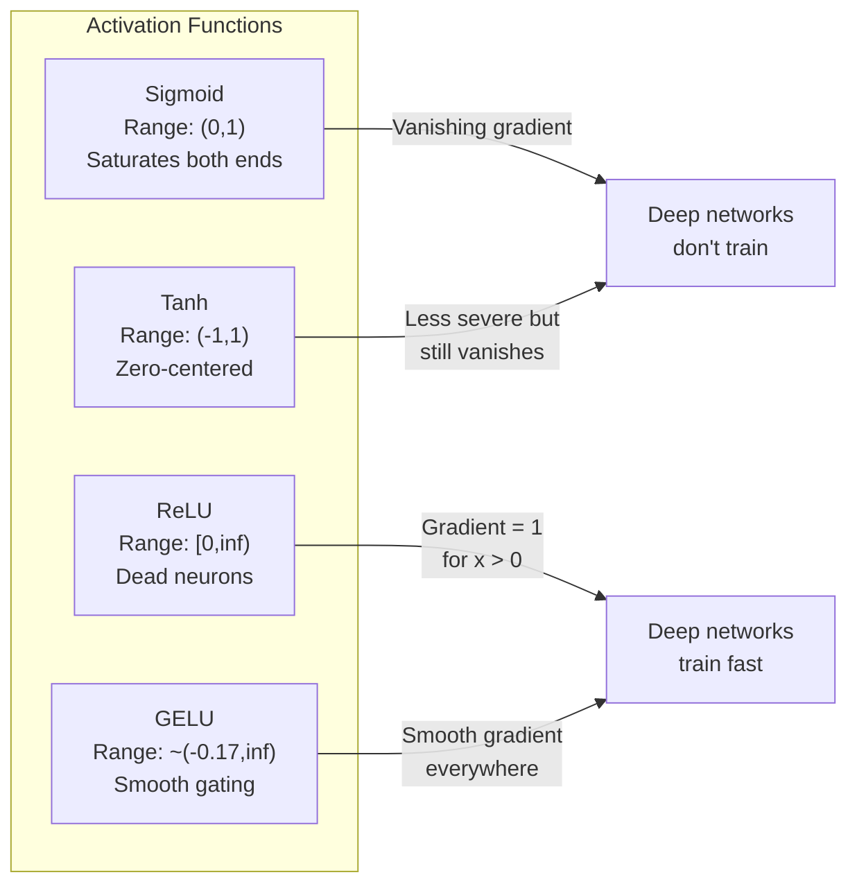
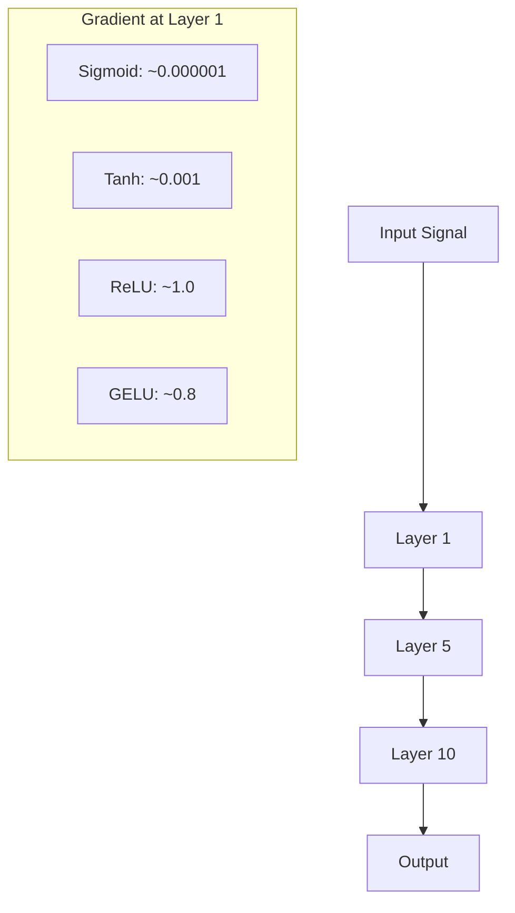
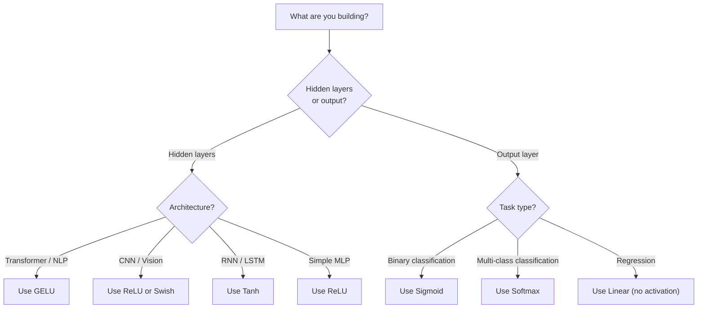

<!-- i18n:manual -->
# Функции активации

> Без нелинейности ваша сеть из 100 слоёв — это нарядное умножение матриц. Активации — те ворота, через которые нейросеть учится мыслить кривыми.

**Type:** Build
**Languages:** Python
**Prerequisites:** Lesson 03.03 (Backpropagation)
**Time:** ~75 minutes

## Learning Objectives

- Реализовать с нуля sigmoid, tanh, ReLU, Leaky ReLU, GELU, Swish и softmax вместе с их производными
- Диагностировать проблему затухающего градиента, измеряя величину активаций на 10+ слоях с разными активациями
- Обнаружить мёртвые нейроны в ReLU-сети и объяснить, почему GELU не страдает этой болезнью
- Выбрать правильную функцию активации для конкретной архитектуры (transformer, CNN, RNN, выходной слой)

> 🎒 **На пальцах.** Активация — одна строчка кода на слой, но именно она решает, будет сеть учиться или нет. В этом уроке вы напишете семь таких строчек и своими глазами увидите разницу: на одной и той же задаче sigmoid доходит до 97,5% точности, а ReLU и GELU — до 99,5%.

## The Problem

Сложите два линейных преобразования: y = W2(W1x + b1) + b2. Раскройте скобки: y = W2W1x + W2b1 + b2. Это просто y = Ax + c — одно линейное преобразование. Сколько линейных слоёв ни складывай, результат схлопывается в одно умножение матриц. У вашей сети из 100 слоёв ровно та же выразительная сила, что у одного слоя.

Это не теоретический курьёз. Это значит, что глубокая линейная сеть буквально не может выучить XOR, не может классифицировать спираль, не может узнать лицо. Без функций активации глубина — иллюзия.

Функции активации ломают линейность. Они прогоняют выход каждого слоя через нелинейную функцию, и сеть получает способность изгибать границы решений, приближать произвольные функции и вообще учиться. Но выберите не ту активацию — и градиенты затухнут до нуля (sigmoid в глубоких сетях), взорвутся до бесконечности (неограниченные активации без аккуратной инициализации) или нейроны умрут навсегда (ReLU с большими отрицательными смещениями). Выбор функции активации напрямую решает, будет ли ваша сеть учиться вообще.

> 🎒 **На пальцах.** Линейный слой умеет только растягивать и сдвигать — прямая остаётся прямой. Сколько бы вы ни сгибали линейку через другие линейки, она не станет окружностью. Активация — это шарнир. Один шарнир — и «линейка» уже гнётся, а из восьми таких изломов сеть складывает почти идеальный круг.

## The Concept

### Why Nonlinearity Is Necessary

Умножение матриц композиционно. Умножить вектор на матрицу A, а потом на B — то же самое, что умножить на AB. Значит, стопка из десяти линейных слоёв математически равна одному линейному слою с одной большой матрицей. Все эти параметры, вся эта глубина — впустую. Нужно что-то, что разорвёт цепочку. Именно это делают функции активации.

Вот доказательство. Линейный слой считает f(x) = Wx + b. Сложим два:

```
Layer 1: h = W1 * x + b1
Layer 2: y = W2 * h + b2
```

Подставим:

```
y = W2 * (W1 * x + b1) + b2
y = (W2 * W1) * x + (W2 * b1 + b2)
y = A * x + c
```

Один слой. Вставим между слоями нелинейную активацию g():

```
h = g(W1 * x + b1)
y = W2 * h + b2
```

Теперь подстановка не проходит. W2 * g(W1 * x + b1) + b2 нельзя свести к одному линейному преобразованию. Сеть способна представлять нелинейные функции. Каждый новый слой с активацией добавляет выразительной силы.

> 🎒 **На пальцах.** Числа: W1 = 2, b1 = 1, W2 = 3, b2 = 0. Тогда y = 3 × (2x + 1) = 6x + 3. Два слоя, шесть параметров — а работает как один слой с A = 6 и c = 3. Обучили миллион весов, получили две полезные цифры. Вот что такое сеть без активаций.

### Sigmoid

Первая функция активации в нейросетях.

```
sigmoid(x) = 1 / (1 + e^(-x))
```

Диапазон выхода: (0, 1). Гладкая, дифференцируемая, переводит любое вещественное число в нечто похожее на вероятность.

Производная:

```
sigmoid'(x) = sigmoid(x) * (1 - sigmoid(x))
```

Максимум этой производной равен 0.25 и достигается при x = 0. В обратном распространении градиенты перемножаются по слоям. Десять слоёв sigmoid означают, что градиент умножается максимум на 0.25 десять раз:

```
0.25^10 = 0.000000953674
```

Меньше одной миллионной от исходного сигнала. Это и есть проблема затухающего градиента. Градиенты в ранних слоях становятся такими маленькими, что веса почти не обновляются. Кажется, что сеть учится — потери падают за счёт поздних слоёв, — но первые слои заморожены. Глубокие sigmoid-сети попросту не обучаются.

Ещё одна беда: выходы sigmoid всегда положительны (от 0 до 1), поэтому градиенты весов всегда одного знака. Из-за этого градиентный спуск идёт зигзагом.

> 🎒 **На пальцах.** Посмотрите, как быстро sigmoid «глохнет»: sigmoid(0) = 0,5 и производная там максимальная — 0,25. А sigmoid(6) ≈ 0,9975, производная 0,9975 × 0,0025 ≈ 0,0025 — в сто раз меньше. Стоит входу отойти от нуля на шесть шагов, и нейрон перестаёт слушать обучение.

### Tanh

Отцентрированная версия sigmoid.

```
tanh(x) = (e^x - e^(-x)) / (e^x + e^(-x))
```

Диапазон выхода: (-1, 1). Центрирован в нуле, что убирает проблему зигзага.

Производная:

```
tanh'(x) = 1 - tanh(x)^2
```

Максимум производной — 1.0 при x = 0, в четыре раза лучше, чем у sigmoid. Но проблема затухающего градиента никуда не делась. При больших положительных или отрицательных входах производная стремится к нулю. Десять слоёв всё равно давят градиент, просто менее свирепо.

> 🎒 **На пальцах.** В нуле tanh отдаёт градиент целиком: производная 1,0, сигнал проходит без потерь. Но уже при x = 2 получаем tanh(2) ≈ 0,964, производная 1 − 0,964² ≈ 0,071. Это в 14 раз слабее. Tanh честнее sigmoid ровно в узкой полоске около нуля.

### ReLU: The Breakthrough

Rectified Linear Unit. Для глубокого обучения его популяризовали Наир и Хинтон в 2010 году (сама функция восходит к работе Фукусимы 1969 года), и он изменил всё.

```
relu(x) = max(0, x)
```

Диапазон выхода: [0, бесконечность). Производная до неприличия проста:

```
relu'(x) = 1  if x > 0
            0  if x <= 0
```

Для положительных входов затухания нет вовсе. Градиент равен ровно 1 и проходит насквозь. Именно поэтому глубокие сети стали обучаемыми: ReLU сохраняет величину градиента при проходе через слои.

Но есть и слабое место — проблема мёртвого нейрона. Если взвешенный вход нейрона всегда отрицателен (из-за большого отрицательного смещения или неудачной инициализации весов), его выход всегда ноль, градиент всегда ноль, и он никогда не обновляется. Он мёртв навсегда. На практике во время обучения умирает от 10 до 40% нейронов ReLU-сети.

> 🎒 **На пальцах.** Сравните множители на десяти слоях: у sigmoid лучший случай 0,25^10 ≈ 0,00000095, у ReLU для положительных входов 1^10 = 1. Ровно единица, сигнал не потерял ничего. Плата за это — половина области определения: relu'(−3) = 0, и нейрон, у которого вход всегда отрицательный, выключен навсегда.

### Leaky ReLU

Простейшее лекарство от мёртвых нейронов.

```
leaky_relu(x) = x        if x > 0
                alpha * x if x <= 0
```

Где alpha — маленькая константа, обычно 0.01. У отрицательной стороны небольшой наклон вместо нуля, поэтому мёртвые нейроны всё же получают градиентный сигнал и могут ожить.

### GELU: The Modern Default

Gaussian Error Linear Unit. Представлен Хендриксом и Гимпелом в 2016 году. Активация по умолчанию в BERT, GPT и большинстве современных трансформеров.

```
gelu(x) = x * Phi(x)
```

Где Phi(x) — функция распределения стандартного нормального закона. Приближение, которое используют на практике:

```
gelu(x) ~= 0.5 * x * (1 + tanh(sqrt(2/pi) * (x + 0.044715 * x^3)))
```

GELU гладкая всюду, допускает небольшие отрицательные значения (в отличие от ReLU, который жёстко режет в ноль) и имеет вероятностную интерпретацию: она взвешивает каждый вход тем, насколько вероятно, что он положителен при гауссовом распределении. Это мягкое «шлюзование» обгоняет ReLU в трансформерах, потому что даёт лучший поток градиента и полностью снимает проблему мёртвых нейронов.

> 🎒 **На пальцах.** Разница на числах: relu(−1) = 0 — нейрон молчит, градиент ноль. А gelu(−1) ≈ −0,159 — тихий, но живой сигнал, и производная там не ноль. Минимум GELU около −0,17 (примерно при x = −0,75), дальше кривая плавно поднимается к нулю. Не выключатель, а плавный регулятор громкости.

### Swish / SiLU

Самошлюзующаяся активация, найденная Рамачандраном и соавторами в 2017 году автоматическим поиском.

```
swish(x) = x * sigmoid(x)
```

Формально Swish — это x * sigmoid(x). Google нашёл её автоматическим поиском по пространству функций активации: нейросеть проектирует детали нейросетей.

Как и GELU, она гладкая, немонотонная и допускает небольшие отрицательные значения. Разница тонкая: Swish шлюзует через sigmoid, а GELU — через функцию распределения Гаусса. На практике качество почти одинаковое. Swish применяется в EfficientNet и части моделей зрения. В языковых моделях доминирует GELU.

### Softmax: The Output Activation

В скрытых слоях не используется. Softmax превращает вектор сырых оценок (логитов) в распределение вероятностей.

```
softmax(x_i) = e^(x_i) / sum(e^(x_j) for all j)
```

Каждый выход лежит между 0 и 1. Все выходы в сумме дают 1. Поэтому softmax — стандартная финальная активация для многоклассовой классификации. Наибольший логит получает наибольшую вероятность, но, в отличие от argmax, softmax дифференцируем и сохраняет информацию об относительной уверенности.

> 🎒 **На пальцах.** Возьмите логиты [2, 1, 0]. Экспоненты: 7,389, 2,718 и 1,0, сумма 11,107. Делим: 0,665, 0,245, 0,090 — в сумме ровно 1. Обратите внимание, что разрыв 2 против 1 превратился в 66,5% против 24,5%: softmax усиливает лидера, но не обнуляет остальных.

### Comparison of Shapes



### Gradient Flow Comparison



### Which Activation When



```figure
softmax-temperature
```

> 🎒 **На пальцах.** Всю схему можно свернуть в четыре строчки. Трансформер — GELU. Свёрточная сеть — ReLU. Два класса на выходе — sigmoid. Много классов на выходе — softmax. Регрессия — вообще ничего. Начинайте отсюда и меняйте только тогда, когда у вас есть измеренная причина.

## Build It

### Step 1: Implement All Activation Functions with Derivatives

Каждая функция принимает одно число с плавающей точкой и возвращает число. Каждая функция-производная принимает тот же вход и возвращает градиент.

```python
import math

def sigmoid(x):
    x = max(-500, min(500, x))
    return 1.0 / (1.0 + math.exp(-x))

def sigmoid_derivative(x):
    s = sigmoid(x)
    return s * (1 - s)

def tanh_act(x):
    return math.tanh(x)

def tanh_derivative(x):
    t = math.tanh(x)
    return 1 - t * t

def relu(x):
    return max(0.0, x)

def relu_derivative(x):
    return 1.0 if x > 0 else 0.0

def leaky_relu(x, alpha=0.01):
    return x if x > 0 else alpha * x

def leaky_relu_derivative(x, alpha=0.01):
    return 1.0 if x > 0 else alpha

def gelu(x):
    return 0.5 * x * (1 + math.tanh(math.sqrt(2 / math.pi) * (x + 0.044715 * x ** 3)))

def gelu_derivative(x):
    phi = 0.5 * (1 + math.erf(x / math.sqrt(2)))
    pdf = math.exp(-0.5 * x * x) / math.sqrt(2 * math.pi)
    return phi + x * pdf

def swish(x):
    return x * sigmoid(x)

def swish_derivative(x):
    s = sigmoid(x)
    return s + x * s * (1 - s)

def softmax(xs):
    max_x = max(xs)
    exps = [math.exp(x - max_x) for x in xs]
    total = sum(exps)
    return [e / total for e in exps]
```

> 🎒 **На пальцах.** Проверьте пару значений руками. relu(1) = 1, а gelu(1) ≈ 0,841: GELU чуть придерживает даже положительный сигнал. relu(−1) = 0, gelu(−1) ≈ −0,159. Заметьте также, что `softmax` вычитает `max_x` перед экспонентой — это не математика, а защита от переполнения: e^1000 в Python просто упадёт с ошибкой.

### Step 2: Visualize Where Gradients Die

Посчитайте градиент в 100 равномерно расположенных точках от -5 до 5. Распечатайте текстовую гистограмму, показывающую, где градиент каждой активации близок к нулю.

```python
def gradient_scan(name, derivative_fn, start=-5, end=5, n=100):
    step = (end - start) / n
    near_zero = 0
    healthy = 0
    for i in range(n):
        x = start + i * step
        g = derivative_fn(x)
        if abs(g) < 0.01:
            near_zero += 1
        else:
            healthy += 1
    pct_dead = near_zero / n * 100
    print(f"{name:15s}: {healthy:3d} healthy, {near_zero:3d} near-zero ({pct_dead:.0f}% dead zone)")

gradient_scan("Sigmoid", sigmoid_derivative)
gradient_scan("Tanh", tanh_derivative)
gradient_scan("ReLU", relu_derivative)
gradient_scan("Leaky ReLU", leaky_relu_derivative)
gradient_scan("GELU", gelu_derivative)
gradient_scan("Swish", swish_derivative)
```

> 🎒 **На пальцах.** Вот что печатает этот код: Sigmoid — 9 мёртвых точек из 100, Tanh — 41, ReLU — 51, Leaky ReLU — 0, GELU — 20, Swish — 1. У ReLU ровно половина отрезка мертва, потому что вся отрицательная половина даёт производную 0. А у Leaky ReLU там 0,01 — крошечный, но живой градиент, поэтому ноль мёртвых точек.

### Step 3: Vanishing Gradient Experiment

Прогоните сигнал вперёд через N слоёв с sigmoid и с ReLU. Измерьте, как меняется величина активации.

```python
import random

def vanishing_gradient_experiment(activation_fn, name, n_layers=10, n_inputs=5):
    random.seed(42)
    values = [random.gauss(0, 1) for _ in range(n_inputs)]

    print(f"\n{name} through {n_layers} layers:")
    for layer in range(n_layers):
        weights = [random.gauss(0, 1) for _ in range(n_inputs)]
        z = sum(w * v for w, v in zip(weights, values))
        activated = activation_fn(z)
        magnitude = abs(activated)
        bar = "#" * int(magnitude * 20)
        print(f"  Layer {layer+1:2d}: magnitude = {magnitude:.6f} {bar}")
        values = [activated] * n_inputs

vanishing_gradient_experiment(sigmoid, "Sigmoid")
vanishing_gradient_experiment(relu, "ReLU")
vanishing_gradient_experiment(gelu, "GELU")
```

> 🎒 **На пальцах.** Результат неожиданный: у sigmoid величина держится около 0,5–0,67 все десять слоёв, а у ReLU падает с 0,021 на первом слое до 0,000000 на шестом. Дело в том, что sigmoid всегда выдаёт что-то около 0,5 — сигнал «есть», но информации в нём нет. ReLU честно показывает, что сигнал угас. Затухают тут не градиенты, а сам сигнал, и лечится это масштабом начальных весов — тема следующего урока про инициализацию.

### Step 4: Dead Neuron Detector

Создайте ReLU-сеть, прогоните через неё случайные входы, посчитайте, сколько нейронов ни разу не сработало.

```python
def dead_neuron_detector(n_inputs=5, hidden_size=20, n_samples=1000):
    random.seed(0)
    weights = [[random.gauss(0, 1) for _ in range(n_inputs)] for _ in range(hidden_size)]
    biases = [random.gauss(0, 1) for _ in range(hidden_size)]

    fire_counts = [0] * hidden_size

    for _ in range(n_samples):
        inputs = [random.gauss(0, 1) for _ in range(n_inputs)]
        for neuron_idx in range(hidden_size):
            z = sum(w * x for w, x in zip(weights[neuron_idx], inputs)) + biases[neuron_idx]
            if relu(z) > 0:
                fire_counts[neuron_idx] += 1

    dead = sum(1 for c in fire_counts if c == 0)
    rarely_fire = sum(1 for c in fire_counts if 0 < c < n_samples * 0.05)
    healthy = hidden_size - dead - rarely_fire

    print(f"\nDead Neuron Report ({hidden_size} neurons, {n_samples} samples):")
    print(f"  Dead (never fired):     {dead}")
    print(f"  Barely alive (<5%):     {rarely_fire}")
    print(f"  Healthy:                {healthy}")
    print(f"  Dead neuron rate:       {dead/hidden_size*100:.1f}%")

    for i, c in enumerate(fire_counts):
        status = "DEAD" if c == 0 else "WEAK" if c < n_samples * 0.05 else "OK"
        bar = "#" * (c * 40 // n_samples)
        print(f"  Neuron {i:2d}: {c:4d}/{n_samples} fires [{status:4s}] {bar}")

dead_neuron_detector()
```

> 🎒 **На пальцах.** На этих настройках отчёт получается благополучным: 0 мёртвых из 20, все нейроны срабатывают от 187 до 750 раз из 1000. Так и должно быть при смещениях из нормального распределения с нулевым средним. Поставьте `biases = [-5.0] * hidden_size` — и почти все 20 нейронов уйдут в DEAD: смещение −5 перевешивает случайный вход, z всегда отрицателен, relu(z) всегда ноль.

### Step 5: Training Comparison -- Sigmoid vs ReLU vs GELU

Обучите одну и ту же двухслойную сеть на датасете с кругом (точки внутри круга — класс 1, снаружи — класс 0) с тремя разными активациями. Сравните скорость сходимости.

```python
def make_circle_data(n=200, seed=42):
    random.seed(seed)
    data = []
    for _ in range(n):
        x = random.uniform(-2, 2)
        y = random.uniform(-2, 2)
        label = 1.0 if x * x + y * y < 1.5 else 0.0
        data.append(([x, y], label))
    return data


class ActivationNetwork:
    def __init__(self, activation_fn, activation_deriv, hidden_size=8, lr=0.1):
        random.seed(0)
        self.act = activation_fn
        self.act_d = activation_deriv
        self.lr = lr
        self.hidden_size = hidden_size

        self.w1 = [[random.gauss(0, 0.5) for _ in range(2)] for _ in range(hidden_size)]
        self.b1 = [0.0] * hidden_size
        self.w2 = [random.gauss(0, 0.5) for _ in range(hidden_size)]
        self.b2 = 0.0

    def forward(self, x):
        self.x = x
        self.z1 = []
        self.h = []
        for i in range(self.hidden_size):
            z = self.w1[i][0] * x[0] + self.w1[i][1] * x[1] + self.b1[i]
            self.z1.append(z)
            self.h.append(self.act(z))

        self.z2 = sum(self.w2[i] * self.h[i] for i in range(self.hidden_size)) + self.b2
        self.out = sigmoid(self.z2)
        return self.out

    def backward(self, target):
        error = self.out - target
        d_out = error * self.out * (1 - self.out)

        for i in range(self.hidden_size):
            d_h = d_out * self.w2[i] * self.act_d(self.z1[i])
            self.w2[i] -= self.lr * d_out * self.h[i]
            for j in range(2):
                self.w1[i][j] -= self.lr * d_h * self.x[j]
            self.b1[i] -= self.lr * d_h
        self.b2 -= self.lr * d_out

    def train(self, data, epochs=200):
        losses = []
        for epoch in range(epochs):
            total_loss = 0
            correct = 0
            for x, y in data:
                pred = self.forward(x)
                self.backward(y)
                total_loss += (pred - y) ** 2
                if (pred >= 0.5) == (y >= 0.5):
                    correct += 1
            avg_loss = total_loss / len(data)
            accuracy = correct / len(data) * 100
            losses.append(avg_loss)
            if epoch % 50 == 0 or epoch == epochs - 1:
                print(f"    Epoch {epoch:3d}: loss={avg_loss:.4f}, accuracy={accuracy:.1f}%")
        return losses


data = make_circle_data()

configs = [
    ("Sigmoid", sigmoid, sigmoid_derivative),
    ("ReLU", relu, relu_derivative),
    ("GELU", gelu, gelu_derivative),
]

results = {}
for name, act_fn, act_d_fn in configs:
    print(f"\n=== Training with {name} ===")
    net = ActivationNetwork(act_fn, act_d_fn, hidden_size=8, lr=0.1)
    losses = net.train(data, epochs=200)
    results[name] = losses

print("\n=== Final Loss Comparison ===")
for name, losses in results.items():
    print(f"  {name:10s}: start={losses[0]:.4f} -> end={losses[-1]:.4f} (improvement: {(1 - losses[-1]/losses[0])*100:.1f}%)")
```

> 🎒 **На пальцах.** Итоговые цифры: sigmoid — потери 0,2222 → 0,0319 и 97,5% точности, ReLU — 0,2232 → 0,0102 и 99,5%, GELU — 0,2225 → 0,0056 и 99,5%. Все стартуют одинаково, но у sigmoid к 50-й эпохе потери ещё 0,169, а у ReLU уже 0,021 — в восемь раз меньше. Одна строчка кода, восьмикратная разница в скорости.

## Use It

PyTorch предоставляет всё это и как функции, и как модули:

```python
import torch
import torch.nn as nn
import torch.nn.functional as F

x = torch.randn(4, 10)

relu_out = F.relu(x)
gelu_out = F.gelu(x)
sigmoid_out = torch.sigmoid(x)
swish_out = F.silu(x)

logits = torch.randn(4, 5)
probs = F.softmax(logits, dim=1)

model = nn.Sequential(
    nn.Linear(10, 64),
    nn.GELU(),
    nn.Linear(64, 32),
    nn.GELU(),
    nn.Linear(32, 5),
)
```

Скрытые слои в трансформере — GELU. Скрытые слои в CNN — ReLU. Выходной слой для классификации — softmax. Выходной слой для регрессии — ничего (линейный). Выходной слой для вероятностей — sigmoid. Вот и всё. Начинайте с этих значений по умолчанию. Меняйте, только когда у вас есть доказательства.

RNN и LSTM используют tanh для скрытого состояния и sigmoid для вентилей, но если вы строите что-то с нуля сегодня, вы, скорее всего, не берёте RNN. Если в вашей ReLU-сети умирают нейроны, переходите на GELU. Не хватайтесь за Leaky ReLU без конкретной причины: GELU решает проблему мёртвых нейронов и даёт лучший поток градиента.

> 🎒 **На пальцах.** Обратите внимание на `F.silu` — это и есть Swish, просто под официальным именем SiLU. И на `F.softmax(logits, dim=1)`: параметр `dim=1` говорит «нормировать по 5 классам внутри каждой из 4 строк». Ошибётесь с `dim` — вероятности сложатся в 1 не там, где нужно, и код при этом не упадёт.

## Ship It

Этот урок производит:
- `outputs/prompt-activation-selector.md` -- переиспользуемый промпт, который помогает подобрать правильную функцию активации для любой архитектуры

## Exercises

1. Реализуйте Parametric ReLU (PReLU), где отрицательный наклон alpha — обучаемый параметр. Обучите его на датасете с кругом и сравните с фиксированным Leaky ReLU.

2. Запустите эксперимент с затухающим градиентом на 50 слоях вместо 10. Постройте график величины на каждом слое для sigmoid, tanh, ReLU и GELU. На каком слое сигнал каждой активации фактически падает до нуля?

3. Реализуйте ELU (Exponential Linear Unit): elu(x) = x при x > 0 и alpha * (e^x - 1) при x <= 0. Сравните долю мёртвых нейронов с ReLU на той же сети.

4. Соберите «монитор здоровья градиентов», работающий во время обучения: на каждой эпохе считайте среднюю величину градиента по каждому слою. Печатайте предупреждение, когда градиент любого слоя опускается ниже 0.001 или превышает 100.

5. Переделайте сравнение обучения так, чтобы использовался датасет XOR из Lesson 01 вместо круга. Какая активация сходится на XOR быстрее всех? Почему результат отличается от эксперимента с кругом?

> 🎒 **На пальцах.** Подсказка к третьему заданию: elu(−3) = alpha × (e^−3 − 1) ≈ 0,01 × (0,0498 − 1) ≈ −0,0095 при alpha = 0,01, а её производная там равна alpha × e^x ≈ 0,0005 — маленькая, но не нулевая. Значит по счётчику `dead_neuron_detector` у ELU нулей будет меньше, чем у ReLU, ровно потому же, почему их нет у Leaky ReLU.

## Key Terms

| Term | What people say | What it actually means |
|------|----------------|----------------------|
| Activation function | «Нелинейная часть» | Функция, применяемая к выходу каждого нейрона: ломает линейность и позволяет сети выучивать нелинейные отображения |
| Vanishing gradient | «Градиенты пропадают в глубоких сетях» | Градиенты убывают экспоненциально по слоям, когда производная активации меньше 1, и ранние слои становятся необучаемыми |
| Exploding gradient | «Градиенты разлетаются» | Градиенты растут экспоненциально по слоям, когда эффективный множитель больше 1, и обучение теряет устойчивость |
| Dead neuron | «Нейрон перестал учиться» | Нейрон с ReLU, вход которого навсегда отрицателен: нулевой выход и нулевой градиент |
| Sigmoid | «Сжимает значения в 0–1» | Логистическая функция 1/(1+e^-x): исторически важна, но вызывает затухание градиентов в глубоких сетях |
| ReLU | «Обрезает отрицательные в ноль» | max(0, x) — активация, сделавшая глубокое обучение практичным за счёт сохранения величины градиента |
| GELU | «Активация трансформеров» | Gaussian Error Linear Unit: гладкая активация, взвешивающая входы вероятностью быть положительными |
| Swish/SiLU | «Самошлюзующийся ReLU» | x * sigmoid(x), найдена автоматическим поиском, применяется в EfficientNet |
| Softmax | «Превращает оценки в вероятности» | Нормирует вектор логитов в распределение вероятностей: все значения в (0,1), сумма равна 1 |
| Leaky ReLU | «ReLU, который не умирает» | max(alpha*x, x) с маленьким alpha (0.01): не даёт нейронам умереть, пропуская небольшие отрицательные градиенты |
| Saturation | «Плоская часть sigmoid» | Области, где производная активации стремится к нулю и перекрывает поток градиента |
| Logit | «Сырая оценка до softmax» | Ненормированный выход последнего слоя до применения softmax или sigmoid |

## Further Reading

- Nair & Hinton, "Rectified Linear Units Improve Restricted Boltzmann Machines" (2010) -- статья, которая ввела ReLU и сделала обучение глубоких сетей возможным
- Hendrycks & Gimpel, "Gaussian Error Linear Units (GELUs)" (2016) -- ввела функцию активации, ставшую стандартом для трансформеров
- Ramachandran et al., "Searching for Activation Functions" (2017) -- автоматическим поиском нашли Swish и показали, что проектирование активаций поддаётся автоматизации
- Glorot & Bengio, "Understanding the difficulty of training deep feedforward neural networks" (2010) -- статья, которая диагностировала затухание и взрыв градиентов и предложила инициализацию Ксавье
- Goodfellow, Bengio, Courville, "Deep Learning" Chapter 6.3 (https://www.deeplearningbook.org/) -- строгий разбор скрытых юнитов и функций активации
