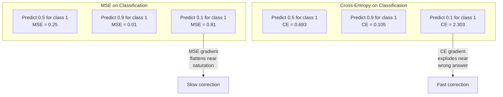
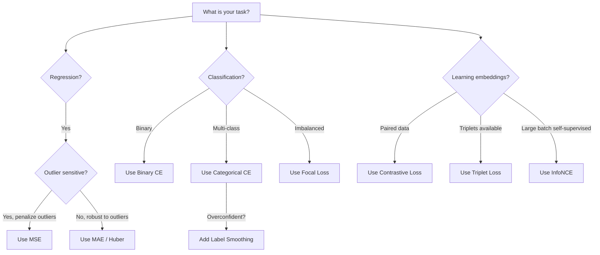
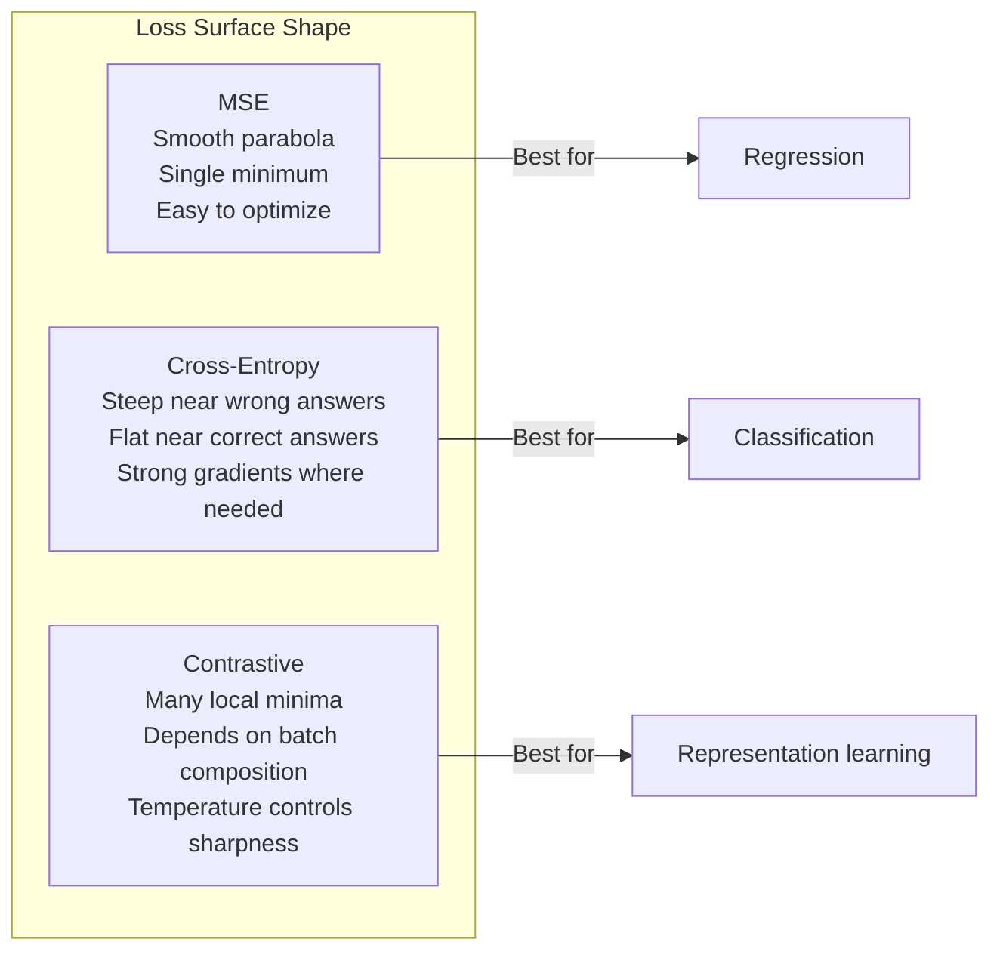

<!-- i18n:manual -->
# Функции потерь

> Ваша сеть выдала предсказание. Истина говорит другое. Насколько сильно она ошиблась? Это число и есть loss. Выберете не ту функцию потерь — и модель будет оптимизировать совсем не то, что вам нужно.

**Type:** Build
**Languages:** Python
**Prerequisites:** Lesson 03.04 (Activation Functions)
**Time:** ~75 minutes

## Learning Objectives

- Реализовать с нуля MSE, binary cross-entropy, categorical cross-entropy и contrastive loss (InfoNCE) вместе с их градиентами
- Объяснить, почему MSE не работает в классификации, показав режим отказа «предсказывать 0.5 для всего»
- Применить label smoothing к cross-entropy и описать, как он не даёт модели быть чрезмерно уверенной
- Выбирать правильную функцию потерь для регрессии, бинарной классификации, многоклассовой классификации и обучения эмбеддингов

> 🎒 **На пальцах.** Функция потерь — это правило, по которому модели ставят оценку. Меняете правило — меняете то, чему модель научится. Сравните два штрафа за один и тот же ответ «50 на 50»: cross-entropy даёт −log(0.5) = 0.693, а за уверенный правильный ответ всего −log(0.99) = 0.01. Разница в 69 раз и есть то, что заставляет модель определяться.

## The Problem

Модель, которая минимизирует MSE в задаче классификации, будет уверенно предсказывать 0.5 для всего подряд. Потери она минимизирует. И при этом она бесполезна.

Функция потерь — единственное, что ваша модель на самом деле оптимизирует. Не accuracy. Не F1. Не ту метрику, которую вы показываете руководителю. Оптимизатор берёт градиент функции потерь и подкручивает веса так, чтобы это число стало меньше. Если функция потерь не отражает то, что вам важно, модель найдёт математически самый дешёвый способ её удовлетворить — и этот способ почти никогда не совпадает с вашим замыслом.

Вот конкретный пример. У вас бинарная классификация. Два класса, поровну. В качестве потерь вы взяли MSE. Модель предсказывает 0.5 на каждом входе. Средний MSE равен 0.25 — это минимум, достижимый вообще без обучения. Различать классы модель не умеет, но формально ваши потери она минимизировала. Переключитесь на cross-entropy — и та же модель вынуждена толкать предсказания к 0 или к 1, потому что −log(0.5) = 0.693 это плохие потери, а −log(0.99) = 0.01 награждает уверенные правильные ответы. Выбор функции потерь — это разница между моделью, которая учится, и моделью, которая обманывает метрику.

Дальше хуже. В self-supervised обучении меток нет вообще. Contrastive loss задаёт весь обучающий сигнал целиком: что считать похожим, что разным и насколько сильно их растаскивать. Ошибётесь в contrastive loss — и эмбеддинги схлопнутся в одну точку: любой вход отобразится в один и тот же вектор. Формально нулевые потери. Практически полный мусор.

> 🎒 **На пальцах.** Проверьте арифметику руками: если истинная метка 1, то (0.5 − 1)² = 0.25; если 0, то (0.5 − 0)² = 0.25. Что бы ни было правильным ответом, штраф один и тот же — 0.25. Это как экзамен, где за ответ «не знаю» ставят твёрдую тройку. Зачем тогда учиться? Cross-entropy отменяет тройку: «не знаю» стоит 0.693, а правильный уверенный ответ — 0.01.

## The Concept

### Mean Squared Error (MSE)

Стандарт для регрессии. Считаем квадрат разницы между предсказанием и целью, усредняем по всем примерам.

```
MSE = (1/n) * sum((y_pred - y_true)^2)
```

Зачем квадрат: он штрафует большие ошибки квадратично. Ошибка 2 стоит в 4 раза дороже ошибки 1. Ошибка 10 — в 100 раз. Из-за этого MSE чувствительна к выбросам: одно дико неверное предсказание перетягивает на себя всю функцию потерь.

Конкретные числа: если модель предсказывает цены на жильё и ошибается на $10 000 на большинстве домов, но на $200 000 на одном особняке, MSE будет остервенело чинить этот особняк, возможно ухудшая результат на остальных 99 домах.

Градиент MSE по предсказанию:

```
dMSE/dy_pred = (2/n) * (y_pred - y_true)
```

Линейный по ошибке. Больше ошибка — больше градиент. Для регрессии это плюс (большие ошибки требуют больших правок), для классификации это баг (там уверенные неправильные ответы нужно штрафовать экспоненциально, а не линейно).

> 🎒 **На пальцах.** Возведение в квадрат — как штраф за опоздание, который растёт не по минутам, а по их квадрату: опоздал на 1 минуту — 1 рубль, на 10 минут — 100 рублей. Числа из примера с домами: 10 000² = 100 000 000, а 200 000² = 40 000 000 000. Один особняк весит в 400 раз больше одного обычного дома. Модель будет чинить его, а не их.

### Cross-Entropy Loss

Функция потерь для классификации. Растёт из теории информации: она измеряет расхождение между предсказанным распределением вероятностей и истинным.

**Binary Cross-Entropy (BCE):**

```
BCE = -(y * log(p) + (1 - y) * log(1 - p))
```

Здесь y — истинная метка (0 или 1), p — предсказанная вероятность.

Почему −log(p) работает: когда истинная метка 1 и вы предсказываете p = 0.99, потери равны −log(0.99) = 0.01. Когда вы предсказываете p = 0.01, потери равны −log(0.01) = 4.6. Разница в 460 раз — вот почему cross-entropy работает. Она жестоко наказывает уверенные неверные предсказания и почти не трогает уверенные верные.

Градиент говорит ровно то же самое:

```
dBCE/dp = -(y/p) + (1-y)/(1-p)
```

Когда y = 1, а p близко к нулю, градиент равен −1/p и уходит к минус бесконечности. Модель получает огромный сигнал исправить ошибку. Когда p близко к 1, градиент крошечный. Уже правильно, чинить нечего.

**Categorical Cross-Entropy:**

Для многоклассовой классификации с one-hot целями.

```
CCE = -sum(y_i * log(p_i))
```

В потери вносит вклад только истинный класс (у всех остальных y_i равны нулю). Если классов 10 и правильный класс получил вероятность 0.1 (угадывание наугад), потери равны −log(0.1) = 2.3. Если правильный класс получил 0.9, потери равны −log(0.9) = 0.105. Модель учится собирать вероятностную массу на правильном ответе.

> 🎒 **На пальцах.** Логарифм — это «во сколько раз», а не «на сколько». Уверенность 0.99 против 0.01 — разница в потерях 4.6 против 0.01, то есть в 460 раз, хотя оба числа лежат в одном отрезке от 0 до 1. Бытовая аналогия: сказать «точно не будет дождя» и попасть под ливень хуже, чем сказать «не знаю» и попасть под ливень. Cross-entropy штрафует именно самоуверенность.

### Why MSE Fails for Classification



Градиенты MSE выполаживаются, когда предсказания близки к 0 или 1 (из-за насыщения сигмоиды). Cross-entropy это компенсирует: −log гасит плоские участки сигмоиды и даёт сильные градиенты ровно там, где они нужнее всего.

> 🎒 **На пальцах.** Возьмите из диаграммы самый плохой случай — модель сказала 0.1, а правильный класс единица. MSE насчитает (0.1 − 1)² = 0.81, cross-entropy насчитает −log(0.1) = 2.303, почти втрое больше. Это как два сигнала тревоги: один тихо пищит, другой орёт. Учиться модель будет по тому, который громче.

### Label Smoothing

Обычные one-hot метки заявляют: «это на 100% класс 3 и на 0% всё остальное». Сильное утверждение. Label smoothing его смягчает:

```
smooth_label = (1 - alpha) * one_hot + alpha / num_classes
```

При alpha = 0.1 и 10 классах вместо [0, 0, 1, 0, ...] цель становится [0.01, 0.01, 0.91, 0.01, ...]. Модель целится в 0.91 вместо 1.0.

Почему это работает: чтобы выдать через softmax ровно 1.0, модели нужно загнать логиты в бесконечность. Отсюда чрезмерная уверенность, ухудшение обобщения и хрупкость при сдвиге распределения. Label smoothing ограничивает цель на уровне 0.9 (при alpha = 0.1) и держит логиты в разумном диапазоне. GPT и большинство современных моделей используют label smoothing или его эквивалент.

> 🎒 **На пальцах.** Проверьте цифру 0.91 сами: (1 − 0.1) × 1 + 0.1 / 10 = 0.9 + 0.01 = 0.91. Оставшиеся 0.1 честно раздаются девяти другим классам по 0.01. Это как врач, который говорит «почти наверняка грипп», а не «стопроцентно грипп и слушать ничего не хочу». Небольшое сомнение оставляет место для правды.

### Contrastive Loss

Ни меток, ни классов. Только пары входов и вопрос: похожи они или различны?

**SimCLR-style contrastive loss (NT-Xent / InfoNCE):**

Берём одну картинку. Делаем из неё два аугментированных вида (обрезка, поворот, сдвиг цвета). Это «positive pair» — их эмбеддинги должны быть похожи. Любая другая картинка в батче образует «negative pair» — её эмбеддинг должен отличаться.

```
L = -log(exp(sim(z_i, z_j) / tau) / sum(exp(sim(z_i, z_k) / tau)))
```

Здесь sim() — косинусная близость, z_i и z_j — положительная пара, сумма берётся по всем негативам, а tau (температура) задаёт резкость распределения. Ниже температура — жёстче негативы — агрессивнее разделение.

Конкретные числа: размер батча 256 означает 255 негативов на каждую положительную пару. Температура tau = 0.07 (значение по умолчанию в SimCLR). Потери выглядят как softmax по близостям: они требуют, чтобы близость положительной пары была наибольшей среди всех 256 вариантов.

**Triplet Loss:**

Принимает три входа: anchor, positive (тот же класс), negative (другой класс).

```
L = max(0, d(anchor, positive) - d(anchor, negative) + margin)
```

Margin (обычно 0.2-1.0) требует минимального зазора между расстояниями до позитива и до негатива. Если негатив и так достаточно далеко, потери равны нулю — ни градиента, ни обновления. Обучение получается экономным, но требует аккуратного подбора троек (нужно искать трудные негативы, лежащие близко к anchor).

> 🎒 **На пальцах.** Это игра «найди своего в толпе». Две фотографии одного человека должны оказаться ближе друг к другу, чем к 255 чужим лицам в батче. Никто не говорит модели, кто на фото, — ей говорят только «эти двое свои, остальные чужие». Такого сигнала хватает, чтобы выучить лица, и на нём же построены CLIP и SimCLR.

### Focal Loss

Для несбалансированных данных. Обычная cross-entropy относится ко всем правильно классифицированным примерам одинаково. Focal loss снижает вес лёгких примеров:

```
FL = -alpha * (1 - p_t)^gamma * log(p_t)
```

Здесь p_t — предсказанная вероятность истинного класса, а gamma управляет фокусировкой. При gamma = 0 это обычная cross-entropy. При gamma = 2 (значение по умолчанию):

- Лёгкий пример (p_t = 0.9): вес = (0.1)^2 = 0.01. Фактически игнорируется.
- Трудный пример (p_t = 0.1): вес = (0.9)^2 = 0.81. Полный градиентный сигнал.

Focal loss придумали Lin et al. для детекции объектов, где 99% кандидатных областей — это фон (лёгкие негативы). Без focal loss модель тонет в лёгких примерах фона и никогда не учится находить объекты. С ней модель тратит свою ёмкость на трудные, неоднозначные случаи, которые и решают дело.

> 🎒 **На пальцах.** Сравните веса: 0.01 у лёгкого примера и 0.81 у трудного — трудный весит в 81 раз больше. Это учитель, который не тратит урок на отличников, знающих тему, а сидит с теми, кто не понял. Когда 99 задач из 100 — это скучный фон, только так и можно чему-то научиться.

### Loss Function Decision Tree



### Loss Landscape



```figure
cross-entropy-loss
```

> 🎒 **На пальцах.** Дерево решений читается как выбор обуви по погоде и не требует размышлений. Регрессия с выбросами — MAE или Huber loss. Десять классов — categorical cross-entropy. Данные, где 99% одного класса, — focal loss. Пары картинок без меток — contrastive loss. Если ваша задача попала в лист дерева, спорить с ним стоит только имея измеренную причину.

## Build It

### Step 1: MSE and Its Gradient

```python
def mse(predictions, targets):
    n = len(predictions)
    total = 0.0
    for p, t in zip(predictions, targets):
        total += (p - t) ** 2
    return total / n

def mse_gradient(predictions, targets):
    n = len(predictions)
    grads = []
    for p, t in zip(predictions, targets):
        grads.append(2.0 * (p - t) / n)
    return grads
```

> 🎒 **На пальцах.** Обратите внимание на деление на `n` в градиенте. При четырёх примерах и ошибке p − t = 3 градиент равен 2 × 3 / 4 = 1.5, а не 6. Это как разделить счёт в кафе на всех: каждый пример платит только свою долю, поэтому размер батча не разгоняет шаг обучения сам по себе.

### Step 2: Binary Cross-Entropy

Проблема log(0) — не теоретическая. Если модель предсказала ровно 0 для положительного примера, log(0) равен минус бесконечности. Обрезка (clipping) это предотвращает.

```python
import math

def binary_cross_entropy(predictions, targets, eps=1e-15):
    n = len(predictions)
    total = 0.0
    for p, t in zip(predictions, targets):
        p_clipped = max(eps, min(1 - eps, p))
        total += -(t * math.log(p_clipped) + (1 - t) * math.log(1 - p_clipped))
    return total / n

def bce_gradient(predictions, targets, eps=1e-15):
    grads = []
    for p, t in zip(predictions, targets):
        p_clipped = max(eps, min(1 - eps, p))
        grads.append(-(t / p_clipped) + (1 - t) / (1 - p_clipped))
    return grads
```

> 🎒 **На пальцах.** `eps=1e-15` работает как ограничитель на розетке. Вместо log(0) = −бесконечность мы получаем log(1e-15) ≈ −34.5: число большое, но конечное, и обучение не разваливается в NaN. Одна строчка `max(eps, min(1 - eps, p))` спасает целый прогон обучения.

### Step 3: Categorical Cross-Entropy with Softmax

Softmax превращает сырые логиты в вероятности. Дальше считаем cross-entropy против one-hot целей.

```python
def softmax(logits):
    max_val = max(logits)
    exps = [math.exp(x - max_val) for x in logits]
    total = sum(exps)
    return [e / total for e in exps]

def categorical_cross_entropy(logits, target_index, eps=1e-15):
    probs = softmax(logits)
    p = max(eps, probs[target_index])
    return -math.log(p)

def cce_gradient(logits, target_index):
    probs = softmax(logits)
    grads = list(probs)
    grads[target_index] -= 1.0
    return grads
```

Градиент softmax + cross-entropy упрощается до неприличия красиво: это просто (предсказанная вероятность − 1) для истинного класса и (предсказанная вероятность) для всех остальных. Такое элегантное упрощение не случайность — именно поэтому softmax и cross-entropy идут в паре.

> 🎒 **На пальцах.** Прогоните логиты [2, 1, 0] через softmax руками: exp-значения 1, 0.368, 0.135, их сумма 1.503, вероятности 0.665, 0.245, 0.090. Если верный класс первый, потери равны −log(0.665) = 0.408, а градиент — [0.665 − 1, 0.245, 0.090] = [−0.335, 0.245, 0.090]. Читается по-человечески: «верному классу добавь, остальным убавь». Вычитание `max_val` внутри `softmax` — тоже защита: без него exp(1000) переполнит float.

### Step 4: Label Smoothing

```python
def label_smoothed_cce(logits, target_index, num_classes, alpha=0.1, eps=1e-15):
    probs = softmax(logits)
    loss = 0.0
    for i in range(num_classes):
        if i == target_index:
            smooth_target = 1.0 - alpha + alpha / num_classes
        else:
            smooth_target = alpha / num_classes
        p = max(eps, probs[i])
        loss += -smooth_target * math.log(p)
    return loss
```

### Step 5: Contrastive Loss (Simplified InfoNCE)

```python
def cosine_similarity(a, b):
    dot = sum(x * y for x, y in zip(a, b))
    norm_a = math.sqrt(sum(x * x for x in a))
    norm_b = math.sqrt(sum(x * x for x in b))
    if norm_a < 1e-10 or norm_b < 1e-10:
        return 0.0
    return dot / (norm_a * norm_b)

def contrastive_loss(anchor, positive, negatives, temperature=0.07):
    sim_pos = cosine_similarity(anchor, positive) / temperature
    sim_negs = [cosine_similarity(anchor, neg) / temperature for neg in negatives]

    max_sim = max(sim_pos, max(sim_negs)) if sim_negs else sim_pos
    exp_pos = math.exp(sim_pos - max_sim)
    exp_negs = [math.exp(s - max_sim) for s in sim_negs]
    total_exp = exp_pos + sum(exp_negs)

    return -math.log(max(1e-15, exp_pos / total_exp))
```

> 🎒 **На пальцах.** Температура 0.07 — это деление, и оно раздувает разницу. Близость 0.9 превращается в 0.9 / 0.07 = 12.86, близость 0.2 — в 2.86. Разрыв в 10 после exp становится разрывом примерно в 22 000 раз. То есть маленькое «этот чуть больше похож» температура превращает в «этот и есть тот самый».

### Step 6: MSE vs Cross-Entropy on Classification

Обучите ту же сеть, что и в уроке 04 (датасет с кругом), с обеими функциями потерь. Посмотрите, как cross-entropy сходится быстрее.

```python
import random

def sigmoid(x):
    x = max(-500, min(500, x))
    return 1.0 / (1.0 + math.exp(-x))

def make_circle_data(n=200, seed=42):
    random.seed(seed)
    data = []
    for _ in range(n):
        x = random.uniform(-2, 2)
        y = random.uniform(-2, 2)
        label = 1.0 if x * x + y * y < 1.5 else 0.0
        data.append(([x, y], label))
    return data


class LossComparisonNetwork:
    def __init__(self, loss_type="bce", hidden_size=8, lr=0.1):
        random.seed(0)
        self.loss_type = loss_type
        self.lr = lr
        self.hidden_size = hidden_size

        self.w1 = [[random.gauss(0, 0.5) for _ in range(2)] for _ in range(hidden_size)]
        self.b1 = [0.0] * hidden_size
        self.w2 = [random.gauss(0, 0.5) for _ in range(hidden_size)]
        self.b2 = 0.0

    def forward(self, x):
        self.x = x
        self.z1 = []
        self.h = []
        for i in range(self.hidden_size):
            z = self.w1[i][0] * x[0] + self.w1[i][1] * x[1] + self.b1[i]
            self.z1.append(z)
            self.h.append(max(0.0, z))

        self.z2 = sum(self.w2[i] * self.h[i] for i in range(self.hidden_size)) + self.b2
        self.out = sigmoid(self.z2)
        return self.out

    def backward(self, target):
        if self.loss_type == "mse":
            d_loss = 2.0 * (self.out - target)
        else:
            eps = 1e-15
            p = max(eps, min(1 - eps, self.out))
            d_loss = -(target / p) + (1 - target) / (1 - p)

        d_sigmoid = self.out * (1 - self.out)
        d_out = d_loss * d_sigmoid

        for i in range(self.hidden_size):
            d_relu = 1.0 if self.z1[i] > 0 else 0.0
            d_h = d_out * self.w2[i] * d_relu
            self.w2[i] -= self.lr * d_out * self.h[i]
            for j in range(2):
                self.w1[i][j] -= self.lr * d_h * self.x[j]
            self.b1[i] -= self.lr * d_h
        self.b2 -= self.lr * d_out

    def compute_loss(self, pred, target):
        if self.loss_type == "mse":
            return (pred - target) ** 2
        else:
            eps = 1e-15
            p = max(eps, min(1 - eps, pred))
            return -(target * math.log(p) + (1 - target) * math.log(1 - p))

    def train(self, data, epochs=200):
        losses = []
        for epoch in range(epochs):
            total_loss = 0.0
            correct = 0
            for x, y in data:
                pred = self.forward(x)
                self.backward(y)
                total_loss += self.compute_loss(pred, y)
                if (pred >= 0.5) == (y >= 0.5):
                    correct += 1
            avg_loss = total_loss / len(data)
            accuracy = correct / len(data) * 100
            losses.append((avg_loss, accuracy))
            if epoch % 50 == 0 or epoch == epochs - 1:
                print(f"    Epoch {epoch:3d}: loss={avg_loss:.4f}, accuracy={accuracy:.1f}%")
        return losses
```

> 🎒 **На пальцах.** Здесь всё честно и сравнимо: одинаковый `random.seed(0)`, одинаковые 8 скрытых нейронов, одинаковый lr = 0.1, 200 эпох, 200 точек. Отличается ровно одна ветка `if` внутри `backward` — три строки. Всё, что вы увидите в разнице кривых потерь, порождено этими тремя строками, а не удачей с инициализацией.

## Use It

PyTorch предоставляет все стандартные функции потерь со встроенной численной устойчивостью:

```python
import torch
import torch.nn as nn
import torch.nn.functional as F

predictions = torch.tensor([0.9, 0.1, 0.7], requires_grad=True)
targets = torch.tensor([1.0, 0.0, 1.0])

mse_loss = F.mse_loss(predictions, targets)
bce_loss = F.binary_cross_entropy(predictions, targets)

logits = torch.randn(4, 10)
labels = torch.tensor([3, 7, 1, 9])
ce_loss = F.cross_entropy(logits, labels)
ce_smooth = F.cross_entropy(logits, labels, label_smoothing=0.1)
```

Используйте `F.cross_entropy` (а не `F.nll_loss` плюс softmax руками). Она объединяет log-softmax и отрицательное логарифмическое правдоподобие в одну численно устойчивую операцию. Применить softmax отдельно, а потом взять логарифм — менее устойчиво: вы теряете точность при вычитании больших экспонент.

Для contrastive learning большинство команд пишут свою реализацию или берут библиотеки вроде `lightly` и `pytorch-metric-learning`. Основной цикл всегда один и тот же: посчитать попарные близости, построить softmax по позитивам и негативам, сделать обратный проход.

> 🎒 **На пальцах.** Ловушка, на которую попадаются почти все: `F.cross_entropy` ждёт сырые логиты и делает softmax внутри себя. Если вы подадите ей уже готовые вероятности, softmax применится дважды — код запустится, ошибки не будет, а модель будет учиться вяло и непонятно почему. А `F.binary_cross_entropy`, наоборот, ждёт вероятности от 0 до 1. Проверяйте, что подаёте.

## Ship It

Этот урок производит:
- `outputs/prompt-loss-function-selector.md` -- переиспользуемый промпт для выбора правильной функции потерь
- `outputs/prompt-loss-debugger.md` -- диагностический промпт на случай, когда кривая потерь выглядит подозрительно

## Exercises

1. Реализуйте Huber loss (гладкий L1), который ведёт себя как MSE на малых ошибках и как MAE на больших. Обучите регрессионную сеть предсказывать y = sin(x) с MSE и с Huber в условиях, когда к 5% обучающих целей добавлен случайный шум (выбросы). Сравните итоговую ошибку на тесте.

2. Добавьте focal loss в цикл обучения бинарной классификации. Соберите несбалансированный датасет (90% класса 0, 10% класса 1). Сравните обычную BCE и focal loss (gamma=2) по recall на миноритарном классе после 200 эпох.

3. Реализуйте triplet loss с semi-hard negative mining. Сгенерируйте двумерные эмбеддинги для 5 классов. Для каждого anchor найдите самый трудный негатив, который всё ещё дальше позитива (semi-hard). Сравните сходимость со случайным выбором троек.

4. Прогоните сравнение MSE и cross-entropy, отслеживая величины градиентов на каждом слое во время обучения. Постройте график средней нормы градиента по эпохам. Убедитесь, что cross-entropy даёт большие градиенты в ранних эпохах, когда модель наиболее неуверенна.

5. Реализуйте потери на KL divergence и убедитесь, что минимизация KL(true || predicted) даёт те же градиенты, что и cross-entropy, когда истинное распределение one-hot. Затем попробуйте мягкие цели (как в knowledge distillation), где «истинное» распределение берётся из softmax модели-учителя.

> 🎒 **На пальцах.** Подсказка к первому заданию, чтобы почувствовать разницу на пальцах. Пусть ошибки равны 1, 1, 1 и 10. MAE = (1 + 1 + 1 + 10) / 4 = 3.25, MSE = (1 + 1 + 1 + 100) / 4 = 25.75, а RMSE = 5.07. Один выброс, возведённый в квадрат, дал 100 из 103 всей суммы. Huber с delta = 1 насчитает (0.5 + 0.5 + 0.5 + 9.5) / 4 = 2.75: большая ошибка учтена, но не съела остальные три.

## Key Terms

| Term | What people say | What it actually means |
|------|----------------|----------------------|
| Loss function | «Насколько модель неправа» | Дифференцируемая функция, переводящая предсказания и цели в одно число, которое минимизирует оптимизатор |
| MSE | «Средняя квадратичная ошибка» | Среднее квадратов разностей между предсказаниями и целями; штрафует большие ошибки квадратично |
| Cross-entropy | «Потери для классификации» | Мера расхождения между предсказанным и истинным распределением вероятностей через −log(p) |
| Binary cross-entropy | «BCE» | Cross-entropy для двух классов: −(y*log(p) + (1−y)*log(1−p)) |
| Label smoothing | «Смягчение целей» | Замена жёстких целей 0/1 на мягкие значения (например, 0.1/0.9), чтобы убрать самоуверенность и улучшить обобщение |
| Contrastive loss | «Своих притянуть, чужих оттолкнуть» | Потери, которые учат представления, сближая похожие пары и разводя непохожие в пространстве эмбеддингов |
| InfoNCE | «Потери CLIP и SimCLR» | Нормированная cross-entropy с температурой по оценкам близости; превращает contrastive learning в классификацию |
| Focal loss | «Лекарство от дисбаланса» | Cross-entropy, взвешенная на (1−p_t)^gamma, чтобы снизить вес лёгких примеров и сосредоточиться на трудных |
| Triplet loss | «Anchor-positive-negative» | Требует, чтобы anchor был ближе к позитиву, чем к негативу, минимум на величину margin |
| Temperature | «Ручка резкости» | Скаляр-делитель для логитов или близостей, задающий, насколько островершинным получится распределение; меньше — резче |

## Further Reading

- Lin et al., "Focal Loss for Dense Object Detection" (2017) -- ввела focal loss для работы с экстремальным дисбалансом классов в детекции объектов (RetinaNet)
- Chen et al., "A Simple Framework for Contrastive Learning of Visual Representations" (SimCLR, 2020) -- задала современный пайплайн contrastive learning с потерями NT-Xent
- Szegedy et al., "Rethinking the Inception Architecture" (2016) -- ввела label smoothing как приём регуляризации, ставший стандартом в больших моделях
- Hinton et al., "Distilling the Knowledge in a Neural Network" (2015) -- knowledge distillation через мягкие цели и KL divergence, основа для сжатия моделей
