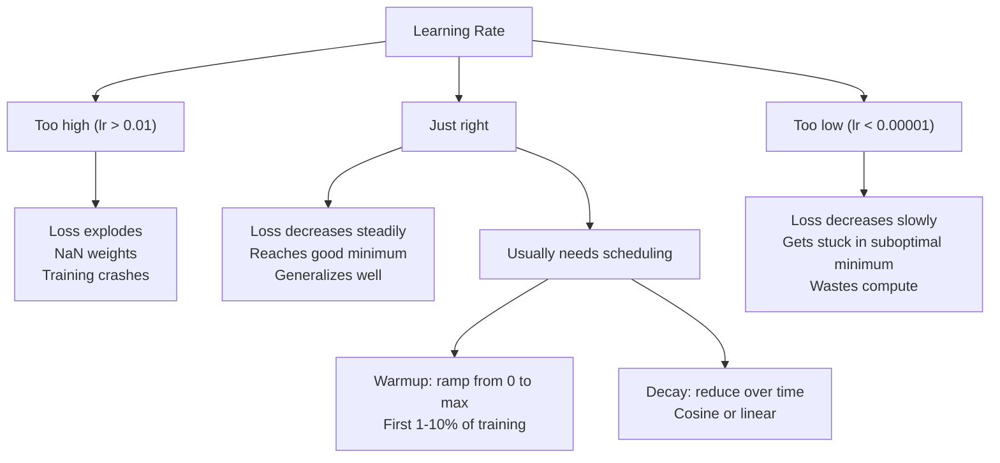
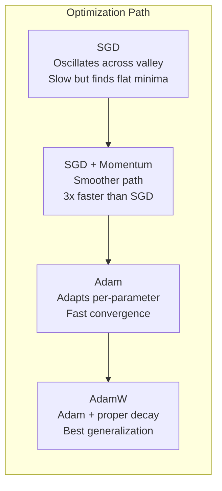
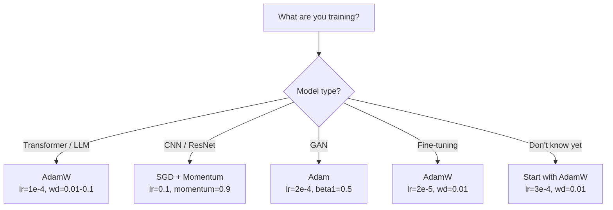

<!-- i18n:manual -->
# Оптимизаторы

> Градиентный спуск говорит, в какую сторону двигаться. Про то, как далеко и как быстро, он не говорит ничего. SGD — это компас. Adam — навигатор с пробками.

**Type:** Build
**Languages:** Python
**Prerequisites:** Lesson 03.05 (Loss Functions)
**Time:** ~75 minutes

## Learning Objectives

- Реализовать с нуля на Python оптимизаторы SGD, SGD с momentum, Adam и AdamW
- Объяснить, как bias correction в Adam компенсирует нулевую инициализацию оценок моментов на первых шагах обучения
- Показать, почему AdamW обобщает лучше, чем Adam с L2-регуляризацией, на одной и той же задаче
- Выбирать подходящий оптимизатор и гиперпараметры по умолчанию для трансформеров, свёрточных сетей, GAN и дообучения

> 🎒 **На пальцах.** Все четыре оптимизатора отвечают на один вопрос: градиент известен, а какой длины делать шаг? SGD всегда шагает одинаково. Momentum разгоняется, как санки с горы. Adam подбирает длину шага каждому весу отдельно. Разница на практике огромна: там, где SGD нужно 10 000 шагов, momentum справляется за 3000-5000.

## The Problem

Вы посчитали градиенты. Вы знаете, что вес №4721 нужно уменьшить на 0.003, чтобы потери упали. Но 0.003 в каких единицах? С каким масштабом? И нужно ли на шаге 1 двигаться так же, как на шаге 1000?

Обычный градиентный спуск применяет один и тот же learning rate к каждому параметру на каждом шаге: w = w - lr * gradient. Отсюда три проблемы, которые делают обучение нейросетей мучительным на практике.

Первая — осцилляции. Ландшафт потерь редко похож на гладкую чашу. Он больше похож на длинную узкую долину. Градиент указывает поперёк долины (крутое направление), а не вдоль неё (пологое). Градиентный спуск скачет от стенки к стенке по узкому измерению и еле-еле продвигается по полезному. Вы это видели: потери быстро падают, а потом выходят на плато — не потому что модель сошлась, а потому что она болтается из стороны в сторону.

Вторая — один learning rate на все параметры это неправильно. Одним весам нужны большие обновления (они ещё далеко от нужного значения). Другим — крошечные (они уже почти на месте). Learning rate, подходящий первым, разрушает вторые, и наоборот.

Третья — седловые точки. В высоких размерностях у ландшафта потерь есть огромные плоские области, где градиент почти нулевой. Обычный SGD ползёт по ним со скоростью градиента, то есть практически стоит. Кажется, что модель застряла. Она не застряла — она в плоской области, за которой снова начинается спуск. Но у SGD нет механизма продавить эту область.

Adam решает все три проблемы. Он держит два скользящих средних на каждый параметр — среднее градиента (momentum, лечит осцилляции) и среднее квадрата градиента (адаптивный шаг, лечит разницу масштабов). Вместе с bias correction для первых шагов это даёт один оптимизатор, который работает на 80% задач с настройками по умолчанию. В этом уроке мы соберём его с нуля, чтобы вы точно понимали, когда и почему он не работает на остальных 20%.

> 🎒 **На пальцах.** Узкая долина — это как ехать на велосипеде по глубокой колее: вас мотает от края к краю, а вперёд вы почти не двигаетесь. Момент решает это тем, что запоминает, куда вы ехали раньше: рывки влево-вправо гасят друг друга, а движение вперёд накапливается. Проверьте на числах: если поперечная составляющая на каждом шаге меняет знак, +1, −1, +1, −1, её сумма стремится к нулю, а продольная +1, +1, +1 растёт.

## The Concept

### Stochastic Gradient Descent (SGD)

Простейший оптимизатор. Считаем градиент на мини-батче и шагаем в противоположную сторону.

```
w = w - lr * gradient
```

Слово «стохастический» означает, что для оценки градиента вы берёте случайное подмножество данных (мини-батч), а не весь датасет. Этот шум на самом деле полезен: он помогает выбираться из острых локальных минимумов. Но он же вызывает осцилляции.

Learning rate — единственная ручка. Слишком большой: потери расходятся. Слишком маленький: обучение длится вечно. Оптимальное значение зависит от архитектуры, данных, размера батча и текущей стадии обучения. Для обычного SGD на современных сетях типичные значения лежат в диапазоне от 0.01 до 0.1. Но даже внутри одного прогона идеальный learning rate меняется.

> 🎒 **На пальцах.** Одна строка `w = w - lr * gradient` — это весь алгоритм. При lr = 0.01 и градиенте 0.5 вес изменится на 0.005. Аналогия: вы спускаетесь с горы в тумане и всегда делаете шаг одной и той же длины. Слишком длинный шаг — перелетите дно и окажетесь на другом склоне. Слишком короткий — до вечера не дойдёте.

### Momentum

Аналогию с шаром, катящимся с горы, затёрли до дыр, но она верна. Вместо шага строго по градиенту вы поддерживаете скорость, которая накапливает прошлые градиенты.

```
m_t = beta * m_{t-1} + gradient
w = w - lr * m_t
```

Beta (обычно 0.9) определяет, сколько истории сохранять. При beta = 0.9 момент примерно равен среднему последних 10 градиентов (1 / (1 - 0.9) = 10).

Почему это лечит осцилляции: градиенты, смотрящие в одну сторону, складываются. Градиенты, меняющие направление, гасят друг друга. В той самой узкой долине поперечная составляющая меняет знак на каждом шаге и затухает. Продольная остаётся постоянной и усиливается. В итоге получается плавный разгон в полезную сторону.

Конкретные числа: SGD в одиночку на плохо обусловленном ландшафте потерь может потратить 10 000 шагов. SGD с momentum (beta=0.9) обычно тратит 3000-5000 шагов на той же задаче. Ускорение не косметическое.

> 🎒 **На пальцах.** Если градиент всё время равен 0.5 и не меняется, скорость дорастёт до 0.5 / (1 − 0.9) = 5, то есть в десять раз больше самого градиента. Шаг стал в 10 раз длиннее без всякой правки learning rate. Это санки: пока склон в одну сторону, вы разгоняетесь, и каждый следующий метр даётся легче.

### RMSProp

Первый по-настоящему работающий метод с адаптивным learning rate для каждого параметра. Предложен Хинтоном в лекции на Coursera (и никогда формально не опубликован).

```
s_t = beta * s_{t-1} + (1 - beta) * gradient^2
w = w - lr * gradient / (sqrt(s_t) + epsilon)
```

s_t отслеживает скользящее среднее квадратов градиентов. Параметры с постоянно большими градиентами делятся на большое число (меньший эффективный learning rate). Параметры с маленькими градиентами делятся на маленькое число (больший эффективный learning rate).

Это решает проблему «один learning rate на всех». Вес, который и так получал большие обновления, скорее всего уже близок к цели — притормозим его. Вес, получавший крошечные обновления, возможно недообучен — ускорим его.

Epsilon (обычно 1e-8) защищает от деления на ноль, когда параметр ещё не обновлялся.

> 🎒 **На пальцах.** Тут происходит деление градиента на его же типичный размер, то есть перевод в общие единицы. Если у веса градиенты около 100, sqrt(s_t) тоже около 100, и шаг получается примерно lr. Если градиенты около 0.001, шаг снова примерно lr. Это как переводить рубли и доллары в одну валюту перед сравнением: важно не абсолютное число, а во сколько раз надо подвинуться.

### Adam: Momentum + RMSProp

Adam соединяет обе идеи. Он держит два экспоненциальных скользящих средних на каждый параметр:

```
m_t = beta1 * m_{t-1} + (1 - beta1) * gradient        (first moment: mean)
v_t = beta2 * v_{t-1} + (1 - beta2) * gradient^2       (second moment: variance)
```

**Bias correction** — ключевая деталь, которую пропускает большинство объяснений. На шаге 1 m_1 = (1 - beta1) * gradient. При beta1 = 0.9 это 0.1 * gradient — в десять раз меньше, чем нужно. Скользящее среднее ещё не разогрелось. Bias correction это компенсирует:

```
m_hat = m_t / (1 - beta1^t)
v_hat = v_t / (1 - beta2^t)
```

На шаге 1 при beta1 = 0.9: m_hat = m_1 / (1 - 0.9) = m_1 / 0.1 = настоящий градиент. На шаге 100 (1 - 0.9^100) примерно равно 1.0, и поправка исчезает. Bias correction важна для первых ~10 шагов и не имеет значения после ~50.

Обновление:

```
w = w - lr * m_hat / (sqrt(v_hat) + epsilon)
```

Значения Adam по умолчанию: lr = 0.001, beta1 = 0.9, beta2 = 0.999, epsilon = 1e-8. Эти умолчания работают на 80% задач. Когда не работают, меняйте сначала lr. Потом beta2. Beta1 и epsilon не трогайте почти никогда.

> 🎒 **На пальцах.** Посчитайте поправку сами: 0.9^100 ≈ 0.0000266, значит делитель (1 − 0.9^100) ≈ 0.99997 — это деление на единицу, поправка ничего не делает. А на первом шаге делитель равен 0.1, и она увеличивает шаг в 10 раз. Аналогия: термометр, который только внесли с улицы. Первые минуты его показаниям верить нельзя, и вы делаете скидку на разогрев; через полчаса скидка не нужна.

### AdamW: Weight Decay Done Right

L2-регуляризация добавляет lambda * w^2 к функции потерь. В обычном SGD это эквивалентно weight decay (вычитанию lambda * w из веса на каждом шаге). В Adam эта эквивалентность ломается.

Наблюдение Loshchilov и Hutter: когда вы добавляете L2 к потерям, а потом Adam обрабатывает градиент, адаптивный learning rate масштабирует и регуляризационный член тоже. Параметры с большой дисперсией градиента получают меньше регуляризации. Параметры с маленькой — больше. А вам нужно не это: вам нужна одинаковая регуляризация независимо от статистики градиентов.

AdamW чинит это, применяя weight decay напрямую к весам, уже после обновления Adam:

```
w = w - lr * m_hat / (sqrt(v_hat) + epsilon) - lr * lambda * w
```

Член weight decay (lr * lambda * w) не масштабируется адаптивным множителем Adam. Каждый параметр сжимается на одну и ту же долю.

Выглядит мелочью. Это не мелочь. AdamW сходится к лучшим решениям, чем Adam + L2, практически на любой задаче. Это оптимизатор по умолчанию в PyTorch для обучения трансформеров, диффузионных моделей и большинства современных архитектур. BERT, GPT, LLaMA, Stable Diffusion — всё обучено на AdamW.

> 🎒 **На пальцах.** Weight decay — это налог на размер веса, который берут каждый шаг. При lr = 0.001 и lambda = 0.01 вес за один шаг умножается на 0.99999. Мелочь, но за 10 000 шагов набегает 0.99999^10000 ≈ 0.905, то есть вес усох примерно на 10%. Разница между Adam и AdamW в том, у кого этот налог одинаковый для всех: у Adam богатые платят меньше, у AdamW ставка ровная.

### Learning Rate: The Most Important Hyperparameter



Если вы настраиваете один гиперпараметр, настраивайте learning rate. Изменение learning rate в 10 раз влияет сильнее, чем любое ваше архитектурное решение. Обычные значения по умолчанию:

- SGD: lr от 0.01 до 0.1
- Adam/AdamW: lr от 1e-4 до 3e-4
- Дообучение предобученных моделей: lr от 1e-5 до 5e-5
- Warmup learning rate: линейный рост на первых 1-10% шагов

> 🎒 **На пальцах.** Между этими режимами разница не в проценты, а в разы: 1e-5 для дообучения и 0.1 для SGD различаются в 10 000 раз. Warmup — это как разогрев перед бегом: первые 1-10% шагов learning rate растёт от нуля до максимума, потому что в самом начале веса случайны, градиенты дикие, и большой шаг разнесёт модель в NaN.

### Optimizer Comparison



### When Each Optimizer Wins



```figure
optimizer-trajectory
```

> 🎒 **На пальцах.** Эту схему можно просто запомнить как шпаргалку. Трансформер или LLM — AdamW, lr=1e-4. Свёрточная сеть — SGD с momentum, lr=0.1. GAN — Adam с lr=2e-4 и непривычным beta1=0.5 (у GAN цель всё время меняется, длинная память момента вредит). Дообучение — AdamW с lr=2e-5, в пять раз меньше обычного, чтобы не сломать то, что модель уже знает. Не знаете — берите AdamW с lr=3e-4.

## Build It

### Step 1: Vanilla SGD

```python
class SGD:
    def __init__(self, lr=0.01):
        self.lr = lr

    def step(self, params, grads):
        for i in range(len(params)):
            params[i] -= self.lr * grads[i]
```

> 🎒 **На пальцах.** Весь оптимизатор — четыре строки и один цикл. Никакой памяти о прошлом: параметр 0.7, градиент 0.5, lr = 0.01 — стало 0.695. На следующем шаге всё считается заново с чистого листа. Это и сила (памяти нужно ноль), и слабость (разогнаться нельзя).

### Step 2: SGD with Momentum

```python
class SGDMomentum:
    def __init__(self, lr=0.01, beta=0.9):
        self.lr = lr
        self.beta = beta
        self.velocities = None

    def step(self, params, grads):
        if self.velocities is None:
            self.velocities = [0.0] * len(params)
        for i in range(len(params)):
            self.velocities[i] = self.beta * self.velocities[i] + grads[i]
            params[i] -= self.lr * self.velocities[i]
```

> 🎒 **На пальцах.** Появилась одна новая переменная — `self.velocities`, по числу на каждый параметр. При постоянном градиенте 0.5 скорость идёт 0.5, затем 0.95, затем 1.355 и упирается в 5. Память за это удвоилась: вместо одного числа на параметр храним два. Для сети из 33 параметров это ерунда, для модели на 7 миллиардов — уже 28 гигабайт.

### Step 3: Adam

```python
import math

class Adam:
    def __init__(self, lr=0.001, beta1=0.9, beta2=0.999, epsilon=1e-8):
        self.lr = lr
        self.beta1 = beta1
        self.beta2 = beta2
        self.epsilon = epsilon
        self.m = None
        self.v = None
        self.t = 0

    def step(self, params, grads):
        if self.m is None:
            self.m = [0.0] * len(params)
            self.v = [0.0] * len(params)

        self.t += 1

        for i in range(len(params)):
            self.m[i] = self.beta1 * self.m[i] + (1 - self.beta1) * grads[i]
            self.v[i] = self.beta2 * self.v[i] + (1 - self.beta2) * grads[i] ** 2

            m_hat = self.m[i] / (1 - self.beta1 ** self.t)
            v_hat = self.v[i] / (1 - self.beta2 ** self.t)

            params[i] -= self.lr * m_hat / (math.sqrt(v_hat) + self.epsilon)
```

> 🎒 **На пальцах.** Счётчик `self.t` нужен ровно для bias correction: без номера шага не посчитать (1 − beta1^t). Проверьте первый шаг для v: v_1 = 0.001 * g², делим на (1 − 0.999) = 0.001 и получаем ровно g², а sqrt даёт |g|. То есть на первом шаге Adam шагает почти ровно на lr, независимо от того, был градиент 0.001 или 1000.

### Step 4: AdamW

```python
class AdamW:
    def __init__(self, lr=0.001, beta1=0.9, beta2=0.999, epsilon=1e-8, weight_decay=0.01):
        self.lr = lr
        self.beta1 = beta1
        self.beta2 = beta2
        self.epsilon = epsilon
        self.weight_decay = weight_decay
        self.m = None
        self.v = None
        self.t = 0

    def step(self, params, grads):
        if self.m is None:
            self.m = [0.0] * len(params)
            self.v = [0.0] * len(params)

        self.t += 1

        for i in range(len(params)):
            self.m[i] = self.beta1 * self.m[i] + (1 - self.beta1) * grads[i]
            self.v[i] = self.beta2 * self.v[i] + (1 - self.beta2) * grads[i] ** 2

            m_hat = self.m[i] / (1 - self.beta1 ** self.t)
            v_hat = self.v[i] / (1 - self.beta2 ** self.t)

            params[i] -= self.lr * m_hat / (math.sqrt(v_hat) + self.epsilon)
            params[i] -= self.lr * self.weight_decay * params[i]
```

> 🎒 **На пальцах.** Сравните с Adam построчно: отличие ровно одно — последняя строка `params[i] -= self.lr * self.weight_decay * params[i]`. Одна строка кода отделяет оптимизатор, на котором обучены GPT и LLaMA, от предыдущего. Так и выглядят настоящие улучшения в машинном обучении: не революция, а перенос слагаемого в другое место.

### Step 5: Training Comparison

Обучите одну и ту же двухслойную сеть на датасете с кругом из урока 05 всеми четырьмя оптимизаторами. Сравните сходимость.

```python
import random

def sigmoid(x):
    x = max(-500, min(500, x))
    return 1.0 / (1.0 + math.exp(-x))

def make_circle_data(n=200, seed=42):
    random.seed(seed)
    data = []
    for _ in range(n):
        x = random.uniform(-2, 2)
        y = random.uniform(-2, 2)
        label = 1.0 if x * x + y * y < 1.5 else 0.0
        data.append(([x, y], label))
    return data


class OptimizerTestNetwork:
    def __init__(self, optimizer, hidden_size=8):
        random.seed(0)
        self.hidden_size = hidden_size
        self.optimizer = optimizer

        self.w1 = [[random.gauss(0, 0.5) for _ in range(2)] for _ in range(hidden_size)]
        self.b1 = [0.0] * hidden_size
        self.w2 = [random.gauss(0, 0.5) for _ in range(hidden_size)]
        self.b2 = 0.0

    def get_params(self):
        params = []
        for row in self.w1:
            params.extend(row)
        params.extend(self.b1)
        params.extend(self.w2)
        params.append(self.b2)
        return params

    def set_params(self, params):
        idx = 0
        for i in range(self.hidden_size):
            for j in range(2):
                self.w1[i][j] = params[idx]
                idx += 1
        for i in range(self.hidden_size):
            self.b1[i] = params[idx]
            idx += 1
        for i in range(self.hidden_size):
            self.w2[i] = params[idx]
            idx += 1
        self.b2 = params[idx]

    def forward(self, x):
        self.x = x
        self.z1 = []
        self.h = []
        for i in range(self.hidden_size):
            z = self.w1[i][0] * x[0] + self.w1[i][1] * x[1] + self.b1[i]
            self.z1.append(z)
            self.h.append(max(0.0, z))

        self.z2 = sum(self.w2[i] * self.h[i] for i in range(self.hidden_size)) + self.b2
        self.out = sigmoid(self.z2)
        return self.out

    def compute_grads(self, target):
        eps = 1e-15
        p = max(eps, min(1 - eps, self.out))
        d_loss = -(target / p) + (1 - target) / (1 - p)
        d_sigmoid = self.out * (1 - self.out)
        d_out = d_loss * d_sigmoid

        grads = [0.0] * (self.hidden_size * 2 + self.hidden_size + self.hidden_size + 1)
        idx = 0
        for i in range(self.hidden_size):
            d_relu = 1.0 if self.z1[i] > 0 else 0.0
            d_h = d_out * self.w2[i] * d_relu
            grads[idx] = d_h * self.x[0]
            grads[idx + 1] = d_h * self.x[1]
            idx += 2

        for i in range(self.hidden_size):
            d_relu = 1.0 if self.z1[i] > 0 else 0.0
            grads[idx] = d_out * self.w2[i] * d_relu
            idx += 1

        for i in range(self.hidden_size):
            grads[idx] = d_out * self.h[i]
            idx += 1

        grads[idx] = d_out
        return grads

    def train(self, data, epochs=300):
        losses = []
        for epoch in range(epochs):
            total_loss = 0.0
            correct = 0
            for x, y in data:
                pred = self.forward(x)
                grads = self.compute_grads(y)
                params = self.get_params()
                self.optimizer.step(params, grads)
                self.set_params(params)

                eps = 1e-15
                p = max(eps, min(1 - eps, pred))
                total_loss += -(y * math.log(p) + (1 - y) * math.log(1 - p))
                if (pred >= 0.5) == (y >= 0.5):
                    correct += 1
            avg_loss = total_loss / len(data)
            accuracy = correct / len(data) * 100
            losses.append((avg_loss, accuracy))
            if epoch % 75 == 0 or epoch == epochs - 1:
                print(f"    Epoch {epoch:3d}: loss={avg_loss:.4f}, accuracy={accuracy:.1f}%")
        return losses
```

> 🎒 **На пальцах.** Посчитайте параметры сети: 8 × 2 весов первого слоя + 8 смещений + 8 весов второго слоя + 1 смещение = 33 числа. Ровно столько же элементов в списке `grads`, и порядок обязан совпадать — иначе `set_params` разложит числа не по своим местам, а ошибки не будет, просто сеть не выучится. Именно поэтому `get_params` и `set_params` пишут в одном и том же порядке.

## Use It

Оптимизаторы PyTorch умеют работать с группами параметров, обрезкой градиентов и расписаниями learning rate:

```python
import torch
import torch.optim as optim

model = torch.nn.Sequential(
    torch.nn.Linear(784, 256),
    torch.nn.ReLU(),
    torch.nn.Linear(256, 10),
)

optimizer = optim.AdamW(model.parameters(), lr=3e-4, weight_decay=0.01)

scheduler = optim.lr_scheduler.CosineAnnealingLR(optimizer, T_max=100)

for epoch in range(100):
    optimizer.zero_grad()
    output = model(torch.randn(32, 784))
    loss = torch.nn.functional.cross_entropy(output, torch.randint(0, 10, (32,)))
    loss.backward()
    torch.nn.utils.clip_grad_norm_(model.parameters(), max_norm=1.0)
    optimizer.step()
    scheduler.step()
```

Порядок всегда такой: zero_grad, forward, loss, backward, (clip), step, (schedule). Запомните его. Нарушение порядка (например, вызов scheduler.step() до optimizer.step()) — частый источник незаметных багов.

Для свёрточных сетей многие практики до сих пор предпочитают SGD + momentum (lr=0.1, momentum=0.9, weight_decay=1e-4) со ступенчатым или косинусным расписанием. SGD находит более плоские минимумы, а они обычно лучше обобщают. Для трансформеров и LLM универсальное умолчание — AdamW с warmup и косинусным затуханием. Не спорьте с консенсусом без измеренной причины.

> 🎒 **На пальцах.** `zero_grad` в начале не украшение: PyTorch по умолчанию складывает градиенты, и без обнуления шаг 10 обучался бы на сумме градиентов всех предыдущих девяти шагов. А `clip_grad_norm_(..., max_norm=1.0)` работает как предохранитель: если длина вектора градиента вышла 7, все его компоненты делятся на 7, направление сохраняется, а длина становится 1.

## Ship It

Этот урок производит:
- `outputs/prompt-optimizer-selector.md` -- промпт-решатель для выбора подходящего оптимизатора и learning rate под любую архитектуру

## Exercises

1. Реализуйте момент Нестерова, где градиент считается в «упреждающей» точке (w - lr * beta * v), а не в текущей. Сравните сходимость с обычным momentum на датасете с кругом.

2. Реализуйте расписание с warmup: линейный рост от 0 до max_lr на первых 10% шагов обучения, затем косинусное затухание до 0. Обучите модель с Adam + warmup и с Adam без warmup. Измерьте, сколько эпох нужно, чтобы достичь 90% accuracy на датасете с кругом.

3. Отслеживайте эффективный learning rate каждого параметра во время обучения с Adam. Эффективная скорость равна lr * m_hat / (sqrt(v_hat) + eps). Постройте распределение эффективных скоростей после 10, 50 и 200 шагов. Все ли параметры обновляются с одинаковой скоростью?

4. Реализуйте обрезку градиентов (по глобальной норме). Задайте максимальную норму 1.0. Обучите модель с обрезкой и без неё на большом learning rate (lr=0.01 для Adam). Посчитайте, сколько прогонов расходятся (потери уходят в NaN) с обрезкой и без, на 10 случайных сидах.

5. Сравните Adam и AdamW на сети с большими весами. Инициализируйте все веса случайными значениями из [-5, 5] (сильно больше обычного). Обучайте 200 эпох с weight_decay=0.1. Постройте график L2-нормы весов по ходу обучения для обоих оптимизаторов. У AdamW веса должны сжиматься быстрее.

> 🎒 **На пальцах.** Подсказка ко второму заданию. Если обучение идёт 300 эпох, то warmup занимает первые 30 эпох: на эпохе 0 learning rate равен 0, на эпохе 15 — половине максимума, на эпохе 30 — максимуму. Дальше он плавно спускается обратно к нулю по косинусу. Смысл простой: сначала разогрев, потом полный ход, потом мягкое торможение перед финишем.

## Key Terms

| Term | What people say | What it actually means |
|------|----------------|----------------------|
| Learning rate | «Размер шага» | Скалярный множитель при обновлении по градиенту; самый влиятельный гиперпараметр в обучении |
| SGD | «Обычный градиентный спуск» | Стохастический градиентный спуск: вычитаем из весов lr * gradient, посчитанный на мини-батче |
| Momentum | «Аналогия с катящимся шаром» | Экспоненциальное скользящее среднее прошлых градиентов; гасит осцилляции и разгоняет постоянные направления |
| RMSProp | «Адаптивный learning rate» | Делит градиент каждого параметра на скользящее среднеквадратичное его недавних градиентов; выравнивает скорости обучения |
| Adam | «Оптимизатор по умолчанию» | Сочетает momentum (первый момент) и RMSProp (второй момент) с bias correction для первых шагов |
| AdamW | «Adam, сделанный правильно» | Adam с отвязанным weight decay; применяет регуляризацию прямо к весам, а не через градиент |
| Bias correction | «Разогрев скользящих средних» | Деление на (1 - beta^t), компенсирующее нулевую инициализацию оценок моментов в Adam |
| Weight decay | «Сжатие весов» | Вычитание доли самого веса на каждом шаге; регуляризатор, штрафующий большие веса |
| Learning rate schedule | «Изменение lr со временем» | Функция, меняющая learning rate по ходу обучения; warmup + косинусное затухание — современный стандарт |
| Gradient clipping | «Ограничение нормы градиента» | Уменьшение вектора градиента, когда его норма превышает порог; защищает от взрывных обновлений |

## Further Reading

- Kingma & Ba, "Adam: A Method for Stochastic Optimization" (2014) -- исходная статья про Adam с анализом сходимости и выводом bias correction
- Loshchilov & Hutter, "Decoupled Weight Decay Regularization" (2017) -- доказали, что L2-регуляризация и weight decay в Adam не эквивалентны, и предложили AdamW
- Smith, "Cyclical Learning Rates for Training Neural Networks" (2017) -- ввёл LR range test и циклические расписания, снимающие необходимость подбирать фиксированный learning rate
- Ruder, "An Overview of Gradient Descent Optimization Algorithms" (2016) -- лучший единый обзор всех вариантов оптимизаторов с понятными сравнениями и интуицией
