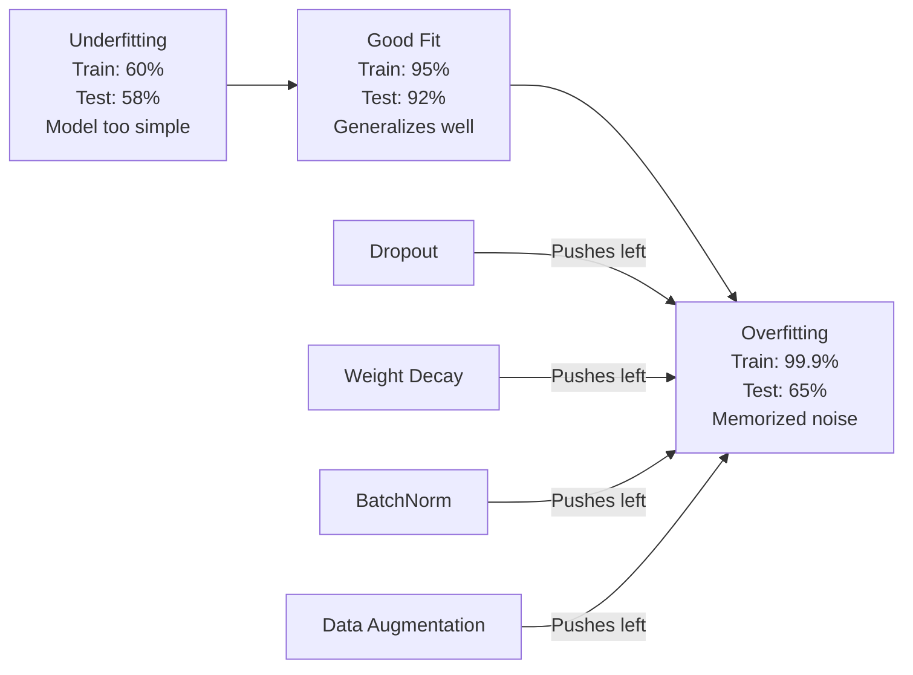
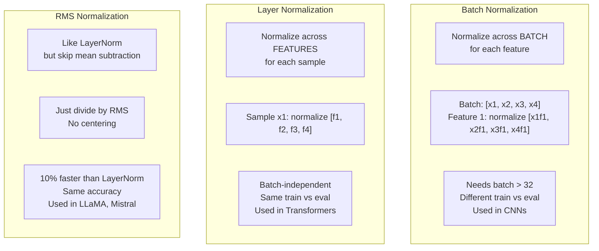
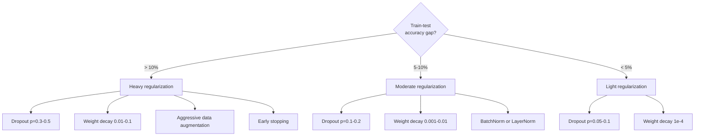

<!-- i18n:manual -->
# Регуляризация

> Ваша модель даёт 99% на обучающих данных и 60% на тестовых. Она запомнила вместо того, чтобы научиться. Регуляризация — это налог на сложность, которым вы заставляете модель обобщать.

**Type:** Build
**Languages:** Python
**Prerequisites:** Lesson 03.06 (Optimizers)
**Time:** ~75 minutes

## Learning Objectives

- Реализовать с нуля dropout с inverted scaling, L2 weight decay, batch normalization, layer normalization и RMSNorm
- Измерить разрыв между точностью на train и test и диагностировать переобучение через эксперименты с регуляризацией
- Объяснить, почему трансформеры используют layer norm вместо batch norm и почему современные LLM предпочитают RMSNorm
- Подбирать комбинацию техник регуляризации в зависимости от того, насколько сильно модель переобучилась

> 🎒 **На пальцах.** Весь урок про одну болезнь: модель отвечает наизусть. Это как школьник, который выучил решебник — те же задачи решает на пять, чуть поменяли числа — двойка. 99% на знакомых примерах против 60% на новых даёт разрыв в 39 процентных пунктов. Дальше мы будем этот разрыв сжимать.

## The Problem

Нейросеть с достаточным числом параметров может запомнить любой набор данных. Это не гипотеза: Zhang et al. (2017) доказали это, обучив обычные сети на ImageNet со случайными метками. Сети дошли почти до нулевой ошибки на обучении, хотя метки были расставлены совершенно случайно. Они запомнили миллион случайных пар «вход — выход», в которых не было никакой закономерности. Ошибка на обучении идеальная. Точность на тесте нулевая.

Это и есть проблема переобучения, и чем больше модель, тем она острее. У GPT-3 175 миллиардов параметров. В обучающем наборе около 500 миллиардов токенов. При таком числе параметров модели хватает ёмкости, чтобы дословно запомнить заметные куски обучающих данных. Без регуляризации она просто пересказывала бы примеры из обучения вместо того, чтобы искать обобщаемые закономерности.

Разрыв между качеством на обучении и качеством на тесте называется overfitting gap. Каждая техника из этого урока бьёт по этому разрыву со своей стороны. Dropout заставляет сеть не полагаться ни на один отдельный нейрон. Weight decay не даёт ни одному весу вырасти слишком большим. Batch norm сглаживает ландшафт потерь, и оптимизатор находит более пологие, лучше обобщающие минимумы. Layer norm делает то же самое, но работает там, где batch norm не справляется: маленькие батчи, последовательности разной длины. RMSNorm делает это на 10% быстрее, отказавшись от вычисления среднего. Каждая техника проста. Вместе они и есть разница между моделью, которая зубрит, и моделью, которая обобщает.

> 🎒 **На пальцах.** 500 миллиардов токенов на 175 миллиардов параметров — это меньше трёх токенов на параметр. Представьте тетрадь на 175 страниц и книгу на 500: переписать всё дословно не выйдет, а вот целые абзацы — запросто. Ровно поэтому большим моделям нужен ограничитель.

## The Concept

### The Overfitting Spectrum

Любая модель стоит где-то на шкале от недообучения (слишком проста, чтобы уловить закономерность) до переобучения (настолько сложна, что ловит шум). Оптимум посередине, и регуляризация толкает модель к нему со стороны переобучения.



> 🎒 **На пальцах.** На схеме три состояния. Недообучение: 60% и 58% — плохо, но честно, как у школьника, который ничего не выучил. Хорошая подгонка: 95% и 92%, разрыв 3 пункта. Переобучение: 99.9% и 65%, разрыв почти 35 пунктов — вот это и есть зубрёжка. Смотреть надо не на первое число, а на разницу между ними.

### Dropout

Самая простая техника регуляризации с самой изящной интерпретацией. Во время обучения выход каждого нейрона обнуляется случайно с вероятностью p.

```
output = activation(z) * mask    where mask[i] ~ Bernoulli(1 - p)
```

При p = 0.5 половина нейронов обнуляется на каждом прямом проходе. Сеть вынуждена учить избыточные представления, потому что не может предсказать, какие нейроны будут доступны. Это мешает co-adaptation — привычке нейронов полагаться на присутствие конкретных соседей.

Ансамблевая интерпретация: сеть из N нейронов с dropout порождает 2^N возможных подсетей (каждая комбинация включённых и выключенных нейронов). Обучение с dropout приближённо обучает все 2^N подсетей одновременно, каждую на своих мини-батчах. На тесте вы используете все нейроны (без dropout) и умножаете выходы на (1 - p), чтобы совпасть с матожиданием во время обучения. Это равносильно усреднению предсказаний 2^N подсетей — огромный ансамбль из одной модели.

На практике масштабирование делают во время обучения, а не на тесте (inverted dropout):

```
During training:  output = activation(z) * mask / (1 - p)
During testing:   output = activation(z)   (no change needed)
```

Так чище: тестовый код вообще ничего не знает про dropout.

Значения по умолчанию: p = 0.1 для трансформеров, p = 0.5 для MLP, p = 0.2-0.3 для свёрточных сетей. Больше dropout — сильнее регуляризация — выше риск недообучения.

> 🎒 **На пальцах.** Dropout похож на тренировку команды, где каждый раз случайно убирают половину игроков: все учатся играть на нескольких позициях и никто не становится незаменимым. При p = 0.5 и 16 нейронах в слое работают примерно 8, а выжившие делятся на (1 − 0.5) = 0.5, то есть удваиваются. Сумма в среднем остаётся прежней.

### Weight Decay (L2 Regularization)

Добавьте к функции потерь сумму квадратов всех весов:

```
total_loss = task_loss + (lambda / 2) * sum(w_i^2)
```

Градиент штрафного слагаемого равен lambda * w. То есть на каждом шаге каждый вес ужимается к нулю на долю, пропорциональную его величине. Большие веса штрафуются сильнее. Модель смещается к решениям, где ни один вес не доминирует.

Почему это помогает обобщению: у переобученных моделей обычно большие веса, которые усиливают шум обучающих данных. Weight decay держит веса маленькими, что ограничивает эффективную ёмкость модели и заставляет её опираться на устойчивые обобщаемые признаки, а не на заученные частности.

Силу задаёт гиперпараметр lambda. Типичные значения:

- 0.01 для AdamW на трансформерах
- 1e-4 для SGD на свёрточных сетях
- 0.1 для сильно переобученных моделей

Как обсуждалось в уроке 06: weight decay и L2-регуляризация эквивалентны в SGD, но не в Adam. При обучении с Adam всегда используйте AdamW (decoupled weight decay).

> 🎒 **На пальцах.** Штраф — это сумма квадратов. Вес 10 добавляет 100, вес 1 добавляет 1: больший вес наказан в сто раз сильнее, а не в десять. Как штраф за скорость, который растёт квадратично: превысил вдвое — платишь вчетверо. Поэтому модель предпочитает много маленьких весов одному огромному.

### Batch Normalization

Нормализуйте выход каждого слоя по мини-батчу, прежде чем передавать его дальше.

Для мини-батча активаций на некотором слое:

```
mu = (1/B) * sum(x_i)           (batch mean)
sigma^2 = (1/B) * sum((x_i - mu)^2)   (batch variance)
x_hat = (x_i - mu) / sqrt(sigma^2 + eps)   (normalize)
y = gamma * x_hat + beta        (scale and shift)
```

Gamma и beta — обучаемые параметры, они позволяют сети отменить нормализацию, если так лучше. Без них вы принудительно требовали бы от каждого слоя нулевого среднего и единичной дисперсии, а сети это может быть не нужно.

**Training vs inference split:** Во время обучения mu и sigma берутся из текущего мини-батча. На инференсе используются скользящие средние, накопленные при обучении (экспоненциальное среднее с momentum = 0.1, то есть 90% старого + 10% нового).

Почему batch norm работает, до сих пор спорят. В исходной статье утверждалось, что он уменьшает «internal covariate shift» — сдвиг распределения входов слоя из-за обновления предыдущих слоёв. Santurkar et al. (2018) показали, что это объяснение неверно. Настоящая причина: batch norm делает ландшафт потерь глаже. Градиенты лучше предсказывают направление, константы Липшица меньше, и оптимизатор может безопасно делать более крупные шаги. Поэтому с batch norm можно ставить более высокий learning rate и сходиться быстрее.

У batch norm есть принципиальное ограничение: он зависит от статистики батча. При размере батча 1 среднее и дисперсия бессмысленны. При маленьких батчах (< 32) статистики шумные и портят качество. Это важно для задач вроде детекции объектов, где память ограничивает размер батча, и языкового моделирования, где длины последовательностей разные.

> 🎒 **На пальцах.** Нормализация — это перевод оценок в единую шкалу. Средний балл класса 4.2, разброс 0.5; ваши 4.7 превращаются в (4.7 − 4.2) / 0.5 = 1.0, то есть «на одно отклонение выше среднего». Batch norm делает так с каждым признаком внутри батча, а gamma и beta дают сети право вернуть всё обратно. Беда одна: если в батче один пример, среднее равно ему самому, а разброс равен нулю — считать нечего.

### Layer Normalization

Нормализуем по признакам, а не по батчу. Для одного примера:

```
mu = (1/D) * sum(x_j)           (feature mean)
sigma^2 = (1/D) * sum((x_j - mu)^2)   (feature variance)
x_hat = (x_j - mu) / sqrt(sigma^2 + eps)
y = gamma * x_hat + beta
```

D — размерность признаков. Каждый пример нормализуется независимо, зависимости от размера батча нет. Поэтому трансформеры используют layer norm вместо batch norm. Длины последовательностей разные, батчи часто маленькие (или равны 1 при генерации), а вычисление одинаково при обучении и на инференсе.

В трансформерах layer norm ставят после каждого блока self-attention и каждого feed-forward блока (Post-LN) или перед ними (Pre-LN, он стабильнее при обучении).

> 🎒 **На пальцах.** Layer norm считает среднее не по классу, а по одному ученику: берёт его оценки по всем предметам и нормирует внутри них. Соседи по батчу вообще не нужны. Поэтому при генерации текста, где батч часто равен 1, layer norm работает ровно так же, как при обучении, и в коде не меняется ни строчки.

### RMSNorm

Layer norm без вычитания среднего. Предложен в работе Zhang & Sennrich (2019).

```
rms = sqrt((1/D) * sum(x_j^2))
y = gamma * x / rms
```

Вот и всё. Ни вычисления среднего, ни параметра beta. Наблюдение такое: перецентрирование (вычитание среднего) в layer norm почти не влияет на качество модели, но стоит вычислений. Убираем его — получаем ту же точность примерно на 10% дешевле.

LLaMA, LLaMA 2, LLaMA 3, Mistral и большинство современных LLM используют RMSNorm вместо layer norm. На масштабе миллиардов параметров и триллионов токенов эти 10% — заметная экономия.

> 🎒 **На пальцах.** RMSNorm выкидывает один шаг — вычитание среднего. Для вектора [3, 4] получаем RMS = sqrt((9 + 16) / 2) = sqrt(12.5) ≈ 3.54, и просто делим на это число. Экономия около 10% времени на каждой нормализации. Мелочь, но при триллионах токенов это как срезать десятую часть маршрута, по которому ездишь каждый день.

### Normalization Comparison



### Data Augmentation as Regularization

Это изменение не модели, а данных. Преобразуем обучающие входы, сохраняя метки:

- Изображения: случайная обрезка, отражение, поворот, изменение цвета, cutout
- Текст: замена синонимов, обратный перевод, случайное удаление слов
- Звук: растяжение во времени, сдвиг высоты тона, добавление шума

Эффект тот же, что у регуляризации: эффективный размер обучающей выборки растёт, и модели труднее запомнить конкретные примеры. Модель, которая видит каждую картинку один раз в исходном виде, может её запомнить. Модель, которая видит 50 изменённых версий каждой картинки, вынуждена выучить инвариантную структуру.

> 🎒 **На пальцах.** Одна фотография кошки — один пример. Отразили, обрезали, повернули, поменяли цвета — и вот их 50 из одной. Датасет на 1000 картинок превращается в 50 000 непохожих. Запомнить 50 000 картинок наизусть уже дороже, чем понять, что у кошки есть уши и усы.

### Early Stopping

Самый простой регуляризатор: остановить обучение, когда ошибка на валидации начала расти. В этот момент модель ещё не переобучилась. На практике вы следите за валидационной ошибкой каждую эпоху, сохраняете лучшую модель и продолжаете обучение ещё некоторое окно терпения — patience (обычно 5-20 эпох). Если за это окно валидационная ошибка не улучшилась, вы останавливаетесь и загружаете лучшие сохранённые веса.

> 🎒 **На пальцах.** Это как перестать зубрить, когда пробники начали ухудшаться. Patience 20 значит: лучший результат был на 120-й эпохе, вы дотерпели до 140-й, улучшений нет — остановились и вернули веса со 120-й. Если план был на 1000 эпох, вы сэкономили 860.

### When to Apply What



```figure
l2-regularization
```

> 🎒 **На пальцах.** Схема читается как рецепт по одному числу — разрыву train минус test. 99% и 65% дают 34 пункта, это ветка «> 10%», значит тяжёлая артиллерия: dropout 0.3-0.5, weight decay 0.01-0.1, агрессивная аугментация, early stopping. А при 95% и 92% разрыв всего 3 пункта, хватит dropout 0.05-0.1 — иначе вы просто испортите работающую модель.

## Build It

### Step 1: Dropout (Train and Eval Mode)

```python
import random
import math


class Dropout:
    def __init__(self, p=0.5):
        self.p = p
        self.training = True
        self.mask = None

    def forward(self, x):
        if not self.training:
            return list(x)
        self.mask = []
        output = []
        for val in x:
            if random.random() < self.p:
                self.mask.append(0)
                output.append(0.0)
            else:
                self.mask.append(1)
                output.append(val / (1 - self.p))
        return output

    def backward(self, grad_output):
        grads = []
        for g, m in zip(grad_output, self.mask):
            if m == 0:
                grads.append(0.0)
            else:
                grads.append(g / (1 - self.p))
        return grads
```

> 🎒 **На пальцах.** Посмотрите на деление в коде: `val / (1 - self.p)`. При p = 0.2 выживший нейрон умножается на 1 / 0.8 = 1.25. Из 10 нейронов гасятся примерно 2, а оставшиеся 8 усилены в 1.25 раза: 8 × 1.25 = 10, сумма в среднем не изменилась. Поэтому в режиме `training = False` не надо делать ничего: масштаб уже верный.

### Step 2: L2 Weight Decay

```python
def l2_regularization(weights, lambda_reg):
    penalty = 0.0
    for w in weights:
        penalty += w * w
    return lambda_reg * 0.5 * penalty

def l2_gradient(weights, lambda_reg):
    return [lambda_reg * w for w in weights]
```

### Step 3: Batch Normalization

```python
class BatchNorm:
    def __init__(self, num_features, momentum=0.1, eps=1e-5):
        self.gamma = [1.0] * num_features
        self.beta = [0.0] * num_features
        self.eps = eps
        self.momentum = momentum
        self.running_mean = [0.0] * num_features
        self.running_var = [1.0] * num_features
        self.training = True
        self.num_features = num_features

    def forward(self, batch):
        batch_size = len(batch)
        if self.training:
            mean = [0.0] * self.num_features
            for sample in batch:
                for j in range(self.num_features):
                    mean[j] += sample[j]
            mean = [m / batch_size for m in mean]

            var = [0.0] * self.num_features
            for sample in batch:
                for j in range(self.num_features):
                    var[j] += (sample[j] - mean[j]) ** 2
            var = [v / batch_size for v in var]

            for j in range(self.num_features):
                self.running_mean[j] = (1 - self.momentum) * self.running_mean[j] + self.momentum * mean[j]
                self.running_var[j] = (1 - self.momentum) * self.running_var[j] + self.momentum * var[j]
        else:
            mean = list(self.running_mean)
            var = list(self.running_var)

        self.x_hat = []
        output = []
        for sample in batch:
            normalized = []
            out_sample = []
            for j in range(self.num_features):
                x_h = (sample[j] - mean[j]) / math.sqrt(var[j] + self.eps)
                normalized.append(x_h)
                out_sample.append(self.gamma[j] * x_h + self.beta[j])
            self.x_hat.append(normalized)
            output.append(out_sample)
        return output
```

> 🎒 **На пальцах.** Строка с momentum = 0.1 — это скользящее среднее: 90% старого значения плюс 10% нового. Как средняя оценка за четверть, которая почти не дёргается от одной случайной тройки. За сотню батчей `running_mean` практически сходится к настоящему среднему по всем данным, и на инференсе сеть пользуется именно им.

### Step 4: Layer Normalization

```python
class LayerNorm:
    def __init__(self, num_features, eps=1e-5):
        self.gamma = [1.0] * num_features
        self.beta = [0.0] * num_features
        self.eps = eps
        self.num_features = num_features

    def forward(self, x):
        mean = sum(x) / len(x)
        var = sum((xi - mean) ** 2 for xi in x) / len(x)

        self.x_hat = []
        output = []
        for j in range(self.num_features):
            x_h = (x[j] - mean) / math.sqrt(var + self.eps)
            self.x_hat.append(x_h)
            output.append(self.gamma[j] * x_h + self.beta[j])
        return output
```

### Step 5: RMSNorm

```python
class RMSNorm:
    def __init__(self, num_features, eps=1e-6):
        self.gamma = [1.0] * num_features
        self.eps = eps
        self.num_features = num_features

    def forward(self, x):
        rms = math.sqrt(sum(xi * xi for xi in x) / len(x) + self.eps)
        output = []
        for j in range(self.num_features):
            output.append(self.gamma[j] * x[j] / rms)
        return output
```

### Step 6: Training With and Without Regularization

```python
def sigmoid(x):
    x = max(-500, min(500, x))
    return 1.0 / (1.0 + math.exp(-x))


def make_circle_data(n=200, seed=42):
    random.seed(seed)
    data = []
    for _ in range(n):
        x = random.uniform(-2, 2)
        y = random.uniform(-2, 2)
        label = 1.0 if x * x + y * y < 1.5 else 0.0
        data.append(([x, y], label))
    return data


class RegularizedNetwork:
    def __init__(self, hidden_size=16, lr=0.05, dropout_p=0.0, weight_decay=0.0):
        random.seed(0)
        self.hidden_size = hidden_size
        self.lr = lr
        self.dropout_p = dropout_p
        self.weight_decay = weight_decay
        self.dropout = Dropout(p=dropout_p) if dropout_p > 0 else None

        self.w1 = [[random.gauss(0, 0.5) for _ in range(2)] for _ in range(hidden_size)]
        self.b1 = [0.0] * hidden_size
        self.w2 = [random.gauss(0, 0.5) for _ in range(hidden_size)]
        self.b2 = 0.0

    def forward(self, x, training=True):
        self.x = x
        self.z1 = []
        self.h = []
        for i in range(self.hidden_size):
            z = self.w1[i][0] * x[0] + self.w1[i][1] * x[1] + self.b1[i]
            self.z1.append(z)
            self.h.append(max(0.0, z))

        if self.dropout and training:
            self.dropout.training = True
            self.h = self.dropout.forward(self.h)
        elif self.dropout:
            self.dropout.training = False
            self.h = self.dropout.forward(self.h)

        self.z2 = sum(self.w2[i] * self.h[i] for i in range(self.hidden_size)) + self.b2
        self.out = sigmoid(self.z2)
        return self.out

    def backward(self, target):
        eps = 1e-15
        p = max(eps, min(1 - eps, self.out))
        d_loss = -(target / p) + (1 - target) / (1 - p)
        d_sigmoid = self.out * (1 - self.out)
        d_out = d_loss * d_sigmoid

        for i in range(self.hidden_size):
            d_relu = 1.0 if self.z1[i] > 0 else 0.0
            d_h = d_out * self.w2[i] * d_relu
            self.w2[i] -= self.lr * (d_out * self.h[i] + self.weight_decay * self.w2[i])
            for j in range(2):
                self.w1[i][j] -= self.lr * (d_h * self.x[j] + self.weight_decay * self.w1[i][j])
            self.b1[i] -= self.lr * d_h
        self.b2 -= self.lr * d_out

    def evaluate(self, data):
        correct = 0
        total_loss = 0.0
        for x, y in data:
            pred = self.forward(x, training=False)
            eps = 1e-15
            p = max(eps, min(1 - eps, pred))
            total_loss += -(y * math.log(p) + (1 - y) * math.log(1 - p))
            if (pred >= 0.5) == (y >= 0.5):
                correct += 1
        return total_loss / len(data), correct / len(data) * 100

    def train_model(self, train_data, test_data, epochs=300):
        history = []
        for epoch in range(epochs):
            total_loss = 0.0
            correct = 0
            for x, y in train_data:
                pred = self.forward(x, training=True)
                self.backward(y)
                eps = 1e-15
                p = max(eps, min(1 - eps, pred))
                total_loss += -(y * math.log(p) + (1 - y) * math.log(1 - p))
                if (pred >= 0.5) == (y >= 0.5):
                    correct += 1
            train_loss = total_loss / len(train_data)
            train_acc = correct / len(train_data) * 100
            test_loss, test_acc = self.evaluate(test_data)
            history.append((train_loss, train_acc, test_loss, test_acc))
            if epoch % 75 == 0 or epoch == epochs - 1:
                gap = train_acc - test_acc
                print(f"    Epoch {epoch:3d}: train_acc={train_acc:.1f}%, test_acc={test_acc:.1f}%, gap={gap:.1f}%")
        return history
```

> 🎒 **На пальцах.** Обратите внимание на печать: `gap = train_acc - test_acc`. Это и есть главный измеритель урока. Запустите сеть с `dropout_p=0.0, weight_decay=0.0`, а потом с `dropout_p=0.3, weight_decay=0.01` и сравните gap на последней эпохе. Точность на train почти наверняка упадёт — и это нормально, вы платите за то, чтобы test подтянулся.

## Use It

PyTorch даёт всю нормализацию и регуляризацию в виде готовых модулей:

```python
import torch
import torch.nn as nn

model = nn.Sequential(
    nn.Linear(784, 256),
    nn.BatchNorm1d(256),
    nn.ReLU(),
    nn.Dropout(0.3),
    nn.Linear(256, 128),
    nn.BatchNorm1d(128),
    nn.ReLU(),
    nn.Dropout(0.3),
    nn.Linear(128, 10),
)

model.train()
out_train = model(torch.randn(32, 784))

model.eval()
out_test = model(torch.randn(1, 784))
```

Переключатель `model.train()` / `model.eval()` критически важен. Он включает и выключает dropout и говорит batch norm, чем пользоваться: статистикой батча или накопленными средними. Забытый `model.eval()` перед инференсом — одна из самых частых ошибок в глубоком обучении. Точность на тесте будет случайно скакать, потому что dropout всё ещё активен, а batch norm считает по мини-батчу.

Для трансформеров шаблон другой:

```python
class TransformerBlock(nn.Module):
    def __init__(self, d_model=512, nhead=8, dropout=0.1):
        super().__init__()
        self.attention = nn.MultiheadAttention(d_model, nhead, dropout=dropout)
        self.norm1 = nn.LayerNorm(d_model)
        self.ff = nn.Sequential(
            nn.Linear(d_model, d_model * 4),
            nn.GELU(),
            nn.Linear(d_model * 4, d_model),
            nn.Dropout(dropout),
        )
        self.norm2 = nn.LayerNorm(d_model)
        self.dropout = nn.Dropout(dropout)

    def forward(self, x):
        attended, _ = self.attention(x, x, x)
        x = self.norm1(x + self.dropout(attended))
        x = self.norm2(x + self.ff(x))
        return x
```

LayerNorm, а не BatchNorm. Dropout p=0.1, а не p=0.5. Это стандартные значения для трансформеров.

> 🎒 **На пальцах.** `model.eval()` — это как убрать шпаргалки перед проверкой. Забыли вызвать — dropout продолжает гасить нейроны, и один и тот же пример на каждом прогоне даст разный ответ. Точность будет прыгать на несколько процентов от запуска к запуску, а виновата одна пропущенная строчка.

## Ship It

Этот урок производит:
- `outputs/prompt-regularization-advisor.md` -- промпт, который диагностирует переобучение и рекомендует подходящую стратегию регуляризации

## Exercises

1. Реализуйте spatial dropout для двумерных данных: вместо отдельных нейронов гасите целые каналы признаков. Смоделируйте это, считая группы подряд идущих признаков каналами и обнуляя группы целиком. Сравните train-test gap с обычным dropout на датасете-круге при hidden_size=32.

2. Реализуйте label smoothing из урока 05 вместе с dropout из этого урока. Обучите четыре конфигурации: без обоих, только dropout, только label smoothing, оба сразу. Измерьте итоговый разрыв train-test точности для каждой. Какая комбинация даёт наименьший разрыв?

3. Добавьте слой batch norm между скрытым слоем и активацией в вашей сети на датасете-круге. Обучите с ним и без него при learning rate 0.01, 0.05 и 0.1. Batch norm должен позволить стабильно обучаться на больших learning rate, где обычная сеть расходится.

4. Реализуйте early stopping: следите за тестовой ошибкой каждую эпоху, сохраняйте лучшие веса и останавливайтесь, если ошибка не улучшалась 20 эпох. Запустите регуляризованную сеть на 1000 эпох. Сообщите, на какой эпохе была лучшая тестовая точность и сколько эпох вычислений вы сэкономили.

5. Сравните layer norm и RMSNorm на четырёхслойной сети (не двухслойной). Инициализируйте обе одинаковыми весами. Обучите 200 эпох и сравните итоговую точность, скорость обучения (время на эпоху) и величины градиентов на первом слое. Убедитесь, что RMSNorm быстрее при той же точности.

> 🎒 **На пальцах.** Подсказка к четвёртому заданию: заведите три переменные — best_loss, best_epoch и счётчик «сколько эпох без улучшения». Стало лучше — сохранили веса и обнулили счётчик; нет — прибавили 1. Счётчик дошёл до 20 — стоп. Если лучшая эпоха оказалась 180-й из 1000, вы сэкономили 800 эпох счёта.

## Key Terms

| Term | What people say | What it actually means |
|------|----------------|----------------------|
| Overfitting | «Модель запомнила данные» | Качество на обучении заметно выше качества на тесте: модель выучила шум, а не сигнал |
| Regularization | «Борьба с переобучением» | Любая техника, ограничивающая сложность модели ради обобщения: dropout, weight decay, нормализация, аугментация |
| Dropout | «Случайное удаление нейронов» | Обнуление случайных нейронов при обучении с вероятностью p; заставляет учить избыточные представления, равносильно обучению ансамбля |
| Weight decay | «Штраф L2» | Ужимание всех весов к нулю вычитанием lambda * w на каждом шаге; штрафует сложность через величину весов |
| Batch normalization | «Нормализация по батчу» | Нормализация выходов слоя по измерению батча: статистика батча при обучении и накопленные средние на инференсе |
| Layer normalization | «Нормализация по примеру» | Нормализация по признакам внутри каждого примера; не зависит от батча, используется в трансформерах, где размер батча плавает |
| RMSNorm | «LayerNorm без среднего» | Нормализация по среднеквадратичному значению; убирает вычитание среднего ради ускорения на 10% при той же точности |
| Early stopping | «Остановиться до переобучения» | Прекращение обучения, когда валидационная ошибка перестала улучшаться; самый простой регуляризатор, часто идёт вместе с остальными |
| Data augmentation | «Больше данных из меньшего» | Преобразование обучающих входов (отражение, обрезка, шум) ради роста эффективного размера датасета и выучивания инвариантностей |
| Generalization gap | «Разница train и test» | Разница между качеством на обучении и на тесте; регуляризация нужна, чтобы её уменьшить |

## Further Reading

- Srivastava et al., "Dropout: A Simple Way to Prevent Neural Networks from Overfitting" (2014) -- оригинальная статья про dropout с ансамблевой интерпретацией и большим набором экспериментов
- Ioffe & Szegedy, "Batch Normalization: Accelerating Deep Network Training by Reducing Internal Covariate Shift" (2015) -- ввела batch norm и его процедуру обучения, одна из самых цитируемых работ в глубоком обучении
- Zhang & Sennrich, "Root Mean Square Layer Normalization" (2019) -- показала, что RMSNorm повторяет точность layer norm при меньших вычислениях; принята в LLaMA и Mistral
- Zhang et al., "Understanding Deep Learning Requires Rethinking Generalization" (2017) -- знаковая работа, показавшая, что нейросети способны запомнить случайные метки, и пошатнувшая привычные взгляды на обобщение
