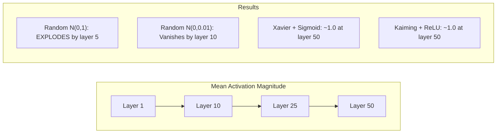
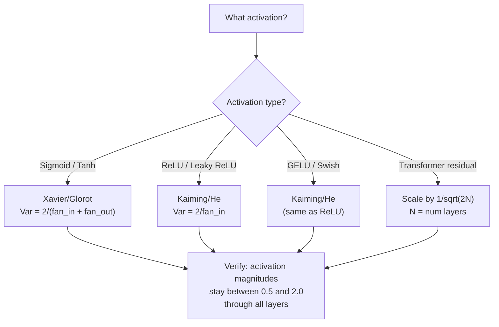

<!-- i18n:manual -->
# Инициализация весов и стабильность обучения

> Проинициализируете неправильно — обучение вообще не начнётся. Проинициализируете правильно — 50 слоёв обучаются так же гладко, как 3.

**Type:** Build
**Languages:** Python
**Prerequisites:** Lesson 03.04 (Activation Functions), Lesson 03.07 (Regularization)
**Time:** ~90 minutes

## Learning Objectives

- Реализовать нулевую, случайную, Xavier/Glorot и Kaiming/He инициализацию и измерить их влияние на величину активаций через 50 слоёв
- Вывести, почему Xavier использует Var(w) = 2/(fan_in + fan_out), а Kaiming — Var(w) = 2/fan_in
- Показать проблему симметрии при нулевой инициализации и объяснить, почему одной случайности недостаточно
- Подбирать инициализацию под функцию активации: Xavier для sigmoid/tanh, Kaiming для ReLU/GELU

> 🎒 **На пальцах.** Инициализация — это стартовые числа в весах до всякого обучения. Как расстановка фигур перед партией: поставили неправильно — играть невозможно, сколько ни думай. Весь урок сводится к одной цифре: какой разброс дать случайным весам, чтобы сигнал не затух и не взорвался.

## The Problem

Проинициализируйте все веса нулями. Ничего не выучится. Каждый нейрон вычисляет одну и ту же функцию, получает один и тот же градиент и обновляется одинаково. После 10 000 эпох ваш скрытый слой на 512 нейронов остаётся 512 копиями одного нейрона. Вы заплатили за 512 параметров, а получили 1.

Проинициализируйте слишком большими значениями. Активации взрываются по мере прохода по сети. К 10-му слою значения доходят до 1e15. К 20-му они переполняются до бесконечности. Градиенты идут по той же траектории в обратную сторону.

Проинициализируйте случайно из стандартного нормального распределения. Для 3 слоёв работает. На 50 слоях сигнал схлопывается в ноль или уходит в бесконечность в зависимости от того, был случайный масштаб чуть меньше или чуть больше нужного. Граница между «работает» и «сломано» тоньше волоса.

Инициализация весов — самое недооценённое решение в глубоком обучении. Про архитектуры пишут статьи. Про оптимизаторы пишут посты в блогах. Инициализации достаётся сноска. Но ошибитесь здесь — и остальное уже неважно: сеть мертва ещё до начала обучения.

> 🎒 **На пальцах.** Сравните три сценария на одном слое из 512 нейронов. Нули — 512 одинаковых нейронов, полезных параметров ровно 1. Слишком крупные веса — к 20-му слою числа больше, чем float вообще может хранить. Слишком мелкие — к 10-му слою всё превратилось в нули. Рабочий диапазон узкий, и мы будем целиться прямо в него.

## The Concept

### The Symmetry Problem

Каждый нейрон в слое устроен одинаково: умножить входы на веса, прибавить смещение, применить активацию. Если все веса стартуют с одного значения (ноль — крайний случай), каждый нейрон выдаёт один и тот же выход. При обратном распространении каждый нейрон получает один и тот же градиент. На шаге обновления каждый нейрон меняется на одну и ту же величину.

Тупик. У сети сотни параметров, но все они двигаются синхронно. Это называется симметрией, и случайная инициализация — грубый, но работающий способ её сломать. Каждый нейрон стартует из своей точки в пространстве весов, поэтому каждый учит свой признак.

Но «случайно» ещё не всё. Обучится сеть или нет, решает *масштаб* случайности.

> 🎒 **На пальцах.** Представьте класс, где все ученики списывают друг у друга одну и ту же работу. Оценки одинаковые, ошибки одинаковые, исправления одинаковые — и так весь год. Тридцать человек делают работу одного. Случайная инициализация — это раздать всем разные варианты задания.

### Variance Propagation Through Layers

Возьмём один слой с fan_in входами:

```
z = w1*x1 + w2*x2 + ... + w_n*x_n
```

Если каждый вес wi берётся из распределения с дисперсией Var(w), а каждый вход xi имеет дисперсию Var(x), то дисперсия выхода равна:

```
Var(z) = fan_in * Var(w) * Var(x)
```

Если Var(w) = 1 и fan_in = 512, дисперсия выхода в 512 раз больше дисперсии входа. После 10 слоёв: 512^10 = 1.2e27. Сигнал взорвался.

Если Var(w) = 0.001, дисперсия выхода умножается на 0.001 * 512 = 0.512 за слой. После 10 слоёв: 0.512^10 = 0.00013. Сигнал затух.

Цель: выбрать Var(w) так, чтобы Var(z) = Var(x). Тогда величина сигнала не меняется от слоя к слою.

> 🎒 **На пальцах.** Это как копировать копию копии. Множитель 1.05 за слой почти незаметен, но 1.05^50 ≈ 11.5 — картинка стала в 11 раз ярче. Множитель 0.95 за слой даёт 0.95^50 ≈ 0.08 — почти ничего не осталось. Нужен множитель ровно 1.0, и вся математика этого урока — про то, как его получить.

### Xavier/Glorot Initialization

Glorot и Bengio (2010) вывели решение для активаций sigmoid и tanh. Чтобы дисперсия оставалась постоянной и на прямом, и на обратном проходе:

```
Var(w) = 2 / (fan_in + fan_out)
```

На практике веса берут из:

```
w ~ Uniform(-limit, limit)  where limit = sqrt(6 / (fan_in + fan_out))
```

или:

```
w ~ Normal(0, sqrt(2 / (fan_in + fan_out)))
```

Работает это потому, что sigmoid и tanh почти линейны около нуля, а правильно проинициализированные активации живут именно там. Дисперсия остаётся стабильной на десятках слоёв.

> 🎒 **На пальцах.** Возьмём слой 512 → 512. Xavier даёт Var(w) = 2 / (512 + 512) = 0.00195, то есть разброс sqrt(0.00195) ≈ 0.044. Веса стартуют крошечными — сотые доли. Это и есть настоящий ответ на вопрос «какие числа поставить в начале»: не 1 и не 0.5, а примерно 0.04.

### Kaiming/He Initialization

ReLU убивает половину выходов: всё отрицательное становится нулём. Эффективный fan_in уменьшается вдвое, потому что в среднем половина входов обнулена. Xavier этого не учитывает и недооценивает нужную дисперсию.

He et al. (2015) поправили формулу:

```
Var(w) = 2 / fan_in
```

Веса берут из:

```
w ~ Normal(0, sqrt(2 / fan_in))
```

Двойка компенсирует то, что ReLU обнуляет половину активаций. Без неё сигнал ужимается примерно в 0.5 раза за слой. На 50 слоях: 0.5^50 = 8.8e-16. Kaiming это предотвращает.

> 🎒 **На пальцах.** ReLU — как фильтр, который пропускает только положительные числа, а их примерно половина. Половину выбросили — оставшиеся надо сделать вдвое «громче», отсюда двойка в числителе. При 100 входах He даёт разброс sqrt(2/100) ≈ 0.14, а Xavier на слое 100 → 100 дал бы sqrt(2/200) ≈ 0.10. Разница вроде мелкая, но за 50 слоёв она превращается в пропасть.

### Transformer Initialization

GPT-2 ввёл другой приём. Residual-связи прибавляют выход каждого подслоя к его входу:

```
x = x + sublayer(x)
```

Каждое такое сложение увеличивает дисперсию. При N residual-слоях дисперсия растёт пропорционально N. GPT-2 масштабирует веса residual-слоёв на 1/sqrt(2N), где N — число слоёв. Это удерживает накопленную величину сигнала стабильной.

Llama 3 (405 миллиардов параметров, 126 слоёв) использует похожую схему. Без такого масштабирования residual-поток рос бы неограниченно через 126 слоёв внимания и feedforward-блоков.

```mermaid
flowchart TD
    subgraph "Zero Init"
        Z1["Layer 1<br/>All weights = 0"] --> Z2["Layer 2<br/>All neurons identical"]
        Z2 --> Z3["Layer 3<br/>Still identical"]
        Z3 --> ZR["Result: 1 effective neuron<br/>regardless of width"]
    end

    subgraph "Xavier Init"
        X1["Layer 1<br/>Var = 2/(fan_in+fan_out)"] --> X2["Layer 2<br/>Signal stable"]
        X2 --> X3["Layer 50<br/>Signal stable"]
        X3 --> XR["Result: Trains with<br/>sigmoid/tanh"]
    end

    subgraph "Kaiming Init"
        K1["Layer 1<br/>Var = 2/fan_in"] --> K2["Layer 2<br/>Signal stable"]
        K2 --> K3["Layer 50<br/>Signal stable"]
        K3 --> KR["Result: Trains with<br/>ReLU/GELU"]
    end
```



> 🎒 **На пальцах.** Residual-поток — как снежный ком: каждый слой досыпает свою горсть. Для GPT-2 с 12 слоями множитель равен 1/sqrt(2 × 12) = 1/sqrt(24) ≈ 0.204, то есть вклад каждого слоя ужимается в пять раз. Для Llama 3 со 126 слоями — 1/sqrt(252) ≈ 0.063, то есть в шестнадцать раз. Чем длиннее сеть, тем тише должен говорить каждый слой.

### Activation Magnitude Through 50 Layers



> 🎒 **На пальцах.** Читайте схему как таблицу результатов. N(0,1) взрывается уже к 5-му слою, N(0,0.01) затухает к 10-му — обе не доживают и до четверти сети. Xavier с sigmoid и Kaiming с ReLU держат величину около 1.0 на 50-м слое. Это те же самые 50 слоёв, разница только в стартовых числах.

### Choosing the Right Init



```figure
weight-init-variance
```

> 🎒 **На пальцах.** Схема — это правило из одной строки: посмотрели на активацию, взяли инициализацию. Sigmoid или tanh — Xavier. ReLU, Leaky ReLU, GELU, Swish — Kaiming. Трансформер с residual — ещё домножить на 1/sqrt(2N). И проверка одна и та же: величина активаций должна остаться между 0.5 и 2.0 на всех слоях.

## Build It

### Step 1: Initialization Strategies

Четыре способа проинициализировать матрицу весов. Каждый возвращает список списков (двумерную матрицу) с fan_in столбцами и fan_out строками.

```python
import math
import random


def zero_init(fan_in, fan_out):
    return [[0.0 for _ in range(fan_in)] for _ in range(fan_out)]


def random_init(fan_in, fan_out, scale=1.0):
    return [[random.gauss(0, scale) for _ in range(fan_in)] for _ in range(fan_out)]


def xavier_init(fan_in, fan_out):
    std = math.sqrt(2.0 / (fan_in + fan_out))
    return [[random.gauss(0, std) for _ in range(fan_in)] for _ in range(fan_out)]


def kaiming_init(fan_in, fan_out):
    std = math.sqrt(2.0 / fan_in)
    return [[random.gauss(0, std) for _ in range(fan_in)] for _ in range(fan_out)]
```

> 🎒 **На пальцах.** Все четыре функции отличаются буквально одним числом — вторым аргументом `random.gauss`. Для слоя 64 → 64 это 0.0 у нулевой, 1.0 у случайной, sqrt(2/128) ≈ 0.125 у Xavier и sqrt(2/64) ≈ 0.177 у Kaiming. Один множитель решает, обучится сеть или умрёт.

### Step 2: Activation Functions

Нам нужны sigmoid, tanh и ReLU, чтобы проверить каждую стратегию с той активацией, под которую она задумана.

```python
def sigmoid(x):
    x = max(-500, min(500, x))
    return 1.0 / (1.0 + math.exp(-x))


def tanh_act(x):
    return math.tanh(x)


def relu(x):
    return max(0.0, x)
```

### Step 3: Forward Pass Through 50 Layers

Прогоняем случайные данные через глубокую сеть и меряем среднюю величину активации на каждом слое.

```python
def forward_deep(init_fn, activation_fn, n_layers=50, width=64, n_samples=100):
    random.seed(42)
    layer_magnitudes = []

    inputs = [[random.gauss(0, 1) for _ in range(width)] for _ in range(n_samples)]

    for layer_idx in range(n_layers):
        weights = init_fn(width, width)
        biases = [0.0] * width

        new_inputs = []
        for sample in inputs:
            output = []
            for neuron_idx in range(width):
                z = sum(weights[neuron_idx][j] * sample[j] for j in range(width)) + biases[neuron_idx]
                output.append(activation_fn(z))
            new_inputs.append(output)
        inputs = new_inputs

        magnitudes = []
        for sample in inputs:
            magnitudes.append(sum(abs(v) for v in sample) / width)
        mean_mag = sum(magnitudes) / len(magnitudes)
        layer_magnitudes.append(mean_mag)

    return layer_magnitudes
```

> 🎒 **На пальцах.** Функция считает среднее от модулей: `sum(abs(v) for v in sample) / width`. Для вектора [0.8, -1.2, 0.0, 0.4] это (0.8 + 1.2 + 0 + 0.4) / 4 = 0.6. Одно число вместо 64 — как средний балл вместо списка всех оценок. Именно за этим числом мы и следим на протяжении 50 слоёв.

### Step 4: The Experiment

Запускаем все комбинации: нулевая инициализация, случайная N(0,1), случайная N(0,0.01), Xavier с sigmoid, Xavier с tanh, Kaiming с ReLU. Печатаем величину на ключевых слоях.

```python
def run_experiment():
    configs = [
        ("Zero init + Sigmoid", lambda fi, fo: zero_init(fi, fo), sigmoid),
        ("Random N(0,1) + ReLU", lambda fi, fo: random_init(fi, fo, 1.0), relu),
        ("Random N(0,0.01) + ReLU", lambda fi, fo: random_init(fi, fo, 0.01), relu),
        ("Xavier + Sigmoid", xavier_init, sigmoid),
        ("Xavier + Tanh", xavier_init, tanh_act),
        ("Kaiming + ReLU", kaiming_init, relu),
    ]

    print(f"{'Strategy':<30} {'L1':>10} {'L5':>10} {'L10':>10} {'L25':>10} {'L50':>10}")
    print("-" * 80)

    for name, init_fn, act_fn in configs:
        mags = forward_deep(init_fn, act_fn)
        row = f"{name:<30}"
        for idx in [0, 4, 9, 24, 49]:
            val = mags[idx]
            if val > 1e6:
                row += f" {'EXPLODED':>10}"
            elif val < 1e-6:
                row += f" {'VANISHED':>10}"
            else:
                row += f" {val:>10.4f}"
        print(row)
```

> 🎒 **На пальцах.** Пороги в коде честные и грубые: больше 1e6 — печатаем EXPLODED, меньше 1e-6 — VANISHED. Строка «Zero init + Sigmoid» даст ровно 0.5 на всех слоях, потому что sigmoid(0) = 0.5, и число никогда не сдвинется. Не взорвалось, не затухло — просто мёртвая константа.

### Step 5: Symmetry Demonstration

Показываем, что нулевая инициализация делает нейроны идентичными.

```python
def symmetry_demo():
    random.seed(42)
    weights = zero_init(2, 4)
    biases = [0.0] * 4

    inputs = [0.5, -0.3]
    outputs = []
    for neuron_idx in range(4):
        z = sum(weights[neuron_idx][j] * inputs[j] for j in range(2)) + biases[neuron_idx]
        outputs.append(sigmoid(z))

    print("\nSymmetry Demo (4 neurons, zero init):")
    for i, out in enumerate(outputs):
        print(f"  Neuron {i}: output = {out:.6f}")
    all_same = all(abs(outputs[i] - outputs[0]) < 1e-10 for i in range(len(outputs)))
    print(f"  All identical: {all_same}")
    print(f"  Effective parameters: 1 (not {len(weights) * len(weights[0])})")
```

> 🎒 **На пальцах.** Считаем руками: все веса нули, вход [0.5, -0.3], значит z = 0×0.5 + 0×(-0.3) + 0 = 0 для каждого из 4 нейронов. Дальше sigmoid(0) = 0.5, и все четыре печатают 0.500000. Отсюда и последняя строка: полезных параметров 1, а не 8. Вы оплатили восемь мест в классе, а работу сдал один человек.

### Step 6: Layer-by-Layer Magnitude Report

Печатаем текстовую диаграмму величин активаций через 50 слоёв.

```python
def magnitude_report(name, magnitudes):
    print(f"\n{name}:")
    for i, mag in enumerate(magnitudes):
        if i % 5 == 0 or i == len(magnitudes) - 1:
            if mag > 1e6:
                bar = "X" * 50 + " EXPLODED"
            elif mag < 1e-6:
                bar = "." + " VANISHED"
            else:
                bar_len = min(50, max(1, int(mag * 10)))
                bar = "#" * bar_len
            print(f"  Layer {i+1:3d}: {bar} ({mag:.6f})")
```

> 🎒 **На пальцах.** Длина полоски — это `int(mag * 10)`, обрезанная до 50. Величина 1.0 даёт 10 символов `#`, величина 0.2 — два, величина 5.0 — пятьдесят. Здоровая сеть рисует ровный столбик примерно из десяти решёток на всех слоях; больная — сужающийся клин или сплошную стену из X.

## Use It

PyTorch даёт всё это готовыми функциями:

```python
import torch
import torch.nn as nn

layer = nn.Linear(512, 256)

nn.init.xavier_uniform_(layer.weight)
nn.init.xavier_normal_(layer.weight)

nn.init.kaiming_uniform_(layer.weight, nonlinearity='relu')
nn.init.kaiming_normal_(layer.weight, nonlinearity='relu')

nn.init.zeros_(layer.bias)
```

Когда вы вызываете `nn.Linear(512, 256)`, PyTorch по умолчанию использует Kaiming uniform. Поэтому большинство простых сетей «просто работают» — PyTorch уже сделал правильный выбор за вас. Но как только вы строите свою архитектуру или уходите глубже 20 слоёв, нужно понимать, что происходит, и при необходимости переопределять умолчание.

Для трансформеров модели HuggingFace обычно задают инициализацию в методе `_init_weights`. Реализация GPT-2 масштабирует residual-проекции на 1/sqrt(N). Если вы пишете трансформер с нуля, это придётся добавить самому.

> 🎒 **На пальцах.** Вот почему ваша первая сеть на PyTorch заработала без всяких формул: `nn.Linear` уже подставил Kaiming. Для слоя 512 → 256 это разброс порядка sqrt(2/512) ≈ 0.0625. Никакой магии, просто разумное умолчание, о котором вы не знали.

## Ship It

Этот урок производит:
- `outputs/prompt-init-strategy.md` -- промпт, который диагностирует проблемы с инициализацией весов и рекомендует подходящую стратегию

## Exercises

1. Добавьте инициализацию LeCun (Var = 1/fan_in, придумана под активацию SELU). Прогоните эксперимент на 50 слоёв с LeCun + tanh и сравните с Xavier + tanh.

2. Реализуйте residual-масштабирование из GPT-2: умножайте выход каждого слоя на 1/sqrt(2*N) перед прибавлением к residual-потоку. Прогоните 50 слоёв с масштабированием и без, измерьте, как быстро растёт величина residual.

3. Напишите функцию «проверки здоровья инициализации», которая берёт размерности слоёв сети и тип активации, рекомендует правильную инициализацию и предупреждает, если текущая приведёт к проблемам.

4. Прогоните эксперимент при fan_in = 16 и при fan_in = 1024. Xavier и Kaiming подстраиваются под fan_in, а случайная инициализация — нет. Покажите, как разрыв между «работает» и «ломается» растёт с размером слоёв.

5. Реализуйте ортогональную инициализацию: сгенерируйте случайную матрицу, посчитайте её SVD и возьмите ортогональную матрицу U. Сравните с Kaiming на ReLU-сетях глубиной 50 слоёв.

> 🎒 **На пальцах.** Подсказка к четвёртому заданию: посчитайте разброс заранее. Kaiming при fan_in = 16 даёт sqrt(2/16) ≈ 0.354, при fan_in = 1024 — sqrt(2/1024) ≈ 0.044, то есть в восемь раз меньше. Случайная инициализация с фиксированным scale = 1.0 не знает про эти числа вовсе, поэтому на широких слоях взрывается гораздо раньше, чем на узких.

## Key Terms

| Term | What people say | What it actually means |
|------|----------------|----------------------|
| Weight initialization | «Задать стартовые веса случайно» | Стратегия выбора начальных значений весов, от которой зависит, сможет ли сеть обучаться вообще |
| Symmetry breaking | «Сделать нейроны разными» | Использование случайной инициализации, чтобы нейроны учили разные признаки, а не вычисляли одну и ту же функцию |
| Fan-in | «Сколько входов у нейрона» | Число входящих связей; определяет, как дисперсия входов накапливается во взвешенной сумме |
| Fan-out | «Сколько выходов у нейрона» | Число исходящих связей; важно для сохранения дисперсии градиентов при обратном распространении |
| Xavier/Glorot init | «Инициализация под sigmoid» | Var(w) = 2/(fan_in + fan_out), придумана для сохранения дисперсии через активации sigmoid и tanh |
| Kaiming/He init | «Инициализация под ReLU» | Var(w) = 2/fan_in, учитывает, что ReLU обнуляет половину активаций |
| Variance propagation | «Как сигнал растёт или затухает по слоям» | Математический разбор того, как дисперсия активаций меняется от слоя к слою в зависимости от масштаба весов |
| Residual scaling | «Трюк с инициализацией из GPT-2» | Масштабирование весов residual-связей на 1/sqrt(2N), чтобы дисперсия не росла через N слоёв трансформера |
| Dead network | «Ничего не обучается» | Сеть, где из-за плохой инициализации все градиенты нулевые или все активации в насыщении |
| Exploding activations | «Значения уходят в бесконечность» | Слишком большая дисперсия весов, из-за которой величина активаций растёт экспоненциально по слоям |

## Further Reading

- Glorot & Bengio, "Understanding the difficulty of training deep feedforward neural networks" (2010) -- оригинальная статья про инициализацию Xavier с разбором дисперсии
- He et al., "Delving Deep into Rectifiers" (2015) -- ввела инициализацию Kaiming для ReLU-сетей
- Radford et al., "Language Models are Unsupervised Multitask Learners" (2019) -- статья про GPT-2 с residual-масштабированием при инициализации
- Mishkin & Matas, "All You Need is a Good Init" (2016) -- послойная инициализация с единичной дисперсией, эмпирическая альтернатива аналитическим формулам
