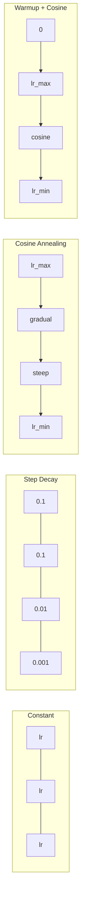
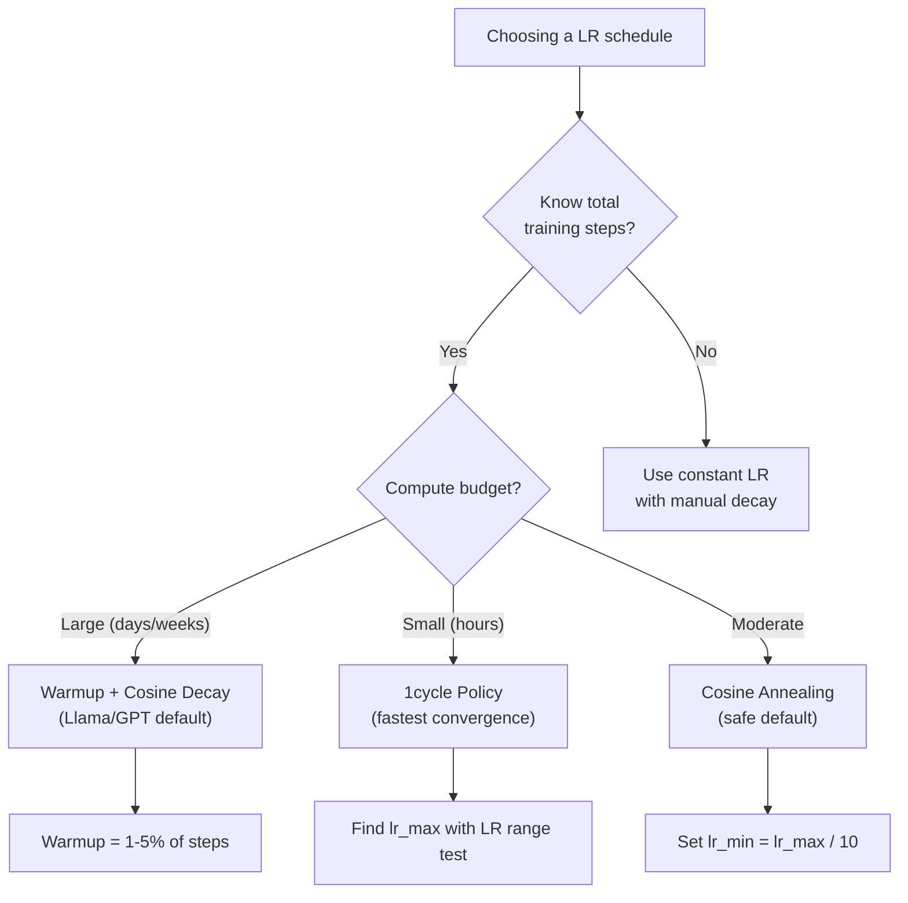
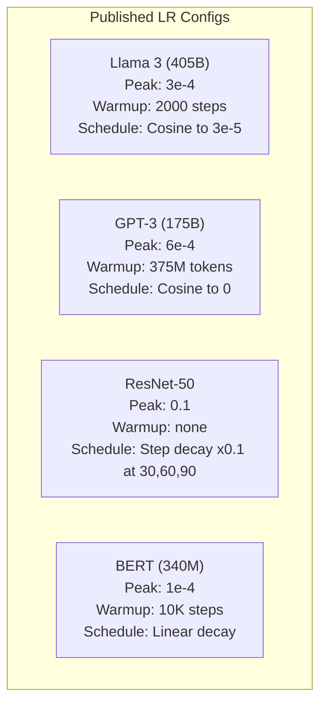

<!-- i18n:manual -->
# Расписания learning rate и warmup

> Learning rate — самый важный гиперпараметр. Не архитектура. Не размер датасета. Не функция активации. Learning rate. Если вы настраиваете что-то одно, настраивайте именно его.

**Type:** Build
**Languages:** Python
**Prerequisites:** Lesson 03.06 (Optimizers), Lesson 03.08 (Weight Initialization)
**Time:** ~90 minutes

## Learning Objectives

- Реализовать с нуля пять расписаний learning rate: constant, step decay, cosine annealing, warmup + cosine и 1cycle
- Показать три способа промахнуться с learning rate: расходимость (слишком большой), застревание (слишком маленький) и колебания (нет затухания)
- Объяснить, зачем warmup нужен оптимизаторам на базе Adam и как он стабилизирует начало обучения
- Сравнить скорость сходимости всех пяти расписаний на одной задаче и выбрать подходящее под заданный бюджет обучения

> 🎒 **На пальцах.** Learning rate — это длина шага. Спускаетесь с горы в тумане: шагаете по метру — быстро, но легко перелететь через ложбину; шагаете по сантиметру — не промахнётесь, но идти будете до вечера. Разница между lr=0.1 и lr=0.0001 — ровно в тысячу раз, и обе крайности одинаково плохи. Этот урок про то, как менять длину шага по ходу спуска.

## The Problem

Поставьте learning rate 0.1. Обучение расходится — за 3 шага loss улетает в бесконечность. Поставьте 0.0001. Обучение ползёт — после 100 эпох модель почти не отошла от случайного начала. Поставьте 0.01. Пятьдесят эпох всё хорошо, а потом loss колеблется вокруг минимума, до которого не может добраться, потому что шаги слишком большие.

Оптимальный learning rate — не константа. Он меняется по ходу обучения. В начале нужны большие шаги, чтобы быстро покрыть расстояние. В конце — крошечные, чтобы осесть в узком минимуме. Разница между моделью на 90% точности и моделью на 95% часто сводится к одному лишь расписанию.

Каждая заметная модель последних трёх лет использует расписание learning rate. Llama 3 обучали с пиком lr=3e-4, 2000 шагами warmup и cosine-затуханием до 3e-5. GPT-3 — с lr=6e-4 и warmup длиной 375 миллионов токенов. Это не случайные числа. Это итог огромных переборов гиперпараметров стоимостью в миллионы долларов.

Расписания нужно понимать, потому что значения по умолчанию под вашу задачу не подойдут. При дообучении готовой модели правильное расписание совсем не такое, как при обучении с нуля. Увеличили batch size — надо менять длину warmup. Обучение сломалось на шаге 10 000 — надо понимать, виновато расписание или что-то другое.

> 🎒 **На пальцах.** Llama 3: пик 3e-4, финиш 3e-5. Это в 10 раз меньше — модель заканчивает обучение шагами вдесятеро короче, чем начинала. Как при парковке: подъезжаете быстро, а последние сантиметры добираете еле-еле.

## The Concept

### Constant Learning Rate

Самый простой подход. Выбираете число и используете его на каждом шаге.

```
lr(t) = lr_0
```

Оптимален редко. Он либо слишком велик для конца обучения (колебания вокруг минимума), либо слишком мал для начала (компьютер тратит время на микрошаги). Для маленьких моделей и отладки сойдёт. Для всего, что учится дольше часа, — плохой выбор.

> 🎒 **На пальцах.** Это как ехать по городу и по трассе на одной скорости 40 км/ч. По трассе — мучительно медленно, во дворе — уже опасно. Одно число не может быть правильным и в начале, и в конце.

### Step Decay

Классика эпохи ResNet. Резать learning rate в несколько раз (обычно в 10) на заранее назначенных эпохах.

```
lr(t) = lr_0 * gamma^(floor(epoch / step_size))
```

gamma = 0.1 и step_size = 30 означают: lr падает в 10 раз каждые 30 эпох. Так учили ResNet-50 — lr=0.1 и деление на 10 на эпохах 30, 60 и 90.

Проблема: удачные точки снижения зависят от датасета и архитектуры. Другая задача — заново подбирать, когда ронять. Переходы резкие: в момент смены значения loss может подскочить.

> 🎒 **На пальцах.** Посчитайте лестницу ResNet-50 целиком: 0.1 на эпохах 0–29, потом 0.01 на 30–59, потом 0.001 на 60–89, потом 0.0001. Четыре ступеньки, каждая в 10 раз ниже предыдущей. Похоже на громкость музыки, которую убавляют ровно три раза за вечер: не плавно, а рывками.

### Cosine Annealing

Плавное затухание от максимального learning rate до минимального по косинусной кривой:

```
lr(t) = lr_min + 0.5 * (lr_max - lr_min) * (1 + cos(pi * t / T))
```

Здесь t — текущий шаг, T — общее число шагов.

При t=0 косинус равен 1, значит lr = lr_max. При t=T косинус равен −1, значит lr = lr_min. Затухание сначала мягкое, в середине ускоряется, ближе к концу снова становится мягким.

Это выбор по умолчанию для большинства современных запусков. Настраивать нечего, кроме lr_max и lr_min. Форма косинуса совпадает с наблюдением на практике: основная часть обучения происходит в середине — именно там и нужны шаги разумной длины.

> 🎒 **На пальцах.** Подставьте середину обучения, t = T/2: косинус от pi/2 равен 0, значит lr = lr_min + 0.5 × (lr_max − lr_min). При lr_max=0.01 и lr_min=0.00001 это примерно 0.005 — ровно половина пика. Косинус — это не магия, это способ сказать «на полпути будь на половине скорости», без единой ступеньки.

### Warmup: Why You Start Small

Adam и другие адаптивные оптимизаторы хранят бегущие оценки среднего и дисперсии градиента. На шаге 0 эти оценки равны нулю. Первые несколько обновлений опираются на мусорную статистику. Если learning rate в этот момент большой, модель делает огромные шаги в случайную сторону.

Warmup это чинит. Начните с крошечного learning rate (часто lr_max / warmup_steps или вообще с нуля) и линейно поднимайте его до lr_max за первые N шагов. К моменту выхода на полную величину статистика Adam уже устоялась.

```
lr(t) = lr_max * (t / warmup_steps)     for t < warmup_steps
```

Типичный warmup: 1–5% от общего числа шагов. Llama 3 обучали примерно на 1,8 триллиона токенов и разогревали 2000 шагов. GPT-3 разогревали 375 миллионов токенов.

> 🎒 **На пальцах.** Как машина зимой: сначала прогрев на холостых, потом уже газ. Формула на шаге 500 при lr_max=0.01 и warmup_steps=2000 даёт 0.01 × 500/2000 = 0.0025 — четверть пика. На шаге 2000 будет ровно 0.01, дальше warmup заканчивается.

### Linear Warmup + Cosine Decay

Современный стандарт. Линейно поднять, потом погасить косинусом:

```
if t < warmup_steps:
    lr(t) = lr_max * (t / warmup_steps)
else:
    progress = (t - warmup_steps) / (total_steps - warmup_steps)
    lr(t) = lr_min + 0.5 * (lr_max - lr_min) * (1 + cos(pi * progress))
```

Так работают Llama, GPT, PaLM и большинство современных трансформеров. Warmup убирает нестабильность в начале. Cosine-затухание аккуратно сажает модель в хороший минимум.

> 🎒 **На пальцах.** Профиль поездки: разгон от светофора, крейсер, торможение к дому. Всё расписание — две формулы, склеенные в точке t = warmup_steps: слева прямая линия вверх, справа косинус вниз. Ни одного разрыва, ни одного скачка.

### 1cycle Policy

Находка Лесли Смита (2018): в первой половине обучения поднимать learning rate от низкого значения к высокому, а во второй — опускать обратно. Звучит контринтуитивно: зачем *увеличивать* learning rate посреди обучения?

Теория такая: большой learning rate работает как регуляризация, добавляя шум в траекторию оптимизации. На фазе подъёма модель осматривает больше ландшафта потерь и находит впадины получше. Фаза спуска затем шлифует результат внутри лучшей найденной впадины.

```
Phase 1 (0 to T/2):    lr ramps from lr_max/25 to lr_max
Phase 2 (T/2 to T):    lr ramps from lr_max to lr_max/10000
```

При фиксированном бюджете вычислений 1cycle часто обучает быстрее, чем cosine annealing. Плата: нужно заранее знать общее число шагов.

> 🎒 **На пальцах.** Возьмите lr_max = 0.01. Старт — 0.01/25 = 0.0004, середина — 0.01, финиш — 0.01/10000 = 0.000001. То есть шаг сначала вырастает в 25 раз, а потом падает в 10 000. Это как искать потерянные ключи: сперва быстро обежать всю квартиру, а найдя нужную комнату, ползать по ней на четвереньках.

### Schedule Shapes



### Decision Flowchart



### Real Numbers from Published Models



```figure
lr-schedule
```

> 🎒 **На пальцах.** Сравните пики: у ResNet-50 lr=0.1, у Llama 3 — 3e-4, то есть в 333 раза меньше. Чем больше модель и чем адаптивнее оптимизатор, тем осторожнее шаги. И заметьте: warmup есть у всех трансформеров и нет у ResNet — тот учился обычным SGD, которому нечего стабилизировать.

## Build It

### Step 1: Schedule Functions

Каждая функция принимает номер текущего шага и возвращает learning rate на этом шаге.

```python
import math


def constant_schedule(step, lr=0.01, **kwargs):
    return lr


def step_decay_schedule(step, lr=0.1, step_size=100, gamma=0.1, **kwargs):
    return lr * (gamma ** (step // step_size))


def cosine_schedule(step, lr=0.01, total_steps=1000, lr_min=1e-5, **kwargs):
    if step >= total_steps:
        return lr_min
    return lr_min + 0.5 * (lr - lr_min) * (1 + math.cos(math.pi * step / total_steps))


def warmup_cosine_schedule(step, lr=0.01, total_steps=1000, warmup_steps=100, lr_min=1e-5, **kwargs):
    if total_steps <= warmup_steps:
        return lr * (step / max(warmup_steps, 1))
    if step < warmup_steps:
        return lr * step / warmup_steps
    progress = (step - warmup_steps) / (total_steps - warmup_steps)
    return lr_min + 0.5 * (lr - lr_min) * (1 + math.cos(math.pi * progress))


def one_cycle_schedule(step, lr=0.01, total_steps=1000, **kwargs):
    mid = max(total_steps // 2, 1)
    if step < mid:
        return (lr / 25) + (lr - lr / 25) * step / mid
    else:
        progress = (step - mid) / max(total_steps - mid, 1)
        return lr * (1 - progress) + (lr / 10000) * progress
```

> 🎒 **На пальцах.** Проверьте `step_decay_schedule` руками на шаге 250 с настройками по умолчанию: 250 // 100 = 2, значит lr = 0.1 × 0.1² = 0.001. Целочисленное деление здесь и делает «ступеньки»: с шага 200 по 299 ответ не меняется вообще.

### Step 2: Visualize All Schedules

Печатаем текстовый график: видно, как каждое расписание меняется по ходу обучения.

```python
def visualize_schedule(name, schedule_fn, total_steps=500, **kwargs):
    steps = list(range(0, total_steps, total_steps // 20))
    if total_steps - 1 not in steps:
        steps.append(total_steps - 1)

    lrs = [schedule_fn(s, total_steps=total_steps, **kwargs) for s in steps]
    max_lr = max(lrs) if max(lrs) > 0 else 1.0

    print(f"\n{name}:")
    for s, lr_val in zip(steps, lrs):
        bar_len = int(lr_val / max_lr * 40)
        bar = "#" * bar_len
        print(f"  Step {s:4d}: lr={lr_val:.6f} {bar}")
```

> 🎒 **На пальцах.** Полоска — это градусник из решёток. Максимальный lr даёт 40 символов, половина от максимума — 20, десятая часть — 4. Строчка с одной решёткой означает, что learning rate упал до 1/40 от пика, то есть обучение уже почти остановилось.

### Step 3: Training Network

Простая двухслойная сеть на датасете «круг», как в прошлых уроках, только теперь мы меняем расписание.

```python
import random


def sigmoid(x):
    x = max(-500, min(500, x))
    return 1.0 / (1.0 + math.exp(-x))


def relu(x):
    return max(0.0, x)


def relu_deriv(x):
    return 1.0 if x > 0 else 0.0


def make_circle_data(n=200, seed=42):
    random.seed(seed)
    data = []
    for _ in range(n):
        x = random.uniform(-2, 2)
        y = random.uniform(-2, 2)
        label = 1.0 if x * x + y * y < 1.5 else 0.0
        data.append(([x, y], label))
    return data


def train_with_schedule(schedule_fn, schedule_name, data, epochs=300, base_lr=0.05, **kwargs):
    random.seed(0)
    hidden_size = 8
    total_steps = epochs * len(data)

    std = math.sqrt(2.0 / 2)
    w1 = [[random.gauss(0, std) for _ in range(2)] for _ in range(hidden_size)]
    b1 = [0.0] * hidden_size
    w2 = [random.gauss(0, std) for _ in range(hidden_size)]
    b2 = 0.0

    step = 0
    epoch_losses = []

    for epoch in range(epochs):
        total_loss = 0
        correct = 0

        for x, target in data:
            lr = schedule_fn(step, lr=base_lr, total_steps=total_steps, **kwargs)

            z1 = []
            h = []
            for i in range(hidden_size):
                z = w1[i][0] * x[0] + w1[i][1] * x[1] + b1[i]
                z1.append(z)
                h.append(relu(z))

            z2 = sum(w2[i] * h[i] for i in range(hidden_size)) + b2
            out = sigmoid(z2)

            error = out - target
            d_out = error * out * (1 - out)

            for i in range(hidden_size):
                d_h = d_out * w2[i] * relu_deriv(z1[i])
                w2[i] -= lr * d_out * h[i]
                for j in range(2):
                    w1[i][j] -= lr * d_h * x[j]
                b1[i] -= lr * d_h
            b2 -= lr * d_out

            total_loss += (out - target) ** 2
            if (out >= 0.5) == (target >= 0.5):
                correct += 1
            step += 1

        avg_loss = total_loss / len(data)
        accuracy = correct / len(data) * 100
        epoch_losses.append(avg_loss)

    return epoch_losses
```

> 🎒 **На пальцах.** Обратите внимание на строчку `total_steps = epochs * len(data)`: шаг здесь — это один пример, а не одна эпоха. При 300 эпохах и 200 точках получается 60 000 шагов. Именно это число расписание считает «полной дистанцией», и именно от него отсчитываются проценты warmup.

### Step 4: Compare All Schedules

Обучаем одну и ту же сеть с каждым расписанием и сравниваем итоговый loss и характер сходимости.

```python
def compare_schedules(data):
    configs = [
        ("Constant", constant_schedule, {}),
        ("Step Decay", step_decay_schedule, {"step_size": 15000, "gamma": 0.1}),
        ("Cosine", cosine_schedule, {"lr_min": 1e-5}),
        ("Warmup+Cosine", warmup_cosine_schedule, {"warmup_steps": 3000, "lr_min": 1e-5}),
        ("1cycle", one_cycle_schedule, {}),
    ]

    print(f"\n{'Schedule':<20} {'Start Loss':>12} {'Mid Loss':>12} {'End Loss':>12} {'Best Loss':>12}")
    print("-" * 70)

    for name, schedule_fn, extra_kwargs in configs:
        losses = train_with_schedule(schedule_fn, name, data, epochs=300, base_lr=0.05, **extra_kwargs)
        mid_idx = len(losses) // 2
        best = min(losses)
        print(f"{name:<20} {losses[0]:>12.6f} {losses[mid_idx]:>12.6f} {losses[-1]:>12.6f} {best:>12.6f}")
```

> 🎒 **На пальцах.** Смотрите на настройки step decay: `step_size=15000` при 60 000 шагах — это ровно 4 ступеньки. Стартовый lr=0.05 превращается в 0.005, потом 0.0005, потом 0.00005. А warmup_steps=3000 из 60 000 — это 5%, тот самый рекомендованный диапазон.

### Step 5: LR Too High vs Too Low

Демонстрируем три способа провалиться: слишком большой (расходимость), слишком маленький (ползание) и нормальный.

```python
def lr_sensitivity(data):
    learning_rates = [1.0, 0.1, 0.01, 0.001, 0.0001]

    print("\nLR Sensitivity (constant schedule, 100 epochs):")
    print(f"  {'LR':>10} {'Start Loss':>12} {'End Loss':>12} {'Status':>15}")
    print("  " + "-" * 52)

    for lr in learning_rates:
        losses = train_with_schedule(constant_schedule, f"lr={lr}", data, epochs=100, base_lr=lr)
        start = losses[0]
        end = losses[-1]

        if end > start or math.isnan(end) or end > 1.0:
            status = "DIVERGED"
        elif end > start * 0.9:
            status = "BARELY MOVED"
        elif end < 0.15:
            status = "CONVERGED"
        else:
            status = "LEARNING"

        end_str = f"{end:.6f}" if not math.isnan(end) else "NaN"
        print(f"  {lr:>10.4f} {start:>12.6f} {end_str:>12} {status:>15}")
```

> 🎒 **На пальцах.** Пять значений отличаются каждое в 10 раз: 1.0, 0.1, 0.01, 0.001, 0.0001. Верхнее почти наверняка получит метку DIVERGED, нижнее — BARELY MOVED, а рабочий диапазон окажется где-то посередине. Так и подбирают learning rate в реальности: не «чуть-чуть больше», а в 10 раз больше или в 10 раз меньше.

## Use It

PyTorch даёт готовые расписания в `torch.optim.lr_scheduler`:

```python
import torch
import torch.optim as optim
from torch.optim.lr_scheduler import CosineAnnealingLR, OneCycleLR, StepLR

model = nn.Sequential(nn.Linear(10, 64), nn.ReLU(), nn.Linear(64, 1))
optimizer = optim.Adam(model.parameters(), lr=3e-4)

scheduler = CosineAnnealingLR(optimizer, T_max=1000, eta_min=1e-5)

for step in range(1000):
    loss = train_step(model, optimizer)
    scheduler.step()
```

Для warmup + cosine возьмите lambda-scheduler или `get_cosine_schedule_with_warmup` из HuggingFace:

```python
from transformers import get_cosine_schedule_with_warmup

scheduler = get_cosine_schedule_with_warmup(
    optimizer,
    num_warmup_steps=2000,
    num_training_steps=100000,
)
```

Эту функцию используют почти все скрипты дообучения Llama и GPT. Когда сомневаетесь, берите warmup + cosine с warmup в 3–5% от общего числа шагов. Это работает почти для всего.

> 🎒 **На пальцах.** В примере 2000 шагов warmup на 100 000 шагов обучения — это 2%. Если бы вы обучали 10 000 шагов, warmup надо было бы уменьшить до 200–500 шагов, иначе разогрев съест пятую часть всего бюджета. Warmup считают в процентах, а не в абсолютных числах.

## Ship It

Этот урок производит:
- `outputs/prompt-lr-schedule-advisor.md` -- промпт, который подбирает подходящее расписание learning rate и гиперпараметры под ваш сетап обучения

## Exercises

1. Реализуйте экспоненциальное затухание: lr(t) = lr_0 * gamma^t при gamma = 0.999. Сравните с cosine annealing на датасете «круг».

2. Реализуйте learning rate range test (Лесли Смит): обучайте несколько сотен шагов, экспоненциально увеличивая LR от 1e-7 до 1. Постройте график loss от LR. Оптимальный максимум — чуть левее точки, где loss начинает расти.

3. Обучите модель с warmup + cosine, меняя длину warmup: 0%, 1%, 5%, 10%, 20% от общего числа шагов. Найдите золотую середину, где обучение стабильнее всего.

4. Реализуйте cosine annealing с тёплыми перезапусками (SGDR): каждые T шагов возвращайте learning rate к lr_max и снова гасите. Сравните со стандартным cosine на длинном запуске.

5. Соберите «хирурга расписаний»: он следит за loss, автоматически переключается с warmup на cosine, когда loss стабилизируется, и снижает lr, если loss слишком долго стоит на месте.

> 🎒 **На пальцах.** Подсказка к первому заданию: 0.999 за шаг — это почти ничего, но шагов много. За 1000 шагов множитель равен 0.999^1000 ≈ 0.37, за 5000 шагов ≈ 0.0067. То есть стартовый lr=0.05 к пятитысячному шагу превратится в 0.0003. Прикиньте это число до запуска — и сразу поймёте, подходит ли gamma под вашу длину обучения.

## Key Terms

| Term | What people say | What it actually means |
|------|----------------|----------------------|
| Learning rate | «Насколько быстро учится модель» | Скаляр, на который умножается градиент, чтобы задать размер обновления параметров |
| Schedule | «Менять LR со временем» | Функция, переводящая номер шага обучения в learning rate; её задача — ускорить сходимость |
| Warmup | «Начать с маленького LR» | Линейный подъём LR от почти нуля до целевого значения за первые N шагов, чтобы устоялась статистика оптимизатора |
| Cosine annealing | «Плавное затухание LR» | Снижение LR по косинусной кривой от lr_max до lr_min за время обучения |
| Step decay | «Ронять LR на контрольных точках» | Умножение LR на множитель (обычно 0.1) через фиксированное число эпох |
| 1cycle policy | «Вверх, потом вниз» | Метод Лесли Смита: за один цикл поднять LR, а затем опустить — ради более быстрой сходимости |
| LR range test | «Найти лучший learning rate» | Короткое обучение с растущим LR, чтобы найти значение, на котором loss начинает расходиться |
| Cosine with warm restarts | «Сбросить и повторить» | Периодический возврат LR к lr_max с последующим затуханием (SGDR) |
| Eta min | «Нижняя граница LR» | Минимальный learning rate, до которого доходит расписание |
| Peak learning rate | «Максимальный LR» | Наибольший LR за время обучения, обычно достигается сразу после warmup |

## Further Reading

- Loshchilov & Hutter, "SGDR: Stochastic Gradient Descent with Warm Restarts" (2017) -- статья, которая ввела cosine annealing и тёплые перезапуски
- Smith, "Super-Convergence: Very Fast Training of Neural Networks Using Large Learning Rates" (2018) -- статья про 1cycle policy
- Touvron et al., "Llama 2: Open Foundation and Fine-Tuned Chat Models" (2023) -- описывает расписание warmup + cosine на большом масштабе
- Goyal et al., "Accurate, Large Minibatch SGD: Training ImageNet in 1 Hour" (2017) -- правило линейного масштабирования и warmup для обучения с большими батчами
