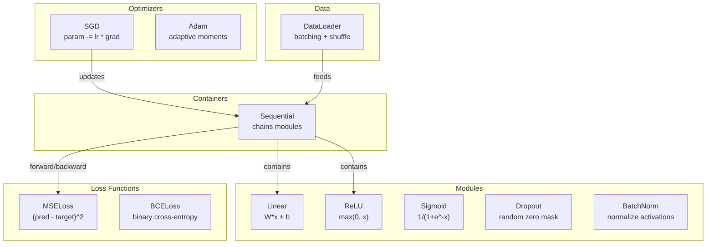
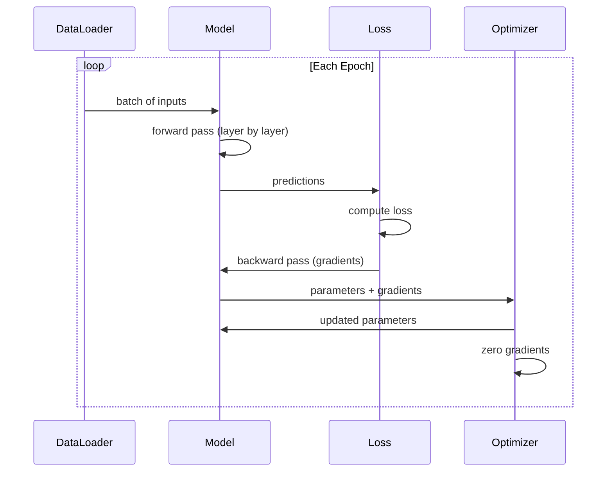
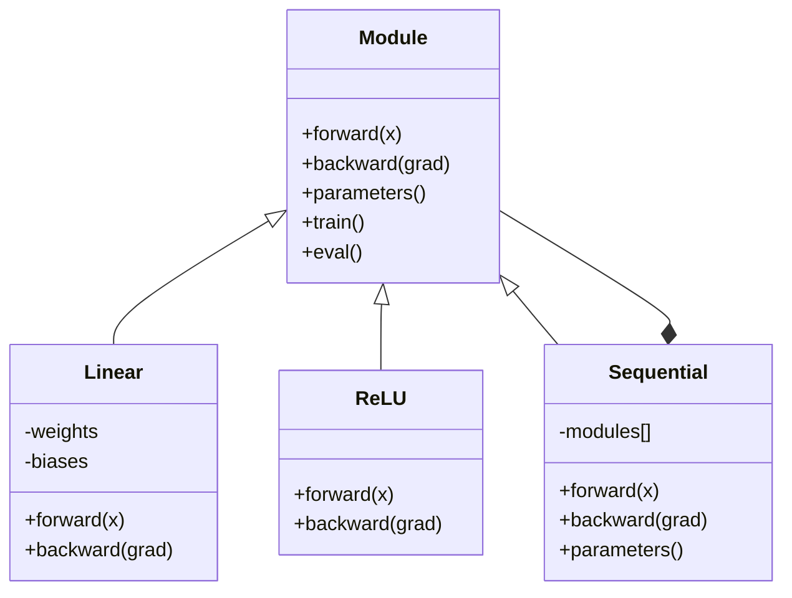

<!-- i18n:manual -->
# Соберите свой мини-фреймворк

> Вы построили нейроны, слои, сети, backprop, активации, функции потерь, оптимизаторы, регуляризацию, инициализацию и расписания learning rate. Всё по отдельности. Пора соединить это во фреймворк. Не PyTorch. Не TensorFlow. Ваш.

**Type:** Build
**Languages:** Python
**Prerequisites:** All of Phase 03 (Lessons 01-09)
**Time:** ~120 minutes

## Learning Objectives

- Построить полноценный фреймворк глубокого обучения (~500 строк) с Module, Linear, ReLU, Sigmoid, Dropout, BatchNorm, Sequential, функциями потерь, оптимизаторами и DataLoader
- Объяснить абстракцию Module (forward, backward, parameters) и зачем нужно переключение между режимами train и eval
- Собрать все компоненты в работающий цикл обучения, который учит четырёхслойную сеть классифицировать точки внутри круга
- Сопоставить каждый компонент своего фреймворка с эквивалентом в PyTorch (nn.Module, nn.Sequential, optim.Adam, DataLoader)

> 🎒 **На пальцах.** До сих пор у вас была коробка с деталями: тут нейрон, там backprop, где-то ещё оптимизатор. Сегодня вы собираете из них один механизм на ~500 строк. И когда в конце вы напишете `Sequential(Linear(2, 16), ReLU(), ...)`, это будет не заклинание из чужой библиотеки, а ваш собственный код.

## The Problem

У вас десять уроков строительных блоков, разбросанных по разным файлам. Класс `Value` здесь, цикл обучения там, инициализация весов в третьем файле, расписания learning rate в четвёртом. Чтобы обучить сеть, вы копируете куски из пяти уроков и сшиваете их руками.

Именно эту боль решают фреймворки. PyTorch даёт `nn.Module`, `nn.Sequential`, `optim.Adam`, `DataLoader` и общий шаблон цикла обучения, который всё это связывает. TensorFlow даёт `keras.Layer`, `keras.Sequential`, `keras.optimizers.Adam`. Никакой магии здесь нет. Это организационные шаблоны, которые позволяют определять, обучать и оценивать сети, не переизобретая обвязку каждый раз заново.

Вы соберёте то же самое примерно в 500 строках Python. Без numpy. Без внешних зависимостей. Фреймворк, который умеет описать любую полносвязную сеть, обучить её через SGD или Adam, разбить данные на батчи, применить dropout и batch normalization, использовать любую активацию и менять learning rate по расписанию.

Когда закончите, вы будете точно понимать, что происходит при `model = nn.Sequential(...)` в PyTorch. Вы поймёте, зачем существуют `model.train()` и `model.eval()`. Вы поймёте, почему `optimizer.zero_grad()` — отдельный вызов. Вы поймёте всё это, потому что построите всё это сами.

> 🎒 **На пальцах.** Разница между «уметь готовить одно блюдо» и «иметь кухню». Пока детали лежат по разным урокам, каждый новый эксперимент — это переписывание кода с нуля. Фреймворк — это кухня: продукты меняются, а плита, ножи и раковина стоят на своих местах.

## The Concept

### The Module Abstraction

Каждый слой в PyTorch наследуется от `nn.Module`. У Module три обязанности:

1. **forward()** -- посчитать выход по входу
2. **parameters()** -- вернуть все обучаемые веса
3. **backward()** -- посчитать градиенты (в PyTorch этим занимается autograd, у нас — явный код)

Linear-слой — это Module. Активация ReLU — Module. Dropout — Module. Batch normalization — Module. У всех один и тот же интерфейс.

> 🎒 **На пальцах.** Это как евророзетка. Утюг, лампа и ноутбук устроены совершенно по-разному, но вилка у всех одинаковая — поэтому их можно втыкать в любой удлинитель, не задумываясь. Три метода (forward, backward, parameters) — это и есть форма вилки.

### Sequential Container

`nn.Sequential` соединяет модули в цепочку. Forward: подать данные в модуль 1, затем в модуль 2, затем в модуль 3. Backward: пройти цепочку в обратном порядке. Сам контейнер тоже Module — у него есть forward(), parameters() и backward(). Это паттерн «компоновщик»: последовательность модулей сама является модулем.

> 🎒 **На пальцах.** Как поезд из вагонов: каждый вагон — модуль, а весь состав снаружи ведёт себя как один вагон. Поэтому Sequential можно положить внутрь другого Sequential, и ничего не сломается. Данные едут вперёд от локомотива, градиенты — назад от последнего вагона.

### Training vs Evaluation Mode

Dropout случайно обнуляет нейроны во время обучения, но пропускает всё насквозь во время оценки. Batch normalization при обучении использует статистику батча, а при оценке — бегущие средние. Методы `train()` и `eval()` переключают это поведение. У каждого Module есть флаг `training`.

> 🎒 **На пальцах.** Тренировка и экзамен. На тренировке футболисту привязывают утяжелители и убирают половину команды с поля — специально усложняют. На матч он выходит без утяжелителей и с полным составом. Забыли вызвать `model.eval()` — вышли на матч с гирями на ногах, и точность необъяснимо просядет.

### Optimizer

Оптимизатор обновляет параметры, используя их градиенты. SGD: `param -= lr * grad`. Adam: хранит оценки момента и дисперсии, а потом обновляет. Оптимизатор ничего не знает об архитектуре сети — он видит только плоский список параметров и их градиентов.

> 🎒 **На пальцах.** Оптимизатору всё равно, откуда взялись числа. Для сети из четырёх слоёв он видит просто список из 465 ручек и 465 подсказок «крутить туда-то». Поэтому один и тот же Adam работает и с крошечной сетью, и с трансформером на миллиард параметров — код внутри буквально не меняется.

### DataLoader

Батчи нужны по двум причинам. Во-первых, на больших задачах весь датасет просто не влезает в память. Во-вторых, мини-батчевый градиентный спуск даёт шум, который помогает выбираться из локальных минимумов. DataLoader режет данные на батчи и по желанию перемешивает их между эпохами.

> 🎒 **На пальцах.** 400 обучающих примеров при batch_size=16 — это 25 батчей за эпоху. Как проверять 400 тетрадей: не все сразу и не по одной, а пачками по 16. Перемешивание нужно, чтобы каждая эпоха шла в новом порядке, иначе сеть запомнит саму последовательность примеров.

### Framework Architecture



### Training Loop



### Module Hierarchy



```figure
gradient-clipping
```

## Build It

### Step 1: Module Base Class

Абстрактный интерфейс, который реализует каждый слой.

```python
class Module:
    def __init__(self):
        self.training = True

    def forward(self, x):
        raise NotImplementedError

    def backward(self, grad):
        raise NotImplementedError

    def parameters(self):
        return []

    def train(self):
        self.training = True

    def eval(self):
        self.training = False
```

### Step 2: Linear Layer

Основной строительный блок. Хранит веса и смещения, считает Wx + b на прямом проходе и градиенты по весам и по входу — на обратном.

```python
import math
import random


class Linear(Module):
    def __init__(self, fan_in, fan_out):
        super().__init__()
        std = math.sqrt(2.0 / fan_in)
        self.weights = [[random.gauss(0, std) for _ in range(fan_in)] for _ in range(fan_out)]
        self.biases = [0.0] * fan_out
        self.weight_grads = [[0.0] * fan_in for _ in range(fan_out)]
        self.bias_grads = [0.0] * fan_out
        self.fan_in = fan_in
        self.fan_out = fan_out
        self.input = None

    def forward(self, x):
        self.input = x
        output = []
        for i in range(self.fan_out):
            val = self.biases[i]
            for j in range(self.fan_in):
                val += self.weights[i][j] * x[j]
            output.append(val)
        return output

    def backward(self, grad):
        input_grad = [0.0] * self.fan_in
        for i in range(self.fan_out):
            self.bias_grads[i] += grad[i]
            for j in range(self.fan_in):
                self.weight_grads[i][j] += grad[i] * self.input[j]
                input_grad[j] += grad[i] * self.weights[i][j]
        return input_grad

    def parameters(self):
        params = []
        for i in range(self.fan_out):
            for j in range(self.fan_in):
                params.append((self.weights, i, j, self.weight_grads))
            params.append((self.biases, i, None, self.bias_grads))
        return params
```

> 🎒 **На пальцах.** Посчитайте `Linear(2, 16)`: весов 16 × 2 = 32 плюс 16 смещений — итого 48 чисел. Инициализация берёт std = sqrt(2 / fan_in) = sqrt(2/2) = 1.0, а для `Linear(16, 16)` уже sqrt(2/16) ≈ 0.354. Чем больше входов у нейрона, тем меньше стартовые веса — иначе сумма из 16 слагаемых окажется слишком большой.

### Step 3: Activation Modules

ReLU, Sigmoid и Tanh как модули. Каждый кэширует то, что понадобится ему на обратном проходе.

```python
class ReLU(Module):
    def __init__(self):
        super().__init__()
        self.mask = None

    def forward(self, x):
        self.mask = [1.0 if v > 0 else 0.0 for v in x]
        return [max(0.0, v) for v in x]

    def backward(self, grad):
        return [g * m for g, m in zip(grad, self.mask)]


class Sigmoid(Module):
    def __init__(self):
        super().__init__()
        self.output = None

    def forward(self, x):
        self.output = []
        for v in x:
            v = max(-500, min(500, v))
            self.output.append(1.0 / (1.0 + math.exp(-v)))
        return self.output

    def backward(self, grad):
        return [g * o * (1 - o) for g, o in zip(grad, self.output)]


class Tanh(Module):
    def __init__(self):
        super().__init__()
        self.output = None

    def forward(self, x):
        self.output = [math.tanh(v) for v in x]
        return self.output

    def backward(self, grad):
        return [g * (1 - o * o) for g, o in zip(grad, self.output)]
```

> 🎒 **На пальцах.** ReLU запоминает не сами числа, а маску из нулей и единиц: было положительное — 1, было отрицательное — 0. На обратном проходе он просто умножает градиент на эту маску, то есть закрытым нейронам не достаётся ничего. Для входа [-2, 0.5, 3] маска будет [0, 1, 1], и градиент первого нейрона обнулится.

### Step 4: Dropout Module

Случайно обнуляет элементы во время обучения. Оставшиеся домножает на 1/(1-p), чтобы среднее значение не менялось. Во время eval не делает ничего.

```python
class Dropout(Module):
    def __init__(self, p=0.5):
        super().__init__()
        self.p = p
        self.mask = None

    def forward(self, x):
        if not self.training:
            return x
        self.mask = [0.0 if random.random() < self.p else 1.0 / (1 - self.p) for _ in x]
        return [v * m for v, m in zip(x, self.mask)]

    def backward(self, grad):
        if self.mask is None:
            return grad
        return [g * m for g, m in zip(grad, self.mask)]
```

> 🎒 **На пальцах.** При p=0.5 половина нейронов зануляется, а выжившие умножаются на 1/(1−0.5) = 2. Возьмите 10 нейронов со значением 1: сумма была 10, после dropout примерно 5 нулей и 5 двоек — снова 10. Как проектная группа, где половина заболела: оставшимся приходится работать за двоих, зато сдают тот же объём.

### Step 5: BatchNorm Module

Нормализует активации к нулевому среднему и единичной дисперсии по каждому признаку внутри батча. Для режима eval хранит бегущие статистики.

```python
class BatchNorm(Module):
    def __init__(self, size, momentum=0.1, eps=1e-5):
        super().__init__()
        self.size = size
        self.gamma = [1.0] * size
        self.beta = [0.0] * size
        self.gamma_grads = [0.0] * size
        self.beta_grads = [0.0] * size
        self.running_mean = [0.0] * size
        self.running_var = [1.0] * size
        self.momentum = momentum
        self.eps = eps
        self.x_norm = None
        self.std_inv = None
        self.batch_input = None

    def forward_batch(self, batch):
        batch_size = len(batch)
        output_batch = []

        if self.training:
            mean = [0.0] * self.size
            for sample in batch:
                for j in range(self.size):
                    mean[j] += sample[j]
            mean = [m / batch_size for m in mean]

            var = [0.0] * self.size
            for sample in batch:
                for j in range(self.size):
                    var[j] += (sample[j] - mean[j]) ** 2
            var = [v / batch_size for v in var]

            self.std_inv = [1.0 / math.sqrt(v + self.eps) for v in var]

            self.x_norm = []
            self.batch_input = batch
            for sample in batch:
                normed = [(sample[j] - mean[j]) * self.std_inv[j] for j in range(self.size)]
                self.x_norm.append(normed)
                output = [self.gamma[j] * normed[j] + self.beta[j] for j in range(self.size)]
                output_batch.append(output)

            for j in range(self.size):
                self.running_mean[j] = (1 - self.momentum) * self.running_mean[j] + self.momentum * mean[j]
                self.running_var[j] = (1 - self.momentum) * self.running_var[j] + self.momentum * var[j]
        else:
            std_inv = [1.0 / math.sqrt(v + self.eps) for v in self.running_var]
            for sample in batch:
                normed = [(sample[j] - self.running_mean[j]) * std_inv[j] for j in range(self.size)]
                output = [self.gamma[j] * normed[j] + self.beta[j] for j in range(self.size)]
                output_batch.append(output)

        return output_batch

    def forward(self, x):
        result = self.forward_batch([x])
        return result[0]

    def backward(self, grad):
        if self.x_norm is None:
            return grad
        for j in range(self.size):
            self.gamma_grads[j] += self.x_norm[0][j] * grad[j]
            self.beta_grads[j] += grad[j]
        return [grad[j] * self.gamma[j] * self.std_inv[j] for j in range(self.size)]

    def parameters(self):
        params = []
        for j in range(self.size):
            params.append((self.gamma, j, None, self.gamma_grads))
            params.append((self.beta, j, None, self.beta_grads))
        return params
```

> 🎒 **На пальцах.** Возьмите батч из четырёх значений одного признака: 1, 2, 3, 4. Среднее 2.5, дисперсия 1.25, корень ≈ 1.118. Значение 4 превращается в (4 − 2.5) / 1.118 ≈ 1.34. Это перевод оценок в «отклонение от среднего по классу»: неважно, лёгкой была контрольная или сложной, важно, насколько вы выше или ниже среднего. А `momentum=0.1` означает, что бегущее среднее после первого батча станет 0.9 × 0 + 0.1 × 2.5 = 0.25 — оно подтягивается к правде медленно.

### Step 6: Sequential Container

Соединяет модули в цепочку. Forward идёт слева направо, backward — справа налево.

```python
class Sequential(Module):
    def __init__(self, *modules):
        super().__init__()
        self.modules = list(modules)

    def forward(self, x):
        for module in self.modules:
            x = module.forward(x)
        return x

    def backward(self, grad):
        for module in reversed(self.modules):
            grad = module.backward(grad)
        return grad

    def parameters(self):
        params = []
        for module in self.modules:
            params.extend(module.parameters())
        return params

    def train(self):
        self.training = True
        for module in self.modules:
            module.train()

    def eval(self):
        self.training = False
        for module in self.modules:
            module.eval()
```

### Step 7: Loss Functions

MSE и бинарная кросс-энтропия. Каждая возвращает значение потерь и умеет через backward() отдать градиент.

```python
class MSELoss:
    def __call__(self, predicted, target):
        self.predicted = predicted
        self.target = target
        n = len(predicted)
        self.loss = sum((p - t) ** 2 for p, t in zip(predicted, target)) / n
        return self.loss

    def backward(self):
        n = len(self.predicted)
        return [2 * (p - t) / n for p, t in zip(self.predicted, self.target)]


class BCELoss:
    def __call__(self, predicted, target):
        self.predicted = predicted
        self.target = target
        eps = 1e-7
        n = len(predicted)
        self.loss = 0
        for p, t in zip(predicted, target):
            p = max(eps, min(1 - eps, p))
            self.loss += -(t * math.log(p) + (1 - t) * math.log(1 - p))
        self.loss /= n
        return self.loss

    def backward(self):
        eps = 1e-7
        n = len(self.predicted)
        grads = []
        for p, t in zip(self.predicted, self.target):
            p = max(eps, min(1 - eps, p))
            grads.append((-t / p + (1 - t) / (1 - p)) / n)
        return grads
```

> 🎒 **На пальцах.** Проверьте MSE на одном числе: предсказали 0.9, целились в 1.0. Loss = (0.9 − 1.0)² = 0.01, а градиент = 2 × (0.9 − 1.0) / 1 = −0.2. Знак минус говорит «предсказание надо поднять». У BCE в той же ситуации loss = −log(0.9) ≈ 0.105 — она наказывает за неуверенность сильнее, а за уверенную ошибку (p=0.001 при t=1) штраф вырастает до ≈ 6.9.

### Step 8: SGD and Adam Optimizers

Оба принимают список параметров и обновляют веса по градиентам.

```python
class SGD:
    def __init__(self, parameters, lr=0.01):
        self.params = parameters
        self.lr = lr

    def step(self):
        for container, i, j, grad_container in self.params:
            if j is not None:
                container[i][j] -= self.lr * grad_container[i][j]
            else:
                container[i] -= self.lr * grad_container[i]

    def zero_grad(self):
        for container, i, j, grad_container in self.params:
            if j is not None:
                grad_container[i][j] = 0.0
            else:
                grad_container[i] = 0.0


class Adam:
    def __init__(self, parameters, lr=0.001, beta1=0.9, beta2=0.999, eps=1e-8):
        self.params = parameters
        self.lr = lr
        self.beta1 = beta1
        self.beta2 = beta2
        self.eps = eps
        self.t = 0
        self.m = [0.0] * len(parameters)
        self.v = [0.0] * len(parameters)

    def step(self):
        self.t += 1
        for idx, (container, i, j, grad_container) in enumerate(self.params):
            if j is not None:
                g = grad_container[i][j]
            else:
                g = grad_container[i]

            self.m[idx] = self.beta1 * self.m[idx] + (1 - self.beta1) * g
            self.v[idx] = self.beta2 * self.v[idx] + (1 - self.beta2) * g * g

            m_hat = self.m[idx] / (1 - self.beta1 ** self.t)
            v_hat = self.v[idx] / (1 - self.beta2 ** self.t)

            update = self.lr * m_hat / (math.sqrt(v_hat) + self.eps)

            if j is not None:
                container[i][j] -= update
            else:
                container[i] -= update

    def zero_grad(self):
        for container, i, j, grad_container in self.params:
            if j is not None:
                grad_container[i][j] = 0.0
            else:
                grad_container[i] = 0.0
```

> 🎒 **На пальцах.** Хитрость Adam видна на первом шаге: m_hat = g, v_hat = g², значит update = lr × g / (|g| + eps) ≈ lr. При lr=0.01 первый шаг равен примерно 0.01 независимо от того, был градиент 1000 или 0.001. Adam смотрит не на величину градиента, а только на его направление — как навигатор, который говорит «поверни направо», а не «поверни направо на 37 метров».

### Step 9: DataLoader

Режет данные на батчи, по желанию перемешивая их каждую эпоху.

```python
class DataLoader:
    def __init__(self, data, batch_size=32, shuffle=True):
        self.data = data
        self.batch_size = batch_size
        self.shuffle = shuffle

    def __iter__(self):
        indices = list(range(len(self.data)))
        if self.shuffle:
            random.shuffle(indices)
        for start in range(0, len(indices), self.batch_size):
            batch_indices = indices[start:start + self.batch_size]
            batch = [self.data[i] for i in batch_indices]
            inputs = [item[0] for item in batch]
            targets = [item[1] for item in batch]
            yield inputs, targets

    def __len__(self):
        return (len(self.data) + self.batch_size - 1) // self.batch_size
```

### Step 10: Train a 4-Layer Network on Circle Classification

Соединяем всё вместе. Описываем модель, выбираем функцию потерь, выбираем оптимизатор, запускаем цикл обучения.

```python
def make_circle_data(n=500, seed=42):
    random.seed(seed)
    data = []
    for _ in range(n):
        x = random.uniform(-2, 2)
        y = random.uniform(-2, 2)
        label = 1.0 if x * x + y * y < 1.5 else 0.0
        data.append(([x, y], [label]))
    return data


def train():
    random.seed(42)

    model = Sequential(
        Linear(2, 16),
        ReLU(),
        Linear(16, 16),
        ReLU(),
        Linear(16, 8),
        ReLU(),
        Linear(8, 1),
        Sigmoid(),
    )

    criterion = BCELoss()
    optimizer = Adam(model.parameters(), lr=0.01)

    data = make_circle_data(500)
    split = int(len(data) * 0.8)
    train_data = data[:split]
    test_data = data[split:]

    loader = DataLoader(train_data, batch_size=16, shuffle=True)

    model.train()

    for epoch in range(100):
        total_loss = 0
        total_correct = 0
        total_samples = 0

        for batch_inputs, batch_targets in loader:
            batch_loss = 0
            for x, t in zip(batch_inputs, batch_targets):
                pred = model.forward(x)
                loss = criterion(pred, t)
                batch_loss += loss

                optimizer.zero_grad()
                grad = criterion.backward()
                model.backward(grad)
                optimizer.step()

                predicted_class = 1.0 if pred[0] >= 0.5 else 0.0
                if predicted_class == t[0]:
                    total_correct += 1
                total_samples += 1

            total_loss += batch_loss

        avg_loss = total_loss / total_samples
        accuracy = total_correct / total_samples * 100

        if epoch % 10 == 0 or epoch == 99:
            print(f"Epoch {epoch:3d} | Loss: {avg_loss:.6f} | Train Accuracy: {accuracy:.1f}%")

    model.eval()
    correct = 0
    for x, t in test_data:
        pred = model.forward(x)
        predicted_class = 1.0 if pred[0] >= 0.5 else 0.0
        if predicted_class == t[0]:
            correct += 1
    test_accuracy = correct / len(test_data) * 100
    print(f"\nTest Accuracy: {test_accuracy:.1f}% ({correct}/{len(test_data)})")

    return model, test_accuracy
```

> 🎒 **На пальцах.** Посчитаем сеть целиком: Linear(2,16) — 48 параметров, Linear(16,16) — 272, Linear(16,8) — 136, Linear(8,1) — 9. Всего 465 обучаемых чисел. Данные: 500 точек, 400 в train и 100 в test, батчи по 16 — это 25 батчей за эпоху и 40 000 обновлений за 100 эпох. Задача при этом простая до смешного: «попадает ли точка внутрь круга радиуса ≈1.22». Сеть учит это правило, ни разу его не увидев.

## Use It

Вот эквивалент того, что вы только что построили, на PyTorch:

```python
import torch
import torch.nn as nn
from torch.utils.data import DataLoader, TensorDataset

model = nn.Sequential(
    nn.Linear(2, 16),
    nn.ReLU(),
    nn.Linear(16, 16),
    nn.ReLU(),
    nn.Linear(16, 8),
    nn.ReLU(),
    nn.Linear(8, 1),
    nn.Sigmoid(),
)

criterion = nn.BCELoss()
optimizer = torch.optim.Adam(model.parameters(), lr=0.01)

for epoch in range(100):
    model.train()
    for inputs, targets in dataloader:
        optimizer.zero_grad()
        predictions = model(inputs)
        loss = criterion(predictions, targets)
        loss.backward()
        optimizer.step()

    model.eval()
    with torch.no_grad():
        test_predictions = model(test_inputs)
```

Структура один в один. `Sequential`, `Linear`, `ReLU`, `Sigmoid`, `BCELoss`, `Adam`, `zero_grad`, `backward`, `step`, `train`, `eval`. Каждое понятие отображается один к одному. Разница в том, что PyTorch делает autograd автоматически (не нужно писать backward() в каждом модуле), работает на GPU и оптимизировался годами. Но скелет тот же самый.

Теперь, глядя на код PyTorch, вы точно знаете, что происходит в каждой строке. Ради этого понимания всё и затевалось.

> 🎒 **На пальцах.** Сравните построчно: у вас `model.forward(x)` — у них `model(inputs)`; у вас `criterion.backward()` и `model.backward(grad)` — у них одно `loss.backward()`. Экономия ровно в одну строку, и эта строка называется autograd. Всё остальное вы уже написали своими руками.

## Ship It

Этот урок производит:
- `outputs/prompt-framework-architect.md` -- промпт для проектирования архитектур нейросетей в терминах абстракций фреймворка

## Exercises

1. Добавьте класс `SoftmaxCrossEntropyLoss` для многоклассовой классификации. Примените softmax к предсказаниям, посчитайте кросс-энтропию и обработайте объединённый обратный проход. Проверьте на трёхклассовом датасете «спираль».

2. Реализуйте расписание learning rate внутри оптимизатора: добавьте метод `set_lr()` и подключите cosine-расписание из урока 09. Обучите классификатор круга с warmup + cosine и сравните с постоянным LR.

3. Добавьте в Sequential методы `save()` и `load()`, которые сохраняют все веса в JSON-файл и загружают их обратно. Убедитесь, что загруженная модель даёт те же предсказания, что и исходная.

4. Реализуйте weight decay (L2-регуляризацию) в оптимизаторе Adam. Добавьте параметр `weight_decay`, который на каждом шаге стягивает веса к нулю. Сравните обучение при decay=0 и decay=0.01.

5. Замените обучение по одному примеру на честное накопление градиентов по мини-батчу: накопите градиенты по всем примерам батча, поделите на размер батча и сделайте один шаг оптимизатора. Померьте, изменилась ли скорость сходимости.

> 🎒 **На пальцах.** Подсказка к пятому заданию: сейчас на каждый пример приходится один вызов `optimizer.step()`, то есть 400 обновлений за эпоху. После переделки их станет 25 — по одному на батч. Шагов в 16 раз меньше, но каждый спокойнее, потому что усреднён по 16 примерам. Ожидайте, что учиться придётся больше эпох, зато loss будет прыгать заметно меньше.

## Key Terms

| Term | What people say | What it actually means |
|------|----------------|----------------------|
| Module | «Слой» | Базовая абстракция фреймворка — всё, у чего есть forward(), backward() и parameters() |
| Sequential | «Сложить слои по порядку» | Контейнер, соединяющий модули в цепочку: вперёд по порядку, назад в обратном порядке |
| Forward pass | «Прогнать сеть» | Вычисление выхода: вход проходит через каждый модуль по очереди |
| Backward pass | «Посчитать градиенты» | Протаскивание градиента функции потерь через каждый модуль в обратном порядке, чтобы получить градиенты параметров |
| Parameters | «Обучаемые веса» | Все значения сети, которые может обновлять optimizer, — веса и смещения |
| Optimizer | «То, что обновляет веса» | Алгоритм, который по градиентам обновляет параметры: SGD, Adam или другое правило |
| DataLoader | «То, что подаёт данные» | Итератор, который режет датасет на батчи и по желанию перемешивает их между эпохами |
| Training mode | «model.train()» | Флаг, включающий случайное поведение: dropout и batch normalization по статистике батча |
| Evaluation mode | «model.eval()» | Флаг, выключающий dropout и переводящий batch normalization на бегущие статистики |
| Zero grad | «Очистить градиенты» | Обнуление градиентов всех параметров перед вычислением градиентов следующего батча |

## Further Reading

- Paszke et al., "PyTorch: An Imperative Style, High-Performance Deep Learning Library" (2019) -- статья, описывающая проектные решения PyTorch
- Chollet, "Deep Learning with Python, Second Edition" (2021) -- глава 3 разбирает внутреннее устройство Keras с той же абстракцией module/layer
- Johnson, "Tiny-DNN" (https://github.com/tiny-dnn/tiny-dnn) -- header-only фреймворк глубокого обучения на C++ для изучения внутренностей фреймворков
