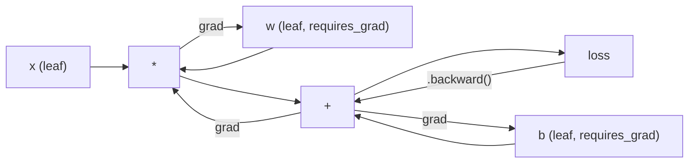
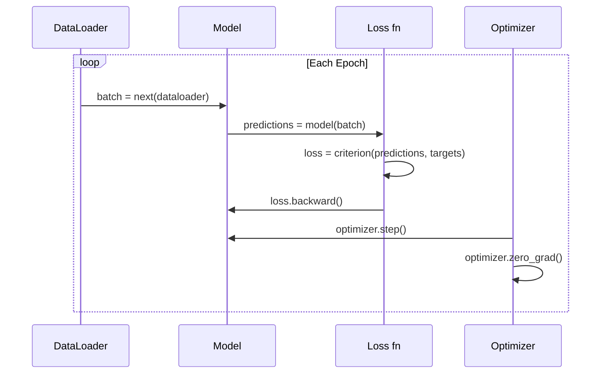

<!-- i18n:manual -->
# Введение в PyTorch

> Вы собрали двигатель из поршней и коленвала. Теперь освойте тот, на котором ездят все остальные.

**Type:** Build
**Languages:** Python
**Prerequisites:** Lesson 03.10 (Build Your Own Mini Framework)
**Time:** ~75 minutes

## Learning Objectives

- Строить и обучать нейросети с помощью nn.Module, nn.Sequential и autograd из PyTorch
- Использовать тензоры PyTorch, ускорение на GPU и стандартный цикл обучения (zero_grad, forward, loss, backward, step)
- Переписать компоненты своего мини-фреймворка на их эквиваленты из PyTorch
- Замерить и сравнить скорость обучения чистого Python-фреймворка и PyTorch на одной и той же задаче

> 🎒 **На пальцах.** В прошлом уроке вы построили фреймворк сами — руками написали Module, forward и backward. Теперь берём готовый, где всё это уже есть. Названия почти не изменятся: были `Linear`, `ReLU`, `step()` — станут `nn.Linear`, `nn.ReLU`, `optimizer.step()`. Меняется не мышление, а скорость: те же задачи считаются в сотни раз быстрее.

## The Problem

У вас есть работающий мини-фреймворк. Linear-слои, ReLU, dropout, batch norm, Adam, DataLoader, цикл обучения. Он обучает четырёхслойную сеть на задаче классификации кругов — на чистом Python.

И он же в 500 раз медленнее PyTorch на той же задаче.

Ваш мини-фреймворк обрабатывает по одному примеру за раз вложенными циклами Python. PyTorch отправляет те же операции в оптимизированные ядра на C++/CUDA, которые считаются на GPU. На одной NVIDIA A100 PyTorch обучает ResNet-50 (25,6 млн параметров) на ImageNet (1,28 млн изображений) примерно за 6 часов. Ваш фреймворк на той же задаче потратил бы около 3000 часов — если бы раньше не кончилась память.

Скорость — не единственный разрыв. У вашего фреймворка нет поддержки GPU. Нет автоматического дифференцирования — backward() вы писали руками для каждого модуля. Нет сериализации. Нет распределённого обучения. Нет mixed precision. Нет способа отладить поток градиентов иначе, чем через print.

PyTorch закрывает каждый из этих пробелов. И делает это, сохраняя ровно ту же ментальную модель, которую вы уже построили: Module, forward(), parameters(), backward(), optimizer.step(). Понятия переносятся один в один. Синтаксис почти совпадает. Разница в том, что за тем же интерфейсом, который вы придумали с нуля, у PyTorch стоит десятилетие системной инженерии.

> 🎒 **На пальцах.** 6 часов против 3000 часов — это как доехать до соседнего города на поезде за вечер или идти туда пешком четыре месяца. Дорога та же, математика та же. Разница в том, что PyTorch отдаёт вычисления видеокарте, которая перемножает тысячи чисел одновременно, а Python перебирает их по одному.

## The Concept

### Why PyTorch Won

В 2015 году TensorFlow требовал сначала описать статический граф вычислений, и только потом что-то запускать. Вы строили граф, компилировали его, потом пропускали через него данные. Отладка означала разглядывание картинок с графом. Смена архитектуры означала перестройку графа с нуля.

PyTorch появился в 2017 году с другой философией: eager execution. Вы пишете Python. Он выполняется сразу. `y = model(x)` действительно считает y прямо сейчас, а не «добавляет в граф узел, который посчитает y когда-нибудь потом». Это значило, что заработали обычные инструменты отладки Python. Заработал print(). Заработал pdb. Заработал if/else внутри прямого прохода.

К 2020 году рынок высказался. Доля PyTorch в исследовательских статьях по ML выросла с 7% (2017) до более чем 75% (2022). Meta, Google DeepMind, OpenAI, Anthropic и Hugging Face используют PyTorch как основной фреймворк. TensorFlow 2.x в ответ перешёл на eager execution — молчаливое признание, что дизайн PyTorch был правильным.

Вывод: удобство разработчика накапливается. Фреймворк, который на 10% медленнее, но на 50% быстрее отлаживается, выигрывает всегда.

> 🎒 **На пальцах.** Старый подход — как составить весь маршрут прогулки на бумаге, отдать его роботу и уйти. Новый — просто идти и смотреть по сторонам. Когда робот споткнётся, вы увидите это на нужном шаге, а не в схеме из ста стрелочек. Именно поэтому за пять лет доля PyTorch в статьях выросла с 7% до 75%.

### Tensors

Тензор — это многомерный массив с тремя ключевыми свойствами: shape, dtype и device.

```python
import torch

x = torch.zeros(3, 4)           # shape: (3, 4), dtype: float32, device: cpu
x = torch.randn(2, 3, 224, 224) # batch of 2 RGB images, 224x224
x = torch.tensor([1, 2, 3])     # from a Python list
```

**Shape** — это размерность. У скаляра форма (), у вектора (n,), у матрицы (m, n), у пачки изображений (batch, channels, height, width).

**Dtype** управляет точностью и памятью.

| dtype | Bits | Range | Use case |
|-------|------|-------|----------|
| float32 | 32 | ~7 десятичных знаков | Обучение по умолчанию |
| float16 | 16 | ~3,3 десятичных знака | Mixed precision |
| bfloat16 | 16 | Тот же диапазон, что у float32, но меньше точность | Обучение LLM |
| int8 | 8 | от -128 до 127 | Квантованный инференс |

**Device** определяет, где происходят вычисления.

```python
device = torch.device("cuda" if torch.cuda.is_available() else "cpu")
x = torch.randn(3, 4, device=device)
x = x.to("cuda")
x = x.cpu()
```

Любая операция требует, чтобы все тензоры лежали на одном устройстве. Это ошибка №1, на которую натыкаются новички: `RuntimeError: Expected all tensors to be on the same device`. Лечится переносом всего на одно устройство до вычислений.

> 🎒 **На пальцах.** Посчитаем память. Тензор `torch.randn(2, 3, 224, 224)` — это 2 × 3 × 224 × 224 = 301 056 чисел. Каждое float32 занимает 4 байта, итого около 1,2 МБ на две картинки. Переключите dtype на float16 — станет 0,6 МБ. Именно за счёт этого в GPU влезает пачка не из 32, а из 64 картинок. А `device` — это как файл на флешке и файл на ноутбуке: складывать их между собой нельзя, пока не перенесёте в одно место.

**Reshaping** работает за константное время — меняются метаданные, а не сами данные.

```python
x = torch.randn(2, 3, 4)
x.view(2, 12)      # reshape to (2, 12) -- must be contiguous
x.reshape(6, 4)    # reshape to (6, 4) -- works always
x.permute(2, 0, 1) # reorder dimensions
x.unsqueeze(0)     # add dimension: (1, 2, 3, 4)
x.squeeze()        # remove size-1 dimensions
```

> 🎒 **На пальцах.** В `torch.randn(2, 3, 4)` лежит 2 × 3 × 4 = 24 числа. После `view(2, 12)` их по-прежнему 24 — просто теперь они разложены по 12 в две строки. Это как переставить те же книги с трёх полок на две: книг не стало больше или меньше, изменилась только раскладка. Поэтому reshape мгновенный, а `unsqueeze(0)` превращает (2, 3, 4) в (1, 2, 3, 4), не тронув ни одного числа.

### Autograd

Ваш мини-фреймворк требовал реализовать backward() для каждого модуля. PyTorch — нет. Он записывает каждую операцию над тензорами в направленный ациклический граф (граф вычислений), а затем обходит этот граф в обратную сторону и считает градиенты автоматически.



Ключевое отличие от вашего фреймворка: PyTorch использует ленточное (tape-based) автодифференцирование. Каждая операция на прямом проходе дописывается в «ленту». Вызов `.backward()` проигрывает ленту в обратную сторону.

```python
x = torch.randn(3, requires_grad=True)
y = x ** 2 + 3 * x
z = y.sum()
z.backward()
print(x.grad)  # dz/dx = 2x + 3
```

Три правила autograd:

1. Градиенты накапливают только листовые тензоры с `requires_grad=True`
2. Градиенты по умолчанию накапливаются — вызывайте `optimizer.zero_grad()` перед каждым обратным проходом
3. `torch.no_grad()` отключает отслеживание градиентов (используйте при оценке модели)

> 🎒 **На пальцах.** Проверьте формулу в уме. Для `y = x ** 2 + 3 * x` производная равна 2x + 3. Если бы в x лежало число 2, то после `z.backward()` в `x.grad` оказалось бы 2 × 2 + 3 = 7. PyTorch не «угадал» ответ — он просто запомнил, что вы возводили в квадрат и умножали на 3, и прошёл по этому списку задом наперёд. Правило 2 объясняет, зачем нужен `zero_grad()`: без него градиенты складываются, как если бы вы не стирали доску между задачами.

### nn.Module

`nn.Module` — базовый класс для любого компонента нейросети в PyTorch. Эту абстракцию вы уже построили в уроке 10. Версия PyTorch добавляет автоматическую регистрацию параметров, рекурсивный обход вложенных модулей, управление устройствами и сериализацию через state dict.

```python
import torch.nn as nn

class MLP(nn.Module):
    def __init__(self, input_dim, hidden_dim, output_dim):
        super().__init__()
        self.layer1 = nn.Linear(input_dim, hidden_dim)
        self.relu = nn.ReLU()
        self.layer2 = nn.Linear(hidden_dim, output_dim)

    def forward(self, x):
        x = self.layer1(x)
        x = self.relu(x)
        x = self.layer2(x)
        return x
```

Когда вы присваиваете `nn.Module` или `nn.Parameter` в атрибут внутри `__init__`, PyTorch регистрирует его автоматически. `model.parameters()` рекурсивно собирает каждый зарегистрированный параметр. Именно поэтому вам никогда не приходится вручную собирать веса, как это было в мини-фреймворке.

Ключевые строительные блоки:

| Module | What it does | Parameters |
|--------|-------------|------------|
| nn.Linear(in, out) | Wx + b | in*out + out |
| nn.Conv2d(in_ch, out_ch, k) | Двумерная свёртка | in_ch*out_ch*k*k + out_ch |
| nn.BatchNorm1d(features) | Нормализует активации | 2 * features |
| nn.Dropout(p) | Случайно обнуляет | 0 |
| nn.ReLU() | max(0, x) | 0 |
| nn.GELU() | Гауссова линейная функция ошибки | 0 |
| nn.Embedding(vocab, dim) | Таблица поиска | vocab * dim |
| nn.LayerNorm(dim) | Нормализация внутри примера | 2 * dim |

> 🎒 **На пальцах.** Посчитайте параметры первого слоя из таблицы: `nn.Linear(784, 256)` — это 784 × 256 = 200 704 веса плюс 256 смещений, итого 200 960 чисел. Вы не написали ни строчки, чтобы их создать и собрать: достаточно было присвоить слой в `self.layer1`. PyTorch работает как записная книжка, которая сама заносит в список всё, что вы в неё положили.

### Loss Functions and Optimizers

PyTorch поставляется с готовыми к продакшену версиями всего, что вы строили сами.

**Loss functions** (из `torch.nn`):

| Loss | Task | Input |
|------|------|-------|
| nn.MSELoss() | Регрессия | Любая форма |
| nn.CrossEntropyLoss() | Многоклассовая классификация | Логиты (не softmax) |
| nn.BCEWithLogitsLoss() | Бинарная классификация | Логиты (не sigmoid) |
| nn.L1Loss() | Регрессия (устойчивая) | Любая форма |
| nn.CTCLoss() | Выравнивание последовательностей | Логарифмы вероятностей |

Важно: `CrossEntropyLoss` внутри себя объединяет `LogSoftmax` и `NLLLoss`. Передавайте сырые логиты, а не выходы softmax. Это частая ошибка, которая молча портит градиенты.

**Optimizers** (из `torch.optim`):

| Optimizer | When to use | Typical LR |
|-----------|-------------|-----------|
| SGD(params, lr, momentum) | Свёрточные сети, отлаженные пайплайны | 0.01--0.1 |
| Adam(params, lr) | Точка старта по умолчанию | 1e-3 |
| AdamW(params, lr, weight_decay) | Трансформеры, дообучение | 1e-4--1e-3 |
| LBFGS(params) | Малый масштаб, методы второго порядка | 1.0 |

> 🎒 **На пальцах.** Ошибка с softmax — как посолить суп дважды: повар посолил на кухне, официант посолил на столе. Суп внешне тот же, но есть нельзя. `CrossEntropyLoss` уже применяет softmax внутри, поэтому подавайте ей сырые числа со слоя. Программа не упадёт, просто модель будет учиться заметно хуже, и вы полдня будете искать причину.

### The Training Loop

Каждый цикл обучения в PyTorch следует одному и тому же паттерну из 5 шагов. Вы уже знаете его по уроку 10.



Канонический вид:

```python
for epoch in range(num_epochs):
    model.train()
    for inputs, targets in train_loader:
        inputs, targets = inputs.to(device), targets.to(device)
        optimizer.zero_grad()
        outputs = model(inputs)
        loss = criterion(outputs, targets)
        loss.backward()
        optimizer.step()
```

Пять строк внутри цикла по батчам. Пять строк, которыми обучали GPT-4, Stable Diffusion и LLaMA. Архитектура меняется. Данные меняются. Эти пять строк — нет.

> 🎒 **На пальцах.** Читайте пять строк как утреннюю рутину: `zero_grad()` — стереть доску; `model(inputs)` — решить задачу; `criterion(...)` — сравнить с ответом в конце учебника; `loss.backward()` — понять, где именно ошиблись; `optimizer.step()` — исправиться. Порядок нарушать нельзя, иначе вы исправляетесь по вчерашним ошибкам.

### Dataset and DataLoader

`Dataset` в PyTorch — абстрактный класс с двумя методами: `__len__` и `__getitem__`. `DataLoader` оборачивает его батчингом, перемешиванием и многопроцессной загрузкой данных.

```python
from torch.utils.data import Dataset, DataLoader

class MNISTDataset(Dataset):
    def __init__(self, images, labels):
        self.images = images
        self.labels = labels

    def __len__(self):
        return len(self.labels)

    def __getitem__(self, idx):
        return self.images[idx], self.labels[idx]

loader = DataLoader(dataset, batch_size=64, shuffle=True, num_workers=4)
```

`num_workers=4` запускает 4 процесса, которые готовят данные параллельно, пока GPU считает текущий батч. На задачах, упирающихся в диск (большие изображения, аудио), одно это может удвоить скорость обучения.

> 🎒 **На пальцах.** При `batch_size=64` и 60 000 картинок в MNIST получается 937 полных пачек и один хвостик из 32 картинок: 937 × 64 = 59 968, остаётся 32. Значит, за одну эпоху пять строк цикла обучения выполнятся 938 раз. А `num_workers=4` — это как четыре человека, которые режут овощи, пока повар жарит: плита не простаивает.

### GPU Training

Перенос модели на GPU:

```python
device = torch.device("cuda" if torch.cuda.is_available() else "cpu")
model = model.to(device)
```

Это рекурсивно переносит на GPU каждый параметр и каждый буфер. Дальше во время обучения нужно переносить каждый батч:

```python
inputs, targets = inputs.to(device), targets.to(device)
```

**Mixed precision** вдвое сокращает потребление памяти и удваивает пропускную способность на современных GPU (A100, H100, RTX 4090): прямой и обратный проход считаются в float16, а мастер-веса хранятся в float32:

```python
from torch.amp import autocast, GradScaler

scaler = GradScaler()
for inputs, targets in loader:
    with autocast(device_type="cuda"):
        outputs = model(inputs)
        loss = criterion(outputs, targets)
    scaler.scale(loss).backward()
    scaler.step(optimizer)
    scaler.update()
    optimizer.zero_grad()
```

### Comparison: Mini Framework vs PyTorch vs JAX

| Feature | Mini Framework (L10) | PyTorch | JAX |
|---------|---------------------|---------|-----|
| Autodiff | backward() вручную | Ленточный autograd | Функциональные преобразования |
| Execution | Eager (циклы Python) | Eager (ядра на C++) | Трассировка + JIT-компиляция |
| GPU support | Нет | Да (CUDA, ROCm, MPS) | Да (CUDA, TPU) |
| Speed (MNIST MLP) | ~300 с/эпоху | ~0,5 с/эпоху | ~0,3 с/эпоху |
| Module system | Свой класс Module | nn.Module | Функции без состояния (Flax/Equinox) |
| Debugging | print() | print(), pdb, breakpoint() | Сложнее (JIT-трассировка ломает print) |
| Ecosystem | Нет | Hugging Face, Lightning, timm | Flax, Optax, Orbax |
| Learning curve | Вы его написали сами | Средняя | Крутая (функциональная парадигма) |
| Production use | Игрушечные задачи | Meta, OpenAI, Anthropic, HF | Google DeepMind, Midjourney |

> 🎒 **На пальцах.** Сравните две цифры в строке Speed: 300 секунд против 0,5 секунды — это в 600 раз. Одна эпоха у вашего фреймворка занимает пять минут, у PyTorch — полсекунды. Пока вы ходите за чаем, PyTorch успевает прогнать 600 эпох. Математика внутри при этом абсолютно одинаковая.

```figure
dropout-mask
```

## Build It

Трёхслойный MLP, обученный на MNIST только на примитивах PyTorch. Никаких высокоуровневых обёрток. Никакого `torchvision.datasets`. Мы скачиваем и разбираем сырые данные сами.

### Step 1: Load MNIST From Raw Files

MNIST поставляется четырьмя gzip-файлами: обучающие изображения (60 000 x 28 x 28), обучающие метки, тестовые изображения (10 000 x 28 x 28), тестовые метки. Мы скачиваем их и разбираем бинарный формат.

```python
import torch
import torch.nn as nn
import struct
import gzip
import urllib.request
import os

def download_mnist(path="./mnist_data"):
    base_url = "https://storage.googleapis.com/cvdf-datasets/mnist/"
    files = [
        "train-images-idx3-ubyte.gz",
        "train-labels-idx1-ubyte.gz",
        "t10k-images-idx3-ubyte.gz",
        "t10k-labels-idx1-ubyte.gz",
    ]
    os.makedirs(path, exist_ok=True)
    for f in files:
        filepath = os.path.join(path, f)
        if not os.path.exists(filepath):
            urllib.request.urlretrieve(base_url + f, filepath)

def load_images(filepath):
    with gzip.open(filepath, "rb") as f:
        magic, num, rows, cols = struct.unpack(">IIII", f.read(16))
        data = f.read()
        images = torch.frombuffer(bytearray(data), dtype=torch.uint8)
        images = images.reshape(num, rows * cols).float() / 255.0
    return images

def load_labels(filepath):
    with gzip.open(filepath, "rb") as f:
        magic, num = struct.unpack(">II", f.read(8))
        data = f.read()
        labels = torch.frombuffer(bytearray(data), dtype=torch.uint8).long()
    return labels
```

> 🎒 **На пальцах.** Каждая картинка — квадрат 28 × 28 = 784 пикселя, а каждый пиксель хранится одним байтом со значением от 0 до 255. Деление `/ 255.0` превращает эту яркость в число от 0 до 1: 0 — чёрный, 1 — белый. А `f.read(16)` в начале пропускает 16 служебных байтов заголовка, где записано, сколько картинок в файле и какого они размера. Как отрезать корешок у пачки листов, прежде чем считать сами листы.

### Step 2: Define the Model

Трёхслойный MLP: 784 -> 256 -> 128 -> 10. Активации ReLU. Dropout для регуляризации. Batch norm не добавляем, чтобы не усложнять.

```python
class MNISTModel(nn.Module):
    def __init__(self):
        super().__init__()
        self.net = nn.Sequential(
            nn.Linear(784, 256),
            nn.ReLU(),
            nn.Dropout(0.2),
            nn.Linear(256, 128),
            nn.ReLU(),
            nn.Dropout(0.2),
            nn.Linear(128, 10),
        )

    def forward(self, x):
        return self.net(x)
```

Выходной слой выдаёт 10 сырых логитов (по одному на цифру). Softmax не нужен — `CrossEntropyLoss` делает его внутри.

Количество параметров: 784*256 + 256 + 256*128 + 128 + 128*10 + 10 = 235 146. По современным меркам это крошечно. У GPT-2 small — 124 млн. Такая сеть обучается за секунды.

> 🎒 **На пальцах.** Сложите три слоя по отдельности: 200 960 + 32 896 + 1290 = 235 146. У GPT-2 small параметров в 500 с лишним раз больше. Форма сети — воронка: 784 числа на входе, 10 на выходе. Модель постепенно выбрасывает лишнее, оставляя ровно то, что отличает тройку от восьмёрки.

### Step 3: Training Loop

Канонический паттерн forward-loss-backward-step.

```python
def train_one_epoch(model, loader, criterion, optimizer, device):
    model.train()
    total_loss = 0
    correct = 0
    total = 0
    for images, labels in loader:
        images, labels = images.to(device), labels.to(device)
        optimizer.zero_grad()
        outputs = model(images)
        loss = criterion(outputs, labels)
        loss.backward()
        optimizer.step()
        total_loss += loss.item() * images.size(0)
        _, predicted = outputs.max(1)
        correct += predicted.eq(labels).sum().item()
        total += labels.size(0)
    return total_loss / total, correct / total


def evaluate(model, loader, criterion, device):
    model.eval()
    total_loss = 0
    correct = 0
    total = 0
    with torch.no_grad():
        for images, labels in loader:
            images, labels = images.to(device), labels.to(device)
            outputs = model(images)
            loss = criterion(outputs, labels)
            total_loss += loss.item() * images.size(0)
            _, predicted = outputs.max(1)
            correct += predicted.eq(labels).sum().item()
            total += labels.size(0)
    return total_loss / total, correct / total
```

Обратите внимание на `torch.no_grad()` при оценке. Он отключает autograd, снижая расход памяти и ускоряя инференс. Без него PyTorch строит граф вычислений, который вам не понадобится.

### Step 4: Wire Everything Together

```python
def main():
    device = torch.device("cuda" if torch.cuda.is_available() else "cpu")

    download_mnist()
    train_images = load_images("./mnist_data/train-images-idx3-ubyte.gz")
    train_labels = load_labels("./mnist_data/train-labels-idx1-ubyte.gz")
    test_images = load_images("./mnist_data/t10k-images-idx3-ubyte.gz")
    test_labels = load_labels("./mnist_data/t10k-labels-idx1-ubyte.gz")

    train_dataset = torch.utils.data.TensorDataset(train_images, train_labels)
    test_dataset = torch.utils.data.TensorDataset(test_images, test_labels)
    train_loader = torch.utils.data.DataLoader(
        train_dataset, batch_size=64, shuffle=True
    )
    test_loader = torch.utils.data.DataLoader(
        test_dataset, batch_size=256, shuffle=False
    )

    model = MNISTModel().to(device)
    criterion = nn.CrossEntropyLoss()
    optimizer = torch.optim.Adam(model.parameters(), lr=1e-3)

    num_params = sum(p.numel() for p in model.parameters())
    print(f"Device: {device}")
    print(f"Parameters: {num_params:,}")
    print(f"Train samples: {len(train_dataset):,}")
    print(f"Test samples: {len(test_dataset):,}")
    print()

    for epoch in range(10):
        train_loss, train_acc = train_one_epoch(
            model, train_loader, criterion, optimizer, device
        )
        test_loss, test_acc = evaluate(
            model, test_loader, criterion, device
        )
        print(
            f"Epoch {epoch+1:2d} | "
            f"Train Loss: {train_loss:.4f} | Train Acc: {train_acc:.4f} | "
            f"Test Loss: {test_loss:.4f} | Test Acc: {test_acc:.4f}"
        )

    torch.save(model.state_dict(), "mnist_mlp.pt")
    print(f"\nModel saved to mnist_mlp.pt")
    print(f"Final test accuracy: {test_acc:.4f}")
```

Ожидаемый результат после 10 эпох: около 97,8% точности на тесте. Время обучения на CPU: около 30 секунд. На GPU: около 5 секунд. На вашем мини-фреймворке с той же архитектурой: около 45 минут.

> 🎒 **На пальцах.** 97,8% на тесте — это примерно 220 ошибок на 10 000 картинок: 10 000 × 0,022 = 220. Не так уж мало, если посмотреть глазами, — но многие из этих цифр не разберёт и человек. Заодно сравните времена: 5 секунд на GPU против 45 минут на вашем фреймворке — это 540 раз.

## Use It

### Quick Comparison: Mini Framework vs PyTorch

| Mini Framework (Lesson 10) | PyTorch |
|---------------------------|---------|
| `model = Sequential(Linear(784, 256), ReLU(), ...)` | `model = nn.Sequential(nn.Linear(784, 256), nn.ReLU(), ...)` |
| `pred = model.forward(x)` | `pred = model(x)` |
| `optimizer.zero_grad()` | `optimizer.zero_grad()` |
| `grad = criterion.backward()`, затем `model.backward(grad)` | `loss.backward()` |
| `optimizer.step()` | `optimizer.step()` |
| Нет GPU | `model.to("cuda")` |
| Обратный проход вручную для каждого модуля | Autograd делает всё сам |

Интерфейс почти идентичен. Разница — во всём, что под капотом.

### Saving and Loading Models

```python
torch.save(model.state_dict(), "model.pt")

model = MNISTModel()
model.load_state_dict(torch.load("model.pt", weights_only=True))
model.eval()
```

Всегда сохраняйте `state_dict()` (словарь параметров), а не сам объект модели. Сохранение объекта использует pickle, который ломается при рефакторинге кода. Словари состояний переносимы.

### Learning Rate Scheduling

```python
scheduler = torch.optim.lr_scheduler.CosineAnnealingLR(
    optimizer, T_max=10
)
for epoch in range(10):
    train_one_epoch(model, train_loader, criterion, optimizer, device)
    scheduler.step()
```

PyTorch поставляется с 15+ планировщиками: StepLR, ExponentialLR, CosineAnnealingLR, OneCycleLR, ReduceLROnPlateau. Все подключаются к одному и тому же интерфейсу оптимизатора.

## Ship It

Этот урок производит два артефакта:

- `outputs/prompt-pytorch-debugger.md` — промпт для диагностики типичных сбоев обучения в PyTorch
- `outputs/skill-pytorch-patterns.md` — справочник по паттернам обучения в PyTorch

## Exercises

1. **Add batch normalization.** Вставьте `nn.BatchNorm1d` после каждого линейного слоя (перед активацией). Сравните точность на тесте и скорость обучения с версией, где был только dropout. Batch norm должен дойти до 98%+ за меньшее число эпох.

2. **Implement a learning rate finder.** Обучайте одну эпоху с экспоненциально растущим learning rate (от 1e-7 до 1.0). Постройте график loss от LR. Оптимальный LR — чуть левее точки, где loss начинает расти. Используйте это, чтобы подобрать LR получше для модели MNIST.

3. **Port to GPU with mixed precision.** Добавьте в цикл обучения `torch.amp.autocast` и `GradScaler`. Замерьте пропускную способность (примеров в секунду) с mixed precision и без него на GPU. На A100 ожидайте ускорение примерно вдвое.

4. **Build a custom Dataset.** Скачайте Fashion-MNIST (тот же формат, что и MNIST, но с предметами одежды). Реализуйте класс `FashionMNISTDataset(Dataset)` с `__getitem__` и `__len__`. Обучите тот же MLP и сравните точность. Fashion-MNIST сложнее — ожидайте около 88% вместо 98%.

5. **Replace Adam with SGD + momentum.** Обучите с `SGD(params, lr=0.01, momentum=0.9)`. Сравните кривые сходимости. Затем добавьте планировщик `CosineAnnealingLR` и посмотрите, догонит ли SGD Adam к десятой эпохе.

> 🎒 **На пальцах.** Подсказка к первому заданию: порядок строк важен. Правильно — `nn.Linear(784, 256)`, потом `nn.BatchNorm1d(256)`, потом `nn.ReLU()`. Число в BatchNorm1d обязано совпадать с выходом предыдущего слоя, иначе получите ошибку размерности. И не забудьте `model.train()` и `model.eval()`: batch norm и dropout ведут себя по-разному при обучении и при проверке, а это одна из самых частых причин «на обучении хорошо, на тесте плохо».

## Key Terms

| Term | What people say | What it actually means |
|------|----------------|----------------------|
| Tensor | «Многомерный массив» | Типизированный массив, знающий своё устройство, с поддержкой автоматического дифференцирования в каждой операции |
| Autograd | «Автоматический backprop» | Ленточная система: записывает операции на прямом проходе, потом проигрывает их в обратном порядке и считает точные градиенты |
| nn.Module | «Слой» | Базовый класс для любого дифференцируемого блока вычислений — регистрирует параметры, поддерживает вложенность, переключает режимы train/eval |
| state_dict | «Веса модели» | OrderedDict, сопоставляющий имена параметров тензорам, — переносимое и сериализуемое представление обученной модели |
| .backward() | «Посчитать градиенты» | Пройти граф вычислений в обратную сторону, вычисляя и накапливая градиенты для каждого листового тензора с requires_grad=True |
| .to(device) | «Перенести на GPU» | Рекурсивно перенести все параметры и буферы на указанное устройство (CPU, CUDA, MPS) |
| DataLoader | «Пайплайн данных» | Итератор, который бьёт данные на батчи, перемешивает их и при желании загружает параллельно из Dataset |
| Mixed precision | «Использовать float16» | Считать прямой и обратный проход в float16 ради скорости, храня мастер-веса в float32 ради численной устойчивости |
| Eager execution | «Считать сразу» | Операции выполняются в момент вызова, а не откладываются до компиляции, — ключевое решение, отличающее PyTorch от TF 1.x |
| zero_grad | «Обнулить градиенты» | Обнулить градиенты всех параметров перед следующим обратным проходом, потому что PyTorch по умолчанию их накапливает |

## Further Reading

- Paszke et al., "PyTorch: An Imperative Style, High-Performance Deep Learning Library" (2019) — исходная статья с объяснением компромиссов в дизайне PyTorch
- PyTorch Tutorials: "Learning PyTorch with Examples" (https://pytorch.org/tutorials/beginner/pytorch_with_examples.html) — официальный путь от тензоров к nn.Module
- PyTorch Performance Tuning Guide (https://pytorch.org/tutorials/recipes/recipes/tuning_guide.html) — mixed precision, воркеры DataLoader, pinned memory и другие продакшен-оптимизации
- Horace He, "Making Deep Learning Go Brrrr" (https://horace.io/brrr_intro.html) — почему обучение на GPU быстрое, со стратегиями оптимизации именно под PyTorch
