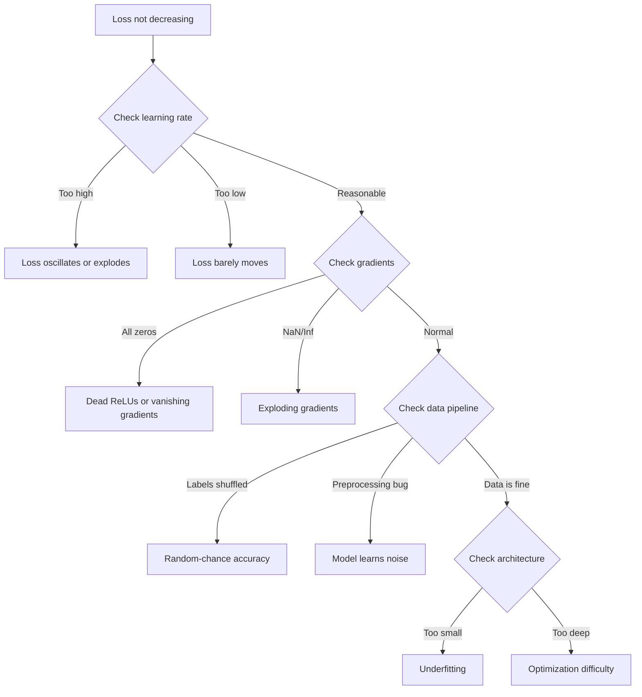
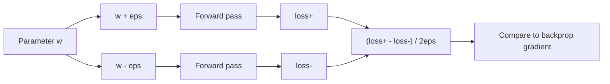
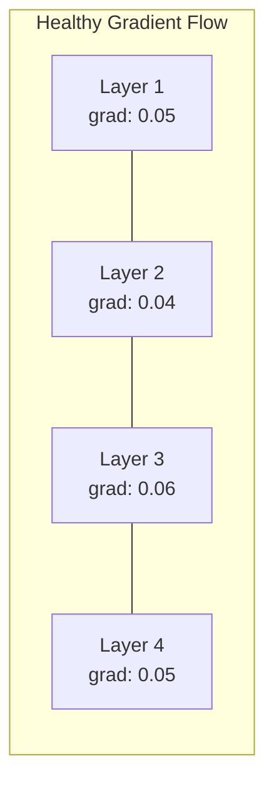
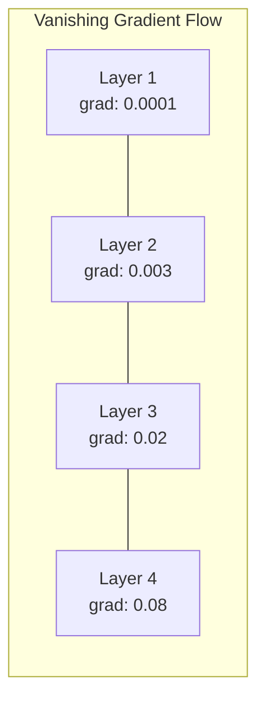
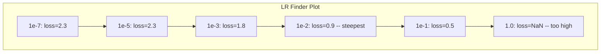

<!-- i18n:manual -->
# Отладка нейросетей

> Ваша сеть скомпилировалась. Запустилась. Выдала число. Число неверное, и при этом ничего не упало. Добро пожаловать в самый тяжёлый вид отладки — тот, где нет сообщения об ошибке.

**Type:** Build
**Languages:** Python, PyTorch
**Prerequisites:** Phase 03 Lessons 01-10 (especially backpropagation, loss functions, optimizers)
**Time:** ~90 minutes

## Learning Objectives

- Диагностировать типичные отказы нейросетей (NaN в loss, ровная кривая loss, overfitting, колебания) с помощью системных приёмов отладки
- Применять приём «переобучить один batch», чтобы убедиться, что архитектура модели и цикл обучения написаны верно
- Смотреть на величины градиентов, распределения активаций и нормы весов, чтобы находить затухающие и взрывающиеся градиенты
- Собрать чек-лист отладки, который покрывает пайплайн данных, архитектуру, функцию потерь, оптимизатор и learning rate

## The Problem

Обычный софт падает, когда он сломан. Разыменование null бросает исключение. Несовпадение типов не проходит компиляцию. Ошибка на единицу выдаёт явно неверный результат.

Нейросети такой роскоши не дают.

Сломанная нейросеть спокойно доходит до конца, печатает значение loss и выдаёт предсказания. Loss может даже падать. Предсказания могут выглядеть правдоподобно. Но модель тихо неверна: учит обходные пути, запоминает шум или сходится в бесполезный локальный минимум. Исследователи Google оценивали, что 60-70% времени отладки ML уходит на «тихие» баги, которые не дают ошибок, но портят качество модели.

Разница между рабочей моделью и сломанной — часто одна строка не на месте: пропущенный `zero_grad()`, перепутанная размерность, learning rate, ошибочный в 10 раз. Канонический «Recipe for Training Neural Networks» (2019) открывается фразой: "The most common neural net mistakes are bugs that don't crash."

Этот урок учит находить такие баги.

> 🎒 **На пальцах.** 60-70% — это две трети всего времени отладки. То есть на баги, которые честно падают с ошибкой, уходит меньше трети сил. Как с протечкой в квартире: лопнувшую трубу видно сразу, а капающий кран за шкафом обнаруживают по счёту за воду через полгода.

## The Concept

### The Debugging Mindset

Забудьте про отладку в стиле «поставлю print и помолюсь». Нейросети требуют системного подхода: обратная связь медленная (минуты и часы на один прогон обучения), а симптомы неоднозначны (плохой loss может означать 20 разных вещей).

Золотое правило: **начинайте с простого, добавляйте сложность по одному куску и проверяйте каждый кусок отдельно.**



> 🎒 **На пальцах.** В этом дереве четыре развилки, и архитектура — самая последняя. Новички обычно начинают именно с неё: «наверное, нужно больше слоёв». Это самый дорогой способ отладки — каждая переделка архитектуры стоит нового прогона обучения, а проверка learning rate стоит одной цифры в коде.

### Symptom 1: Loss Not Decreasing

Самая частая жалоба. Цикл обучения крутится, эпохи идут, а loss стоит на месте или дико скачет.

**Wrong learning rate.** Слишком большой: loss колеблется или улетает в NaN. Слишком маленький: loss падает так медленно, что кривая выглядит ровной. Для Adam начинайте с 1e-3. Для SGD — с 1e-1 или 1e-2. Всегда пробуйте три значения с шагом в 10 раз (например, 1e-2, 1e-3, 1e-4), прежде чем решить, что дело в чём-то другом.

**Dead ReLUs.** Если нейрон с ReLU получает большой отрицательный вход, он выдаёт 0, и его градиент тоже 0. Он больше никогда не активируется. Если умрёт достаточно нейронов, сеть перестанет учиться. Проверка: печатайте долю активаций, которые в точности равны 0, после каждого слоя ReLU. Если мертвы больше 50% — переходите на LeakyReLU или уменьшайте learning rate.

**Vanishing gradients.** В глубоких сетях с sigmoid или tanh градиенты уменьшаются экспоненциально по мере распространения назад. К первому слою они доходят почти нулевыми. Первые слои перестают учиться. Лечение: ReLU/GELU, residual connections или batch normalization.

**Exploding gradients.** Обратная беда — градиенты растут экспоненциально. Обычное дело в RNN и очень глубоких сетях. Loss улетает в NaN. Лечение: gradient clipping (`torch.nn.utils.clip_grad_norm_`), меньший learning rate или нормализация.

> 🎒 **На пальцах.** Learning rate — это длина шага. Слишком длинный шаг — вы перепрыгиваете через яму и скачете туда-сюда по её краям. Слишком короткий — идёте к цели, но за час сдвинулись на сантиметр, и со стороны кажется, что вы стоите. Поэтому и пробуют сразу три значения: 1e-2, 1e-3, 1e-4. Одно из них почти всегда попадает.

### Symptom 2: Loss Decreasing But Model is Bad

Loss падает. Точность на обучении доходит до 99%. А на тесте — 55%. Или модель выдаёт бессмыслицу на реальных данных.

**Overfitting.** Модель запоминает обучающие данные вместо того, чтобы находить закономерности. Разрыв между обучающим и валидационным loss со временем растёт. Лечение: больше данных, dropout, weight decay, ранняя остановка, аугментация данных.

**Data leakage.** Тестовые данные просочились в обучающие. Точность подозрительно высокая. Частые причины: перемешивание до разбиения, предобработка со статистиками по всему датасету, дубликаты примеров в разных частях. Лечение: сначала разбить, потом обрабатывать, и проверить на дубликаты.

**Label errors.** В большинстве реальных датасетов 5-10% меток неверны (Northcutt et al., 2021 -- "Pervasive Label Errors in Test Sets"). Модель учит этот шум. Лечение: confident learning для поиска и починки неверных меток либо отбрасывание примеров с самым большим loss.

> 🎒 **На пальцах.** 99% на обучении и 55% на тесте — это ученик, который вызубрил ответы к домашке, а на контрольной с другими числами угадывает монеткой (для двух классов 50% — это ровно случайное угадывание). Разрыв в 44 пункта и есть подпись overfitting: модель не поняла правило, она запомнила ответы.

### Symptom 3: NaN or Inf in Loss

Значение loss становится `nan` или `inf`. Обучение мертво.

**Learning rate too high.** Обновления перелетают так далеко, что веса взрываются. Лечение: уменьшить в 10 раз.

**log(0) or log(negative).** Cross-entropy считает `log(p)`. Если модель выдаёт ровно 0 или отрицательную вероятность, логарифм взрывается. Лечение: зажать предсказания в `[eps, 1-eps]`, где `eps=1e-7`.

**Division by zero.** Batch normalization делит на стандартное отклонение. У батча с одинаковыми значениями std=0. Лечение: добавить эпсилон в знаменатель (в PyTorch это делается по умолчанию, а в самописных реализациях — не всегда).

**Numerical overflow.** Большие активации, поданные в `exp()`, дают Inf. Softmax особенно уязвим. Лечение: вычесть максимум перед экспонированием (приём log-sum-exp).

> 🎒 **На пальцах.** Порядок проверки важен: если NaN появился на первом же шаге — виновата математика (`log(0)`, деление на ноль). Если после десятка нормальных шагов — виноват learning rate, веса успели разогнаться. Один и тот же `nan` на экране, а причины разные, и различает их только номер шага.

### Technique 1: Gradient Checking

Сравните свои аналитические градиенты (из backprop) с численными (из конечных разностей). Если они расходятся — в обратном проходе баг.

Численный градиент для параметра `w`:

```
grad_numerical = (loss(w + eps) - loss(w - eps)) / (2 * eps)
```

Мера согласия (относительная разница):

```
rel_diff = |grad_analytical - grad_numerical| / max(|grad_analytical|, |grad_numerical|, 1e-8)
```

Если `rel_diff < 1e-5` — всё верно. Если `rel_diff > 1e-3` — почти наверняка баг.



> 🎒 **На пальцах.** Это способ измерить крутизну горки, не зная формулы: шагнуть чуть вперёд, шагнуть чуть назад, разделить разницу высот на пройденное расстояние. Медленно, зато честно. Разница между «верно» и «баг» тут в сто раз: 1e-5 против 1e-3. Промежуточные значения обычно означают не ошибку, а накопленную погрешность округления.

### Technique 2: Activation Statistics

Следите за средним и стандартным отклонением активаций после каждого слоя во время обучения. У здоровой сети активации держат среднее около 0 и std около 1 (после нормализации) или хотя бы остаются ограниченными.

| Health indicator | Mean | Std | Diagnosis |
|-----------------|------|-----|-----------|
| Healthy | ~0 | ~1 | Сеть учится нормально |
| Saturated | >>0 или <<0 | ~0 | Активации застряли в крайних значениях |
| Dead | 0 | 0 | Нейроны мертвы (сплошные нули) |
| Exploding | >>10 | >>10 | Активации растут без предела |

> 🎒 **На пальцах.** Std — это разброс. Std около 0 означает, что все нейроны слоя выдают одно и то же число, то есть слой не различает примеры и передаёт дальше ноль информации. Как класс, где все 30 учеников написали контрольную на одинаковые 4 балла: оценки есть, а различить учеников по ним нельзя.

### Technique 3: Gradient Flow Visualization

Постройте график средней величины градиента по слоям. У здоровой сети величины градиентов примерно одинаковы во всех слоях. Если у ранних слоёв градиенты в 1000 раз меньше, чем у поздних, — это затухающие градиенты.





### Technique 4: The Overfit-One-Batch Test

Самый важный приём отладки в глубоком обучении.

Возьмите один маленький batch (8-32 примера). Обучайтесь на нём 100+ итераций. Loss должен уйти почти в ноль, а точность на обучении — дойти до 100%. Если этого не происходит, в модели или цикле обучения есть фундаментальный баг — не переходите к полному обучению.

Этот тест ловит:
- Сломанные функции потерь
- Сломанный обратный проход
- Архитектуру, слишком маленькую для этих данных
- Оптимизатор, не подключённый к параметрам модели
- Рассогласованные данные и метки

Прогон занимает 30 секунд и экономит часы отладки полных прогонов обучения.

> 🎒 **На пальцах.** Смысл теста простой: 8 примеров любая сеть обязана просто выучить наизусть. Если она не может даже этого, обучать её на миллионе примеров бессмысленно. Сравните с проверкой калькулятора: прежде чем считать бюджет компании, наберите «2 + 2». Не сошлось — чинить надо калькулятор, а не бюджет. 30 секунд против нескольких часов.

### Technique 5: Learning Rate Finder

Лесли Смит (2017) предложил за одну эпоху прогнать learning rate от очень маленького (1e-7) до очень большого (10), записывая loss. Постройте график loss от learning rate. Оптимальный learning rate примерно в 10 раз меньше того, при котором loss падает быстрее всего.



Лучший LR в этом примере: ~1e-3 (на порядок раньше самой крутой точки).

> 🎒 **На пальцах.** Посмотрите на числа: до 1e-5 loss стоит на 2.3 (модель вообще не двигается), при 1e-2 падает круче всего, при 1.0 превращается в NaN. Берут не самую крутую точку, а на порядок раньше — как на скользкой дороге не выжимают максимальную скорость, а держат ту, с которой ещё можно затормозить.

### Common PyTorch Bugs

Это баги, на которые сообщество PyTorch суммарно потратило больше всего часов:

| Bug | Symptom | Fix |
|-----|---------|-----|
| Забыли `optimizer.zero_grad()` | Градиенты накапливаются между батчами, loss колеблется | Добавить `optimizer.zero_grad()` перед `loss.backward()` |
| Забыли `model.eval()` на тесте | Dropout и batch norm ведут себя иначе, точность на тесте гуляет от прогона к прогону | Добавить `model.eval()` и `torch.no_grad()` |
| Неверные формы тензоров | Тихий broadcasting даёт неверный результат без ошибки | Печатать формы после каждой операции во время отладки |
| Несовпадение CPU/GPU | `RuntimeError: expected CUDA tensor` | Вызывать `.to(device)` и на модели, И на данных |
| Не отцепили тензоры | Граф вычислений растёт бесконечно, OOM | Использовать `.detach()` или `with torch.no_grad()` |
| In-place операции ломают autograd | `RuntimeError: modified by in-place operation` | Заменить `x += 1` на `x = x + 1` |
| Данные не нормализованы | Loss застрял на уровне случайного угадывания | Нормализовать входы к mean=0, std=1 |
| Неверный dtype у меток | Cross-entropy ждёт `Long`, а получил `Float` | Привести метки: `labels.long()` |

> 🎒 **На пальцах.** Первая строка — самая частая ошибка на свете. Без `zero_grad()` градиенты складываются, и на десятом шаге вы шагаете суммой десяти градиентов вместо одного, то есть шагом в 10 раз длиннее задуманного. Как весы в магазине: если не обнулить их с прошлой покупкой на чаше, каждый следующий взвешенный товар будет тяжелее правды.

### The Master Debugging Table

| Symptom | Likely cause | First thing to try |
|---------|-------------|-------------------|
| Loss застрял на -log(1/num_classes) | Модель предсказывает равномерное распределение | Проверить пайплайн данных, убедиться, что метки соответствуют входам |
| NaN в loss через несколько шагов | Слишком большой learning rate | Уменьшить LR в 10 раз |
| NaN в loss сразу | log(0) или деление на ноль | Добавить эпсилон в логарифмы и деления |
| Loss дико колеблется | LR слишком большой или batch слишком маленький | Уменьшить LR, увеличить batch |
| Loss падает, потом выходит на плато | LR великоват для стадии дообучения | Добавить расписание LR (косинус или ступенчатое затухание) |
| Точность на обучении высокая, на тесте низкая | Overfitting | Добавить dropout, weight decay, больше данных |
| Точность на обучении = на тесте = случайной | Модель вообще ничему не учится | Прогнать тест overfit-one-batch |
| Точность на обучении = на тесте, но обе низкие | Недообучение | Модель побольше, больше слоёв, больше признаков |
| Все градиенты нулевые | Мёртвые ReLU или отцепленный граф вычислений | Перейти на LeakyReLU, проверить `.requires_grad` |
| Кончилась память во время обучения | Слишком большой batch или граф не освобождается | Уменьшить batch, использовать `torch.no_grad()` для валидации |

```figure
learning-curves
```

> 🎒 **На пальцах.** Первую строку выучите наизусть. Если классов 10, то -log(1/10) = log(10) ≈ 2.3. Loss замер ровно на 2.3 — модель просто угадывает наугад, как если бы вы отвечали на тест из 10 вариантов броском кубика. Для 2 классов это число 0.69, для 1000 классов — 6.9. Одна цифра на экране мгновенно отвечает на вопрос «модель учится или делает вид».

## Build It

Диагностический набор, который следит за активациями, градиентами и кривыми loss. Вы намеренно сломаете сеть и с помощью этого набора поставите диагноз каждой поломке.

### Step 1: The NetworkDebugger Class

Цепляется хуками к модели PyTorch и записывает статистику активаций и градиентов по слоям.

```python
import torch
import torch.nn as nn
import math


class NetworkDebugger:
    def __init__(self, model):
        self.model = model
        self.activation_stats = {}
        self.gradient_stats = {}
        self.loss_history = []
        self.lr_losses = []
        self.hooks = []
        self._register_hooks()

    def _register_hooks(self):
        for name, module in self.model.named_modules():
            if isinstance(module, (nn.Linear, nn.Conv2d, nn.ReLU, nn.LeakyReLU)):
                hook = module.register_forward_hook(self._make_activation_hook(name))
                self.hooks.append(hook)
                hook = module.register_full_backward_hook(self._make_gradient_hook(name))
                self.hooks.append(hook)

    def _make_activation_hook(self, name):
        def hook(module, input, output):
            with torch.no_grad():
                out = output.detach().float()
                self.activation_stats[name] = {
                    "mean": out.mean().item(),
                    "std": out.std().item(),
                    "fraction_zero": (out == 0).float().mean().item(),
                    "min": out.min().item(),
                    "max": out.max().item(),
                }
        return hook

    def _make_gradient_hook(self, name):
        def hook(module, grad_input, grad_output):
            if grad_output[0] is not None:
                with torch.no_grad():
                    grad = grad_output[0].detach().float()
                    self.gradient_stats[name] = {
                        "mean": grad.mean().item(),
                        "std": grad.std().item(),
                        "abs_mean": grad.abs().mean().item(),
                        "max": grad.abs().max().item(),
                    }
        return hook

    def record_loss(self, loss_value):
        self.loss_history.append(loss_value)

    def check_loss_health(self):
        if len(self.loss_history) < 2:
            return "NOT_ENOUGH_DATA"
        recent = self.loss_history[-10:]
        if any(math.isnan(v) or math.isinf(v) for v in recent):
            return "NAN_OR_INF"
        if len(self.loss_history) >= 20:
            first_half = sum(self.loss_history[:10]) / 10
            second_half = sum(self.loss_history[-10:]) / 10
            if second_half >= first_half * 0.99:
                return "NOT_DECREASING"
        if len(recent) >= 5:
            diffs = [recent[i+1] - recent[i] for i in range(len(recent)-1)]
            if max(diffs) - min(diffs) > 2 * abs(sum(diffs) / len(diffs)):
                return "OSCILLATING"
        return "HEALTHY"

    def check_activations(self):
        issues = []
        for name, stats in self.activation_stats.items():
            if stats["fraction_zero"] > 0.5:
                issues.append(f"DEAD_NEURONS: {name} has {stats['fraction_zero']:.0%} zero activations")
            if abs(stats["mean"]) > 10:
                issues.append(f"EXPLODING_ACTIVATIONS: {name} mean={stats['mean']:.2f}")
            if stats["std"] < 1e-6:
                issues.append(f"COLLAPSED_ACTIVATIONS: {name} std={stats['std']:.2e}")
        return issues if issues else ["HEALTHY"]

    def check_gradients(self):
        issues = []
        grad_magnitudes = []
        for name, stats in self.gradient_stats.items():
            grad_magnitudes.append((name, stats["abs_mean"]))
            if stats["abs_mean"] < 1e-7:
                issues.append(f"VANISHING_GRADIENT: {name} abs_mean={stats['abs_mean']:.2e}")
            if stats["abs_mean"] > 100:
                issues.append(f"EXPLODING_GRADIENT: {name} abs_mean={stats['abs_mean']:.2e}")
        if len(grad_magnitudes) >= 2:
            first_mag = grad_magnitudes[0][1]
            last_mag = grad_magnitudes[-1][1]
            if last_mag > 0 and first_mag / last_mag > 100:
                issues.append(f"GRADIENT_RATIO: first/last = {first_mag/last_mag:.0f}x (vanishing)")
        return issues if issues else ["HEALTHY"]

    def print_report(self):
        print("\n=== NETWORK DEBUGGER REPORT ===")
        print(f"\nLoss health: {self.check_loss_health()}")
        if self.loss_history:
            print(f"  Last 5 losses: {[f'{v:.4f}' for v in self.loss_history[-5:]]}")
        print("\nActivation diagnostics:")
        for item in self.check_activations():
            print(f"  {item}")
        print("\nGradient diagnostics:")
        for item in self.check_gradients():
            print(f"  {item}")
        print("\nPer-layer activation stats:")
        for name, stats in self.activation_stats.items():
            print(f"  {name}: mean={stats['mean']:.4f} std={stats['std']:.4f} zero={stats['fraction_zero']:.1%}")
        print("\nPer-layer gradient stats:")
        for name, stats in self.gradient_stats.items():
            print(f"  {name}: abs_mean={stats['abs_mean']:.2e} max={stats['max']:.2e}")

    def remove_hooks(self):
        for hook in self.hooks:
            hook.remove()
        self.hooks.clear()
```

> 🎒 **На пальцах.** Все пороги здесь — это ровно те числа, о которых шла речь выше. Больше 50% нулей в активациях — `DEAD_NEURONS`. Средний модуль градиента меньше 1e-7 — `VANISHING_GRADIENT`. Первый слой получает градиент в 100 раз меньше последнего — тоже тревога. Это как медсестра с термометром: она не лечит, она называет число и говорит, нормальное оно или нет.

### Step 2: The Overfit-One-Batch Test

```python
def overfit_one_batch(model, x_batch, y_batch, criterion, lr=0.01, steps=200):
    optimizer = torch.optim.Adam(model.parameters(), lr=lr)
    model.train()
    print("\n=== OVERFIT ONE BATCH TEST ===")
    print(f"Batch size: {x_batch.shape[0]}, Steps: {steps}")

    for step in range(steps):
        optimizer.zero_grad()
        output = model(x_batch)
        loss = criterion(output, y_batch)
        loss.backward()
        optimizer.step()

        if step % 50 == 0 or step == steps - 1:
            with torch.no_grad():
                preds = (output > 0).float() if output.shape[-1] == 1 else output.argmax(dim=1)
                targets = y_batch if y_batch.dim() == 1 else y_batch.squeeze()
                acc = (preds.squeeze() == targets).float().mean().item()
            print(f"  Step {step:3d} | Loss: {loss.item():.6f} | Accuracy: {acc:.1%}")

    final_loss = loss.item()
    if final_loss > 0.1:
        print(f"\n  FAIL: Loss did not converge ({final_loss:.4f}). Model or training loop is broken.")
        return False
    print(f"\n  PASS: Loss converged to {final_loss:.6f}")
    return True
```

> 🎒 **На пальцах.** Порог решения здесь один: `final_loss > 0.1` — значит FAIL. Функция крутит 200 шагов и печатает отчёт каждые 50, так что вы видите не только итог, но и траекторию. Если на шаге 0 loss был 0.7, а на шаге 150 всё ещё 0.69, дальше можно не смотреть — сеть не учится даже на восьми примерах.

### Step 3: Learning Rate Finder

```python
def find_learning_rate(model, x_data, y_data, criterion, start_lr=1e-7, end_lr=10, steps=100):
    import copy
    original_state = copy.deepcopy(model.state_dict())
    optimizer = torch.optim.SGD(model.parameters(), lr=start_lr)
    lr_mult = (end_lr / start_lr) ** (1 / steps)

    model.train()
    results = []
    best_loss = float("inf")
    current_lr = start_lr

    print("\n=== LEARNING RATE FINDER ===")

    for step in range(steps):
        optimizer.zero_grad()
        output = model(x_data)
        loss = criterion(output, y_data)

        if math.isnan(loss.item()) or loss.item() > best_loss * 10:
            break

        best_loss = min(best_loss, loss.item())
        results.append((current_lr, loss.item()))

        loss.backward()
        optimizer.step()

        current_lr *= lr_mult
        for param_group in optimizer.param_groups:
            param_group["lr"] = current_lr

    model.load_state_dict(original_state)

    if len(results) < 10:
        print("  Could not complete LR sweep -- loss diverged too quickly")
        return results

    min_loss_idx = min(range(len(results)), key=lambda i: results[i][1])
    suggested_lr = results[max(0, min_loss_idx - 10)][0]

    print(f"  Swept {len(results)} steps from {start_lr:.0e} to {results[-1][0]:.0e}")
    print(f"  Minimum loss {results[min_loss_idx][1]:.4f} at lr={results[min_loss_idx][0]:.2e}")
    print(f"  Suggested learning rate: {suggested_lr:.2e}")

    return results
```

### Step 4: Gradient Checker

```python
def _flat_to_multi_index(flat_idx, shape):
    multi_idx = []
    remaining = flat_idx
    for dim in reversed(shape):
        multi_idx.insert(0, remaining % dim)
        remaining //= dim
    return tuple(multi_idx)


def gradient_check(model, x, y, criterion, eps=1e-4):
    model.train()
    x_double = x.double()
    y_double = y.double()
    model_double = model.double()

    print("\n=== GRADIENT CHECK ===")
    overall_max_diff = 0
    checked = 0

    for name, param in model_double.named_parameters():
        if not param.requires_grad:
            continue

        layer_max_diff = 0

        model_double.zero_grad()
        output = model_double(x_double)
        loss = criterion(output, y_double)
        loss.backward()
        analytical_grad = param.grad.clone()

        num_checks = min(5, param.numel())
        for i in range(num_checks):
            idx = _flat_to_multi_index(i, param.shape)
            original = param.data[idx].item()

            param.data[idx] = original + eps
            with torch.no_grad():
                loss_plus = criterion(model_double(x_double), y_double).item()

            param.data[idx] = original - eps
            with torch.no_grad():
                loss_minus = criterion(model_double(x_double), y_double).item()

            param.data[idx] = original

            numerical = (loss_plus - loss_minus) / (2 * eps)
            analytical = analytical_grad[idx].item()

            denom = max(abs(numerical), abs(analytical), 1e-8)
            rel_diff = abs(numerical - analytical) / denom

            layer_max_diff = max(layer_max_diff, rel_diff)
            checked += 1

        overall_max_diff = max(overall_max_diff, layer_max_diff)
        status = "OK" if layer_max_diff < 1e-5 else "MISMATCH"
        print(f"  {name}: max_rel_diff={layer_max_diff:.2e} [{status}]")

    model.float()

    print(f"\n  Checked {checked} parameters")
    if overall_max_diff < 1e-5:
        print("  PASS: Gradients match (rel_diff < 1e-5)")
    elif overall_max_diff < 1e-3:
        print("  WARN: Small differences (1e-5 < rel_diff < 1e-3)")
    else:
        print("  FAIL: Gradient mismatch detected (rel_diff > 1e-3)")
    return overall_max_diff
```

> 🎒 **На пальцах.** Обратите внимание на две детали. Первая: модель переводится в `double` — во float32 численный градиент сам по себе шумит сильнее порога 1e-5, и проверка врала бы. Вторая: проверяются только 5 значений на слой, а не все. Матрицу 32×10 никто не проверяет целиком: если backprop сломан, он сломан во всех элементах сразу, и хватит пяти проб.

### Step 5: Deliberately Broken Networks

Теперь применим набор к сломанным сетям и поставим диагноз каждой.

```python
def demo_broken_networks():
    torch.manual_seed(42)
    x = torch.randn(64, 10)
    y = (x[:, 0] > 0).long()

    print("\n" + "=" * 60)
    print("BUG 1: Learning rate too high (lr=10)")
    print("=" * 60)
    model1 = nn.Sequential(nn.Linear(10, 32), nn.ReLU(), nn.Linear(32, 2))
    debugger1 = NetworkDebugger(model1)
    optimizer1 = torch.optim.SGD(model1.parameters(), lr=10.0)
    criterion = nn.CrossEntropyLoss()
    for step in range(20):
        optimizer1.zero_grad()
        out = model1(x)
        loss = criterion(out, y)
        debugger1.record_loss(loss.item())
        loss.backward()
        optimizer1.step()
    debugger1.print_report()
    debugger1.remove_hooks()

    print("\n" + "=" * 60)
    print("BUG 2: Dead ReLUs from bad initialization")
    print("=" * 60)
    model2 = nn.Sequential(nn.Linear(10, 32), nn.ReLU(), nn.Linear(32, 32), nn.ReLU(), nn.Linear(32, 2))
    with torch.no_grad():
        for m in model2.modules():
            if isinstance(m, nn.Linear):
                m.weight.fill_(-1.0)
                m.bias.fill_(-5.0)
    debugger2 = NetworkDebugger(model2)
    optimizer2 = torch.optim.Adam(model2.parameters(), lr=1e-3)
    for step in range(50):
        optimizer2.zero_grad()
        out = model2(x)
        loss = criterion(out, y)
        debugger2.record_loss(loss.item())
        loss.backward()
        optimizer2.step()
    debugger2.print_report()
    debugger2.remove_hooks()

    print("\n" + "=" * 60)
    print("BUG 3: Missing zero_grad (gradients accumulate)")
    print("=" * 60)
    model3 = nn.Sequential(nn.Linear(10, 32), nn.ReLU(), nn.Linear(32, 2))
    debugger3 = NetworkDebugger(model3)
    optimizer3 = torch.optim.SGD(model3.parameters(), lr=0.01)
    for step in range(50):
        out = model3(x)
        loss = criterion(out, y)
        debugger3.record_loss(loss.item())
        loss.backward()
        optimizer3.step()
    debugger3.print_report()
    debugger3.remove_hooks()

    print("\n" + "=" * 60)
    print("HEALTHY NETWORK: Correct setup for comparison")
    print("=" * 60)
    model_good = nn.Sequential(nn.Linear(10, 32), nn.ReLU(), nn.Linear(32, 2))
    debugger_good = NetworkDebugger(model_good)
    optimizer_good = torch.optim.Adam(model_good.parameters(), lr=1e-3)
    for step in range(50):
        optimizer_good.zero_grad()
        out = model_good(x)
        loss = criterion(out, y)
        debugger_good.record_loss(loss.item())
        loss.backward()
        optimizer_good.step()
    debugger_good.print_report()
    debugger_good.remove_hooks()

    print("\n" + "=" * 60)
    print("OVERFIT-ONE-BATCH TEST (healthy model)")
    print("=" * 60)
    model_test = nn.Sequential(nn.Linear(10, 32), nn.ReLU(), nn.Linear(32, 2))
    overfit_one_batch(model_test, x[:8], y[:8], criterion)

    print("\n" + "=" * 60)
    print("LEARNING RATE FINDER")
    print("=" * 60)
    model_lr = nn.Sequential(nn.Linear(10, 32), nn.ReLU(), nn.Linear(32, 2))
    find_learning_rate(model_lr, x, y, criterion)

    print("\n" + "=" * 60)
    print("GRADIENT CHECK")
    print("=" * 60)
    model_grad = nn.Sequential(nn.Linear(10, 8), nn.ReLU(), nn.Linear(8, 2))
    gradient_check(model_grad, x[:4], y[:4], criterion)
```

## Use It

### PyTorch Built-in Tools

```python
import torch
import torch.nn as nn

model = nn.Sequential(
    nn.Linear(768, 256),
    nn.ReLU(),
    nn.Linear(256, 10),
)

with torch.autograd.detect_anomaly():
    output = model(input_tensor)
    loss = criterion(output, target)
    loss.backward()

for name, param in model.named_parameters():
    if param.grad is not None:
        print(f"{name}: grad_mean={param.grad.abs().mean():.2e}")
```

### Weights & Biases Integration

```python
import wandb

wandb.init(project="debug-training")

for epoch in range(100):
    loss = train_one_epoch()
    wandb.log({
        "loss": loss,
        "lr": optimizer.param_groups[0]["lr"],
        "grad_norm": torch.nn.utils.clip_grad_norm_(model.parameters(), float("inf")),
    })

    for name, param in model.named_parameters():
        if param.grad is not None:
            wandb.log({f"grad/{name}": wandb.Histogram(param.grad.cpu().numpy())})
```

### TensorBoard

```python
from torch.utils.tensorboard import SummaryWriter

writer = SummaryWriter("runs/debug_experiment")

for epoch in range(100):
    loss = train_one_epoch()
    writer.add_scalar("Loss/train", loss, epoch)

    for name, param in model.named_parameters():
        writer.add_histogram(f"weights/{name}", param, epoch)
        if param.grad is not None:
            writer.add_histogram(f"gradients/{name}", param.grad, epoch)
```

### The Debug Checklist (Before Full Training)

1. Прогнать тест overfit-one-batch. Не прошёл — стоп.
2. Напечатать сводку по модели — проверить, что число параметров разумное.
3. Прогнать один прямой проход на случайных данных — проверить форму выхода.
4. Обучить 5 эпох — убедиться, что loss падает.
5. Проверить статистику активаций — нет мёртвых слоёв, нет взрывов.
6. Проверить поток градиентов — нет затухания, нет взрыва.
7. Проверить пайплайн данных — напечатать 5 случайных примеров с метками.

> 🎒 **На пальцах.** Это чек-лист лётчика перед взлётом: скучный, всегда один и тот же, занимает пару минут. Пункт 1 — шлагбаум: не прошёл — дальше идти нельзя, остальные шесть пунктов уже неважны. Пункт 4 стоит именно на пятой эпохе, а не на пятидесятой: если за 5 эпох loss не сдвинулся, за 50 он тоже не сдвинется.

## Ship It

Этот урок производит:
- `outputs/prompt-nn-debugger.md` -- промпт для диагностики отказов при обучении нейросетей
- `outputs/skill-debug-checklist.md` -- чек-лист в виде дерева решений для отладки обучения

Ключевые приёмы для продакшена:
- Добавляйте хуки мониторинга в боевые скрипты обучения
- Логируйте статистику активаций и градиентов в W&B или TensorBoard каждые N шагов
- Настройте автоматические оповещения на NaN в loss, мёртвые нейроны (>80% нулей) и взрыв градиентов
- Всегда прогоняйте тест overfit-one-batch при смене архитектуры или пайплайна данных

## Exercises

1. **Add an exploding gradient detector.** Доработайте `NetworkDebugger` так, чтобы он замечал превышение порога градиентами и сам предлагал значение для gradient clipping. Проверьте на 20-слойной сети без нормализации.

2. **Build a dead neuron resurrector.** Напишите функцию, которая находит мёртвые ReLU-нейроны (всегда выдающие 0) и переинициализирует их входящие веса инициализацией Каймина. Покажите, что это оживляет сеть, где мертвы больше 70% нейронов.

3. **Implement the learning rate finder with plotting.** Расширьте `find_learning_rate` так, чтобы он сохранял результаты в CSV, и напишите отдельный скрипт, который читает CSV и рисует кривую LR-loss через matplotlib. Найдите оптимальный LR для ResNet-18 на CIFAR-10.

4. **Create a data pipeline validator.** Напишите функцию, которая проверяет: дубликаты примеров между train и test, перекос в распределении меток (соотношение больше 10:1), нормализацию входов (среднее около 0, std около 1) и наличие NaN/inf в данных. Прогоните её на намеренно испорченном датасете.

5. **Debug a real failure.** Возьмите мини-фреймворк из урока 10, внесите неочевидный баг (например, транспонируйте матрицу весов в обратном проходе) и с помощью gradient checking найдите, у какого именно параметра градиенты неверны. Опишите ход отладки.

> 🎒 **На пальцах.** Подсказка ко второму заданию: мёртвый нейрон определяется не по весам, а по поведению — прогоните через сеть batch и посмотрите, у каких нейронов выход равен 0 на всех примерах без исключения. Если таких больше 70% из 32 нейронов слоя, то работают меньше 10 — сеть размером с целый слой на деле думает вдесятером. Кайминовская инициализация ставит новым весам разброс порядка sqrt(2/n_входов), и нейрон снова начинает иногда выдавать положительное число.

## Key Terms

| Term | What people say | What it actually means |
|------|----------------|----------------------|
| Silent bug | «Работает, но результаты плохие» | Баг, который не даёт ошибки, но портит качество модели — главный вид отказов в ML |
| Dead ReLU | «Нейроны умерли» | Нейрон с ReLU, у которого вход всегда отрицателен, поэтому он навсегда выдаёт 0 и получает нулевой градиент |
| Vanishing gradients | «Ранние слои перестали учиться» | Градиенты экспоненциально уменьшаются через слои, и веса ранних слоёв фактически заморожены |
| Exploding gradients | «Loss ушёл в NaN» | Градиенты экспоненциально растут через слои, обновления весов становятся такими большими, что переполняются |
| Gradient checking | «Проверить, верен ли backprop» | Сравнение аналитических градиентов из backprop с численными из конечных разностей |
| Overfit-one-batch | «Самый важный отладочный тест» | Обучение на одном маленьком batch, чтобы проверить, что модель В ПРИНЦИПЕ способна учиться — если нет, сломано что-то фундаментальное |
| LR finder | «Прогон в поисках нужного learning rate» | Экспоненциальное увеличение learning rate за одну эпоху и выбор значения прямо перед тем, где loss расходится |
| Data leakage | «Тестовые данные просочились в обучение» | Информация из тестовой выборки попадает в обучение, давая искусственно завышенную точность |
| Activation statistics | «Следить за здоровьем слоёв» | Отслеживание среднего, std и доли нулей на выходе каждого слоя, чтобы поймать мёртвые, насыщенные или взрывающиеся нейроны |
| Gradient clipping | «Ограничить величину градиента» | Уменьшение градиентов, когда их норма превышает порог, чтобы взрыв градиентов не испортил обновление весов |

## Further Reading

- Smith, "Cyclical Learning Rates for Training Neural Networks" (2017) -- статья, в которой появился тест диапазона learning rate (LR finder)
- Northcutt et al., "Pervasive Label Errors in Test Sets Destabilize Machine Learning Benchmarks" (2021) -- показывает, что 3-6% меток в ImageNet, CIFAR-10 и других главных бенчмарках неверны
- Zhang et al., "Understanding Deep Learning Requires Rethinking Generalization" (2017) -- статья, показавшая, что нейросети умеют запоминать случайные метки; именно поэтому работает тест overfit-one-batch
- Документация PyTorch по `torch.autograd.detect_anomaly` и `torch.autograd.set_detect_anomaly` -- встроенное обнаружение NaN/inf
