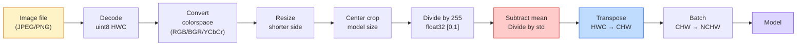
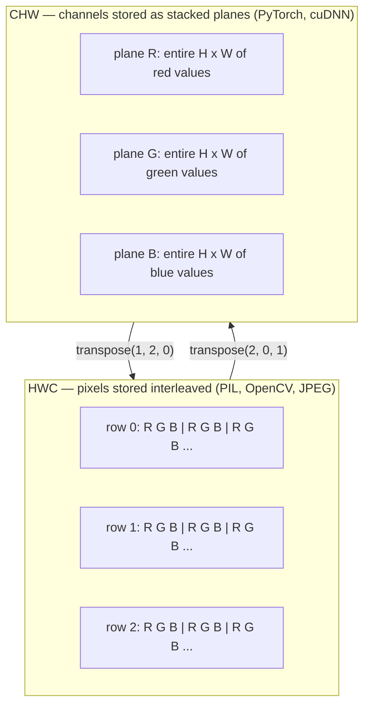

<!-- i18n:manual -->
# Основы изображений — пиксели, каналы, цветовые пространства

> Изображение — это тензор замеров света. С этого одного факта начинается любая модель компьютерного зрения.

**Type:** Build
**Languages:** Python
**Prerequisites:** Phase 1 Lesson 12 (Tensor Operations), Phase 3 Lesson 11 (Intro to PyTorch)
**Time:** ~45 minutes

## Learning Objectives

- Объяснить, как непрерывная сцена превращается в пиксели и почему решения о дискретизации и квантовании задают потолок качества для всех последующих моделей
- Читать, нарезать и проверять изображения как массивы NumPy и свободно переключаться между раскладками HWC и CHW
- Переводить изображение между RGB, grayscale, HSV и YCbCr и объяснять, зачем существует каждое цветовое пространство
- Применять предобработку на уровне пикселей (normalize, standardize, resize, channel-first) ровно так, как этого ждёт torchvision

> 🎒 **На пальцах.** Прежде чем учить модель видеть, надо разобраться, что именно ей показывают. Показывают таблицу чисел. Картинка 224×224 в цвете — это 224 × 224 × 3 = 150 528 чисел, и каждое от 0 до 255. Весь этот урок про то, как эти числа лежат и как их правильно подать.

## The Problem

Каждая статья, которую вы прочитаете, каждые предобученные веса, которые вы скачаете, каждый vision API, который вы вызовете, предполагают конкретный формат входа. Подайте `uint8` туда, где модель ждёт `float32`, — она отработает и молча выдаст мусор. Скормите BGR сети, обученной на RGB, — точность упадёт на десять пунктов. Дайте channels-last вход модели, которая ждёт channels-first, — первый conv-слой примет высоту за канал признаков. Ничего из этого не выбросит ошибку. Просто испортятся метрики, и вы неделю будете искать баг, который живёт в том, как вы загрузили файл.

Convolution несложна, как только вы поняли, по чему она скользит. Сложность в другом: «изображение» означает разное для камеры, JPEG-декодера, PIL, OpenCV, torchvision и CUDA-ядра. У каждого стека свой порядок осей, свой диапазон байтов и своя договорённость про channel. Инженер, который путается в этом, выкатывает сломанные пайплайны.

Этот урок чинит фундамент, чтобы остальная фаза могла на нём строиться. К концу вы будете знать, что такое пиксель, почему на пиксель приходится три числа, а не одно, что на самом деле делает «normalize with ImageNet stats» и как переходить между двумя-тремя раскладками, которые предполагает каждый следующий урок этой фазы.

> 🎒 **На пальцах.** Представьте розетку и вилку. Модель — розетка с очень строгими контактами: три штырька, порядок RGB, значения float32 около нуля. Файл на диске — вилка другой формы: uint8, от 0 до 255, иногда BGR. Ошибки нет только потому, что «вилка» физически влезает. Работать при этом не будет.

## The Concept

### The full preprocessing pipeline at a glance

Любая продакшн-система зрения — это одна и та же цепочка обратимых преобразований. Ошибитесь на одном шаге, и модель увидит не тот вход, на котором её обучали.



Красный и синий блоки — это место, где живут 80% молчаливых сбоев: пропущенная стандартизация и неверная раскладка.

> 🎒 **На пальцах.** Восемь шагов от файла до модели, и порядок важен, как в рецепте. Нельзя сначала посолить, а потом почистить картошку: `Normalize` до деления на 255 даст числа порядка сотен вместо единиц. Два самых опасных шага подсвечены цветом не случайно — их забывают чаще всего.

### A pixel is a sample, not a square

Сенсор камеры считает фотоны, попавшие на сетку крошечных детекторов. Каждый детектор копит свет доли секунды и выдаёт напряжение, пропорциональное числу попавших фотонов. Дальше сенсор дискретизирует это напряжение в целое число. Один детектор становится одним пикселем.

```
Continuous scene                 Sensor grid                     Digital image
(infinite detail)                (H x W detectors)               (H x W integers)

    ~~~~~                        +--+--+--+--+--+                 210 198 180 155 120
   ~   ~   ~                     |  |  |  |  |  |                 205 195 178 152 118
  ~ light ~      ---->           +--+--+--+--+--+     ---->       200 190 175 150 115
   ~~~~~                         |  |  |  |  |  |                 195 185 170 148 112
                                 +--+--+--+--+--+                 188 180 165 145 108
```

На этом шаге происходят два выбора, и они задают потолок для всего дальнейшего:

- **Spatial sampling** решает, сколько детекторов приходится на градус сцены. Слишком мало — края становятся ступенчатыми (aliasing). Слишком много — взрываются память и вычисления.
- **Intensity quantization** решает, насколько мелко разбивается напряжение. 8 бит дают 256 уровней и являются стандартом для экрана. 10, 12, 16 бит дают более плавные градиенты и важны в медицинской съёмке, HDR и raw-пайплайнах.

Пиксель — не цветной квадратик с площадью. Это одно измерение. Когда вы меняете размер или поворачиваете картинку, вы пересемплируете эту сетку измерений.

> 🎒 **На пальцах.** Пиксель — как один градусник в поле, а не как одна плитка на полу. В примере выше сетка 5×5 = 25 детекторов, каждый вернул одно число от 108 до 210. Никакой «площади» у числа 210 нет: это просто «сюда попало много света».

### Why three channels

Один детектор считает фотоны по всему видимому спектру — это grayscale. Чтобы получить цвет, сетку накрывают мозаикой из красных, зелёных и синих фильтров. После демозаики в каждой пространственной точке есть три целых числа: отклик детектора под красным фильтром, под зелёным и под синим. Эти три числа и есть RGB-триплет пикселя.

```
One pixel in memory:

    (R, G, B) = (210, 140, 30)   <- reddish-orange

An H x W RGB image:

    shape (H, W, 3)     stored as   H rows of W pixels of 3 values
                                    each in [0, 255] for uint8
```

Тройка не священна. Камеры глубины добавляют канал Z. Спутники добавляют инфракрасные и ультрафиолетовые диапазоны. Медицинские снимки часто имеют один канал (рентген, КТ) или очень много (гиперспектральные). Число каналов — последняя ось; conv-слои учатся смешивать значения вдоль неё.

> 🎒 **На пальцах.** Три числа — это три «мнения» о том, сколько света попало: красного, зелёного, синего. Триплет (210, 140, 30) — много красного, средне зелёного, мало синего, получается рыже-оранжевый. Картинка 128×192 в RGB — это 128 × 192 × 3 = 73 728 чисел.

### Two layout conventions: HWC and CHW

Один и тот же тензор, два порядка осей. Каждая библиотека выбирает свой.

```
HWC (height, width, channels)           CHW (channels, height, width)

   W ->                                    H ->
  +-----+-----+-----+                     +-----+-----+
H |R G B|R G B|R G B|                   C |R R R R R R|
| +-----+-----+-----+                   | +-----+-----+
v |R G B|R G B|R G B|                   v |G G G G G G|
  +-----+-----+-----+                     +-----+-----+
                                          |B B B B B B|
                                          +-----+-----+

   PIL, OpenCV, matplotlib,              PyTorch, most deep learning
   almost every image file on disk       frameworks, cuDNN kernels
```

CHW существует потому, что kernel скользит по H и W. Если ось channel идёт первой, каждое ядро видит непрерывную двумерную плоскость на канал, и это чисто векторизуется. Дисковые форматы держат HWC, потому что так строки выходят из сенсора.

Однострочник, который вы напечатаете тысячу раз:

```
img_chw = img_hwc.transpose(2, 0, 1)      # NumPy
img_chw = img_hwc.permute(2, 0, 1)        # PyTorch tensor
```

Раскладка памяти наглядно:



> 🎒 **На пальцах.** HWC — как список покупок, где для каждого товара сразу написаны цена, вес и срок годности. CHW — как три отдельных списка: все цены, потом все веса, потом все сроки. Данные те же, порядок разный. Картинка (128, 192, 3) после `transpose(2, 0, 1)` становится (3, 128, 192) — те же 73 728 чисел, просто прочитанные другим маршрутом.

### Byte ranges and dtype

Доминируют три договорённости:

| Convention | dtype | Range | Where you see it |
|------------|-------|-------|------------------|
| Raw | `uint8` | [0, 255] | Файлы на диске, PIL, вывод OpenCV |
| Normalized | `float32` | [0.0, 1.0] | После `img.astype('float32') / 255` |
| Standardized | `float32` | примерно [-2, +2] | После вычитания среднего и деления на std |

Свёрточные сети обучались на стандартизованных входах. Статистики ImageNet `mean=[0.485, 0.456, 0.406]`, `std=[0.229, 0.224, 0.225]` — это среднее арифметическое и стандартное отклонение трёх каналов по всей обучающей выборке ImageNet, посчитанные на пикселях, уже приведённых к [0, 1]. Подать сырой `uint8` в модель, которая ждёт стандартизованный float, — самый частый молчаливый сбой в прикладном зрении.

> 🎒 **На пальцах.** Проверьте на одном числе. Пиксель 210 в raw. Делим на 255 → 0.824, это Normalized. Вычитаем среднее красного канала 0.485 и делим на 0.229 → (0.824 − 0.485) / 0.229 ≈ 1.48, это Standardized. Модель ждёт 1.48, а получает 210 — в 140 раз больше, чем бывает в её мире.

### Color spaces and why they exist

RGB — формат съёмки, но не всегда самое полезное представление для модели.

```
 RGB               HSV                       YCbCr / YUV

 R red             H hue (angle 0-360)       Y luminance (brightness)
 G green           S saturation (0-1)        Cb chroma blue-yellow
 B blue            V value/brightness (0-1)  Cr chroma red-green

 Linear to         Separates color from      Separates brightness from
 sensor output     brightness. Useful for    color. JPEG and most video
                   color thresholding, UI    codecs compress the chroma
                   sliders, simple filters   channels harder because the
                                             human eye is less sensitive
                                             to chroma detail than to Y.
```

В большинство современных CNN вы подаёте RGB. Другие пространства встречаются, когда:

- **HSV** — классический CV-код, сегментация по цвету, баланс белого.
- **YCbCr** — чтение внутренностей JPEG, видеопайплайны, модели super-resolution, работающие только по Y.
- **Grayscale** — OCR, модели для документов, любой случай, где цвет — помеха, а не сигнал.

Grayscale из RGB — это взвешенная сумма, а не среднее, потому что человеческий глаз чувствительнее к зелёному, чем к красному или синему:

```
Y = 0.299 R + 0.587 G + 0.114 B       (ITU-R BT.601, the classic weights)
```

> 🎒 **На пальцах.** Веса 0.299 / 0.587 / 0.114 в сумме дают ровно 1. Зелёный весит больше половины: глаз видит его лучше всего. Возьмите чистый зелёный (0, 255, 0) — яркость получится 0.587 × 255 ≈ 150. Чистый синий (0, 0, 255) даст 0.114 × 255 ≈ 29, то есть почти чёрный. Простое среднее дало бы 85 в обоих случаях, и это было бы неправдой для глаза.

### Aspect ratio, resizing, and interpolation

У каждой модели фиксированный размер входа (224x224 для большинства классификаторов ImageNet, 384x384 или 512x512 для современных детекторов). Ваши изображения почти никогда не совпадают. Три варианта resize, которые имеют значение:

- **Resize shorter side, then center crop** — стандартный рецепт ImageNet. Сохраняет пропорции, выбрасывает полосу краевых пикселей.
- **Resize and pad** — сохраняет пропорции и каждый пиксель, добавляет чёрные полосы. Стандарт для детекции и OCR.
- **Resize directly to target** — растягивает изображение. Дёшево, искажает геометрию, для многих задач классификации сойдёт.

Метод интерполяции решает, как считаются промежуточные пиксели, когда новая сетка не совпадает со старой:

```
Nearest neighbour     fastest, blocky, only choice for masks/labels
Bilinear              fast, smooth, default for most image resizing
Bicubic               slower, sharper on upscaling
Lanczos               slowest, best quality, used for final display
```

Правило большого пальца: bilinear для обучения, bicubic или lanczos для картинок, на которые вы будете смотреть, nearest для всего, где лежат целочисленные ID классов.

> 🎒 **На пальцах.** Почему nearest обязателен для масок: если класс «дорога» это 3, а «небо» это 7, то bilinear между соседями даст 5 — класса с номером 5 может вообще не существовать. Для фотографии смешать 3 и 7 нормально, для карты классов — катастрофа.

```figure
conv-output-size
```

## Build It

### Step 1: Load an image and inspect its shape

Загрузите любой JPEG или PNG через Pillow, переведите в NumPy и напечатайте, что получилось. Для детерминированного примера, который работает без сети, сгенерируйте картинку сами.

```python
import numpy as np
from PIL import Image

def synthetic_rgb(h=128, w=192, seed=0):
    rng = np.random.default_rng(seed)
    yy, xx = np.meshgrid(np.linspace(0, 1, h), np.linspace(0, 1, w), indexing="ij")
    r = (np.sin(xx * 6) * 0.5 + 0.5) * 255
    g = yy * 255
    b = (1 - yy) * xx * 255
    rgb = np.stack([r, g, b], axis=-1) + rng.normal(0, 6, (h, w, 3))
    return np.clip(rgb, 0, 255).astype(np.uint8)

arr = synthetic_rgb()
# Or load from disk:
# arr = np.asarray(Image.open("your_image.jpg").convert("RGB"))

print(f"type:   {type(arr).__name__}")
print(f"dtype:  {arr.dtype}")
print(f"shape:  {arr.shape}     # (H, W, C)")
print(f"min:    {arr.min()}")
print(f"max:    {arr.max()}")
print(f"pixel at (0, 0): {arr[0, 0]}")
```

Ожидаемый вывод: `shape: (H, W, 3)`, `dtype: uint8`, диапазон `[0, 255]`. Это каноническое представление на диске — неважно, пришли байты из камеры, из JPEG-декодера или из генератора.

> 🎒 **На пальцах.** Три числа в `shape` читаются слева направо: сколько строк, сколько столбцов, сколько каналов. По умолчанию функция даёт (128, 192, 3): 128 строк, 192 столбца, 3 канала. Первое число — высота, не ширина. Перепутать их — классика.

### Step 2: Split channels and re-order layout

Вытащите R, G, B по отдельности, затем переведите HWC в CHW для PyTorch.

```python
R = arr[:, :, 0]
G = arr[:, :, 1]
B = arr[:, :, 2]
print(f"R shape: {R.shape}, mean: {R.mean():.1f}")
print(f"G shape: {G.shape}, mean: {G.mean():.1f}")
print(f"B shape: {B.shape}, mean: {B.mean():.1f}")

arr_chw = arr.transpose(2, 0, 1)
print(f"\nHWC shape: {arr.shape}")
print(f"CHW shape: {arr_chw.shape}")
```

Три grayscale-плоскости, по одной на канал. CHW просто переставляет оси; копировать данные строго говоря не обязательно, если раскладка памяти это позволяет.

> 🎒 **На пальцах.** `arr[:, :, 0]` читается как «все строки, все столбцы, нулевой канал» — то есть достать только красный слой. Его форма (128, 192): каналов больше нет, осталась плоская картинка. А `transpose(2, 0, 1)` говорит «поставь ось 2 первой, потом ось 0, потом ось 1» — и (128, 192, 3) превращается в (3, 128, 192).

### Step 3: Grayscale and HSV conversions

Grayscale взвешенной суммой, затем ручной перевод RGB в HSV.

```python
def rgb_to_grayscale(rgb):
    weights = np.array([0.299, 0.587, 0.114], dtype=np.float32)
    return (rgb.astype(np.float32) @ weights).astype(np.uint8)

def rgb_to_hsv(rgb):
    rgb_f = rgb.astype(np.float32) / 255.0
    r, g, b = rgb_f[..., 0], rgb_f[..., 1], rgb_f[..., 2]
    cmax = np.max(rgb_f, axis=-1)
    cmin = np.min(rgb_f, axis=-1)
    delta = cmax - cmin

    h = np.zeros_like(cmax)
    mask = delta > 0
    rmax = mask & (cmax == r)
    gmax = mask & (cmax == g)
    bmax = mask & (cmax == b)
    h[rmax] = ((g[rmax] - b[rmax]) / delta[rmax]) % 6
    h[gmax] = ((b[gmax] - r[gmax]) / delta[gmax]) + 2
    h[bmax] = ((r[bmax] - g[bmax]) / delta[bmax]) + 4
    h = h * 60.0

    s = np.where(cmax > 0, delta / cmax, 0)
    v = cmax
    return np.stack([h, s, v], axis=-1)

gray = rgb_to_grayscale(arr)
hsv = rgb_to_hsv(arr)
print(f"gray shape: {gray.shape}, range: [{gray.min()}, {gray.max()}]")
print(f"hsv   shape: {hsv.shape}")
print(f"hue range: [{hsv[..., 0].min():.1f}, {hsv[..., 0].max():.1f}] degrees")
print(f"sat range: [{hsv[..., 1].min():.2f}, {hsv[..., 1].max():.2f}]")
print(f"val range: [{hsv[..., 2].min():.2f}, {hsv[..., 2].max():.2f}]")
```

Hue выходит в градусах, saturation и value — в [0, 1]. Это совпадает с договорённостью `hsv_full` в OpenCV.

> 🎒 **На пальцах.** HSV — это язык человека, а не сенсора. «Оранжевый, яркий, но блёклый» — это hue около 30 градусов, value близко к 1, saturation около 0.3. В RGB те же слова означали бы три числа без внятного смысла по отдельности. Поэтому «выделить всё красное» в HSV — одно условие на hue, а в RGB — головоломка.

### Step 4: Normalize, standardize, and reverse it

Пройдите путь от сырых байтов до ровно того тензора, который ждёт предобученная модель ImageNet, и обратно.

```python
mean = np.array([0.485, 0.456, 0.406], dtype=np.float32)
std = np.array([0.229, 0.224, 0.225], dtype=np.float32)

def preprocess_imagenet(rgb_uint8):
    x = rgb_uint8.astype(np.float32) / 255.0
    x = (x - mean) / std
    x = x.transpose(2, 0, 1)
    return x

def deprocess_imagenet(chw_float32):
    x = chw_float32.transpose(1, 2, 0)
    x = x * std + mean
    x = np.clip(x * 255.0, 0, 255).astype(np.uint8)
    return x

x = preprocess_imagenet(arr)
print(f"preprocessed shape: {x.shape}     # (C, H, W)")
print(f"preprocessed dtype: {x.dtype}")
print(f"preprocessed mean per channel:  {x.mean(axis=(1, 2)).round(3)}")
print(f"preprocessed std  per channel:  {x.std(axis=(1, 2)).round(3)}")

roundtrip = deprocess_imagenet(x)
max_diff = np.abs(roundtrip.astype(int) - arr.astype(int)).max()
print(f"roundtrip max pixel diff: {max_diff}    # should be 0 or 1")
```

Среднее по каналам должно быть близко к нулю, std — к единице. Пара preprocess/deprocess — это ровно то, что делает под капотом любой вызов `transforms.Normalize` в torchvision.

> 🎒 **На пальцах.** Обратите внимание на порядок в `preprocess_imagenet`: сначала /255, потом (x − mean)/std, потом transpose. Обратная функция идёт в точности задом наперёд: transpose, потом x*std + mean, потом *255. Поэтому `roundtrip max pixel diff` выходит 0 или 1 — вся разница в округлении float обратно в uint8.

### Step 5: Resize with three interpolation methods

Сравните nearest, bilinear и bicubic на увеличении, чтобы разница была видна.

```python
target = (arr.shape[0] * 3, arr.shape[1] * 3)

nearest = np.asarray(Image.fromarray(arr).resize(target[::-1], Image.NEAREST))
bilinear = np.asarray(Image.fromarray(arr).resize(target[::-1], Image.BILINEAR))
bicubic = np.asarray(Image.fromarray(arr).resize(target[::-1], Image.BICUBIC))

def local_roughness(x):
    gy = np.diff(x.astype(float), axis=0)
    gx = np.diff(x.astype(float), axis=1)
    return float(np.abs(gy).mean() + np.abs(gx).mean())

for name, out in [("nearest", nearest), ("bilinear", bilinear), ("bicubic", bicubic)]:
    print(f"{name:>8}  shape={out.shape}  roughness={local_roughness(out):6.2f}")
```

Nearest даёт наибольшую «шероховатость», потому что сохраняет резкие края. Bilinear самый гладкий. Bicubic посередине: держит воспринимаемую резкость без ступенчатых артефактов.

> 🎒 **На пальцах.** Увеличение в 3 раза превращает (128, 192, 3) в (384, 576, 3) — пикселей стало в 9 раз больше, а информации ни на байт. Nearest просто копирует каждый пиксель в квадрат 3×3, отсюда ступеньки и высокая roughness. Bilinear рисует плавный переход между соседями, поэтому число выходит меньше.

## Use It

`torchvision.transforms` собирает всё вышеописанное в один компонуемый пайплайн. Код ниже воспроизводит ровно то, что делает `preprocess_imagenet`, плюс resize и crop.

```python
import torch
from torchvision import transforms
from PIL import Image

img = Image.fromarray(synthetic_rgb(256, 256))

pipeline = transforms.Compose([
    transforms.Resize(256),
    transforms.CenterCrop(224),
    transforms.ToTensor(),
    transforms.Normalize(mean=[0.485, 0.456, 0.406], std=[0.229, 0.224, 0.225]),
])

x = pipeline(img)
print(f"tensor type:  {type(x).__name__}")
print(f"tensor dtype: {x.dtype}")
print(f"tensor shape: {tuple(x.shape)}      # (C, H, W)")
print(f"per-channel mean: {x.mean(dim=(1, 2)).tolist()}")
print(f"per-channel std:  {x.std(dim=(1, 2)).tolist()}")

batch = x.unsqueeze(0)
print(f"\nbatched shape: {tuple(batch.shape)}   # (N, C, H, W) — ready for a model")
```

Четыре шага, ровно в этом порядке: `Resize(256)` масштабирует короткую сторону до 256; `CenterCrop(224)` берёт кусок 224x224 из середины; `ToTensor()` делит на 255 и меняет HWC на CHW; `Normalize` вычитает среднее ImageNet и делит на std. Перестановка порядка молча меняет то, что доходит до модели.

> 🎒 **На пальцах.** Последняя строка добавляет ось батча: `unsqueeze(0)` превращает (3, 224, 224) в (1, 3, 224, 224). Модель всегда ест пачками, даже если картинка одна. Забудете эту единицу — получите ошибку про «expected 4D input, got 3D».

## Ship It

Этот урок производит:

- `outputs/prompt-vision-preprocessing-audit.md` — промпт, который превращает любую карточку модели или датасета в чек-лист точных инвариантов предобработки, которые команда обязана соблюдать.
- `outputs/skill-image-tensor-inspector.md` — навык, который по любому массиву или тензору в форме изображения сообщает dtype, раскладку, диапазон и то, выглядит ли он сырым, нормализованным или стандартизованным.

## Exercises

1. **(Easy)** Загрузите JPEG через OpenCV (`cv2.imread`) и через Pillow. Напечатайте обе формы и пиксель в точке `(0, 0)`. Объясните разницу в порядке каналов, затем напишите однострочное преобразование, делающее массив OpenCV идентичным массиву Pillow.
2. **(Medium)** Напишите `standardize(img, mean, std)` и обратную к ней функцию так, чтобы вместе они проходили тест `roundtrip_max_diff <= 1` на любом uint8-изображении. Ваши функции должны работать и на одном изображении в HWC, и на пачке в NCHW при одинаковом вызове.
3. **(Hard)** Возьмите трёхканальный тензор, стандартизованный по ImageNet, и пропустите его через свёртку 1x1, которая учит взвешенную смесь RGB в один grayscale-канал. Инициализируйте веса значениями `[0.299, 0.587, 0.114]`, заморозьте их и проверьте, что выход совпадает с вашей ручной `rgb_to_grayscale` с точностью до ошибки округления. Какие ещё классические преобразования цветовых пространств записываются как свёртки 1x1?

> 🎒 **На пальцах.** Подсказка к первому заданию: OpenCV возвращает BGR, Pillow — RGB. Пиксель, который в Pillow выглядит как [210, 140, 30], в OpenCV будет [30, 140, 210]. Однострочник — `arr[:, :, ::-1]`, то есть «прочитать последнюю ось задом наперёд».

## Key Terms

| Term | What people say | What it actually means |
|------|----------------|----------------------|
| Pixel | «Цветной квадратик» | Один замер интенсивности света в одной точке сетки — три числа для цвета, одно для grayscale |
| Channel | «Цвет» | Одна из параллельных пространственных сеток, сложенных в тензор изображения; последняя ось в HWC, первая в CHW |
| HWC / CHW | «Форма» | Порядок осей тензора изображения; диск и PIL используют HWC, PyTorch и cuDNN — CHW |
| Normalize | «Отмасштабировать картинку» | Разделить на 255, чтобы пиксели жили в [0, 1] — необходимо, но недостаточно |
| Standardize | «Сдвинуть к нулю» | Вычесть среднее и разделить на std по каналам, чтобы распределение входа совпало с тем, на котором модель обучали |
| Grayscale conversion | «Усреднить каналы» | Взвешенная сумма с коэффициентами 0.299/0.587/0.114, совпадающая с восприятием яркости человеком |
| Interpolation | «Как resize выбирает пиксели» | Правило, определяющее значения на выходе, когда новая сетка не совпадает со старой — nearest для меток, bilinear для обучения, bicubic для показа |
| Aspect ratio | «Ширина к высоте» | Отношение, которое отличает «resize and pad» от «resize and stretch» |

## Further Reading

- [Charles Poynton — A Guided Tour of Color Space](https://poynton.ca/PDFs/Guided_tour.pdf) — самое ясное техническое объяснение того, почему цветовых пространств так много и когда какое важно
- [PyTorch Vision Transforms Docs](https://pytorch.org/vision/stable/transforms.html) — полный набор преобразований, которые вы реально будете компоновать в продакшене
- [How JPEG Works (Colt McAnlis)](https://www.youtube.com/watch?v=F1kYBnY6mwg) — наглядный разбор chroma subsampling, DCT и того, почему JPEG кодирует YCbCr, а не RGB
- [ImageNet Preprocessing Conventions (torchvision models)](https://pytorch.org/vision/stable/models.html) — источник истины для `mean=[0.485, 0.456, 0.406]` и объяснение, почему этого ждёт каждая модель из зоопарка
