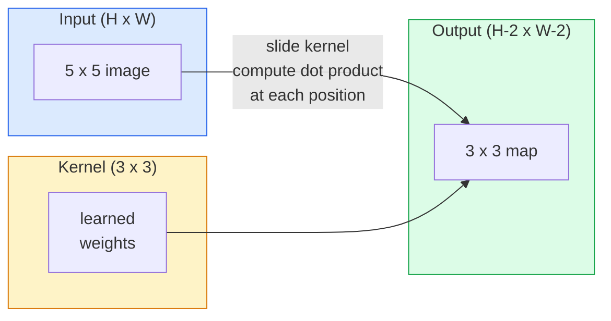
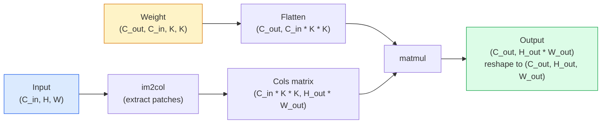

<!-- i18n:manual -->
# Свёртки с нуля

> Convolution — это крошечный полносвязный слой, который вы двигаете по изображению, переиспользуя одни и те же веса в каждой точке.

**Type:** Build
**Languages:** Python
**Prerequisites:** Phase 3 (Deep Learning Core), Phase 4 Lesson 01 (Image Fundamentals)
**Time:** ~75 minutes

## Learning Objectives

- Реализовать двумерную свёртку с нуля на одном NumPy: версию с вложенными циклами и векторизованную версию через `im2col`
- Считать выходной пространственный размер для любой комбинации входа, kernel, padding и stride и обосновывать формулу `(H - K + 2P) / S + 1`
- Собирать ядра руками (edge, blur, sharpen, Sobel) и объяснять, почему каждое даёт именно такую картину активаций
- Складывать свёртки в стек-экстрактор признаков и связывать глубину стека с размером receptive field

## The Problem

Полносвязному слою на изображении 224x224 RGB понадобилось бы 224 * 224 * 3 = 150 528 входных весов на нейрон. Один скрытый слой из 1000 нейронов — уже 150 миллионов параметров, и это до того, как выучено хоть что-то полезное. Хуже того, такой слой не знает, что собака в левом верхнем углу и собака в правом нижнем — один и тот же паттерн. Он считает каждую позицию пикселя независимой, а для изображений это ровно неверно: сдвиг кота на три пикселя не должен заставлять сеть переучивать понятие «кот».

Модели изображений нужны два свойства: **translation equivariance** (выход сдвигается, когда сдвигается вход) и **parameter sharing** (один и тот же детектор признака работает везде). Полносвязные слои не дают ни одного. Convolution даёт оба бесплатно.

Convolution придумали не для глубокого обучения. Это та же операция, что стоит за сжатием JPEG, гауссовым размытием в Photoshop, детекцией краёв в промышленном зрении и любым аудиофильтром на свете. CNN доминировали в ImageNet с 2012 по 2020 именно потому, что convolution — правильное априорное предположение для данных, где соседние значения связаны, а один и тот же паттерн может встретиться где угодно.

> 🎒 **На пальцах.** Сравните числа. Полносвязный слой: 150 528 весов на один нейрон. Conv-слой 3x3 на трёх каналах: 3 × 3 × 3 = 27 весов, и они одни и те же для всей картинки. Разница в 5000 раз — и именно поэтому свёртки победили.

## The Concept

### One kernel, sliding

Двумерная convolution берёт маленькую матрицу весов — kernel (или фильтр), — двигает её по входу и в каждой позиции считает сумму поэлементных произведений. Эта сумма становится одним выходным пикселем.



Конкретный пример 3x3 на входе 5x5 (без padding, stride 1):

```
Input X (5 x 5):                Kernel W (3 x 3):

  1  2  0  1  2                   1  0 -1
  0  1  3  1  0                   2  0 -2
  2  1  0  2  1                   1  0 -1
  1  0  2  1  3
  2  1  1  0  1

The kernel slides across every valid 3 x 3 window. Output Y is 3 x 3:

 Y[0,0] = sum( W * X[0:3, 0:3] )
 Y[0,1] = sum( W * X[0:3, 1:4] )
 Y[0,2] = sum( W * X[0:3, 2:5] )
 Y[1,0] = sum( W * X[1:4, 0:3] )
 ... and so on
```

Эта одна формула — **shared weights, locality, sliding window** — и есть вся идея. Всё остальное — бухгалтерия.

> 🎒 **На пальцах.** Kernel — это трафарет 3×3, который вы прикладываете к картинке и двигаете на один пиксель за раз. По входу 5x5 трафарет помещается в 3 позициях по горизонтали и 3 по вертикали — отсюда выход 3x3. Одни и те же 9 чисел трафарета работают во всех 9 позициях: это и есть parameter sharing.

### Output size formula

Дан пространственный размер входа `H`, размер kernel `K`, padding `P`, stride `S`:

```
H_out = floor( (H - K + 2P) / S ) + 1
```

Выучите это наизусть. Считать придётся десятки раз на архитектуру.

| Scenario | H | K | P | S | H_out |
|----------|---|---|---|---|-------|
| Valid conv, no padding | 32 | 3 | 0 | 1 | 30 |
| Same conv (preserves size) | 32 | 3 | 1 | 1 | 32 |
| Downsample by 2 | 32 | 3 | 1 | 2 | 16 |
| Pool 2x2 | 32 | 2 | 0 | 2 | 16 |
| Large receptive field | 32 | 7 | 3 | 2 | 16 |

«Same padding» означает подобрать P так, чтобы H_out == H при S == 1. Для нечётного K это P = (K - 1) / 2. Именно поэтому доминируют ядра 3x3 — это наименьшее нечётное ядро, у которого всё ещё есть центр.

> 🎒 **На пальцах.** Проверьте первую строку таблицы руками: (32 − 3 + 0) / 1 + 1 = 30. Два пикселя теряются — по одному с каждой стороны, потому что центр трафарета не может встать на самый край. Вторая строка: добавили padding 1, получили (32 − 3 + 2) / 1 + 1 = 32, размер сохранился. Третья: тот же padding, но шаг 2, и (32 − 3 + 2) / 2 + 1 = 16, картинка сжалась вдвое.

### Padding

Без padding каждая convolution уменьшает feature map. Сложите 20 таких, и картинка 224x224 станет 184x184 — вычисления тратятся на границу, а residual connections, которым нужны совпадающие формы, усложняются.

```
Zero padding (P = 1) on a 5 x 5 input:

  0  0  0  0  0  0  0
  0  1  2  0  1  2  0
  0  0  1  3  1  0  0
  0  2  1  0  2  1  0       Now the kernel can centre on pixel
  0  1  0  2  1  3  0       (0, 0) and still have three rows and
  0  2  1  1  0  1  0       three columns of values to multiply.
  0  0  0  0  0  0  0
```

Режимы, которые встречаются на практике: `zero` (самый частый), `reflect` (зеркалит край, избегает жёстких границ в генеративных моделях), `replicate` (копирует край), `circular` (заворачивает, для тороидальных задач).

> 🎒 **На пальцах.** Padding — это рамка из нулей вокруг картинки, как поля вокруг текста на листе. Вход 5x5 с padding 1 становится 7x7, и теперь трафарет 3×3 может встать по центру самого угла. За 20 слоёв без padding теряется 40 пикселей: 224 − 2 × 20 = 184. Это почти пятая часть картинки, выброшенная просто из-за арифметики.

### Stride

Stride — это шаг сдвига. `stride=1` — значение по умолчанию. `stride=2` уменьшает пространственные размеры вдвое и является классическим способом уменьшить разрешение внутри CNN без отдельного pooling-слоя — каждая современная архитектура (ResNet, ConvNeXt, MobileNet) где-нибудь использует strided-свёртки вместо max-pool.

```
Stride 1 on a 5 x 5 input, 3 x 3 kernel:

  starts: (0,0) (0,1) (0,2)        -> output row 0
          (1,0) (1,1) (1,2)        -> output row 1
          (2,0) (2,1) (2,2)        -> output row 2

  Output: 3 x 3

Stride 2 on the same input:

  starts: (0,0) (0,2)              -> output row 0
          (2,0) (2,2)              -> output row 1

  Output: 2 x 2
```

> 🎒 **На пальцах.** Stride 1 — трафарет шагает по одному пикселю и посещает 3 стартовые позиции в ряд. Stride 2 — шагает через одну и посещает только 2. Выход падает с 3x3 до 2x2, то есть с 9 чисел до 4. Каждое удвоение stride примерно вчетверо сокращает объём данных дальше по сети.

### Multiple input channels

У настоящих изображений три канала. Свёртка 3x3 на RGB-входе на самом деле объём 3x3x3: по одному срезу 3x3 на каждый входной канал. В каждой пространственной позиции вы перемножаете и суммируете по всем трём срезам и добавляете bias.

```
Input:   (C_in,  H,  W)        3 x 5 x 5
Kernel:  (C_in,  K,  K)        3 x 3 x 3 (one kernel)
Output:  (1,     H', W')       2D map

For a layer that produces C_out output channels, you stack C_out kernels:

Weight:  (C_out, C_in, K, K)   e.g. 64 x 3 x 3 x 3
Output:  (C_out, H', W')       64 x 3 x 3

Parameter count: C_out * C_in * K * K + C_out   (the + C_out is biases)
```

Последняя строка — то, что вы будете считать при планировании модели. Свёртка 3x3 на 64 канала с трёхканального входа имеет `64 * 3 * 3 * 3 + 64 = 1,792` параметра. Дёшево.

> 🎒 **На пальцах.** Kernel для цветной картинки — не квадрат, а кубик: 3 в высоту, 3 в ширину, 3 в глубину по каналам. Один такой кубик даёт одну плоскую карту на выходе. Хотите 64 карты — берите 64 кубика. 64 × 27 = 1728 весов плюс 64 смещения = 1792 параметра, меньше, чем в одном крошечном полносвязном слое.

### The im2col trick

Вложенные циклы легко читать, но они медленные. Видеокартам нужны большие матричные умножения. Приём такой: развернуть каждое окно receptive field входа в один столбец большой матрицы, развернуть kernel в строку — и вся convolution превращается в один matmul.



Любая продакшн-реализация свёртки — вариация этого приёма плюс трюки с кешем (прямая свёртка, Winograd, FFT-свёртка для больших ядер). Поймёте im2col — поймёте суть.

> 🎒 **На пальцах.** Представьте, что вы выписали содержимое каждого положения трафарета в отдельный столбик тетради. Для C_in=3 и K=3 в столбике 3 × 3 × 3 = 27 чисел. Если выход 16x16, столбиков будет 256, и матрица получается 27 × 256. Дальше одно умножение матриц вместо четырёх вложенных циклов — а умножать матрицы видеокарта умеет как никто.

### Receptive field

Одна свёртка 3x3 смотрит на 9 входных пикселей. Сложите две свёртки 3x3, и нейрон второго слоя смотрит уже на 5x5 входных пикселей. Три свёртки 3x3 дают 7x7. В общем виде:

```
RF after L stacked K x K convs (stride 1) = 1 + L * (K - 1)

With strides:   RF grows multiplicatively with stride along each layer.
```

Вся причина, почему работает подход «3x3 сверху донизу» (VGG, ResNet, ConvNeXt), в том, что две свёртки 3x3 видят ту же область входа, что одна 5x5, но с меньшим числом параметров и с дополнительной нелинейностью посередине.

> 🎒 **На пальцах.** Подставьте в формулу: L=1 даёт 1 + 1 × 2 = 3, L=2 даёт 1 + 2 × 2 = 5, L=3 даёт 7. И сравните цену: одна свёртка 5x5 на C каналов стоит 25C² весов, две 3x3 — 18C². Область обзора та же, весов на 28% меньше, плюс лишний ReLU между ними.

```figure
convolution-kernel
```

## Build It

### Step 1: Pad an array

Начнём с самого мелкого кирпичика: функции, добавляющей нули вокруг массива H x W.

```python
import numpy as np

def pad2d(x, p):
    if p == 0:
        return x
    h, w = x.shape[-2:]
    out = np.zeros(x.shape[:-2] + (h + 2 * p, w + 2 * p), dtype=x.dtype)
    out[..., p:p + h, p:p + w] = x
    return out

x = np.arange(9).reshape(3, 3)
print(x)
print()
print(pad2d(x, 1))
```

Приём с хвостовыми осями `x.shape[:-2]` означает, что та же функция без изменений работает на `(H, W)`, `(C, H, W)` и `(N, C, H, W)`.

> 🎒 **На пальцах.** Массив 3x3 с p=1 превращается в 5x5: к трём строкам добавились две (сверху и снизу), к трём столбцам — тоже две. Формула та же для любого p: было h, стало h + 2p. Строка `out[..., p:p+h, p:p+w] = x` просто кладёт исходную картинку в середину нулевой рамки.

### Step 2: 2D convolution with nested loops

Эталонная реализация — медленная, но однозначная. Именно это в принципе делает `torch.nn.functional.conv2d`.

```python
def conv2d_naive(x, w, b=None, stride=1, padding=0):
    c_in, h, w_in = x.shape
    c_out, c_in_w, kh, kw = w.shape
    assert c_in == c_in_w

    x_pad = pad2d(x, padding)
    h_out = (h + 2 * padding - kh) // stride + 1
    w_out = (w_in + 2 * padding - kw) // stride + 1

    out = np.zeros((c_out, h_out, w_out), dtype=np.float32)
    for oc in range(c_out):
        for i in range(h_out):
            for j in range(w_out):
                hs = i * stride
                ws = j * stride
                patch = x_pad[:, hs:hs + kh, ws:ws + kw]
                out[oc, i, j] = np.sum(patch * w[oc])
        if b is not None:
            out[oc] += b[oc]
    return out
```

Четыре вложенных цикла (выходной канал, строка, столбец, плюс неявная сумма по C_in, kh, kw). Это ground truth, с которым вы будете сверять каждую более быструю реализацию.

> 🎒 **На пальцах.** Посчитайте объём работы: для выхода 64 канала на карте 224x224 c ядром 3x3 и тремя входными каналами это 64 × 224 × 224 × 27 ≈ 87 миллионов умножений на одну картинку. Питоновские циклы делают такое минутами, видеокарта — за доли миллисекунды. Но логика внутри ровно эта.

### Step 3: Verify with a hand-designed kernel

Соберите вертикальное ядро Собеля, примените его к синтетической ступеньке и посмотрите, как загорается вертикальный край.

```python
def synthetic_step_image():
    img = np.zeros((1, 16, 16), dtype=np.float32)
    img[:, :, 8:] = 1.0
    return img

sobel_x = np.array([
    [[-1, 0, 1],
     [-2, 0, 2],
     [-1, 0, 1]]
], dtype=np.float32)[None]

x = synthetic_step_image()
y = conv2d_naive(x, sobel_x, padding=1)
print(y[0].round(1))
```

Ожидайте больших положительных значений в столбце 7 (яркость растёт слева направо) и нулей везде остальном. Один этот print — ваша проверка, что математика верна.

> 🎒 **На пальцах.** Картинка 16x16, левая половина чёрная (0), правая белая (1), граница проходит по столбцу 8. Sobel-x умножает левые соседи на −1, −2, −1, а правые на +1, +2, +1. Внутри однородной области сумма ровно 0, а на границе получается 4 — вот и весь детектор края.

### Step 4: im2col

Превратите каждое окно размера kernel во входе в столбец матрицы. Для `C_in=3, K=3` каждый столбец — 27 чисел.

```python
def im2col(x, kh, kw, stride=1, padding=0):
    c_in, h, w = x.shape
    x_pad = pad2d(x, padding)
    h_out = (h + 2 * padding - kh) // stride + 1
    w_out = (w + 2 * padding - kw) // stride + 1

    cols = np.zeros((c_in * kh * kw, h_out * w_out), dtype=x.dtype)
    col = 0
    for i in range(h_out):
        for j in range(w_out):
            hs = i * stride
            ws = j * stride
            patch = x_pad[:, hs:hs + kh, ws:ws + kw]
            cols[:, col] = patch.reshape(-1)
            col += 1
    return cols, h_out, w_out
```

Это всё ещё питоновский цикл, но теперь тяжёлая работа сведётся к одному векторизованному matmul.

> 🎒 **На пальцах.** Обратите внимание на цену памяти: соседние окна перекрываются, поэтому один и тот же пиксель попадает в матрицу до K × K = 9 раз. Картинка 16x16 с тремя каналами — это 768 чисел, а матрица cols будет 27 × 256 = 6912 чисел, почти в 9 раз больше. Скорость покупается памятью.

### Step 5: Fast conv via im2col + matmul

Замените четверной цикл одним умножением матриц.

```python
def conv2d_im2col(x, w, b=None, stride=1, padding=0):
    c_out, c_in, kh, kw = w.shape
    cols, h_out, w_out = im2col(x, kh, kw, stride, padding)
    w_flat = w.reshape(c_out, -1)
    out = w_flat @ cols
    if b is not None:
        out += b[:, None]
    return out.reshape(c_out, h_out, w_out)
```

Проверка корректности: запустите обе реализации и сравните.

```python
rng = np.random.default_rng(0)
x = rng.normal(0, 1, (3, 16, 16)).astype(np.float32)
w = rng.normal(0, 1, (8, 3, 3, 3)).astype(np.float32)
b = rng.normal(0, 1, (8,)).astype(np.float32)

y_naive = conv2d_naive(x, w, b, padding=1)
y_im2col = conv2d_im2col(x, w, b, padding=1)

print(f"max abs diff: {np.max(np.abs(y_naive - y_im2col)):.2e}")
```

`max abs diff` должен быть порядка `1e-5` — разница в порядке накопления чисел с плавающей точкой, а не баг.

> 🎒 **На пальцах.** Формы стыкуются так: `w_flat` это (8, 27), `cols` это (27, 256), их произведение — (8, 256), и после reshape получается (8, 16, 16). Внутренние 27 совпали, значит матрицы соединяются. Ровно то же правило, что и в любом полносвязном слое.

### Step 6: A bank of hand-designed kernels

Пять фильтров, показывающих, что умеет один conv-слой ещё до всякого обучения.

```python
KERNELS = {
    "identity": np.array([[0, 0, 0], [0, 1, 0], [0, 0, 0]], dtype=np.float32),
    "blur_3x3": np.ones((3, 3), dtype=np.float32) / 9.0,
    "sharpen": np.array([[0, -1, 0], [-1, 5, -1], [0, -1, 0]], dtype=np.float32),
    "sobel_x": np.array([[-1, 0, 1], [-2, 0, 2], [-1, 0, 1]], dtype=np.float32),
    "sobel_y": np.array([[-1, -2, -1], [0, 0, 0], [1, 2, 1]], dtype=np.float32),
}

def apply_kernel(img2d, kernel):
    x = img2d[None].astype(np.float32)
    w = kernel[None, None]
    return conv2d_im2col(x, w, padding=1)[0]
```

На любом grayscale-изображении blur смягчает, sharpen подчёркивает края, Sobel-x зажигает вертикальные края, Sobel-y — горизонтальные. Это ровно те паттерны, которые *первый* обученный conv-слой в AlexNet и VGG в итоге и выучил — потому что хорошей модели изображений нужны детекторы краёв и пятен, какая бы задача ни шла дальше.

> 🎒 **На пальцах.** Проверьте суммы весов. У `identity` сумма 1 и единственная единица в центре — картинка не меняется. У `blur_3x3` девять раз по 1/9, сумма тоже 1 — средняя яркость сохраняется, но детали размазываются. У `sobel_x` сумма ровно 0 — на однородном участке выход нулевой, ядро реагирует только на перепад.

## Use It

`nn.Conv2d` в PyTorch оборачивает ту же операцию в autograd, CUDA-ядра и оптимизации cuDNN. Семантика форм идентична.

```python
import torch
import torch.nn as nn

conv = nn.Conv2d(in_channels=3, out_channels=64, kernel_size=3, stride=1, padding=1)
print(conv)
print(f"weight shape: {tuple(conv.weight.shape)}   # (C_out, C_in, K, K)")
print(f"bias shape:   {tuple(conv.bias.shape)}")
print(f"param count:  {sum(p.numel() for p in conv.parameters())}")

x = torch.randn(8, 3, 224, 224)
y = conv(x)
print(f"\ninput  shape: {tuple(x.shape)}")
print(f"output shape: {tuple(y.shape)}")
```

Замените `padding=1` на `padding=0`, и выход упадёт до 222x222. Замените `stride=1` на `stride=2`, и он упадёт до 112x112. Та же формула, которую вы выучили выше.

> 🎒 **На пальцах.** Сверьте с формулой: (224 − 3 + 2×1)/1 + 1 = 224, (224 − 3 + 0)/1 + 1 = 222, (224 − 3 + 2)/2 + 1 = 112. А `param count` печатает 1792 — те самые 64 × 3 × 3 × 3 + 64, что вы считали руками в разделе про каналы.

## Ship It

Этот урок производит:

- `outputs/prompt-cnn-architect.md` — промпт, который по размеру входа, бюджету параметров и целевому receptive field проектирует стек слоёв `Conv2d` с правильными K/S/P на каждом шаге.
- `outputs/skill-conv-shape-calculator.md` — навык, который проходит спецификацию сети слой за слоем и возвращает выходную форму, receptive field и число параметров для каждого блока.

## Exercises

1. **(Easy)** Дан grayscale-вход 128x128 и стек `[Conv3x3(s=1,p=1), Conv3x3(s=2,p=1), Conv3x3(s=1,p=1), Conv3x3(s=2,p=1)]`. Посчитайте руками выходной пространственный размер и receptive field на каждом слое. Проверьте через `nn.Sequential` из фиктивных свёрток в PyTorch.
2. **(Medium)** Расширьте `conv2d_naive` и `conv2d_im2col`, добавив аргумент `groups`. Покажите, что `groups=C_in=C_out` воспроизводит depthwise-свёртку и что число её параметров равно `C * K * K` вместо `C * C * K * K`.
3. **(Hard)** Реализуйте обратный проход `conv2d_im2col` руками: по градиенту выхода посчитайте градиенты `x` и `w`. Сверьтесь с `torch.autograd.grad` на тех же входах и весах. Хитрость: градиент im2col — это `col2im`, и он обязан накапливать перекрывающиеся окна.

> 🎒 **На пальцах.** Подсказка к первому заданию: размеры идут 128 → 128 → 64 → 64 → 32, потому что уменьшают только слои со stride 2. А receptive field растёт иначе: 3 → 5 → 9 → 13, потому что после каждого stride 2 один шаг ядра стоит уже два пикселя оригинала. Считайте два столбика отдельно, и не запутаетесь.

## Key Terms

| Term | What people say | What it actually means |
|------|----------------|----------------------|
| Convolution | «Двигаем фильтр» | Обучаемое скалярное произведение, применяемое в каждой пространственной позиции с общими весами; математически это кросс-корреляция, но все зовут её свёрткой |
| Kernel / filter | «Детектор признака» | Маленький тензор весов формы (C_in, K, K), скалярное произведение которого с окном входа даёт один выходной пиксель |
| Stride | «Насколько прыгаем» | Шаг между соседними положениями kernel; stride 2 уменьшает каждое пространственное измерение вдвое |
| Padding | «Нули по краям» | Дополнительные значения вокруг входа, чтобы kernel мог встать по центру граничных пикселей; `same` padding сохраняет размер выхода равным размеру входа |
| Receptive field | «Сколько нейрон видит» | Участок исходного входа, от которого зависит конкретная выходная активация; растёт с глубиной и stride |
| im2col | «Трюк с GEMM» | Перекладывание каждого окна в столбцы, чтобы свёртка стала одним большим умножением матриц — основа любого быстрого conv-ядра |
| Depthwise conv | «Одно ядро на канал» | Свёртка с `groups == C_in`, считающая каждый выходной канал только из своего входного канала; фундамент MobileNet и ConvNeXt |
| Translation equivariance | «Сдвинул вход — сдвинулся выход» | Свойство, при котором сдвиг входа на k пикселей сдвигает выход на k пикселей; получается бесплатно из общих весов |

## Further Reading

- [A guide to convolution arithmetic for deep learning (Dumoulin & Visin, 2016)](https://arxiv.org/abs/1603.07285) — эталонные схемы padding/stride/dilation, которые тихо копирует каждый курс
- [CS231n: Convolutional Neural Networks for Visual Recognition](https://cs231n.github.io/convolutional-networks/) — канонический конспект лекций, включая исходное объяснение im2col
- [The Annotated ConvNet (fast.ai)](https://nbviewer.org/github/fastai/fastbook/blob/master/13_convolutions.ipynb) — ноутбук, ведущий от ручной свёртки до обученного классификатора цифр
- [Receptive Field Arithmetic for CNNs (Dang Ha The Hien)](https://distill.pub/2019/computing-receptive-fields/) — интерактивное объяснение расчёта receptive field на уровне статьи
