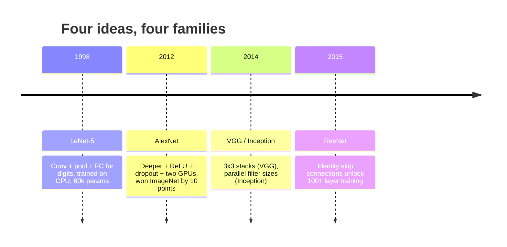
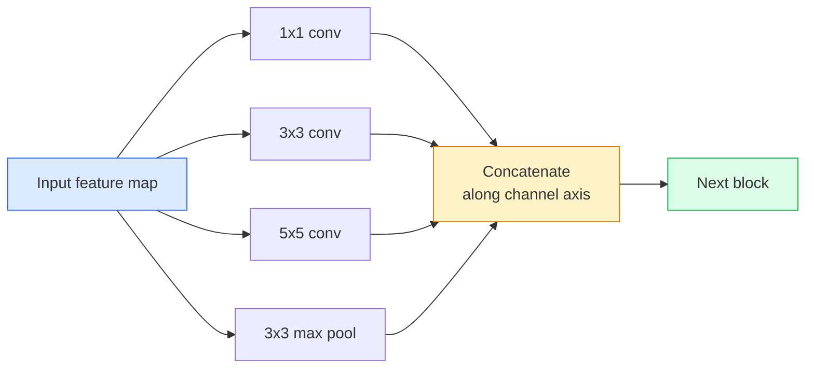
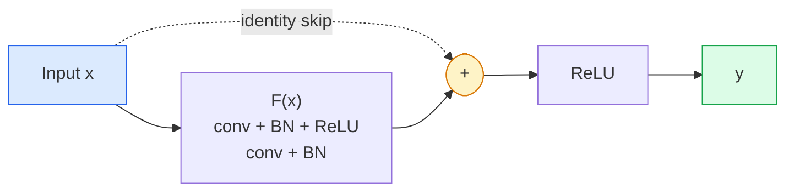

<!-- i18n:manual -->
# CNN — от LeNet до ResNet

> Каждая значимая CNN за последние тридцать лет — это один и тот же рецепт «свёртка — нелинейность — уменьшение размера» с одной новой идеей сверху. Учите идеи по порядку.

**Type:** Learn + Build
**Languages:** Python
**Prerequisites:** Phase 3 Lesson 11 (PyTorch), Phase 4 Lesson 01 (Image Fundamentals), Phase 4 Lesson 02 (Convolutions from Scratch)
**Time:** ~75 minutes

## Learning Objectives

- Проследить архитектурную линию LeNet-5 -> AlexNet -> VGG -> Inception -> ResNet и назвать одну новую идею каждого семейства
- Реализовать LeNet-5, блок в стиле VGG и BasicBlock из ResNet на PyTorch, каждый меньше чем в 40 строк
- Объяснить, почему residual connections превращают тысячеслойную сеть из необучаемой в state-of-the-art
- Прочитать современный backbone (ResNet-18, ResNet-50) и предсказать его выходную форму, receptive field и число параметров до того, как заглянете в исходники

## The Problem

В 2011 году лучший классификатор ImageNet давал около 74% top-5 точности. В 2012 AlexNet выдал 85%. В 2015 ResNet выдал 96%. Новых данных не было. Нового поколения видеокарт не было. Прирост дали архитектурные идеи. Работающему инженеру зрения нужно знать, какая идея из какой статьи, потому что любой продакшн-backbone, который вы выкатите в 2026 году, — перекомбинация тех же кусков, и потому что идеи продолжают переезжать: grouped convs ушли из CNN в трансформеры, residual connections ушли из ResNet в каждую существующую LLM, batch normalisation живёт в диффузионных моделях.

Изучение этих сетей по порядку заодно прививает вас от частой ошибки: хвататься за самую большую доступную модель там, где задачу решит сеть размером с LeNet. MNIST не нужен ResNet. Знание кривой масштабирования каждого семейства подсказывает, где на ней сесть.

> 🎒 **На пальцах.** 74% → 85% → 96% за четыре года на одних и тех же данных. Каждый скачок — одна идея: ReLU, стек из 3x3, параллельные ветки, skip connection. В этом уроке вы соберёте их руками, каждую примерно в 30 строк кода.

## The Concept

### The four ideas that changed vision



Ничто другое в классическом зрении не имело такого значения, как эти четыре скачка.

> 🎒 **На пальцах.** Разброс масштабов огромен: LeNet — 60 тысяч параметров и обучение на процессоре, AlexNet — 60 миллионов и две видеокарты. Это в тысячу раз больше за 14 лет. Но структура «свёртка, нелинейность, уменьшить размер, повторить» не изменилась ни разу.

### LeNet-5 (1998)

Распознаватель цифр Яна Лекуна. 60 000 параметров. Два блока conv-pool, два полносвязных слоя, активации tanh. Он задал шаблон, который наследует каждая CNN:

```
input (1, 32, 32)
  conv 5x5 -> (6, 28, 28)
  avg pool 2x2 -> (6, 14, 14)
  conv 5x5 -> (16, 10, 10)
  avg pool 2x2 -> (16, 5, 5)
  flatten -> 400
  dense -> 120
  dense -> 84
  dense -> 10
```

Всё, что современный мир зовёт CNN — чередование свёрток и уменьшения размера, питающее небольшую голову-классификатор, — это LeNet с бо́льшим числом слоёв, бо́льшим числом каналов и лучшими активациями.

> 🎒 **На пальцах.** Пройдите размеры по шагам. 32 минус 5 плюс 1 = 28, отсюда (6, 28, 28). Pooling 2x2 делит пополам: (6, 14, 14). Снова 14 − 5 + 1 = 10 и pooling даёт (16, 5, 5). Flatten превращает это в 16 × 5 × 5 = 400 чисел, и дальше идёт обычная сеть 400 → 120 → 84 → 10.

### AlexNet (2012)

Три изменения, которые вместе сломали ImageNet:

1. **ReLU** вместо tanh. Градиенты перестают затухать. Обучение ускоряется в шесть раз.
2. **Dropout** в полносвязной голове. Регуляризация становится слоем, а не хитростью.
3. **Depth and width**. Пять conv-слоёв, три полносвязных, 60 миллионов параметров, обучение на двух видеокартах с моделью, разрезанной между ними.

Рисунок 2 из статьи до сих пор показывает разделение по GPU как два параллельных потока. Этот параллелизм был обходом ограничений железа, а не архитектурным озарением, — но три идеи выше есть в каждой модели, которой вы пользуетесь.

> 🎒 **На пальцах.** ReLU — это правило «отрицательное заменить нулём». У tanh производная на краях почти нулевая, и градиент, пройдя пять слоёв, гаснет. У ReLU производная ровно 1 для всех положительных значений: сколько слоёв ни складывай, сигнал доходит. Одна строчка кода — шестикратное ускорение обучения.

### VGG (2014)

VGG задал вопрос: что будет, если использовать только свёртки 3x3 и уйти в глубину?

```
stack:   conv 3x3 -> conv 3x3 -> pool 2x2
repeat:  16 or 19 conv layers
```

Две свёртки 3x3 видят ту же область входа 5x5, что и одна 5x5, но с меньшим числом параметров (2*9*C^2 = 18C^2 против 25*C^2) и с дополнительным ReLU посередине. VGG превратил это наблюдение в целую архитектуру. Простота — один тип блока, повторённый много раз — сделала её точкой отсчёта для всего, что появилось потом.

Цена: 138 миллионов параметров, медленное обучение, дорогой inference.

> 🎒 **На пальцах.** Считаем экономию для C = 64 каналов. Одна свёртка 5x5: 25 × 64² = 102 400 весов. Две 3x3: 18 × 64² = 73 728 весов. На 28% дешевле, обзор тот же, плюс лишняя нелинейность. Умножьте это на 16 слоёв — и получите архитектуру.

### Inception (2014, same year)

Ответ Google на вопрос «какой размер ядра выбрать?» был такой: все сразу, параллельно.



Каждая ветка специализируется — 1x1 на смешивании каналов, 3x3 на локальной текстуре, 5x5 на более крупных паттернах, pooling на признаках, устойчивых к сдвигу, — а конкатенация позволяет следующему слою взять ту ветку, которая полезна. Inception v1 использовал свёртки 1x1 внутри каждой ветки как бутылочное горлышко, чтобы держать число параметров в разумных рамках.

> 🎒 **На пальцах.** Вместо того чтобы гадать, какой трафарет нужен, блок прикладывает все четыре сразу и склеивает результаты по оси каналов. Если каждая ветка даёт 32 канала, на выходе получается 32 × 4 = 128 каналов, и следующий слой сам решает, какие из них важны. Выбор гиперпараметра переложили на обучение.

### The degradation problem

К 2015 году VGG-19 работал, а VGG-32 — нет. Глубина должна была помогать, но после примерно 20 слоёв и обучающая, и тестовая ошибка росли. Это не переобучение. Это оптимизатор, который не может найти полезные веса, потому что градиенты умножаются и сжимаются на каждом слое.

```
Plain deep network:
  y = f_L( f_{L-1}( ... f_1(x) ... ) )

Gradient wrt early layer:
  dL/dW_1 = dL/dy * df_L/df_{L-1} * ... * df_2/df_1 * df_1/dW_1

Each multiplicative term has magnitude roughly (weight magnitude) * (activation gain).
Stack 100 of them with gains < 1 and the gradient is effectively zero.
```

VGG дошёл до 19 слоёв вообще без batch norm — авторы сначала обучали неглубокую конфигурацию на 11 слоёв, а её весами инициализировали более глубокие, по одной стадии за раз. Batch norm появился уже после VGG и снял необходимость в этой поэтапной раскачке, держа активации в разумном масштабе. Но даже batch norm не спасал глубину дальше примерно 30 слоёв.

> 🎒 **На пальцах.** Возьмите множитель 0.9 на слой. Через 10 слоёв градиент падает до 0.35, через 50 — до 0.005, через 100 — до 0.00003. Умножение маленьких чисел убивает сигнал экспоненциально быстро. Ранние слои просто перестают получать информацию о том, что надо менять.

### ResNet (2015)

He, Zhang, Ren, Sun предложили одно изменение, которое починило всё:

```
standard block:   y = F(x)
residual block:   y = F(x) + x
```

`+ x` означает, что слой всегда может выбрать ничего не делать, обнулив `F(x)`. Тысячеслойный ResNet теперь в худшем случае не хуже однослойной сети, потому что у каждого лишнего блока есть тривиальный аварийный выход. С такой гарантией оптимизатор готов сделать каждый блок *чуть-чуть* полезным — а «чуть-чуть полезный», повторённый 100 раз, и есть state-of-the-art.



Два варианта блока встречаются повсюду:

- **BasicBlock** (ResNet-18, ResNet-34): две свёртки 3x3, skip вокруг обеих.
- **Bottleneck** (ResNet-50, -101, -152): 1x1 вниз, 3x3 в середине, 1x1 вверх, skip вокруг всей тройки. Дешевле, когда каналов много.

Когда skip должен пересечь уменьшение размера (stride=2), путь identity заменяется свёрткой 1x1 со stride=2, чтобы формы совпали.

> 🎒 **На пальцах.** Skip connection — это объездная дорога вокруг блока. Градиенту больше не нужно протискиваться через все 100 слоёв: у него есть прямой путь назад, где производная равна 1 и ничего не затухает. Блоку при этом достаточно выучить не весь ответ, а поправку к тому, что уже пришло.

### Why residuals matter beyond vision

Идея была вообще не про классификацию изображений. Она была про то, чтобы превратить глубокие сети из «скрестим пальцы и понадеемся, что градиенты выживут» в надёжный масштабируемый инженерный инструмент. У каждого трансформера, о котором вы прочитаете в следующей фазе, ровно такой же skip connection в каждом блоке. Без ResNet не было бы GPT.

> 🎒 **На пальцах.** Один и тот же приём `y = F(x) + x` стоит в ResNet 2015 года и в любой языковой модели 2026 года. Если запомнить из этого урока одну формулу — берите эту.

```figure
pooling
```

## Build It

### Step 1: LeNet-5

Минимальный, но верный оригиналу LeNet. Активации tanh, average pooling. Единственная уступка современности — дальше мы используем `nn.CrossEntropyLoss` вместо исходных гауссовых связей.

```python
import torch
import torch.nn as nn
import torch.nn.functional as F

class LeNet5(nn.Module):
    def __init__(self, num_classes=10):
        super().__init__()
        self.conv1 = nn.Conv2d(1, 6, kernel_size=5)
        self.conv2 = nn.Conv2d(6, 16, kernel_size=5)
        self.pool = nn.AvgPool2d(2)
        self.fc1 = nn.Linear(16 * 5 * 5, 120)
        self.fc2 = nn.Linear(120, 84)
        self.fc3 = nn.Linear(84, num_classes)

    def forward(self, x):
        x = self.pool(torch.tanh(self.conv1(x)))
        x = self.pool(torch.tanh(self.conv2(x)))
        x = torch.flatten(x, 1)
        x = torch.tanh(self.fc1(x))
        x = torch.tanh(self.fc2(x))
        return self.fc3(x)

net = LeNet5()
x = torch.randn(1, 1, 32, 32)
print(f"output: {net(x).shape}")
print(f"params: {sum(p.numel() for p in net.parameters()):,}")
```

Ожидаемый вывод: `output: torch.Size([1, 10])`, `params: 61,706`. Это весь классификатор цифр, с которого началось современное зрение.

> 🎒 **На пальцах.** Где лежат эти 61 706 параметров: свёртки дают всего 150 + 2416 = 2566, а один слой `fc1` на 400 → 120 — уже 400 × 120 + 120 = 48 120, то есть почти 80% всей сети. Полносвязные слои дорогие, свёртки дешёвые. Вся история дальнейших архитектур — про то, как выкинуть эти полносвязные слои.

### Step 2: A VGG block

Один переиспользуемый блок: две свёртки 3x3, ReLU, batch norm, max pool.

```python
class VGGBlock(nn.Module):
    def __init__(self, in_c, out_c):
        super().__init__()
        self.conv1 = nn.Conv2d(in_c, out_c, kernel_size=3, padding=1)
        self.bn1 = nn.BatchNorm2d(out_c)
        self.conv2 = nn.Conv2d(out_c, out_c, kernel_size=3, padding=1)
        self.bn2 = nn.BatchNorm2d(out_c)
        self.pool = nn.MaxPool2d(2)

    def forward(self, x):
        x = F.relu(self.bn1(self.conv1(x)))
        x = F.relu(self.bn2(self.conv2(x)))
        return self.pool(x)

class MiniVGG(nn.Module):
    def __init__(self, num_classes=10):
        super().__init__()
        self.stack = nn.Sequential(
            VGGBlock(3, 32),
            VGGBlock(32, 64),
            VGGBlock(64, 128),
        )
        self.head = nn.Sequential(
            nn.AdaptiveAvgPool2d(1),
            nn.Flatten(),
            nn.Linear(128, num_classes),
        )

    def forward(self, x):
        return self.head(self.stack(x))

net = MiniVGG()
x = torch.randn(1, 3, 32, 32)
print(f"output: {net(x).shape}")
print(f"params: {sum(p.numel() for p in net.parameters()):,}")
```

Три VGG-блока на входе размера CIFAR, adaptive pool, один линейный слой. Около 290 тысяч параметров. Для CIFAR-10 более чем достаточно.

> 🎒 **На пальцах.** Проследите размеры: вход (3, 32, 32), после первого блока (32, 16, 16), после второго (64, 8, 8), после третьего (128, 4, 4). Каждый блок вдвое уменьшает картинку и вдвое увеличивает число каналов — классический размен «пространство на глубину». `AdaptiveAvgPool2d(1)` схлопывает 4x4 в одно число на канал, и голова получает всего 128 чисел вместо 128 × 4 × 4 = 2048.

### Step 3: A ResNet BasicBlock

Основной строительный блок ResNet-18 и ResNet-34.

```python
class BasicBlock(nn.Module):
    def __init__(self, in_c, out_c, stride=1):
        super().__init__()
        self.conv1 = nn.Conv2d(in_c, out_c, kernel_size=3, stride=stride, padding=1, bias=False)
        self.bn1 = nn.BatchNorm2d(out_c)
        self.conv2 = nn.Conv2d(out_c, out_c, kernel_size=3, stride=1, padding=1, bias=False)
        self.bn2 = nn.BatchNorm2d(out_c)
        if stride != 1 or in_c != out_c:
            self.shortcut = nn.Sequential(
                nn.Conv2d(in_c, out_c, kernel_size=1, stride=stride, bias=False),
                nn.BatchNorm2d(out_c),
            )
        else:
            self.shortcut = nn.Identity()

    def forward(self, x):
        out = F.relu(self.bn1(self.conv1(x)))
        out = self.bn2(self.conv2(out))
        out = out + self.shortcut(x)
        return F.relu(out)
```

`bias=False` на conv-слоях — это соглашение при использовании batch norm: параметр beta у BN и так играет роль смещения, поэтому тащить ещё и bias у свёртки бессмысленно. `shortcut` нуждается в настоящей свёртке, только когда меняется stride или число каналов; иначе это просто identity.

> 🎒 **На пальцах.** Ключевая строка — `out = out + self.shortcut(x)`. Сложение требует совпадения форм: если `conv1` шёл со stride 2 и удвоил каналы, вход (32, 32, 32) станет (64, 16, 16), а `x` останется (32, 32, 32). Складывать нечего — поэтому в shortcut и появляется свёртка 1x1 со stride 2, которая приводит форму к нужной.

### Step 4: A tiny ResNet

Сложите четыре группы BasicBlock и получите рабочий ResNet для входов размера CIFAR.

```python
class TinyResNet(nn.Module):
    def __init__(self, num_classes=10):
        super().__init__()
        self.stem = nn.Sequential(
            nn.Conv2d(3, 32, kernel_size=3, stride=1, padding=1, bias=False),
            nn.BatchNorm2d(32),
            nn.ReLU(inplace=True),
        )
        self.layer1 = self._make_group(32, 32, num_blocks=2, stride=1)
        self.layer2 = self._make_group(32, 64, num_blocks=2, stride=2)
        self.layer3 = self._make_group(64, 128, num_blocks=2, stride=2)
        self.layer4 = self._make_group(128, 256, num_blocks=2, stride=2)
        self.head = nn.Sequential(
            nn.AdaptiveAvgPool2d(1),
            nn.Flatten(),
            nn.Linear(256, num_classes),
        )

    def _make_group(self, in_c, out_c, num_blocks, stride):
        blocks = [BasicBlock(in_c, out_c, stride=stride)]
        for _ in range(num_blocks - 1):
            blocks.append(BasicBlock(out_c, out_c, stride=1))
        return nn.Sequential(*blocks)

    def forward(self, x):
        x = self.stem(x)
        x = self.layer1(x)
        x = self.layer2(x)
        x = self.layer3(x)
        x = self.layer4(x)
        return self.head(x)

net = TinyResNet()
x = torch.randn(1, 3, 32, 32)
print(f"output: {net(x).shape}")
print(f"params: {sum(p.numel() for p in net.parameters()):,}")
```

Четыре группы по два блока. Stride 2 в начале групп 2, 3 и 4. Число каналов удваивается при каждом уменьшении размера. Примерно 2,8 миллиона параметров. Это стандартный рецепт, который чисто масштабируется вплоть до ResNet-152.

> 🎒 **На пальцах.** Проследите путь картинки: (3, 32, 32) → stem → (32, 32, 32) → layer1 → (32, 32, 32) → layer2 → (64, 16, 16) → layer3 → (128, 8, 8) → layer4 → (256, 4, 4) → голова → 10 чисел. Пространство уменьшилось в 8 раз по каждой стороне, каналов стало в 8 раз больше. Ровно тот же баланс, что и в VGG, только с объездными дорогами.

### Step 5: Compare parameter-to-feature efficiency

Прогоните один и тот же вход через все три сети и сравните число параметров.

```python
def summary(name, net, x):
    y = net(x)
    params = sum(p.numel() for p in net.parameters())
    print(f"{name:12s}  input {tuple(x.shape)} -> output {tuple(y.shape)}  params {params:>10,}")

x = torch.randn(1, 3, 32, 32)
summary("LeNet5",     LeNet5(),       torch.randn(1, 1, 32, 32))
summary("MiniVGG",    MiniVGG(),      x)
summary("TinyResNet", TinyResNet(),   x)
```

Три модели, три эпохи, три порядка величины по числу параметров. По точности на CIFAR-10 ожидайте примерно: LeNet 60%, MiniVGG 89%, TinyResNet 93% после нескольких эпох обучения.

> 🎒 **На пальцах.** Посчитайте отдачу: LeNet — 62 тысячи параметров и 60% точности, TinyResNet — 2,8 миллиона и 93%. В 45 раз больше параметров ради +33 пункта. Но MiniVGG с 290 тысячами даёт уже 89% — то есть последние 4 пункта стоят почти в 10 раз дороже первых. Так выглядит любая кривая масштабирования.

## Use It

`torchvision.models` даёт предобученные версии всего перечисленного. Сигнатура вызова одинакова для всех семейств — в этом и смысл абстракции backbone.

```python
from torchvision.models import resnet18, ResNet18_Weights, vgg16, VGG16_Weights

r18 = resnet18(weights=ResNet18_Weights.IMAGENET1K_V1)
r18.eval()

print(f"ResNet-18 params: {sum(p.numel() for p in r18.parameters()):,}")
print(r18.layer1[0])
print()

v16 = vgg16(weights=VGG16_Weights.IMAGENET1K_V1)
v16.eval()
print(f"VGG-16   params: {sum(p.numel() for p in v16.parameters()):,}")
```

У ResNet-18 11,7 миллиона параметров. У VGG-16 — 138 миллионов. Точность top-1 на ImageNet похожая (69,8% против 71,6%). Residual connections дают выигрыш в эффективности параметров в 12 раз. Именно поэтому варианты ResNet доминировали с 2016 года до появления ViT в 2021 — и продолжают доминировать в реальных внедрениях, где вычисления в дефиците.

Для transfer learning рецепт всегда один: загрузить предобученную модель, заморозить backbone, заменить голову-классификатор.

```python
for p in r18.parameters():
    p.requires_grad = False
r18.fc = nn.Linear(r18.fc.in_features, 10)
```

Три строки. У вас есть классификатор CIFAR на 10 классов, унаследовавший представления, за которые заплатил ImageNet.

> 🎒 **На пальцах.** `requires_grad = False` означает «эти веса не трогать при обучении». Из 11,7 миллиона параметров ResNet-18 обучаемыми остаются только новые: 512 × 10 + 10 = 5130 штук. Это 0,04% модели — поэтому дообучение головы работает на ноутбуке и на паре сотен картинок.

## Ship It

Этот урок производит:

- `outputs/prompt-backbone-selector.md` — промпт, который выбирает подходящее семейство CNN (LeNet/VGG/ResNet/MobileNet/ConvNeXt) по задаче, размеру датасета и бюджету вычислений.
- `outputs/skill-residual-block-reviewer.md` — навык, который читает модуль PyTorch и отмечает ошибки в skip connection (отсутствующий shortcut при смене stride, порядок активации в shortcut, положение BN относительно сложения).

## Exercises

1. **(Easy)** Посчитайте параметры `TinyResNet` руками, слой за слоем. Сравните с `sum(p.numel() for p in net.parameters())`. Куда уходит основная часть бюджета параметров — в свёртки, в BN или в голову-классификатор?
2. **(Medium)** Реализуйте блок Bottleneck (1x1 -> 3x3 -> 1x1 со skip) и соберите на нём сеть в стиле ResNet-50 для CIFAR. Сравните число параметров с `TinyResNet`.
3. **(Hard)** Уберите skip connection из `BasicBlock`, обучите «плоскую» сеть из 34 блоков и ResNet из 34 блоков на CIFAR-10 по 10 эпох каждую. Постройте график обучающей ошибки по эпохам для обеих. Воспроизведите результат с Рисунка 1 у He et al., где плоская глубокая сеть сходится к большей ошибке, чем её более мелкий близнец.

> 🎒 **На пальцах.** Подсказка к первому заданию: свёртка стоит `C_out * C_in * K * K` весов, а BatchNorm — всего `2 * C_out`. Для последней группы это 256 × 128 × 3 × 3 = 294 912 против 512 у BN. Голова же — 256 × 10 + 10 = 2570. Почти весь бюджет лежит в последних свёрточных группах, потому что там больше всего каналов.

## Key Terms

| Term | What people say | What it actually means |
|------|----------------|----------------------|
| Backbone | «Модель» | Стек свёрточных блоков, который производит feature map, подаваемый в голову задачи |
| Residual connection | «Skip connection» | `y = F(x) + x`; позволяет оптимизатору выучить тождественное отображение, обнулив F, что делает обучаемой любую глубину |
| BasicBlock | «Две свёртки 3x3 со skip» | Строительный блок ResNet-18/34: conv-BN-ReLU-conv-BN-add-ReLU |
| Bottleneck | «1x1 вниз, 3x3, 1x1 вверх» | Блок ResNet-50/101/152; дёшев при большом числе каналов, потому что 3x3 работает на суженной ширине |
| Degradation problem | «Глубже — хуже» | После примерно 20 плоских conv-слоёв растут и обучающая, и тестовая ошибка; лечится residual connections, а не бо́льшим количеством данных |
| Stem | «Первый слой» | Начальная свёртка, превращающая трёхканальный вход в базовую ширину признаков; обычно 7x7 со stride 2 для ImageNet, 3x3 со stride 1 для CIFAR |
| Head | «Классификатор» | Слои после последнего блока backbone: adaptive pool, flatten, линейный слой или несколько |
| Transfer learning | «Предобученные веса» | Загрузка backbone, обученного на ImageNet, и дообучение только головы под вашу задачу |

## Further Reading

- [Deep Residual Learning for Image Recognition (He et al., 2015)](https://arxiv.org/abs/1512.03385) — статья про ResNet; каждый рисунок стоит изучить
- [Very Deep Convolutional Networks (Simonyan & Zisserman, 2014)](https://arxiv.org/abs/1409.1556) — статья про VGG; до сих пор лучший источник на тему «почему 3x3»
- [ImageNet Classification with Deep CNNs (Krizhevsky et al., 2012)](https://papers.nips.cc/paper_files/paper/2012/hash/c399862d3b9d6b76c8436e924a68c45b-Abstract.html) — AlexNet; статья, закончившая эпоху рукотворных признаков
- [Going Deeper with Convolutions (Szegedy et al., 2014)](https://arxiv.org/abs/1409.4842) — Inception v1; идея параллельных фильтров, которая до сих пор всплывает в vision-трансформерах
