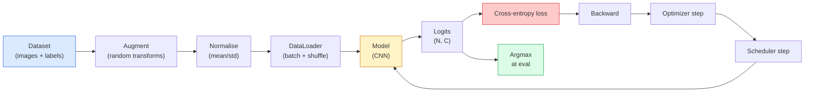

<!-- i18n:manual -->
# Классификация изображений

> Классификатор — это функция из пикселей в распределение вероятностей по классам. Всё остальное — обвязка.

**Type:** Build
**Languages:** Python
**Prerequisites:** Phase 2 Lesson 09 (Model Evaluation), Phase 3 Lesson 10 (Mini Framework), Phase 4 Lesson 03 (CNNs)
**Time:** ~75 minutes

## Learning Objectives

- Собрать сквозной пайплайн классификации изображений на CIFAR-10: датасет, augmentation, модель, цикл обучения, оценка
- Объяснить роль каждого компонента (dataloader, функция потерь, оптимизатор, планировщик, augmentation) и предсказать, как поломка любого из них проявится на кривой потерь
- Реализовать mixup, cutout и label smoothing с нуля и обосновать, когда каждый из них стоит добавлять
- Читать confusion matrix и таблицу precision/recall по классам, чтобы находить проблемы данных и модели глубже, чем показывает общая accuracy

> 🎒 **На пальцах.** Классификация — это база всего компьютерного зрения. Детекция классифицирует куски картинки, сегментация — отдельные пиксели. Научитесь один раз собирать этот пайплайн правильно, и остальные задачи фазы станут перестановкой знакомых деталей.

## The Problem

Любая работающая задача зрения на каком-то уровне сводится к классификации изображений. Детекция классифицирует области. Сегментация классифицирует пиксели. Поиск ранжирует по близости к центроидам классов. Умение правильно сделать классификацию — цикл по датасету, политику augmentation, функцию потерь, оценку — переносится на все остальные задачи фазы.

Большинство багов классификации живёт не в модели. Они живут в пайплайне: сломанная нормализация, неперемешанная обучающая выборка, augmentation, которая портит метку, валидационная выборка, загрязнённая обучающими данными, learning rate, который тихо расходится после 30-й эпохи. CNN, которая при правильной настройке взяла бы 93% на CIFAR-10, при сломанной обычно даёт 70-75% — и кривая потерь всё это время выглядит правдоподобно.

Этот урок собирает весь пайплайн руками, чтобы каждая деталь была видна. Ничего из `torchvision.datasets`, что могло бы спрятать баг, вы не используете.

> 🎒 **На пальцах.** Разница между 93% и 73% — это 2000 неправильно классифицированных картинок из 10 000 тестовых вместо 700. Двадцать процентов точности утекают не в «плохую архитектуру», а в одну строку нормализации. Поэтому чинить надо пайплайн, а не добавлять слои.

## The Concept

### The classification pipeline



Любая стрелка в этом цикле — место, где может жить баг. Cross-entropy принимает сырые логиты, а не выход softmax, поэтому любой `model(x).softmax()` перед функцией потерь тихо считает неправильный градиент. Augmentation применяется только ко входам, а не к меткам — кроме mixup, который смешивает и то, и другое. `optimizer.zero_grad()` должен вызываться ровно один раз за шаг; если его пропустить, градиенты накапливаются, и это выглядит как дико нестабильный learning rate. Каждый из этих багов сглаживает кривую обучения, не выбрасывая ошибку.

> 🎒 **На пальцах.** Пайплайн — это конвейер на заводе. Каждая коробочка на схеме что-то делает с деталью и передаёт дальше. Ошибка на любом посту доедет до конца и испортит изделие, но станок не остановится и лампочка не загорится. Разница с заводом в том, что тут никто не кричит — просто accuracy в конце на 20 пунктов ниже.

### Cross-entropy, logits, and softmax

Классификатор выдаёт `C` чисел на изображение — их называют логитами. Softmax превращает их в распределение вероятностей:

```
softmax(z)_i = exp(z_i) / sum_j exp(z_j)
```

Cross-entropy измеряет отрицательный логарифм вероятности правильного класса:

```
CE(z, y) = -log( softmax(z)_y )
        = -z_y + log( sum_j exp(z_j) )
```

Вторая форма — численно устойчивая (log-sum-exp). В PyTorch `nn.CrossEntropyLoss` сливает softmax и NLL в одну операцию и принимает сырые логиты напрямую. Если вы сами применили softmax заранее — это почти всегда баг: вы считаете log(softmax(softmax(z))), величину без смысла.

> 🎒 **На пальцах.** Пусть логиты для трёх классов — [2, 1, 0], правильный класс первый. exp дают 7.39, 2.72, 1.0, сумма 11.11, вероятность правильного класса 7.39/11.11 = 0.665. Потеря = −log(0.665) ≈ 0.41. Если бы модель угадывала наугад, вероятность была бы 1/3 и потеря −log(0.333) ≈ 1.10. Вот почему при старте обучения на 10 классах вы ожидаете loss около 2.3: это −log(0.1).

### Why augmentation works

У CNN есть встроенная склонность к сдвигам (за счёт общих весов), но нет встроенной устойчивости к обрезкам, отражениям, изменению цвета или перекрытиям. Единственный способ научить её этим инвариантностям — показать пиксели, которые их задействуют. Каждое случайное преобразование во время обучения — это способ сказать: «у этих двух картинок одна метка; выучи признаки, которые игнорируют разницу».

```
Original crop:  "dog facing left"
Flip:           "dog facing right"       <- same label, different pixels
Rotate(+15):    "dog, slight tilt"
Colour jitter:  "dog in warmer light"
RandomErasing:  "dog with patch missing"
```

Правило: augmentation обязана сохранять метку. Cutout и поворот на цифре могут превратить «6» в «9»; для такого датасета берут меньшие углы поворота и выбирают преобразования, которые уважают инвариантности конкретно цифр.

> 🎒 **На пальцах.** Ребёнку показывают одну игрушечную собаку, но с разных сторон, в тени и на свету, наполовину закрытую пледом. Он выучивает «собаку», а не «этот конкретный набор пикселей». Так же и здесь: из одной картинки вы делаете десятки, ни разу не собирая новых данных.

### Mixup and cutmix

Обычная augmentation преобразует пиксели, но оставляет метки one-hot. **Mixup** и **cutmix** ломают это, интерполируя и то, и другое.

```
Mixup:
  lambda ~ Beta(a, a)
  x = lambda * x_i + (1 - lambda) * x_j
  y = lambda * y_i + (1 - lambda) * y_j

Cutmix:
  paste a random rectangle of x_j into x_i
  y = area-weighted mix of y_i and y_j
```

Почему помогает: модель перестаёт заучивать острые one-hot цели и учится интерполировать между классами. Потеря на обучении растёт, точность на тесте растёт. Это самое дешёвое улучшение устойчивости для любого классификатора.

> 🎒 **На пальцах.** Возьмите lambda = 0.7. Новая картинка — 70% кота и 30% собаки, и метка тоже 0.7 кота и 0.3 собаки. Модель больше не может отвечать «кот на 100%»; ей приходится учиться отвечать сомнением там, где сомнение уместно. Это и есть та самая калибровка, которую потом хвалят в отчётах.

### Label smoothing

Родственник mixup. Вместо обучения против `[0, 0, 1, 0, 0]` учим против `(1 - eps) * onehot + eps / C` для маленького `eps` вроде 0.1 — при `C = 5` такая цель равна `[eps/C, eps/C, 1 - eps + eps/C, eps/C, eps/C]` и по-прежнему суммируется в 1. Не даёт модели выдавать сколь угодно острые логиты и улучшает калибровку почти бесплатно. Это ровно та конвенция, которую реализует `nn.CrossEntropyLoss(label_smoothing=0.1)`, встроенный начиная с PyTorch 1.10.

> 🎒 **На пальцах.** При 5 классах и eps = 0.1 формула раздаёт каждому классу поровну по eps/C = 0.1/5 = 0.02, а правильному классу добавляет сверху 1 − eps = 0.9. Цель получается [0.02, 0.02, 0.92, 0.02, 0.02], сумма ровно 1. Одна строка в конструкторе — и модель перестаёт быть уверенной на 99.99% там, где она ошибается.

### Evaluation beyond accuracy

Общая accuracy прячет дисбаланс. Бинарный классификатор на данных 90-10, который всегда предсказывает большинство, набирает 90%. Инструменты, которые действительно показывают, что происходит:

- **Per-class accuracy** — одно число на класс; сразу видно проседающие категории.
- **Confusion matrix** — таблица C x C, где в строке i и столбце j стоит число объектов истинного класса i, предсказанных как класс j; диагональ — правильные ответы, вне диагонали живёт ваша модель.
- **Top-1 / Top-5** — попал ли правильный класс в 1 или в 5 лучших предсказаний; Top-5 важен для ImageNet, потому что классы вроде «норвич-терьер» и «норфолк-терьер» действительно неразличимы.
- **Calibration (ECE)** — оказывается ли предсказание с уверенностью 0.8 правильным в 80% случаев? Современные сети систематически самоуверенны; лечится temperature scaling или label smoothing.

> 🎒 **На пальцах.** Модель «всегда отвечай большинством» на данных 90-10 даёт accuracy 0.90, но recall по редкому классу ровно 0: из 100 редких объектов не найден ни один. Именно это и показывает confusion matrix — вся вторая строка ушла в первый столбец.

```figure
receptive-field
```

## Build It

### Step 1: A deterministic synthetic dataset

CIFAR-10 лежит на диске. Чтобы урок был воспроизводимым и быстрым, мы строим синтетический датасет, похожий на CIFAR: изображения 32x32 RGB со структурой, специфичной для каждого класса, которую модель обязана выучить. Тот же самый пайплайн без изменений работает на настоящем CIFAR-10.

```python
import numpy as np
import torch
from torch.utils.data import Dataset


def synthetic_cifar(num_per_class=1000, num_classes=10, seed=0):
    rng = np.random.default_rng(seed)
    X = []
    Y = []
    for c in range(num_classes):
        centre = rng.uniform(0, 1, (3,))
        freq = 2 + c
        for _ in range(num_per_class):
            yy, xx = np.meshgrid(np.linspace(0, 1, 32), np.linspace(0, 1, 32), indexing="ij")
            r = np.sin(xx * freq) * 0.5 + centre[0]
            g = np.cos(yy * freq) * 0.5 + centre[1]
            b = (xx + yy) * 0.5 * centre[2]
            img = np.stack([r, g, b], axis=-1)
            img += rng.normal(0, 0.08, img.shape)
            img = np.clip(img, 0, 1)
            X.append(img.astype(np.float32))
            Y.append(c)
    X = np.stack(X)
    Y = np.array(Y)
    idx = rng.permutation(len(X))
    return X[idx], Y[idx]


class ArrayDataset(Dataset):
    def __init__(self, X, Y, transform=None):
        self.X = X
        self.Y = Y
        self.transform = transform

    def __len__(self):
        return len(self.X)

    def __getitem__(self, i):
        img = self.X[i]
        if self.transform is not None:
            img = self.transform(img)
        img = torch.from_numpy(img).permute(2, 0, 1)
        return img, int(self.Y[i])
```

Каждый класс получает свою цветовую палитру и частоту узора плюс гауссов шум, чтобы модель училась сигналу, а не запоминала пиксели. Десять классов, по тысяче изображений, перемешанные.

> 🎒 **На пальцах.** Здесь 10 классов по 1000 картинок = 10 000 изображений по 32×32×3 = 3072 числа каждое. Это примерно 30 миллионов чисел, около 120 МБ во float32. Класс отличается частотой `freq = 2 + c`: у класса 0 полоски редкие, у класса 9 — в пять раз чаще. Шум `0.08` мешает модели выучить точное значение пикселя вместо узора.

### Step 2: Normalisation and augmentation

Два преобразования, которые есть в любом пайплайне зрения.

```python
def standardize(mean, std):
    mean = np.array(mean, dtype=np.float32)
    std = np.array(std, dtype=np.float32)
    def _fn(img):
        return (img - mean) / std
    return _fn


def random_hflip(rng, p=0.5):
    def _fn(img):
        if rng.random() < p:
            return img[:, ::-1, :].copy()
        return img
    return _fn


def random_crop(rng, pad=4):
    def _fn(img):
        h, w = img.shape[:2]
        padded = np.pad(img, ((pad, pad), (pad, pad), (0, 0)), mode="reflect")
        y = rng.integers(0, 2 * pad + 1)
        x = rng.integers(0, 2 * pad + 1)
        return padded[y:y + h, x:x + w, :]
    return _fn


def compose(*fns):
    def _fn(img):
        for fn in fns:
            img = fn(img)
        return img
    return _fn
```

Reflect-pad перед обрезкой, а не zero-pad, потому что чёрные рамки — это сигнал, который модель научится игнорировать бесполезным способом. Обе augmentation берут случайность из явного `np.random.Generator`, который вы передаёте снаружи, — в том же стиле, что и `synthetic_cifar` из Step 1. Потянетесь тут за глобальным `np.random` — и запуск перестанет быть воспроизводимым, какой бы seed вы ни выставили.

> 🎒 **На пальцах.** `random_crop(rng, pad=4)` дополняет картинку 32×32 до 40×40 и вырезает случайный кусок 32×32. Смещение по каждой оси берётся из `rng.integers(0, 2 * pad + 1)`, то есть 0, 1, ... 8 — девять вариантов; всего 9 × 9 = 81 разная обрезка из одной картинки. Вместе с `random_hflip` — уже 162. Датасет вырос более чем в полторы сотни раз, а на диске не прибавилось ни байта.

### Step 3: Mixup

Смешивает две картинки и две метки прямо внутри шага обучения. Реализовано как преобразование батча, чтобы жить рядом с прямым проходом, а не внутри датасета.

```python
def mixup_batch(x, y, num_classes, rng, alpha=0.2):
    if alpha <= 0:
        return x, torch.nn.functional.one_hot(y, num_classes).float()
    lam = float(rng.beta(alpha, alpha))
    idx = torch.randperm(x.size(0), device=x.device)
    x_mixed = lam * x + (1 - lam) * x[idx]
    y_onehot = torch.nn.functional.one_hot(y, num_classes).float()
    y_mixed = lam * y_onehot + (1 - lam) * y_onehot[idx]
    return x_mixed, y_mixed


def soft_cross_entropy(logits, soft_targets):
    log_probs = torch.log_softmax(logits, dim=-1)
    return -(soft_targets * log_probs).sum(dim=-1).mean()
```

`soft_cross_entropy` — это cross-entropy против распределения мягких меток. Она сводится к обычному one-hot случаю, когда цель ровно one-hot. `lam` берётся из того же переданного снаружи генератора, что и augmentation, поэтому mixup не тащит глобальную случайность обратно.

> 🎒 **На пальцах.** `torch.randperm` просто перемешивает батч и складывает его сам с собой в другом порядке: картинка 1 смешивается со случайной картинкой 7, картинка 2 — с картинкой 40. Никаких лишних загрузок с диска, стоимость операции — одно сложение тензоров.

### Step 4: The training loop

Полный рецепт: один проход по данным, градиенты один раз на батч, планировщик — один раз на эпоху.

```python
import torch
import torch.nn as nn
from torch.utils.data import DataLoader
from torch.optim import SGD
from torch.optim.lr_scheduler import CosineAnnealingLR

def train_one_epoch(model, loader, optimizer, device, num_classes, rng, use_mixup=True):
    model.train()
    total, correct, loss_sum = 0, 0, 0.0
    for x, y in loader:
        x, y = x.to(device), y.to(device)
        if use_mixup:
            x_m, y_soft = mixup_batch(x, y, num_classes, rng)
            logits = model(x_m)
            loss = soft_cross_entropy(logits, y_soft)
        else:
            logits = model(x)
            loss = nn.functional.cross_entropy(logits, y, label_smoothing=0.1)
        optimizer.zero_grad()
        loss.backward()
        optimizer.step()
        loss_sum += loss.item() * x.size(0)
        total += x.size(0)
        # Training accuracy vs the un-mixed labels `y` is only an approximation
        # when mixup is on (the model saw soft targets, not y). Treat it as a
        # rough progress signal; rely on val accuracy for real performance.
        with torch.no_grad():
            pred = logits.argmax(dim=-1)
            correct += (pred == y).sum().item()
    return loss_sum / total, correct / total


@torch.no_grad()
def evaluate(model, loader, device, num_classes):
    model.eval()
    total, correct = 0, 0
    loss_sum = 0.0
    cm = torch.zeros(num_classes, num_classes, dtype=torch.long)
    for x, y in loader:
        x, y = x.to(device), y.to(device)
        logits = model(x)
        loss = nn.functional.cross_entropy(logits, y)
        pred = logits.argmax(dim=-1)
        for t, p in zip(y.cpu(), pred.cpu()):
            cm[t, p] += 1
        loss_sum += loss.item() * x.size(0)
        total += x.size(0)
        correct += (pred == y).sum().item()
    return loss_sum / total, correct / total, cm
```

Пять инвариантов, которые вы проверяете каждый раз, когда пишете цикл обучения:

1. `model.train()` перед обучением, `model.eval()` перед оценкой — переключает поведение dropout и batchnorm.
2. `.zero_grad()` перед `.backward()`.
3. `.item()` при накоплении метрик, чтобы ничего не удерживало граф вычислений живым.
4. `@torch.no_grad()` во время оценки — экономит память и время, предотвращает тонкие ошибки.
5. Argmax по сырым логитам, а не по softmax — тот же результат, на одну операцию меньше.

> 🎒 **На пальцах.** Пункт 3 не про красоту. Без `.item()` вы храните ссылку на весь граф вычислений каждого батча. При 100 батчах за эпоху это сотня графов в памяти вместо одного — и OOM на середине первой эпохи. Одна точка и шесть символов решают проблему.

### Step 5: Put it together

Берём `TinyResNet` из прошлого урока, обучаем несколько эпох, оцениваем.

```python
from main import synthetic_cifar, ArrayDataset
from main import standardize, random_hflip, random_crop, compose
from main import mixup_batch, soft_cross_entropy
from main import train_one_epoch, evaluate
# TinyResNet comes from the previous lesson (03-cnns-lenet-to-resnet).
# Adjust the import path to wherever you stored the previous lesson's code.
from cnns_lenet_to_resnet import TinyResNet  # example placeholder

X, Y = synthetic_cifar(num_per_class=500)
split = int(0.9 * len(X))
X_train, Y_train = X[:split], Y[:split]
X_val, Y_val = X[split:], Y[split:]

mean = [0.5, 0.5, 0.5]
std = [0.25, 0.25, 0.25]
aug_rng = np.random.default_rng(1)
train_tf = compose(random_hflip(aug_rng), random_crop(aug_rng, pad=4), standardize(mean, std))
eval_tf = standardize(mean, std)

train_ds = ArrayDataset(X_train, Y_train, transform=train_tf)
val_ds = ArrayDataset(X_val, Y_val, transform=eval_tf)

train_loader = DataLoader(train_ds, batch_size=128, shuffle=True, num_workers=0)
val_loader = DataLoader(val_ds, batch_size=256, shuffle=False, num_workers=0)

device = "cuda" if torch.cuda.is_available() else "cpu"
model = TinyResNet(num_classes=10).to(device)
optimizer = SGD(model.parameters(), lr=0.1, momentum=0.9, weight_decay=5e-4, nesterov=True)
scheduler = CosineAnnealingLR(optimizer, T_max=10)

for epoch in range(10):
    tr_loss, tr_acc = train_one_epoch(model, train_loader, optimizer, device, 10, aug_rng, use_mixup=True)
    va_loss, va_acc, _ = evaluate(model, val_loader, device, 10)
    scheduler.step()
    print(f"epoch {epoch:2d}  lr {scheduler.get_last_lr()[0]:.4f}  "
          f"train {tr_loss:.3f}/{tr_acc:.3f}  val {va_loss:.3f}/{va_acc:.3f}")
```

На синтетическом датасете это доходит почти до идеальной точности на валидации за пять эпох — и в этом смысл: пайплайн корректен, модель может выучить то, что выучиваемо. Замените датасет на настоящий CIFAR-10, и тот же цикл обучится до ~90% без изменений.

> 🎒 **На пальцах.** Считаем размер: 500 картинок на класс × 10 классов = 5000, из них 90% в обучение = 4500. При `batch_size=128` это 36 батчей на эпоху. `CosineAnnealingLR(T_max=10)` плавно опускает learning rate с 0.1 почти до нуля за 10 эпох — то есть к концу шаги становятся крошечными, и модель перестаёт скакать вокруг минимума.

### Step 6: Read the confusion matrix

Одна только accuracy никогда не скажет, где модель ошибается. Confusion matrix — скажет.

```python
def print_confusion(cm, labels=None):
    c = cm.shape[0]
    labels = labels or [str(i) for i in range(c)]
    print(f"{'':>6}" + "".join(f"{l:>5}" for l in labels))
    for i in range(c):
        row = cm[i].tolist()
        print(f"{labels[i]:>6}" + "".join(f"{v:>5}" for v in row))
    print()
    tp = cm.diag().float()
    fp = cm.sum(dim=0).float() - tp
    fn = cm.sum(dim=1).float() - tp
    prec = tp / (tp + fp).clamp_min(1)
    rec = tp / (tp + fn).clamp_min(1)
    f1 = 2 * prec * rec / (prec + rec).clamp_min(1e-9)
    for i in range(c):
        print(f"{labels[i]:>6}  prec {prec[i]:.3f}  rec {rec[i]:.3f}  f1 {f1[i]:.3f}")

_, _, cm = evaluate(model, val_loader, device, 10)
print_confusion(cm)
```

Строки — истинные классы, столбцы — предсказания. Скопление внедиагональных значений между классами 3 и 5 означает, что модель путает эти два и даёт вам отправную точку для целевого сбора данных или специфичной для класса augmentation.

> 🎒 **На пальцах.** Пусть у класса 3 в строке стоит: 40 на диагонали и 10 в столбце класса 5. Тогда recall класса 3 = 40/50 = 0.8. Если при этом в столбце класса 5 всего 60 предсказаний, из них 50 верных, precision класса 5 = 50/60 ≈ 0.83. Два числа на класс — и вы уже знаете, какую пару классов чинить первой.

## Use It

`torchvision` заворачивает всё вышеописанное в идиоматичные компоненты. Для настоящего CIFAR-10 весь пайплайн — четыре строки плюс цикл обучения.

```python
from torchvision.datasets import CIFAR10
from torchvision.transforms import Compose, RandomCrop, RandomHorizontalFlip, ToTensor, Normalize

mean = (0.4914, 0.4822, 0.4465)
std = (0.2470, 0.2435, 0.2616)
train_tf = Compose([
    RandomCrop(32, padding=4, padding_mode="reflect"),
    RandomHorizontalFlip(),
    ToTensor(),
    Normalize(mean, std),
])
eval_tf = Compose([ToTensor(), Normalize(mean, std)])

train_ds = CIFAR10(root="./data", train=True,  download=True, transform=train_tf)
val_ds   = CIFAR10(root="./data", train=False, download=True, transform=eval_tf)
```

Обратите внимание на две вещи: mean/std **специфичны для датасета** — они посчитаны на обучающей выборке CIFAR-10, а не на ImageNet — и reflect pad является общепринятой по умолчанию политикой обрезки. Скопировать сюда статистики ImageNet — это утечка около 1% точности, которую никто не замечает, пока кто-нибудь не сядет профилировать модель.

> 🎒 **На пальцах.** Средние у CIFAR-10 (0.4914, 0.4822, 0.4465), у ImageNet (0.485, 0.456, 0.406). Разница по зелёному каналу 0.4822 − 0.456 ≈ 0.026 — вроде бы мелочь. Но она сдвигает каждый пиксель каждой картинки в одну сторону, и модель тратит часть ёмкости на компенсацию этого сдвига вместо распознавания.

## Ship It

Этот урок производит:

- `outputs/prompt-classifier-pipeline-auditor.md` — промпт, который проверяет обучающий скрипт на пять инвариантов выше и показывает первое нарушение.
- `outputs/skill-classification-diagnostics.md` — навык, который по confusion matrix и списку имён классов резюмирует ошибки по классам и предлагает одно самое полезное исправление.

## Exercises

1. **(Easy)** Обучите одну и ту же модель с mixup и без него пять эпох на синтетическом датасете. Постройте графики потерь на обучении и валидации для обоих вариантов. Объясните, почему потеря на обучении с mixup выше, а точность на валидации при этом такая же или лучше.
2. **(Medium)** Реализуйте Cutout — обнуление случайного квадрата 8x8 в каждой обучающей картинке — и проведите ablation: без augmentation, hflip+crop, hflip+crop+cutout, hflip+crop+mixup. Приведите точность на валидации для каждого варианта.
3. **(Hard)** Соберите пайплайн для CIFAR-100 (100 классов, тот же размер входа) и воспроизведите обучение ResNet-34 с точностью в пределах 1% от опубликованной. Дополнительно: переберите три learning rate и два weight decay, логируйте в локальный CSV, постройте итоговую таблицу самых частых путаниц из confusion matrix.

> 🎒 **На пальцах.** Подсказка к первому заданию: mixup показывает модели картинки, которых не существует (70% кота + 30% собаки), и требует ответить «0.7 и 0.3». Идеально угадать такую цель невозможно, поэтому train loss честно выше — скажем, 0.9 вместо 0.4. Смотреть надо не на неё, а на val accuracy: она считается на настоящих картинках с настоящими метками.

## Key Terms

| Term | What people say | What it actually means |
|------|----------------|----------------------|
| Logits | «Сырые выходы» | Вектор из C чисел на изображение до softmax; cross-entropy ждёт именно их, а не пропущенные через softmax значения |
| Cross-entropy | «Функция потерь» | Отрицательный логарифм вероятности правильного класса; объединяет log-softmax и NLL в одну устойчивую операцию |
| DataLoader | «Тот, кто делает батчи» | Оборачивает датасет перемешиванием, батчами и (необязательно) многопроцессной загрузкой; на него списывают половину багов обучения |
| Augmentation | «Случайные преобразования» | Любое преобразование пикселей во время обучения, сохраняющее метку; учит инвариантностям, которых у CNN нет от рождения |
| Mixup / Cutmix | «Смешать две картинки» | Смешивание и входов, и меток, чтобы классификатор учил плавные переходы вместо жёстких границ |
| Label smoothing | «Мягкие цели» | Замена one-hot на `(1 - eps) * onehot + eps/C` — конвенция PyTorch; улучшает калибровку и слегка поднимает точность |
| Top-k accuracy | «Top-5» | Правильный класс попал в k предсказаний с наибольшей вероятностью; используется на датасетах с действительно неоднозначными классами |
| Confusion matrix | «Где живут ошибки» | Таблица C x C, где ячейка (i, j) считает картинки истинного класса i, предсказанные как j; диагональ — верные ответы, остальное подсказывает, что чинить |

## Further Reading

- [CS231n: Training Neural Networks](https://cs231n.github.io/neural-networks-3/) — до сих пор самый ясный обзор пайплайна обучения на одной странице
- [Bag of Tricks for Image Classification (He et al., 2019)](https://arxiv.org/abs/1812.01187) — все мелкие приёмы, которые вместе дают ResNet 3-4% точности на ImageNet
- [mixup: Beyond Empirical Risk Minimization (Zhang et al., 2017)](https://arxiv.org/abs/1710.09412) — оригинальная статья про mixup; три страницы теории плюс убедительные эксперименты
- [Why temperature scaling matters (Guo et al., 2017)](https://arxiv.org/abs/1706.04599) — статья, доказавшая, что современные сети плохо калиброваны, и починившая это одним скалярным параметром
