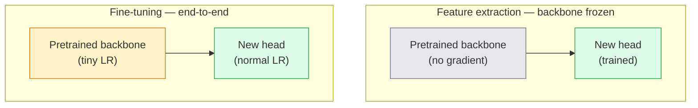

<!-- i18n:manual -->
# Transfer learning и fine-tuning

> Кто-то уже потратил миллион GPU-часов, объясняя сети, как выглядят края, текстуры и части объектов. Одолжите эти признаки, прежде чем обучать свои.

**Type:** Build
**Languages:** Python
**Prerequisites:** Phase 4 Lesson 03 (CNNs), Phase 4 Lesson 04 (Image Classification)
**Time:** ~75 minutes

## Learning Objectives

- Отличать feature extraction от fine-tuning и выбирать нужное по размеру датасета, удалённости домена и бюджету вычислений
- Загрузить предобученный backbone, заменить его классификационную голову и обучить только голову до рабочего baseline меньше чем за 20 строк
- Постепенно размораживать слои с discriminative learning rates, чтобы ранние общие признаки получали меньшие обновления, чем поздние специфичные для задачи
- Диагностировать три частые поломки: дрейф признаков из-за слишком большого LR на размороженных блоках, развал статистик BN на крошечных датасетах и катастрофическое забывание

> 🎒 **На пальцах.** Обучить ResNet-50 на ImageNet с нуля — примерно 2000 GPU-часов. Взять готовые веса и дообучить голову — минуты на ноутбуке. Разница в тысячи раз, а точность часто отличается на пару процентов. Это самый выгодный обмен во всём компьютерном зрении.

## The Problem

Обучение ResNet-50 на ImageNet стоит около 2000 GPU-часов. Очень мало у кого есть такой бюджет на каждую задачу, которую они выкатывают. Почти все на практике выкатывают предобученный backbone с новой головой, обученной на нескольких сотнях или тысячах картинок конкретной задачи.

Это не халтура. Первый свёрточный блок любой обученной на ImageNet CNN выучивает края и габороподобные фильтры. Следующие несколько блоков выучивают текстуры и простые узоры. Средние блоки выучивают части объектов. Последние блоки выучивают комбинации, которые уже похожи на 1000 категорий ImageNet. Первые 90% этой иерархии переносятся почти без изменений на медицинские снимки, промышленный контроль, спутниковые данные и любую другую задачу зрения — потому что у природы ограниченный словарь краёв и текстур. Оставшиеся 10% — это то, что вы действительно обучаете.

Правильный перенос подстерегают три бага: уничтожение предобученных признаков слишком большим learning rate, информационное голодание модели из-за того, что заморожено слишком много, и дрейф бегущих статистик BatchNorm в сторону крошечного датасета, на котором остальная сеть никогда не училась. Этот урок специально проходит по каждому из них.

> 🎒 **На пальцах.** Представьте, что вы нанимаете человека, который двадцать лет разглядывал фотографии, и просите его отличать бракованные болты от целых. Вы не переучиваете его видеть — вы объясняете, что такое брак. Ровно это и делает новая голова поверх замороженного backbone.

## The Concept

### Feature extraction vs fine-tuning

Два режима, выбор между ними зависит от того, насколько вы доверяете предобученным признакам и сколько у вас данных.



Правила большого пальца:

| Dataset size | Domain distance | Recipe |
|--------------|-----------------|--------|
| < 1k images | близко к ImageNet | Заморозить backbone, обучать только голову |
| 1k-10k | близко | Заморозить первые 2-3 стадии, дообучить остальное |
| 10k-100k | любое | Дообучить целиком с discriminative LR |
| 100k+ | далеко | Дообучить всё; если домен достаточно далёк, рассмотреть обучение с нуля |

«Близко к ImageNet» примерно означает обычные RGB-фотографии с объектами. Медицинские КТ-снимки, спутниковые снимки сверху и микроскопия — далёкие домены: признаки всё ещё помогают, но придётся дать адаптироваться большему числу слоёв.

> 🎒 **На пальцах.** Таблица читается по одной оси: чем больше у вас данных, тем больше слоёв можно отпустить. На 500 картинках вы обучаете одну голову — это тысячи параметров. На 50 000 картинок вы отпускаете все 11 миллионов параметров ResNet-18. Простое правило: параметров, которые вы двигаете, не должно быть намного больше, чем у вас примеров.

### Why freezing works at all

Признаки ImageNet, которые выучивает CNN, не специализированы под 1000 категорий. Они специализированы под статистику естественных изображений: края определённых ориентаций, текстуры, контрастные узоры, примитивы формы. Эта статистика стабильна почти в любом визуальном домене, который человек может назвать. Поэтому модель, обученная на ImageNet и проверенная на CIFAR-10 всего с новой линейной головой (без fine-tuning backbone), достигает 80%+ точности. Голова учится тому, какие из уже выученных признаков взвешивать для этой задачи.

> 🎒 **На пальцах.** 80% на CIFAR-10 без единого обновления backbone — это в восемь раз лучше случайного угадывания (10% на десяти классах). Модель никогда не видела ни одной картинки CIFAR-10, но уже знает, как выглядит край и мех. Осталось объяснить, какая комбинация означает «кошка».

### Discriminative learning rates

Когда вы всё-таки размораживаете, ранние слои должны обучаться медленнее поздних. Ранние слои кодируют общие признаки, которые вы хотите сохранить; поздние кодируют специфичную для задачи структуру, которую нужно сильно двигать.

```
Typical recipe:

  stage 0 (stem + first group): lr = base_lr / 100    (mostly fixed)
  stage 1:                       lr = base_lr / 10
  stage 2:                       lr = base_lr / 3
  stage 3 (last backbone group): lr = base_lr
  head:                          lr = base_lr  (or slightly higher)
```

В PyTorch это просто список групп параметров, переданный оптимизатору. Одна модель, пять learning rate, ноль лишнего кода.

> 🎒 **На пальцах.** При base_lr = 0.001 стадия 0 получает 0.001/100 = 0.00001, а голова — 0.001. Разница в сто раз: за то время, пока голова сдвинется на шаг, первый блок сдвинется на сотую долю шага. Так и задумано — края не надо переучивать.

### The BatchNorm problem

Слои BN хранят буферы `running_mean` и `running_var`, посчитанные на ImageNet. Если у вашей задачи другое распределение пикселей — другое освещение, другой сенсор, другое цветовое пространство — эти буферы неверны. Три варианта в порядке предпочтения:

1. **Fine-tune with BN in train mode.** Пусть BN обновляет свои бегущие статистики вместе со всем остальным. Выбор по умолчанию, когда датасет задачи среднего размера (>= 5k примеров).
2. **Freeze BN in eval mode.** Оставить статистики ImageNet и обучать только веса. Правильно, когда датасет настолько мал, что скользящее среднее BN будет шумным.
3. **Replace BN with GroupNorm.** Полностью убирает проблему скользящего среднего. Используется в backbone для детекции и сегментации, где размер батча на GPU крошечный.

Ошибка здесь тихо роняет точность на 5-15%.

> 🎒 **На пальцах.** BN хранит два числа на канал: среднее и дисперсию. Если ваши снимки в среднем темнее ImageNet, скажем среднее 0.25 вместо 0.45, то BN вычитает не то число из каждого пикселя каждого изображения. Ошибка не громкая — просто минус 10% точности и ноль сообщений в логе.

### Head design

Классификационная голова — это 1-3 линейных слоя плюс необязательный dropout. У каждого backbone из torchvision есть голова по умолчанию, которую вы заменяете:

```
backbone.fc = nn.Linear(backbone.fc.in_features, num_classes)          # ResNet
backbone.classifier[1] = nn.Linear(..., num_classes)                    # EfficientNet, MobileNet
backbone.heads.head = nn.Linear(..., num_classes)                       # torchvision ViT
```

Для маленьких датасетов обычно хватает одного линейного слоя. Добавление скрытого слоя (Linear -> ReLU -> Dropout -> Linear) помогает, когда распределение задачи дальше от распределения, на котором обучался backbone.

> 🎒 **На пальцах.** У ResNet-18 `fc.in_features` равно 512. Голова на 10 классов — это матрица 512×10 плюс 10 смещений, то есть 5130 параметров. Весь backbone — около 11 миллионов. Вы обучаете 0.05% модели и получаете на CIFAR-10 около 86% точности.

### Layer-wise LR decay

Более плавная версия discriminative LR, используемая в современном fine-tuning (BEiT, DINOv2, дообучение ViT-B). Вместо группировки слоёв по стадиям каждому слою дают чуть меньший LR, чем слою над ним:

```
lr_layer_k = base_lr * decay^(L - k)
```

При decay = 0.75 и L = 12 блоках трансформера первый блок обучается со скоростью `0.75^11 ≈ 0.04x` от LR головы. Для дообучения трансформеров это важнее, чем для CNN, где обычно хватает LR по стадиям.

### What to evaluate

Прогонам transfer learning нужны два числа, которые вы не отслеживали бы при обучении с нуля:

- **Pretrained-only accuracy** — точность головы при замороженном backbone. Это ваш пол.
- **Fine-tuned accuracy** — та же модель после сквозного обучения. Это ваш потолок.

Если дообученная точность ниже, чем с замороженным backbone, у вас баг в learning rate или в BN. Всегда печатайте оба числа.

> 🎒 **На пальцах.** Типичная пара для ResNet18 на CIFAR-10: 86% с замороженным backbone и 93% после fine-tuning. Разрыв 7 пунктов — это то, что вы купили за размораживание. Если после fine-tuning стало 80%, то есть ниже замороженного пола, вы не дообучили модель, а сломали её: почти всегда виноват слишком большой LR на backbone.

```figure
transfer-learning
```

## Build It

### Step 1: Load a pretrained backbone and inspect it

```python
import torch
import torch.nn as nn
from torchvision.models import resnet18, ResNet18_Weights

backbone = resnet18(weights=ResNet18_Weights.IMAGENET1K_V1)
print(backbone)
print()
print("classifier head:", backbone.fc)
print("feature dim:", backbone.fc.in_features)
```

У `ResNet18` четыре стадии (`layer1..layer4`) плюс stem и голова `fc`. У любого классификационного backbone из torchvision структура аналогичная.

> 🎒 **На пальцах.** Первое, что стоит сделать с чужой моделью, — распечатать её. `backbone.fc.in_features` покажет 512 — это ширина вектора признаков, который backbone отдаёт на выходе. Именно к этому числу вы будете пристыковывать свою голову, и ошибиться здесь нельзя: 512 на входе, `num_classes` на выходе.

### Step 2: Feature extraction — freeze everything, replace the head

```python
def make_feature_extractor(num_classes=10):
    model = resnet18(weights=ResNet18_Weights.IMAGENET1K_V1)
    for p in model.parameters():
        p.requires_grad = False
    model.fc = nn.Linear(model.fc.in_features, num_classes)
    return model

model = make_feature_extractor(num_classes=10)
trainable = sum(p.numel() for p in model.parameters() if p.requires_grad)
frozen = sum(p.numel() for p in model.parameters() if not p.requires_grad)
print(f"trainable: {trainable:>10,}")
print(f"frozen:    {frozen:>10,}")
```

Обучаемым остаётся только `model.fc`. Backbone превращается в замороженный экстрактор признаков.

> 🎒 **На пальцах.** Запустите этот код и увидите примерно `trainable: 5,130` и `frozen: 11,176,512`. То есть градиенты считаются для одной двухтысячной части весов. Обратный проход становится почти бесплатным, обучение идёт в разы быстрее, и переобучиться на 500 картинках почти невозможно.

### Step 3: Discriminative fine-tuning

Утилита, которая строит группы параметров с learning rate по стадиям.

```python
def discriminative_param_groups(model, base_lr=1e-3, decay=0.3):
    stages = [
        ["conv1", "bn1"],
        ["layer1"],
        ["layer2"],
        ["layer3"],
        ["layer4"],
        ["fc"],
    ]
    groups = []
    for i, names in enumerate(stages):
        lr = base_lr * (decay ** (len(stages) - 1 - i))
        params = [p for n, p in model.named_parameters()
                  if any(n.startswith(k) for k in names)]
        if params:
            groups.append({"params": params, "lr": lr, "name": "_".join(names)})
    return groups

model = resnet18(weights=ResNet18_Weights.IMAGENET1K_V1)
model.fc = nn.Linear(model.fc.in_features, 10)
for p in model.parameters():
    p.requires_grad = True

groups = discriminative_param_groups(model)
for g in groups:
    print(f"{g['name']:>10s}  lr={g['lr']:.2e}  params={sum(p.numel() for p in g['params']):>8,}")
```

`decay=0.3` означает, что каждая стадия обучается со скоростью 30% от следующей. `fc` получает `base_lr`, `layer4` получает `0.3 * base_lr`, `conv1` получает `0.3^5 * base_lr ≈ 0.00243 * base_lr`. Звучит экстремально; на практике работает.

> 🎒 **На пальцах.** Проверим: 0.3⁵ = 0.00243. При base_lr = 0.001 первый свёрточный слой идёт с шагом 0.0000024 — практически стоит на месте. Это и есть смысл: края, выученные на миллионе картинок ImageNet, лучше не трогать ради ваших пятисот.

### Step 4: BatchNorm handling

Хелпер, который замораживает бегущие статистики BN, не замораживая его веса.

```python
def freeze_bn_stats(model):
    for m in model.modules():
        if isinstance(m, (nn.BatchNorm1d, nn.BatchNorm2d, nn.BatchNorm3d)):
            m.eval()
            for p in m.parameters():
                p.requires_grad = False
    return model
```

Вызывайте его после `model.train()` в начале каждой эпохи. `model.train()` переключает всё в режим обучения; этот вызов откатывает переключение только для слоёв BN.

> 🎒 **На пальцах.** Порядок вызовов тут критичен. Сначала `model.train()`, потом `freeze_bn_stats(model)` — иначе первый вызов отменит второй, и BN снова начнёт обновлять статистики. Это одна из тех ошибок, которые не падают, а просто дают минус несколько процентов.

### Step 5: A minimal end-to-end fine-tuning loop

```python
from torch.optim import SGD
from torch.utils.data import DataLoader
from torch.optim.lr_scheduler import CosineAnnealingLR
import torch.nn.functional as F

def fine_tune(model, train_loader, val_loader, device, epochs=5, base_lr=1e-3, freeze_bn=False):
    model = model.to(device)
    groups = discriminative_param_groups(model, base_lr=base_lr)
    optimizer = SGD(groups, momentum=0.9, weight_decay=1e-4, nesterov=True)
    scheduler = CosineAnnealingLR(optimizer, T_max=epochs)

    for epoch in range(epochs):
        model.train()
        if freeze_bn:
            freeze_bn_stats(model)
        tr_loss, tr_correct, tr_total = 0.0, 0, 0
        for x, y in train_loader:
            x, y = x.to(device), y.to(device)
            logits = model(x)
            loss = F.cross_entropy(logits, y, label_smoothing=0.1)
            optimizer.zero_grad()
            loss.backward()
            optimizer.step()
            tr_loss += loss.item() * x.size(0)
            tr_total += x.size(0)
            tr_correct += (logits.argmax(-1) == y).sum().item()
        scheduler.step()

        model.eval()
        va_total, va_correct = 0, 0
        with torch.no_grad():
            for x, y in val_loader:
                x, y = x.to(device), y.to(device)
                pred = model(x).argmax(-1)
                va_total += x.size(0)
                va_correct += (pred == y).sum().item()
        print(f"epoch {epoch}  train {tr_loss/tr_total:.3f}/{tr_correct/tr_total:.3f}  "
              f"val {va_correct/va_total:.3f}")
    return model
```

Пять эпох по этому рецепту на CIFAR-10 доводят `ResNet18-IMAGENET1K_V1` до ~93% точности. Линейный пробинг — тот же backbone, но замороженный, обучается только голова — упирается в потолок около 86%, сколько бы вы его ни гоняли. Эти последние несколько пунктов и есть то, что вы покупаете размораживанием backbone.

> 🎒 **На пальцах.** Два числа стоит запомнить: 86% — потолок линейного пробинга (обучаются только 5 тысяч параметров головы) и 93% — полный fine-tuning (обучаются все 11 миллионов). Семь пунктов точности стоят обучения всей сети целиком. Если вам хватает 86%, вы экономите ровно эту работу.

### Step 6: Progressive unfreezing

Расписание, которое размораживает по одной стадии за эпоху, от конца к началу. Смягчает дрейф признаков ценой нескольких лишних эпох.

```python
def progressive_unfreeze_schedule(model):
    stages = ["layer4", "layer3", "layer2", "layer1"]
    yielded = set()

    def start():
        for p in model.parameters():
            p.requires_grad = False
        for p in model.fc.parameters():
            p.requires_grad = True

    def unfreeze(epoch):
        if epoch < len(stages):
            name = stages[epoch]
            yielded.add(name)
            for n, p in model.named_parameters():
                if n.startswith(name):
                    p.requires_grad = True
            return name
        return None

    return start, unfreeze
```

Вызовите `start()` один раз перед первой эпохой. Вызывайте `unfreeze(epoch)` в начале каждой эпохи. Пересобирайте оптимизатор всякий раз, когда меняется набор обучаемых параметров, иначе замороженные параметры сохраняют закешированные моменты, которые его путают.

> 🎒 **На пальцах.** Расписание такое: эпоха 0 — только голова, эпоха 1 добавляет layer4, эпоха 2 — layer3, эпоха 3 — layer2, эпоха 4 — layer1. К пятой эпохе обучается вся сеть. Голова к этому моменту уже осмысленная, поэтому в backbone идут разумные градиенты, а не шум первых итераций.

## Use It

Для большинства реальных задач хватает `torchvision.models` плюс трёх строк. Тяжёлая машинерия выше нужна, когда вы упираетесь в проблемы, которые дефолты библиотеки не чинят.

```python
from torchvision.models import resnet50, ResNet50_Weights

model = resnet50(weights=ResNet50_Weights.IMAGENET1K_V2)
model.fc = nn.Linear(model.fc.in_features, num_classes)
optimizer = torch.optim.AdamW(model.parameters(), lr=1e-4, weight_decay=1e-4)
```

Ещё два продакшн-варианта по умолчанию:

- `timm` поставляет около 800 предобученных backbone для зрения с единым API (`timm.create_model("resnet50", pretrained=True, num_classes=10)`). Для любого fine-tuning за пределами зоопарка torchvision это стандарт.
- Для трансформеров `transformers.AutoModelForImageClassification.from_pretrained(name, num_labels=N)` даёт ViT / BEiT / DeiT с той же семантикой загрузки, что и текстовые модели.

> 🎒 **На пальцах.** Обратите внимание на `lr=1e-4` у AdamW в этом примере. Для обучения с нуля типичный LR был бы 1e-3 или больше. При fine-tuning его снижают на порядок именно потому, что веса уже хорошие — их надо подправлять, а не переучивать.

## Ship It

Этот урок производит:

- `outputs/prompt-fine-tune-planner.md` — промпт, который выбирает между feature extraction, прогрессивным размораживанием и сквозным fine-tuning по размеру датасета, удалённости домена и бюджету вычислений.
- `outputs/skill-freeze-inspector.md` — навык, который по модели PyTorch сообщает, какие параметры обучаемы, какие слои BatchNorm находятся в режиме eval и действительно ли оптимизатору переданы обучаемые параметры.

## Exercises

1. **(Easy)** Обучите `ResNet18` как линейный пробинг (backbone заморожен) и как полный fine-tune на одном и том же синтетическом датасете CIFAR. Приведите обе точности рядом. Объясните, какой разрыв говорит о том, что признаки переносятся хорошо, а какой — о том, что плохо.
2. **(Medium)** Внесите баг специально: поставьте `base_lr = 1e-1` на стадию backbone вместо головы. Покажите, как потеря на обучении взрывается, затем почините применением хелпера `discriminative_param_groups`. Запишите LR, при котором каждая стадия начинает расходиться.
3. **(Hard)** Возьмите медицинский датасет (например, CheXpert-small, PatchCamelyon или HAM10000) и сравните три режима: (a) замороженный backbone с ImageNet + линейная голова; (b) сквозной fine-tune предобученной на ImageNet модели; (c) обучение с нуля. Приведите точность и стоимость вычислений для каждого. При каком размере датасета обучение с нуля становится конкурентоспособным?

> 🎒 **На пальцах.** Подсказка к первому заданию: смотрите на разрыв. Пробинг 55%, fine-tune 90% — разрыв 35 пунктов, признаки переносятся, но домен требует адаптации. Пробинг 88%, fine-tune 90% — разрыв 2 пункта, признаки почти идеальны и backbone можно не трогать. Пробинг 30%, fine-tune 85% — признаки почти не переносятся, домен далёкий.

## Key Terms

| Term | What people say | What it actually means |
|------|----------------|----------------------|
| Feature extraction | «Заморозить и обучить голову» | Параметры backbone заморожены, градиент получает только новая классификационная голова |
| Fine-tuning | «Переобучить целиком» | Все параметры обучаемы, обычно с гораздо меньшим LR, чем при обучении с нуля |
| Discriminative LR | «Меньший LR для ранних слоёв» | Группы параметров оптимизатора, где LR ранних стадий составляет долю от LR поздних |
| Layer-wise LR decay | «Плавный градиент LR» | LR каждого слоя умножается на decay^(L - k); типично при дообучении трансформеров |
| Catastrophic forgetting | «Модель потеряла ImageNet» | Слишком большой LR перезаписывает предобученные признаки раньше, чем выучится сигнал новой задачи |
| BN statistics drift | «Бегущее среднее неверное» | running_mean/var у BatchNorm посчитаны на другом распределении, чем текущая задача, и тихо портят точность |
| Linear probe | «Замороженный backbone + линейная голова» | Оценка предобученных признаков — точность лучшего линейного классификатора поверх замороженного представления |
| Catastrophic collapse | «Всё предсказывается одним классом» | Случается при fine-tuning с LR, достаточно большим, чтобы разрушить признаки раньше, чем градиенты от головы успеют стабилизироваться |

## Further Reading

- [How transferable are features in deep neural networks? (Yosinski et al., 2014)](https://arxiv.org/abs/1411.1792) — статья, которая измерила переносимость признаков по слоям
- [Universal Language Model Fine-tuning (ULMFiT, Howard & Ruder, 2018)](https://arxiv.org/abs/1801.06146) — оригинальный рецепт discriminative LR и прогрессивного размораживания; идеи переносятся в зрение напрямую
- [timm documentation](https://huggingface.co/docs/timm) — справочник по современным backbone для зрения и точным дефолтам дообучения, с которыми их обучали
- [A Simple Framework for Linear-Probe Evaluation (Kornblith et al., 2019)](https://arxiv.org/abs/1805.08974) — почему точность линейного пробинга важна и как правильно её приводить
